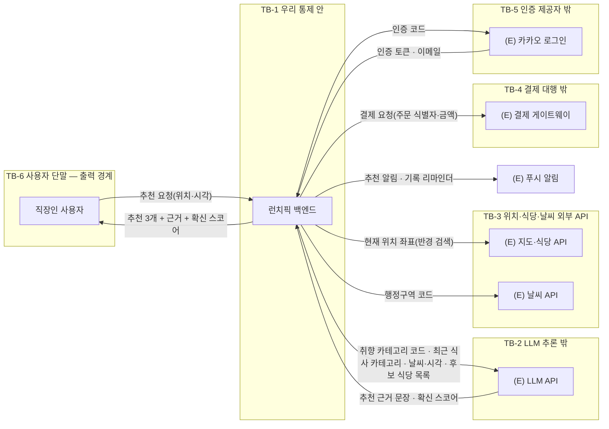
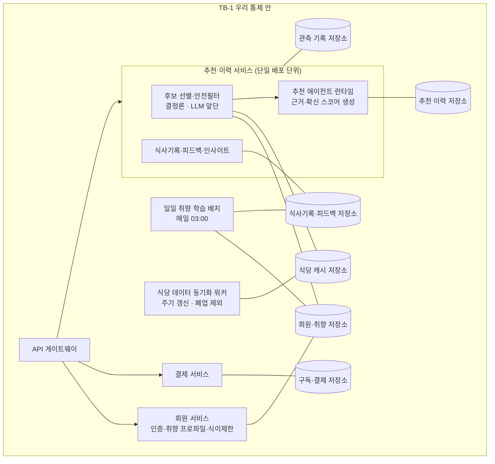

# 설계서 ② 논리 아키텍처 — 런치픽(LunchPick)

> **작성 순서 주의** — 이 설계서는 `③ 역할 계약서 → ⑤ 지식·도구 → ④ 패턴·시퀀스` 순서로 작성된 기록임.
> 2026-08-06 판정으로 번호가 `③ 패턴·시퀀스` · `④ 역할 계약서`로 바뀌었고 본문 기호는 새 번호로 고쳤으나,
> 작성 당시의 순서·순환(C-1·C-2) 서술은 옛 순서를 반영함.

> **가이드 절 번호 주의** — 2026-08-07에 가이드 구조가 8절 → 7절로 바뀜(종전 `4. 프롬프트에 없지만
> 반드시 채울 것`을 3절에 합침). 대응은 `종전 4절 → 3절` · `5절 → 4절` · `6절 → 5절` · `7절 → 6절` ·
> `8절 → 7절`임. 본문의 `가이드 N절` 표기는 새 번호로 고쳤으나, `4절 (1)`처럼 하위 번호까지 인용한
> 자리는 당시 표기를 그대로 남겼으므로 위 대응표로 읽음.

작성: 2026-08-06 · 작성자: 클로니(Agentic AI 아키텍트) · 가이드: [02-논리아키텍처-가이드](../guides/02-논리아키텍처-가이드.md)  
선행 입력: [① 목표·품질속성 카드](01-목표품질속성카드.md)

②는 **위치와 경계만** 정함. 에이전트 책임(④)·시퀀스 단계(③)·마스킹 방식(⑤)·배포 단위(⑦)는 여기에 없음.

---

## 1. 노드 수집 — 이벤트스토밍에서 옮겨 적기

새로 상상하지 않고 `ES:이벤트스토밍요약#마이크로서비스` 표에서 옮김.

| 종류 | 값 | 근거 출처 |
|------|-----|----------|
| 외부 액터 | 직장인 사용자(무료·프리미엄) | `ES:이벤트스토밍요약#유저플로우` |
| 외부 시스템 | (E)카카오 로그인 · (E)LLM API · (E)지도·식당 API · (E)날씨 API · (E)결제 게이트웨이 · (E)푸시 알림 | `ES:이벤트스토밍요약#MVP마이크로서비스` |
| 저장소 | 회원·취향 · 추천 이력 · 식사기록·피드백 · 식당 캐시 · 구독·결제 · 관측 기록 | `ES:이벤트스토밍요약#Aggregate` |

**옮기면서 찾은 것 — 이벤트스토밍에 없던 노드 3건**

| 노드 | 왜 필요한가 | 근거 |
|------|-----------|------|
| (E)푸시 알림 | 원탭 기록의 진입점이 알림임. 알림 없이는 `UFR-REC-070`이 성립 안 함 | `US:UFR-REC-070#입력요구사항` |
| 식당 캐시 저장소 | 지도 API 월 50만 원 상한과 폐업 식당 제외 필터를 매 요청에 걸 수 없음 | `BM:3-비용구조#변동비용`, `ES:규제표#식품위생법` |
| 관측 기록 저장소 | Q-2 근거 태그 일치율·G-3 하드필터 위반 0건을 사후 대조하려면 기록이 남아야 함 | `설계판단`(① Q-2·G-3) |

---

## 2. 전체 관계도 (1단계)

우리 시스템을 상자 하나로 두고 바깥과의 관계만 그림.

---

## 3. 신뢰 경계 판정

가이드 2절 판정 2의 3개 질문을 경계 후보마다 적용함.

| 경계 | 로그를 못 보나 | 권한 주체가 바뀌나 | 민감정보가 나가나 | 결론 |
|------|--------------|-----------------|-----------------|------|
| TB-2 (E)LLM API | 예 | 예 | **아니오 — 코드·카테고리로 변환 후 전송** | 경계임 · 라벨 `취향 카테고리 코드` |
| TB-3 (E)지도·날씨 | 예 | 예 | 예 — **위치 좌표** | 경계임 · 라벨 `현재 위치 좌표` |
| TB-4 (E)결제 GW | 예 | 예 | 예 — 결제 수단(우리는 보관 안 함) | 경계임 · 라벨 `결제 요청` |
| TB-5 (E)카카오 로그인 | 예 | 예 | 예 — 이메일 | 경계임 · 라벨 `인증 토큰·이메일` |
| TB-6 사용자 단말 | 예(단말 안) | 예 | 예 — 추천 근거 문장이 나감 | 경계임 · ⑥ 출력측 검사 자리 |
| 내부 서비스 간 호출 | 아니오 | 아니오 | 아니오 | 경계 아님 — 그냥 내부 연결 |

### TB-2가 이 설계의 핵심 판정임

**알레르기·식이제한 항목명은 TB-2를 넘지 않음.**

| 이유 | 근거 |
|------|------|
| 알레르기는 건강 관련 민감정보이며 별도 동의·별도 암호화 키 대상임 | `US:NFR-SYS-030#체크리스트`, `US:UFR-MBR-040#검증요구사항` |
| ① Q-3 안전성은 위반 0건을 요구함. LLM은 확률적이므로 필터를 맡길 수 없음 | ① 4절 Q-3 |
| 그래서 하드필터는 TB-2 **앞**에서 결정론적으로 끝냄. LLM은 **이미 걸러진 후보 목록**만 받음 | `설계판단` |

TB-2를 넘는 항목을 항목명 단위로 고정함. ⑤가 이 목록에 변환 지점을 걺.

| 넘어가는 것 | 형태 | 넘지 않는 것 |
|------------|------|------------|
| 취향 카테고리 코드 | 코드값(예: `KOR-SOUP`) | 알레르기·식이제한 항목명 |
| 최근 7일 식사 카테고리 이력 | 코드값 배열 | 식당명·메뉴명 원문 이력 |
| 날씨·요일·시각 | 코드값 | 정확 좌표(위도·경도) |
| 후보 식당 목록(필터 통과분) | 식당 ID + 표시명 | 회원 식별자 · 이메일 · 닉네임 |

`정확 좌표`가 TB-2를 넘지 않는 대신 TB-3은 넘음. **같은 위치 데이터가 경계 1곳만 넘음**을 확인함.  
가이드 3절 (1)의 "같은 데이터가 두 경계를 넘으면 마스킹이 두 번 필요" 조건에는 해당하지 않음.

---

## 4. 내부 구성도 (2단계)

노드 기준은 **따로 배포·실행되는가**임.

내부 실행 단위 6개 · 저장소 6개임. `후보 선별·안전필터`와 `추천 에이전트 런타임`은  
**같은 배포 단위 안의 다른 실행 순서 단계**이며 별도 배포하지 않음(5절 배치 결정 사유 1).

### 판정 J-6 — 추천 경로는 (E)지도·식당 API를 직접 부르지 않음

⑦이 ④과 ②의 불일치를 지적해 제가 확정한 판정임. 도식에서 `FIL`이 `DB4`(식당 캐시)만 잇고  
`(E)지도·식당 API`와 직접 잇지 않은 것은 **의도한 설계임.** 근거 2건임.

| 근거 | 내용 |
|------|------|
| 비용 | 지도 API 월 50만 원 상한(`BM:3-비용구조#변동비용`). 추천 요청마다 부르면 일 10,000건 × 30일이 그대로 호출량이 됨 |
| 응답시간 | ① G-1 `3초` 예산에서 외부 API 왕복 1홉을 뺌. 캐시 조회는 내부 저장소 접근임 |

(E)지도·식당 API를 부르는 곳은 **2군데뿐**임.

| 부르는 곳 | 언제 | 근거 출처 |
|----------|------|----------|
| 식당 데이터 동기화 워커(`SYNC`) | 주기 갱신 — 요청 경로 밖 | `설계판단` |
| 길찾기 단계 | 추천 **수락 이후**의 별도 경로임. 3초 예산 밖 | `US:UFR-REC-060#검증요구사항` |

(E)날씨 API는 행정구역 단위라 호출량이 작으므로 추천 경로에서 직접 부름. 다만 같은 행정구역·같은 시각에  
반복 호출하지 않도록 캐시를 앞에 두는 것이 낫고, 값은 ③가 타임아웃 표에서 소유함.

---

## 5. 배치 결정 사유 (①의 품질속성 3개 근거 · 3줄)

1. **Q-1 응답시간(3초)** — 추천·이력 서비스를 회원·결제와 분리해 피크 12 ~ 13시 부하를 독립  
   스케일링함. 단, 안전필터를 별도 서비스로 떼면 네트워크 홉이 늘어 3초 예산을 깎으므로  
   **같은 배포 단위 안에 둠**. 안전은 배포 분리가 아니라 ③의 호출 순서 강제로 보장함
2. **Q-3 안전성(위반 0건)** — 하드필터를 TB-2 경계 **앞**에 배치함. LLM 타임아웃·오류로  
   폴백이 발동해도 필터는 이미 끝나 있으므로 위반 경로가 생기지 않음
3. **Q-2 설명가능성(100%)** — 추천 이력 저장소(DB2)를 식사기록(DB3)과 분리해 근거 문장·확신  
   스코어·반영 컨텍스트 태그를 추천 건 단위로 남김. 사후 대조 없이는 100%를 검증할 수 없음

---

## 6. 외부 서비스 목록

| # | 외부 서비스 | 구분 | 대체 사유 | 접속 방식 | 경계 통과 데이터 | 근거 출처 | 후행 소비처 |
|---|-----------|------|----------|----------|----------------|----------|------------|
| E-1 | (E)LLM API | 실물 | — | HTTPS REST(공개 API) | 취향 카테고리 코드 · 식사 카테고리 이력 · 날씨·시각 · 후보 식당 목록 | `BM:3-비용구조#변동비용` | ⑤ 커넥터, ④ 사용 모델 |
| E-2 | (E)지도·식당 API | 실물 | — | HTTPS REST(쿼터 제한) | 현재 위치 좌표 | `PR:MVP정의#실현가능성` | ⑤ 커넥터, ⑦ 캐시 배치 |
| E-3 | (E)날씨 API | 실물 | — | HTTPS REST | 행정구역 코드 | `US:UFR-REC-020#검증요구사항` | ⑤ 커넥터 |
| E-4 | (E)카카오 로그인 | 실물 | — | OAuth 2.0 | 인증 코드 · 인증 토큰 · 이메일 | `US:UFR-MBR-010#입력요구사항` | ⑤ 커넥터, ⑦ 비밀값 |
| E-5 | (E)결제 게이트웨이 | **Mock** | 통신판매업 신고와 PG 심사가 론칭 전 과제로 남아 있어 이번 범위에서 실제 연동 불가 | 도구 연결 규격 커넥터(Mock) | 결제 요청(주문 식별자·금액) | `BM:6-GTM#Pre-launch` | ⑤ 커넥터, ⑦ 비밀값 |
| E-6 | (E)푸시 알림 | 실물 | — | 벤더 SDK | 회원 단말 토큰 · 알림 문구 | `US:UFR-REC-070#입력요구사항` | ⑤ 커넥터 |

Mock 1건 · 실물 5건임. `구분` 칸은 `실물`·`Mock` 2값만 씀.  
**이 목록의 값 주인은 ②임.** ⑤는 커넥터 단위로 펼쳐 쓰기만 하며, 구분을 바꿀 때는 ②를 고침(G-10).

### 실물 판정에 딸린 조건 1건

E-2는 실물이나 **폐업·영업 상태 필드를 제공하는지 확인되지 않음**(`ES:규제표#식품위생법`이 요구).  
제공하지 않으면 `SYNC` 워커가 걸러야 할 근거 데이터가 없어짐 → 9절 `[확인필요]` 1행.

---

## 7. 구성요소 대조 표

`ES:이벤트스토밍요약#MVP마이크로서비스`의 3개 서비스와 4절 내부 구성 6개를 대조함.

| 이벤트스토밍 서비스 | ② 내부 실행 단위 | 대응 | 사유 |
|-------------------|----------------|------|------|
| 회원 서비스 | 회원 서비스 | 1:1 | 그대로 유지 |
| 추천·이력 서비스 | 추천·이력 서비스(안전필터·에이전트 런타임·이력 3단계) + 일일 취향 학습 배치 | 1:2 | 배치는 매일 03:00에 따로 실행되므로 별도 실행 단위임(`US:UFR-REC-100`) |
| 결제 서비스 | 결제 서비스 | 1:1 | 그대로 유지 |
| (없음) | API 게이트웨이 | 신설 | `US:NFR-SYS-020#CDN·커넥션풀`이 진입 지점을 전제함 |
| (없음) | 식당 데이터 동기화 워커 | 신설 | 1절 발견 사항. 지도 API 단가 상한 + 폐업 제외 필터 |

**미대응 건수: 0건.** 신설 2건은 근거를 함께 적음.

---

## 8. 노드·간선 근거 대조표

| 노드·간선 | 근거 출처 |
|----------|----------|
| 직장인 사용자 → 백엔드 `추천 요청(위치·시각)` | `US:UFR-REC-010#입력요구사항` |
| 백엔드 → 사용자 `추천 3개 + 근거 + 확신 스코어` | `US:UFR-REC-010#검증요구사항`, `US:UFR-REC-020` |
| 백엔드 → (E)LLM API | `BM:3-비용구조#변동비용`(일 추천 10,000건) |
| 백엔드 → (E)지도·식당 API `현재 위치 좌표` | `US:UFR-REC-010#입력요구사항`, `US:UFR-REC-060` |
| 백엔드 → (E)날씨 API `행정구역 코드` | `US:UFR-REC-020#검증요구사항`(비 오는 날 예시) |
| 백엔드 → (E)결제 GW | `US:UFR-PAY-020#검증요구사항`(PG사 연동) |
| 백엔드 ↔ (E)카카오 로그인 | `US:UFR-MBR-010` |
| 백엔드 → (E)푸시 알림 | `US:UFR-REC-070`, `US:UFR-REC-090#리마인더` |
| TB-2 경계와 통과 항목 목록 | `설계판단` + `US:NFR-SYS-030#민감정보` |
| TB-3 경계 `현재 위치 좌표` | `US:NFR-SYS-040#체크리스트`(위치정보법) |
| 후보 선별·안전필터 단계 | `US:UFR-MBR-040#하드필터·페일세이프` |
| 일일 취향 학습 배치 | `US:UFR-REC-100#시나리오`(매일 03:00) |
| 식당 캐시 저장소 · 동기화 워커 | `BM:3-비용구조#변동비용`, `ES:규제표#식품위생법` |
| 관측 기록 저장소 | ① Q-2·G-3(사후 대조 필요) |
| 추천 이력 저장소 분리 | ① Q-2, `핵심솔루션:A8#감사추적` |

---

## 9. 후행 소비처

| 넘기는 값 | 받는 곳 | 강도 |
|----------|--------|------|
| TB-1 ~ TB-6과 경계 통과 데이터 항목 목록 | ⑤ 변환 지점 | HARD |
| TB-2가 넘지 않는 항목 4종(알레르기·좌표·회원 식별자·원문 이력) | ⑤ 민감 필드 분류, ⑥ 출력측 검사 | HARD |
| 전체 관계도의 참여 주체(액터·외부 6종) | ③ 시퀀스 참여 주체 | HARD |
| 내부 실행 단위 6개 · 저장소 6개 | ⑦ 이미지 분할 단위, ⑦ 저장소 배치 | HARD |
| 외부 서비스 목록 E-1 ~ E-6 | ④ 사용 도구 후보 | SOFT |
| Mock·실물 구분(값의 주인은 ②) | ⑤ 목록 전개 | 소유 관계 |
| 안전필터가 LLM 앞이라는 배치 | ④ 에이전트 권한, ③ 단계 순서 | HARD |

---

## 10. 기획 산출물 대조 기록

| 기획 항목 ID | 반영 여부 | 반영 위치 | 사유 |
|-------------|----------|----------|------|
| `ES:이벤트스토밍요약#MVP마이크로서비스` | 반영 | 4·7절 | 3개 서비스를 그대로 옮기고 2개 신설 |
| `ES:이벤트스토밍요약#컨텍스트맵` | 반영 | 4절 간선 | 회원↔추천↔결제 동기 호출 유지 |
| `ES:규제표#식품위생법` | 부분반영 | 6절 E-2 조건, 9절 | 영업 상태 필드 제공 여부 미확인 |
| `ES:규제표#위치정보법` | 반영 | 3절 TB-3 | 좌표가 경계를 넘음을 라벨로 표기 |
| `ES:규제표#전자상거래법` | 범위외 | — | 결제 화면 문구는 ⑥·화면 사양 소관 |
| `US:NFR-SYS-020` | 반영 | 4절 게이트웨이, 5절 사유 1 | 피크 독립 스케일링 |
| `US:NFR-SYS-030` | 부분반영 | 3절 TB-2 | 암호화 방식 자체는 ⑦ 소관 |
| `US:UFR-MBR-040` | 반영 | 4절 FIL, 5절 사유 2 | 하드필터를 LLM 앞에 배치 |
| `US:UFR-REC-100` | 반영 | 4절 BAT | 배치를 별도 실행 단위로 |
| `US:UFR-REC-110/120` | 반영 | 4절 HIS | 이력·인사이트를 추천과 병합(ES 결정 유지) |
| `BM:3-비용구조#변동비용` | 반영 | 1·6절 | 지도 API 상한이 캐시 신설 근거 |
| `BM:6-GTM#Pre-launch` | 반영 | 6절 E-5 | PG를 Mock으로 판정한 근거 |
| `PR:MVP정의#실현가능성` | 반영 | 6절 E-1·E-2 | 외부 API 조합 전제 |

13건임.

---

## 11. 미확정 항목

| `[확인필요]` 태그 | 무엇이 없나 | 누구에게 되묻나 | 안 오면 무엇이 막히나 |
|------------------|-----------|---------------|--------------------|
| `[확인필요: 식당 영업 상태 필드]` | E-2가 폐업·영업중 상태를 제공하는지 확인 안 됨 | 도구 연동(커넥니) | `SYNC` 워커의 폐업 제외 필터 근거가 없어짐. `ES:규제표#식품위생법` 미준수 |
| ~~`[확인필요: 식당·메뉴 임베딩 저장소 필요 여부]`~~ | **해소됨(2026-08-06)** — ⑤가 `MVP 벡터 색인 없음`으로 판정함. 반경 500m 후보가 수십 개라 색인 비용이 이득을 넘지 않음(⑤ 2절 K-1) | — | — |
| `[확인필요: 관측 기록 보관 기간]` | 개인정보 접근 로그 6개월(`US:NFR-SYS-030`)이 관측 기록에도 적용되는지 불명 | 도구 연동(커넥니) | ⑦ 저장소 배치 용량 산정이 막힘 |
| `[확인필요: 식당 식재료·알레르겐 정보 원천]` | E-2가 식재료·알레르겐 정보를 주는지 확인 안 됨. 기획 산출물 전체에 원천이 없음(⑤ 6절) | 도구 연동(커넥니)·기획(도그냥) | 4절 `FIL`(안전필터)이 무엇을 보고 걸러야 할지가 없어짐. ① G-3 측정 불가 |
| `[확인필요: 취향 벡터의 정의]` | `취향 벡터`가 US·BM·ES 세 문서에 나오는데 임베딩인지 점수 배열인지 정의가 없음(⑤ 16절) | 기획(피오)·지식·데이터(지식니) | ⑦이 회원·취향 저장소(DB1)의 종류를 못 정함 |

**`[확인필요]` 태그 건수: 3건**(해소 1건 제외, 신규 2건 추가로 최초 3건 → 현재 3건).  
신규 2건은 ⑤가 찾아 되돌려 온 것이며, ②의 노드·경계 자체는 바뀌지 않고 **저장소 종류와 필터 근거 데이터**가  
미확정으로 남음.

---

## 12. 가이드 적용 기록

`guides/02-논리아키텍처-가이드.md`를 실제로 쓰면서 막힌 곳임.

| # | 가이드 절 | 무엇이 문제인가 | 어떻게 우회했나 | 가이드 수정 제안 |
|---|----------|---------------|---------------|----------------|
| G2-1 | 2절 판정 2(경계 3질문) | **3질문이 "민감정보가 나가는가"까지만 물음.** 우리 케이스의 진짜 판단은 "나가지 않게 하려면 **무엇을 무엇으로 바꿔** 보내나"였음. 알레르기를 코드값으로도 안 보내고 아예 뺀다는 결정이 3질문으로는 안 나옴 | 3절에 `TB-2를 넘는 것 / 넘지 않는 것` 표를 항목명 단위로 따로 만듦 | 판정 2에 4번째 질문 — "경계를 넘기지 **않기로** 한 항목이 있는가? 있으면 항목명을 표로 따로 적음" |
| G2-2 | 2절 판정 3(실물·Mock) | **실물이지만 필요한 필드를 주는지 모르는 경우**의 칸이 없음. E-2 지도 API는 실물인데 식재료·영업상태 필드를 주는지 확인 안 됨 | `구분`은 `실물`로 두고 6절에 `실물 판정에 딸린 조건` 절을 신설함 | 판정 3에 "실물이어도 **쓰려는 필드를 주는지** 따로 확인함. 안 주면 실물이지만 그 경로는 Mock임" 1줄 |
| G2-3 | 4절 (3) 이벤트스토밍 옮겨 적기 | 지침은 "옮기면서 빠진 것이 있으면 그게 진짜 발견"으로 끝남. **찾은 노드를 어디에 기록하는지**가 없음 | 1절에 `이벤트스토밍에 없던 노드 3건` 표를 신설하고 7절 구성요소 대조 표에 `신설` 행으로 남김 | 4절 (3)에 "찾은 노드는 **구성요소 대조 표의 `신설` 행**으로 남기고 근거를 함께 적음" 1줄 |
| G2-4 | 7절 점검표 | 점검표가 `기획 산출물 대조 기록` 유무만 봄. **미대응 건수가 0인지**는 세지만 신설 건수는 세지 않음 | 7절에서 미대응 0건·신설 2건을 함께 적음 | 점검표에 "`구성요소 대조 표`의 **신설 건수**가 숫자로 적혀 있고 각 신설 행에 근거가 있음" 1줄 |
| G2-5 | 전반 | **가이드 4절 예시 2건이 모두 기업 내부 시스템 연동**임(KT 레거시·마이데이터 기관). 소비자 앱은 외부 API가 전부 공개 SaaS라 "권한 미확보로 Mock" 같은 판정이 거의 안 나옴 | Mock 판정 근거를 `사업 신고 미완료`(통신판매업·PG 심사)에서 찾음 | 5절에 "소비자 앱은 Mock 근거가 **권한**보다 **인허가·심사 일정**에서 나옴" 1줄을 넣기 |
