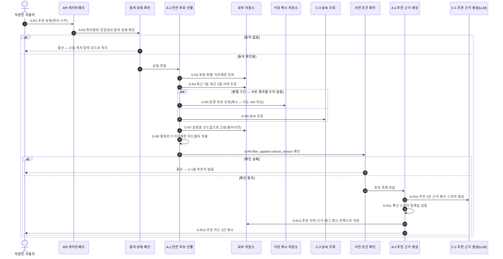
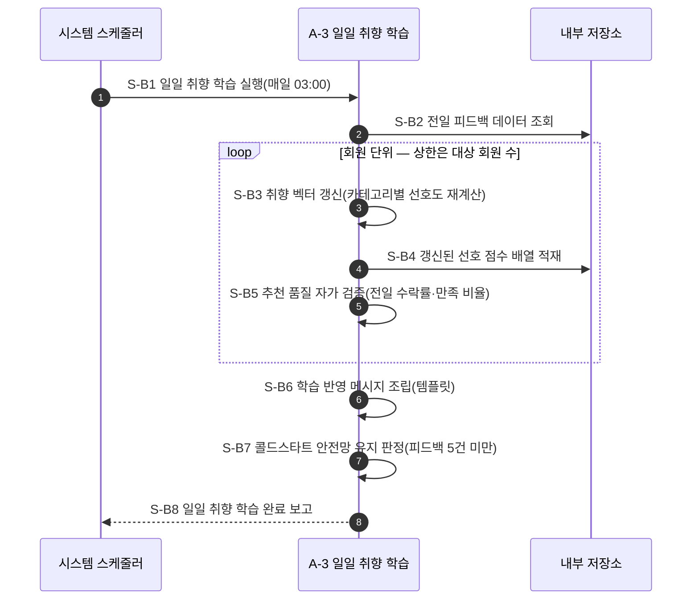
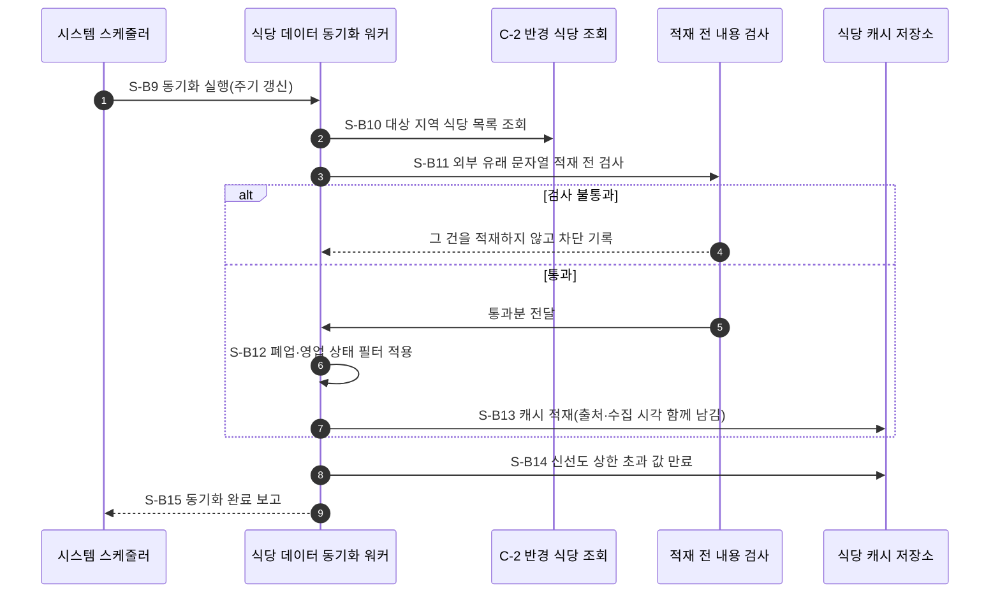
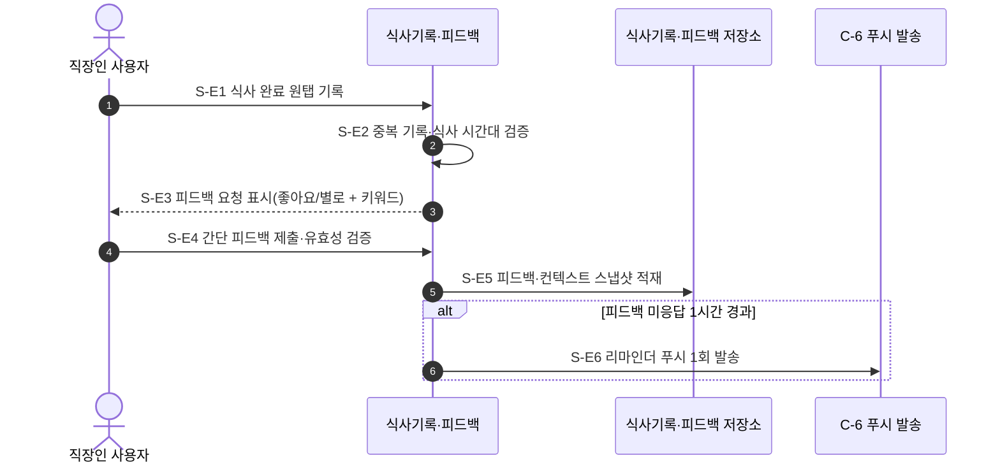

# 설계서 ④ 오케스트레이션 패턴 + 시퀀스 설계 — 런치픽(LunchPick)

작성: 2026-08-06 · 작성자: 플로니(오케스트레이션 엔지니어) · 가이드: [04-패턴시퀀스설계-가이드](../guides/04-패턴시퀀스설계-가이드.md)  
선행 입력(HARD): [① 목표·품질속성 카드](01-목표품질속성카드.md) · [② 논리 아키텍처](02-논리아키텍처.md) ·  
[③ 에이전트 역할 계약서](03-에이전트역할계약서.md) **3판** · CYCLE C-2: [⑤ 지식·도구 설계](05-지식도구설계.md) **2판**

> **타임아웃 값의 단일 출처는 본 산출물임.**

**쉬운 말 먼저** — `오케스트레이션`은 여러 실행 단위의 순서를 지휘하는 것임. `트리거`는 처리를 시작시키는  
계기임. `직렬`은 차례로 실행, `병렬`은 동시에 실행임. `최악값`은 재시도까지 다 겹쳤을 때의 소요시간임.

④가 쓰지 않는 것 — 신뢰 경계 판정(②) · 민감 필드 변환 방식(⑤) · 관측 스팬·비용 상한(⑥) ·  
배포 단위·포트(⑦). ①②③⑤ 값은 **인용만** 하고 바꾸지 않음.

---

## 1. 트리거 가름 (가이드 2-1)

시퀀스는 시작 계기별로 따로 그림. 섞으면 예산이 엉킴. 런치픽에는 3종이 있음.

| 트리거 | 무엇인가 | 단계 식별자 | 예산 기준 | 근거 출처 |
|--------|---------|------------|----------|----------|
| **동기 요청 `S-R`** | 사용자가 앱을 열어 추천을 기다림 | `S-R1` ~ `S-R13` | **3초**(p95, 총 예산) | `US:NFR-SYS-010#체크리스트` |
| **스케줄 배치 `S-B`** | 정해진 주기에 자동 실행됨. **독립 배치 2건** — ㉮ 일일 취향 학습(매일 03:00) `S-B1` ~ `S-B8` · ㉯ **식당 데이터 동기화**(주기 갱신) `S-B9` ~ `S-B15` | `S-B1` ~ `S-B15` | ㉮ `[확인필요: 배치 완료 목표시간]` · ㉯ 3초 예산 밖(4절 판정) | `US:UFR-REC-100#시나리오` · `설계판단`(② 4절 SYNC 워커) |
| **이벤트 `S-E`** | 식사 기록·피드백 제출과 미응답 1시간 후 리마인더 | `S-E1` ~ `S-E6` | 기록 API **200ms**(p95) · 리마인더 **1시간 후 1회** | `US:NFR-SYS-010#체크리스트` · `US:UFR-REC-090#검증요구사항` |

### 식당 데이터 동기화를 4번째 트리거로 두지 않고 `S-B`에 넣은 판정 (⑥ R-2)

⑥이 "4번째 트리거 검토"를 요청했으나, **새 트리거를 만들지 않고 `S-B`의 두 번째 배치로 둠.**  
판정 근거 3건임.

| # | 근거 |
|---|------|
| 1 | ② 4절이 이 워커를 `주기 갱신`으로 적었음. **정해진 주기에 자동 실행됨**이므로 1절 표의 `스케줄 배치` 정의에 그대로 맞음. 사람이 눌러 기다리는 것도(동기 요청) 앞 단계 완료 신호로 시작하는 것도(이벤트) 아님 |
| 2 | 규격이 단계 식별자를 `S-R n`·`S-B n`·`S-E n` **3종으로 한정함.** 4번째 접두어를 신설하면 규격을 벗어남. 성격이 같은 것을 새 트리거로 만들 이유가 없음 |
| 3 | 예산 성격이 배치와 같음 — **사용자가 기다리지 않으므로 3초 예산 밖**임. 동기 요청과 섞이면 예산이 엉킴 |

**두 배치를 한 도식에 섞지 않음** — 실행 시각과 주기가 다르므로 3-2절에 ㉮·㉯를 나눠 그림.  
트리거는 3종이고 도식은 4장이 됨(17절 점검표에 사실대로 적음).

### 배치 완료 목표값을 찾은 결과

원문을 찾았으나 **완료 목표시간 자체는 없음.** 지어내지 않고 `[확인필요]`로 둠.  
다만 상한을 **도출**할 근거는 있음 — 배치는 03:00에 시작하고(`US:UFR-REC-100#시나리오`),  
갱신 결과는 점심시간 11 ~ 13시 추천에 쓰임(`PR:MVP정의#주제설명`).  
따라서 **03:00 ~ 11:00의 8시간**이 도출 상한임(`도출` 태그). 목표값은 이 상한보다 짧아야 하나  
그 값이 원문에 없으므로 확정하지 않음.

---

## 2. 패턴 비교와 선택 (가이드 2-2)

결정 트리를 실제로 밟음. **Q1 단계 순서가 미리 정해지는가 → 예 → 고정 워크플로우.**

Q1이 `예`인 근거는 취향이 아니라 안전 요건임 — ⑤ 7절이 "C-1(LLM)이 하드필터보다 먼저 불리면  
① G-3 위반"이라 적었고 커넥터 검증을 **엄격 순서 모드**로 두었음. 즉 **순서가 곧 안전 요건**이므로  
모델이 순서를 고르게 할 수 없음. Q2 ~ Q3으로 내려가지 않고 Q1에서 끝남.

| # | 패턴 후보 | 장점 | 단점 | 채택 |
|---|----------|------|------|------|
| P-1 | **고정 워크플로우**(순서를 미리 못 박음) | 필터 → LLM 순서를 구조로 보장함. 판단 호출이 없어 3초 예산을 덜 먹음. 단계가 고정이라 ⑥이 그대로 겹쳐 그림 | 새 분기가 생기면 그래프를 고쳐야 함 | **채택** |
| P-2 | 라우터(모델이 첫 갈림길을 고름) | 질문 유형이 늘어도 경로 추가가 쉬움 | ⑤가 판정한 경로는 K-1 하나로 고정임(화면이 질문을 던짐). 갈림길 판단에 모델 호출 1회가 더 붙어 예산을 깎음. **모델이 필터를 건너뛸 경로가 생김** | 미채택 |
| P-3 | 서브에이전트(하위 작업을 맡기고 결과만 받음) | 후보 선별과 근거 생성을 독립 확장 가능 | ③이 A-1·A-2를 같은 배포 단위 안의 순서 단계로 둠(② 5절 사유 1). 홉이 늘어 3초 예산을 깎음 | 미채택 |
| P-4 | 핸드오프(제어권을 통째로 넘김) | 대화형 전환에 강함 | 런치픽에 자유 입력창이 없음(⑤ 1절). 넘길 대화 맥락이 없음 | 미채택 |
| P-5 | 스킬(작업별 지침 묶음을 필요할 때 불러 씀) | 지침이 늘어도 컨텍스트가 안 붐빔 | LLM 호출이 A-2 1건뿐이고 지침도 1종임. 불러 쓸 대상이 없음 | 미채택 |

### 선택 근거 (①의 우선 품질속성 + BM UVP 인용)

| 근거 | 인용 |
|------|------|
| **Q-3 안전성**(하드필터 위반 0건) — 순서를 구조로 못 박아야 위반 경로가 생기지 않음. P-2는 모델이 순서를 고르므로 이 보장을 잃음 | ① 4절 Q-3 · `US:UFR-MBR-040#검증요구사항` |
| **Q-1 응답시간**(p95 3초) — P-2 ~ P-3은 판단 호출이나 네트워크 홉을 1건 이상 더함. 9절 예산표의 여유가 320ms뿐이라 추가 홉을 감당하지 못함 | ① 4절 Q-1 · `US:NFR-SYS-010#체크리스트` |
| **BM UVP** "어제의 기억과 오늘의 상황으로 이유 있는 추천 3개"를 내려면 이력·날씨·취향을 **정해진 순서로 모아** 근거 문장에 실어야 함. 순서가 UVP의 일부임 | `BM:1-UVP#핵심가치` |

**패턴과 프레임워크를 섞지 않음.** 위 표는 패턴만 올림. 구현 수단(그래프 실행 프레임워크)은  
구현 단계에서 고르며 ④는 지정하지 않음.

### 분기가 있는데도 고정 워크플로우인 이유

`S-R`에는 분기가 3개 있음(콜드스타트 · 확신 스코어 미달 · 후보 0건). 그러나 세 분기 모두  
**결정론적 조건**으로 갈림 — 누적 피드백 5건 미만(`US:UFR-REC-030#검증요구사항`) · 스코어 임계값  
미달(`ES:02#추천생성`) · 후보 건수 0. 모델이 고르는 갈림길이 아니므로 라우터가 아니고,  
고정 워크플로우의 **조건부 간선**임(`설계판단`).

---

## 3. 시퀀스 도식 — 트리거별 1장

### 3-1. `S-R` 동기 요청 — 오늘의 추천 조회

`ES:02#추천생성`의 순서를 옮겨 씀. 상상해 넣은 단계는 없음.

**3판에서 두 곳이 바뀜** — `S-R2` 동의 상태 확인이 신설되어 뒤 단계가 1씩 밀림(D-18·D-20),  
그리고 `S-R5`가 **(E)지도·식당 API 호출에서 식당 캐시(DB4) 조회로** 바뀜(J-6 · D-3).



### 3-2. `S-B` 스케줄 배치 — 일일 취향 학습

`ES:05#일일취향학습`을 옮겨 씀. **배치 경로에 외부 모델 호출이 0건임**(J-7 확정).  
`ES:05#20~21행`의 취향 임베딩 갱신 LLM 호출은 범위외로 내려갔고, `S-B4`는 결정론 단계임.



**`(E)LLM API` participant를 지웠음.** 배치 경로의 외부 모델 호출은 **0건**이며, 유일한 LLM  
호출은 `S-R10`(동기 경로)임. 따라서 배치는 LLM API 월 상한을 먹지 않음(`BM:3-비용구조#변동비용`).

### 3-3. `S-B` ㉯ 식당 데이터 동기화 (주기 갱신) — ⑥ R-2로 신설

②의 `식당 데이터 동기화 워커`를 시퀀스로 옮김. **`C-2 반경 식당 조회`의 사용 주체가 이 경로임**  
(J-6 이후 추천 경로는 캐시를 읽고 지도 API를 부르지 않음).



**`S-B11`이 ⑥ G-2의 근본 차단 지점임.** ⑥은 단계를 신설할 수 없어 읽기 시점(`S-R5`)에 임시로  
걸어 두었으나, 캐시에 이미 들어온 값은 읽기 검사로 지울 수 없음. 적재 전에 막는 자리를 ④가 만듦.

**이 경로는 3초 예산 밖임** — 사용자가 기다리지 않음. 갱신 주기 값은 ⑤가 이미  
`[확인필요: 식당 캐시 갱신 주기]`로 신설했으므로 **중복 신설하지 않고 인용만** 함.

### 3-3. `S-E` 이벤트 — 식사 기록·피드백·리마인더

`ES:04#식사기록`을 옮겨 씀.



**이벤트 경로와 배치 경로는 저장소를 통해서만 이어짐**(J-9 확정). `S-E5`는 A-3을 깨우지 않고  
식사기록·피드백 저장소에 적재하며, A-3은 03:00에 `S-B2`로 그 저장소를 읽음  
(③ A-3 사용 도구가 이미 `식사기록·피드백 저장소 읽기`임).  
**두 경로의 예산이 섞이지 않는 이유가 이것임** — 이벤트가 배치를 기동시키지 않으므로  
`S-E` 200ms 예산과 `S-B` 배치 예산이 서로를 깎지 않음.

---

## 4. 시퀀스 단계 표

도식의 `S-` 단계 34개와 행 수가 같음(`S-R` 13 · `S-B` **15** · `S-E` 6).  
참여 주체는 ②의 구성 요소, 처리 노드는 ③의 에이전트로 한정함.

| 단계 | 트리거 | 참여 주체(② 인용) | 행위 | 종료 상태 | 근거 출처 |
|------|--------|------------------|------|----------|----------|
| S-R1 | 동기 요청 | API 게이트웨이 | 추천 요청 수신·인증 | 요청 접수 | `US:UFR-REC-010#입력요구사항` |
| S-R2 | 동기 요청 | API 게이트웨이(사전 조건 확인) | **위치정보 수집 동의·민감정보 별도 동의 상태 확인** | 통과 / **동의 없음으로 중단** | `US:NFR-SYS-040#체크리스트` · `US:UFR-MBR-030#처리결과` |
| S-R3 | 동기 요청 | 후보 선별·안전필터 | 회원·취향·식이제한 조회 | 프로파일 확보 | `US:UFR-REC-010#검증요구사항` |
| S-R4 | 동기 요청 | 후보 선별·안전필터 | 최근 7일 식사 이력·최근 3일 추천 식당 조회 | 이력 확보 | `ES:02#컨텍스트수집` |
| S-R5 | 동기 요청 | 후보 선별·안전필터 · **식당 캐시 저장소(DB4)** | 반경 후보 조회 — **(E)지도·식당 API를 부르지 않음**(J-6) | 원시 후보 확보 | `ES:02#컨텍스트수집` · `BM:6-GTM#Launch` · `설계판단`(J-6) |
| S-R6 | 동기 요청 | 후보 선별·안전필터 · (E)날씨 API | 날씨 조회 | 날씨 코드 확보 | `ES:02#컨텍스트수집` |
| S-R7 | 동기 요청 | 후보 선별·안전필터 | 낱말을 코드값으로 고정 | 코드 확정 | `설계판단`(⑤ 1절 K-5 · ③ J-3) |
| S-R8 | 동기 요청 | 후보 선별·안전필터 | 알레르기·식이제한 하드필터 적용 | 후보 확정 / **후보 0건** | `US:UFR-MBR-040#검증요구사항` |
| S-R9 | 동기 요청 | 추천·이력 서비스(사전 조건 확인) | `filter_applied`·`filter_ruleset_version` 확인 | 통과 / **확인 실패로 중단** | `설계판단`(⑤ 5절 · ③ A-2 중단 조건 ②) |
| S-R10 | 동기 요청 | 추천 에이전트 런타임 · (E)LLM API | 추천 3건의 근거 문장·확신 스코어 생성 | 카드 3건 초안 / **실패 시 L-2 폴백** | `US:UFR-REC-020#검증요구사항` |
| S-R11 | 동기 요청 | 추천 에이전트 런타임 | 확신 스코어 임계값 검증 | 통과 / **미달로 안전망 전환** | `ES:02#추천생성` |
| S-R12 | 동기 요청 | 추천 에이전트 런타임 | 추천 이력·근거·컨텍스트 태그 저장 + **원시 컨텍스트 보존**(D-16) | 저장 완료 | `핵심솔루션:A8#상세설명` · `설계판단`(D-16) |
| S-R13 | 동기 요청 | API 게이트웨이 | 추천 카드 3건 제시 | 응답 완료 | `US:UFR-REC-010#처리결과` |
| S-B1 | 스케줄 배치 | 일일 취향 학습 배치 | 매일 03:00 학습 실행 | 배치 기동 | `US:UFR-REC-100#시나리오` |
| S-B2 | 스케줄 배치 | 일일 취향 학습 배치 | 전일 피드백 데이터 조회 | 피드백 목록 확보 / **0건이면 종료** | `ES:05#일일취향학습` |
| S-B3 | 스케줄 배치 | 일일 취향 학습 배치 | 취향 벡터 갱신(카테고리별 선호도 재계산) | 회원 1명 갱신 | `US:UFR-REC-100#검증요구사항` |
| S-B4 | 스케줄 배치 | 일일 취향 학습 배치 | 갱신된 선호 점수 배열 적재(모델 호출 없음 — J-7) | 회원 1명 적재 완료 | `ES:05#19행` · `설계판단`(J-7) |
| S-B5 | 스케줄 배치 | 일일 취향 학습 배치 | 추천 품질 자가 검증(전일 수락률·만족 비율) | 검증값 산출 | `US:UFR-REC-100#검증요구사항` |
| S-B6 | 스케줄 배치 | 일일 취향 학습 배치 | 학습 반영 메시지 조립(템플릿) | 메시지 확보 | `US:UFR-REC-100#검증요구사항` · `설계판단`(③ J-5) |
| S-B7 | 스케줄 배치 | 일일 취향 학습 배치 | 콜드스타트 안전망 유지 판정(피드백 5건 미만) | 안전망 유지 대상 확정 | `US:UFR-REC-030#검증요구사항` |
| S-B8 | 스케줄 배치 | 일일 취향 학습 배치 | 완료 보고(갱신 회원 수) | 배치 종료 | `ES:05#일일취향학습` |
| S-B9 | 스케줄 배치 ㉯ | 식당 데이터 동기화 워커 | 주기 갱신 실행 | 워커 기동 | `설계판단`(② 4절 SYNC 워커) · ⑤ `[확인필요: 식당 캐시 갱신 주기]` |
| S-B10 | 스케줄 배치 ㉯ | 식당 데이터 동기화 워커 · (E)지도·식당 API | 대상 지역 식당 목록 조회 | 원시 목록 확보 | `설계판단`(⑤ 7절 C-2 사용 주체) |
| S-B11 | 스케줄 배치 ㉯ | 식당 데이터 동기화 워커(적재 전 내용 검사) | **외부 유래 표시명·메뉴명 문자열 검사** | 통과 / **차단 후 적재 제외** | `설계판단`(⑥ G-2 근본 차단 지점 · R-2) |
| S-B12 | 스케줄 배치 ㉯ | 식당 데이터 동기화 워커 | 폐업·영업 상태 필터 적용 | 영업 중 목록 확정 | `ES:규제표#식품위생법` |
| S-B13 | 스케줄 배치 ㉯ | 식당 데이터 동기화 워커 · 식당 캐시 저장소 | 캐시 적재 + 출처·수집 시각 표기 | 적재 완료 | `설계판단`(⑥ G-2 출처 표기) |
| S-B14 | 스케줄 배치 ㉯ | 식당 데이터 동기화 워커 · 식당 캐시 저장소 | 신선도 상한 초과 값 만료 | 만료 처리 완료 | `설계판단`(⑥ G-2 신선도 상한) |
| S-B15 | 스케줄 배치 ㉯ | 식당 데이터 동기화 워커 | 동기화 완료 보고 | 배치 종료 | `설계판단`(② 4절 SYNC 워커) |
| S-E1 | 이벤트 | 식사기록·피드백 | 식사 완료 원탭 기록 | 기록 접수 | `US:UFR-REC-070#입력요구사항` |
| S-E2 | 이벤트 | 식사기록·피드백 | 중복 기록·식사 시간대 검증 | 저장 / **중복으로 안내** | `US:UFR-REC-070#검증요구사항` |
| S-E3 | 이벤트 | 식사기록·피드백 | 피드백 요청 표시 | 요청 노출 | `ES:04#간단피드백` |
| S-E4 | 이벤트 | 식사기록·피드백 | 피드백 제출·유효성 검증 | 저장 / **스킵 시 중립 적용** | `US:UFR-REC-090#검증요구사항` |
| S-E5 | 이벤트 | 식사기록·피드백 · 식사기록·피드백 저장소 | 피드백·컨텍스트 스냅샷 적재(A-3을 깨우지 않음 — J-9) | 적재 완료 | `ES:04#간단피드백` · `설계판단`(J-9) |
| S-E6 | 이벤트 | 식사기록·피드백 · (E)푸시 알림 | 미응답 1시간 후 리마인더 1회 발송 | 발송 완료 | `US:UFR-REC-090#검증요구사항` |

**34행 · 도식 단계 34개 — 일치함**(4판에서 `S-B` 8 → 15로 7개 늘어 27 → 34).

---

## 5. 사전 조건 확인 지점

**사전 조건 확인 노드가 2개임** — `S-R2` 동의 상태 확인(규제)과 `S-R9` 필터 실행 확인(안전).  
3판에서 `S-R2`를 신설함(D-18·D-20).

### 5-1. `S-R2` 동의 상태 확인 — 규제 항목

온보딩에서 1회 받는 동의(`US:UFR-MBR-030`)와 **별개로, 요청 시점의 동의 상태**를 확인하는 자리임.  
동의는 철회될 수 있으므로(`US:UFR-MBR-030#검증요구사항`의 철회 방법 안내) 1회 획득이 상시 유효를  
뜻하지 않음. 저장소 조회 **전**에 두어 동의 없는 상태로 좌표·알레르기 항목명을 읽지 않게 함.

| 확인 항목 | 통과 조건 | 실패 시 분기 | 근거 출처 |
|----------|----------|-------------|----------|
| 위치정보 수집 동의 | 동의 상태가 유효함 | 좌표를 쓰지 않고 중단 → **수동 위치 입력 모드**로 착지 | `US:NFR-SYS-040#체크리스트` · `US:UFR-MBR-030#처리결과` |
| 민감정보(알레르기) 별도 동의 | 식이제한이 설정된 회원이면 별도 동의가 유효함 | 알레르기 항목명을 읽지 않고 중단. **필터 없이 진행하지 않음** — 필터 미적용은 ① G-3 위반이므로 추천을 내지 않음 | `US:NFR-SYS-040#체크리스트` · `US:UFR-MBR-040#검증요구사항` |

**"필터 없이 진행"을 택하지 않은 이유 1줄** — `US:UFR-MBR-040#처리결과`는 식이제한 **미설정** 시  
필터 없이 진행을 허용하나, 이는 `설정하지 않은 회원`의 경우임. **설정했는데 동의가 확인되지 않는 것**은  
다른 상태이며, 필터를 건너뛰면 G-3 위반 경로가 생김. 그래서 중단 쪽으로 무너뜨림(`설계판단`).

### 5-2. `S-R9` 필터 실행 확인 — 안전 요건

⑤ 5절이 "필터가 실제로 실행됐는지 입출력 키 이름만으로는 구분되지 않음"을 공백으로 지목하고  
키 2종을 신설했으므로, ④는 그 검사를 **단계로 승격**함.

| 확인 항목 | 통과 조건 | 실패 시 분기 | 근거 출처 |
|----------|----------|-------------|----------|
| `filter_applied` | `true` | C-1을 **호출하지 않고** 중단. 오류로 착지 | `설계판단`(⑤ 5절 · ③ A-2 중단 조건 ②) |
| `filter_ruleset_version` | 빈 값이 아님 | 같음 | `설계판단`(⑤ 5절) |
| 단계 순서 | `S-R8` 하드필터가 `S-R10` C-1보다 **앞**에 실행됨 | 순서 역전은 ① G-3 위반이므로 실행 자체를 막음 | `US:UFR-MBR-040#검증요구사항` · ① 3절 G-3 |

**순서가 곧 안전 요건임.** ⑤ 7절 커넥터 검증이 엄격 순서 모드(`ToolCallAccuracy = 1.0`)이므로  
순서가 어긋나면 인자가 다 맞아도 0점임. ④는 `S-R8 → S-R9 → S-R10`을 고정 간선으로 둠.  
2중 방어임 — ④가 순서로 막고, ⑤의 C-1 커넥터가 입력 검사로 다시 막음.

---

## 6. 단계 간 데이터 형식

**키 이름을 다시 나열하지 않음.** ③의 입출력 형식을 식별자로 인용함(가이드 3절 규칙).  
③이 키 이름의 단일 출처이므로 여기서 재나열하면 두 문서가 갈라짐.

| 간선 | 송신 | 수신 | 전달 키 집합(③ 인용) | 필수 | 근거 출처 |
|------|------|------|---------------------|------|----------|
| E-1 | API 게이트웨이 | A-1 | `③ 안전 후보 선별 · 입력` | 필수 | `US:UFR-REC-010#입력요구사항` |
| E-2 | A-1 | 사전 조건 확인 | `③ 안전 후보 선별 · 출력` | 필수 | `US:UFR-REC-010#검증요구사항` |
| E-3 | 사전 조건 확인 | A-2 | `③ 안전 후보 선별 · 출력`(무변경 통과) | 필수 | `설계판단`(⑤ 5절) |
| E-4 | A-2 | API 게이트웨이 | `③ 추천 근거 생성 · 출력` | 필수 | `US:UFR-REC-020#처리결과` |
| E-5 | 스케줄러 | A-3 | `③ 일일 취향 학습 · 입력` | 필수 | `US:UFR-REC-100#시나리오` |
| E-6 | A-3 | 스케줄러 | `③ 일일 취향 학습 · 출력` | 필수 | `US:UFR-REC-100#처리결과` |
| E-7 | 식사기록·피드백 | 식사기록·피드백 저장소 | 저장소 적재 — **에이전트 간 간선이 아니므로 ③의 계약 대상이 아님** | 필수 | `ES:04#간단피드백` · `설계판단`(J-9) |

**E-7이 1판에서 `[확인필요]`였던 자리이며 J-9로 닫힘.** 1판은 `ES:04#간단피드백`의  
"`추천업무`로 학습 데이터 전달"을 **A-3으로 가는 간선**으로 읽었고, ③ A-3 입력이 배치용 2키뿐이라  
계약이 없다고 판단했음. J-9 판정은 **A-3이 스케줄 배치이므로 이벤트가 A-3을 깨우지 않는다**는 것이며,  
데이터는 저장소를 거쳐 03:00에 읽힘. 따라서 **③은 고치지 않음** — A-3 입력이 배치용 2키인 것이 맞음.

---

## 7. 상태 스키마

`A03`의 3출처로 필드 위치를 판정함 — 요청마다 바뀌는 값은 `Runtime Context`,  
단계 간에 흐르는 값은 `State`, 세션을 넘길 값은 `Store`임.  
씨앗은 ③ 5절의 `공유` 키 8종임. **필드마다 갱신 주체를 1개만 둠.**

| 필드 | 타입 | 위치 | 갱신 주체(1개) | 갱신 방식 | 근거 출처 |
|------|------|------|---------------|----------|----------|
| `member_ref` | str | Runtime Context | API 게이트웨이 | 덮어쓰기(요청 시 1회) | `③ 안전 후보 선별 · 입력` |
| `geo_point` | dict | Runtime Context | API 게이트웨이 | 덮어쓰기(요청 시 1회) | `③ 안전 후보 선별 · 입력` |
| `at` | datetime | Runtime Context | API 게이트웨이 | 덮어쓰기(요청 시 1회) | `③ 안전 후보 선별 · 입력` |
| `raw_candidates` | list | State | **S-R5 단독** | 덮어쓰기 | `설계판단`(병렬 분리) |
| `weather_code` | str | State | **S-R5 단독** | 덮어쓰기 | `설계판단`(병렬 분리) |
| `weekday_code` | str | State | A-1 | 덮어쓰기 | `③ 안전 후보 선별 · 출력`(J-8 추가) |
| `daypart_code` | str | State | A-1 | 덮어쓰기 | `③ 추천 근거 생성 · 입력`(J-8 확정) |
| `candidates` | list | State | A-1 | 덮어쓰기 | `③ 안전 후보 선별 · 출력` |
| `filter_applied` | bool | State | A-1 | 덮어쓰기 | `③ 안전 후보 선별 · 출력` |
| `filter_ruleset_version` | str | State | A-1 | 덮어쓰기 | `③ 안전 후보 선별 · 출력` |
| `context_tags` | list | State | A-1 | 덮어쓰기 | `③ 안전 후보 선별 · 출력` |
| `coldstart` | bool | State | A-1 | 덮어쓰기 | `③ 안전 후보 선별 · 출력` |
| `excluded_count` | int | State | A-1 | 덮어쓰기 | `③ 안전 후보 선별 · 출력` |
| `picks` | list | State | A-2 | 덮어쓰기 | `③ 추천 근거 생성 · 출력` |
| `generation_status` | str | State | A-2 | 덮어쓰기 | `③ 추천 근거 생성 · 출력` |
| `reject_history` | list | State | 오케스트레이터 1개만 | **누적만** | `US:UFR-REC-050#입력요구사항` |
| `refresh_count` | int | State | 오케스트레이터 1개만 | 덮어쓰기(증가) | `설계판단`(10절 L-2) |
| `retry_count_by_layer` | dict | State | 오케스트레이터 1개만 | **누적만**(계층별 분리) | `설계판단`(9-3절) |
| `learning_message` | str | **Store** | A-3 | 덮어쓰기(1일 1회) | `③ 일일 취향 학습 · 출력` |
| `sync_run_at` | datetime | Runtime Context | 시스템 스케줄러 | 덮어쓰기(배치 시작 시 1회) | `설계판단`(S-B9) |
| `fetched_restaurants` | list | State | **S-B10 단독** | 덮어쓰기 | `설계판단`(S-B10) |
| `blocked_string_count` | int | State | **S-B11 단독** | **누적만** | `설계판단`(⑥ G-2 차단 기록) |
| `expired_count` | int | State | **S-B14 단독** | 덮어쓰기 | `설계판단`(⑥ G-2 신선도 상한) |

### 병렬 구간에서 필드가 겹치지 않게 만든 방법

`S-R5`(캐시 조회)와 `S-R6`(C-3)은 병렬 구간임. 가이드 4절은 "병렬이면 누적만"을  
요구하나, ④는 **애초에 서로 다른 필드에 쓰도록 갈라 둠** — `raw_candidates`(S-R5)와  
`weather_code`(S-R6)임. 겹치는 필드가 없으므로 덮어쓰기로도 값이 사라지지 않음.  
두 값을 합치는 일은 그 뒤 `S-R8`에서 A-1이 단독으로 함(`candidates`·`context_tags`).  
**누적만이 필요한 필드는 루프가 만드는 2개**임(`reject_history`·`retry_count_by_layer`).  
`refresh_count`는 증가이며 주체가 1개라 누적 규칙 대상이 아님.

**필드 수: 23종**(1판 17 → 3판 19 → **4판 23종**. 동기화 배치 4종 추가).  
`daypart_code`는 1판에서 A-2 입력으로만 다뤄 상태 스키마에 빠져 있었음 — J-8 대조에서 함께 드러남.

---

## 8. 대화 이력 보존 범위

**미보존** — 런치픽에는 자유 입력창이 없고 요청이 단발성이므로 대화 턴을 이어 갈 대상이 없음.  
세션을 넘겨 쓰는 값은 `learning_message` 1건뿐이며 `Store`에 둠(`US:UFR-REC-100#검증요구사항`).

---

## 9. 타임아웃·재시도

**타임아웃 값의 단일 출처는 본 산출물임.** ⑥은 이 값을 참조만 하고 고치지 않음(G-4).

### 9-1. `S-R` 동기 요청 — 총 예산 3초

단계별 실측값이 기획 산출물에 없음(③이 이미 `[확인필요: 단계별 지연 예산]`으로 남김).  
지어내지 않고 **총 예산 3,000ms를 나눠 배정**하며, 실측이 필요한 칸은 `[확인필요: 실측]`으로 표기함.  
`최악값 = 타임아웃 × (1 + 재시도)`임.

**3판에서 표 구조를 바꿈(D-9)** — 1 ~ 2판은 `타임아웃` 한 열로 목표와 상한을 같이 썼고, 판정 행에서  
`p95 3초` 목표를 **최악값 합계**로 비교했음. 두 개념이 한 칸에 섞여 `여유`가 오독됨.  
3판은 **두 열로 나눔.**

| 열 | 무엇인가 | 재시도 배수 | 무엇을 검증하나 |
|----|---------|-----------|---------------|
| `p95 배정값` | 그 단계에서 실제로 목표할 시간 | **곱하지 않음**(드문 일을 상시로 세지 않음) | ① Q-1 `p95 3초` 목표 — **큐잉 포함해 3,000ms 이하** |
| `타임아웃(상한)` | 그 단계를 포기할 시각 | 곱함 | 폭주 방지 — 초과해도 되나 **착지 노드 필수** |

| 단계 | p95 배정값 | 타임아웃(상한) | 직렬·병렬 | 재시도 | 최악값 | 근거 출처 |
|------|-----------|--------------|----------|-------|-------|----------|
| S-R1 게이트웨이 수신·인증 | 50ms | 100ms | 직렬 | 0회 | 100ms | `설계판단`(배정) · `[확인필요: 실측]` |
| S-R2 동의 상태 확인 | 20ms | 50ms | 직렬 | 0회 | 50ms | `설계판단`(배정 · D-18) |
| S-R3 회원·취향·식이제한 조회 | 100ms | 200ms | 직렬 | 0회 | 200ms | `설계판단`(배정) · `[확인필요: 실측]` |
| S-R4 이력 조회 | 150ms | 300ms | 직렬 | 0회 | 300ms | `설계판단`(배정) · `[확인필요: 실측]` |
| S-R5 반경 후보 조회(**캐시 DB4**) | 200ms | 400ms | **병렬** | **0회** | 400ms | `설계판단`(배정 · J-6 · D-4) |
| S-R6 날씨 조회(C-3) | 200ms | 400ms | **병렬** | 1회 | 800ms | `설계판단`(배정) · ⑤ 7절 병렬 허용 |
| └ 병렬 구간 합계 반영분 | **200ms** | — | — | — | **800ms** | 최댓값 1건만(가이드 4절) |
| S-R7 낱말 코드 고정 | 50ms | 100ms | 직렬 | 0회 | 100ms | `설계판단`(배정) |
| S-R8 하드필터 적용 | 150ms | 300ms | 직렬 | 0회 | 300ms | `설계판단`(배정) |
| S-R9 사전 조건 확인 | 10ms | 20ms | 직렬 | 0회 | 20ms | `설계판단`(배정) |
| S-R10 근거·스코어 생성(C-1) | **900ms** | 1,200ms | 직렬 | **0회** | 1,200ms | `설계판단`(배정) · 아래 주석 |
| S-R11 확신 스코어 임계값 검증 | 20ms | 50ms | 직렬 | 0회 | 50ms | `설계판단`(배정) |
| S-R12 추천 이력·원시 컨텍스트 저장 | 100ms | 200ms | 직렬 | 0회 | 200ms | `설계판단`(배정 · D-16) |
| S-R13 응답 직렬화·전송 | 50ms | 100ms | 직렬 | 0회 | 100ms | `설계판단`(배정) |
| **① p95 처리 합계** | **1,800ms** | — | — | — | — | 아래 계산 |
| **② 최악값 합계** | — | — | — | — | **3,420ms** | 아래 계산 |
| **총 예산** | **3,000ms**(p95 3초, 피크 포함) | — | — | — | — | `US:NFR-SYS-010#체크리스트` · ① 4절 Q-1 |

**계산을 숨기지 않고 적음.**

```
① p95 처리 합계 (재시도 배수 없음 · 병렬은 최댓값 1건)
  50 + 20 + 100 + 150 + 200 + 50 + 150 + 10 + 900 + 20 + 100 + 50 = 1,800ms

② 최악값 합계 (타임아웃 × (1+재시도) · 병렬은 최댓값 1건)
  100 + 50 + 200 + 300 + 800 + 100 + 300 + 20 + 1,200 + 50 + 200 + 100 = 3,420ms
```

| 판정 | 결과 |
|------|------|
| ① p95 처리 합계 ≤ 총 예산 | **1,800 ≤ 3,000 — 통과.** 큐잉에 쓸 수 있는 남은 예산 **1,200ms** |
| ② 최악값 합계 ≤ 총 예산 | **3,420 > 3,000 — 초과함.** 420ms 넘김 |

**② 초과를 숨기지 않고 적음.** 최악값은 "모든 단계가 상한까지 쓰고 재시도가 다 터진" 값이므로  
예산 초과가 허용되나 **착지 노드가 반드시 있어야 함.** 착지는 `L-3 캐시 폴백`임 —  
외부 API 지연 시 캐시된 이전 추천을 표시하며 `S-R10` ~ `S-R12`가 빠져 예산 안으로 들어옴  
(`US:UFR-REC-010#처리결과` · `US:NFR-SYS-020#체크리스트`). 값을 낮춰 초과를 없애지 않았음.

**`S-R10`의 재시도를 0회로 둔 이유** — 1,200ms에 재시도 1회를 붙이면 최악값이 2,400ms가 되어  
② 합계가 4,620ms가 됨. **재시도 대신 폴백**으로 감(`US:UFR-REC-020#처리결과`. 9-3절 `L-2`).

**`S-R5`의 재시도를 0회로 바꾼 이유(D-4)** — J-6으로 이 단계가 외부 API 왕복이 아니라  
**식당 캐시(DB4) 조회**가 되었음. 저장소 조회에 네트워크 재시도 계층(L-1)을 곱하는 것은 계층 오적용임.  
2판은 400ms × 2 = 800ms였고 3판은 400ms임. **다만 0ms로 두지 않았음** — 저장소 조회에도 시간이 듦.

#### 큐잉(대기) 전제와 요구 처리량 (D-1)

1 ~ 2판에 **대기 행이 0건**이었음. ① Q-1 목표가 `p95 3초(피크 포함)`이고 `US:NFR-SYS-020`이  
동시 1,000명·커넥션 풀 100을 적었으므로, 두 값을 실제로 곱해 봄.

요청 1건이 저장소 자리를 붙잡는 시간 — 위 표의 `p95 배정값`에서 저장소 접근 단계만 뽑음.

| 단계 | 접근 대상 | 점유 |
|------|----------|------|
| S-R3 | 회원·취향 저장소 | 100ms |
| S-R4 | 식사기록 · 추천 이력 | 150ms |
| S-R5 | 식당 캐시 | 200ms |
| S-R7 | 코드 매핑 표 | 50ms |
| S-R12 | 추천 이력 저장 | 100ms |
| **합계** | — | **600ms** |

점유 비율 = 600 ÷ 1,800 = **약 33%**.

**전제 (a)가 원문에 없음** — `US:NFR-SYS-020`의 `동시 접속자 1,000명`이 `동시에 진행 중인 요청  
1,000건`과 같은 뜻인지 원문이 정하지 않음. 접속만 하고 요청하지 않는 사용자가 섞이면 요구가 낮아짐.  
그래서 `[확인필요: 동시 접속자 1,000명의 뜻(접속 수인가 진행 중 요청 수인가)]`을 남기고  
**양쪽을 모두 계산해 표로 보임.**

| 전제 | 요구 저장소 자리 | 쓸 수 있는 자리 | 요구 처리량 | 가능 처리량 | 판정 |
|------|----------------|---------------|-----------|-----------|------|
| **(a-1) 진행 중 요청 1,000건** | 1,000 × 0.33 = **333개** | 100개 | 1,000 ÷ 1.8s = **556건/초** | 100 ÷ 0.6s = **167건/초** | **깨짐 — 요구가 능력의 약 3.3배.** 대기 줄이 계속 길어져 p95가 3초로 수렴하지 않음 |
| **(a-2) 접속 1,000명 중 일부가 진행 중** | 진행 중 요청 수 × 0.33 | 100개 | — | 167건/초 | **진행 중 요청 300건 이하면 성립**(100 ÷ 0.33 ≈ 300). 접속자의 30% 이하가 동시에 요청 중인 경우임 |

**대기 시간이 예산의 어디에 들어가나** — ① `p95 처리 합계 1,800ms` + **큐잉** ≤ 3,000ms이므로  
큐잉 예산은 **1,200ms**임. (a-2)에서 진행 중 요청이 300건 이하면 큐잉이 거의 0이고,  
(a-1)에서는 큐잉이 무한히 늘어나 1,200ms 안에 들어가지 않음.

**값은 배정값 기준 `추정`임.** 실측이 아니며 커넥션 풀을 늘리거나 캐시를 앞에 두면 달라짐.  
④는 계산과 태그만 남기고 **①의 목표값을 고치지 않음**(①은 클로니 소유).  
풀 크기 재산정은 ⑦ 소관이므로 20절 `⑤·⑥·⑦로 넘기는 항목` 표에 올림.

#### 폴백 경로의 최악값 (D-2)

1 ~ 2판이 "`C-1` 폴백은 1,200ms를 쓰지 않고 더 빨라짐"이라 적었음. **틀렸음.**  
폴백은 타임아웃을 **소진한 뒤** 도는 경로이므로 1,200ms가 이미 나간 뒤 조립 시간이 **더해짐.**

```
정상 경로   : … S-R9(10) → S-R10 C-1(900 p95 / 1,200 상한) → S-R11 …
L-2 폴백 경로: … S-R9(10) → S-R10 타임아웃 소진(1,200) → 폴백 조립(150) → S-R11 …
```

| 경로 | p95 기준 | 최악값 기준 | 근거 출처 |
|------|---------|-----------|----------|
| 정상 | 1,800ms | 3,420ms | 위 표 |
| **L-2 폴백**(기본 추천 이유 조립) | 1,800 − 900 + 1,200 + **150** = **2,250ms** | 3,420 + **150** = **3,570ms** | `US:UFR-REC-020#처리결과` |
| **L-3 폴백**(캐시된 이전 추천) | 1,800 − 900 − 20 − 100 + **150** = **930ms** | 3,420 − 1,200 − 50 − 200 + 150 = **2,120ms** | `US:UFR-REC-010#처리결과` |

**폴백 조립 시간 150ms를 새로 배정함.** 거리·평점 정렬과 문구 조립이며 저장소 재조회가 없음.  
원문에 값이 없으므로 `[확인필요: C-1 폴백 조립 시간 실측]`을 붙임. **0으로 두지 않았음** —  
0은 "빠르다"가 아니라 "안 셌다"임.

| 판정 | 결과 |
|------|------|
| L-2 폴백 p95 | **2,250 ≤ 3,000 — 통과.** 남은 큐잉 예산 750ms |
| L-2 폴백 최악값 | **3,570 > 3,000 — 초과.** 착지는 L-3 캐시 폴백 |
| L-3 폴백 p95·최악값 | **930 · 2,120 — 둘 다 예산 안.** `L-3`이 최종 착지로 성립함 |

**L-3만 "더 빨라짐"이 맞음** — 캐시된 이전 추천을 그대로 표시해 `S-R10` ~ `S-R12`가 실제로 빠짐.  
`L-2`는 반대이며 1 ~ 2판 서술이 틀렸음.

### 9-2. `S-B` 스케줄 배치 · `S-E` 이벤트

| 단계 | 타임아웃 | 직렬·병렬 | 재시도 | 최악값 | 근거 출처 |
|------|---------|----------|-------|-------|----------|
| S-B1 배치 기동 | 10초 | 직렬 | 0회 | 10초 | `설계판단`(배정) |
| S-B2 전일 피드백 조회 | 5분 | 직렬 | 1회 | 10분 | `설계판단`(배정) |
| S-B3 취향 벡터 갱신(회원 1명) | 200ms | 직렬 | 0회 | 200ms | `설계판단`(배정) |
| S-B4 선호 점수 배열 적재 | 100ms | 직렬 | 0회 | 100ms | `설계판단`(배정 · J-7로 결정론 확정) |
| S-B5 추천 품질 자가 검증 | 100ms | 직렬 | 0회 | 100ms | `설계판단`(배정) |
| S-B6 학습 반영 메시지 조립 | 50ms | 직렬 | 0회 | 50ms | `설계판단`(배정) |
| S-B7 콜드스타트 안전망 유지 판정 | 50ms | 직렬 | 0회 | 50ms | `설계판단`(배정) |
| S-B8 완료 보고 | 10초 | 직렬 | 0회 | 10초 | `설계판단`(배정) |
| **㉮ 배치 합계 검증** | — | — | — | `[확인필요: 배치 완료 목표시간]` — 도출 상한 8시간(1절) | `US:UFR-REC-100#시나리오` |
| S-B9 동기화 기동 | 10초 | 직렬 | 0회 | 10초 | `설계판단`(배정) |
| S-B10 대상 지역 식당 조회(C-2) | 10초 | 직렬 | 1회 | 20초 | `설계판단`(배정 · 외부 API라 재시도 있음) |
| S-B11 적재 전 내용 검사 | 100ms/건 | 직렬 | 0회 | 100ms/건 | `설계판단`(배정 · ⑥ G-2) |
| S-B12 폐업·영업 상태 필터 | 50ms/건 | 직렬 | 0회 | 50ms/건 | `ES:규제표#식품위생법` |
| S-B13 캐시 적재 | 200ms/건 | 직렬 | 1회 | 400ms/건 | `설계판단`(배정) |
| S-B14 신선도 상한 초과 만료 | 5분 | 직렬 | 0회 | 5분 | `설계판단`(배정) |
| S-B15 동기화 완료 보고 | 10초 | 직렬 | 0회 | 10초 | `설계판단`(배정) |
| **㉯ 배치 합계 검증** | — | — | — | **3초 예산 밖.** 대상 식당 수가 없어 총량 계산 불가 — ⑤ `[확인필요: 식당 캐시 갱신 주기]`와 교차검증 D-29의 `대상 식당 수`가 닫혀야 함 | `설계판단` |
| S-E1 원탭 기록 | 200ms | 직렬 | 0회 | 200ms | `US:NFR-SYS-010#체크리스트`(기록 API p95 200ms) |
| S-E2 중복·시간대 검증 | 50ms | 직렬 | 0회 | 50ms | `설계판단`(배정) |
| S-E3 피드백 요청 표시 | 100ms | 직렬 | 0회 | 100ms | `설계판단`(배정) |
| S-E4 피드백 제출·검증 | 200ms | 직렬 | 0회 | 200ms | `US:NFR-SYS-010#체크리스트` |
| S-E5 학습 데이터 전달 | 300ms | 직렬 | 1회 | 600ms | `설계판단`(배정) |
| S-E6 리마인더 푸시(C-6) | 3초 | 직렬 | **0회** | 3초 | `US:UFR-REC-090#검증요구사항`(1회만) |

**`S-E6`의 재시도를 0회로 둔 이유** — 원문이 "리마인더 1회만(강제 아님)"으로 못 박았음.  
재시도를 넣으면 알림이 2회 이상 가서 원문 값을 강화하는 것이 됨(`US:UFR-REC-090#검증요구사항`).

### 9-3. 재시도 중첩 — 계층마다 이름을 나눠 적음

같은 낱말 `재시도`·`폴백`이 런치픽에서 **4계층**에 쓰이고 있음. 겹치는지 실제로 확인함.

| 계층 | 이름 | 무엇인가 | 횟수 | 최악값에 곱하나 | 근거 출처 |
|------|------|---------|------|---------------|----------|
| L-1 | **커넥터 재시도** | **C-3(날씨)의** 네트워크 오류 재호출 | 1회 | **곱함** — 9-1절 최악값에 ×2로 반영됨 | `설계판단`(배정) |
| L-2 | **경로 폴백** | C-1 실패 시 기본 추천 이유(거리·평점)로 대체 | 재시도 아님 | **곱하지 않으나 더함** — 타임아웃 1,200ms 소진 + 조립 150ms(D-2) | `US:UFR-REC-020#처리결과` |
| L-3 | **캐시 폴백** | 외부 API 오류·응답 지연 시 캐시된 이전 추천 표시 | 재시도 아님 | **곱하지 않고 줄어듦** — `S-R10` ~ `S-R12`가 빠짐. 조립 150ms만 더함 | `US:UFR-REC-010#처리결과` · `US:NFR-SYS-020#체크리스트` |
| L-4 | **단말 재동기화** | 수락 기록 네트워크 오류 시 오프라인 저장 후 재접속 동기화 | `[확인필요: 단말 재동기화 상한]` | 곱하지 않음 — `S-R` 예산 밖(단말 쪽 이벤트) | `US:UFR-REC-040#처리결과` |

**3판에서 L-1의 대상이 줄었음(D-4)** — J-6으로 `S-R5`가 캐시 조회가 되었으므로 커넥터 재시도가  
걸리는 외부 호출은 **C-3 날씨 하나뿐**임. 2판은 `C-2·C-3`이라 적었고 이는 J-6 이전 상태였음.

**겹침 판정 — 곱셈은 L-1 하나뿐이나, 곱하지 않아도 더해지는 것이 L-2임(D-2).**  
1 ~ 2판은 `곱하나`만 물어 L-2를 "더 빨라짐"으로 잘못 적었음. 3판은 판별을 **2단으로** 바꿈.

| 판별 질문 | 답 | 최악값 처리 |
|----------|-----|-----------|
| 같은 호출을 다시 하나 | 예 | **곱함**(×(1+재시도)) — L-1 |
| 다른 경로로 가나 | 예 | **앞 단계 타임아웃을 소진한 뒤 그 경로 시간을 더함**(+) — L-2·L-3 |
| 대체 경로에 시간 배정이 있나 | 없으면 최악값이 0으로 잡힘 | 반드시 배정함 — L-2·L-3 각 150ms |

**L-1과 L-3이 이어 붙는 경우** — C-3이 재시도 1회까지 소진(800ms)한 뒤 L-3이 도는 경로임.  
9-1절 폴백 표의 `L-3 최악값 2,120ms`가 이 경로를 이미 담고 있음(병렬 최댓값 800ms 포함).

---

## 10. 반복 상한과 착지 노드

런치픽에 실제 루프가 3개 있음. **상한 숫자는 원문에 없어 `[확인필요]`로 두되 착지 노드는 지금 정함.**

**3판에서 `반복 1회의 비용 증분` 열을 추가함(D-12).** `max_iter`가 시간 상한만이 아니라  
**요청당 단가 배수**이기도 하므로, 같은 표에서 함께 보이게 함.

| # | 루프 | 무엇이 반복되나 | `max_iter` | **반복 1회의 비용 증분** | 소진 시 착지 노드 | 근거 출처 |
|---|------|---------------|-----------|----------------------|-----------------|----------|
| L-1 | 개별 거절 → 대체 추천 | 거절된 식당을 뺀 뒤 차순위 1건 제시 | `[확인필요: 개별 거절 반복 상한]` | 모델 호출 **0 ~ 1건** — 이미 만든 차순위 카드를 다시 쓰면 0건, 다시 생성하면 1건 | **안전 종료** — "주변에 더 추천할 곳이 없어요. 거리를 넓혀볼까요?" | `US:UFR-REC-050#검증요구사항` · `US:UFR-REC-050#처리결과` |
| L-2 | 3건 전부 거절 → 새 3건 | 거절 목록을 뺀 뒤 추천 3건을 다시 생성(C-1 재호출) | `[확인필요: 전체 새로고침 상한]` | **모델 호출 1건 · 외부 호출 0건**(캐시 조회이므로) | **안전 종료** — 위와 같은 안내 | `ES:03#추천전체거절` · `US:UFR-REC-050#검증요구사항` |
| L-3 | 배치 회원 루프 | 대상 회원 1명씩 취향 벡터 갱신 | 대상 회원 수(유한 — 무한 루프 아님) | 모델 호출 **0건**(J-7로 배치에 모델 호출 없음) | **안전 종료** — 실패율이 임계치를 넘으면 중단하고 이전 벡터 유지 | `ES:05#일일취향학습` · `③ 일일 취향 학습 · 중단 조건` |

**`[확인필요: 전체 새로고침 상한]`은 시간 태그가 아니라 비용 태그와 같은 태그임(D-12).**  
L-2의 요청당 모델 호출 = `1 + max_iter`이므로 상한이 열려 있는 동안 **요청당 단가에 천장이 없음.**  
① 9절이 `[확인필요: LLM 비용 상한 단위]`를 "요청당 상한이 없음"으로 진단했으나, 요청당 상한은  
`BM:3-비용구조#변동비용`에서 계산되며 실제로 막힌 것은 **이 반복 상한**임. ①의 진단 정정은 클로니 소관임.

### `L-2`가 상한 없이 돌면 무엇이 무너지나

**L-2 반복 1회마다 C-1(LLM) 호출이 1건씩 늘어남.** 후보가 넉넉한 지역에서 사용자가 계속  
새로고침하면 한 요청에서 LLM 호출이 무제한으로 쌓임. 이것은 시간 예산이 아니라 **비용 예산**을  
깎는 경로임 — `BM:3-비용구조#변동비용`의 LLM API 월 상한이 `일 추천 10,000건` 전제로 산정된 값이라  
새로고침 호출은 그 전제 밖임.

`L-1`은 C-1을 다시 부르지 않아도 되는 경로가 있음(이미 만든 차순위 카드 재활용). `L-2`는 반드시  
다시 부름. 그래서 **두 루프의 상한을 따로 되물어야 함.** 값은 지어내지 않고 16절에 2행으로 올림.  
`L-3`은 대상 회원 수로 자연히 유한하므로 숫자 상한을 신설하지 않음.

---

## 11. 최종 출력 형식 — 추천 카드

`US:UFR-REC-010#검증요구사항`의 카드 포함 정보 6종과 `US:UFR-REC-020#검증요구사항`의  
근거·확신 스코어·컨텍스트 태그를 필수로 둠. **① G-2가 동반 노출 100%를 요구**하므로  
근거·스코어 필드는 선택이 될 수 없음.

| 필드명 | 타입 | 필수 | 설명 | 근거 출처 |
|--------|------|------|------|----------|
| `items` | list | 필수 | 추천 카드 반복 항목. 길이 3 | `US:UFR-REC-010#검증요구사항` |
| `items[].restaurant_name` | str | 필수 | 식당명 | `US:UFR-REC-010#검증요구사항` |
| `items[].signature_menu` | str | 필수 | 대표 메뉴 | `US:UFR-REC-010#검증요구사항` |
| `items[].reason_text` | str | 필수 | 추천 이유 한 줄 | `US:UFR-REC-020#검증요구사항` |
| `items[].confidence` | float | 필수 | 확신 스코어 | `US:UFR-REC-020#검증요구사항` |
| `items[].distance_m` | int | 필수 | 거리 | `US:UFR-REC-010#검증요구사항` |
| `items[].walk_min` | int | 필수 | 예상 소요시간(도보 분) | `US:UFR-REC-010#검증요구사항` · `US:UFR-REC-060#검증요구사항` |
| `items[].evidence` | list | 필수 | **근거 항목** — 반영된 컨텍스트 태그(날씨·이력·취향 중) | `US:UFR-REC-020#검증요구사항` · ① 3절 G-2 |
| `coldstart_notice` | str | 조건부 필수 | 콜드스타트일 때 "아직 취향을 학습 중이에요" 안내 | `US:UFR-REC-030#검증요구사항` |
| `learning_notice` | str | 선택 | "어제 피드백 반영" 태그 문구 | `US:UFR-REC-100#검증요구사항` |
| `fallback_reason` | str | 조건부 필수 | L-2·L-3 폴백으로 착지했을 때의 사유 코드 | `US:UFR-REC-020#처리결과` · `US:UFR-REC-010#처리결과` |

**반복 항목 1개(`items`) · 근거 항목 1개(`items[].evidence`) 모두 존재함.**

---

## 12. C-2 순환 종료 판정

⑤ 7절이 "기대 호출 시퀀스의 값은 ④가 소유함"이라 적었으므로 ④가 순서를 확정해 C-2를 닫음.

### 12-1. ④가 확정하는 기대 호출 시퀀스

| 트리거 | 기대 호출 순서 | 순서 모드 |
|--------|--------------|----------|
| `S-R` | 동의 확인 → (**캐시 조회** ∥ `C-3`) → 내부 하드필터 → 사전 조건 확인 → `C-1` — **`C-2`가 빠짐**(J-6) | **엄격** — C-1은 반드시 마지막 |
| `S-B` ㉮ 일일 취향 학습 | 내부 조회만(**외부 모델 호출 0건 — J-7**) | 엄격 |
| `S-B` ㉯ 식당 데이터 동기화 | `C-2` → 적재 전 내용 검사 → 폐업 필터 → 캐시 적재 → 만료 | **엄격** — `C-2` 응답이 검사를 거치지 않고 적재되면 ⑥ G-2 차단이 무력화됨 |
| `S-E` | 내부 저장 → `C-6`(미응답 시에만) | 유연 |

`C-4 소셜 로그인`은 온보딩 흐름이라 위 3종 트리거에 없음. `C-5 구독 결제`는 이번 범위 밖임.  
**병렬 허용 구간이 J-6으로 성격이 바뀜(D-5 연동)** — 2판은 ⑤ 7절의 `C-2`·`C-3` 병렬을 그대로  
받았으나, J-6 이후 `S-R5`는 커넥터 호출이 아니라 **캐시 조회**임. 따라서 병렬 구간은  
`캐시 조회 ∥ C-3`이며 **커넥터끼리의 병렬은 0곳**임. ⑤ 7절 검증 기준 표의 `C-2와 C-3` 행은  
이제 추천 경로에서 실행되지 않는 호출을 기대값에 두고 있으므로 고쳐야 함 — **⑤ 소유이므로  
고치지 않고 20절 넘김 표에 올림**(교차검증 D-5와 같은 항목임).

### 12-2. 키 이름 잔여 4건 — J-8로 전부 확정됨

1판에서 남긴 잔여 표를 **닫음.** 원칙은 **③이 키 이름의 단일 출처**이며(③ 4절 머리말 선언),  
따라서 ⑤가 ③에 맞춤. 다만 1건(K-2)은 ③에 US 근거가 빠져 있어 **③도 함께 고쳤음.**

| # | 어긋난 것 | 확정 | 고치는 쪽 | 근거 |
|---|----------|------|----------|------|
| K-1 | ⑤ `recent_meal_categories` ↔ ③ `recent_category_codes` | **③ 채택** — `recent_category_codes` | ⑤ 4판에서 반영 예정(지식니에게 지시함) | ③이 키 이름 소유 |
| K-2 | ⑤ `weekday_code`+`hour` ↔ ③ `daypart_code` | **`weekday_code`+`daypart_code` 2개** | **양쪽** — ③ 4판에 `weekday_code` 추가 완료 · ⑤ 4판에서 `hour` → `daypart_code` | `US:UFR-REC-020#검증요구사항`이 `요일/시간`을 함께 요구함. ③의 시간대 1개로는 **요일이 사라져** 주말·평일을 못 가름 |
| K-3 | ⑤ C-1 입력에 `coldstart` 칸 없음 | **⑤가 추가** | ⑤ 4판에서 반영 예정(지식니에게 지시함) | `US:UFR-REC-030#검증요구사항`의 "아직 취향을 학습 중이에요" 안내가 근거 문장 톤을 바꿈 |
| K-4 | ⑤ `confidence_score` ↔ ③ `confidence` | **③ 채택** — `confidence` | ⑤ 4판에서 반영 예정(지식니에게 지시함) | ③이 키 이름 소유 |

**④가 이미 반영한 것** — 7절 상태 스키마에 `weekday_code`·`daypart_code` 2종을 실었고,  
6절 단계 간 데이터 형식은 ③을 이름으로 인용하므로 자동으로 따라감(키 재나열이 없어 고칠 곳이 없음).

**⑤ 5절 신설 키 2종(`filter_applied`·`filter_ruleset_version`)은 ③과 완전히 일치함** —  
C-1 입력 규격에 있고 ③ A-1 출력·A-2 입력에 있음.

### 12-3. C-2 종료 판정

**종료.** 순서·병렬 구간·강제 장치 2종은 1판에서 맞춰졌고, 키 이름 4건은 J-8로 확정됨.  
⑤가 고칠 3건(K-1·K-3·K-4)과 K-2의 ⑤ 쪽 절반은 **⑤ 4판에서 반영 예정**이며,  
④가 기다릴 값은 남아 있지 않음. ④는 ⑤를 직접 고치지 않았음.

---

## 13. 변경요청 (G-4 경로)

⑥이 타임아웃을 못 맞추면 ⑥을 고치지 않고 여기에 1행이 들어옴. ④가 고친 뒤 ⑥이 참조함.

| # | 요청자 | 대상 값 | 요청 전 값 | 처리 후 값 | 사유 | 처리 상태 |
|---|--------|--------|-----------|-----------|------|----------|
| R-1 | ⑥(커넥니) | `S-R5` 타임아웃·재시도·참여 주체 | 400ms · 재시도 1회 · `(E)지도·식당 API` | **400ms · 재시도 0회 · 식당 캐시 저장소(DB4)** | J-6으로 추천 경로가 캐시를 읽으므로 외부 API 왕복 전제 값이 과대함 | **처리 완료(3판 D-3·D-4).** 최악값 800 → 400ms |
| R-2 | ⑥(커넥니) | 트리거 구성 | 트리거 3종 · 동기화 워커 시퀀스 없음 | **`S-B` ㉯ 식당 데이터 동기화 `S-B9` ~ `S-B15` 7단계 신설** | ⑥ G-2(캐시 오염)의 근본 차단 지점이 적재 시점인데 ④에 그 단계가 없었음 | **처리 완료(4판).** `S-B11`이 적재 전 내용 검사 지점임 |

**2건 처리 완료 · 미처리 0건.** R-1은 3판에서 교차검증 D-3·D-4로 이미 반영되어 있었고,  
R-2는 4판에서 트리거 소속을 판정한 뒤 7단계를 신설함.

### 13-1. ⑥에 넘기는 값 — ⑥을 직접 고치지 않음

| # | 넘기는 값 | ⑥이 무엇을 고칠 수 있게 되나 |
|---|----------|--------------------------|
| B-1 | **`S-B11` 적재 전 내용 검사 단계** | ⑥ G-2를 읽기 시점(`S-R5`) 임시 지점에서 **적재 시점으로 옮길 수 있음.** 매 요청마다 검사하는 비용이 빠지고, 이미 오염된 값도 적재 단계에서 걸러짐 |
| B-2 | `S-B13`의 출처·수집 시각 표기 · `S-B14` 만료 단계 | ⑥ G-2가 요구한 `출처 표기`·`신선도 상한 만료`를 걸 단계가 생김 |
| B-3 | 상태 필드 `blocked_string_count`(누적) | ⑥이 차단 건수를 관측 항목으로 셀 수 있음 |
| B-4 | 늘어난 단계 목록 **34개**(`S-R` 13 · `S-B` 15 · `S-E` 6) | ⑥ 오버레이 대상이 27 → 34로 늘어남. 단계를 늘리거나 합치지 않고 그대로 겹쳐 그림 |

---

## 14. 후행 소비처

| 넘기는 값 | 받는 곳 | 강도 | 안 넘기면 |
|----------|--------|------|----------|
| 시퀀스 단계 이름·개수 **34개**(`S-R` 13 · `S-B` 15 · `S-E` 6) | ⑥ 오버레이 대상 | HARD | ⑥이 그릴 바탕이 없음. 단계를 늘리거나 합치면 두 문서가 갈라짐 |
| 9절 타임아웃·재시도 값(소유 ④) | ⑥ 단계별 상한 | HARD | 두 문서 값이 갈라짐. ⑥은 참조만 하고 G-4로 변경요청 |
| 9-3절 재시도 계층 4종(L-1 ~ L-4) | ⑥ 계층별 관측 기록 | HARD | 같은 낱말 `재시도`가 섞여 몇 회 도는지 못 셈 |
| 10절 루프 3종과 착지 노드 | ⑥ 소진 알림, 구현 단계 | HARD | 상한 없는 루프가 비용을 깎음 |
| 5절 사전 조건 확인 지점(`S-R8`) | ⑥ 출력측 검사, 구현 단계 | HARD | G-3 위반 0건을 사후 대조로만 확인하게 됨 |
| 11절 최종 출력 형식 | ⑦ 프론트·API 분리 판단 | SOFT | 분리 판단이 늦어짐 |
| 12-1절 기대 호출 시퀀스 | ⑤ 커넥터 검증 기준 | CYCLE C-2 | ⑤의 `ToolCallAccuracy` 기대값이 빈 채로 남음 |
| 7절 상태 스키마 필드 23종·갱신 주체 | 구현 단계 그래프 상태 정의 | HARD | 병렬 구간에서 값이 사라짐 |
| 5-1절 `S-R2` 동의 상태 확인 노드 | ⑥ 오버레이·규제 점검 | HARD | 규제 항목 2건(위치정보·민감정보 별도 동의)이 설계에 없는 상태로 구현에 들어감 |
| 9-1절 큐잉 전제 계산과 요구 처리량 | ⑦ 커넥션 풀 재산정 · ⑥ 부하시험 시나리오 | HARD | 피크 조건에서 ① Q-1을 검증할 수단이 없음 |
| 9-1절 폴백 경로 최악값(L-2 3,570ms · L-3 2,120ms) | ⑥ 단계별 상한 | HARD | 폴백 경로가 예산 안인지 아무도 모름 |
| 10절 `반복 1회의 비용 증분` 열 | ⑥ 비용 상한 | HARD | `max_iter`가 열린 동안 요청당 단가에 천장이 없음 |

### 20. ⑤·⑥·⑦로 넘기는 항목 — ④가 고치지 않고 남김

교차검증에서 드러났으나 ④ 소유가 아닌 값임. **직접 고치지 않고 표로 남겨 클로니에게 넘김.**

| # | 대상 | 무엇을 고쳐야 하나 | 근거 |
|---|------|-----------------|------|
| T-1 | **⑤ 7절 커넥터 검증 기준** | 병렬 허용 구간 행이 `C-2와 C-3`으로 남아 있음. J-6 이후 추천 경로가 `C-2`를 부르지 않으므로 **실행되지 않는 호출이 엄격 순서 채점의 기대값에 들어 있음.** `캐시 조회 ∥ C-3`으로 고쳐야 채점이 성립함 | 교차검증 D-5 · ④ 12-1절 |
| T-2 | **⑦ 커넥션 풀 크기** | 풀 100개가 동시 1,000명을 감당하는지의 산정 근거가 없음. ⑦는 값만 인용했고 ④는 9-1절에서 3.3배 부족을 계산함. 풀을 늘릴지 요청당 점유를 줄일지 정해야 함 | 교차검증 D-1 · ④ 9-1절 큐잉 표 |
| T-3 | **⑥ 부하시험 시나리오** | ① Q-1 `p95 3초(피크 포함)`을 채점하는 수단이 ⑤ 골든셋 24문항에 0건임. 문항이 아니라 **부하시험**이 필요하며 시험 조건은 ④ 9-1절 큐잉 표임 | 교차검증 축 3-1 |
| T-4 | **⑤ C-1 입력 후보 건수 상한** | 입력 토큰을 지배하는 변수인데 상한이 없어 요청당 단가에 천장이 없음. ④는 `S-R5` 후보 조회 결과를 그대로 넘기므로 상한이 정해지면 `S-R5`에 반영함 | 교차검증 D-14 |
| T-5 | **① Q-1 목표값의 피크 조건** | ④의 계산으로는 (a-1) 전제에서 목표가 성립하지 않음. **①은 클로니 소유이므로 ④는 계산과 태그만 남김** | 교차검증 D-1 · 클로니 지시 11항 |
| T-6 | **① 단말 왕복 예산 안·밖** | 3초가 서버 안쪽 시간인지 단말이 카드를 그리기까지인지 어느 문서도 정하지 않음. ④ 9-1절 표에는 단말 왕복 행이 없음 | 교차검증 D-10 |

---

## 15. 기획 산출물 대조 기록

| 기획 항목 ID | 반영 여부 | 반영 위치 | 사유 |
|-------------|----------|----------|------|
| `ES:02#컨텍스트수집` | 반영 | 3-1·4절 S-R2 ~ S-R5 | 이력 → 날씨 → 지도 순서를 옮겨 씀. 날씨·지도는 ⑤ 판정에 따라 병렬로 바꿈 |
| `ES:02#추천생성` | 반영 | 3-1·4절 S-R6 ~ S-R10 | 코드 고정·하드필터·LLM·확신 스코어 검증 4단계를 옮겨 씀 |
| `ES:02#추천제시` | 반영 | 4절 S-R13 · 11절 | 카드 6종 필드 |
| `ES:03#추천수락` | 부분반영 | 10절 L-1 | 수락·길찾기 흐름은 추천 생성 뒤의 별도 화면이라 `S-R` 예산 밖임 |
| `ES:03#추천거절` | 반영 | 10절 L-1 | 대체 추천 1건 루프 |
| `ES:03#추천전체거절` | 반영 | 10절 L-2 | 새 3건 생성 루프. 비용 경로를 지목함 |
| `ES:04#식사기록` | 반영 | 3-3·4절 S-E1 ~ S-E2 | 원탭 기록·중복 검증 |
| `ES:04#간단피드백` | 반영 | 3-3·4절 S-E3 ~ S-E6 · 6절 E-7 | 피드백·리마인더. **E-7 간선의 ③ 계약 부재를 발견함** |
| `ES:05#19행`(카테고리별 선호도 재계산) | 반영 | 3-2·4절 S-B3 | 취향 벡터가 점수 배열임을 확정한 근거(J-7) |
| `ES:05#20~21행`(취향 임베딩 갱신 LLM 호출) | **범위외** | 3-2·4절 S-B4 · 9-2절 | 같은 puml 19행이 벡터를 카테고리별 선호도로 그려 결정론 계산으로 구해짐 · ⑤가 MVP 벡터 색인 없음으로 판정해 임베딩을 둘 곳이 없음 · 회원 1명당 일 1회면 일 10,000건으로 LLM 상한 전제(추천 10,000건) 밖임. **J-7로 범위외 확정**(2판의 `값충돌` 표기를 3판에서 해소) |
| `ES:05#33행`(학습 반영 메시지 생성) | 반영 | 4절 S-B6 | `[정책/규칙]`으로 그려져 J-5의 모델 미사용 판정을 뒷받침함 |
| `US:UFR-REC-010` | 반영 | 3-1·4·9-1·11절 | 동기 경로 전체의 뼈대 |
| `US:UFR-REC-020` | 반영 | 4·9-3·11절 | 근거·스코어 필드 · L-2 경로 폴백 |
| `US:UFR-REC-030` | 반영 | 2·4·11절 | 콜드스타트 조건부 간선 · S-B7 · `coldstart_notice` |
| `US:UFR-REC-040` | 부분반영 | 9-3절 L-4 | 오프라인 재동기화를 계층으로만 실음. 수락 흐름 자체는 `S-R` 밖 |
| `US:UFR-REC-050` | 반영 | 10절 L-1·L-2 | 루프 2종과 착지 노드 |
| `US:UFR-REC-060` | 부분반영 | 11절 `walk_min` | 도보 소요시간만 카드에 실음. 경로 안내 화면은 범위 밖 |
| `US:UFR-REC-070` | 반영 | 3-3·4절 S-E1 | 원탭 기록 |
| `US:UFR-REC-080` | 범위외 | — | 30초 실행 취소는 화면·저장 로직임 |
| `US:UFR-REC-090` | 반영 | 4·9-2절 S-E4·S-E6 | 피드백·리마인더 1회 |
| `US:UFR-REC-100` | 반영 | 1·3-2·4·8절 | 배치 트리거 전체 |
| `US:UFR-REC-110/120` | 범위외 | — | 이력·인사이트 조회는 ⑤ K-3 고정 집계이며 자율 판단이 없음 |
| `US:UFR-MBR-010 ~ 050` | 부분반영 | 12-1절 | 온보딩은 별도 흐름임. `C-4`가 3종 트리거에 없음을 밝힘 |
| `US:UFR-PAY-010 ~ 030` | 범위외 | — | 결제는 이번 범위 밖. `C-5` 미사용 |
| `US:NFR-SYS-010` | 반영 | 1·9-1·9-2절 | 3초·200ms를 총 예산·단계 값으로 인용 |
| `US:NFR-SYS-020` | 반영 | 9-3절 L-3 | LLM 폴백을 캐시 폴백 계층으로 실음 |
| `US:NFR-SYS-030/040` | 범위외 | — | 암호화·보유 기간은 ⑤·⑥·⑦ 소관 |
| `BM:1-UVP#핵심가치` | 반영 | 2절 선택 근거 | 순서가 UVP의 일부임을 패턴 근거로 인용 |
| `BM:3-비용구조#변동비용` | 반영 | 10절 L-2 | 새로고침 루프가 LLM 상한 전제 밖임을 지목 |
| `BM:6-GTM#Launch` | 반영 | 4절 S-R5 | 반경 500m |
| `PR:MVP정의#주제설명` | 반영 | 1절 배치 도출 상한 | 점심 11 ~ 13시로 8시간 상한을 도출 |
| `핵심솔루션:A8#상세설명` | 반영 | 4절 S-R12 · 11절 | 근거 저장·감사 추적 |

**32건 · 값충돌 0건.** 2판의 `값충돌` 1건(`ES:05#일일취향학습`)은 J-7로 **범위외**로 해소되었고,  
`ES:05`를 19행·20~21행·33행 3행으로 갈라 적어 어느 행이 반영이고 어느 행이 범위외인지 남김.

---

## 16. 미확정 항목

| ID | 필요 정보 | 미확정 근거 | 차단 대상 |
|----|----------|-----------|----------|
| `[확인필요: 배치 완료 목표시간]` | 일일 취향 학습의 완료 목표값 | 원문에 03:00 시작만 있고 완료 목표가 없음. 도출 상한 8시간만 있음 | ④ 9-2절 배치 합계 검증 · ⑥ 배치 지연 알림 |
| `[확인필요: 실측]` | S-R1 ~ S-R13의 단계별 실제 소요시간 | 기획 산출물에 단계별 지연 값이 없음(③이 먼저 남긴 태그와 같은 뿌리) | 9-1절 합계 판정의 확정. 지금은 배정값 기준 통과임 |
| `[확인필요: 개별 거절 반복 상한]` | L-1의 `max_iter` | `US:UFR-REC-050`에 반복 상한 숫자가 없음 | ④ 10절 · 구현 단계 루프 종료 조건 |
| `[확인필요: 전체 새로고침 상한]` | L-2의 `max_iter` | 같음. L-2는 반복마다 C-1 호출이 늘어 비용에 직결됨 | ④ 10절 · ⑥ 비용 상한 |
| `[확인필요: 확신 스코어 임계값]` | S-R10이 쓰는 최소 임계값 | `ES:02#추천생성`이 "최소 임계값 이상만 노출"을 요구하나 숫자가 없음 | ④ 4절 S-R10 종료 상태 · ⑥ 품질 측정 |
| `[확인필요: 단말 재동기화 상한]` | L-4의 재시도 상한 | `US:UFR-REC-040#처리결과`가 "재접속 시 동기화"만 적음 | ④ 9-3절 L-4 |
| `[확인필요: 동시 접속자 1,000명의 뜻(접속 수인가 진행 중 요청 수인가)]` | `US:NFR-SYS-020`이 `동시 접속자 1,000명`만 적고 동시에 진행 중인 요청 수를 정하지 않음(D-1) | 기획(도그냥) · 아키텍처(클로니) | **① Q-1을 피크 조건에서 검증할 수 없음.** (a-1) 전제면 요구가 능력의 약 3.3배로 예산이 깨지고 (a-2) 전제면 성립함. 9-1절에 양쪽을 다 계산해 두었음 |
| `[확인필요: C-1 폴백 조립 시간 실측]` | L-2 폴백에서 기본 추천 이유를 조립하는 실제 시간(D-2) | 오케스트레이션(플로니 후속 측정) | 150ms를 배정했으나 실측이 아님. 실측이 크면 L-2 폴백 p95가 예산을 넘길 수 있음 |
| `[확인필요: 단말 왕복 예산 안·밖]` | 3초가 서버 안쪽 시간인지 단말이 카드를 그리기까지인지(D-10) | 기획(도그냥) · 아키텍처(클로니) | 총 예산이 3,000ms인지 `3,000ms − 왕복`인지 갈림. 후자면 p95 여유 1,200ms가 줄어듦 |

**`[확인필요]` 태그 건수: 9건**(1판 8 → 2판 6 → **3판 9건**. 누적 해제 2건 · 추가 3건).

### 2판에서 해제한 2건

| 해제한 태그 | 무엇이 답을 줬나 |
|------------|----------------|
| `[확인필요: S-B4 LLM 호출 존치 여부]` | **J-7** — `ES:05#20~21행` 임베딩 호출을 범위외로 내림. `S-B4`가 100ms 결정론 단계로 확정되어 배치 경로의 외부 모델 호출이 0건이 됨 |
| `[확인필요: S-E5 전달 키 집합]` | **J-9** — `S-E5`는 A-3으로 가는 간선이 아니라 저장소 적재임. 에이전트 간 간선이 아니므로 ③의 계약 대상이 아님. ③은 고치지 않음 |

남은 6건은 전부 **값 자체의 부재**임(1판의 문서 간 충돌 1건은 J-7로 해소됨).  
③·⑤에서 이어받은 태그(식재료 원천 등)는 그 문서가 소유하므로 여기 다시 적지 않음.

---

## 17. 가이드 7절 자가 점검표 대조

숨기지 않고 실제 결과를 적음.

| 점검 항목 | 결과 |
|----------|------|
| `타임아웃 값의 단일 출처는 본 산출물임`이 1건 이상 있음 | 통과 — 머리말과 9절 2곳 |
| `sequenceDiagram` 블록이 트리거 종류 수만큼 있음 | **사실대로 적음 — 트리거 3종 · 도식 4장.** `S-B` 안에 실행 주기가 다른 독립 배치 2건(㉮ 03:00 취향 학습 · ㉯ 주기 식당 동기화)이 있어 나눠 그림. 한 도식에 섞으면 시각·주기가 다른 두 배치가 한 흐름으로 읽힘. 점검 항목의 뜻(트리거를 섞지 않음)은 지켰음 |
| 시퀀스 단계 표 행 수와 도식 단계 수가 같음 | 통과 — **34 = 34**(4판에서 동기화 배치 7단계 신설로 27 → 34) |
| 사전 조건 확인 단계가 1행 이상 있고 실패 분기가 표기됨 | 통과 — **`S-R2`·`S-R9` 2행**(3판에서 동의 확인 신설). 5절에 실패 분기 5행 |
| 모든 단계 행에 타임아웃과 `직렬/병렬` 값이 있음(공란 0건) | **통과로 올림** — J-7로 `S-B4`가 100ms로 확정되어 26단계 전부에 값이 있음. 1판은 부분 통과였음 |
| **최악값** 열이 있고 합계가 총 예산 이하임 | **부분 통과 — 정직하게 적음.** 3판에서 열을 2개로 나눔(D-9). **p95 처리 합계 1,800 ≤ 3,000 통과**(목표 검증). **최악값 합계 3,420 > 3,000 초과**(폭주 방지 열이므로 초과 허용하되 착지 노드 `L-3` 필수). 1 ~ 2판의 `2,680 ≤ 3,000 통과`는 두 개념을 섞은 판정이었음 |
| (신설) 피크 조건이 예산에 반영됨 | **부분 통과** — 9-1절에 큐잉 절을 신설하고 요구 처리량을 계산함. 다만 전제 (a)가 원문에 없어 **양쪽을 다 계산해 두었고**, (a-1) 전제에서는 **예산이 깨진다고 적었음.** 가이드에 이 점검 항목이 없어 직접 신설함 |
| (신설) 폴백 경로에 시간 배정이 있음 | 통과 — L-2·L-3에 조립 150ms를 배정하고 폴백 경로 최악값을 계산함(D-2). 1 ~ 2판은 0으로 잡혀 있었음 |
| 루프마다 `max_iter`와 착지 노드가 있음(공란 0건) | **부분 통과**(변동 없음) — 착지 노드 3건은 전부 확정함. `max_iter`는 L-1·L-2가 `[확인필요]`임(원문에 숫자 없음). L-3은 대상 회원 수로 유한함 |
| 상태 필드마다 갱신 주체가 1개이고 병렬 구간 필드는 누적임 | 통과 — **23필드** 전부 주체 1개. 병렬 구간은 필드를 갈라 두어 충돌이 없고, 누적이 필요한 필드 2종은 `누적만`으로 표기 |
| 단계 간 데이터 형식이 ③을 이름으로 인용함(재나열 0건) | 통과 — 6절 7행 전부 `③ {에이전트명} · 입력/출력` 형식. 키 재나열 0건 |
| 근거 출처 필수 3개 표의 공란 0건임 | 통과 — 시퀀스 단계 표 26행 · 단계 간 데이터 형식 7행 · 출력 스키마 11행 모두 공란 0 |

**통과 9건 · 부분 통과 3건 · 미통과 0건**(1판 8·2·0 → 2판 9·1·0 → **3판 9·3·0**. 항목 2개 신설).

3판에서 부분 통과가 늘어난 것은 **검증이 나빠진 것이 아니라 감춰져 있던 것을 드러낸 결과**임.  
1 ~ 2판은 `2,680 ≤ 3,000 통과` 한 줄로 닫혀 있었고, 그 판정이 (가) p95 목표를 최악값으로 재고  
(나) 피크를 세지 않고 (다) 폴백을 0으로 잡은 상태였음. 3판은 세 가지를 갈라 적었고  
그 결과 **최악값 초과 1건과 피크 조건 미성립 가능성 1건이 드러남.** 값을 낮춰 감추지 않았음.

남은 부분 통과 3건은 모두 **원문에 값이 없어 지어내지 않은 결과**이며 태그로 되물었음.

---

## 18. 가이드 적용 기록

가이드를 실제 케이스에 쓰면서 **막힌 곳·빈 칸·틀린 안내**임.

| 가이드 절 | 무엇이 문제인가 | 어떻게 우회했나 | 가이드 수정 제안 |
|----------|---------------|---------------|----------------|
| 2-1 트리거 표 | `스케줄 배치`의 예산 기준이 `① 배치 완료 목표`인데, **①에 배치 목표값이 없는 경우의 처리가 없음.** 런치픽 ①은 배치 지표를 성공 기준 3개에서 내렸으므로 값이 아예 없음 | `[확인필요]`로 두고, 원문 2개(03:00 시작 · 점심 11 ~ 13시 사용)에서 **8시간 도출 상한**을 만들어 `도출` 태그로 표기함 | 2-1 표에 "①에 배치 목표가 없으면 시작 시각과 사용 시각에서 상한을 도출하고 `도출` 태그를 붙임" 1줄 추가 |
| 2-2 결정 트리 | **Q1의 `예/아니오`가 분기 유무로 오해되기 쉬움.** 런치픽 `S-R`에는 분기가 3개 있어 "순서가 미리 정해지지 않는다"로 읽고 라우터로 갈 위험이 실제로 있었음. 트리는 `누가 분기를 고르나`를 묻지 않음 | Q1을 "**모델이** 순서를 고르는가"로 읽고, 결정론적 조건 분기는 고정 워크플로우의 조건부 간선으로 둠. 판단 근거를 2절 마지막에 별도 소절로 남김 | Q1 문구를 `단계 순서가 미리 정해지는가(분기가 있어도 조건이 결정론이면 예)`로 고침. 지금 문구는 조건 분기가 있는 시스템을 라우터로 밀어냄 |
| 4절 병렬 필드 규칙 | "병렬 구간은 **누적만**"이 유일한 해법처럼 적혀 있으나, 런치픽은 **애초에 다른 필드에 쓰게 갈라 두는 것**이 더 안전했음. 누적은 두 단계가 같은 필드를 쓸 때의 대책임 | `raw_candidates`(S-R5)와 `weather_code`(S-R5)로 필드를 갈라 둠. 합치는 일은 그 뒤 A-1이 단독으로 함 | 4절에 "병렬 두 단계가 **다른 필드**에 쓰게 갈라 두는 것이 1순위, 같은 필드를 써야 하면 누적만" 순서를 명시 |
| 4절 재시도 중첩 | 예시가 KT의 **재시도 × 재시도**(15회)뿐임. 런치픽은 4계층 중 3계층이 **재시도가 아닌 폴백(대체 경로)**이라 곱하지 않음. 가이드에 "곱하지 않는 계층"의 판별법이 없어 하마터면 전부 곱했음 | 9-3절에 `최악값에 곱하나` 열을 직접 만들어 계층마다 판정함. 반복인가 대체인가로 가름 | 4절에 "**같은 호출을 다시 하면 곱함. 다른 경로로 가면 곱하지 않음**" 판별 1줄 추가. 지금은 `폴백`도 곱할 것처럼 읽힘 |
| 7절 점검표 5번 | `모든 단계 행에 타임아웃 값이 있음(공란 0건)`이 **추정값 금지 규칙과 부딪힘.** 존치 여부 자체가 미확정인 단계(`S-B4`)는 타임아웃을 정할 수 없음 | 칸을 비우지 않고 `[확인필요]`로 채운 뒤 17절에 부분 통과로 기록함 | 점검 항목을 `타임아웃 값이 있거나 [확인필요]로 되물어진 상태임(빈 칸 0건)`으로 고침 |
| 7절 점검표 7번 | `루프마다 max_iter와 착지 노드가 있음(공란 0건)`이 같은 방식으로 부딪힘. 가이드 5-2는 `max_iter = [확인필요]`를 허용하는데 점검표는 공란 0건을 요구해 **본문과 점검표가 서로 안 맞음** | 5-2 예시를 따라 `[확인필요]` + 착지 노드 확정으로 처리하고 부분 통과로 기록 | 점검 항목을 `착지 노드는 공란 0건, max_iter는 값 또는 [확인필요]`로 나눠 적음 |
| 8절 후행 소비처 | `커넥터 입출력 규격 → ⑤`의 강도가 `CYCLE C-2`인데, **④가 ⑤의 키 이름 불일치를 찾았을 때 누가 고치는지**가 없음. ⑤는 지식니 소유라 ④가 못 고침 | 12-2절에 `⑤를 고쳐야 하는 항목` 표를 만들어 3건을 남기고 클로니에게 넘김. C-2를 `부분 종료`로 판정 | 8절에 "④가 ⑤ 불일치를 찾으면 고치지 않고 표로 남기고 조정자에게 넘김. C-2는 `부분 종료`로 표기 가능" 1줄 추가 |
| 1절 앞뒤 연결도 | ③이 `HARD`로 들어오지만 **③에 없는 간선의 계약을 ④가 발견했을 때의 처리가 없음.** `S-E5`(식사기록 → A-3)가 그 자리였음 | 6절 E-7에 `[확인필요]`를 두고 ③을 고치지 않음. 16절에 1행 올림. **J-9에서 이 판단 자체가 틀렸음이 드러남** — A-3은 배치라 이벤트가 깨우지 않으므로 애초에 에이전트 간 간선이 아니었음 | 1절에 "④가 ③에 없는 간선을 발견하면 **먼저 그 간선이 에이전트 간 간선인지(저장소 경유가 아닌지) 확인**하고, 그래도 없으면 `[확인필요]`로 되물음" 1줄 추가 |
| 3절 시퀀스 단계(2판에서 새로 드러남) | **참여 주체에 저장소를 올려도 되는지가 없음.** 가이드는 참여 주체를 "②의 구성 요소", 처리 노드를 "③의 에이전트"로만 한정함. 그래서 1판이 `S-E5`의 도착지를 **에이전트로 잘못 골랐음** — 저장소가 후보에 없으니 A-3을 찍은 것임. J-9가 이 오류를 잡아 줌 | J-9 확정을 받아 도착지를 저장소로 고침. ② 4절 저장소 6개도 참여 주체 후보임을 전제로 다시 그림 | 3절 `시퀀스 단계` 행에 **"참여 주체에는 ②의 저장소도 포함됨. 비동기 경로는 저장소를 경유하며 에이전트를 직접 부르지 않음"** 1줄 추가. 지금 문구는 저장소 경유 간선을 그릴 수 없게 만듦 |
| 4절 상태 3출처(2판에서 새로 드러남) | **`State`에 넣을 필드를 ③의 `공유` 키에서만 뽑으라고 읽히기 쉬움.** 1판이 `daypart_code`를 상태 스키마에서 빠뜨렸는데, 그 키가 ③에서 A-2 **입력**으로만 적혀 `공유` 표시가 없었기 때문임. 단계 간에 실제로 흐르는데 스키마에 없었음 | J-8 대조에서 드러나 `weekday_code`와 함께 2종을 상태 스키마에 실음(17종 → 19종) | 4절에 **"`공유` 표시 키 + 단계 간 실제로 흐르는 입력 키를 모두 `State` 후보로 둠. `공유` 표시만으로 뽑으면 입력 전용 키가 빠짐"** 1줄 추가 |
| **4절 재시도 중첩**(D-2 — 교차검증에서 드러남) | **`재시도 포함 최악값 합계`가 재시도만 다루고 폴백을 다루지 않음.** 2판에서 내가 `곱하나`를 판별 열로 만들었으나, 그 열이 "곱하지 않음"으로 끝나서 **곱하지 않아도 더해야 하는 것**을 놓쳤음. 폴백은 앞 단계 타임아웃을 **소진한 뒤** 도는 경로라 그 시간이 더해지는데, 나는 "더 빨라짐"이라 적었음. 대체 경로에 시간 배정이 없으면 **최악값이 0으로 잡힘** | 9-3절 판별을 2단(`곱함` / `소진 후 더함`)으로 바꾸고, 9-1절에 폴백 경로 최악값 표를 신설해 L-2·L-3에 조립 150ms를 배정함 | 4절 `재시도 포함 최악값 합계`를 2줄로 확장 — "**같은 호출을 다시 하면 곱함**(×). **다른 경로로 가면 앞 단계 타임아웃을 소진한 뒤 그 경로 시간을 더함**(+). **대체 경로에도 시간 배정을 붙임** — 배정이 없으면 최악값이 0으로 잡힘" |
| **4절 추가 칸 4종**(D-1 — 교차검증에서 드러남) | **부하 조건 칸이 없음.** 추가 칸 4종은 상태 소유권·`max_iter`·착지 노드·최악값 합계임. **동시 사용자 수와 자원 상한(커넥션 풀)을 예산에 넣는 칸이 없어** ①이 `(피크 포함)`을 명시했는데도 단일 요청 예산만 세고 통과로 닫을 수 있었음. 커넥션 풀 100은 ⑦가 값만 인용하고 ④는 몰랐음 | 9-1절에 큐잉 절을 직접 신설하고 `동시 요청 수 × 점유 비율 ≤ 자원 상한`으로 계산해 3.3배 부족을 냄. 전제가 원문에 없어 양쪽을 다 계산함 | 4절에 **5번째 추가 칸 `부하 조건`** 신설 — 열 3개(`동시 사용자 수`·`요청당 자원 점유 시간`·`자원 상한`)와 판정 1줄(`동시 사용자 수 × 점유 비율 ≤ 자원 상한`). **초과면 예산 판정을 `통과`로 적지 못하게 함** |
| **3절 `타임아웃·재시도` 행**(D-9 — 교차검증에서 드러남) | **`p95`와 `최악값`을 한 칸에서 비교하게 되어 있음.** 가이드는 `타임아웃` 한 열만 요구하고 합계 검증을 `재시도 포함 최악값`으로 하라 하는데, ①의 목표값은 `p95`임. 가이드를 정확히 따르면 **p95 목표를 최악값으로 재는 표**가 나오고 `여유`가 p95 여유로 오독됨 | 9-1절 표를 `p95 배정값`·`타임아웃(상한)` 2열로 나누고 합계도 2줄로 적음. 재시도 배수는 최악값 줄에만 곱함 | 3절 그 행과 7절 점검표를 함께 고침 — 열 2개(`p95 배정값`·`타임아웃(상한)`)와 합계 2줄(`p95 합계 ≤ 예산` **큐잉 포함·재시도 제외** / `최악값 합계` **초과 허용·착지 노드 필수**)을 요구 |
| **3절 `타임아웃·재시도` 행의 출처**(D-11 — 교차검증에서 드러남) | `어디서 가져오나`가 `① 목표값 · US NFR 성능`인데, 예산을 흔드는 값이 **다른 곳에** 있음 — 커넥션 풀 100은 US NFR **확장성**에, 모델의 사고 기본값·요금은 **모델 문서**에 있음. 성능 항목만 지목하면 이 값들이 시야 밖에 남고, 실제로 아무도 보지 않았음 | 9-1절에 확장성 값을 대입하고, `S-R10` 행에 사고 설정이 지연에 주는 영향을 1줄로 적음(③ 4-2절에서 모델 문서로 확인) | `어디서 가져오나`를 확장 — `① 목표값 · US NFR **성능 + 확장성** · **모델 문서(사고 기본값·요금·캐시 최소 길이)**`. 마지막 항목에 **"기억으로 쓰지 않고 문서로 확인하고 확인일을 적음"** 1줄 |
| **4절 `max_iter` 칸**(D-12 — 교차검증에서 드러남) | **`max_iter`가 시간 칸에만 걸려 있고 비용 칸에 안 걸림.** 가이드는 `max_iter`를 착지 노드와 짝지어 무한 왕복 방지로만 설명함. 런치픽에서 L-2 반복 1회는 **모델 호출 1건**이라 `max_iter`가 곧 요청당 단가 배수임. 2판이 문장으로 지적했으나 **표 어디에도 배수가 없었음** | 10절 표에 `반복 1회의 비용 증분` 열을 추가하고 L-1 ~ L-3에 모델·외부 호출 증분을 적음 | 4절 `반복 상한 max_iter` 칸에 열 1개 추가 — **`반복 1회의 비용 증분`**(모델 호출 몇 건 · 외부 호출 몇 건). 0이 아니면 `max_iter`의 `[확인필요]`가 **비용 상한 태그와 같은 태그**임을 함께 적게 함 |
| 전반 — context7 확인 | ④는 패턴 수준만 다루고 프레임워크를 올리지 않으므로 **라이브러리 API 조회 대상이 없었음.** 그래프 실행 프레임워크의 상태·체크포인트 API는 구현 단계에서 확인해야 함 | ④에서는 패턴만 적고 프레임워크를 지정하지 않음. API 확인은 구현 단계로 넘김 | 가이드에 "④는 패턴까지. 프레임워크 API 확인은 구현 단계 소관" 1줄 추가 |

**16건**(1판 9 + 2판 2 + **3판 5건 추가**).  
3판 5건은 전부 **교차검증이 밖에서 찾아 준 것**임 — 내가 가이드를 따르며 스스로 찾지 못한 자리이며,  
그 사실을 숨기지 않고 적음. 특히 D-2는 **내가 2판에서 만든 판별 열이 절반만 맞았던** 경우임.  
이 중 3건(7절 점검표 5·7번 · 4절 재시도 중첩)은 가이드 규칙끼리 또는 프롬프트 규칙과 부딪히는  
자리였고, **4건(2-2 Q1 문구 · 4절 병렬 필드 · 3절 참여 주체 · 4절 상태 3출처)은 그대로 따르면  
잘못된 설계로 유도되는** 자리였음. 뒤 2건은 **1판이 실제로 그 함정에 빠졌고 J-8·J-9가 잡아냈음.**

---

## 19. 개정 이력

| 판 | 날짜 | 변경 내용 | 작성자 |
|----|------|----------|--------|
| 1 | 2026-08-06 | 최초 작성. HARD 유입 3건(①②③ 3판)과 ⑤ 2판을 반영. C-2 **부분 종료**(키 이름 3건 조정 대기) | 플로니 |
| 4 | 2026-08-06 | **⑥ 변경요청 2건 처리(G-4 경로).** R-1은 3판 D-3·D-4로 이미 반영되어 있어 `처리 완료`로 기록. **R-2 — `S-B` ㉯ 식당 데이터 동기화 `S-B9` ~ `S-B15` 7단계 신설.** 4번째 트리거를 만들지 않고 **`S-B`의 두 번째 배치**로 둠(근거 3건: 주기 갱신이 스케줄 배치 정의에 맞음 · 규격이 식별자를 3종으로 한정함 · 3초 예산 밖이라 성격이 배치와 같음). `S-B11`이 ⑥ G-2의 근본 차단 지점임. 단계 27 → **34개** · 상태 필드 19 → **23종** · 도식 3 → **4장**(트리거는 3종 유지). 13-1절 `⑥에 넘기는 값` 4건 신설. **`S-R` 예산은 바뀌지 않음**(동기화는 3초 예산 밖) | 플로니 |
| 3 | 2026-08-06 | **교차검증 반영(모달니 결함 목록) — HIGH 5건 · MED 4건.** (D-3) `S-R4` → `S-R5`가 **식당 캐시(DB4) 조회**로 바뀜(J-6). 도식·단계 표·12-1절·15절·상태 스키마를 함께 고침. (D-4) 저장소 조회에 걸려 있던 커넥터 재시도 배수를 뺌(800 → 400ms). (D-6) 12-1절 `S-B` 행과 15절 `값충돌` 행을 J-7 상태로 고침 — 잔여 0건 확인. (D-1) 9-1절에 **큐잉 절 신설** — 전제 2가지를 다 계산해 (a-1)에서 요구가 능력의 약 3.3배임을 적음. (D-2) **폴백 경로 최악값 표 신설** — L-2·L-3에 조립 150ms 배정, "더 빨라짐" 서술을 정정. (D-9) 표를 `p95 배정값`·`타임아웃(상한)` **2열로 나눔.** (D-11) `S-R10`에 사고 설정의 지연 영향 1줄. (D-12) 10절에 `반복 1회의 비용 증분` 열. (D-16) `S-R12`에 원시 컨텍스트 보존. (D-18·D-20) **`S-R2` 동의 상태 확인 노드 신설** — 단계 26 → **27개**. 20절 넘김 표 6건 신설. 미확정 6 → **9건**. 18절 가이드 공백 5건 추가 | 플로니 |
| 2 | 2026-08-06 | **J-7 · J-8 · J-9 반영.** (J-7) `S-B4`를 결정론 단계로 확정하고 `(E)LLM API` participant를 지움 — **배치 경로 외부 모델 호출 0건**. (J-8) 상태 스키마에 `weekday_code`·`daypart_code` 2종 추가(17 → **19필드**), 12-2절 키 잔여 4건 확정으로 **C-2 종료**. (J-9) `S-E5` 도착지를 A-3 → 식사기록·피드백 저장소로 고치고 두 경로가 저장소로만 이어짐을 밝힘. **예산 재검증: 2,680ms ≤ 3,000ms(1판과 동일 — 이유를 9-1절에 적음)**. 단계 표 26행 = 도식 26단계 유지. 미확정 8 → **6건**. 점검표 통과 8 → **9건**. 18절에 가이드 공백 2건 추가 | 플로니 |
