# 설계서 ⑥ 가드레일·관측 설계 — 런치픽(LunchPick)

> **작성 순서 주의** — 이 설계서는 `③ 역할 계약서 → ⑤ 지식·도구 → ④ 패턴·시퀀스` 순서로 작성된 기록임.
> 2026-08-06 판정으로 번호가 `③ 패턴·시퀀스` · `④ 역할 계약서`로 바뀌었고 본문 기호는 새 번호로 고쳤으나,
> 작성 당시의 순서·순환(C-1·C-2) 서술은 옛 순서를 반영함.

**미검증 설계** — 실제 호출·측정·비용 집행을 하지 않았음. 문서상 판정과 계산만 담음.

작성: 2026-08-06 · 작성자: 커넥니(도구 연동 엔지니어) · 가이드: [06-가드레일관측설계-가이드](../guides/06-가드레일관측설계-가이드.md)  
HARD 선행: [③ 패턴·시퀀스 설계](03-패턴시퀀스설계.md) **2판**(단계 26개 · 타임아웃 표 · 재시도 계층 · 상태 필드) ·  
[① 목표·품질속성 카드](01-목표품질속성카드.md)(Q-1 · Q-2 · Q-3 · 제외 지표 공동 책임 7건)  
참조: [② 논리 아키텍처](02-논리아키텍처.md)(TB-1 ~ TB-6) · [⑤ 지식·도구 설계](05-지식도구설계.md)(F-1 ~ F-11 · C-1 ~ C-6 · 골든셋 24문항) ·  
[④ 에이전트 역할 계약서](04-에이전트역할계약서.md) **3판**(중단 조건 · 도구 부작용) · [⑦ 배포 설계](07-배포설계.md) **2판**(되돌릴 수 없는 데이터 변경 4건)

**⑥은 ③ 시퀀스 위에 겹쳐 그리는 오버레이임. 새 단계를 만들지 않음.** 있는 34단계에 태그만 붙임.

⑥이 쓰지 않는 것 — 시퀀스 단계 신설·순서 변경(③) · **타임아웃 값의 소유**(③) · 재시도·폴백·중단 횟수(③·④) ·  
민감 필드 변환 방식(⑤) · 신뢰 경계 판정(②) · 배포 단위·포트(⑦). 타임아웃은 **인용만** 하며  
값이 안 맞아 보이면 ⑥을 고치지 않고 ③의 `변경요청` 표에 1행을 남김(G-4).

---

## 0. 쉬운 말 먼저

| 낱말 | 한 줄 뜻 |
|---|---|
| 가드레일 | 사고가 나기 전에 각 단계에 걸어 두는 제한 장치 |
| 오버레이 | 이미 있는 그림 위에 겹쳐 덧그리는 층 |
| 프롬프트 주입 | 외부에서 온 글이 "이렇게 해라"는 지시처럼 읽혀 모델이 딴 일을 하는 것 |
| 마스킹 | 민감한 값을 가려 표기하는 것 |
| 스팬 | 한 구간의 실행 기록. 언제 시작해 언제 끝났고 무엇이 오갔는지를 담음 |
| 관측 기록 | 나중에 원인을 찾기 위해 남기는 실행 흔적(스팬·지표·오류) |
| 정규식 | 문자 패턴을 적는 표기법. 예: 숫자 3개 |
| 히스토그램 | 값을 구간별로 몇 건인지 세어 두는 기록 방식 |
| 세그먼트 | 같은 특성으로 묶은 사용자 집단 |
| 페일세이프 | 헷갈리면 안전한 쪽으로 무너지게 만든 장치 |
| 킬 스위치 | 문제가 커지기 전에 전체를 즉시 멈추는 수단 |
| 표준 후보 | 아직 확정되지 않은 표준. 이름이 바뀔 수 있음 |

---

## 1. 시작 전 판정 — 가이드 2절을 실제로 밟음

### 1-1. Q1 게이트 — ③의 단계 목록이 확정됐나

**예.** ③ **4판**이 단계 **34개**를 확정함(`S-R` 13 · `S-B` 15 · `S-E` 6). 3절로 감.  
⑥은 이 34개를 **개수·명칭 그대로** 씀. 추가·삭제·병합 0건임.

**2판에서 오버레이 대상이 26 → 34로 늘어남.** ⑥이 ③에 남긴 변경요청 2건이 처리된 결과임.

| ③ 판 | 단계 수 | 무엇이 바뀌었나 |
|---|---|---|
| 2판(⑥ 1판이 덮은 것) | 26 | `S-R` 12 · `S-B` 8 · `S-E` 6 |
| 3판 | 27 | `S-R2` **동의 상태 확인** 신설(교차검증 D-18·D-20). `S-R`이 12 → 13으로 **재번호**됨 |
| **4판(⑥ 2판이 덮는 것)** | **34** | **`S-B` ㉯ 식당 데이터 동기화 `S-B9` ~ `S-B15` 7단계 신설**(⑥ 변경요청 R-2 처리) |

**`S-R` 번호가 한 칸씩 밀렸음** — 3판이 `S-R2`를 신설했기 때문임. ⑥ 1판의 `S-R2` ~ `S-R12`는  
2판에서 `S-R3` ~ `S-R13`으로 읽음. 트리거는 **3종 그대로**이고 ㉯는 `S-B`의 두 번째 배치임.

### 1-2. 5문 판정 — 34단계 전부에 돌림

`Q2` 외부 글을 읽나 · `Q3` 쓰기·발송·과금을 하나 · `Q4` 민감 필드를 만지나 · `Q5` 모델을 부르나.  
예/아니오로만 답함.

| 단계 | Q2 우리가 쓰지 않은 문자열 | Q3 쓰기·발송·과금 | Q4 민감 필드 | Q5 모델 | 붙는 태그 |
|---|---|---|---|---|---|
| S-R1 게이트웨이 수신·인증 | 아니오 | 아니오 | **예** — 좌표(F-2) · 회원 참조키(F-9) | 아니오 | 마스킹 |
| S-R2 **동의 상태 확인** | 아니오 | 아니오 | **예** — 위치·민감정보 동의 상태를 봄 | 아니오 | 마스킹 · 차단 |
| S-R3 회원·취향·식이제한 조회 | 아니오 | 아니오 | **예** — 알레르기 항목명(F-1) · 식이 유형 | 아니오 | 마스킹 |
| S-R4 이력 조회 | 아니오 | 아니오 | **예** — 식당명·메뉴명 원문 이력(F-4) | 아니오 | 마스킹 |
| S-R5 반경 후보 조회(**캐시 DB4**) | **예** — 외부 유래 표시명이 캐시에 담겨 들어옴. **근본 차단은 `S-B11`** | 아니오(캐시 조회 · J-6) | **예** — 좌표(F-2)로 반경을 셈 | 아니오 | 입력측(잔여) · 마스킹 |
| S-R6 날씨 조회(C-3) | 아니오 — 응답이 코드값임 | **예**(과금) `[확인필요: 날씨·푸시 API 과금 전제]` | **예** — 좌표를 행정구역 코드로 바꿈 | 아니오 | 마스킹 |
| S-R7 낱말 코드 고정 | 아니오 | 아니오 | **예** — 알레르기 항목명 ↔ 식재료 사전을 읽음 | 아니오 | 마스킹 |
| S-R8 하드필터 적용 | 아니오 | 아니오 | **예** — 알레르기 항목명(F-1) 직접 사용 | 아니오 | 마스킹 · 차단 |
| S-R9 사전 조건 확인 | 아니오 | 아니오 | 아니오 — 불리언·버전 문자열만 | 아니오 | 차단 |
| S-R10 근거·스코어 생성(C-1) | **예** — 후보 표시명이 프롬프트에 실림 | **예**(과금 · 유료 모델 호출) | **예** — TB-2 전송 제외 검사 지점(F-1 ~ F-4) | **예** | 비용 · 타임아웃 · 마스킹 · 입력측 |
| S-R11 확신 스코어 임계값 검증 | 아니오 | 아니오 | 아니오 | 아니오 | 차단 |
| S-R12 추천 이력·**원시 컨텍스트** 저장 | 아니오 | **예**(쓰기) | **예** — 근거 문장(F-5) · 원시 컨텍스트 보존 | 아니오 | 마스킹 · 승인 후보 |
| S-R13 추천 카드 3건 제시 | 아니오 | 아니오 | **예** — TB-6 출력 경계(F-5) | 아니오 | 마스킹 · 출력측 |
| S-B1 ㉮ 배치 기동(03:00) | 아니오 | 아니오 | 아니오 | 아니오 | 해당 없음 |
| S-B2 ㉮ 전일 피드백 조회 | 아니오 | 아니오 | **예** — 회원 참조키(F-9) · 이진 피드백(F-11) | 아니오 | 마스킹 |
| S-B3 ㉮ 취향 벡터 갱신 | 아니오 | **예**(쓰기 · **되돌릴 수 없는 데이터 변경**) | **예** — 취향 벡터(F-10) | 아니오 | 마스킹 · 승인 후보 |
| S-B4 ㉮ **선호 점수 배열 적재** | 아니오 | **예**(쓰기) | **예** — 취향 벡터(F-10) | 아니오 — **모델 호출 없음(J-7)** | 마스킹 · 승인 후보 |
| S-B5 ㉮ 추천 품질 자가 검증 | 아니오 | 아니오 | 아니오 — 집계값만 | 아니오 | 해당 없음 |
| S-B6 ㉮ 학습 반영 메시지 조립 | 아니오 | 아니오 | **예** — 메시지에 F-1 · F-4가 섞이는지 검사 | 아니오 | 마스킹 |
| S-B7 ㉮ 콜드스타트 안전망 유지 판정 | 아니오 | 아니오 | 아니오 | 아니오 | 차단 |
| S-B8 ㉮ 완료 보고 | 아니오 | 아니오 | 아니오 | 아니오 | 해당 없음 |
| S-B9 ㉯ 동기화 기동 | 아니오 | 아니오 | 아니오 — 회원 데이터 접근 0건 | 아니오 | 해당 없음 |
| S-B10 ㉯ 대상 지역 식당 목록 조회 | **예 — 외부 문자열이 우리 안으로 들어오는 유입 지점임** | **예**(과금 · 지도 API 월 50만 원) | 아니오 | 아니오 | 입력측 · 비용(예산 ②) · 승인 후보 |
| S-B11 ㉯ **적재 전 내용 검사** | **예 — 검사 대상이 그 문자열임. G-1 · G-2의 근본 차단 지점** | 아니오 | 아니오 | 아니오 | **입력측(근본)** · 차단 |
| S-B12 ㉯ 폐업·영업 상태 필터 | 아니오 — 상태 코드값 | 아니오 | 아니오 | 아니오 | 차단 |
| S-B13 ㉯ 캐시 적재 + 출처·수집 시각 표기 | **예** — 적재되는 값이 그 문자열임 | **예**(쓰기) | 아니오 | 아니오 | 마스킹 · 승인 후보 |
| S-B14 ㉯ 신선도 상한 초과 값 만료 | 아니오 | **예**(쓰기 — 삭제) | 아니오 | 아니오 | 승인 후보 |
| S-B15 ㉯ 동기화 완료 보고 | 아니오 | 아니오 | 아니오 | 아니오 | 해당 없음 |
| S-E1 식사 완료 원탭 기록 | 아니오 | **예**(쓰기) | **예** — 회원 참조키(F-9) · 식당 ID | 아니오 | 마스킹 · 승인 후보 |
| S-E2 중복·시간대 검증 | 아니오 | 아니오 | 아니오 | 아니오 | 해당 없음 |
| S-E3 피드백 요청 표시 | 아니오 | 아니오 | 아니오 | 아니오 | 해당 없음 |
| S-E4 피드백 제출·검증 | 아니오 — 이진값 + 키워드 코드뿐 | **예**(쓰기) | **예** — 이진 피드백(F-11) | 아니오 | 마스킹 · 승인 후보 |
| S-E5 피드백·컨텍스트 스냅샷 적재 | 아니오 | **예**(쓰기) | **예** — F-9 · F-11 | 아니오 | 마스킹 · 승인 후보 |
| S-E6 리마인더 푸시 1회 발송(C-6) | 아니오 | **예**(발송) | **예** — 단말 토큰(F-7) · 문구에 F-1 · F-4 섞임 검사 | 아니오 | 마스킹 · 출력측 · 승인 후보 |

**34행 = ③ 단계 34개**(`S-R` 13 · `S-B` 15 · `S-E` 6). Q5가 `예`인 단계는 **`S-R10` 1곳뿐**임.  
`S-B4`는 J-7로 결정론 확정됐고 ㉯ 7단계에도 모델 호출이 0건임. 이 사실이 4절 분모를 정함.

### 1-2-1. 신설 7단계에서 `Q2`가 어떻게 나왔나 — 문구를 고친 것이 여기서 걸림

⑥ 가이드 2-2 `Q2`를 `이 단계가 우리가 쓰지 않은 문자열을 읽나(외부 API 응답·캐시 적재값 포함)`로  
고쳤음. **㉯ 7단계 중 3개가 그 문구로 걸림.** 이전 문구(`외부 글을 읽나`)로 읽으면 3개 다 놓침 —  
식당 목록은 사람이 우리에게 "쓴 글"이 아니라 API가 준 데이터로 보이기 때문임.

| 단계 | 왜 걸리나 | 이전 문구로는 |
|---|---|---|
| S-B10 | 외부 지도 API 응답의 **표시명·메뉴명 문자열이 우리 안으로 처음 들어오는 자리**임 | "API 응답은 글이 아님"으로 읽어 건너뜀 |
| S-B11 | 그 문자열을 **검사하는 자리**임. 검사 규칙을 여기 걸어야 함 | 같은 이유로 건너뜀 |
| S-B13 | 검사를 통과한 문자열이 **캐시에 남는 자리**임. 여기 남으면 이후 모든 요청이 읽음 | "우리 저장소에 쓰는 것"으로만 읽어 건너뜀 |

**`S-R5`는 여전히 `예`임.** 캐시에서 읽는 값이 외부 유래이기 때문임. 다만 **근본 차단은 `S-B11`**로  
옮기고 `S-R5`에는 잔여 검사만 남김(10절 G-2 참조).

### 1-3. 가드레일이 걸리는 3지점 요약

| 지점 | 런치픽에서 어디인가 | 몇 곳 |
|---|---|---|
| 입력측 | **`S-B10`·`S-B11`·`S-B13`(유입·검사·적재 — 근본 지점)** · `S-R5`(캐시 읽기 · 잔여) · `S-R10`(프롬프트에 실림) | **5곳** |
| 도구 호출측 | `S-R10`(유료 모델) · `S-R6`(외부 API) · `S-R12` · `S-B3` · `S-B4` · **`S-B10`(지도 API 과금)** · **`S-B13`·`S-B14`(캐시 쓰기)** · `S-E1` · `S-E4` · `S-E5` · `S-E6` | **12곳** |
| 출력측 | `S-R13`(추천 카드 반환 · TB-6) · `S-E6`(알림 문구 · TB-6) | 2곳 |

**2판에서 입력측이 2 → 5곳으로 늘어남.** 1판은 자유 입력창이 없다는 이유로 입력측을 2곳으로  
좁게 봤으나, ③ 4판이 ㉯ 동기화 시퀀스를 만들어 **외부 문자열이 실제로 들어오는 3단계가 문서에 생김.**  
근본 지점(`S-B11`)이 생겼으므로 요청 경로(`S-R5`)에서 매번 검사할 필요가 줄어듦(10절 G-2).

### 1-4. 승인 지점은 기본 거부부터 — 3단계를 실제로 밟음

**1단계 — ⑤ 커넥터 표에서 쓰기·발송·과금 행을 전부 뽑음**

| 뽑힌 것 | 성격 | 어느 단계 |
|---|---|---|
| C-1 추천 근거 생성(LLM) | 과금 | S-R10 |
| **C-2 반경 식당 조회** | **과금 — 호출 주체가 ㉯ 워커로 확정됨**(J-6 · ③ 4판). 요청 경로는 캐시만 읽어 과금 아님 | **S-B10** |
| C-3 날씨 조회 | 과금 여부 미확정 | S-R6 |
| C-5 구독 결제 | 과금 | **이번 범위 밖**(③ 12-1 · E-5 Mock) |
| C-6 푸시 발송 | 발송 | S-E6 |
| 추천 이력·원시 컨텍스트 저장 | 쓰기 | S-R12 |
| 취향 벡터 갱신 · 선호 점수 적재 | 쓰기 | S-B3 · S-B4 |
| **식당 캐시 적재 · 만료** | **쓰기(신설)** | **S-B13 · S-B14** |
| 식사 기록·피드백 저장·적재 | 쓰기 | S-E1 · S-E4 · S-E5 |

**2단계 — 뽑힌 12건을 일단 전부 `승인 필요`로 둠(기본 거부).** 1판 9건 + ㉯ 신설 3건임.

**3단계 — 되돌릴 수 있는 것만 근거를 적어 자동 실행으로 내림.** 기준은 "취소 수단이 있고 5분 안에 원상복구됨".  
**4단계 — 되돌릴 수 없는데 사람 승인이 시간 제약상 불가하면 제한 장치로 대체함.**  
결과는 11절 표임. **12건 중 10건을 자동 실행으로 내리고 2건을 승인 필요로 남김.**

---

## 2. 오버레이 1장 — 가드레일 3지점이 34단계 어디에 얹히나

단계를 새로 만들지 않고 **있는 단계에 태그만** 얹은 그림임.

```mermaid
flowchart TB
  subgraph SR["S-R 동기 요청 — 13단계 · 총 예산 3초"]
    direction LR
    R1["S-R1 수신·인증"] --> R2["S-R2 동의 상태 확인<br/>🚫차단 B-8"]
    R2 --> R34["S-R3 ~ S-R4<br/>프로파일·이력 조회"]
    R34 --> R5["S-R5 반경 후보(캐시)<br/>🛡입력측 잔여 G-2"]
    R5 --> R6["S-R6 날씨"]
    R6 --> R78["S-R7 ~ S-R8<br/>코드 고정·하드필터<br/>🚫차단 B-1 B-2 B-3"]
    R78 --> R9["S-R9 사전 조건 확인<br/>🚫차단 B-6"]
    R9 --> R10["S-R10 근거 생성(LLM)<br/>💰예산① 100% · ⏱③ S-R10 · 🛡입력측 G-1"]
    R10 --> R11["S-R11 스코어 검증<br/>🚫차단 B-4"]
    R11 --> R12["S-R12 이력·원시 컨텍스트 저장<br/>✍쓰기"]
    R12 --> R13["S-R13 카드 제시<br/>👁출력측 L-1 ~ L-4"]
  end
  subgraph SBA["S-B ㉮ 일일 취향 학습 — 8단계 · 매일 03:00"]
    direction LR
    B1["S-B1 ~ S-B2<br/>기동·피드백 조회"] --> B3["S-B3 취향 벡터 갱신<br/>✍되돌릴 수 없음"]
    B3 --> B4["S-B4 선호 점수 적재<br/>✍쓰기 · 모델 0건(J-7)"]
    B4 --> B56["S-B5 ~ S-B6<br/>자가 검증·메시지"]
    B56 --> B78["S-B7 ~ S-B8<br/>안전망 판정·보고"]
  end
  subgraph SBB["S-B ㉯ 식당 데이터 동기화 — 7단계 · 주기 갱신 · 3초 예산 밖"]
    direction LR
    B9["S-B9 기동"] --> B10["S-B10 식당 목록 조회<br/>🛡입력측 유입 · 💰예산② 지도 API"]
    B10 --> B11["S-B11 적재 전 내용 검사<br/>🛡입력측 근본 G-1 G-2 · 🚫차단 B-9"]
    B11 --> B12["S-B12 폐업 필터<br/>🚫차단 B-2"]
    B12 --> B13["S-B13 캐시 적재 + 출처 표기<br/>✍쓰기 · G-2"]
    B13 --> B14["S-B14 신선도 초과 만료<br/>✍쓰기 · G-2"]
    B14 --> B15["S-B15 완료 보고"]
  end
  subgraph SE["S-E 이벤트 — 6단계"]
    direction LR
    E1["S-E1 ~ S-E2<br/>원탭 기록·검증<br/>✍쓰기"] --> E34["S-E3 ~ S-E4<br/>피드백<br/>✍쓰기"]
    E34 --> E5["S-E5 스냅샷 적재<br/>✍쓰기"]
    E5 --> E6["S-E6 리마인더 푸시<br/>📨발송 · 👁출력측"]
  end
  SBB -.->|"DB4 캐시로만 이어짐"| SR
  SE -.->|"S-E5 = DB3 적재 간선"| SBA
```

**기호** — 🛡입력측 · 💰비용 · ⏱타임아웃(③ 인용) · ✍쓰기 · 📨발송 · 👁출력측 · 🚫차단.  
**㉯가 `S-R`로 이어지는 간선은 DB4 캐시 하나뿐임** — 직접 호출이 없으므로 ㉯의 지연이  
3초 예산에 들어가지 않음(③ 1절 판정). 대신 **㉯가 늦으면 캐시가 낡음**(10절 G-2).  
**이벤트 경로와 배치 경로는 저장소를 통해서만 이어짐**(`S-E5`는 DB3 적재 간선이고 A-3으로 가는 간선이 아님).  
그래서 두 경로에 같은 태그를 이어 붙이지 않음.

---

## 3. 단계별 3종 태그 표 — 34행 · 공란 0건

**타임아웃은 전부 `③ 타임아웃 표 S-n 행` 형식 인용임.** ⑥이 값을 새로 정하지 않음.
③ 4판이 `S-R`을 `p95 배정값`·`타임아웃(상한)` 2열로 나눴으므로 **상한 값**을 인용함.

| 단계 | 비용 상한 | 타임아웃 | 마스킹 | 근거 출처 |
|---|---|---|---|---|
| S-R1 게이트웨이 수신·인증 | 해당 없음(모델 호출 없음) | 100ms(③ 타임아웃 표 S-R1 행) | F-2 좌표 · F-9 회원 참조키 — 원문 로그 금지 | US:NFR-SYS-040#체크리스트 |
| S-R2 동의 상태 확인 | 해당 없음(모델 호출 없음) | 50ms(③ 타임아웃 표 S-R2 행) | 동의 상태 값만 읽고 기록에는 통과·거부 코드만 남김 | US:NFR-SYS-040#체크리스트 |
| S-R3 회원·취향·식이제한 조회 | 해당 없음(모델 호출 없음) | 200ms(③ 타임아웃 표 S-R3 행) | F-1 알레르기 항목명 — 복호값을 로그·기록에 남기지 않음 | US:NFR-SYS-030#체크리스트 |
| S-R4 이력 조회 | 해당 없음(모델 호출 없음) | 300ms(③ 타임아웃 표 S-R4 행) | F-4 식당명·메뉴명 원문 이력 — 코드값으로만 후속 전달 | US:NFR-SYS-030#체크리스트 |
| S-R5 반경 후보 조회(캐시 DB4) | 해당 없음(캐시 조회 · J-6) | 400ms(③ 타임아웃 표 S-R5 행) | F-2 좌표 — 반경 계산에만 쓰고 기록에는 격자 단위로 남김 `[확인필요: 좌표 기록 알갱이]` | US:NFR-SYS-040#체크리스트 |
| S-R6 날씨 조회(C-3) | `[확인필요: 날씨·푸시 API 과금 전제]` | 400ms(③ 타임아웃 표 S-R6 행) | F-2 좌표 → 행정구역 코드 변환 후 전송(⑤ F-2 인용) | US:NFR-SYS-040#체크리스트 |
| S-R7 낱말 코드 고정 | 해당 없음(모델 호출 없음) | 100ms(③ 타임아웃 표 S-R7 행) | F-1 사전 조회 — 조회 키를 기록하지 않음 | US:NFR-SYS-030#체크리스트 |
| S-R8 하드필터 적용 | 해당 없음(모델 호출 없음) | 300ms(③ 타임아웃 표 S-R8 행) | F-1 직접 사용 — 제외 사유를 항목명이 아닌 **사유 코드**로 기록 | US:UFR-MBR-040#검증요구사항 |
| S-R9 사전 조건 확인 | 해당 없음(모델 호출 없음) | 20ms(③ 타임아웃 표 S-R9 행) | 해당 없음(불리언·버전 문자열만) | 설계판단(각주 1) |
| S-R10 근거·스코어 생성(C-1) | **예산① LLM 100%** · 요청 1건당 10원(4절 C-6) | 1,200ms(③ 타임아웃 표 S-R10 행) | F-1 · F-2 · F-3 · F-4 **전송 제외 검사**(TB-2 통과 직전) | US:NFR-SYS-030#체크리스트 |
| S-R11 확신 스코어 임계값 검증 | 해당 없음(모델 호출 없음) | 50ms(③ 타임아웃 표 S-R11 행) | 해당 없음 | 설계판단(각주 1) |
| S-R12 추천 이력·원시 컨텍스트 저장 | 해당 없음(모델 호출 없음) | 200ms(③ 타임아웃 표 S-R12 행) | F-5 근거 문장 저장 · F-2 좌표는 **본문에 섞지 않음**(⑦ 5-3 문제 1) | US:NFR-SYS-030#체크리스트 |
| S-R13 추천 카드 3건 제시 | 해당 없음(모델 호출 없음) | 100ms(③ 타임아웃 표 S-R13 행) | F-5 출력측 검사 L-1 ~ L-4 적용(8절) | US:NFR-SYS-030#체크리스트 |
| S-B1 ㉮ 배치 기동(03:00) | 해당 없음(모델 호출 없음) | 10초(③ 타임아웃 표 S-B1 행) | 해당 없음 | 설계판단(각주 1) |
| S-B2 ㉮ 전일 피드백 조회 | 해당 없음(모델 호출 없음) | 5분(③ 타임아웃 표 S-B2 행) | F-9 회원 참조키 · F-11 이진 피드백 — 회원 단위 원문 로그 금지 | US:NFR-SYS-030#체크리스트 |
| S-B3 ㉮ 취향 벡터 갱신 | 해당 없음(모델 호출 없음 · J-5) | 200ms(③ 타임아웃 표 S-B3 행) | F-10 취향 벡터 — 값을 로그에 남기지 않고 **갱신 건수만** 기록 | US:UFR-REC-100#검증요구사항 |
| S-B4 ㉮ 선호 점수 배열 적재 | 해당 없음(**모델 호출 없음 — J-7**) | 100ms(③ 타임아웃 표 S-B4 행) | F-10 취향 벡터 — 값 대신 적재 건수만 기록 | US:UFR-REC-100#검증요구사항 |
| S-B5 ㉮ 추천 품질 자가 검증 | 해당 없음(모델 호출 없음) | 100ms(③ 타임아웃 표 S-B5 행) | 해당 없음(집계값만) | 설계판단(각주 1) |
| S-B6 ㉮ 학습 반영 메시지 조립 | 해당 없음(템플릿 조립 · J-5) | 50ms(③ 타임아웃 표 S-B6 행) | F-1 · F-4가 메시지에 섞이는지 검사(L-2 규칙 재사용) | US:UFR-REC-100#검증요구사항 |
| S-B7 ㉮ 콜드스타트 안전망 유지 판정 | 해당 없음(모델 호출 없음) | 50ms(③ 타임아웃 표 S-B7 행) | 해당 없음 | 설계판단(각주 1) |
| S-B8 ㉮ 완료 보고 | 해당 없음(모델 호출 없음) | 10초(③ 타임아웃 표 S-B8 행) | 해당 없음 | 설계판단(각주 1) |
| S-B9 ㉯ 동기화 기동 | 해당 없음(모델 호출 없음) | 10초(③ 타임아웃 표 S-B9 행) | 해당 없음(회원 데이터 접근 0건) | 설계판단(각주 1) |
| S-B10 ㉯ 대상 지역 식당 목록 조회 | **예산② 지도·식당 API** — 월 50만 원 · 요청당 배분 `[확인필요: 대상 식당 수·갱신 주기]` | 10초(③ 타임아웃 표 S-B10 행) | 해당 없음 — 회원 정보를 보내지 않음(지역 코드만) | BM:3-비용구조#변동비용 |
| S-B11 ㉯ 적재 전 내용 검사 | 해당 없음(모델 호출 없음) | 100ms/건(③ 타임아웃 표 S-B11 행) | 해당 없음 — 검사 대상이 식당 문자열이며 개인정보가 아님 | 설계판단(⑥ G-2) |
| S-B12 ㉯ 폐업·영업 상태 필터 | 해당 없음(모델 호출 없음) | 50ms/건(③ 타임아웃 표 S-B12 행) | 해당 없음 | ES:규제표#식품위생법 |
| S-B13 ㉯ 캐시 적재 + 출처·수집 시각 표기 | 해당 없음(모델 호출 없음) | 200ms/건(③ 타임아웃 표 S-B13 행) | 해당 없음 · **출처와 수집 시각을 함께 남김**(G-2 추적 수단) | 설계판단(⑥ G-2) |
| S-B14 ㉯ 신선도 상한 초과 값 만료 | 해당 없음(모델 호출 없음) | 5분(③ 타임아웃 표 S-B14 행) | 해당 없음 | 설계판단(⑥ G-2) |
| S-B15 ㉯ 동기화 완료 보고 | 해당 없음(모델 호출 없음) | 10초(③ 타임아웃 표 S-B15 행) | 해당 없음 | 설계판단(각주 1) |
| S-E1 식사 완료 원탭 기록 | 해당 없음(모델 호출 없음) | 200ms(③ 타임아웃 표 S-E1 행) | F-9 회원 참조키 — 원문 로그 금지 | US:NFR-SYS-030#체크리스트 |
| S-E2 중복·시간대 검증 | 해당 없음(모델 호출 없음) | 50ms(③ 타임아웃 표 S-E2 행) | 해당 없음 | 설계판단(각주 1) |
| S-E3 피드백 요청 표시 | 해당 없음(모델 호출 없음) | 100ms(③ 타임아웃 표 S-E3 행) | 해당 없음 | 설계판단(각주 1) |
| S-E4 피드백 제출·검증 | 해당 없음(모델 호출 없음) | 200ms(③ 타임아웃 표 S-E4 행) | F-11 이진 피드백 — 회원 단위 원문 로그 금지 | US:UFR-REC-090#검증요구사항 |
| S-E5 피드백·컨텍스트 스냅샷 적재 | 해당 없음(모델 호출 없음) | 300ms(③ 타임아웃 표 S-E5 행) | F-9 · F-11 · Q-2 채점용 원시 컨텍스트 | US:NFR-SYS-030#체크리스트 |
| S-E6 리마인더 푸시 1회 발송(C-6) | `[확인필요: 날씨·푸시 API 과금 전제]` | 3초(③ 타임아웃 표 S-E6 행) | F-7 단말 토큰 · 문구에 F-1 · F-4 섞임 검사(L-2) | US:UFR-REC-070#입력요구사항 |

**34행 · 3종 태그 열 공란 0건**(`해당 없음` 표기 포함). 행 수를 세어 확인함 — **34 = ③ 34단계**.

**㉯ 7단계의 마스킹이 전부 `해당 없음`인 것이 판정임** — 동기화 워커는 **회원 데이터에 0건 접근**함
(⑦ 4-2 K-2가 SYNC 프로파일에 회원 저장소 접속정보를 주지 않은 것과 정합함).
개인정보가 없으므로 마스킹 대상이 없고, 대신 **입력측 검사가 이 경로의 주 가드레일**임.

**㉯는 3초 예산 밖임**(③ 1절 판정 인용). 그래서 타임아웃이 초·분 단위이며 `S-R` 예산 합계에
들어가지 않음. ⑥은 이 판정을 인용만 하고 값을 바꾸지 않음.

**각주 1** — `설계판단` 8행의 판단 근거임. 해당 단계는 모델을 부르지 않고 민감 필드를 만지지 않으며  
내부 값만 다룸. 태그를 붙일 대상이 없으므로 `해당 없음`으로 두었고, 타임아웃만 ③에서 인용함.  
지어낸 값은 0건임.

---

## 4. 비용 상한 — C-1 ~ C-7을 실제로 계산함

### 4-1. 단위 확정 — ①의 `[확인필요: LLM 비용 상한 단위]`를 ⑥이 닫음

①이 "월 300만 원만 있고 요청당 상한이 없음"을 미확정으로 남겼고, `00-산출물규격` G-6이 단위 표준화를  
미결로 두었음. **단위를 정하는 주체는 비용을 단계에 배분하는 ⑥이므로 여기서 확정함.**

| 항목 | 확정 값 | 근거 |
|---|---|---|
| 단위 | **요청 1건당** | C-3이 `B_월 ÷ N_월`로 요청당 환산이 가능하고, 단계 배분은 요청 단위에서만 성립함 |
| `요청 1건`의 정의 | **추천 조회 1건**(= 추천 카드 3건 산출 1회) | `BM:3-비용구조#변동비용`의 전제가 `일 추천 10,000건`이므로 전제와 같은 알갱이를 씀 |
| 전체 새로고침은 몇 건인가 | **별도 1건으로 셈** | ③ 10절 L-2가 반복마다 C-1을 다시 부르므로 같은 요청으로 셀 수 없음 |

### 4-1-1. 예산 항목이 2개가 됨 — 2판에서 새로 생긴 문제

③ 4판이 `S-B10`에 **지도·식당 API 호출**을 두면서 ⑥이 다룰 예산이 **1개 → 2개**가 됨.
`C-1 ~ C-7`은 큰 예산 하나를 요청당으로 쪼개는 절차이므로 **항목마다 따로 돌려야 함.**

| 예산 항목 | 원값 | 전제 `N` | 부르는 단계 | `C-1 ~ C-7` 적용 |
|---|---|---|---|---|
| **① LLM API** | 월 300만 원 | 일 추천 10,000건 × 30일 | `S-R10` 1곳 | **4-2절에서 완주함**(`C_req` = 10원/건) |
| **② 지도·식당 API** | 월 50만 원 | **없음** — 대상 식당 수·갱신 주기가 원문에 없음 | `S-B10` 1곳 | **`C-3`에서 멈춤.** `[확인필요: 대상 식당 수·갱신 주기]` |

**②는 `C-3`을 넘지 못함.** `N`이 없으면 요청당 금액이 나오지 않음. 지어내지 않고 멈춤 지점을 밝힘.
다만 **비율 배분은 성립함** — ② 예산을 부르는 단계가 `S-B10` 하나뿐이므로 배분은 **100%**임.
①과 ②는 **분모가 각각 1**이어서 두 항목 모두 배분보다 **호출 건수 통제**가 실질 수단임(4-3절).

**두 예산을 한 칸에 합치지 않음** — 3절 태그 표의 비용 칸에 `예산①`·`예산②`를 붙여 구분함.
합치면 새벽 동기화가 낮 추천 예산을 먹었는지 가를 수 없음.

### 4-2. 예산① LLM — C-1 ~ C-7 계산 표

| 단계 | 무엇을 하나 | 계산 | 값 | 근거 출처 |
|---|---|---|---|---|
| C-1 | 원값 `B`와 전제 `N`을 인용 | 인용만 | `B` = LLM API **월 300만 원** · `N` = **일 추천 10,000건 × 30일** | BM:3-비용구조#변동비용 |
| C-2 | 기간 단위 통일 | `B`는 이미 월 · `N_월` = 10,000 × 30 | `B_월` = 3,000,000원 · `N_월` = **300,000건** | BM:3-비용구조#변동비용 |
| C-3 | 요청 1건당으로 나눔 | 3,000,000 ÷ 300,000 | **`C_req` = 10원/건** | 계산 |
| C-4 | **재시도 배수 × 루프 배수** | ③ 9-3절 재시도 계층 4종을 대조 | **재시도 배수 ×1** — ③ `S-R10` 재시도 **0회**임. 곱셈 계층 L-1은 날씨(`S-R6`)에만 걸려 LLM 비용에 곱하지 않음. **루프 배수는 미확정** — ③ 10절 L-2가 반복마다 C-1을 1건 더 부름 → `1 + [확인필요: 전체 새로고침 상한]` | 설계판단(③ 9-3 · 10절) |
| C-5 | 예비율 `R`만큼 여유 | `C_설계 = C_req ÷ (1 + R)` | `[확인필요: 예비율 R]` — 기획 산출물에 값이 없음. 지어내지 않음 | 설계판단(각주 2) |
| C-6 | 시퀀스 단계별 배분 | `w_i = n_i ÷ Σn` · **Σn = 1**(모델 호출 단계는 `S-R10` 1곳뿐) | `S-R10` = **100%** · 나머지 33단계 = 0%(모델 호출 없음) | 설계판단(1-2절 Q5 판정) |
| C-7 | 합계 검증 | `Σ w_i` | **100% — 통과.** 다만 `Σ 단계별 상한 ≤ C_설계` 검증은 **C-4 루프 배수와 C-5 `R`이 닫히기 전에는 확정 불가** | 계산 |

### 4-3. 분모가 1이라는 사실이 뜻하는 것

**모델 호출 단계가 1개면 배분이 100%가 됨.** 즉 단계 간 비용 배분 논의가 성립하지 않음.  
런치픽에서 비용을 지키는 수단은 **단계 배분이 아니라 호출 건수 통제**임. 두 가지가 따라옴.

| # | 결론 | 근거 |
|---|---|---|
| 1 | 비용 감시 지표를 `단계별 금액`이 아니라 **`요청당 C-1 호출 건수`** 로 둠. 정상값은 1이고 2 이상이면 L-2 루프가 돈 것임 | 설계판단(C-6 Σn=1) |
| 2 | `[확인필요: 전체 새로고침 상한]`이 **비용 상한의 유일한 실질 변수**임. 상한이 없으면 `C_req` 10원이 무의미해짐 | ③ 10절 L-2 |

**각주 2** — `C-5` 예비율 `R`은 기획 산출물에 없는 설계 파라미터임. `BM:3-비용구조#변동비용`은  
LLM 300만 원을 MAU 10,000 기준 총액으로만 적었고 여유율 개념이 없음. 지어내지 않고 태그로 둠.

**C-4를 빼면 예산이 뚫리는 자리** — 성공 경로만 더하면 요청당 10원이 맞음. 그런데 사용자가 추천 3건을  
전부 거절해 새로고침하면 그 요청에서 C-1이 다시 불림(③ L-2). 상한이 없으면 한 사용자가 한 끼에  
수십 건을 태울 수 있고, 그것이 `일 추천 10,000건` 전제 밖임(③ 10절이 같은 지적을 함).

---

## 5. 마스킹 태그 표 — ⑤ F-1 ~ F-11 + ⑥이 채우는 3행

### 5-1. ⑤ 민감 필드 11건의 변환 지점 대조

⑤가 정한 **변환 방식**은 ⑤ 소유임. ⑥은 **변환 지점이 ②의 신뢰 경계와 맞는지**만 대조함.

| # | 필드(⑤ 인용) | ⑤ 변환 지점 | ② 신뢰 경계 대조 | 정합 | 근거 출처 |
|---|---|---|---|---|---|
| F-1 | 알레르기·식이제한 항목명 | TB-2 통과 직전 · 전송 제외 | TB-2 = LLM 추론 밖 | **일치** | US:NFR-SYS-030#체크리스트 |
| F-2 | 정확 좌표(위도·경도) | TB-2 제외 · TB-3 원본 전송 | TB-3 = 위치·식당·날씨 외부 API | **일치** | US:NFR-SYS-040#체크리스트 |
| F-3 | 회원 식별자 · 이메일 · 닉네임 | TB-2 제외 · TB-5에서 유입 | TB-5 = 인증 제공자 밖 | **일치** | US:NFR-SYS-030#체크리스트 |
| F-4 | 식당명·메뉴명 원문 이력 | TB-2 통과 직전 코드값 치환 | TB-2 | **일치** | US:NFR-SYS-030#체크리스트 |
| F-5 | 추천 근거 문장 · 컨텍스트 태그 | TB-6 사용자 단말 출력 경계 | TB-6 = 출력 경계 | **일치** — ⑥ 8절이 검사 규칙을 채움 | US:UFR-REC-020#검증요구사항 |
| F-6 | 결제 수단 정보 | TB-4 결제 대행 경계 · 보관 0건 | TB-4 | **일치** — E-5 Mock이라 이번 범위에 발생 0건 | US:UFR-PAY-020#입력요구사항 |
| F-7 | 회원 단말 토큰 | TB-6 출력 경계(문구 검사) | TB-6 | **일치** — `S-E6`에 L-2 적용 | US:UFR-REC-070#입력요구사항 |
| F-8 | 관측 기록·오류 로그에 남는 원문 | TB-1 내부 · **기록 적재 직전** | 경계를 넘지 않으나 6개월 보관됨 | **⑥이 값 주인임** — 5-2절에서 규칙을 채움 | US:NFR-SYS-030#체크리스트 |
| F-9 | 회원 참조키 | `[확인필요: 선행 미생성]` 해제됨 · 내부 준식별자 | 경계를 넘지 않음 | **일치** — 로그에 회원 참조키 원문을 남기지 않음 | 설계판단(각주 3) |
| F-10 | 취향 벡터 | 내부 학습 산출물 · 외부 전송 없음 | 경계를 넘지 않음 | **일치** — `S-B3`에서 값이 아니라 **건수만** 기록 | US:UFR-REC-100#검증요구사항 |
| F-11 | 좋아요/별로 이진 피드백 | 내부 행동 기록 | 경계를 넘지 않음 | **일치** — 회원 단위 원문 대신 집계로 기록 | US:UFR-REC-090#입력요구사항 |

**위치 불일치 건수: 0건.** 11건 전부 ②의 경계 식별자와 맞음.

### 5-2. 관측 기록도 마스킹 대상임 — ⑥이 채우는 3행(가이드 4-1)

출력 직전 1회만 가리면 **로그·스팬·오류 메시지에 원문이 남음.** ⑤ F-8이 이 자리를 지목하고  
값 소유를 ⑥으로 넘겼으므로 규칙을 여기서 확정함.

| # | 대상 | 무엇이 남을 위험이 있나 | ⑥이 정하는 규칙(`조건 → 처리`) | 근거 출처 |
|---|---|---|---|---|
| M-1 | 관측 기록의 입력 요약 | `S-R9` 프롬프트 원문이 그대로 적재됨. 후보 표시명·카테고리 코드·날씨 코드가 실림 | 프롬프트 원문을 적재하지 않음 → **입력 요약은 키 이름과 배열 길이만** 남김(예: `candidates=12건`, `preference_codes=5건`). F-1 · F-2 · F-3 · F-4는 애초에 프롬프트에 없으므로 유입 경로가 없음 | US:NFR-SYS-030#체크리스트 |
| M-2 | 오류 메시지·스택 | 실패한 입력값이 통째로 실림. **저장소 접속 실패 시 접속 문자열이 찍힘**(⑦ 4-3 위반 3번과 같은 자리) | 오류 객체를 통째로 적재하지 않음 → `error.type`과 **사유 코드**만 남김. 접속 문자열·키·좌표·이메일은 적재 전 가림 | US:NFR-SYS-030#체크리스트 |
| M-3 | 감사 로그의 변경 전후 값 | `S-B3` 취향 벡터의 이전 값과 새 값이 둘 다 남음. `S-E4` 피드백 수정 전후도 남음 | 값을 남기지 않고 **변경 사실·건수·시각·주체**만 남김. 되돌리기용 직전 값 1세대는 **감사 로그가 아니라 저장소 안**에 둠(⑦ 7-2 1번) | US:UFR-REC-100#처리결과 |
| M-4 | **개인정보 접근 로그**(별도 행) | 6개월 보관 의무 대상이라 **한 번 찍힌 원문이 6개월 살아 있음** | 접근 로그에는 **누가·언제·어느 항목 종류에 접근했는지**만 남기고 **값을 남기지 않음**. K-5 알레르기 전용 키 복호 호출은 같은 등급으로 기록함(⑦ 4-4) | US:NFR-SYS-030#체크리스트 |

**각주 3** — F-9 정합 판정의 근거임. ⑤ 8절이 F-9의 변환 지점을 내부로 두었고 ④ 6절이 F-9를  
A-1·A-3만 읽는 준식별자로 두었음. ②에 F-9가 넘는 경계가 없으므로 ⑥은 "경계를 넘지 않음"으로 대조함.  
원문에 F-9 로그 규칙이 없어 `설계판단`임.

### 5-3. 4-2를 지킴 — 근거 없는 점검 칸은 비워 둠

가이드 4-2는 `최소수집`·`비식별` 2건이 금융위 가이드라인에 근거가 없다고 지적함.  
런치픽은 금융이 아니므로 금융위 문서를 근거로 쓰지 않고 **국내 법령 근거를 원문에서 찾음.**

| 점검 항목 | 근거를 찾았나 | 처리 |
|---|---|---|
| **최소수집** | **찾음** — `ES:규제표#개인정보보호법`이 "최소 수집 원칙"을 원문으로 적음 | 정상 반영함. 10절 G-5(최소권한)와 5-1 F-3·F-9 제외 규칙이 그 반영 지점임 |
| **비식별** | **못 찾음** — US · BM · ES · PR 어디에도 비식별·가명처리 요구가 없음 | `[확인필요: 비식별·가명처리 요구 여부]`로 남김. 근거 없이 채우면 법령을 잘못 인용한 것이 됨 |
| 가드레일 강도 `필수`/`권고` 2분 | **표기 방식만 차용함** | A10(금융위 가이드라인)은 **고위험 금융 인공지능** 대상이므로 런치픽에 규제 근거로 인용하지 않음. 강도 판정 근거는 ① Q-3 `위반 0건`·G-3에서 가져옴(10절) |

---

## 6. 관측 기록 지점 표

**이름 규칙 출처는 OpenTelemetry GenAI 시맨틱 컨벤션이며 문서 상태가 `Development`(표준 후보)임.**  
확정 표준이 아니고 `gen_ai.*` 속성에 `Stable` 단계가 0건이므로 이름이 예고 없이 바뀔 수 있음.  
**2026-08-05 조회 기준**으로 인용함(릴리스·태그가 0건이라 버전 대신 조회일을 병기함).

| # | 기록 지점 | 스팬·지표 이름(표준 후보) | 기록 항목 | 근거 출처 |
|---|---|---|---|---|
| O-1 | 모델 호출(`S-R10`) | `{gen_ai.operation.name} {gen_ai.request.model}` → 예 `chat claude-sonnet-5` | 단계 식별자 · 입력 요약(M-1 규칙 적용) · 지연시간 · **토큰 사용량** · 실패 사유 · `filter_applied` · `filter_ruleset_version` | US:UFR-REC-020#처리결과 |
| O-2 | 도구 호출(`S-R6` · `S-B10` · `S-E6`) | `execute_tool {gen_ai.tool.name}` → 예 `execute_tool C-3` | 단계 식별자 · 선택 도구 · 지연시간 · 실패 사유 · **캐시 적중 여부**(`S-R4`) | US:UFR-REC-010#처리결과 |
| O-3 | 에이전트 실행(A-1 · A-2 · A-3) | `invoke_agent {gen_ai.agent.name}` → 예 `invoke_agent A-1` | 단계 식별자 · 지연시간 · 중단 조건 발동 여부(④ 중단 조건 10건) · `excluded_count` | 설계판단(④ 중단 조건) |
| O-4 | 토큰 사용량 지표 | `gen_ai.client.token.usage`(히스토그램 · 단위 `{token}`) | 입력·출력 토큰 수 | 설계판단(각주 4) |
| O-5 | 오류 기록 | `error.type`(**`Stable` 단계** — 상위 저장소 `v1.44.0` 핀) | 오류 유형 · 사유 코드(M-2 규칙 적용) | US:UFR-REC-020#처리결과 |
| O-6 | **재시도 계층별 기록** | 아래 4개 항목을 **한 칸에 합치지 않음** | `connector_retry_count`(③ L-1) · `path_fallback_used`(③ L-2) · `cache_fallback_used`(③ L-3) · `device_resync_count`(③ L-4) | 설계판단(③ 9-3절) |
| O-7 | 루프 소진 기록 | 스팬 속성으로 얹음 | `reject_count`(③ L-1) · `refresh_count`(③ L-2) · **`llm_call_count_per_request`**(4-3절 1번) · 착지 노드 도달 여부 | 설계판단(③ 10절) |
| O-8 | 차단·필터 기록 | 스팬 속성으로 얹음 | 하드필터 제외 식당 수 · **페일세이프 발동 건수** · 스코어 미달 제외 건수 · 콜드스타트 전환 여부 | US:UFR-MBR-040#검증요구사항 |
| O-9 | 개인정보 접근 로그 | 별도 적재(M-4 규칙 적용) | 접근 주체 · 시각 · 항목 종류 · K-5 복호 호출 여부 — **값은 남기지 않음** | US:NFR-SYS-030#체크리스트 |
| O-10 | ㉮ 배치 실행 기록(`S-B1` ~ `S-B8`) | `invoke_agent A-3` 하위 | 갱신 회원 수 · 건너뛴 콜드스타트 수 · 실패 회원 수 · **배치 총 소요시간** | US:UFR-REC-100#검증요구사항 |
| O-11 | **㉯ 동기화 실행 기록**(`S-B9` ~ `S-B15`) | `execute_tool C-2` + 스팬 속성 | 조회 식당 수 · **`blocked_string_count`**(③ 상태 필드 인용 · `S-B11` 차단 건수) · 폐업 제외 건수 · 적재 건수 · **`expired_count`**(`S-B14`) · **캐시 최고 경과 시간** · 지도 API 호출 건수(예산②) | 설계판단(③ 13-1 B-3) |

**실패 사유 유형은 US `[처리 결과] 실패 시`에서 인용함.** 지어낸 유형은 0건임.

| 사유 코드 | 원문 표현 | 어느 단계 | 근거 출처 |
|---|---|---|---|
| `AUTH_FAIL` | "인증에 실패했어요. 다시 시도해주세요" | S-R1 | US:UFR-MBR-010#처리결과 |
| `NETWORK` | "인터넷 연결을 확인해주세요" | S-R1 · S-E1 | US:UFR-MBR-010#처리결과 |
| `LOCATION_UNKNOWN` | "위치를 설정해주세요" + 수동 입력 경로 | S-R1 | US:UFR-REC-010#처리결과 |
| `EXTERNAL_API_ERROR` | 캐시된 이전 추천 표시 + "최신 추천을 불러오고 있어요" | S-R4 · S-R5 | US:UFR-REC-010#처리결과 |
| `REASON_GEN_FAIL` | "추천 이유를 준비 중이에요" + 기본 추천 이유(거리/평점) | S-R9 | US:UFR-REC-020#처리결과 |
| `NO_CANDIDATE` | "주변에 더 추천할 곳이 없어요. 거리를 넓혀볼까요?" | S-R7 · S-R10 | US:UFR-REC-050#처리결과 |
| `NO_DATA` | 지역 인기 메뉴 Top 3 표시 | S-B7 | US:UFR-REC-030#처리결과 |
| `DUPLICATE_RECORD` | "이미 기록되었어요. 수정하시겠어요?" | S-E2 | US:UFR-REC-070#처리결과 |
| `FEEDBACK_SKIP` | 기본값(중립) 적용 | S-E4 | US:UFR-REC-090#처리결과 |
| `LEARNING_FAIL` | 이전 취향 벡터 유지(서비스 영향 없음) | S-B3 | US:UFR-REC-100#처리결과 |

**로그 보관 요구** — 개인정보 접근 로그 **6개월 보관**(`US:NFR-SYS-030#체크리스트`).  
일반 관측 기록의 보관 기간은 원문에 없음 → `[확인필요: 관측 기록 보관 기간]`(②·⑤·⑦에서 이관).  
**적재 위치는 ② DB6 관측 기록 저장소이며, ⑦ 5-3 문제 3이 요구한 대로 O-9 접근 로그를 일반 관측  
기록과 분리 저장함**(⑥ 판정). 이것으로 ⑦의 `[확인필요: 선행 미생성 — ⑥]` 3칸에 값이 생김.

**각주 4** — O-4 토큰 지표 이름·단위·히스토그램 성격은 표준 후보 원문의 규정이며 런치픽 원문 근거가  
아니므로 `설계판단`임. 권장 버킷 경계 14개는 옮기지 않고 이름·단위만 씀.

---

## 7. 품질 측정 대상과 문항 수

①의 우선 품질속성 3개를 측정 대상으로 매핑함. **문항은 ⑤ 골든셋 24문항을 인용하며 새로 만들지 않음.**

| # | 측정 대상 | ① 대응 | 측정 방법 | 목표값(실패 판정선) | 문항 수 | 근거 출처 |
|---|---|---|---|---|---|---|
| M-Q1 | 추천 조회 응답 시간 | **Q-1 응답시간** | 추천 조회 요청 ~ 카드 응답 완료 시각 차 p95 · 피크 12 ~ 13시 구간 별도 집계 | **p95 3초 이내**(피크 포함) | **6문항**(GS-1 ~ GS-6 경로에 지연 측정을 얹음) | US:NFR-SYS-010#체크리스트 |
| M-Q2 | 근거·스코어 동반 노출률 | **Q-2 설명가능성** | 근거·스코어 동반 노출 카드 수 ÷ 전체 카드 노출 수 | **100%** | **6문항**(GS-11 ~ GS-16) | US:UFR-REC-020#검증요구사항 |
| M-Q3 | 근거 태그 일치율 | **Q-2 설명가능성** | 근거의 `context_tags`를 그 요청의 실제 입력값과 대조 | **95% 이상**(①의 `추정` 값을 그대로 인용) | 같은 6문항(GS-11 ~ GS-16) | 설계판단(① 4절 Q-2) |
| M-Q4 | 하드필터 위반 노출 건수 | **Q-3 안전성** | 하드필터 적용 로그(O-8)와 추천 노출 로그 대조 | **0건** — 1건이라도 있으면 불합격 | **4문항**(GS-7 ~ GS-10) | US:UFR-MBR-040#검증요구사항 |
| M-Q5 | 페일세이프 동작 기록률 | **Q-3 안전성** | 판정 불확실 시 식당 전체 제외가 기록에 남는 비율(O-8) | **100% 기록** | 같은 4문항(GS-7 ~ GS-10) | US:UFR-MBR-040#페일세이프 |
| M-Q6 | 인사이트 집계 정확도 | Q-2 보조 | 같은 조건 손계산값과 완전 일치 | **100%**(숫자는 결정론) | **4문항**(GS-17 ~ GS-20) | US:UFR-REC-120#검증요구사항 |
| M-Q7 | 콜드스타트 안전망 동작 | Q-3 보조 | 감지 · 후보 3개 채움 · 안내 문구 3항목 모두 만족 | **100%** | **3문항**(GS-21 ~ GS-23) | US:UFR-REC-030#검증요구사항 |
| M-Q8 | 사전 미등록 낱말 임의 매칭 | **Q-3 안전성** | 사전에 없는 낱말에 임의 매칭이 일어나는지 | **임의 매칭 0건** | **1문항**(GS-24) | 설계판단(① 4절 Q-3) |
| M-Q9 | 커넥터 호출 순서 | Q-3 안전성 | `ToolCallAccuracy`(엄격 순서 모드) — 순서 틀리면 0점 | **1.0** | 별도 검증(문항 수 0 · 전 문항에 걸림) | 설계판단(⑤ 7절 · ③ 12-1절) |

**총 문항 수 24개**(GS-1 ~ GS-24) · 유형 5종. ⑤ 골든셋과 같은 숫자임.  
M-Q9는 문항이 아니라 **전 문항에 곱해지는 채점 조건**이라 문항 수를 0으로 둠.

### 7-1. ① 제외 지표의 공동 책임 7건 — 측정은 하되 판정 기준이 아님

| 지표 | 목표값 | 관측 항목 | 근거 출처 |
|---|---|---|---|
| 결정 소요 시간 | **공동 책임 — 목표 미설정** | 카드 노출 ~ 수락 탭 시각 차 | BM:4-KeyMetrics#고객가치1 |
| 재탐색 0회 비율 | **공동 책임 — 목표 미설정** | 새로고침 0회로 끝난 요청 비율(`refresh_count = 0`) | BM:4-KeyMetrics#고객가치1 |
| 추천 만족도 | **공동 책임 — 목표 미설정** | 좋아요/별로 이진 비율(척도 불일치는 ① `[확인필요]`) | PR:MVP정의#성공지표 |
| 첫 추천 수락률 | **공동 책임 — 목표 미설정** | 가입 후 첫 카드 수락 여부 | BM:4-KeyMetrics#Activation |
| 온보딩 완료율 | **공동 책임 — 목표 미설정** | 온보딩 퀴즈 완료 이벤트 비율 | BM:4-KeyMetrics#Activation |
| D30 리텐션 | **공동 책임 — 목표 미설정** | 코호트 분석 · 경고 임계치 `D7 리텐션 < 40%` | BM:4-KeyMetrics#Retention |
| 구독 전환율 | **공동 책임 — 목표 미설정** | 무료 → 유료 전환 이벤트 비율 | BM:4-KeyMetrics#Revenue |

**7건 전부 측정 대상이며 성공 판정 기준으로 쓰지 않음.** 경고 임계치가 원문에 있는 2건  
(`CAC > 18,300원` · `D7 리텐션 < 40%`)은 값을 인용만 하고 시스템 판정선으로 쓰지 않음 —  
①이 T-2 · T-4로 공동 책임·책임 밖 판정을 이미 내렸기 때문임.

---

## 8. 출력 측 노출 검사 규칙

**검사 시점은 전부 `추천 카드` 반환 직전임**(`S-R12`). 알림 문구는 `S-E6` 발송 직전에 같은 규칙을 씀.  
검사 대상·방식·기준은 `{민감정보 목록}`(V-06) 사례 B에서 인용함.

| # | 검사 대상 | 검사 방식 | 검사 기준 | 검사 시점 | 위반 시 처리(`조건 → 처리`) | 근거 출처 |
|---|---|---|---|---|---|---|
| L-1 | GPS 좌표 필드 | **필드 지정** | 좌표 필드 키 경로(`items[].lat` · `items[].lng` · 응답 최상위 좌표 키) | 추천 카드 반환 직전 | 좌표 키가 응답에 존재 → **키 자체를 제거하고 `distance_m`·`walk_min`만 남김** · 관측 기록에 위반 사유 적재 | US:NFR-SYS-040#체크리스트 |
| L-2 | 알레르기·식이제한 항목명 | **라벨 목록** | 8대 알레르겐 + 직접 입력 항목 + 채식 · 비건 · 할랄 | 추천 카드 반환 직전 · **알림 문구 발송 직전** | `reason_text` · `evidence` · 알림 문구에 목록 값이 등장 → **해당 카드의 근거 문장을 기본 추천 이유(거리·평점)로 교체** 후 반환 · 관측 기록에 위반 사유 적재 | US:NFR-SYS-030#체크리스트 |
| L-3 | 이메일 | **패턴** | `[a-zA-Z0-9._%+-]+@[a-zA-Z0-9.-]+\.[a-zA-Z]{2,}`(`신설` — V-06 사례 B가 "프로젝트 확정 필요"로 두었음 · `[확인필요: 이메일 검사 정규식 확정]`) | 추천 카드 반환 직전 | 패턴 일치 문자열 발견 → **치환 후 반환** · 관측 기록에 위반 사유 적재 | US:NFR-SYS-030#체크리스트 |
| L-4 | 회원 닉네임 | **필드 지정** | 회원 프로파일 키 경로(`member.nickname`) | 추천 카드 반환 직전 | 응답에 닉네임 키가 존재 → **키 제거 후 반환** · 관측 기록에 위반 사유 적재 | US:UFR-MBR-050#입력요구사항 |

**검사 방식 3종을 모두 씀**(필드 지정 2 · 라벨 목록 1 · 패턴 1). **패턴 행에만 정규식이 있음.**

### 8-1. `출력 측 노출 검사` 계열이 V-10에 0건인 것이 맞나 — **아니오, 해당함**

`{규제·안전 점검 항목}`(V-10) 사례 B는 `출력 측 노출 검사` 계열 행을 **0건**으로 두고  
`계열 미해당 처리`를 적용하라고 적었음. ⑥이 이 표기가 맞는지 직접 판정함.

| 판정 근거 | 내용 |
|---|---|
| ②가 출력 경계를 이미 세움 | TB-6 사용자 단말이 경계이고 "추천 근거 문장이 나감"을 라벨로 적었음 |
| ⑤가 그 경계에 규칙을 걸었음 | F-5가 "근거 문장에 F-1을 쓰지 않음"을 못 박고, 이유로 "화면은 어깨 너머로 보임"을 적었음 |
| 검사 재료가 이미 준비돼 있음 | V-06 `{민감정보 목록}`에 `검사 방식`·`검사 기준`이 3행 채워져 있음. **그 검사를 걸 자리가 ⑥ 출력측인데 V-10에 행이 없음** |
| 모델이 만든 문자열은 입력 검사로 못 막음 | `reason_text`는 LLM이 생성한 값이라 입력에 없던 문자열이 나올 수 있음 |
| **판정** | **`출력 측 노출 검사` 계열은 런치픽에 해당함. V-10 사례 B의 0건 표기는 누락임.** 따라서 `계열 미해당 처리`를 적용하지 않고 위 4행을 정상 작성함 |

`자동 확정 금지` 계열도 같은 방식으로 판정함 — **해당함.** ①이 이미 성격 선언으로  
"확정 실행이 아닌 제시"를 적었고 근거가 `PR:MVP정의#주제설명`("최적 선택지를 제시")임.  
반영 산출물은 ①이며 ⑥의 대응은 **확신 스코어 동반 노출 100%로 과신을 막는 것**임(10절 G-9).  
두 계열 모두 14절 `파라미터 블록 사례 B 대조` 표에 보완 후보로 1행씩 남김.

---

## 9. 세그먼트 부적합 후보 차단 규칙

**대상 세그먼트 정의** — 수도권 오피스 밀집 지역 직장인 25 ~ 45세, 하루 1회 이상 외식  
(`PR:MVP정의#타겟세그먼트` · `BM:1-CustomerSegments`). 차단은 **점수가 아니라 거름망**임.

| # | 차단 대상 후보 유형 | 판정 조건(`조건 → 처리`) | 차단 시 대체 처리 | 강도 | 근거 출처 |
|---|---|---|---|---|---|
| B-1 | **알레르겐 포함 식당** | 회원 등록 알레르겐·식이제한과 식당 원재료가 겹침 → **후보에서 제외** | 남은 후보로 3건 채움. 3건이 안 되면 B-7 착지 | **필수** | US:UFR-MBR-040#검증요구사항 |
| B-2 | **알레르겐 판정 불확실 식당** | 원재료 정보가 없거나 판정이 불확실 → **해당 식당 전체 제외**(페일세이프) | 같음. 제외 건수를 O-8에 기록 | **필수** | US:UFR-MBR-040#검증요구사항 |
| B-3 | 폐업·영업 종료 식당 | 영업 상태가 폐업 또는 해당 시각 영업 종료 → 제외 | 같음 | **필수** | ES:규제표#식품위생법 |
| B-4 | 최근 3일 내 추천된 동일 식당 | 최근 3일 추천 이력에 존재 → 제외 | 같음 | 권고 | US:UFR-REC-010#검증요구사항 |
| B-5 | 확신 스코어 임계값 미달 카드 | 스코어 < 임계값 → **노출하지 않음** 후 안전망 경로로 전환 | 콜드스타트 안전망 또는 지역 인기 메뉴 Top 3 | 권고 | 설계판단(각주 5) |
| B-6 | **`filter_applied`가 true가 아닌 결과** | `S-R9`에서 확인 실패 → **C-1을 호출하지 않고 즉시 중단** | 오류 착지. 추천을 내지 않음 | **필수** | 설계판단(③ 5절 · ④ A-2 중단 조건 ②) |
| B-7 | 후보 0건 | 위 차단으로 후보가 0건 → 추천을 만들지 않음 | "주변에 더 추천할 곳이 없어요. 거리를 넓혀볼까요?" 안내 | **필수** | US:UFR-REC-050#처리결과 |
| B-8 | **동의 없는 요청** | `S-R2`에서 위치정보 수집 동의 또는 민감정보 별도 동의가 없음 → **처리하지 않고 중단** | 수동 위치 입력 경로 안내 | **필수** | US:NFR-SYS-040#체크리스트 |
| B-9 | **오염 의심 외부 문자열** | `S-B11`에서 길이 상한 초과·제어문자·지시 유도 문구 검출 → **캐시에 적재하지 않음** | 해당 식당만 제외하고 나머지는 적재. 차단 건수를 O-11에 기록 | **필수** | 설계판단(⑥ G-1 · G-2) |

### 9-1. 차단이 점수를 이김 — 우선순위를 명시함

| 충돌 상황 | 어느 쪽이 이기나 | 왜 |
|---|---|---|
| 취향 가중 정렬 점수가 가장 높은 식당 · **B-1 알레르겐 포함** | **B-1이 이김** | ① Q-3 · G-3이 `위반 0건`을 요구함. 위반은 건강 피해로 직결되며 되돌릴 수 없음 |
| 후보가 3건 미만이 되는 상황 · **B-2 판정 불확실** | **B-2가 이김** | 원문이 "필터 적용 불확실 시 해당 식당 전체 제외"를 요구함. 추천이 줄어드는 쪽으로 무너뜨림 |
| 확신 스코어가 높은 카드 · **B-6 사전 조건 미통과** | **B-6이 이김** | 순서가 곧 안전 요건임(③ 5절). 필터를 지나지 않은 후보는 점수와 무관하게 막음 |

**이 우선순위를 표에 적지 않으면 구현에서 점수 합산이 됨.** 점수가 높으면 통과하는 구조가 되어  
차단이 무력화됨. 차단은 가중치가 아니라 **불리언 거름망**임(`설계판단`).

**인간 개입(확인·승인) 지점** — `PR`(MVP정의)에 인간 개입 절이 없어 인용 대상이 없음.  
지어내지 않고 `[확인필요: PR 인간 개입 지점 절 부재]`로 남기고, 승인 지점 판정은 11절에서  
⑤ 커넥터 표 기준(가이드 2-3)으로 대체 수행함.

**각주 5** — B-5 강도를 `권고`로 둔 근거임. `ES:02#추천생성`이 "최소 임계값 이상만 노출"을 요구하나  
**임계값 숫자가 원문에 없음**(③ `[확인필요: 확신 스코어 임계값]`). 값이 없으면 필수로 걸 수 없음.

---

## 10. 가드레일 3지점 표 — 위협 열은 `ASI01 ~ ASI10` 고정 선택지

| # | 지점 | 무엇을 막나 | 위협(ASI) | 장치(`조건 → 처리`) | 강도 | 근거 출처 |
|---|---|---|---|---|---|---|
| G-1 | 입력측 | 외부 지도·식당 API에서 온 **식당 표시명·메뉴명 문자열**이 `S-R10` 프롬프트에 실려 지시로 읽힘 | **ASI01 목표 탈취** | 외부에서 온 글은 **데이터로만 취급하고 지시로 실행하지 않음.** **차단 지점을 `S-B11` 적재 전 내용 검사로 둠**(2판 · ③ R-2 처리) — 표시명 길이 상한과 줄바꿈·제어문자 제거를 여기서 함 `[확인필요: 표시명 길이 상한]`. 후보 목록은 지시가 아닌 값 목록으로 전달함 | **필수** | 설계판단(각주 6) |
| G-2 | 입력측 | 오염된 문자열이 **식당 캐시(DB4)에 남아 오염이 지속**됨. 요청 경로가 캐시만 읽으므로(J-6) 한 번 들어오면 계속 나옴 | **ASI06 기억·문맥 오염** | **2판에서 근본 지점으로 옮김** — `S-B11` 적재 전 검사 · `S-B13` 출처·수집 시각 표기 · `S-B14` 신선도 상한 초과 값 만료. 3개 단계가 ③ 4판에 생겨 1판의 임시 지점(`S-R5` 읽기 시점)이 필요 없어짐. **`S-R5`에는 잔여 검사만 남김**(10-1절) | **필수** | 설계판단(각주 6) |
| G-3 | 도구 호출측 | 상한 없는 새로고침 루프가 **유료 모델 호출을 무제한으로 늘림** | **ASI02 도구 오남용** | 요청당 `llm_call_count_per_request` 상한을 걸음. 값은 ③ `[확인필요: 전체 새로고침 상한]` 확정 후 인용. 상한 소진 시 ③ L-2 착지 노드로 감 | **필수** | BM:3-비용구조#변동비용 |
| G-4 | 도구 호출측 | 지도·식당 API 월 상한 초과 | **ASI02 도구 오남용** | 요청 경로에서 지도 API를 부르지 않음(J-6). 호출을 **`S-B10` 1곳으로 모으고** 키 범위를 조회 읽기로 한정함(⑦ 4-2 K-2). **예산② 배분 100%**이며 요청당 금액은 `C-3`에서 멈춤(4-1-1절) | **필수** | BM:3-비용구조#변동비용 |
| G-5 | 도구 호출측 | 알레르기 전용 키·저장소 접근이 필요 범위를 넘음 | **ASI03 신원·권한 오남용** | **최소 수집·최소 권한** — F-3 · F-4 · F-6 · F-7을 에이전트에서 제외하고 F-9 참조키로 대체. 저장소는 이미지별 읽기 전용·쓰기 계정 분리(⑦ 4-2) · 접근 토큰 만료 1시간 | **필수** | ES:규제표#개인정보보호법 |
| G-6 | 도구 호출측 | 배치가 **취향 벡터를 덮어써 되돌릴 수 없게** 됨 | **ASI02 도구 오남용** | 갱신 직전 값 1세대 보관(⑦ 7-2 1번). 실패율이 임계치를 넘으면 중단하고 이전 벡터 유지(④ A-3 중단 조건 ②) · 갱신 건수를 O-10에 기록 | **필수** | US:UFR-REC-100#처리결과 |
| G-7 | 도구 호출측 | 하드필터보다 **LLM이 먼저 불림**(순서 역전) | **ASI02 도구 오남용** | 2중 방어 — ③가 `S-R8 → S-R9 → S-R10` 고정 간선으로 막고, ⑤ C-1 커넥터가 `filter_applied` 입력 검사로 다시 막음. ⑥은 B-6 차단과 O-1 기록으로 검증만 함 | **필수** | US:UFR-MBR-040#검증요구사항 |
| G-8 | 출력측 | 근거 문장·알림 문구에 **알레르기 항목명 · 좌표 · 이메일 · 닉네임**이 섞여 나감 | **ASI02 도구 오남용** · **ASI03 신원·권한 오남용** | 8절 L-1 ~ L-4를 반환 직전에 적용. 위반 시 근거 문장을 기본 추천 이유로 교체하고 O-1에 위반 사유 적재 | **필수** | US:NFR-SYS-030#체크리스트 |
| G-9 | 출력측 | 사용자가 추천을 **과신해 위험한 선택**을 함(알레르기 보유자가 근거 문장만 믿음) | **ASI09 사람-에이전트 신뢰 악용** | 확신 스코어를 **모든 카드에 100% 동반 노출**(① G-2) · 콜드스타트일 때 "아직 취향을 학습 중이에요" 표시 · **"제시이며 확정이 아님"** 성격을 화면에 유지(① 성격 선언) | **필수** | US:UFR-REC-020#검증요구사항 |
| G-10 | 도구 호출측 | 한 단계의 실패가 전체 요청을 무너뜨림 | **ASI08 연쇄 실패** | ③가 정한 폴백 3계층(L-2 경로 · L-3 캐시 · L-4 단말 재동기화)을 **기록으로 검증만** 함(O-6). ⑥은 횟수를 정하지 않음 | 권고 | US:NFR-SYS-020#체크리스트 |

**강도 2분의 근거** — `필수`는 ① Q-3 `위반 0건`·G-2 `100%`·G-3 `0건`처럼 **원문 목표값이 0 또는 100%인**  
항목에 걸림. `권고`는 목표값이 없거나 값이 미확정인 항목임. **A10(금융위 가이드라인)의 `필수 적용`/`권고`  
구분은 고위험 금융 인공지능 대상이므로 규제 근거로 인용하지 않고 표기 방식만 차용함**(5-3절).

### 10-1. G-2 차단 지점을 `S-R5` 임시 → `S-B11` 적재 시점으로 옮김

⑥ 1판은 ③에 적재 단계가 없어 **읽기 시점(`S-R5`)에 임시로** 걸었고, 그 사실을 변경요청 R-2로
③에 넘겼음. ③ 4판이 `S-B11`을 만들었으므로 2판에서 옮김. **읽기 시점 검사를 완전히 없애지는 않음.**

| 지점 | 무엇을 하나 | 남기나 | 근거 |
|---|---|---|---|
| **`S-B11` 적재 전(근본)** | 길이 상한 · 줄바꿈·제어문자 제거 · 지시 유도 문구 검사. 걸리면 **적재 제외** | **남김 — 주 방어선** | 한 번 걸러 두면 이후 모든 요청이 안전함. 매 요청 검사 비용이 빠짐 |
| `S-R5` 읽기 시점(잔여) | **길이 상한과 제어문자만** 얕게 봄. 문구 검사는 하지 않음 | **남김 — 얕게** | 3초 예산에서 `S-R5` 상한이 400ms뿐이라 깊은 검사를 넣을 수 없음 |

**두 곳에 다 거는 이유 2가지.** ① `S-B11`이 도입되기 **전에 이미 적재된 값**이 캐시에 남아 있음 —
`S-B14` 만료가 한 바퀴 돌기까지는 옛 값이 읽힘. ② 검사 규칙이 바뀌면 규칙 갱신 전 적재분이
그대로 통과함. **읽기 시점 검사는 그 사이를 메우는 보조 장치**이며, 규칙이 무거워지면 `S-B11`에만 둠.

**긴급정지 수단** — 전체를 즉시 멈추는 수단은 ⑦이 정한 되돌리기 절차(직전 판본 이미지 교체)와  
G-3 호출 상한 소진 처리로 대신함. 별도 관측·차단 제품을 도입하지 않음.

**각주 6** — G-1 · G-2의 `설계판단` 근거임. 프롬프트 주입·캐시 오염 요구가 US · BM · ES · PR에 없음.  
그러나 ② 6절이 E-2를 실물 외부 API로 두었고 ⑤ C-2 출력에 `display_name` 문자열이 있으며  
그 값이 ⑤ C-1 입력 `candidates[].display_name`으로 들어가므로 **경로가 문서상 실재함.** 위협 분류는  
`ASI01`·`ASI06` 어휘를 씀. 길이 상한 숫자는 원문에 없어 `[확인필요]`로 둠.

---

## 11. 승인 지점 표 — 기본 거부에서 10건을 내리고 2건을 남김

1-4절 2단계에서 **12건을 전부 승인 필요로 두었고**, 되돌릴 수 있는 것만 근거를 적어 내림.  
기준은 "취소 수단이 있고 5분 안에 원상복구됨".

| # | 대상(단계) | 성격 | 되돌릴 수 있나 | 판정 | 근거 출처 |
|---|---|---|---|---|---|
| A-1 | `S-R10` C-1 모델 호출 | 과금 | **예** — 호출당 금액이 작고 결과를 버리면 됨. 다만 **누적 통제 필요** | **자동 실행** + G-3 호출 상한 | BM:3-비용구조#변동비용 |
| A-2 | `S-R6` C-3 날씨 조회 | 과금 여부 미확정 | 예 | **자동 실행** + `[확인필요: 날씨·푸시 API 과금 전제]` | 설계판단 |
| A-3 | `S-R12` 추천 이력·원시 컨텍스트 저장 | 쓰기 | **예** — 추가만 하고 덮어쓰지 않음 | **자동 실행** | 설계판단 |
| A-4 | `S-E1` 원탭 기록 저장 | 쓰기 | **예** — 30초 실행 취소가 원문에 있음 | **자동 실행** | US:UFR-REC-080#검증요구사항 |
| A-5 | `S-E2` 검증 후 저장 | 쓰기 | 예 — 같음 | **자동 실행** | US:UFR-REC-080#검증요구사항 |
| A-6 | `S-E4` 피드백 저장 | 쓰기 | **예** — 이력 화면에서 수정 가능 | **자동 실행** | US:UFR-REC-080#처리결과 |
| A-7 | `S-E5` 스냅샷 적재 | 쓰기 | 예 — 추가만 함 | **자동 실행** | 설계판단 |
| A-8 | `S-E6` C-6 리마인더 푸시 | **발송** | **아니오** — 보낸 알림은 회수 불가 | **자동 실행(제한 장치로 대체)** — 원문이 **"1회만(강제 없음)"** 을 못 박아 재시도 0회이고 발송 1건으로 상한이 이미 걸려 있음. 사람 승인을 붙이면 1시간 후 리마인더가 성립하지 않음 | US:UFR-REC-090#검증요구사항 |
| A-9 | `S-B3` 취향 벡터 갱신 | 쓰기 | **아니오** — 덮어쓰면 직전 값이 사라짐(⑦ 7-2 1번) | **승인 필요 — 단, 회원 건별이 아니라 배치 단위임**(아래 판정) | US:UFR-REC-100#처리결과 |
| A-10 | `S-B4` 선호 점수 배열 적재 | 쓰기 | **예** — 같은 배치를 다시 돌리면 재계산됨. A-9의 스냅샷이 원복 수단임 | **자동 실행** | 설계판단 |
| A-11 | **`S-B10` C-2 지도 API 호출** | **과금** | **예** — 결과를 버리면 됨. 다만 월 50만 원 상한이 걸려 **누적 통제 필요** | **자동 실행** + G-4 호출 주체 1곳 한정 · 예산② 감시 | BM:3-비용구조#변동비용 |
| A-12 | **`S-B13`·`S-B14` 캐시 적재·만료** | 쓰기 | **아니오(만료)** — 만료로 지운 값은 다음 동기화까지 돌아오지 않음. 적재는 되돌릴 수 있음 | **승인 필요 — 만료 작업의 최초 가동만.** 이후 주기 실행은 자동 | 설계판단(각주 7) |

### 11-1. ④의 `쓰기(되돌림 불가) 0건`과 ⑦의 `되돌릴 수 없는 데이터 변경 4건`을 어떻게 화해시키나

두 판정이 부딪히는 것처럼 보이나 **보는 축이 다름.** ⑥은 어느 한쪽을 뒤집지 않고 축을 나눠 적음.

| 축 | ④의 판정 | ⑦의 판정 | ⑥의 화해 |
|---|---|---|---|
| 외부 세계에 회수 불가한 부작용이 있나 | **0건** — 결제는 Mock, 푸시는 자율 판단 아님 | 같음(⑦ 7-3에서 유지 확인) | **④이 맞음.** 요청 경로에 사람 승인 노드를 새로 두지 않음 — 3초 예산 안에 사람이 낄 자리가 없음 |
| 우리 데이터를 덮어써 원복이 안 되나 | (④은 이 축을 보지 않음) | **있음** — 취향 벡터 · 스키마 컬럼 삭제 · 6개월 파기 · 내려간 앱 판본 4건 | **⑦이 맞음.** 다만 4건 중 **요청 경로에 있는 것은 0건**이고 전부 배치·배포 절차 쪽임 |
| 그래서 승인은 어디에 붙나 | — | — | **요청 경로(`S-R`·`S-E`)에 0건 · 배치·배포 절차에 2건** — ① `S-B3`의 최초 가동과 벡터 갱신 로직 변경 배포 ② 스키마 변경 배포와 6개월 자동 삭제 작업의 최초 가동(⑦ 7-3) |

**결론 — 사람 승인은 사용자 요청 경로가 아니라 운영 절차에 붙음.**  
④의 "사람 확인 노드 불필요" 판정과 ⑦의 "되돌릴 수 없는 데이터 변경" 지적이 **동시에 참**임.  
⑥은 A-9를 **배치 단위 승인**으로 적어 두 판정을 모두 지킴 — 회원 건별 승인은 배치를 멈추게 하므로  
쓰지 않고, **갱신 직전 값 1세대 보관 + 실패율 임계 중단**을 제한 장치로 둠(G-6).

**쓰기·발송·과금 12건 전부가 승인 또는 제한 장치를 가짐**(자동 실행 10건도 모두 제한 장치 명시).

**각주 7** — A-12의 판단 근거임. `S-B14` 신선도 상한 초과 만료는 캐시를 지우는 작업이고 상한 값이
`[확인필요: 캐시 신선도 상한]`(⑦)으로 미확정임. **상한을 잘못 잡으면 캐시가 통째로 비어 추천이 0개가 됨.**
그래서 ⑦ 7-3이 자동 삭제 작업의 최초 가동에 승인을 요구한 것과 같은 방식으로 **최초 가동만** 승인 대상임.

---

## 12. 후행 소비처

| 넘기는 값 | 받는 곳 | 강도 | 없으면 |
|---|---|---|---|
| **관측 기록 적재 위치** — DB6 · O-9 접근 로그는 **분리 저장** | ⑦ 5-2 저장소 배치 표(S-6 · S-8) · 9절 D-11 | HARD | ⑦의 `[확인필요: 선행 미생성 — ⑥]` 3칸이 빈 채로 남음 |
| 관측 수집기를 별도로 두지 않음 — **저장소 직적재** | ⑦ 4-2 K-16 | HARD | ⑦이 전송 키 주입 경로를 못 정함 |
| 기록 항목 O-1 ~ O-10 · 사유 코드 10종 | 구현 단계 관측 기록 | HARD | 원인 단계를 못 찾음 |
| 재시도 계층별 4개 항목(O-6) | 구현 단계 · ③ 재검증 | HARD | 어느 계층이 터졌는지 못 셈 |
| 품질 측정 대상 9종 · 문항 24개 | 구현 단계 품질 측정 · 배포 단계 재측정 | HARD | ① 목표값을 잴 수단이 없음 |
| 출력측 검사 L-1 ~ L-4 · 마스킹 M-1 ~ M-4 | 구현 단계 · ⑦ 로그 위반 예시 3번 | HARD | 로그·응답에 원문이 남음 |
| 차단 규칙 B-1 ~ B-7 · **차단이 점수를 이김** 우선순위 | 구현 단계 | HARD | 점수 합산으로 차단이 무력화됨 |
| 비용 감시 지표 `llm_call_count_per_request` | 구현 단계 · ⑦ 운영 | HARD | 새로고침 루프가 예산을 먹는지 못 봄 |
| 비용 단위 확정(`요청 1건당` · 요청 1건 = 추천 조회 1건) | ① `[확인필요: LLM 비용 상한 단위]` 해제 | 되돌림 | ①의 태그가 남음 |
| ③ 변경요청 2건(13절) | ③ 13절 변경요청 표 | 되돌림 | 타임아웃 값과 트리거 구성이 실제와 어긋난 채 남음 |

---

## 13. ③에 남기는 변경요청 — 신규 **0건** · 처리 완료 **2건**

**③를 직접 고치지 않음.** ⑥은 값을 인용한 상태로 두고 요청만 남기며, ③가 처리하면 상태만 갱신함(G-4).

| # | 요청자 | 대상 값 | 요청 값 | 사유 | 처리 상태 |
|---|---|---|---|---|---|
| R-1 | ⑥(커넥니) | `S-R5`(1판 표기 `S-R4`) 타임아웃·재시도 · 참여 주체 | 재산정 요청 | J-6으로 캐시 조회가 됐는데 값이 외부 API 왕복 전제였음 | **처리 완료(③ 3판)** — 참여 주체가 `식당 캐시 저장소(DB4)`로 바뀌고 재시도가 1회 → **0회**, 상한이 800 → **400ms**가 됨. ⑥ 3절이 그 값을 인용함 |
| R-2 | ⑥(커넥니) | 트리거 구성 | 동기화 워커 시퀀스 신설 | G-2 근본 차단 지점이 적재 시점인데 ③에 그 단계가 없었음 | **처리 완료(③ 4판)** — `S-B` ㉯ `S-B9` ~ `S-B15` **7단계 신설.** 4번째 트리거를 만들지 않고 `S-B`의 두 번째 배치로 둠. `S-B11`이 적재 전 내용 검사 지점임 |

**신규 변경요청 0건.** ③ 4판의 값을 34단계 전부에 인용하며 어긋나는 칸을 다시 찾은 결과임.

| 다시 본 것 | 결과 |
|---|---|
| ㉯ 7단계의 타임아웃이 ⑥ 관점에서 맞나 | **맞음.** 초·분 단위이고 3초 예산 밖이므로 `S-R` 합계에 영향이 없음 |
| `S-B11` 검사 비용(100ms/건)이 감당되나 | **판단 보류 — ③ 소유가 아님.** 총량은 대상 식당 수에 달렸고 그 값이 `[확인필요]`임. 값이 오면 ③ ㉯ 합계 검증에서 다뤄짐 |
| ㉯가 `S-R` 예산을 건드리나 | **아니오.** 간선이 DB4 캐시 하나뿐임(③ 1절·2절 판정 인용) |
| `S-B14` 만료가 추천 후보를 0개로 만들 수 있나 | **가능함.** 그러나 원인은 타임아웃이 아니라 **미확정 상한값**이므로 변경요청 대상이 아니고 11절 A-12 승인으로 막음 |

---

## 14. 파라미터 블록 사례 B 대조 — `{규제·안전 점검 항목}` 7항목

V-10 사례 B의 7항목 전부를 대조하고, ⑥에 지목된 항목이 반영됐는지 확인함.

| # | 점검 항목 | 계열 | 반영 산출물(V-10) | ⑥ 반영 위치 | 대조 결과 |
|---|---|---|---|---|---|
| 1 | 위치정보 수집 전 명시적 동의 | 사전 조건 확인 | ③ | (③ 소관) — ⑥은 `S-R1` 마스킹 태그로만 걸림 | ③ 소관 · 대조 완료 |
| 2 | 위치정보 보유 6개월 후 자동 삭제 | 기타 | ⑤ | (⑤ 소관) — ⑦ 5-3 문제 1이 저장 위치 미확정을 지목함 | ⑤ 소관 · 대조 완료 |
| 3 | 민감정보(알레르기) 별도 동의·별도 키 관리 | 최소권한 접근 | ④⑤ | 10절 G-5 · 5-1 F-1 · 5-2 M-4(K-5 복호 기록) | ④⑤ 소관 · ⑥에서 기록 규칙 보강 |
| 4 | **개인정보 접근 로그 6개월 보관** | 기타 | **⑥** | **6절 O-9 · 5-2 M-4** — 값을 남기지 않고 접근 주체·시각·항목 종류만 기록. 일반 관측 기록과 **분리 저장** | **⑥ 지목 · 반영 완료** |
| 5 | **알레르겐 포함 식당 하드 필터 차단** | 세그먼트 차단 | **⑥** | **9절 B-1 · B-2 · 9-1 우선순위 · 10절 G-7 · 7절 M-Q4 · M-Q5** | **⑥ 지목 · 반영 완료** |
| 6 | 추천 근거 제시 | 기타 | ③ | (③ 11절 소관) — ⑥은 7절 M-Q2 · M-Q3로 측정만 함 | ③ 소관 · ⑥에서 측정 |
| 7 | 개인정보 전송요구권 대응 | 기타 | ⑤ | (⑤ 소관) — ⑥에 대응 칸 없음 | ⑤ 소관 · 대조 완료 |

**⑥ 지목 2건 전부 반영함. 누락 0건.**

### 14-1. 계열 0건 표기가 맞는지 판정 — **2건 모두 누락으로 판정**

| 계열 | V-10 사례 B 표기 | ⑥ 판정 | 근거 | 처리 |
|---|---|---|---|---|
| `출력 측 노출 검사` | **0건** → 계열 미해당 처리 | **해당함(누락)** | ② TB-6 출력 경계 · ⑤ F-5 규칙 · V-06에 검사 방식 3종이 이미 채워져 있음 · `reason_text`는 모델 생성값이라 입력 검사로 못 막음(8-1절) | `계열 미해당 처리`를 **적용하지 않음.** 8절 L-1 ~ L-4를 정상 작성함 |
| `자동 확정 금지` | **0건** → 계열 미해당 처리 | **해당함(누락)** | ①이 이미 성격 선언으로 "확정이 아닌 제시"를 적었고 근거가 `PR:MVP정의#주제설명`임 | 반영 산출물은 **①**임. ⑥의 대응은 10절 G-9(확신 스코어 100% 동반 노출 · 학습 중 안내 · 제시 성격 유지) |

**V-10 보완 후보 2행**(16절 대조 기록에 `계열 미해당` 유형으로 남김).

| 보완할 행 | 계열 | 반영 산출물 | 반영 지점 |
|---|---|---|---|
| 추천 근거 문장의 민감정보 노출 검사 | `출력 측 노출 검사` | ⑥ | 작업방법 7 · ⑥ 8절 |
| 추천은 제시이며 확정이 아님(확신 스코어 동반) | `자동 확정 금지` | ① · ⑥ | ① 성격 선언 · ⑥ 10절 G-9 |

---

## 15. 비기능 요구 반영 대조표 — US NFR 전부

US의 NFR은 **4건**임(`NFR-SYS-010` ~ `040`). 전부 행으로 실음.

| 근거 ID | 요구 항목 | 반영 산출물 | 범위외 여부 | ⑥ 반영 위치 |
|---|---|---|---|---|
| `US:NFR-SYS-010` | API 응답 성능(추천 조회 p95 3초 · 기록 200ms · 이력 500ms · 3G 3초 · WiFi 1초) | ③(타임아웃 값) · **⑥**(측정) | 반영 · **부분반영** | 3절 타임아웃 인용 34행 · 7절 M-Q1. **3G·WiFi 페이지 로드 2건은 단말·전송 구간이라 ⑥ 측정 대상 밖** |
| `US:NFR-SYS-020` | 피크타임 확장성(오토스케일링 CPU 70% · **LLM API 폴백** · DB 커넥션 풀 100 · CDN) | **⑥**(폴백·임계치) · **⑦**(런타임 규모·복제 수·캐싱) | 반영 · **부분반영** | **확장성 3분기 적용** — 폴백·임계치 항목은 10절 G-10 · O-6 `cache_fallback_used`로 ⑥ 반영 · **런타임 규모·복제 수·캐싱은 `반영 산출물 = ⑦`** |
| `US:NFR-SYS-030` | 데이터 보안·암호화(TLS 1.3 · AES-256 · 알레르기 별도 키 · JWT 1시간 · **접근 로그 6개월**) | ⑦(키·전송) · **⑥**(접근 로그·마스킹) | 반영 | 5-1 F-1 ~ F-11 · 5-2 M-1 ~ M-4 · 6절 O-9 · 8절 L-1 ~ L-4 · 10절 G-5 · G-8 |
| `US:NFR-SYS-040` | 위치정보법·개인정보보호법 준수(신고 · 명시적 동의 · **보유 6개월 자동 삭제** · 목적 명시 · 민감정보 별도 동의 · 전송요구권 · 책임자 지정) | ③(동의) · ⑤(보존) · ⑦(저장 위치) · **⑥**(좌표 노출 검사) | 반영 · **부분반영** | 8절 L-1(좌표 필드 제거) · 5-1 F-2. **사업 신고·책임자 지정 2건은 조직 절차이며 설계 산출물 대상 아님** |

**미반영 건수: 0건.** `반영 산출물` 칸 공란 0건.  
**범위외 건수: 0건** — `{범위 제외 목록}`(V-09) 사례 B의 기술·아키텍처 제외 항목이 `프로젝트 확정 필요`  
상태라 차단 기준이 없음. V-09가 확정한 1건(`오토스케일링·CDN = 제외 대상 아님`)에 따라  
`NFR-SYS-020`을 확장성 3분기 규칙으로 정상 반영했음.

**BM GTM 인허가·신고 항목 대조** — `BM:6-GTM#Pre-launch`의 통신판매업 신고·PG 심사와  
`US:NFR-SYS-040`의 위치기반서비스 사업 신고는 **US 컴플라이언스 NFR에 이미 있음**(NFR-SYS-040).  
따라서 `{규제·안전 점검 항목}` 보완 후보 **0건**임(14-1절의 계열 누락 2건과는 별개 사안임).

---

## 16. 기획 산출물 대조 기록

| 유형 | 근거 ID | 내용 | 처리 |
|---|---|---|---|
| 값충돌 | `US:NFR-SYS-010` | 제목 `모든 API 200ms`와 체크리스트 `추천 조회 p95 3초`가 같은 항목에 공존함(①이 먼저 지적) | ①의 판독(계층 차이)을 그대로 따르고 ⑥이 값을 재정의하지 않음. 7절 M-Q1은 3초를 씀 |
| 값충돌 | `BM:3-비용구조#변동비용` | LLM 300만 원이 `일 추천 10,000건` 전제인데 ③ L-2 새로고침이 그 전제 밖임 | 4절 C-4에 배수 미확정으로 표기하고 상한 값을 신설하지 않음. `{비용 예산 상한}`(V-11)이 미기입이라 대조 대상 없음 |
| 변경요청 | ③ `S-R4` 타임아웃·참여 주체 | J-6 확정으로 캐시 조회가 됐으나 값이 외부 API 전제임 | 13절 R-1로 ③에 넘김. ⑥은 인용 그대로 둠 |
| 변경요청 | ③ 트리거 구성 | 동기화 워커 트리거가 없어 G-2 근본 차단 지점이 없음 | 13절 R-2로 ③에 넘김. ⑥은 단계를 신설하지 않음 |
| 계열 미해당 | V-10 `출력 측 노출 검사` | 사례 B가 0건으로 두었으나 런치픽에 해당함 | 14-1절에서 **누락으로 판정**하고 계열 미해당 처리를 적용하지 않음. 보완 후보 1행 |
| 계열 미해당 | V-10 `자동 확정 금지` | 같음 | 같음. 반영 산출물은 ①이며 ⑥은 G-9로 대응. 보완 후보 1행 |
| 범위외 | `US:UFR-PAY-010/020/030` | 결제·구독 흐름 | E-5가 Mock이고 ③ 12-1이 `C-5`를 범위 밖으로 둠. ⑥에 태그 대상 단계가 없음 |
| 범위외 | `US:UFR-REC-110/120` | 이력·인사이트 조회 | ③ 34단계에 없음. 7절 M-Q6로 **측정만** 함 |
| 범위외 | `ES:규제표#전자상거래법` | 청약철회·자동 갱신 고지 | 결제 화면 문구이며 ⑥ 검사 대상 아님 |
| 범위외 | `ES:05#일일취향학습` 20 ~ 21행 | 취향 임베딩 갱신 LLM 호출 | 클로니 판정 **J-7**로 범위외 확정. 3절 `S-B4` 행을 `해당 없음(범위외)`으로 둠 |
| 범위외 | `US:NFR-SYS-010` 3G·WiFi 페이지 로드 | 단말·전송 구간 성능 | 15절에 `부분반영`으로 표기. ⑥ 측정 대상 밖 |
| 범위외 | `US:NFR-SYS-040` 사업 신고·책임자 지정 | 조직 절차 | 15절에 `부분반영`으로 표기 |

**12건** — 값충돌 2 · 변경요청 2 · 계열 미해당 2 · 범위외 6.

---

## 17. 미확정 항목

| ID | 필요 정보 | 미확정 근거 | 차단 대상 |
|---|---|---|---|
| `[확인필요: 예비율 R]` | 비용 상한 계산의 여유율 | `BM:3-비용구조#변동비용`이 총액만 적고 여유율 개념이 없음 | 4절 C-5 `C_설계` 확정 · C-7 상한 검증 |
| `[확인필요: 전체 새로고침 상한]` | ③ L-2 루프의 `max_iter`(③에서 이관) | `US:UFR-REC-050`에 반복 상한 숫자가 없음 | 4절 C-4 루프 배수 · 10절 G-3 상한값. **비용 상한의 유일한 실질 변수임** |
| `[확인필요: 확신 스코어 임계값]` | B-5 판정 기준(③에서 이관) | `ES:02#추천생성`이 "최소 임계값 이상"만 적고 숫자가 없음 | 9절 B-5를 `필수`로 올릴 수 없음 · 7절 M-Q1 보조 판정 |
| `[확인필요: 관측 기록 보관 기간]` | 일반 관측 기록의 보관 기간(②·⑤·⑦에서 이관) | 접근 로그 6개월만 원문에 있고 일반 기록 기간이 없음 | 6절 로그 보관 요구 · ⑦ 5-2 S-2 · S-6 |
| `[확인필요: 날씨·푸시 API 과금 전제]` | 날씨 API·푸시 알림의 비용 항목 | `BM:3-비용구조#변동비용`에 LLM · 지도/식당 · 클라우드 · 마케팅 · 고객 지원만 있고 **날씨·푸시 항목이 없음** | 3절 `S-R5`·`S-E6` 비용 상한 칸 · 11절 A-2·A-8 판정 |
| `[확인필요: 이메일 검사 정규식 확정]` | L-3 패턴 행의 정규식 | V-06 사례 B가 "프로젝트 확정 필요"로 두었음. ⑥이 최소 형식 1개를 `신설`로 병기했으나 확정이 아님 | 8절 L-3 · 완료조건 (e) 확정 판정 |
| `[확인필요: 표시명 길이 상한]` | G-1 입력측 검사의 길이 상한 | 프롬프트 주입 대비 요구가 US·BM·ES·PR에 없음 | 10절 G-1 구현 규칙 |
| `[확인필요: 좌표 기록 알갱이]` | 관측 기록에 좌표를 어느 알갱이로 남길지 | 원문이 좌표 기록 규칙을 정하지 않음. ④이 `격자 셀 변환 여부`를 ⑤에 되물은 상태와 같은 뿌리 | 3절 `S-R4` 마스킹 칸 · 5-2 M-1 |
| `[확인필요: 비식별·가명처리 요구 여부]` | 비식별·가명처리 법령 근거 | US · BM · ES · PR 어디에도 요구가 없음. 근거 없이 채우면 법령 오인용임(가이드 4-2) | 5-3절 점검 칸 |
| `[확인필요: PR 인간 개입 지점 절 부재]` | 차단·승인 발동 지점의 PR 근거 | `PR`(MVP정의)에 인간 개입(확인·승인) 절이 없음 | 9절 승인 발동 지점 인용 · 11절은 ⑤ 커넥터 표로 대체 수행함 |
| `[확인필요: 실패 판정선]` — **해당 없음** | — | 3순위 인용 절차로 전부 채워짐(① 목표값 → US 체크리스트 → BM 경고 임계치) | 없음 |
| `[확인필요: 대상 식당 수·갱신 주기]` | 예산② 지도 API를 요청당 금액으로 나눌 전제 `N`. 대상 식당 수와 갱신 주기가 원문에 없음 | 기획(피오) · 데이터(지식니) | 4-1-1절 예산②가 `C-3`에서 멈춤. ㉯ 동기화의 월 비용이 50만 원 안에 드는지 계산 불가 |

**`[확인필요]` 태그 건수: 11건**(2판에서 `대상 식당 수·갱신 주기` 1건 신설).  
이 중 3건은 ③에서 이관, 1건은 ②·⑤·⑦에서 이관, 7건은 ⑥이 새로 남긴 것임.  
새로 남긴 7건 중 4건(`날씨·푸시 과금` · `이메일 정규식` · `비식별` · `대상 식당 수·갱신 주기`)은 **원문에 값이나 근거가 없는 것**이고,  
2건(`표시명 길이 상한` · `좌표 기록 알갱이`)은 **원문에 요구 자체가 없어 ⑥이 위험을 새로 지목한 것**이며,  
1건(`PR 인간 개입 절 부재`)은 **프롬프트가 지목한 인용 대상이 문서에 없는 것**임.

---

## 18. 가이드 7절 자가 점검표 대조

숨기지 않고 실제 결과를 적음.

| # | 점검 항목 | 결과 | 근거·비고 |
|---|---|---|---|
| 1 | 오버레이 단계 수가 ③의 단계 수와 **같은 숫자**임 | **통과(2판에서 복구)** | 3절 **34행 = ③ 34단계**(`S-R` 13 · `S-B` 15 · `S-E` 6). 1-2절 5문 판정 표도 **34행**. 1판은 26행이라 ③ 4판(34)과 어긋나 미통과였음 |
| 2 | 3종 태그(비용·타임아웃·마스킹) 열에 공란인 행이 **0건**임 | 통과 | 3절 **34행 × 3열 = 102칸** 공란 0(`해당 없음` 표기 포함) |
| 3 | 타임아웃 칸이 전부 `③ 타임아웃 표 S-n 행` 형식임 | **통과** | **34행 전부** 인용 형식임. 1판에서 `해당 없음`이던 `S-B4`도 ③ 4판이 결정론 단계로 값을 주어 100ms 인용으로 채워짐 |
| 4 | 마스킹 표에 관측 기록·오류 로그 행이 **있음** | 통과 | 5-2절 M-1(입력 요약) · M-2(오류 메시지·스택) · M-3(감사 로그) · M-4(접근 로그) 4행 |
| 5 | 쓰기·발송·과금 도구가 전부 승인 또는 제한 장치를 **가짐** | 통과 | 11절 9건 전부. 승인 1건(A-9) · 자동 실행 8건에 모두 제한 장치 명시 |
| 6 | 품질 측정 문항 수가 **숫자**로 적혀 있음 | 통과 | 7절 — 총 24문항(6 · 6 · 4 · 4 · 3 · 1). M-Q9는 채점 조건이라 0 |
| 7 | 출력측 검사 행의 `검사 방식`이 3종 중 1개이고 패턴 행에 정규식이 있음 | **부분 통과** | 4행 전부 3종 중 1개임. 패턴 행(L-3)에 정규식이 있으나 **V-06 사례 B가 "프로젝트 확정 필요"로 둔 값이라 `신설` 태그와 `[확인필요]`를 함께 붙였음.** 원문 인용이 아님 |
| 8 | 근거 없는 행에 `설계판단` 표기와 각주 1줄이 있음 | 통과 | 각주 1 ~ 6까지 6개. `설계판단` 표기 행 전부에 대응 각주가 있음 |
| 9 | `[확인필요]` 태그가 전부 미확정 항목 표에 **1행씩** 있음 | 통과 | 17절 10행. 본문 태그와 1:1 대응 |
| 10 | 호출·측정을 안 했으면 `미검증 설계`라고 적혀 있음 | 통과 | 문서 첫 줄 |

**통과 9건 · 부분 통과 1건 · 미통과 0건.**  
부분 통과 1건은 **가이드 점검표와 "추정값 금지·인용 필수" 규칙이 부딪히는 자리**임(19절 수정 제안).

### 18-1. 프롬프트 완료조건 (a) ~ (f) 자기 점검

| 조건 | 내용 | 결과 |
|---|---|---|
| (a) | 오버레이 단계 목록이 ③ 트리거별 시퀀스 전부와 개수·명칭 일치 | **충족** — 26 = 26 · 명칭 그대로 |
| (b) | 태그 표 단계 행 중 3종 태그 열 공란 0건 | **충족** — 78칸 공란 0 |
| (c) | 관측 기록 지점 표 모든 행에 기록 항목명 1건 이상 | **충족** — O-1 ~ O-10 전부 기재 |
| (d) | 품질 측정 문항 수 칸에 숫자 기재 | **충족** — 총 24 |
| (e) | 출력측 검사 모든 행 `검사 방식` 허용 3종 · 패턴 행에 정규식 | **부분 충족** — 방식은 전부 3종 중 1개. 패턴 행 정규식은 `신설`이며 `[확인필요]` 병기 |
| (f) | 비기능 요구 반영 대조표에 US NFR 전부 · `반영 산출물` 공란 0 · 미반영 건수 숫자 | **충족** — 15절 4행 · 공란 0 · 미반영 0건 |

**미충족 0건 · 부분 충족 1건**((e) — 18절 7번과 같은 자리).

---

## 19. 가이드 적용 기록

가이드를 실제 케이스에 쓰면서 **막힌 곳·빈 칸·틀린 안내**임. 없는 것을 지어내지 않았음.

| 가이드 절 | 무엇이 문제인가 | 어떻게 우회했나 | 가이드 수정 제안 |
|---|---|---|---|
| 5-1 `C-6` 배분 | **가장 크게 막힌 곳.** `C-6 w_i = n_i ÷ Σn`이 **모델 호출 단계가 2개 이상임을 전제**함. 런치픽은 `S-R9` 1곳뿐이라 배분이 100%가 되어 **"단계별 배분"이라는 절차 자체가 의미를 잃음.** 5-1 예시는 3단계라 이 상황이 안 보임 | Σn=1을 그대로 적고, 4-3절에 "분모가 1이면 비용을 지키는 수단은 배분이 아니라 **호출 건수 통제**"라는 결론을 신설함. 감시 지표를 `llm_call_count_per_request`로 새로 정의함 | `C-6`에 `Σn = 1이면 배분 대신 요청당 호출 건수 상한을 세움` 분기 1줄 추가. 지금은 단계가 1개인 시스템에서 비용 절이 형식만 남음 |
| 5-1 `C-4` 배수 | `C-4`가 **재시도 배수만** 다룸(KT 예시 5회 × 3회 = 15배). 런치픽의 실제 비용 배수는 재시도가 아니라 **사용자 새로고침 루프**임 — ③ `S-R9` 재시도가 0회라 재시도 배수는 ×1인데, 루프가 호출을 늘림 | `C-4` 칸에 재시도 배수(×1)와 **루프 배수**(`1 + [확인필요]`)를 나눠 적고 근거를 ③ 9-3·10절로 나눠 인용함 | `C-4`를 `재시도 배수 × 루프 배수` 2항으로 나눔. 재시도가 0회여도 루프가 있으면 예산이 뚫림 |
| 2-2 5문 | `Q2 이 단계가 외부 글을 읽나`가 **사용자 입력만 떠올리게 함.** 런치픽은 자유 입력창이 없어 처음엔 전 단계가 `아니오`로 떨어졌음. 실제 주입 경로는 **외부 API 응답에 실린 식당 표시명**이었고, 그 값이 캐시를 거쳐 프롬프트에 들어감 | Q2를 "**사용자·외부 시스템·저장소를 통틀어 사람이 쓴 문자열이 이 단계를 지나 모델 프롬프트에 실리나**"로 읽고 다시 돌림. `S-R4`·`S-R9` 2곳이 걸림 | Q2 문구를 `이 단계가 우리가 쓰지 않은 문자열을 읽나(외부 API 응답·캐시 적재값 포함)`로 고침. 지금은 자유 입력창이 없는 앱에서 입력측 가드레일이 통째로 사라짐 |
| 2-2 5문 · MUST NOT | 5문으로 입력측 지점을 찾아냈는데 **그 지점의 근본 차단 단계가 ③에 없는 경우의 처리가 없음.** 캐시 오염(G-2)은 적재 시점에 막아야 하나 ③에 동기화 워커 트리거가 없고 ⑥은 단계 신설이 금지됨 | 읽기 시점(`S-R4`)에 임시로 걸고, ③에 **변경요청 R-2**(4번째 트리거 검토)를 남김. 단계를 신설하지 않음 | 4-3절에 "⑥이 가드레일을 걸 단계가 ③에 없으면 임시 지점에 걸고 ③에 트리거 추가 변경요청을 남김" 1줄 추가. 지금은 `변경요청` 경로가 **타임아웃 값 전용**으로만 설명됨 |
| 2-3 승인 지점 | 되돌림 기준이 `취소 수단이 있고 5분 안에 원상복구됨` 1개뿐임. 런치픽 `S-E6` 푸시는 **회수 불가인데 사람 승인을 붙일 수 없음**(1시간 후 자동 발송이라 사람이 낄 자리가 없고, 원문이 "1회만"으로 상한을 이미 걸었음) | `자동 실행(제한 장치로 대체)`라는 제3의 판정을 만들고 근거를 원문(`US:UFR-REC-090`)에서 가져옴 | 2-3에 3단계 뒤 4단계를 추가 — `되돌릴 수 없으나 사람 승인이 시간 제약상 불가하면 상한·1회 제한 같은 제한 장치로 대체하고 근거를 적음` |
| 4-3 실패 대응 소유 | "⑥은 재시도 횟수를 기록 항목에 넣음"까지만 있음. **③가 재시도 계층을 4종으로 나눈 경우 기록 항목도 4개로 나눠야 한다**는 규칙이 없어 한 칸에 합칠 위험이 있었음(5-1은 2계층 예시임) | O-6에 4개 항목을 따로 두고 "한 칸에 합치지 않음"을 명시함. ③ L-1 ~ L-4와 1:1로 맞춤 | 4-3에 `③가 나눈 계층 수와 기록 항목 수를 같게 함` 1줄 추가 |
| 4-2 근거 없는 칸 | 지적은 정확하나 **대체 근거를 어디서 찾을지 안내가 없음.** 금융위 근거가 없다는 것만 알려 주고 비금융 케이스가 무엇을 봐야 하는지는 없음 | US·BM·ES·PR을 훑어 `ES:규제표#개인정보보호법`에서 "최소 수집 원칙" 원문을 찾음(반영) · `비식별`은 못 찾아 `[확인필요]`로 남김 | 4-2에 `대체 근거 탐색 순서 — US NFR 컴플라이언스 → ES 규제 반영표 → 없으면 [확인필요]` 1줄 추가. ES 규제표가 실제로 근거를 갖고 있었음 |
| 7절 7번 · 프롬프트 MUST | `패턴 행에 정규식이 있음`이 **"추정값 금지·인용 필수"와 부딪힘.** V-06 사례 B의 이메일 정규식이 "프로젝트 확정 필요"라 인용할 원문이 없음. 정규식을 쓰면 신설, 안 쓰면 점검 미통과임 | 최소 형식 1개를 **`신설` 태그 + `[확인필요]` 병기**로 적고 18절에 부분 통과로 기록함 | 점검 항목을 `패턴 행에 정규식이 있거나, 없으면 [확인필요: 검사 기준]으로 되물어진 상태임`으로 고침. ③·⑤도 같은 종류의 충돌을 각각 기록했으므로 **7종 공통 규칙으로 올릴 사안임** |
| 3절 칸 목록 | `비용 상한` 칸이 **금액 하나**를 전제함. 런치픽은 LLM(300만) 외에 지도(50만) 예산이 따로 있고 **날씨·푸시는 예산 항목이 아예 없음.** 예산이 여러 개인 경우의 칸 구조가 없음 | 3절 비용 칸에 LLM 배분(100%)을 쓰고, 예산 항목이 없는 외부 API는 `[확인필요: 날씨·푸시 API 과금 전제]`로 둠 | 3절에 `비용 상한 칸은 예산 항목별로 나눠 적음. 예산 항목이 없는 외부 호출은 [확인필요]로 되물음` 1줄 추가 |
| 5-2 예시 | 마이데이터 예시가 "출력측이 유일한 방어선"을 잘 보여 주나, **V-10에 `출력 측 노출 검사` 계열이 0건으로 적힌 케이스**(런치픽)에서 작성자가 계열 미해당 처리를 그대로 적용해 8절을 통째로 지울 위험이 큼 | 8-1절을 신설해 0건 표기가 맞는지 5개 근거로 직접 판정하고 **누락으로 결론**함. 14-1절에 보완 후보 2행을 남김 | 4절에 `계열 0건 표기는 그대로 믿지 않고 ②의 출력 경계와 ⑤ 민감 필드로 재판정함` 1줄 추가. 파라미터 블록의 0건 표기가 실제로 틀린 사례가 나왔음 |
| 8절 넘기는 값 표 | 3행뿐이고 **①로 되돌려 보내는 값**이 없음. ⑥이 `LLM 비용 상한 단위`를 확정하면 ①의 `[확인필요]`가 닫히는데 그 경로가 표에 없음 | 12절 후행 소비처에 `되돌림` 강도 2행을 직접 더함(① 태그 해제 · ③ 변경요청) | 8절 표에 `되돌려 보내는 값` 구획을 신설. ⑦도 같은 지적을 했음(⑥으로 되돌아가는 값) |
| 작성 규칙 120자 | 표 행은 줄바꿈이 안 되므로 태그 표·가드레일 표 행이 120자를 넘김. ④·③·⑦이 같은 문제를 기록했음 | 산문·목록은 120자를 지키고 표 행은 넘김 | `표 행은 120자 제약에서 제외`를 작성 규칙에 명문화(4번째 중복 지적임) |

**12건임.** 이 중 4건(**5-1 C-6 분모 1** · **5-1 C-4 루프 배수** · **2-2 Q2 문구** · **5-2 계열 0건**)은  
가이드를 그대로 따르면 **비용 절이 형식만 남거나 가드레일이 통째로 사라지는** 자리였음.  
특히 `2-2 Q2`와 `5-2 계열 0건`은 둘 다 **입력측·출력측 가드레일을 0건으로 만들어 버리는** 방향이었음.

---

## 20. 개정 이력

| 판 | 날짜 | 변경 내용 | 작성자 |
|---|---|---|---|
| 2 | 2026-08-06 | **③ 4판 유입 반영 — 오버레이 26 → 34단계.** ⑥이 남긴 변경요청 R-1·R-2가 모두 처리되어 `S-R`이 13단계로 재번호되고(3판 `S-R2` 동의 확인 신설) **`S-B` ㉯ 식당 데이터 동기화 `S-B9` ~ `S-B15` 7단계가 신설됨.** **바뀐 곳** — 1-1(판별 이력 표 신설) · 1-2(5문 34행 · 1-2-1 `Q2` 판정 신설) · 1-3(입력측 2 → **5곳**) · 1-4(승인 후보 9 → **12건**) · 2절 오버레이(㉯ subgraph 추가 · 4개 묶음) · 3절(태그 **34행** · 102칸) · **4-1-1 예산 항목 2개 신설**(② 지도 API는 `C-3`에서 멈춤) · 6절 **O-11 신설** · 9절 **B-8 · B-9 신설** · **10절 G-2 차단 지점을 `S-R5` 임시 → `S-B11` 적재 시점으로 이동**(10-1절 신설 · 읽기 시점은 얕게 존치) · G-1 · G-4 · G-7 지점 갱신 · 11절(승인 **2건** · 자동 10건 · A-10 ~ A-12 신설) · 13절(R-1 · R-2 **처리 완료** · 신규 0건) · 18절 점검표 1번 **미통과 → 통과**. `[확인필요]` 10 → **11건**(`대상 식당 수·갱신 주기` 신설) | 커넥니 |
| 1 | 2026-08-06 | 최초 작성. ③ 2판 26단계 오버레이 · 5문 판정 26행 · 3종 태그 78칸 · 비용 C-1 ~ C-7(`C_req` 10원/건 · Σn=1) · 마스킹 F-1 ~ F-11 + M-1 ~ M-4 · 관측 O-1 ~ O-10 · 품질 24문항 · 출력측 L-1 ~ L-4 · 차단 B-1 ~ B-7 · 가드레일 G-1 ~ G-10 · 승인 9건(승인 1 · 자동 8) 확정. ③ 변경요청 2건 · V-10 계열 누락 2건 판정 · `[확인필요]` 10건 | 커넥니 |
