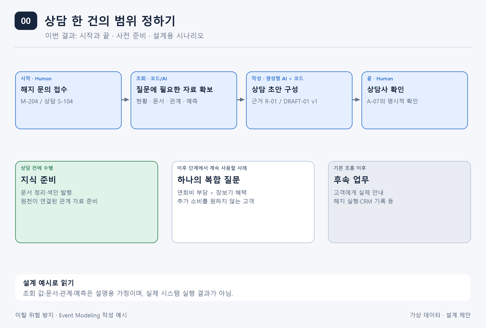
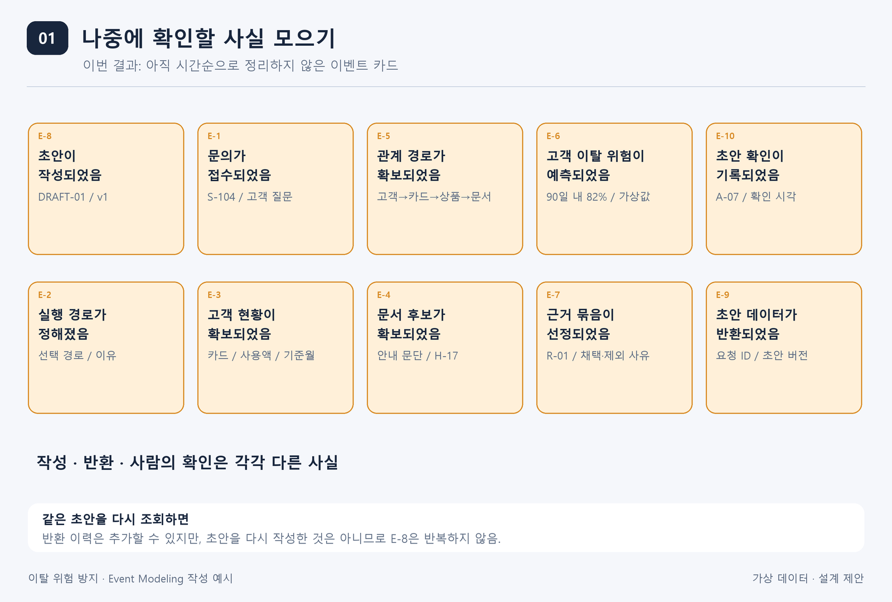
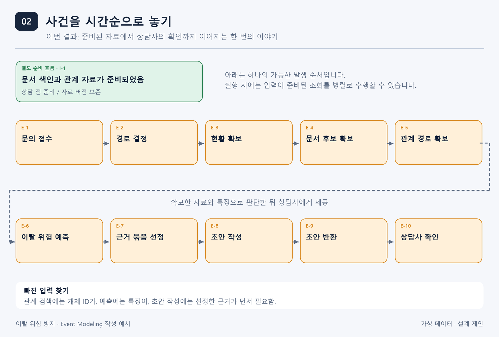
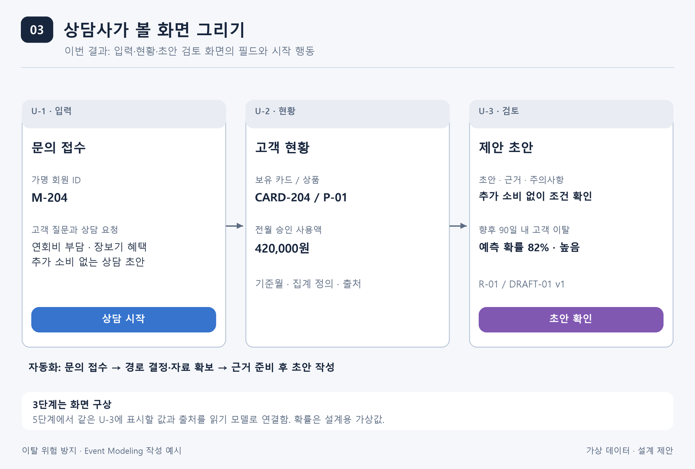
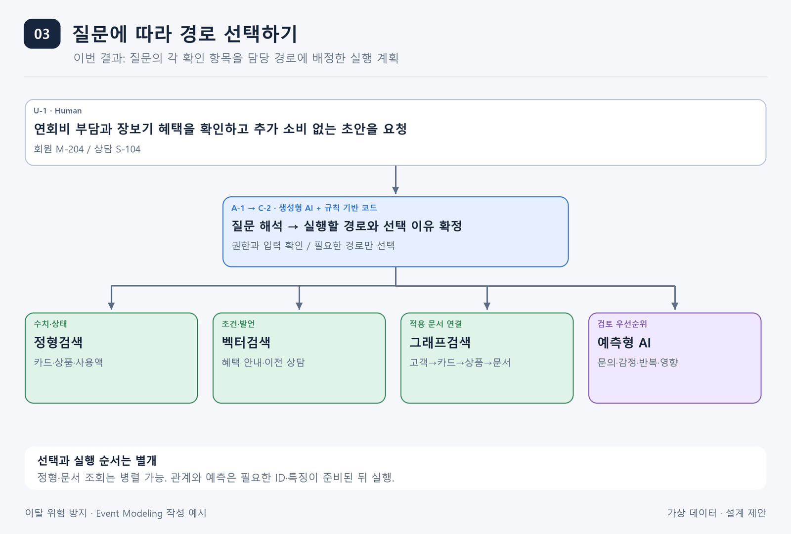
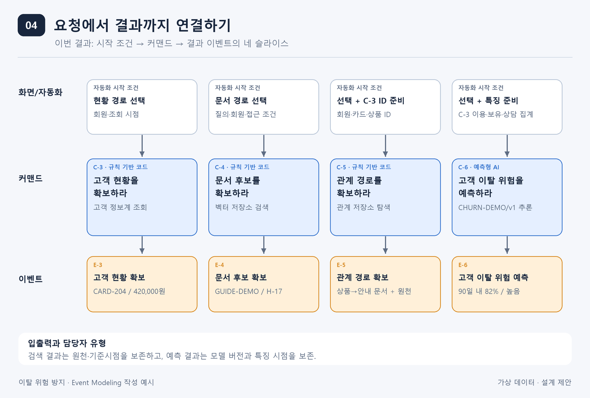
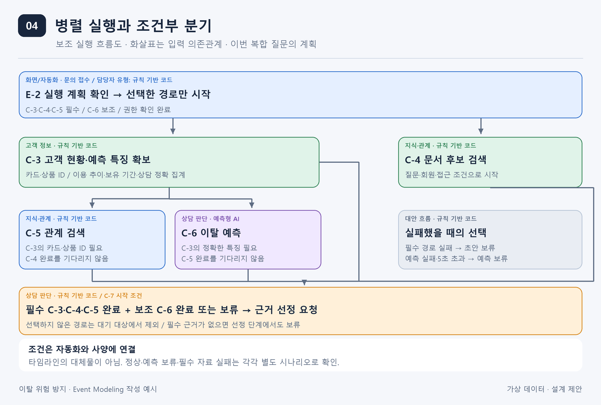
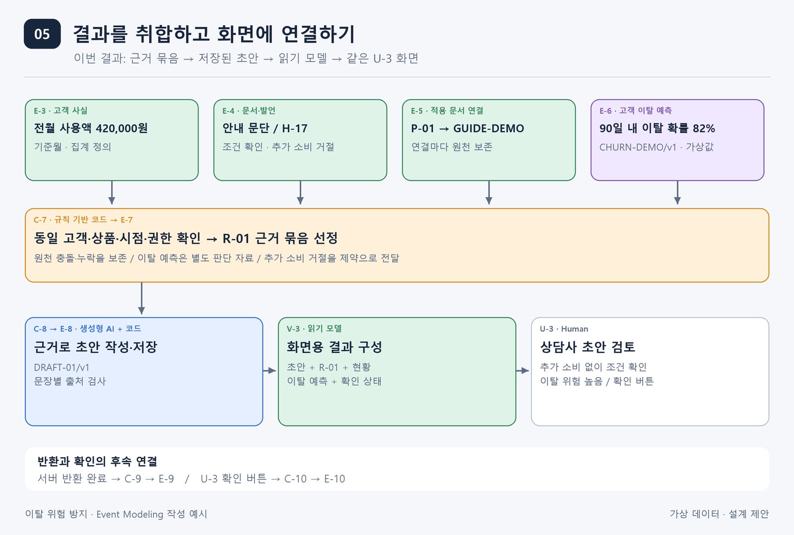
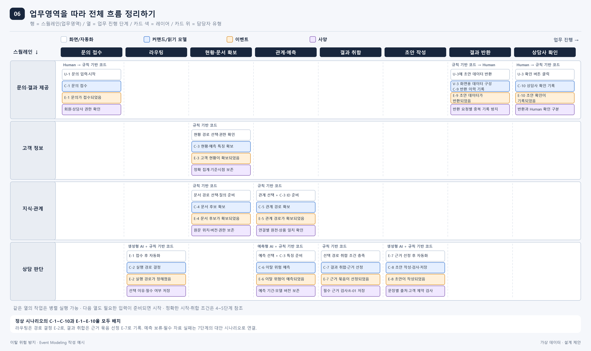
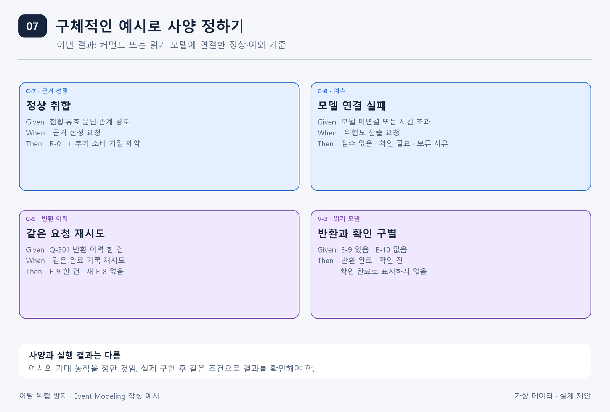

# 이탈 위험 방지 사례로 따라 하는 Event Modeling

고객이 “연회비가 부담돼서 카드를 해지하려고요”라고 말하면 상담사는 무엇부터 확인할까요?  
어떤 카드를 사용하고 있는지 살펴보고, 혜택 조건과 이전 상담 내용을 찾아볼 것입니다.  
고객이 추가 소비를 원하지 않는다면 그 뜻도 제안에 반영해야겠지요.

이 일을 AI가 도와준다고 해 보겠습니다.  
고객의 이용 현황은 정형 데이터에서 찾고, 약관과 상담 내용은 문서에서 찾습니다.  
카드와 상품, 적용 규정의 연결을 확인할 때는 관계 검색을 사용할 수 있습니다.  
예측형 AI는 고객의 이탈 가능성을 예측하고, 생성형 AI는 모인 자료로 제안 초안을 작성합니다.

이렇게 설명하면 필요한 기능은 떠오릅니다. 하지만 아직 누가 일을 시작하고,  
어떤 정보를 주고받으며, 어디까지가 우리가 만들어야 할 부분인지 분명하지 않습니다.  
이벤트 모델링은 그 연결을 한 상담의 흐름으로 그려 보는 방법입니다.

이 글에서는 먼저 업무에서 일어날 사실을 모으고, 화면과 작업 요청, 결과 데이터를 차례로 붙이겠습니다.  
마지막에는 스웜레인을 출발점으로 **내부 서비스 후보**를 찾고, 연동할 **외부 시스템**을 별도 표로 정리합니다.

## 준비. 끝까지 따라갈 상담 한 건을 정합니다

이번에 그릴 범위는 **해지 문의 접수부터 상담사의 초안 확인까지**입니다.  
실제 해지 실행이나 고객에게 제안을 발송하는 일은 그다음 업무로 두겠습니다.  
문서 색인과 관계 자료를 준비하는 작업은 상담 전에 실행되는 별도 흐름으로 놓습니다.

예시의 고객은 M-204, 상담은 S-104, 상담사는 A-07입니다.  
상담 기준일은 2026-09-01이고, A-07에게 이 회원의 상담 자료를 열람할 권한이 있다고 가정합니다.  
상담사는 다음 질문으로 상담 지원 시스템을 실행합니다.

> “연회비가 부담돼 해지를 고민하는 고객입니다. 지난번에 문의한 장보기 혜택을  
> 지금 카드로 받을 수 있는지 살펴보고, 추가 소비를 권하지 않는 상담 초안을 만들어 주세요.”

이 질문에는 네 가지 확인할 일이 들어 있습니다.  
고객의 카드와 사용 현황을 알아야 하고, 혜택 조건을 찾아야 하며, 그 조건이 해당 상품과 연결되는지도 확인해야 합니다.  
고객의 이탈 가능성과 주요 판단 신호를 예측해 상담 방향을 정하는 데 참고할 수 있습니다.

**이후의 값과 문서, 관계 경로, 이탈 예측값은 완성될 서비스를 가정한 설계용 예시입니다.**  
실제 데이터 조회나 모델 실행 결과는 아닙니다. 설명에 사용할 자료는 다음과 같이 정하겠습니다.

- 고객 현황: 카드 CARD-204 한 장 보유, 상품 P-01, 보유 기간 24개월, 2026-08 승인 사용액 420,000원.
- 이용 추이: 최근 6개월의 월 승인 사용액이 800,000원에서 420,000원으로 감소한 가상 기록.
- 혜택 안내 GUIDE-DEMO/v1: 장보기 혜택의 결제 경로·제외 조건을 다룬 가상 안내. 시행일 2026-08-01, 내부 공개.
- 이전 상담 H-15·H-16·H-17: 2026-08의 관련 상담 세 건. H-17에는 “혜택을 받으려고 더 쓰고 싶지는 않다”는 발언이 있음.
- 관계 자료: M-204 → CARD-204 → P-01 → GUIDE-DEMO/v1의 연결과 각 연결의 원천.
- 예측 결과 CHURN-DEMO/v1: 향후 90일 이내 고객 이탈 확률 82%, 위험도 높음으로 분류한 가상 결과.

이 사례에서 **고객 이탈은 기준일 이후 90일 이내에 보유 카드를 모두 자발적으로 해지하는 것**으로 정합니다.  
예측 확률과 위험 등급은 이 결과를 대상으로 합니다. 82%와 ‘높음’은 설명용 가상값이며 실제 모델의 산출값이 아닙니다.  
실제 적용 전에는 이탈 정의·예측 기간에 맞는 정답 데이터와 검증된 모델, 위험 등급 기준이 필요합니다.

우리의 설계 대상은 상담 지원 애플리케이션입니다.  
고객 정보계, 문서·벡터·관계 저장소, 모델 추론 서비스는 별도로 운영되는 연동 대상으로 가정하겠습니다.  
이 경계를 먼저 정해 두면 우리가 만들 내부 서비스와 연동할 외부 시스템을 일관되게 구분할 수 있습니다.

## 1단계. 어떤 사실을 남겨야 하는지 생각합니다

상담이 끝난 뒤 “이 초안은 어떤 자료를 보고 만든 것인가요?”라는 질문을 받는다고 생각해 보겠습니다.  
어떤 문의가 들어왔고, 어떤 경로를 선택했으며, 무슨 자료와 예측 결과를 사용했는지 알아야 합니다.  
초안을 만든 뒤 누구에게 반환했고, 누가 확인했는지도 살펴볼 수 있어야겠지요.

이처럼 **업무에서 일어난 사실 가운데 기억할 필요가 있는 것**을 이벤트 카드로 적습니다.  
“문의를 접수하라”는 앞으로 할 일이고, “문의가 접수되었음”은 이미 일어난 사실입니다.  
이 단계에서는 뒤의 표현을 사용합니다.

검색 결과도 같은 기준으로 살펴봅니다.  
이 사례에서는 정형 현황, 문서 후보, 관계 경로, 예측 결과를 각각 확보한 사실을 남기기로 했습니다.  
나중에 최종 근거에서 제외한 자료까지 설명할 수 있어야 하기 때문입니다.  
검색기가 읽은 모든 문단이나 모든 계산 과정을 업무 이벤트로 남긴다는 뜻은 아닙니다.

초안 작성과 반환, 상담사의 확인도 구분했습니다.  
저장된 초안을 캐시나 체크포인트에서 다시 읽어 반환해도 **새 반환 이력**은 생깁니다.  
그러나 내용을 다시 작성한 것은 아니므로 작성 이벤트를 반복하지 않습니다.  
서버가 초안을 반환했다는 사실만으로 상담사가 확인했다고 판단하지도 않습니다.

이 단계가 끝나면 아직 정돈되지 않은 이벤트 카드 묶음이 남습니다.  
다음 단계에서는 이 카드로 실제 상담 한 번을 설명할 수 있는지 살펴보겠습니다.

## 2단계. 이벤트를 시간순으로 놓습니다

상담은 문의를 접수하는 데서 시작합니다.  
질문에 필요한 경로를 정한 뒤 고객 현황과 문서, 관계를 조회하고 고객의 이탈 위험을 예측합니다.  
그 결과를 취합해 사용할 근거를 정하면 초안을 작성할 수 있습니다.  
이후 초안을 반환하고 상담사가 확인하면 한 번의 흐름이 끝납니다.

위 그림의 중심은 **한 상담에서 실제로 일어났다고 가정한 사건의 기록 순서**입니다.  
조회가 가능한 문서 색인과 관계 자료는 상담 전에 준비되어 있어야 하므로 위쪽에 따로 놓았습니다.

**타임라인에 나란히 놓였다고 해서 작업을 하나씩 실행해야 하는 것은 아닙니다.**  
E-3 다음에 E-4를 그렸지만, 문서 검색이 먼저 끝났다면 E-4가 E-3보다 앞에 놓일 수도 있습니다.  
이벤트 번호는 카드를 찾기 위한 이름이며 실행 순서를 강제하는 번호가 아닙니다.

Event Modeling에서도 병렬 실행과 조건부 분기를 다룹니다.  
다만 기본 타임라인에는 한 번의 구체적인 이야기를 놓고, 다른 선택과 결과는 별도 시나리오로 설명합니다.  
무엇을 동시에 시작할 수 있는지, 어떤 조건에서 다른 경로를 고르는지는 자동화의 시작 조건과 사양에 적습니다.  
[공식 설명의 UX Concurrency 항목](https://eventmodeling.org/posts/what-is-event-modeling/)도  
다른 실행 순서를 사양으로 표현하고 중요한 대안 흐름을 모델에 추가하도록 설명합니다.

이번 사례의 경로 선택은 3단계에서, 병렬 실행과 입력 의존관계는 4단계에서 구체화하겠습니다.  
결과를 어디까지 기다릴지는 5단계에서 정하고, 7단계에서는 조건을 바꾼 예시로 확인하겠습니다.

이제 카드 사이에서 빠진 입력을 찾을 수 있습니다.  
“관계 경로가 확보되었다”는 사실 앞에는 탐색할 개체가 있어야 하고,  
“초안이 작성되었다”는 사실 앞에는 채택한 근거와 예측 결과가 있어야 합니다.  
이 연결을 화면과 요청으로 구체화하는 것이 다음 단계입니다.

## 3단계. 상담사가 볼 화면과 자동화를 그립니다

이번에는 상담사의 입장에서 흐름을 따라가 보겠습니다.  
문의 접수 화면 U-1에는 회원과 질문을 입력할 수 있어야 합니다.  
고객 현황 화면 U-2에는 사용액뿐 아니라 기준월과 자료의 출처도 필요합니다.  
초안 검토 화면 U-3에는 제안 내용, 근거, 주의사항과 이탈 예측 결과·예측 기간이 보여야 합니다.

여기서는 **무엇을 입력하고 무엇을 보여 줄지** 정합니다.  
각 화면 값을 어떤 데이터로 구성할지는 5단계에서 읽기 모델을 만들며 연결합니다.  
그래서 지금은 완성된 화면을 만들려고 하기보다 필요한 항목을 빠뜨리지 않는 데 집중하면 됩니다.

화면 사이에는 사람이 버튼을 누르지 않아도 시작할 일이 있습니다.  
문의가 접수되면 질문을 해석하고, 필요한 검색 경로를 선택하는 작업이 그 예입니다.  
이런 자동화도 업무 시작 조건과 함께 화면/자동화 레이어에 놓습니다.

### 질문에 따라 어느 경로를 고를까요?

“지난달 사용액은 얼마인가요?”라는 질문이라면 정형 조회만으로 답할 수 있습니다.  
하지만 이번 질문에는 고객 현황과 혜택 조건, 이전 상담의 의도가 함께 들어 있습니다.  
따라서 질문을 다음처럼 나누어 생각합니다.

- “어떤 카드와 상품을 사용하는가?”는 정형검색으로 확인합니다.
- “장보기 혜택의 조건과 고객이 했던 말은 무엇인가?”는 유사도(벡터) 검색으로 찾습니다.
- “찾은 조건이 이 고객의 카드 상품과 연결되는가?”는 관계(그래프) 검색으로 확인합니다.
- “이 고객이 앞으로 90일 안에 이탈할 가능성은 어느 정도인가?”는 준비된 특징을 예측형 AI에 전달해 판단합니다.

질문을 해석하는 일은 생성형 AI가 도울 수 있습니다.  
실행 가능한 경로와 권한, 필요한 입력을 확인해 계획을 확정하는 일은 규칙 기반 코드가 맡습니다.  
계획에는 어떤 경로를 선택했는지뿐 아니라 **어떤 질문에 답하려고 선택했는지**도 남깁니다.  
각 경로에 필요한 입력, 반드시 성공해야 하는지, 기다릴 시간도 함께 정합니다.

여기서 라우팅은 네 경로 중 하나만 고르는 일이 아닙니다.  
복합 질문에는 여러 경로를 배정하고, 간단한 질문에는 필요한 경로만 배정하는 것입니다.  
관계가 단순한 카드·상품 조인으로 충분하다면 정형 조회에서 끝낼 수도 있습니다.

예를 들어 사용액만 묻는 질문에는 C-3만 선택합니다. 이때 C-4·C-5·C-6은 ‘선택하지 않음’으로 남깁니다.  
혜택 조건을 묻는다면 C-3과 C-4를 선택하고, 상품과 적용 문서의 연결 확인이 필요할 때 C-5도 선택합니다.  
이탈 가능성을 묻거나 이번처럼 해지 상담을 지원하는 경우에는 C-6도 선택합니다.  
예측을 선택했더라도 모델이나 입력을 사용할 수 없다면 예측을 보류하고 그 이유를 남깁니다.

이번 복합 질문에서는 C-3·C-4·C-5를 **필수 경로**, C-6을 **보조 경로**로 정하겠습니다.  
고객과 적용 문서를 확인하지 못하면 초안 작성을 멈추지만, 예측이 없어도 확보한 근거로 상담을 지원할 수 있다는 뜻입니다.  
이 구분은 이 사례의 업무 규칙입니다. 예측값 자체를 요청한 질문에서는 예측이 필수 결과가 될 수 있습니다.

## 4단계. 시작 행동을 커맨드와 결과 이벤트로 연결합니다

앞 단계에서 상담 시작 버튼과 자동화 조건을 그렸습니다.  
이제 그 행동이 어떤 요청을 보내고, 무엇을 받아야 끝나는지 적어 보겠습니다.  
“고객 현황을 확보하라”, “관계 경로를 확보하라”처럼 작업 의도를 나타내는 카드가 커맨드입니다.

먼저 시작 버튼 U-1을 문의 접수 C-1에 연결합니다. 회원·질문·상담사를 확인하고 저장하면 E-1이 남습니다.  
이후 자동화가 경로 결정 C-2를 요청하고, 선택 경로와 이유·실행 조건을 상담에 저장하면 E-2가 남습니다.  
아래 그림은 이 계획에 따라 실행할 네 가지 작업을 펼친 것입니다.

정형 현황 확보 C-3은 회원 M-204와 조회 기준일을 받습니다.  
규칙 기반 코드가 고객 정보계에 조회를 요청하고, 카드 CARD-204와 상품 P-01,  
전월 승인 사용액 420,000원과 기준월을 받습니다.  
예측도 선택했다면 이용 추이·보유 기간·기준일 이전의 해지 관련 상담 건수까지 함께 확보합니다.  
이 결과를 상담에 사용할 현황으로 저장하면 “고객 현황이 확보되었음” E-3이 남습니다.

**정형검색**은 정확한 조건으로 상태와 숫자를 확인하는 데 씁니다.  
고정된 고객 현황 조회는 미리 정한 쿼리로 처리할 수 있습니다.  
질문마다 집계 조건이 달라지는 분석이라면 NL2SQL로 조회문 후보를 만들고 검사한 뒤 실행할 수 있습니다.  
어느 방식을 쓰든 반환한 금액의 집계 기준과 조회 시점이 함께 있어야 합니다.

문서 후보 확보 C-4에는 “장보기 혜택 조건”과 “추가 소비를 원하지 않은 이전 상담”이라는 질의를 전달합니다.  
벡터 검색은 GUIDE-DEMO/v1의 조건 문단과 H-17의 고객 발언을 찾습니다.  
결과에는 문단 내용, 문서·상담 ID, 원문 위치와 버전을 붙입니다.  
이 목록을 저장하면 “문서 후보가 확보되었음” E-4가 남습니다.

**유사도 검색**이 돌려주는 것은 질문과 관련 있어 보이는 후보입니다.  
관련 문장을 찾았다는 이유만으로 이 고객에게 적용되는 혜택이라고 확정하지는 않습니다.  
이를 확인할 다른 자료와 연결하는 단계가 필요합니다.

관계 경로 확보 C-5는 고객 현황에서 얻은 회원·카드·상품 ID를 받습니다.  
관계 검색은 “M-204가 CARD-204를 보유하고, 그 카드가 P-01 상품이며,  
P-01이 GUIDE-DEMO/v1을 적용 안내로 참조한다”는 경로를 반환합니다.  
각 연결에는 회원·카드 원천 레코드나 상품별 문서 등록 기록이 붙습니다.  
이 경로를 저장하면 “관계 경로가 확보되었음” E-5가 남습니다.

**관계검색**은 연결을 확인하는 역할입니다.  
상품과 안내 문서가 연결되었다고 해서 고객의 모든 혜택 조건까지 충족되었다는 뜻은 아닙니다.  
결제 경로나 실적 인정 여부처럼 별도로 확인할 조건은 결과에 남겨 둡니다.

이탈 위험 예측 C-6에는 고객의 이용 추이, 카드 보유 기간, 해지 관련 상담 이력을 전달합니다.  
이 예시에서는 “최근 6개월 월 승인액 감소”, “보유 기간 24개월”, “관련 문의 3회”라는 가상 특징을 사용합니다.  
이 특징은 C-3에서 고객 정보계의 기준시점별 조회와 상담 기록의 정확한 집계로 준비합니다.  
이 예시의 집계 대상은 2026-08의 H-15·H-16·H-17입니다. 벡터 검색의 상위 결과 개수를 문의 횟수로 쓰지는 않습니다.  
모든 특징은 예측 기준일까지만의 자료로 구성하며 이후 해지 결과를 입력에 섞지 않습니다.

예측형 AI는 향후 90일 이내 이탈 확률 82%와 위험 등급 ‘높음’을 반환한다고 가정하겠습니다.  
모델이 제공하는 주요 판단 신호에는 이용 감소와 반복된 해지 문의가 포함됩니다.  
이 신호는 예측에 영향을 준 특징이며 고객이 해지하려는 원인을 증명하는 것은 아닙니다.  
예측 기간, 모델 버전 CHURN-DEMO/v1, 특징의 기준시점과 함께 “고객 이탈 위험이 예측되었음” E-6으로 남깁니다.

이처럼 **하나의 시작 조건에서 요청과 결과까지 이어지는 연결**이 슬라이스입니다.  
각 슬라이스에 입출력과 담당자 유형을 붙이면 내부에서 필요한 처리 책임도 구체적으로 드러납니다.

### 어떤 작업을 함께 시작할 수 있을까요?

이제 슬라이스의 시작 조건을 서로 비교해 보겠습니다.  
C-3은 회원과 조회 기준일이 있으면 시작할 수 있고, C-4는 질문·회원·접근 조건이 있으면 시작할 수 있습니다.  
따라서 권한 확인과 경로 결정이 끝나면 두 작업을 함께 시작할 수 있습니다.  
이때 C-4는 상품이 확정되기 전의 후보 검색이며, 실제 적용 여부는 뒤에서 상품과 연결해 검사합니다.

반면 C-5에는 C-3에서 얻은 카드·상품 ID가 필요합니다.  
C-6도 C-3에서 준비한 예측 특징이 있어야 합니다. 따라서 두 작업은 각 입력이 준비된 뒤 시작합니다.  
C-5와 C-6 사이에는 선후관계가 없으므로 함께 실행할 수 있고, 이때 C-4는 아직 검색 중일 수도 있습니다.

이 그림은 2단계의 이벤트 타임라인을 보완하는 **실행 흐름도**입니다.  
화살표는 사건의 기록 순서가 아니라 다음 작업에 필요한 입력과 시작 조건을 뜻합니다.  
모든 작업에는 ‘계획에서 선택한 경로인가?’라는 조건이 먼저 붙습니다. 선택하지 않은 작업은 시작하지 않습니다.

처음 모델링할 때는 각 자동화 옆에 다음 세 가지를 적으면 됩니다.  
“언제 시작하는가?”, “어떤 입력을 기다리는가?”, “실패하면 어디로 이어지는가?”입니다.  
이 질문에 답하면 병렬 실행과 조건부 분기도 화면·커맨드·이벤트의 연결 안에서 설명할 수 있습니다.

## 5단계. 결과를 취합하고 읽기 모델로 화면에 연결합니다

정상 시나리오에서는 선택한 네 경로의 결과가 모두 모였습니다.  
그렇다면 이 내용을 모두 생성형 AI에 넘겨 “알아서 답해 달라”고 하면 될까요?  
먼저 각 결과가 어떤 주장에 쓰일 수 있는지 구분해야 합니다.  
숫자와 정책 문장, 관계 경로, 이탈 예측값은 서로 다른 일을 하기 때문입니다.

정형 결과는 고객 현황을 설명합니다.  
문서 결과는 혜택 조건과 고객이 했던 말을 설명합니다.  
관계 결과는 고객의 상품과 해당 안내 문서가 연결되어 있음을 확인합니다.  
예측 결과는 고객이 이탈할 가능성과 판단에 영향을 준 신호를 알려 줍니다.  
상담사는 이를 고객의 실제 발언·상품 조건과 함께 살펴보며 대응 방향을 정합니다.

### 어디까지 기다린 뒤 취합할까요?

결과 취합은 항상 네 경로를 기다리는 작업이 아닙니다.  
먼저 E-2의 실행 계획을 읽고, **선택한 경로의 상태만** 확인합니다.  
사용액 질문으로 C-3만 선택했다면 C-3의 결과가 준비되는 대로 취합할 수 있습니다.

이번 복합 질문에서는 필수인 C-3·C-4·C-5가 완료되고, 보조인 C-6이 완료되거나 보류되면 C-7을 요청합니다.  
예측이 실행 중이면 정해 둔 시간까지만 기다립니다. 설명용으로 경로별 대기 시간을 요청 후 5초로 정하겠습니다.  
선행 입력이 필요한 경로의 시간은 그 경로를 실제 요청한 순간부터 셉니다. 이 값은 운영 목표에 맞춰 조정할 설계값입니다.

예측이 실패하거나 5초를 넘기면 ‘예측이 보류되었음’과 사유를 남기고, 예측값 없이 취합을 계속합니다.  
처음부터 예측을 선택하지 않은 상태와 선택했지만 예측할 수 없었던 상태는 구분해 표시합니다.  
필수 경로가 실패하거나 시간을 넘기면 ‘필수 자료 확보가 중단되었음’을 남기고 초안 작성으로 넘어가지 않습니다.  
선행 작업이 실패해 시작하지 못한 경로도 입력 부족 사유를 남겨, 계속 대기하는 상태로 두지 않습니다.

조회가 정상 종료되어도 빈 결과이거나 적용 가능한 근거가 없을 수 있습니다.  
C-7이 필수 근거의 누락·충돌을 확인하면 ‘근거 선정이 보류되었음’을 기록하고 상담사에게 확인할 항목을 보여 줍니다.  
이때 U-3에는 초안 대신 보류 사유를 표시하며 E-7·E-8은 만들지 않습니다.

동시에 도착한 결과 때문에 같은 취합을 두 번 시작하지 않도록 상담 ID와 실행 계획 버전으로 중복을 확인합니다.  
대기 종료 후 늦게 도착한 결과는 이미 만든 초안에 몰래 섞지 않습니다. 재실행하면 새 계획 버전의 결과로 취합합니다.

### 어떤 결과를 함께 사용할까요?

근거 선정 C-7은 같은 회원과 상품의 자료인지, 기준시점이 맞는지, 해당 상담에서 열람할 수 있는 자료인지 확인합니다.  
그 뒤 채택한 사실과 문단, 관계 경로를 R-01 근거 묶음으로 저장합니다.  
이때 “근거 묶음이 선정되었음” E-7을 남깁니다.  
예측 결과는 정책 근거와 섞지 않고 이탈 확률·위험 등급·예측 기간·주요 판단 신호로 구분해 둡니다.

이 사례에서는 다음과 같이 정리할 수 있습니다.  
“전월 승인 사용액은 420,000원이다”는 고객 현황을 근거로 합니다.  
“이 상품의 장보기 혜택은 결제 경로 확인이 필요하다”는 안내 문단과 상품 연결 경로를 근거로 합니다.  
“추가 소비를 권하지 않는다”는 이전 상담의 고객 발언을 반영한 제안 원칙입니다.

승인 사용액을 혜택 실적 인정액으로 바꾸어 해석하지는 않습니다.  
같은 금액처럼 보여도 계산 기준이 다를 수 있기 때문입니다.  
같은 지표와 기간의 값이 원천마다 다르면 두 값과 출처를 충돌 항목으로 남기고 상담사가 확인하도록 합니다.  
찾지 못한 항목도 “자료 없음”과 “조회 실패”를 구분해 남깁니다.

### 취합한 결과가 어떻게 화면의 초안이 될까요?

초안 작성 C-8은 선정된 근거 R-01과 이탈 예측 결과 또는 예측을 제공하지 못한 상태를 받습니다.  
이탈 위험이 높게 예측되더라도 고객이 거절한 추가 소비를 권하지 않고, 고객의 부담을 줄일 상담 방향을 찾습니다.  
생성형 AI가 문장을 만들고 규칙 기반 코드가 근거 연결을 검사한 뒤 DRAFT-01/v1로 저장합니다.  
저장이 끝나면 “초안이 작성되었음” E-8이 남습니다.  
예를 들어 이런 초안을 만들 수 있습니다.

> “추가 소비를 권하기보다 현재 이용하는 장보기 결제 경로부터 확인해 보겠습니다.  
> 보유 상품의 혜택 안내에는 결제 경로에 따른 조건이 있으므로 실제 적용 여부를 확인한 뒤 안내하겠습니다.”

읽기 모델 V-3은 저장된 초안에 고객 현황, 근거·출처, 주의사항과 이탈 예측 결과를 붙여 U-3에 제공합니다.  
**U-3은 3단계에서 그린 초안 검토 화면과 같은 화면입니다.**  
3단계에서는 필요한 항목을 구상했고, 여기서는 각 항목의 값을 구성하고 출처를 연결한 것입니다.

데이터를 연결하다 보면 화면을 고칠 수도 있습니다.  
사용액에 기준월을 추가하거나, 예측 확률 옆에 “향후 90일 내 이탈”이라는 설명을 붙이는 식입니다.  
새 초안을 만드는 일과 저장된 초안을 화면용 데이터로 구성하는 일을 구분해 두면 역할도 분명해집니다.

서버가 초안 데이터를 반환하면 C-9가 요청 ID와 초안 버전으로 반환 이력 E-9를 기록합니다.  
상담사가 확인 버튼을 누르면 C-10이 별도의 확인 이력 E-10을 기록합니다.  
캐시에서 같은 초안을 다시 반환해도 이 구분은 그대로 적용합니다.

## 6단계. 업무영역별로 카드를 정리합니다

지금까지는 한 상담을 따라 카드와 연결을 늘려 왔습니다.  
이제 전체를 읽기 쉽게 정리해 보겠습니다. 이때 사용하는 것이 레이어와 스웜레인입니다.

먼저 왼쪽에 **스웜레인 이름을 행으로** 적고, 위쪽에는 **업무 진행 단계를 열로** 놓습니다.  
왼쪽에서 오른쪽으로 읽으면 상담이 어떻게 진행되는지 보이고, 같은 행을 따라가면 한 업무영역이 맡은 일을 볼 수 있습니다.  
이 그림에서는 접수, 라우팅, 현황·문서 확보, 관계·예측, 결과 취합, 초안 작성, 결과 반환, 상담사 확인 순서로 놓겠습니다.

**레이어는 카드의 종류**입니다.  
화면/자동화에는 업무를 시작하는 장면과 조건을, 커맨드/읽기 모델에는 요청과 화면용 결과 데이터를 둡니다.  
이벤트에는 처리 뒤 남기는 사실을, 사양에는 그 동작을 확인할 구체적인 예시를 둡니다.  
아래 그림에서는 레이어를 카드 색으로 구분하고, 각 작업의 시작 조건부터 사양까지 위에서 아래로 연결해 읽습니다.

**스웜레인은 업무영역**입니다.  
이 사례에서는 문의·결과 제공, 고객 정보, 지식·관계, 상담 판단으로 나누었습니다.  
접수뿐 아니라 결과 반환과 확인까지 같은 접점에서 다루므로, 기존 ‘문의 접수’ 영역의 이름을 ‘문의·결과 제공’으로 넓혔습니다.  
각 행에는 해당 업무영역이 맡는 단계의 카드만 놓습니다. 해당 작업이 없는 칸은 비워 둡니다.

이렇게 묶은 업무영역의 이름은 마지막에 **1차 내부 서비스 후보**를 찾는 출발점이 됩니다.  
각 행의 커맨드와 이벤트는 그 서비스가 어떤 일을 맡고 어떤 결과를 책임지는지 설명하는 근거입니다.

‘상담 판단’ 행을 따라가 볼까요?  
라우팅 단계의 C-2는 질문에 필요한 경로를 정하고 **‘실행 경로가 정해졌음’ E-2**를 남깁니다.  
관계·예측 단계에서는 준비된 특징으로 C-6이 이탈 위험을 예측하고 E-6을 남깁니다.  
결과 취합 단계의 C-7은 선택한 경로의 결과를 검사하고 **‘근거 묶음이 선정되었음’ E-7**을 남깁니다.  
그다음 C-8이 이 근거로 초안을 작성하고 E-8을 남깁니다.

이처럼 라우팅과 결과 취합도 요청과 결과가 있는 작업이므로 전체 모델에서 빠지면 안 됩니다.  
‘라우팅’과 ‘결과 취합’은 단계 이름이고, 이벤트 이름에는 그 작업으로 확정된 사실을 적습니다.  
이번 모델에서는 E-2와 E-7이 각각 그 결과를 나타냅니다.

‘문의·결과 제공’ 행에는 시작점 C-1/E-1과 함께 마지막 반환 C-9/E-9, 확인 C-10/E-10을 놓았습니다.  
V-3은 저장된 초안과 근거를 U-3에 표시할 데이터로 구성합니다. 데이터 반환과 상담사의 확인은 별도 단계로 유지합니다.  
이렇게 하면 정상 시나리오의 C-1부터 C-10, E-1부터 E-10까지 빠짐없이 따라갈 수 있습니다.

열의 배치는 업무 진행을 읽기 위한 구분이며, 한 열의 모든 작업이 끝나야 다음 열로 넘어간다는 뜻은 아닙니다.  
현황 C-3과 문서 검색 C-4는 함께 시작할 수 있고, C-5·C-6은 각각 필요한 C-3의 입력이 준비되면 시작합니다.  
C-7은 5단계에서 정한 취합 조건을 따릅니다. 예측 보류와 필수 자료 실패는 7단계의 대안 시나리오로 확인합니다.

담당자 유형은 이 두 구분과 별개입니다.  
상담 판단 업무에는 예측형 AI가 이탈 위험을 예측하는 작업, 생성형 AI가 초안을 쓰는 작업,  
규칙 기반 코드가 결과를 검사하는 작업이 함께 있습니다. Human의 확인은 문의·결과 제공 영역에 놓았습니다.  
담당자 유형이 바뀐다고 매번 스웜레인을 새로 만들 필요는 없습니다.

이벤트 레이어도 같은 관점으로 이해하면 됩니다.  
“상담 판단” 스웜레인에 이탈 예측과 초안 작성의 결과가 놓이는 것이지, 이벤트 자체가 요청을 처리하는 것은 아닙니다.  
처리 책임은 커맨드에 연결하고 그 결과로 남은 사실을 이벤트에 적습니다.

이렇게 정리하고 나면 경계를 찾기 쉬워집니다.  
고객 현황을 얻기 위해 고객 정보계를 호출한 곳, 이탈 위험을 예측하기 위해 모델 서비스를 호출한 곳은 외부 접점입니다.  
질문을 나누고, 조회를 요청하고, 결과를 취합하는 일은 우리 애플리케이션이 맡을 처리 책임입니다.  
마지막에는 이 책임들을 업무영역별로 살펴보며 내부 서비스 후보로 묶겠습니다.

## 7단계. 구체적인 예시로 동작 기준을 정합니다

정상적인 상담 흐름을 설명할 수 있게 되었으니, 이제 조건이 달라지면 어떻게 할지 정해 보겠습니다.  
정형 결과가 없거나, 서로 다른 문서가 충돌하거나, 예측 서비스가 응답하지 않을 수도 있습니다.  
같은 초안을 여러 번 조회하는 경우도 생각해야 합니다.

이런 상황을 **Given · When · Then**, 즉 “어떤 상태에서, 무엇을 요청하면, 무엇이 남는가”로 적습니다.  
사양 하나는 커맨드 또는 읽기 모델 하나에 연결합니다.

먼저 경로 결정 C-2에 조건부 분기 예시를 적습니다.  
“지난달 사용액”만 묻는 상태에서 경로 결정을 요청하면 C-3만 선택하고 나머지는 ‘선택하지 않음’이어야 합니다.  
해지 상담과 혜택 확인을 함께 요청하면 C-3·C-4·C-5는 필수, C-6은 보조로 선택해야 합니다.  
어떤 질문에서나 네 경로를 실행하는 것으로 사양을 적지 않습니다.

병렬 작업은 완료 순서를 바꿔 확인합니다.  
같은 계획과 결과에서 E-4가 E-3보다 먼저 남아도, E-3이 E-4보다 먼저 남아도 취합 조건은 같아야 합니다.  
필수 경로가 아직 실행 중이면 C-7을 시작하지 않고, 취합 조건을 충족하면 같은 계획에 대해 한 번만 요청합니다.  
이 조건은 C-7을 시작하는 자동화에 붙이고, C-7의 사양에서도 미완료 결과로 선정하지 않는지 확인합니다.

근거 선정 C-7의 정상 사양은 이렇게 적을 수 있습니다.  
고객 현황, 유효한 안내 문단과 상품 연결 경로가 준비되어 있을 때 근거 선정을 요청하면,  
그 자료와 출처를 포함한 R-01이 저장되어야 합니다.  
고객이 거절한 추가 소비 제안은 초안 작성에 넘길 제약으로 남겨야 합니다.

예측 C-6이 실패하는 사양도 따로 적습니다.  
모델이 연결되지 않았거나 응답 시간이 초과되면 이탈 확률과 위험 등급은 비워 두고 “확인 필요”를 반환합니다.  
상담사는 예측 없이 확보된 고객 현황과 근거로 초안을 검토합니다. 미확인을 저위험이나 고위험으로 표시하지 않습니다.  
이 경우에는 이탈 예측 완료 이벤트 대신 예측 보류와 사유를 남깁니다.

필수인 C-5가 실패하는 시나리오도 따라가 봅니다.  
관계 조회가 실패하면 실패 사유를 기록하고, 자동화는 필수 자료 확보 중단을 기록합니다.  
C-7·C-8은 시작하지 않으며 U-3에는 “상품과 안내 문서의 연결 확인 필요”를 표시합니다.  
조회는 성공했지만 적용 문서 연결이 없다면 C-7에서 근거 선정을 보류합니다. 두 경우를 같은 성공으로 처리하지 않습니다.

이처럼 중요한 대안은 **공통 시작 → 달라지는 조건 → 남는 사실 → 화면 결과** 순서로 따로 따라가 봅니다.  
정상 시나리오의 E-6을 보류 시나리오에도 그대로 넣거나, 실패한 경로를 성공 이벤트로 표현하지 않습니다.

반환 이력 C-9은 같은 요청 Q-301을 재시도해도 한 건이어야 합니다.  
새 요청 Q-302로 같은 초안을 다시 반환했다면 반환 이력은 추가될 수 있습니다.  
어느 경우에도 저장된 내용을 그대로 읽었다면 초안 작성 이벤트 E-8을 새로 만들지 않습니다.

읽기 모델 V-3의 사양은 Given과 Then으로도 적을 수 있습니다.  
초안과 반환 기록은 있지만 상담사의 확인 기록이 없다면, 화면에는 “반환 완료 · 확인 전”이 보여야 합니다.  
반환 이력만으로 “확인 완료”라고 표시하면 안 됩니다.

문서 시행일이 상담 기준일보다 늦은 경우, 다른 회원의 상담이 검색된 경우,  
같은 집계의 값이 다른 경우도 같은 방식으로 추가합니다.  
정상 흐름과 예외를 함께 살펴보면 필요한 처리 책임이 빠졌는지 확인할 수 있습니다.

## 마무리. 스웜레인에서 내부 서비스 후보를 찾고 외부 시스템을 정리합니다

지금까지 그린 모델을 보며 “이 일을 어떤 서비스가 맡으면 좋을까요?”라는 질문에 답해 보겠습니다.  
여기서 서비스는 **하나의 업무 목적을 이루기 위해 관련 책임을 묶은 것**입니다.  
먼저 스웜레인 이름에서 후보를 찾고, 그 안의 커맨드와 이벤트로 책임을 확인합니다.  
이후 겹치거나 빠진 책임을 살펴보고, 서비스 사이에 주고받을 정보와 외부 시스템을 정리하면 됩니다.

### 1. 스웜레인 이름에서 1차 서비스 후보를 찾습니다

6단계 그림의 행 이름을 하나씩 읽어 보겠습니다.  
‘문의·결과 제공’은 상담을 접수하고 결과를 보여 주므로 **상담 관리 서비스**의 후보가 됩니다.  
‘고객 정보’에서는 **고객 정보 조회 서비스**, ‘지식·관계’에서는 **상담 근거 검색 서비스**를 떠올릴 수 있습니다.  
‘상담 판단’은 모인 자료로 상담 방향과 초안을 만드는 영역이므로 **상담 지원 서비스**로 묶어 보겠습니다.

상담 전에 수행하는 지식 준비도 따로 살펴봅니다.  
이 흐름의 목적은 상담 때 검색할 수 있도록 문서 색인과 관계 자료를 준비하는 것입니다.  
따라서 본 상담의 네 스웜레인에서 찾은 후보에 **지식 준비 서비스**를 추가합니다.  
이는 준비 단계의 별도 흐름에서 찾은 후보이며, 6단계의 상담 흐름에 새로운 행을 억지로 끼워 넣지는 않습니다.

### 2. 커맨드와 이벤트로 각 서비스의 책임을 확인합니다

예를 들어 ‘상담 판단’ 행에는 라우팅 C-2, 이탈 예측 C-6, 결과 취합 C-7, 초안 작성 C-8이 있습니다.  
이 작업들은 함께 “근거를 갖춘 상담 초안을 제공한다”는 목적을 이룹니다.  
따라서 이번 예시에서는 상담 지원 서비스 안의 처리 단계로 묶습니다.  
E-2의 실행 계획, E-6의 예측 결과, E-7의 근거 묶음과 E-8의 초안이 이 서비스가 책임질 결과입니다.

‘문의·결과 제공’ 행에서는 C-1의 문의 접수, C-9의 반환 기록, C-10의 상담사 확인을 찾을 수 있습니다.  
상담 관리 서비스는 이 이력을 관리하고, V-3으로 현황·초안·근거·진행 상태를 구성해 화면에 제공합니다.  
상담 지원 서비스가 초안을 만드는 일과 상담 관리 서비스가 그 결과를 제공하는 일이 구분됩니다.

다른 두 행도 같은 방식으로 확인합니다.  
고객 정보 조회 서비스는 C-3/E-3의 현황·예측 특징을, 상담 근거 검색 서비스는 C-4/E-4의 문서 후보와  
C-5/E-5의 관계 경로를 책임집니다. 이처럼 각 결과를 어느 서비스 후보에 연결했는지 확인합니다.

### 3. 겹치거나 빠진 책임을 살펴보고 후보를 조정합니다

스웜레인은 출발점이므로, 행 하나가 반드시 서비스 하나로 확정되는 것은 아닙니다.  
같은 업무 결과를 책임지는 후보가 겹치면 합칠 수 있는지 살펴보고, 한 후보에 서로 다른 목적이 섞였다면 나누어 봅니다.  
판단할 때는 “무엇을 입력받고, 어떤 업무 결과까지 책임지는가?”를 기준으로 삼습니다.

이번 예시에서는 문서 검색과 관계 검색을 상담 근거 검색 서비스로 묶었습니다.  
두 검색 모두 상담에 쓸 후보 자료를 출처와 함께 확보하는 일입니다.  
이 서비스는 문서 후보와 관계 경로를 제공하고, 상담 지원 서비스는 고객 현황·예측과 함께 이를 검증해 최종 근거 R-01을 고릅니다.  
이렇게 하면 ‘검색’과 ‘결과 취합’ 사이에서 책임이 겹치지 않습니다.

진행 상태도 구분합니다. 상담 지원 서비스는 선택한 경로의 대기·실패·취합 조건을 관리합니다.  
상담 관리 서비스는 그 진행 상태를 전달받아 화면에 보여 주고, 결과 반환과 상담사의 확인 이력을 관리합니다.  
이번에는 네 업무영역의 후보를 유지하고, 별도 준비 흐름에서 찾은 후보를 더해 다음과 같이 정리하겠습니다.

### 내부 서비스 후보

| 내부 서비스 후보 | 설명 |
|---|---|
| 상담 관리 서비스 | ‘문의·결과 제공’ 영역. 문의·권한·상담 이력과 C-1·C-9·C-10을 관리하고 V-3으로 현황·초안·상태를 제공합니다. |
| 고객 정보 조회 서비스 | ‘고객 정보’ 영역. C-3에서 현황과 예측 특징을 정확히 조회·집계하고 E-3에 기준시점과 출처를 남깁니다. |
| 상담 근거 검색 서비스 | ‘지식·관계’ 영역. C-4·C-5로 문서 후보와 관계 경로를 확보하고 E-4·E-5에 원문·버전·출처를 남깁니다. |
| 상담 지원 서비스 | ‘상담 판단’ 영역. C-2·C-6·C-7·C-8의 경로 선택·예측 연동·근거 취합·초안 작성과 실행 진행을 책임집니다. |
| 지식 준비 서비스 | 상담 전 별도 흐름. 원문을 정리해 문서 색인과 관계 자료를 갱신하고 준비 완료 사실 I-1과 자료 버전을 남깁니다. |

### 4. 서비스 사이의 정보와 외부 시스템을 확인합니다

서비스 이름만으로 관계를 설명할 수 있는지, 상담 한 건을 다시 따라가 보겠습니다.  
상담 관리 서비스가 권한을 확인한 문의와 상담 ID를 전달하면, 상담 지원 서비스가 필요한 경로를 정합니다.  
고객 정보 조회 서비스에서는 현황과 예측 특징을 받고, 상담 근거 검색 서비스에서는 문서 후보와 관계 경로를 받습니다.  
상담 지원 서비스는 이 결과를 취합해 초안·근거·예측 또는 보류 상태를 상담 관리 서비스에 돌려줍니다.  
상담 관리 서비스는 이를 화면에 제공하고 상담사의 확인을 기록합니다.

이번에는 각 값이 어디에서 왔는지도 확인합니다.  
사용액을 따라가면 고객 정보계에, 혜택 문단을 따라가면 원문과 검색 저장소에 도착합니다.  
이탈 예측 결과는 모델 서비스의 응답과 버전, 입력 기준시점으로 이어져야 합니다.  
이처럼 내부 서비스가 정보를 요청하거나 자료를 보내는 외부 상대를 모아 별도 표에 적습니다.

여기서 고객 정보 조회 서비스는 우리가 만들 조회 책임이고, 고객 정보계는 기존 데이터를 제공하는 외부 시스템입니다.  
이탈 예측 요청과 응답 검사는 상담 지원 서비스가 맡고, 실제 예측은 외부 모델 서비스에 요청합니다.  
지식 준비 서비스는 외부 원문을 읽어 벡터·관계 저장소의 검색 자료를 갱신합니다.  
저장소와 모델을 외부 시스템으로 분류한 것은 준비 단계에서 정한 애플리케이션 경계에 따른 것입니다.

### 외부 시스템

| 외부 시스템 | 설명 |
|---|---|
| 고객 정보계 | 고객 정보 조회 서비스에 회원·카드·상품·거래와 기준시점별 상담 집계 등 정형정보를 제공합니다. |
| 원문 문서·상담 저장소 | 지식 준비·상담 근거 검색 서비스에 원문과 버전·시행일·위치를 제공합니다. |
| 벡터 검색 저장소 | 지식 준비 서비스가 갱신한 색인을 보관하고, 상담 근거 검색 서비스에 문서 후보와 메타데이터를 반환합니다. |
| 관계 검색 저장소 | 지식 준비 서비스가 갱신한 관계 자료를 보관하고, 상담 근거 검색 서비스에 출처 있는 관계 경로를 반환합니다. |
| 이탈 예측 모델 서비스 | 상담 지원 서비스가 전달한 특징으로 이탈 확률·위험 등급·예측 기간·주요 판단 신호를 반환합니다. |
| 생성형 AI 서비스 | 상담 지원 서비스의 요청으로 질문을 해석하고 근거에 따른 초안을 생성합니다. 결과 검증과 저장은 내부 책임입니다. |

상담사(Human)는 이 시스템을 사용하는 사람입니다. 문의와 확인 의사를 전달하는 주체로 모델에 남기고, 외부 시스템 표에는 넣지 않습니다.

여기까지의 결과는 **내부 서비스 후보와 그 책임, 주고받는 정보, 연동할 외부 시스템**입니다.  
이를 논리아키텍처 설계의 입력으로 넘깁니다. 각 후보는 이벤트 모델에서 찾은 근거를 갖고 있으므로,  
이후 설계에서 서비스 경계를 조정하더라도 어떤 업무와 결과를 함께 살펴봐야 하는지 알 수 있습니다.

## 실습 자료와 연결해서 볼 때

본문의 GUIDE-DEMO, H-17, 관계 경로와 CHURN-DEMO는 설명을 위해 만든 가상 자료입니다.  
실제 저장소의 D1·D2·D3를 실행한 결과와 혼동하지 않도록 별도 이름을 사용했습니다.

현재 실습에는 정형 데이터와 문서 검색 코드·자료가 있습니다.  
업무 관계 그래프와 학습된 예측 모델이 연결되었다는 실행 근거는 확인되지 않았습니다.  
D3에는 미래 이탈 정답이 없으므로 이 자료만으로 본문의 이탈 예측 모델을 학습·검증했다고 볼 수 없습니다.  
본문의 82%는 설계용 예시이며, 실제 이탈 정의·예측 기간에 맞춘 정답과 학습·검증 결과로 대체해야 합니다.

또한 실제 D1·D2의 시행일은 2027-01-15입니다.  
2026년 상담에 적용되는 혜택을 설명할 때는 당시 유효한 자료를 따로 확인해야 합니다.  
이 조건은 7단계의 문서 시점 검사 사양으로 연결할 수 있습니다.

## 참고 자료

이 가이드의 1단계부터 7단계는 공식 Event Modeling의 작성 흐름을 따릅니다.  
업무영역 스웜레인, 네 담당자 유형, 질문별 검색·예측 경로와 내부 서비스 후보·외부 시스템 표는  
이번 논리 설계 목적에 맞춰 구체화한 표현입니다.

- [Event Modeling 공식 7단계](https://eventmodeling.org/posts/what-is-event-modeling/)
- [Event Modeling Cheat Sheet](https://eventmodeling.org/posts/event-modeling-cheatsheet/)
- [이벤트스토밍 요약](../es/이벤트스토밍요약.md)
- [정형 데이터 실습 안내](../../../../hybrid-ai-lab/rdb/README.md)
- [문서 검색 실습 안내](../../../../hybrid-ai-lab/s3.2/README.md)
- [D3 실습 안내](../../../../hybrid-ai-lab/docs/D3_README.md)
