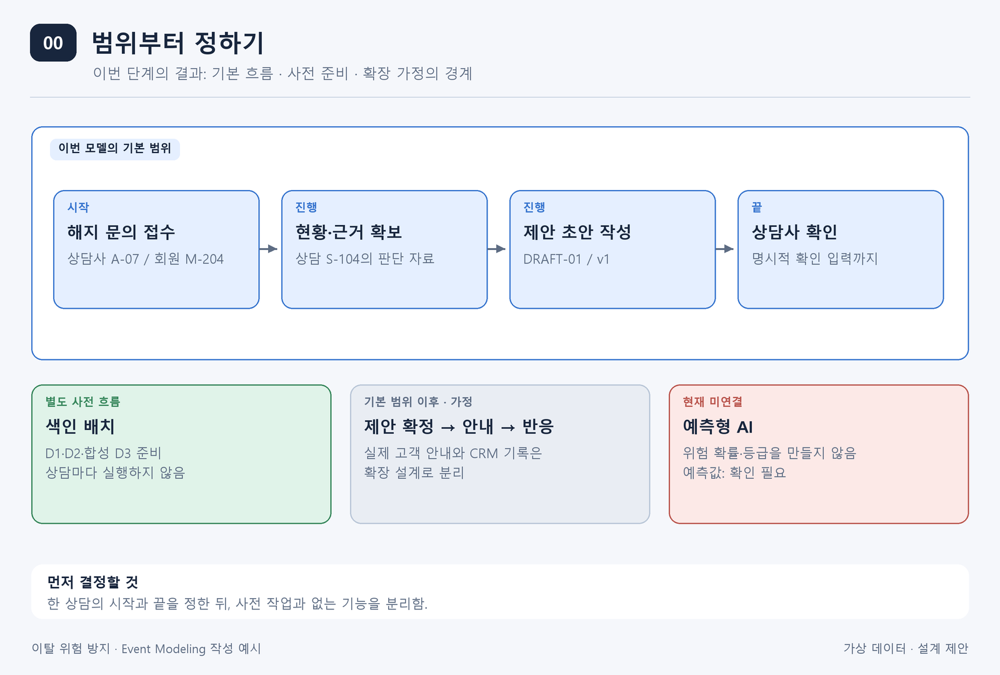
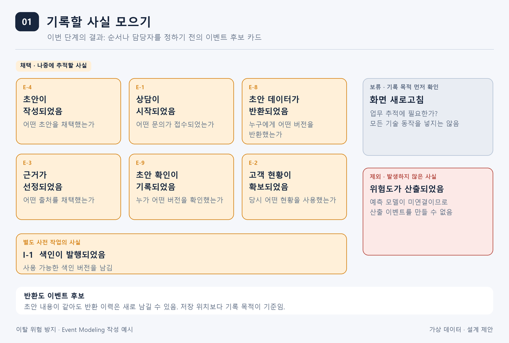
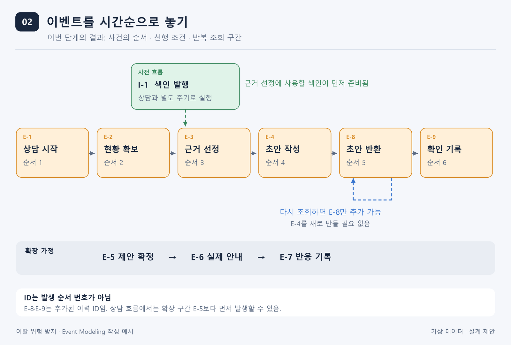
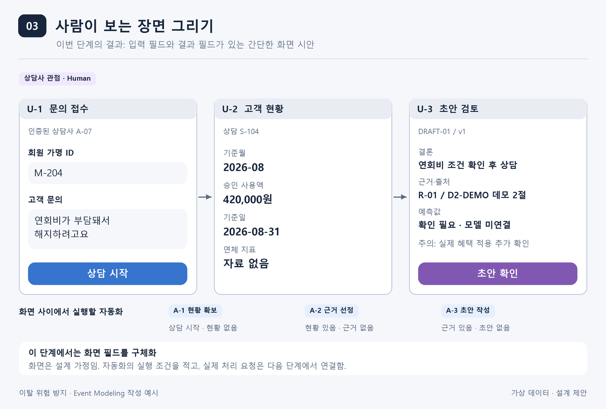
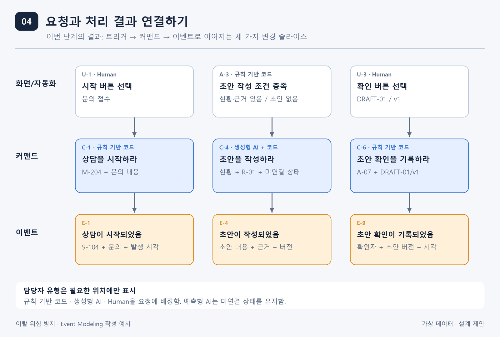
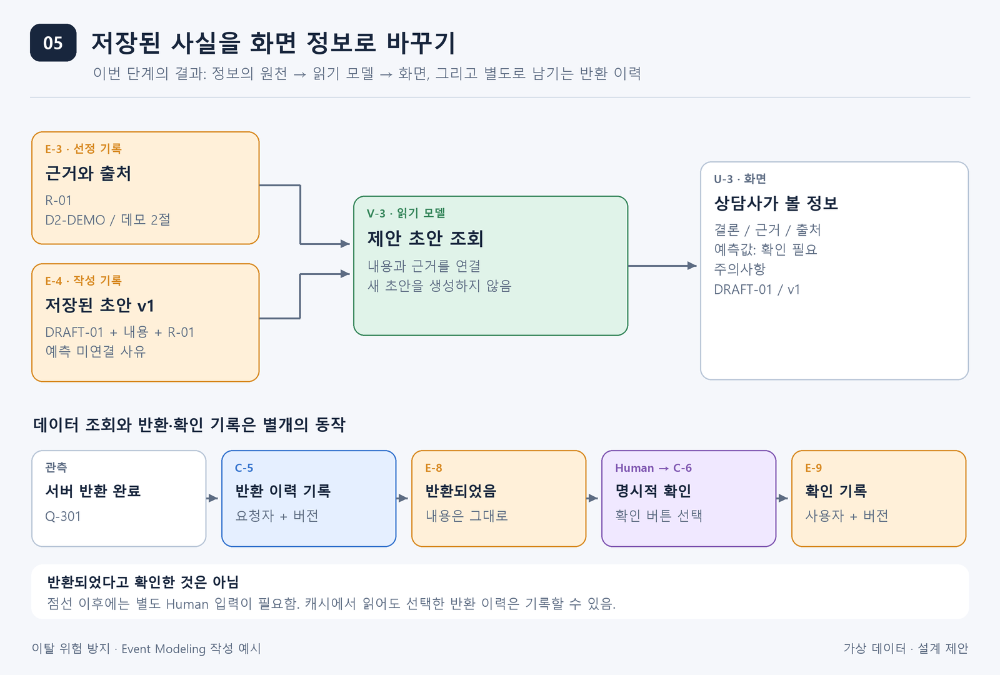
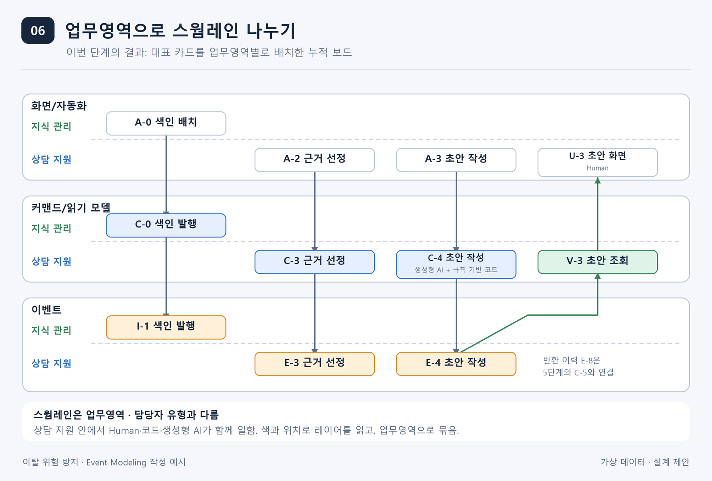
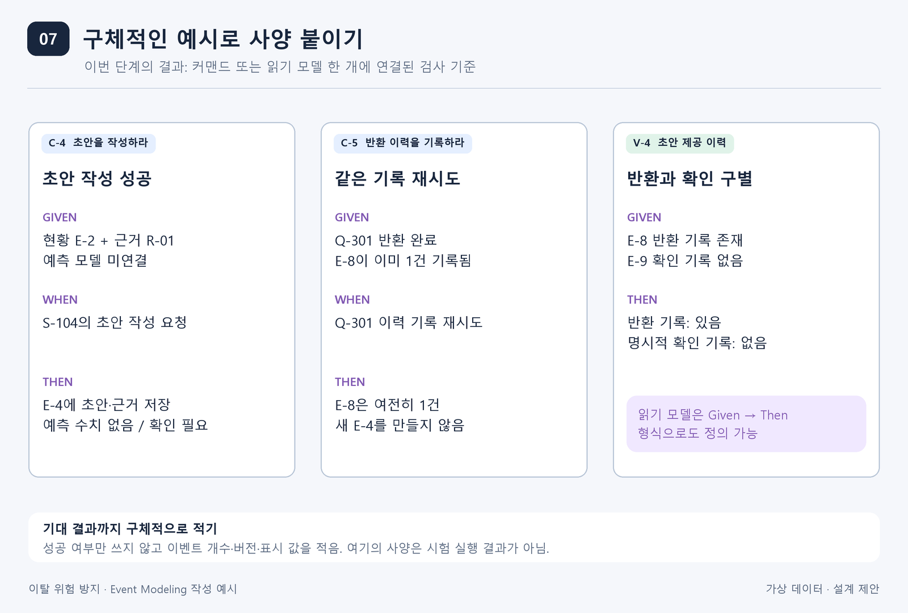
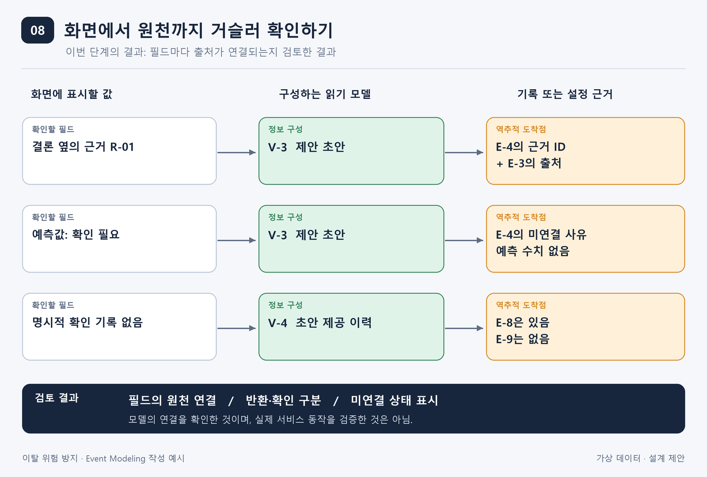

# 이탈 위험 방지 사례로 이해하는 이벤트 모델링

이 글에서는 카드 해지를 고민하는 고객의 상담 사례를 통해 이벤트 모델링을 어떻게 하는지 설명하겠습니다.  
이벤트 모델링에 사용하는 용어를 아는 것에서 한 걸음 더 나아가,  
실제 업무를 어떤 순서로 살펴보고 그림으로 표현하는지 이해하는 것이 목표입니다.

먼저 이벤트 모델링이 왜 필요한지 생각해 보고, 한 번의 상담이 진행되는 과정을 차례로 그려 보겠습니다.  
처음에는 일어난 사실을 메모하는 것부터 시작합니다. 여기에 시간 순서와 화면을 붙이고,  
작업 요청과 데이터의 연결을 더하면 시스템이 어떻게 동작해야 하는지 설명할 수 있는 설계가 됩니다.

## 이벤트 모델링은 왜 필요할까요?

고객이 상담사에게 “연회비가 부담돼서 해지하려고요”라고 말하는 상황을 생각해 보겠습니다.  
상담사는 고객의 이용 현황을 확인하고, 관련 자료를 찾아 고객에게 제안할 내용을 준비해야 합니다.  
AI가 이 일을 도와주면 상담사가 자료를 찾고 정리하는 수고를 줄일 수 있겠지요.

그런데 “AI가 상담 제안을 만들어 준다”는 설명만으로는 실제 서비스를 만들기 어렵습니다.  
개발자는 제안 문장을 생성하는 기능을 생각할 수 있고, 상담사는 그 문장의 근거와 출처까지 기대할 수 있습니다.  
운영 담당자는 나중에 문제가 생겼을 때 어떤 초안을 사용했는지 확인할 수 있어야 한다고 생각할 것입니다.  
같은 서비스를 이야기하고 있지만, 각자가 떠올리는 모습은 조금씩 다른 겁니다.

이벤트 모델링은 이런 차이를 함께 확인하는 데 도움이 됩니다.  
업무에서 어떤 일이 일어나고, 누가 무엇을 요청하며, 어떤 정보가 화면에 보이는지 하나의 흐름으로 표현합니다.  
그러면 “이 값은 어디서 가져오는가”, “이 작업이 끝나면 무엇이 남는가”를 같은 그림을 보면서 이야기할 수 있습니다.

이 글의 예시는 공식 Event Modeling의 7단계를 따릅니다.  
시작 전에 범위를 정하고, 마지막에는 빠진 연결이 없는지 살펴보는 과정을 덧붙였습니다.

## 준비. 먼저 어디까지 그릴지 정해 보겠습니다

상담 업무 전체를 한 번에 다루려고 하면 처음부터 그림이 복잡해집니다.  
우선 고객의 해지 문의를 접수하고, 현황과 근거를 모아 초안을 만든 뒤,  
상담사가 그 초안을 확인하는 곳까지를 이번 범위로 정하겠습니다.

초안을 확정해서 고객에게 안내하고 반응을 기록하는 일은 그다음에 이어질 과정입니다.  
이번 그림에는 확장할 수 있는 구간으로 표시해 두겠습니다.

위 그림에서 따로 놓은 색인 배치는 검색할 자료를 미리 준비하는 작업입니다.  
고객이 문의할 때마다 자료 전체를 다시 정리할 필요는 없겠지요.  
그래서 색인 배치는 별도로 실행하고, 상담 중에는 준비된 자료를 검색해서 사용하도록 구분했습니다.

현재 예측형 AI는 연결되어 있지 않습니다. 이탈 확률이나 위험 등급을 계산할 근거가 없으므로  
그 값을 임의로 만들지 않고, 화면에는 `확인 필요`라고 표시하겠습니다.

이후 그림은 같은 상담을 계속 따라갑니다. 상담 ID는 `S-104`, 가명 회원 ID는 `M-204`, 상담사는 `A-07`입니다.  
작성된 초안은 `DRAFT-01/v1`, 선정한 근거는 `R-01`로 표시합니다.  
이름을 붙여 두면 여러 그림에서 같은 정보를 다루고 있다는 것을 알아보기 쉽습니다.

화면과 금액, 문서 내용은 이해를 돕기 위한 가상 예시입니다. 실습에 사용한 D3 상담 이력도 합성 자료입니다.  
상담 화면과 이력 저장, CRM 연결은 이번에 설계하는 내용이며, 실제로 구현되었는지는 별도 확인이 필요합니다.

## 1단계. 어떤 사실을 기억해야 하는지 생각해 봅니다

상담이 끝난 뒤 담당자가 기록을 다시 살펴본다고 가정해 보겠습니다.  
어떤 문의가 접수되었고, 어떤 고객 현황과 근거를 참고했으며, 어떤 초안을 작성했는지 알 수 있어야 합니다.  
이렇게 업무에서 일어난 사실 중 나중에 추적할 필요가 있는 것을 이벤트로 기록합니다.

우선 생각나는 사실을 카드에 하나씩 적어 보겠습니다.  
“상담이 시작되었음”, “근거가 선정되었음”, “초안이 작성되었음”처럼 이미 일어난 일로 표현하면 됩니다.  
지금은 카드의 순서보다 어떤 사실을 남겨야 하는지 찾는 데 집중합니다.

위 그림에는 초안을 작성한 사실과 초안 데이터를 반환한 사실이 각각 들어 있습니다.  
초안을 만들었다는 것과 그 초안을 상담사에게 보냈다는 것은 서로 다른 사실이기 때문입니다.  
이 사례에서는 어떤 버전을 누구에게 보냈는지 추적하기 위해 반환 이력도 남기기로 했습니다.

저장된 초안을 다시 조회하는 경우에도 마찬가지입니다.  
초안 내용은 그대로지만, 데이터를 다시 반환한 이력은 새로 생길 수 있습니다.  
캐시나 체크포인트에서 읽었는지보다 **그 사실을 업무 기록으로 남길 필요가 있는지**를 기준으로 판단하면 됩니다.

여기서 반환과 확인도 나누어 생각해야 합니다.  
서버가 데이터를 보냈다고 해서 상담사가 내용을 읽었다고 볼 수는 없습니다.  
따라서 반환 이력은 `E-8`, 상담사가 확인 버튼을 누른 기록은 `E-9`로 구분했습니다.

반대로 예측 모델이 없는 상태에서 “위험도가 산출되었음”이라는 이벤트를 넣으면 실제와 다른 기록이 됩니다.  
이런 후보는 제외하고, 화면 새로고침처럼 기록 목적이 아직 분명하지 않은 것은 보류해 둡니다.

## 2단계. 이벤트를 이어서 한 번의 상담 이야기를 만듭니다

앞에서 기록할 사실을 모았으니, 이제 실제로 일어날 순서대로 놓아 보겠습니다.  
상담을 시작하고 고객 현황을 확보한 다음 근거를 선정합니다.  
그 자료로 초안을 작성해 상담사에게 반환하고, 상담사가 확인하면 그 사실을 기록합니다.

이렇게 연결하면 개별 카드였던 이벤트가 하나의 이야기가 됩니다.  
카드 사이를 살펴보면서 앞의 작업에서 무엇이 준비되어야 다음 작업을 할 수 있는지도 확인합니다.

근거를 선정하려면 검색할 수 있는 색인이 있어야 합니다.  
그래서 위쪽의 색인 발행과 근거 선정을 연결했습니다. 다만 색인 발행은 별도 주기로 실행하므로  
매 상담에 포함되는 작업처럼 배치하지 않았습니다.

그림 아래의 점선은 초안을 다시 조회하는 경우를 나타냅니다.  
같은 `DRAFT-01/v1`을 다시 보냈다면 반환 이벤트는 추가할 수 있지만,  
초안을 새로 만든 것은 아니므로 작성 이벤트까지 다시 남기지는 않습니다.

제안 확정, 실제 안내, 반응 기록은 기본 흐름 뒤에 이어질 확장 구간입니다.  
여기서 이벤트 ID는 카드를 구분하는 이름입니다. 번호가 반드시 시간 순서와 같을 필요는 없습니다.  
이 예시에서도 추가된 반환·확인 이력 `E-8`, `E-9`가 확장 구간의 `E-5`보다 먼저 나타납니다.

## 3단계. 상담사가 어떤 화면을 보게 될지 그려 봅니다

업무가 어떤 순서로 진행되는지 정했으니, 이번에는 상담사의 입장에서 생각해 보겠습니다.  
문의를 접수하려면 회원과 문의 내용을 입력할 수 있어야 합니다.  
고객 현황을 확인할 때는 사용액뿐 아니라 어느 기간의 자료인지도 보여 주어야 합니다.  
초안을 검토할 때는 제안 내용과 함께 그 근거를 확인할 수 있어야 하겠지요.

이런 내용을 간단한 화면으로 표현하면 아래와 같습니다.  
이 단계에서는 디자인을 정교하게 만드는 것보다, 필요한 입력과 정보를 빠뜨리지 않는 것이 중요합니다.

초안 검토 화면 `U-3`을 보면 결론, 근거와 출처, 예측값, 주의사항, 확인 버튼이 있습니다.  
상담사가 어떤 제안을 받았는지 이해하고 검토하는 데 필요하다고 판단한 항목들입니다.

이때는 **화면에 무엇이 필요한지**를 먼저 정합니다.  
각 값을 어디서 가져오고 어떻게 조합할지는 5단계에서 읽기 모델을 정의하면서 구체화합니다.  
그러니 지금 그린 화면을 한 번에 확정하려고 할 필요는 없습니다.  
데이터를 연결해 보면서 필요한 부분을 보완하면 됩니다.

한편 모든 작업을 상담사가 직접 시작할 필요는 없습니다.  
상담이 시작되었는데 현황이 없으면 현황 조회를 시작하고,  
근거가 준비되었는데 초안이 없으면 초안 작성을 시작하도록 자동화할 수 있습니다.  
그림 아래에는 이런 작업과 시작 조건을 적었습니다.

## 4단계. 화면의 행동을 실제 작업 요청으로 연결합니다

화면에 버튼이 있다고 해서 그 뒤의 동작까지 정해진 것은 아닙니다.  
버튼을 눌렀을 때 어떤 작업을 요청하고, 그 작업에 어떤 정보가 필요한지 더 구체적으로 적어야 합니다.  
이 요청을 나타내는 요소가 커맨드입니다.

예를 들어 문의 접수 화면의 시작 버튼은 “상담을 시작하라”라는 커맨드로 연결할 수 있습니다.  
초안 작성 자동화는 “초안을 작성하라”라는 커맨드를 보냅니다.  
각 커맨드에는 입력할 정보와 성공했을 때 남길 이벤트를 붙입니다.

가운데의 초안 작성 과정을 보겠습니다.  
초안을 작성하려면 고객 현황과 선정한 근거가 필요합니다.  
예측 모델이 미연결이라는 상태도 함께 전달해야, 없는 예측값을 생성하지 않도록 처리할 수 있습니다.

이 요청은 생성형 AI와 규칙 기반 코드가 함께 담당합니다.  
생성형 AI가 제공된 자료로 문장을 만들고, 코드는 결과를 검증한 뒤 채택한 초안을 저장합니다.  
처리가 끝나면 “초안이 작성되었음”이라는 이벤트가 남습니다.

이처럼 하나의 일을 여러 담당자 유형이 나누어 수행할 수 있습니다.  
이 가이드에서는 담당자 유형을 규칙 기반 코드, 예측형 AI, 생성형 AI, Human의 네 가지로 표시합니다.  
확인 버튼을 누르는 것은 Human의 행동이고, 그 입력을 검증하고 저장하는 것은 코드의 역할입니다.

그림의 각 세로 연결처럼 **입력부터 결과까지 하나의 동작을 설명하는 카드와 연결을 슬라이스라고 부릅니다.**  
상담 시작, 초안 작성, 확인 기록을 각각 따로 설명할 수 있게 된 것입니다.

## 5단계. 읽기 모델을 정의하고 화면을 보완합니다

앞에서 상담사가 볼 화면을 그렸고, 작업 요청으로 어떤 정보가 남는지도 정했습니다.  
이제 두 결과를 연결해 보겠습니다.  
3단계에서 그린 화면을 다시 펼쳐 놓고, 각 항목에 표시할 값을 어디서 가져올지 확인하는 것입니다.

초안 검토 화면의 결론과 주의사항은 저장된 초안에서 가져올 수 있습니다.  
근거와 출처는 초안에 붙어 있는 근거 ID로 선정 기록을 찾아 연결하면 됩니다.  
예측값은 모델이 미연결이라는 상태를 확인해서 `확인 필요`라는 문구로 구성합니다.

이렇게 화면에서 사용할 수 있도록 정보를 모아 정리하는 역할을 읽기 모델이 맡습니다.  
그림의 `V-3 제안 초안 조회`가 그 예입니다.

여기의 `U-3`은 3단계에서 그린 초안 검토 화면과 같은 화면입니다.  
3단계에서는 무엇을 보여 줄지 구상했고, 5단계에서는 그 값을 구성하는 방법을 정하는 것입니다.  
같은 화면이 다시 나오지만, 이번에는 화면의 각 값이 어디에서 왔는지까지 연결되어 있습니다.

이 과정에서 화면을 수정할 수도 있습니다.  
사용액을 연결하다 보니 기준월도 필요하다는 것을 알게 되거나,  
초안을 구분하려면 버전이 있어야 한다는 것을 발견할 수 있기 때문입니다.  
자료가 없을 때 빈칸으로 둘지, `자료 없음`이라고 표시할지도 함께 정합니다.

따라서 **3단계의 화면 구상과 5단계의 읽기 모델 정의는 서로 연결해서 발전시키는 작업**이라고 생각하시면 됩니다.  
필요한 정보가 이미 갖춰져 있다면 화면은 그대로 두고 데이터 연결만 확정해도 됩니다.

그림 아래에는 조회한 데이터를 반환한 뒤의 기록을 따로 표시했습니다.  
서버의 전송 완료를 확인하면 반환 이력 `E-8`을 남기고,  
상담사가 확인 버튼을 누르면 별도의 확인 기록 `E-9`를 남깁니다.  
저장된 초안을 읽는 일, 서버가 데이터를 보내는 일, 사람이 확인 의사를 남기는 일을 구분한 것입니다.

## 6단계. 카드를 업무영역별로 정리합니다

여기까지 진행하면 화면, 자동화, 커맨드, 읽기 모델, 이벤트가 서로 연결됩니다.  
카드가 많아졌으니 전체를 이해하기 쉽도록 배치를 정리할 필요가 있습니다.  
이때 사용하는 구분이 레이어와 스웜레인입니다.

레이어는 요소의 종류를 나눕니다.  
위쪽에는 화면과 자동화를, 가운데에는 커맨드와 읽기 모델을, 아래쪽에는 이벤트를 놓습니다.  
반면 스웜레인은 같은 업무영역의 카드를 모아 놓는 영역입니다.

원문을 준비하고 색인을 발행하는 카드는 `지식 관리`로 묶었습니다.  
고객 현황을 확인하고 근거를 선정해서 초안을 만드는 카드는 `상담 지원`에 속합니다.  
이렇게 보면 한 레이어 안에도 여러 업무영역의 스웜레인이 있을 수 있다는 것을 알 수 있습니다.

담당자 유형은 이 구분과 별개입니다.  
상담 지원에는 Human이 사용하는 화면도 있고, 생성형 AI와 코드가 함께 수행하는 작업도 있습니다.  
누가 수행하는지가 달라도 같은 업무에 속할 수 있는 것이죠.  
그래서 담당자 유형이 달라질 때마다 스웜레인을 새로 만들지는 않습니다.

DB나 LLM API 같은 기술 구성요소도 그 이름만으로 업무영역이 되는 것은 아닙니다.  
먼저 어떤 업무를 책임지는지 생각하고, 그 안에서 필요한 기술과 담당자를 연결하는 편이 이해하기 쉽습니다.  
그림은 이 배치를 설명하기 위해 대표 카드만 모았으며, 반환·확인 기록도 같은 방식으로 이어서 배치할 수 있습니다.

## 7단계. 구체적인 예시로 동작 기준을 정합니다

카드와 연결선으로 전체 흐름은 설명할 수 있게 되었습니다.  
하지만 실제로 만들려면 좀 더 자세히 정해야 할 일이 남아 있습니다.  
자료를 찾지 못한 경우나 같은 요청을 다시 받은 경우에도 어떻게 처리할지 합의해야 합니다.

이런 조건을 구체적인 예시로 적은 것이 사양입니다.  
커맨드에는 어떤 상황에서(Given), 무엇을 요청하면(When), 어떤 결과가 나와야 하는지(Then)를 적습니다.  
읽기 모델은 기존 정보를 읽어 구성하므로 Given과 Then만으로도 설명할 수 있습니다.

왼쪽은 초안 작성이 성공하는 경우입니다.  
현황과 근거가 준비되어 있으면 초안을 저장하되, 연결되지 않은 예측 모델의 수치는 만들지 않도록 정했습니다.

가운데는 반환 이력을 다시 기록하려는 경우입니다.  
같은 요청 `Q-301`에 대한 기록이 이미 있다면 재시도하더라도 기록은 한 건으로 유지해야 합니다.  
초안 내용도 바뀌지 않았으므로 작성 이벤트를 새로 남기지 않습니다.

오른쪽은 반환 기록만 있고 확인 기록은 없는 경우입니다.  
읽기 모델은 이 상태를 그대로 보여 주어야 합니다. 데이터를 보냈다는 사실만으로 사람이 확인했다고 판단하면 안 됩니다.

이처럼 사양을 적으면 “정상적으로 처리한다”는 막연한 설명을 실제로 검사할 수 있는 조건으로 바꿀 수 있습니다.  
사양 하나를 커맨드나 읽기 모델 하나에 연결해 두면, 어떤 동작의 기준인지도 분명해집니다.  
전송 실패 때 반환 완료 기록을 남기지 않는 조건이나, 근거가 없을 때 초안 작성을 멈추는 조건도 추가할 수 있습니다.

## 마무리. 화면에서 출발해 정보의 출처를 확인합니다

마지막으로 상담사가 보는 화면을 다시 살펴보겠습니다.  
화면의 결론과 근거, 출처가 어떤 읽기 모델을 거쳐 어떤 기록에서 왔는지 거꾸로 따라가 보는 것입니다.  
연결되지 않는 값이 있다면, 필요한 데이터나 처리 규칙이 아직 빠져 있다는 뜻입니다.

예를 들어 초안의 근거를 따라가면 선정 기록과 문서 출처에 도달해야 합니다.  
예측값의 `확인 필요`는 예측 결과가 아니라 모델 미연결 상태에서 나온 표시여야 합니다.  
상담사의 확인 여부는 반환 기록이 아니라 확인 버튼을 누른 기록에 근거해야 합니다.

여기까지 살펴보면 무엇을 요청하고, 어떤 결과를 남기며, 어떤 정보를 보여 줄지 함께 설명할 수 있습니다.  
개발을 시작한 뒤에 발견했을 누락이나 서로 다른 기대를 설계 과정에서 미리 확인할 수 있는 것입니다.

이 그림은 모델의 연결을 검토한 결과입니다. 실제 서비스에 적용할 때는 가상 데이터를 바꾸고,  
저장 방식과 처리 규칙을 확정한 뒤 구현과 기능 시험을 진행해야 합니다.

## 참고 자료

이 가이드의 1단계부터 7단계는 공식 Event Modeling의 작성 순서를 따릅니다.  
업무영역 중심의 스웜레인과 네 가지 담당자 유형은 이 사례를 설명하기 위해 정한 표현 방식입니다.  
반환·확인 이력도 이번 업무에서 필요해 선택한 기록이며, 모든 조회에 반드시 적용하는 규칙은 아닙니다.

- [Event Modeling: What is Event Modeling?][official-steps] — 공식 7단계와 완결성 점검을 설명합니다.  
- [Event Modeling Cheat Sheet][official-patterns] — 커맨드·읽기 모델·자동화 등의 기본 연결 패턴을 설명합니다.  
- [D3 실습 안내](../../../../hybrid-ai-lab/docs/D3_README.md) — 합성 상담 자료와 예측 학습 범위를 확인할 수 있습니다.  
- [현황 요약 프롬프트][context-prompt] — 실습에서 사용한 출력 항목과 미연결 기능을 확인할 수 있습니다.

[official-steps]: https://eventmodeling.org/posts/what-is-event-modeling/  
[official-patterns]: https://eventmodeling.org/posts/event-modeling-cheatsheet/  
[context-prompt]: ../../../../hybrid-ai-lab/s2.2/src/nl2sql/prompts/05_ask_with_context.md
