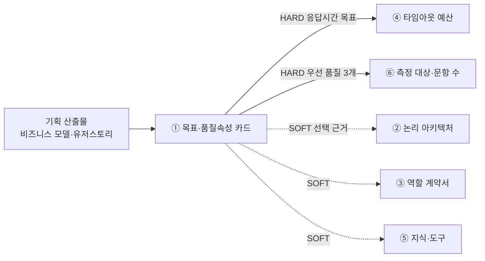

# 설계서 ① 목표·품질속성 카드 — 작성 가이드

## 1. 이 설계서가 답하는 질문

**"이 시스템이 성공했다는 걸 무엇으로 판정할 것인가?"**

성공 기준 3개와 우선 품질속성 3개를 **숫자로 잴 수 있는 문장**으로 못박는 카드임.
7종 중 가장 먼저 씀. 앞에서 받을 입력이 없기 때문임.

**이걸 대충 하면 나는 사고 3가지**

- ④에서 단계별 타임아웃을 나눌 기준이 없어 예산 배분이 감이 됨
- ⑥에서 무엇을 몇 문항으로 측정할지 정하지 못해 품질 측정이 통째로 빠짐
- 발표 때 "왜 이 구조인가"에 답할 근거가 없어 설계 전체가 취향 문제로 보임

`HARD`는 이게 없으면 뒤 칸을 아예 못 채운다는 뜻임. `SOFT`는 없어도 시작은 되나 나중에 다시 손봐야 함.

## 2. 시작 전 판정

**기획 자료가 없으면** 아래 3줄을 먼저 하고 시작함. 없다고 멈추지 않음.

- ⓐ 팀이 아웃컴 3건을 문장으로 선언함 — "누가 무엇을 얼마나 빨리·정확히 하게 되는가"
- ⓑ 그 문장에서 뽑은 수치에 전부 `추정` 태그를 붙임
- ⓒ 되물을 대상과 기한을 `미확정 항목` 표에 1행씩 적음

기획 산출물의 지표를 그대로 다 옮기면 안 됨. **시스템이 책임질 수 있는 것만** 골라야 함.
지표 하나마다 아래 4개를 묻고 3분류로 나눔.

| 질문 | 아니오면 |
|------|---------|
| T-1 이 값이 **시스템 실행 기록만으로** 계산되는가? | 책임 밖 |
| T-2 시스템이 **직접 바꿀 수 있는** 값인가? | 공동 책임 |
| T-3 목표 시점이 **이번 범위 안**인가? (Y3 목표는 제외) | 책임 밖 |
| T-4 사람의 습관·조직 변화가 **끼지 않아도** 달성되는가? | 공동 책임 |

3분류 처리 방법임.

| 분류 | 처리 |
|------|------|
| **시스템 책임** | 성공 기준 3개 후보로 올림 |
| **공동 책임** | 성공 기준에 올리지 않음. `제외 지표` 표에 `목표값 = 공동 책임 — 목표 미설정`으로 기록하고 ⑥ 측정 대상으로 넘김 |
| **책임 밖** | `제외 지표` 표에 탈락 테스트 번호와 함께 기록함 |

**우선 품질속성은 5개 중 3개**만 고름 — 정확성 · 응답시간 · 설명가능성 · 안전성 · 비용효율성.
고르지 않은 2개에도 **탈락 사유를 1줄씩** 남김. 안 쓴 이유가 남아야 나중에 다시 논의할 수 있음.

## 3. 칸별 작성법

| 칸 | 무엇을 쓰나 | 어디서 가져오나 | 좋은 예 | 나쁜 예 |
|----|-----------|---------------|---------|---------|
| 성공 기준 | 시스템이 해내야 할 일 1줄 | BM 비즈니스가치 연계 지표 | 단계 간 핸드오프가 사람 손 없이 넘어감 | 업무가 편해짐 |
| 측정 방법 | 무엇을 세어 계산하는지 | 시스템 실행 기록으로 한정 | 접수~배분 완료 이벤트 시각 차 집계 | 담당자 설문 |
| 목표값 | **숫자 + 단위** | 기획 산출물 원문 인용 | 15분 이내 | 빠르게 |
| 측정 시점 | 언제 재는지 | 단계 라벨 | 구현 단계 기준선·배포 단계 재측정 | 수시 |
| 개선 전 기준선 | **고치기 전** 수치 | BM Problem·US Pain Point | 2 ~ 4시간 | (목표값과 같은 칸에 씀) |
| 근거 출처 | 어느 문서 어디서 왔는지 | `BM:8-KeyMetrics#고객가치1` | BM:8-KeyMetrics#고객가치2 | (공란) |
| 후행 소비처 | 뒤 산출물 중 이 값을 쓰는 곳 | ④ 타임아웃 / ⑥ 측정 대상 | ④ 타임아웃 예산 | (공란) |
| 성격 선언 | 산출물이 확정 실행이 아님을 밝힘 | 고정 문구 | 확정 실행이 아닌 제시임 | (문장 없음) |

**목표값 칸에 숫자와 단위가 없으면 그 행은 미완성임.** 원문에 수치가 없으면 지어내지 말고
`[확인필요: 목표값]`으로 두고 건수를 세어 적음.

## 4. 프롬프트에 없지만 반드시 채울 것

**(1) 기준선과 목표값을 섞지 않는 법**

프롬프트는 "섞지 말라"고만 함. 실제로는 이렇게 구분함.

| 값의 성격 | 어디서 오나 | 어느 칸에 |
|----------|-----------|----------|
| 지금 이렇게 나쁘다 | BM `Problem`, US `Pain Point` | **개선 전 기준선** 표 |
| 이렇게 만들겠다 | BM `Key Metrics` To-Be 열 | **목표값** 칸 |

같은 지표라도 두 값이 다른 표에 들어감. 헷갈리면 **"이 숫자가 자랑거리인가 부끄러운 것인가"**를 물음.
부끄러운 쪽이 기준선임.

**(2) 품질속성 이름을 어디서 가져올 것인가**

A05 정리본에서 확인한 사실임. AgentArcEval 논문은 **ATAM 6요소는 이어받지만
ISO/IEC 25010은 한 번도 참조하지 않음**. `contestability`(이의제기 가능성) 같은 고유 어휘를 씀.
따라서 **"ISO 25010을 따랐다"고 쓰면 사실과 다름.** 팀이 어휘를 고르고 출처를 적으면 됨.
논문의 사례연구 카드는 6칸이 아니라 **9칸**임. 칸을 늘릴 때 이 근거를 쓸 수 있음.

**(3) 규제 문구를 함부로 인용하지 않기**

금융 도메인이면 성격 선언에 규제 근거를 달고 싶어짐.
A10 정리본대로 금융위 가이드라인의 `보조수단성` 원칙은 "사람이 최종 판단한다"의 직접 근거가 됨.
반면 **`최소수집`·`비식별`은 이 가이드라인에 근거가 없음.** 다른 법령을 찾거나 `[확인필요]`로 둠.

## 5. 예시

### 5-1. KT 개통 자동화 — 한 줄기 완주

> 아래 인용은 강사가 가진 기획 자료임. **열 수 없어도 됨.**
> 볼 것은 값이 아니라 **판단 경로**임.

기획 자료 `~/workspace/oss/docs/plan/think/비즈니스모델.md` 8절 표에서 시작함.

**단계 1 — 지표 후보 수집**

| 지표 | As-Is | Y1 목표 |
|------|-------|---------|
| 단계 간 핸드오프 소요 시간 | 2 ~ 4시간 | 15분 이내 |
| 정합성 오류율 | 25 ~ 30% | 10% 이하 |
| 현황 파악 소요 시간 | 40분 ~ 1시간/일 | 10분 이내 |
| SLA 위반 사전 감지율 | 0%(사후 인지) | 50% 이상 |
| Oracle 라이선스 절감률 | 0% | 30% 축소 |

**단계 2 — T-1~T-4 판정**

| 지표 | 판정 | 이유 |
|------|------|------|
| 핸드오프 소요 시간 | 시스템 책임 | 이벤트 시각 차로 계산됨. 시스템이 직접 줄임 |
| 정합성 오류율 | 시스템 책임 | 검증 게이트 통과·반려 기록으로 계산됨 |
| 현황 파악 소요 시간 | **공동 책임** | 화면이 빨라도 사용자가 언제 보는지에 달림(T-4 탈락) |
| SLA 위반 사전 감지율 | 시스템 책임 | 예측 시각과 실제 위반 시각 대조로 계산됨 |
| Oracle 라이선스 절감률 | **책임 밖** | 조달·계약 영역임(T-2 탈락) |

**단계 3 — 성공 기준 1행 완성**

| # | 성공 기준 | 측정 방법 | 목표값 | 측정 시점 | 근거 출처 | 후행 소비처 |
|---|----------|----------|--------|----------|----------|------------|
| G-1 | 접수된 개통 요청이 사람 손 없이 다음 단계로 넘어감 | 접수 이벤트~배분 완료 이벤트 시각 차 p95 집계 | 15분 이내 | 구현 단계 기준선·배포 단계 재측정 | BM:8-KeyMetrics#고객가치1 | ④ 타임아웃 예산, ⑥ 측정 대상 |

**단계 4 — 같은 지표의 기준선은 다른 표에**

| 대상 지표 | 기준선 값 | 측정 단위 | 근거 출처 |
|----------|----------|----------|----------|
| 단계 간 핸드오프 소요 시간 | 2 ~ 4 | 시간/건 | BM:1-Problem#1 |

**단계 5 — ④로 넘어감**

G-1의 `15분 이내`가 ④ 타임아웃 예산의 총량이 됨.
④는 이 15분을 단계별로 쪼갬. 이때 **재시도까지 포함한 최악값**으로 합계를 맞춰야 함(④ 가이드 참조).

`현황 파악 소요 시간`은 공동 책임이므로 성공 기준에 올리지 않고 `제외 지표` 표에 남김.
목표값 칸에는 `공동 책임 — 목표 미설정`을 씀. ⑥에서는 측정은 함.

### 5-2. 마이데이터 금융상품 추천

근거는 [_shared/마이데이터-케이스.md](_shared/마이데이터-케이스.md)임.
**이 케이스는 기획 산출물이 없어 수치가 전부 `추정`임.**
실제 과제에서는 추정값을 그대로 쓰지 말고 `[확인필요]`로 되물어야 함.

**미충족 아웃컴 3건을 T 판정에 넣으면**

| 아웃컴 | 판정 | 이유 |
|--------|------|------|
| O-1 사회초년생의 **선택 시간** 최소화 | **공동 책임** | 제안서를 빨리 줘도 고르는 것은 사람임(T-4 탈락) |
| O-2 텔레마케터의 **작성 시간** 최소화 | 시스템 책임 | AI가 그 일을 대신함. 생성 시각 차로 계산됨 |
| O-3 제안서 **품질 저하 확률** 최소화 | 시스템 책임 | 근거 표기율·부적합 포함률로 계산됨 |

O-1이 개통 자동화의 `현황 파악 소요 시간`과 같은 자리임. 둘 다 사람의 행동이 끼어 공동 책임이 됨.

**개통 자동화와 결정적으로 다른 점 — 인용할 숫자가 없음**

| | 개통 자동화 | 마이데이터 |
|---|---|---|
| 목표값 출처 | `BM:8-KeyMetrics` 원문 인용 | **없음** — `추정` 또는 `[확인필요]` |
| 성공 기준 1행 | `15분 이내`(인용) | `5분 이내`(케이스:M-1 `추정`) |

**`[확인필요]`가 3건을 넘으면 기획 산출물을 덜 읽은 것**이라고 6절에 적었으나,
이 케이스는 **기획 산출물 자체가 없어서** 그런 경우임. 태그를 다는 것이 옳음.
왜 났는지 한 줄을 남기면 되물을 때 근거가 됨.

**품질속성 선정이 사실상 강제됨**

`설명가능성`을 뺄 수 없음. 커리큘럼이 `추천 근거 추적 — 어느 자산 항목으로 어떤 상품을
권했는지 끝까지 전파`를 요구하기 때문임(`KT:7-3#추천근거추적`).
게다가 과거 제안서를 근거로 쓰는 시나리오(`케이스:3-2`)에서는 **근거가 남의 문서에서 왔는지
내 자산에서 왔는지**까지 구분해야 하므로 설명가능성의 무게가 더 커짐.

**성격 선언이 형식이 아니라 핵심임**

산출물 이름 자체가 `제안서`임. 사회초년생이 최종적으로 고름(`케이스` As-Is/To-Be 마지막 단계).
`확정 실행이 아닌 제시임` 문구는 금융위 가이드라인의 `보조수단성` 원칙과도 맞음
([A10](../references/articles/A10_reg_fsc-ai-guideline.md)).

## 6. 자주 틀리는 5가지

| # | 양상 | 왜 생기나 | 어떻게 막나 |
|---|------|----------|------------|
| 1 | `25 ~ 30%`를 목표값 칸에 씀 | 기획서에서 눈에 띄는 숫자를 그대로 옮김 | 4절 (1)의 "자랑거리인가 부끄러운 것인가" 질문을 씀 |
| 2 | 성공 기준이 6개, 품질속성이 5개로 늘어남 | 다 중요해 보여서 못 버림 | 3개 초과는 규격 위반임. 나머지는 `제외 지표`로 내리고 탈락 사유를 남김 |
| 3 | 목표값이 "빠르게"·"정확하게" | 기획서에 숫자가 없어 형용사로 채움 | 지어내지 말고 `[확인필요: 목표값]`으로 두고 건수를 셈 |
| 4 | 설문·인터뷰를 측정 방법으로 씀 | 사람에게 물으면 될 것 같음 | 측정 방법은 **시스템 실행 기록만으로** 계산되는 것으로 한정함 |
| 5 | Oracle 절감률 같은 사업 지표를 성공 기준에 올림 | 기획서 상위 지표라 중요해 보임 | T-2로 걸러짐. 시스템이 직접 못 바꾸면 책임 밖임 |

3번이 가장 흔함. 숫자가 없는 상태를 **드러내는 것**이 채워 넣는 것보다 나음.
`[확인필요]`가 3건을 넘으면 기획 산출물을 덜 읽었을 가능성이 큼.

## 7. 제출 전 자가 점검표

- [ ] 성공 기준 표가 정확히 3행임
- [ ] 품질속성 표가 정확히 3행이고, 고르지 않은 2개에 탈락 사유가 1줄씩 있음
- [ ] 두 표의 `측정 방법`·`목표값`·`측정 시점`·`근거 출처`·`후행 소비처` 5열에 공란이 0개임
- [ ] 목표값 칸 전부가 (숫자 1개 이상 + 단위 1개 이상)이거나 `[확인필요: 목표값]`임
- [ ] `개선 전 기준선` 표가 따로 있고 `기준선 값` 칸에 공란이 0개임
- [ ] 기준선 표의 숫자가 목표값 칸에 들어가 있지 않음
- [ ] `확정 실행이 아닌 제시임` 문구가 문서에서 1건 이상 검색됨
- [ ] `제외 지표` 표에 공동 책임·책임 밖 지표가 탈락 이유와 함께 있음
- [ ] `[확인필요]` 태그 건수가 숫자로 적혀 있음
- [ ] 부속 표 3종(`제외 지표`·`미대응 Pain Point`·`기획 산출물 대조 기록`)이 0건이어도 `0건`으로 있음

## 8. 다음으로 넘기는 값과 근거 자료

| 넘기는 값 | 받는 곳 | 강도 |
|----------|--------|------|
| 응답시간 목표값 | ④ 타임아웃 예산 | HARD — 없으면 못 채움 |
| 우선 품질속성 3개 | ⑥ 측정 대상·문항 수 | HARD |
| 성공 기준·품질 우선순위 | ② 구성 배치 결정 사유 | SOFT |
| 성공 기준 분해 | ③ 에이전트별 성공 기준 | SOFT |
| 설명가능성 채택 여부 | ⑤ 검색 경로 선택 근거 상세도 | SOFT |

| 아티클 | 어느 칸에 |
|--------|----------|
| [A05](../references/articles/A05_paper_agentarceval.md) | 카드 양식(사례연구 카드 9칸) · 품질속성 어휘 출처 판단 |
| [A10](../references/articles/A10_reg_fsc-ai-guideline.md) | 성격 선언 문장의 규제 근거(`보조수단성`) |
| [A01](../references/articles/A01_blog_anthropic-when-multi-agent.md) | 품질속성 우선순위가 ③ 단일·멀티 판정에 미치는 영향 |

규격 원문은 `prompts/architecture/01-목표품질속성카드.md`와
`prompts/architecture/00-산출물규격.md` 1·2절임.
