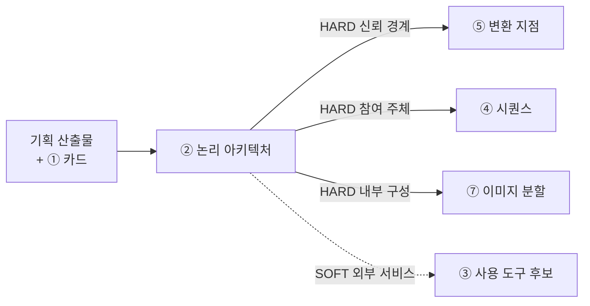
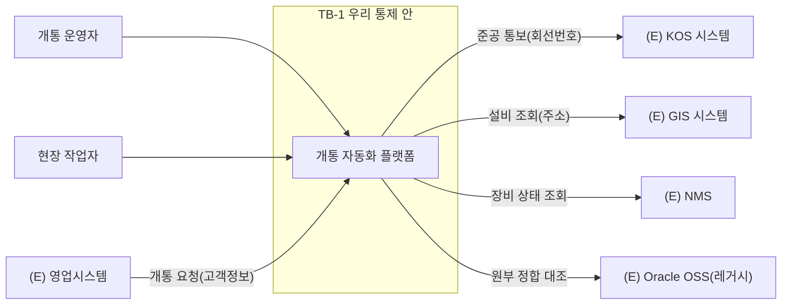

# 설계서 ② 논리 아키텍처 — 작성 가이드

## 1. 이 설계서가 답하는 질문

**"무엇이 어디에 있고, 어디부터가 우리 통제 밖인가?"**

시스템과 외부 서비스의 관계를 그리고, **민감정보가 통제 밖으로 나가는 선**을 표시하는 문서임.
도식 2장(전체 관계도·내부 구성도)과 표 4개로 이뤄짐.

**이걸 대충 하면 나는 사고 3가지**

- 경계선이 없어 마스킹을 어디에 걸지 정하지 못함. ⑤·⑥이 통째로 막힘
- 내부 구성이 안 나뉘어 ⑦에서 이미지를 몇 개로 쪼갤지 논쟁만 하다 하루가 감
- 외부 시스템 중 무엇이 진짜고 무엇이 흉내인지 몰라 구현 때 없는 API를 부름

②는 **HARD로 넘겨주는 게 가장 많은 산출물**임(③④⑤⑦). ②가 늦으면 네 개가 한꺼번에 멈춤.
`HARD`는 이게 없으면 뒤 칸을 아예 못 채운다는 뜻임. `SOFT`는 나중에 손봐도 됨.

## 2. 시작 전 판정

**판정 1 — 두 도식을 어떻게 가르나**

가장 많이 헷갈리는 지점임. 기준은 하나임. **우리가 만드는 것인가 아닌가.**

| | 1단계 전체 관계도 | 2단계 내부 구성도 |
|---|-----------------|-----------------|
| 무엇을 그리나 | 우리 시스템을 **상자 하나**로 두고 바깥과의 관계 | 그 상자 **안**을 열어 나눔 |
| 노드가 되는 것 | 사용자·외부 시스템·저장소 | 우리가 만드는 실행 단위 |
| 나누는 기준 | 소유 주체가 다른가 | 따로 배포·실행되는가 |
| 안 그리는 것 | 내부 모듈 | 외부 시스템 상세 |

**판정 2 — 신뢰 경계를 어디에 긋나**

경계는 조직도가 아니라 **데이터가 넘어가는 곳**에 그음. 아래를 순서대로 물음.

| 순서 | 질문 | 예면 |
|------|------|------|
| 1 | 이 선을 넘으면 **우리가 로그를 못 보는가**? | 경계임 |
| 2 | 이 선을 넘으면 **접근 권한 주체가 바뀌는가**? | 경계임 |
| 3 | 이 선을 넘어 **민감정보가 나가는가**? | 경계임 + 나가는 항목명을 라벨로 붙임 |
| 4 | 셋 다 아니오 | 경계 아님. 그냥 내부 연결임 |

경계마다 `TB-1`·`TB-2` 같은 번호를 붙임. ⑤와 ⑥이 이 번호로 인용하기 때문임.

**판정 3 — 실물인가 Mock인가**

`Mock`은 실물 대신 두는 대체품임. 판정 기준은 **이번 범위에서 실제로 붙을 수 있는가**임.
못 붙이면 Mock이고, 그 사유를 `대체 사유` 칸에 적음. "아마 될 것"으로 실물이라 적지 않음.

## 3. 칸별 작성법

| 칸 | 무엇을 쓰나 | 어디서 가져오나 | 좋은 예 | 나쁜 예 |
|----|-----------|---------------|---------|---------|
| 전체 관계도 노드 | 외부 액터·외부 시스템·저장소 | 이벤트스토밍 `participant`·`actor` | (E) KOS 시스템 | 카프카 |
| 간선 라벨 | 오가는 **데이터 항목명** | 이벤트스토밍 이벤트명 | 준공 통보(회선번호) | 데이터 전송 |
| 내부 구성도 노드 | 따로 배포되는 실행 단위 | 코드베이스 구성요소 목록 | 검증 게이트 서비스 | 유틸 함수 |
| 신뢰 경계 | `subgraph`로 감싸고 `TB-n` 부여 | US NFR 보안 체크리스트 | TB-1 사내망 밖 | (표시 없음) |
| 경계 통과 데이터 | 경계를 넘는 항목 유형 | 민감정보 목록 | 고객 회선정보 | 일부 정보 |
| 외부 서비스 `구분` | `실물` 또는 `Mock` 2값만 | 연계 가능 여부 | Mock | 실물(예정) |
| 대체 사유 | Mock인 이유 1줄 | 연계 규칙 | 레거시 접속 권한 미확보 | (공란) |
| 근거 출처 | `{약칭}:{항목 ID}#{하위}` | BM·US·PR 3종 | US:NFR-SEC-010#체크리스트1 | (공란) |
| 배치 결정 사유 | ①의 품질 3개로 설명 | ① 품질속성 표 | 응답시간 목표로 조회 경로를 분리함 | 확장성을 고려함 |

**②가 쓰지 않는 것** — 에이전트별 책임(③), 시퀀스 단계(④), 마스킹 방식(⑤), 배포 단위(⑦).
②는 **위치와 경계만** 정함. 여기서 앞서가면 뒤 산출물과 값이 두 곳에 생겨 어긋남.

## 4. 프롬프트에 없지만 반드시 채울 것

**(1) 경계선을 긋고 나서 반드시 해야 하는 확인**

프롬프트는 경계를 그리라고만 함. 그린 뒤 아래를 확인해야 ⑤·⑥이 막히지 않음.

- 경계를 넘는 간선이 **하나도 없는** 경계가 있으면 그 경계는 지움. 쓸모가 없음
- 경계를 넘는 간선에 **라벨이 없으면** ⑤가 변환 지점을 못 정함. 항목명을 반드시 붙임
- 같은 데이터가 **두 경계를 넘으면** 마스킹이 두 번 필요함. ⑥에 넘길 때 이 사실을 적음

**(2) Mock 목록의 주인은 ②, 자리는 ⑤**

규격 미결이던 항목을 팀 토론으로 확정함(G-10).
**Mock·실물 구분 목록은 ⑤에 두되, 값을 정하는 주인은 ②임.**
⑤는 커넥터 단위로 펼쳐 쓰기만 함. ⑤에서 구분을 바꾸고 싶으면 ②를 고침.
타임아웃을 ④가 소유하고 ⑥이 참조만 하는 것과 같은 방식임.

**(3) 이벤트스토밍이 있으면 관계도를 새로 그리지 않음**

이벤트스토밍의 `participant`와 `database`가 곧 전체 관계도의 노드임.
새로 상상하지 말고 옮김. 옮기면서 빠진 것이 있으면 그게 진짜 발견임.

## 5. 예시

### 5-1. KT 개통 자동화 — 한 줄기 완주

> 아래 인용은 강사가 가진 기획 자료임. **열 수 없어도 됨.**
> 볼 것은 값이 아니라 **판단 경로**임.

이벤트스토밍 `~/workspace/oss/docs/plan/think/es/*.puml`에서 시작함.

**단계 1 — 노드 수집(옮겨 적기)**

| 종류 | 값 |
|------|-----|
| 외부 액터 | 개통 운영자 · 시설선정 담당자 · 장치연동 엔지니어 · 원부구축 담당자 · 현장 작업자 |
| 외부 시스템 | (E) KOS 시스템 · (E) GIS 시스템 · (E) NMS · (E) Oracle OSS(레거시) · (E) 영업시스템 |
| 저장소 | 요청 · 설비 · 작업 · 연동 · 원부 · 준공 · 오류 이력 · 분석 저장소 |

**단계 2 — 전체 관계도**

**단계 3 — 경계 판정**

`(E) Oracle OSS`로 가는 선에 판정 3개를 적용함.

| 질문 | 답 | 결론 |
|------|-----|------|
| 로그를 못 보는가 | 예 | 경계임 |
| 권한 주체가 바뀌는가 | 예 | 경계임 |
| 민감정보가 나가는가 | 예 — 고객 회선정보 | 라벨 필수 |

→ `TB-2`를 부여하고 간선 라벨에 `고객 회선정보`를 적음.

**단계 4 — 외부 서비스 목록 1행**

| # | 외부 서비스 | 구분 | 대체 사유 | 접속 방식 | 경계 통과 데이터 | 근거 출처 | 후행 소비처 |
|---|-----------|------|----------|----------|----------------|----------|------------|
| E-1 | (E) Oracle OSS(레거시) | Mock | 레거시 접속 권한 미확보 | 도구 연결 규격 커넥터 | 고객 회선정보 | ES:05-원부매핑#외부연계 | ⑤ 커넥터 목록, ③ 사용 도구 후보 |

**단계 5 — 뒤로 넘김**

- `TB-2`와 `고객 회선정보` → ⑤가 여기에 변환(마스킹) 지점을 걺
- `E-1 Mock` → ③이 사용 도구 후보에서 실물로 착각하지 않게 함
- 내부 구성도의 실행 단위 수 → ⑦이 이미지 분할 근거로 씀

`정합성 오류율 25 ~ 30%`(BM 8절)가 문제의 핵심이므로, 검증 게이트를 별도 실행 단위로 두는
배치 결정 사유를 ①의 품질속성과 연결해 3줄 이내로 적음.

### 5-2. 마이데이터 금융상품 추천

근거는 [_shared/마이데이터-케이스.md](_shared/마이데이터-케이스.md)임.
기획 산출물이 없어 구성은 `추정`임. 실제 과제에서는 `[확인필요]`로 되물음.

**경계 판정이 개통 자동화와 반대로 나옴**

개통은 고객 회선정보가 시스템 안을 그대로 흐름.
여기는 **마이데이터가 익명으로 들어옴**(`케이스:R-1`) — 익명화가 시스템 앞에서 이미 끝나 있음.

2절 판정 3질문을 유입 경로에 적용하면 이렇게 됨.

| 질문 | 답 | 결론 |
|------|-----|------|
| 로그를 못 보는가 | 예(제공 기관 쪽) | 경계임 |
| 권한 주체가 바뀌는가 | 예 | 경계임 |
| 민감정보가 나가는가 | **아니오 — 익명화 후 유입** | 라벨은 `익명 자산 정보` |

**경계의 성격이 다름.** 개통의 `TB-2`는 *나가는 것*을 막았으나,
여기 유입 경계는 **익명화가 실제로 끝났는지 확인하는 자리**임.
`TB-n`에 `익명화 종료 지점`이라 적어 두면 ⑤가 변환 지점을 잘못 잡지 않음.

**과거 제안서를 쓰면 경계가 하나 더 생김**

`케이스:3-2` GraphRAG 시나리오를 넣으면 **과거 제안서 저장소**가 내부 노드로 추가됨.
남의 제안서가 새 제안서로 흘러나갈 수 있어 새 경계가 필요함(`케이스:3-2` V-1).

| # | 외부 서비스·저장소 | 구분 | 대체 사유 | 경계 통과 데이터 | 후행 소비처 |
|---|-----------------|------|----------|----------------|------------|
| E-1 | 마이데이터 제공 기관 | Mock | 사내 시스템 연동은 Mock 대체(커리큘럼 4절) | 익명 자산 정보 | ⑤ 커넥터, ③ 도구 후보 |
| E-2 | 상품 마스터 | Mock | 위와 같음 | 상품 조건 | ⑤ 커넥터 |
| D-1 | 과거 제안서 저장소(`추정`) | 내부 | — | **타 고객 제안서** | ⑤ 분류표, ⑥ 검사 |

D-1은 내부 저장소이지만 **읽는 순간 남의 정보가 들어오므로** 경계로 다룸.
②에 표시해 두어야 ⑥이 출력 검사를 걸 근거가 생김.

**내부 구성에 병렬성이 반영되어야 함**

`케이스:R-2`로 **제안서 3건이 병렬 생성**됨.
생성 단위를 **따로 뗄 수 있게** 그려야 ⑦이 이미지 분할을 판단함.
붙여 그리면 3배 부하를 한 덩어리로 배포하게 됨.

## 6. 자주 틀리는 5가지

| # | 양상 | 왜 생기나 | 어떻게 막나 |
|---|------|----------|------------|
| 1 | 도식 2장이 사실상 같은 그림임 | 전체 관계도에 내부 모듈을 그려 넣음 | 2절 판정 1의 "우리가 만드는 것인가" 기준을 적용함 |
| 2 | 경계선을 조직 경계로 그림 | 부서가 다르면 경계라고 생각함 | 데이터·로그·권한 3질문으로만 판정함 |
| 3 | 경계를 넘는 간선에 라벨이 없음 | 화살표만 그리고 넘어감 | 라벨 없는 경계 간선은 ⑤를 막음. 항목명을 반드시 붙임 |
| 4 | Mock을 `실물(예정)`으로 적음 | 나중에 붙일 계획이 있음 | `구분`은 2값만 허용됨. 계획은 `대체 사유`에 적음 |
| 5 | ②에서 에이전트 책임·시퀀스까지 그림 | 머릿속에 흐름이 떠올라 앞서감 | ②는 위치와 경계만임. 흐름은 ④가 소유함 |

5번이 특히 잦음. 흐름을 그리고 싶어지면 **③④가 아직 시작도 안 했다**는 뜻이므로 참고 메모로만 남김.

## 7. 제출 전 자가 점검표

- [ ] Mermaid `flowchart` 코드블록이 2개 이상 있음(전체 관계도·내부 구성도)
- [ ] 신뢰 경계가 `subgraph`로 표시되고 `TB-` 번호가 1개 이상 있음
- [ ] 경계를 넘는 간선 **전부**에 데이터 항목 라벨이 있음
- [ ] `외부 서비스 목록` 표의 모든 행에 `구분`(실물/Mock)과 `근거 출처`가 채워짐
- [ ] `구분` 칸에 `실물`·`Mock` 외의 값이 0개임
- [ ] `구성요소 대조 표`가 있고 미대응 건수가 숫자로 적혀 있음
- [ ] `노드·간선 근거 대조표`와 `후행 소비처` 표가 각각 1개 이상 있음
- [ ] 배치 결정 사유가 ①의 품질속성 3개를 근거로 3줄 이내로 적혀 있음
- [ ] 에이전트 책임·시퀀스 단계·마스킹 방식·배포 단위가 **적혀 있지 않음**
- [ ] `기획 산출물 대조 기록` 표가 0건이어도 `0건`으로 있음

## 8. 다음으로 넘기는 값과 근거 자료

| 넘기는 값 | 받는 곳 | 강도 |
|----------|--------|------|
| 신뢰 경계 `TB-n`과 경계 통과 데이터 | ⑤ 변환 지점 | HARD |
| 전체 관계도의 참여 주체 | ④ 시퀀스 참여 주체 | HARD |
| 내부 구성도의 실행 단위 | ⑦ 이미지 분할 단위 | HARD |
| 외부 서비스 목록 | ③ 사용 도구 후보 | SOFT |
| Mock·실물 구분(값의 주인은 ②) | ⑤ 목록 전개 | 소유 관계 |

| 아티클 | 어느 칸에 |
|--------|----------|
| [A05](../references/articles/A05_paper_agentarceval.md) | 참조 아키텍처 그림 — 가드레일이 한 지점이 아니라 세 층을 관통하는 기둥으로 그려짐 |
| [A06](../references/articles/A06_std_owasp-agentic-top10.md) | 경계 밖 연동에서 생기는 위협 유형(ASI04 공급망) |
| [A04](../references/articles/A04_spec_mcp-changelog-260728.md) | 외부 도구 접속 방식 표기 시 MCP 판본 |

규격 원문은 `prompts/architecture/02-논리아키텍처.md`와
`prompts/architecture/00-산출물규격.md` 1·2절임.
