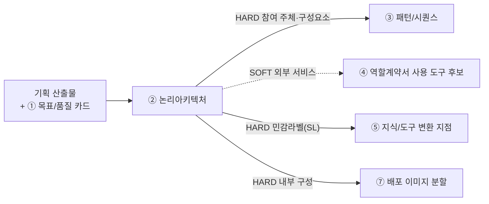
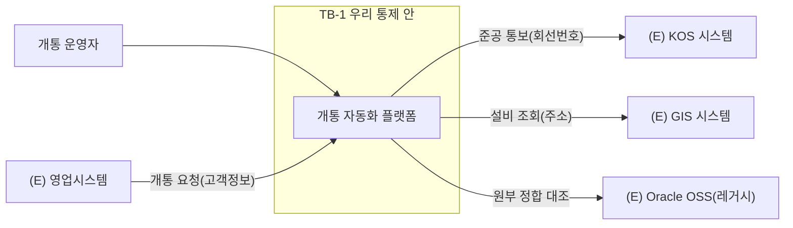

# 설계서 ② 논리아키텍처 — 작성 가이드

## 1. 이 설계서가 답하는 질문

**"무엇이 어디에 있고, 어디부터가 우리 통제 밖인가?"**

시스템과 외부 서비스의 관계를 그리고 **민감정보가 통제 밖으로 나가는 선**을 표시함.
도식 2장(전체 관계도·내부 구성도)과 표 4개로 이뤄짐.

**이걸 대충 하면 나는 사고 3가지**

- 경계선이 없어 마스킹을 어디에 걸지 정하지 못함. ⑤ 지식/도구·⑥ 가드레일/관측이 막힘
- 내부 구성이 안 나뉘어 ⑦ 배포에서 이미지를 몇 개로 쪼갤지 논쟁만 함
- 외부 시스템 중 무엇이 진짜인지 몰라 구현 때 없는 API를 부름

② 논리아키텍처는 **HARD로 넘겨주는 게 가장 많음**(③④⑤⑦). 늦으면 네 개가 한꺼번에 멈춤.
`HARD`는 없으면 뒤 칸을 못 채움. `SOFT`는 나중에 손봐도 됨.
**바로 뒤는 ③ 패턴/시퀀스임** — ② 논리아키텍처의 구성요소가 ③ 패턴/시퀀스의 참여 주체가 되므로 ② 논리아키텍처가 늦으면 ③ 패턴/시퀀스가 못 시작함.

## 2. 시작 전 판정

**판정 1 — 두 도식을 어떻게 가르나**

가장 헷갈리는 지점임. 기준은 하나임. **우리가 만드는 것인가 아닌가.**

| | 1단계 전체 관계도 | 2단계 내부 구성도 |
|---|-----------------|-----------------|
| 무엇을 | 우리 시스템을 **상자 하나**로 두고 바깥과의 관계 | 그 상자 **안**을 열어 나눔 |
| 노드 | 사용자·외부 시스템·저장소 | 우리가 만드는 실행 단위 |
| 나누는 기준 | 소유 주체가 다른가 | 따로 배포·실행되는가 |
| 안 그리는 것 | 내부 모듈 | 외부 시스템 상세 |

**판정 2 — 신뢰 경계(TB)를 어디에 긋나**

경계는 조직도가 아니라 **제어권이 바뀌는 곳**에 그음. 구조적 잣대 둘만 씀 — 데이터 종류는 안 봄.

| 순서 | 질문 | 예면 |
|------|------|------|
| 1 | 이 선을 넘으면 **우리가 로그를 못 보는가**? | 경계임 |
| 2 | 이 선을 넘으면 **접근 권한 주체가 바뀌는가**? | 경계임 |
| 3 | 둘 다 아니오 | 경계 아님. 그냥 내부 연결임 |

경계마다 `TB-1`·`TB-2` 같은 번호를 붙임. `TB`는 **Trust Boundary(신뢰 경계)** 의 약자임.

**판정 2-1 — 민감정보 라벨(SL)을 어디에 붙이나**

TB 여부와 **무관하게** 별도로 판정함. 이 선을 지나는 데이터에 민감정보가 하나라도 있으면
`SL-1`·`SL-2` 같은 번호를 붙이고 오가는 항목명을 라벨로 적음. 같은 간선에 TB와 SL이 겹치면
함께 적음(예: `TB-2 · SL-1`). **TB 없이 SL만 붙는 내부 연결도 있음** — 로그·권한은 안 바뀌지만
그 안에 민감정보가 섞여 흐르는 경우임(예: 내부 저장소를 다른 서비스가 읽는데 타 고객 정보가 섞여
있음. 5-2절 `D-1` 참고). 이런 SL 단독 지점도 번호를 반드시 붙여야 ⑤ 지식/도구가 변환 지점을,
⑥ 가드레일/관측이 검사 지점을 찾음. TB는 ⑥ 가드레일/관측의 접근제어·감사로그 판단에, SL은
⑤ 지식/도구의 마스킹·변환 판단에 쓰임 — 둘이 겹칠 때가 많지만 같은 것은 아님.

**판정 2-2 — 경계를 넘기지 않기로 한 항목이 있는가**

TB·SL을 막론하고 넘기지 **않기로** 한 항목이 있으면 **넘는 것·넘지 않는 것을 항목명 단위 표로**
따로 적음. **이 판정이 가장 중요해지는 경우가 있음.** TB·SL은 라벨을 붙이라까지만 함.
건강·인증 정보처럼 모델에 보낼 이유가 없는 값은 **지식/도구 설계서의 입력 규격에 명시하지 않음.**
⑤ 지식/도구·⑥ 가드레일/관측보다 앞선 방어선임.

**판정 3 — 실물인가 Mock인가**

기준은 **이번 범위에서 실제로 붙을 수 있는가**임. 못 붙이면 Mock이고 사유를 `대체 사유`에 적음.
"아마 될 것"으로 실물이라 적지 않음. **실물이어도 `쓰려는 필드를 주는지` 따로 확인함** —
안 주면 실물이지만 그 경로는 Mock임. 소비자 앱은 Mock 근거가 **권한보다 인허가 일정**에서 나옴.

## 3. 칸별 작성법

| 칸 | 무엇을 쓰나 | 어디서 가져오나 | 좋은 예 | 나쁜 예 |
|----|-----------|---------------|---------|---------|
| 전체 관계도 노드 | 외부 액터·외부 시스템·저장소 | ES `participant`·`actor` | (E) KOS 시스템 | 카프카 |
| 간선 라벨 | 오가는 **데이터 항목명** | ES 이벤트명 | 준공 통보(회선번호) | 데이터 전송 |
| 내부 구성도 노드 | 따로 배포되는 실행 단위 | 코드베이스 구성요소 목록 | 검증 게이트 서비스 | 유틸 함수 |
| 신뢰 경계 | `subgraph`로 감싸고 `TB-n` 부여(로그·권한 기준) | US NFR 보안 | TB-1 사내망 밖 | (표시 없음) |
| 경계 통과 데이터 | 민감정보가 지나는 간선에 `SL-n` 부여, 항목 유형을 라벨로 적음(TB 유무 무관) | 민감정보 목록 | SL-1 고객 회선정보 | 일부 정보 |
| **경계 미통과 항목** | 넘기지 **않기로** 한 항목명 | 판정 2의 4번 | 건강 정보 — 입력 규격에 칸 없음 | (칸 없음) |
| **내부 저장소 목록** | 저장소명·담는 것·보존 기간 | 내부 구성도 라벨 | 이력 저장소 / 근거 / 6개월 | (라벨만 둠) |
| 외부 서비스 `구분` | `실물` 또는 `Mock` 2값만 | 연계 가능 여부 · **쓰려는 필드를 주나** | Mock | 실물(예정) |
| 대체 사유 | Mock인 이유 1줄 | 연계 규칙 · 인허가 일정 | 레거시 접속 권한 미확보 | (공란) |
| 근거 출처 | `{약칭}:{항목 ID}#{하위}` | BM·US·PR 3종 | US:NFR-SEC-010#체크리스트1 | (공란) |
| 배치 결정 사유 | ① 목표/품질 카드의 품질 3개로 설명 | ① 목표/품질 카드의 품질속성 표 | 응답시간 목표로 조회 경로를 분리함 | 확장성을 고려함 |

**② 논리아키텍처가 쓰지 않는 것** — 시퀀스 단계(③ 패턴/시퀀스), 에이전트별 책임(④ 역할계약서), 마스킹 방식(⑤ 지식/도구), 배포 단위(⑦ 배포).
② 논리아키텍처는 **위치와 경계만** 정함. 여기서 앞서가면 뒤 산출물과 값이 두 곳에 생겨 어긋남.

## 4. 프롬프트에 없지만 반드시 채울 것

**(1) 경계선을 긋고 나서 반드시 해야 하는 확인**

프롬프트는 경계를 그리라고만 함. 그린 뒤 아래 3개를 확인해야 ⑤ 지식/도구·⑥ 가드레일/관측이 막히지 않음.
넘는 간선이 **하나도 없는** TB·SL은 지움(쓸모 없음) · **SL 간선에 라벨이 없으면** ⑤ 지식/도구가 변환 지점을
못 정함 · 같은 데이터가 **SL을 두 번 넘으면** 마스킹이 두 번 필요하므로 ⑥ 가드레일/관측에 그 사실을 적음.

**(2) Mock 목록의 주인은 ② 논리아키텍처, 자리는 ⑤ 지식/도구**

규격 미결이던 항목을 팀 토론으로 확정함(G-10). **Mock·실물 구분 목록은 ⑤ 지식/도구에 두되 값의 주인은 ② 논리아키텍처임.**
⑤ 지식/도구는 커넥터 단위로 펼쳐 쓰기만 하고, 구분을 바꾸려면 ② 논리아키텍처를 고침.
타임아웃을 ③ 패턴/시퀀스가 소유하고 ⑥ 가드레일/관측이 참조만 하는 것과 같은 방식임.

**(3) 이벤트스토밍이 있으면 관계도를 새로 그리지 않음**

`participant`와 `database`가 곧 전체 관계도의 노드임. 새로 상상하지 말고 옮김.
**옮기면서 빠진 것을 찾으면 `구성요소 대조 표`에 `신설` 행으로 남기고 근거를 함께 적음.**
그냥 그려 넣으면 왜 있는 노드인지 아무도 모름.

**(4) 내부 저장소를 목록 표로도 적음** — 도식 라벨만 있으면 ④ 역할계약서가 `사용 도구`에 쓸 이름을 확정하지
못하고 ⑦ 배포가 배치 위치를 못 잡음. 저장소명·담는 것·보존 기간 3열이면 됨.

## 5. 예시

### 5-1. KT 개통 자동화 — 한 줄기 완주

> 인용은 강사가 가진 기획 자료임. **열 수 없어도 됨.** 볼 것은 값이 아니라 **판단 경로**임.

이벤트스토밍 `~/workspace/oss/docs/plan/think/es/*.puml`에서 시작함.

**단계 1 — 노드 수집(옮겨 적기)**

| 종류 | 값 |
|------|-----|
| 외부 액터 | 개통 운영자 · 시설선정 담당자 · 장치연동 엔지니어 · 원부구축 담당자 · 현장 작업자 |
| 외부 시스템 | (E) KOS 시스템 · (E) GIS 시스템 · (E) NMS · (E) Oracle OSS(레거시) · (E) 영업시스템 |
| 저장소 | 요청 · 설비 · 작업 · 연동 · 원부 · 준공 · 오류 이력 · 분석 저장소 |

**단계 2 — 전체 관계도** — 간선 라벨에 **항목명을 넣는 것이 핵심**임.
`데이터 전송`처럼 적으면 ⑤ 지식/도구가 변환 지점을 못 정함.

**단계 3 — 경계 판정** — `(E) Oracle OSS`로 가는 선에 판정을 적용하면
`로그 못 봄 = 예` · `권한 주체 바뀜 = 예`로 TB가 걸려 `TB-2`를 부여함.
같은 선에 `민감정보 나감 = 예(고객 회선정보)`도 걸리므로 `SL-2`도 함께 부여함.
→ 간선 라벨에 `TB-2 · SL-2 고객 회선정보`를 적음.

**단계 4 — 외부 서비스 목록 1행**

| # | 외부 서비스 | 구분 | 대체 사유 | 경계 통과 데이터 | 근거 출처 | 후행 소비처 |
|---|-----------|------|----------|----------------|----------|------------|
| E-1 | (E) Oracle OSS(레거시) | Mock | 레거시 접속 권한 미확보 | 고객 회선정보 | ES:05-원부매핑#외부연계 | ⑤ 지식/도구 커넥터, ④ 역할계약서 도구 후보 |

**단계 5 — 뒤로 넘김** — `SL-2`와 `고객 회선정보`는 ⑤ 지식/도구가 변환 지점을 거는 자리, `TB-2`는 ⑥ 가드레일/관측이
접근제어·감사로그를 거는 자리임. `E-1 Mock`은
④ 역할계약서가 실물로 착각하지 않게 하며, 내부 실행 단위 수는 ⑦ 배포의 이미지 분할 근거가 됨.
`정합성 오류율 25 ~ 30%`(BM 8절)가 핵심이므로 검증 게이트를 별도 실행 단위로 두는 배치 결정 사유를
① 목표/품질 카드의 품질속성과 연결해 3줄 이내로 적음.

### 5-2. 마이데이터 금융상품 추천

근거는 [_shared/마이데이터-케이스.md](_shared/마이데이터-케이스.md)임.
기획 산출물이 없어 구성은 `추정`임. 실제 과제에서는 `[확인필요]`로 되물음.

**경계 판정이 개통과 다르게 나옴** — 여기는 **마이데이터가 익명으로 들어옴**(`케이스:R-1`).
TB 질문(로그 못 봄·권한 주체 바뀜)은 외부 기관이라 그대로 걸려 `TB-1`을 부여함. 그러나 SL 질문
(민감정보 나감)은 `아니오`(익명화 후 유입)라 SL은 붙이지 않음 — 라벨은 `익명 자산 정보`로 적음.
**경계의 성격이 다름** — 개통의 `TB-2`는 `SL-2`(고객 회선정보)가 함께 걸린 유출 경계였으나,
여기 `TB-1`은 SL 없이 **익명화가 실제로 끝났는지 확인하는 자리**임. `TB-1`에 `익명화 종료 지점`이라
적어 두면 ⑤ 지식/도구가 변환 지점(SL 없음)을 마스킹 대상으로 잘못 잡지 않음.

**과거 제안서를 쓰면 경계가 하나 더 생김** — `케이스:3-2`를 넣으면 **과거 제안서 저장소**가
내부 노드로 추가되고 남의 제안서가 새 제안서로 흘러나갈 수 있음(V-1).

| # | 외부 서비스·저장소 | 구분 | 대체 사유 | 경계 통과 데이터 | 후행 소비처 |
|---|-----------------|------|----------|----------------|------------|
| E-1 | 마이데이터 제공 기관 | Mock | 사내 연동은 Mock 대체(커리큘럼 4절) | 익명 자산 정보 | ⑤ 지식/도구 커넥터, ④ 역할계약서 도구 후보 |
| E-2 | 상품 마스터 | Mock | 위와 같음 | 상품 조건 | ⑤ 지식/도구 커넥터 |
| D-1 | 과거 제안서 저장소(`추정`) | 내부 | — | **타 고객 제안서** | ⑤ 지식/도구 분류표, ⑥ 가드레일/관측 검사 |

D-1은 내부 저장소라 TB는 안 붙음(로그·권한이 그대로임) — 그러나 **읽는 순간 남의 정보(타 고객 제안서)가
섞여 들어오므로** `SL-3`만 단독으로 붙음(TB 없이 SL만 있는 사례). ② 논리아키텍처에 SL 표시를 해 두어야
⑥ 가드레일/관측이 출력 검사를 걸 근거가 생김. 또 `케이스:R-2`로 제안서 3건이 병렬 생성되므로 생성 단위를
**따로 뗄 수 있게** 그려야 ⑦ 배포가 이미지 분할을 판단함. 붙여 그리면 3배 부하를 한 덩어리로 배포함.

## 6. 자주 틀리는 5가지

| # | 양상 | 왜 생기나 | 어떻게 막나 |
|---|------|----------|------------|
| 1 | 도식 2장이 사실상 같은 그림임 | 전체 관계도에 내부 모듈을 그림 | 판정 1의 "우리가 만드는 것인가" 기준 적용 |
| 2 | 경계선을 조직 경계로 그림 | 부서가 다르면 경계라고 봄 | TB는 로그·권한 질문으로만 판정하고, 민감정보 여부(SL)는 별도로 판정함 |
| 3 | 경계 간선에 라벨이 없음 | 화살표만 그리고 넘어감 | 라벨 없는 경계 간선은 ⑤ 지식/도구를 막음. 항목명을 붙임 |
| 4 | Mock을 `실물(예정)`으로 적음 | 나중에 붙일 계획이 있음 | `구분`은 2값만임. 계획은 `대체 사유`에 적음 |
| 5 | ② 논리아키텍처에서 에이전트 책임·시퀀스까지 그림 | 머릿속에 흐름이 떠올라 앞서감 | ② 논리아키텍처는 위치와 경계만임. 흐름은 ③ 패턴/시퀀스가 소유함 |

5번이 잦음. 흐름을 그리고 싶어지면 **③ 패턴/시퀀스가 아직 시작도 안 했다**는 뜻이므로 메모로만 남김.

## 7. 제출 전 자가 점검표

- [ ] Mermaid `flowchart` 코드블록이 2개 이상 있음(전체 관계도·내부 구성도)
- [ ] **경계 미통과 항목**이 항목명 단위로 있음 · **내부 저장소가 목록 표로도 있음**
- [ ] **`구성요소 대조 표`의 신설 건수가 숫자이고 각 신설 행에 근거가 있음**
- [ ] **`실물` 행이 쓰려는 필드를 주는지 확인됨**(안 주면 조건 병기)
- [ ] 신뢰 경계가 `subgraph`로 표시되고 `TB-` 번호가 1개 이상 있음
- [ ] 민감정보가 지나는 간선마다 `SL-` 번호가 있음(TB 유무와 무관, TB 없이 SL만 있는 간선도 확인함)
- [ ] TB·SL 간선 **전부**에 데이터 항목 라벨이 있음
- [ ] `외부 서비스 목록` 표의 모든 행에 `구분`(실물/Mock)과 `근거 출처`가 채워짐
- [ ] `구분` 칸에 `실물`·`Mock` 외의 값이 0개임
- [ ] `구성요소 대조 표`가 있고 미대응 건수가 숫자로 적혀 있음
- [ ] `노드·간선 근거 대조표`와 `후행 소비처` 표가 각각 1개 이상 있음
- [ ] 배치 결정 사유가 ① 목표/품질 카드의 품질속성 3개를 근거로 3줄 이내로 적혀 있음
- [ ] 에이전트 책임·시퀀스 단계·마스킹 방식·배포 단위가 **적혀 있지 않음**
- [ ] `기획 산출물 대조 기록` 표가 0건이어도 `0건`으로 있음

## 8. 다음으로 넘기는 값과 근거 자료

| 넘기는 값 | 받는 곳 | 강도 |
|----------|--------|------|
| 전체 관계도의 참여 주체·구성요소 | ③ 패턴/시퀀스의 참여 주체(바로 다음 산출물) | HARD |
| 신뢰 경계 `TB-n` | ⑥ 가드레일/관측 접근제어·감사로그 | HARD |
| 민감정보 라벨 `SL-n`과 경계 통과 데이터 | ⑤ 지식/도구 변환 지점(마스킹) | HARD |
| **경계 미통과 항목**(판정 2-2) | ⑤ 지식/도구 **커넥터 입출력 키에서 제외**(마스킹 아님 — 칸 자체를 안 만듦) | HARD |
| 내부 구성도의 실행 단위 · **내부 저장소 목록** | ⑦ 배포 이미지 분할·저장소 배치 · ④ 역할계약서 사용 도구 | HARD |
| 외부 서비스 목록 | ④ 역할계약서 사용 도구 후보 | SOFT |
| Mock·실물 구분(값의 주인은 ② 논리아키텍처) | ⑤ 지식/도구 목록 전개 | 소유 관계 |

**② 논리아키텍처가 소유하지 않는 것** — `기술 스택` 6행은 ② 논리아키텍처의 부속 표가 아니라 **프로젝트 파라미터**임
(`00-파라미터블록.md` `V-07`). ⑦ 배포가 비밀값을 뽑을 때 그 파일을 봄.

| 아티클 | 어느 칸에 |
|--------|----------|
| [A05](../references/articles/A05_paper_agentarceval.md) | 참조 아키텍처 그림 — 가드레일이 세 층을 관통하는 기둥으로 그려짐 |
| [A06](../references/articles/A06_std_owasp-agentic-top10.md) | 경계 밖 연동에서 생기는 위협 유형(ASI04 공급망) |
| [A04](../references/articles/A04_spec_mcp-changelog-260728.md) | 외부 도구 접속 방식 표기 시 MCP 판본 |

규격 원문은 `prompts/architecture/02-논리아키텍처.md`와 `00-산출물규격.md` 1·2절임.
