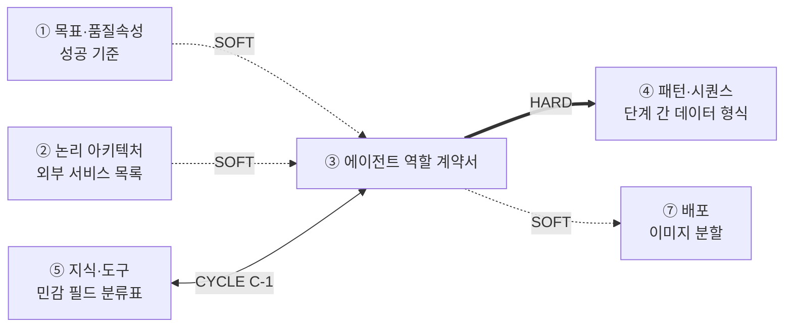
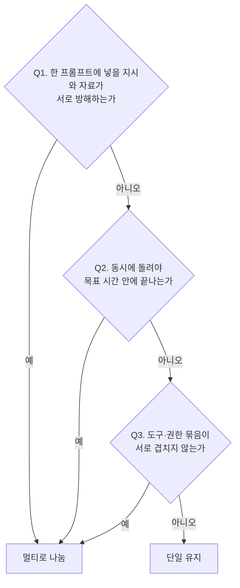

# 설계서 ③ 에이전트 역할 계약서 — 작성 가이드

## 1. 이 설계서가 답하는 질문

**"에이전트 하나가 무엇을 책임지고, 어디까지 손댈 수 있는가"를 못 박는 문서임.**

사람으로 치면 근로계약서임. 직무·열람 권한·성과 기준·해고 조건을 미리 적음.

**이걸 안 하면 나는 사고 3줄**

- 권한 경계가 없어 에이전트가 봐서는 안 될 컬럼까지 읽어 감사에서 걸림
- 출력 키 이름을 사람마다 다르게 지어 ④ 시퀀스에서 데이터가 안 붙음
- 중단 조건이 없어 실패한 에이전트가 같은 호출을 계속 반복함

**앞뒤 연결도**

`HARD` = 없으면 못 채움. `SOFT` = 없어도 시작은 되나 나중에 고침.  
`CYCLE C-1` = ③과 ⑤가 서로를 봐야 해서 한 번 되돌려 반영함.

---

## 2. 시작 전 판정

### 2-1. 단일이냐 멀티냐 — 판정 사다리

**기본값은 단일 에이전트임.** 나눌 이유를 못 대면 나누지 않음.  
아래 3개 질문에 **하나라도 "예"가 나올 때만** 나눔.

| 질문 | 예/아니오 판정 기준 | 나누는 이유 |
|------|-------------------|------------|
| Q1 | 한 호출에 넣을 문서·규칙이 3종 이상이고 용어가 충돌함 | 컨텍스트 오염 |
| Q2 | 순차로 돌리면 ①의 응답시간 목표를 넘김 | 병렬화 |
| Q3 | 한쪽은 읽기만, 한쪽은 외부 쓰기라 권한 등급이 다름 | 전문화 |

**나눌 때는 업무 종류가 아니라 컨텍스트로 나눔.**  
"조회 담당·계산 담당"처럼 동사로 쪼개면 에이전트만 늘고 이득이 없음.

### 2-2. 시작 조건 확인

| 확인 | 없으면 |
|------|--------|
| ⑤ 민감 필드 분류표 초안이 있는가 | `[확인필요: 선행 미생성]`을 적고 계속 진행함 |
| ② 외부 서비스 목록이 있는가 | `사용 도구` 칸에 후보만 적고 확정 시 갱신함 |
| 유저스토리에 `[처리 결과] 실패 시`가 있는가 | 중단 조건을 지어내지 말고 기획에 되물음 |

---

## 3. 칸별 작성법

| 칸 | 무엇을 적나 | 어디서 가져오나 | 좋은 예 | 나쁜 예 |
|----|------------|----------------|---------|---------|
| 책임 | 이 에이전트가 만들어 내는 결과물 1개 | US 스토리 헤더의 `~하기 위해` 목적절 | 3계층 검증을 수행해 설비 확정 가부 1건 산출 | 설비 관련 업무 전반을 처리 |
| 접근 가능한 정보 항목 | 볼 수 있는 테이블·컬럼을 하나씩 | ⑤ 민감 필드 분류표 · US `[입력 요구사항]` | `설비`(설비ID·유형·가용포트수·거리) — 고객 이름·전화 제외 | 설비 데이터 전체 |
| 입출력 형식 | 키 이름·타입·필수 여부 | US `[입력 요구사항]`과 `[처리 결과] 성공 시` | 입력 `{request_id: str, facility_id: str}` | 요청 정보를 받아 결과를 반환 |
| 사용 도구 | ② 또는 ⑤에 이미 있는 이름 그대로 | ② 외부 서비스 목록 · ⑤ 커넥터 목록 | 설비 저장소 조회 커넥터, GIS 조회 커넥터 | 필요시 외부 API 호출 |
| 사용 모델 | 모델명 + 배정 근거 1줄 | 기술 스택의 모델 벤더 정책 | 구조화 출력 중심 작업이라 소형 모델 배정 | 성능 좋은 모델 사용 |
| 성공 기준 | 참·거짓으로 가려지는 문장 | US `[검증 요구사항]`의 판정형 항목 | 3계층 전부 통과 건만 확정, 검증 리포트 100% 저장 | 검증이 정확하게 수행됨 |
| 중단 조건 | 멈출 시점을 판정 가능한 문장 | US `[처리 결과] 실패 시` | 동일 실패 3회 반복 시 운영자 에스컬레이션 | 오류 발생 시 중단 |

**금지어 4종** — `전체`·`필요시`·`관련 데이터`·`적절한`. 보이면 그 칸은 미설계임.

---

## 4. 프롬프트에 없지만 반드시 채울 것

판정 사다리는 2절에 둠. 그 밖에 비면 뒤가 막히는 칸임.

| 추가 칸 | 왜 필요한가 | 적는 법 |
|--------|------------|--------|
| 중단 조건의 **판정 주체·시점** | "3회 반복"을 누가 세는지 없으면 아무도 안 셈 | `주체: 오케스트레이터 / 시점: 노드 종료 직후` |
| **멈춤까지만 씀** (G-5) | 재시도·폴백·타임아웃은 시퀀스 전체 대응이라 ④가 소유함 | ③은 "무엇을 보면 멈추나"까지만 적음 |
| **도구 부작용 표시** | 되돌릴 수 없는 쓰기가 있으면 ④에 사람 확인 노드가 필요함 | 도구마다 `읽기` / `쓰기(되돌림 가능)` / `쓰기(되돌림 불가)` 1개 표기 |
| **공유 상태 후보 표시** | ④ 상태 스키마의 씨앗임. 없으면 ④가 필드를 다시 지어냄 | 다른 에이전트도 읽는 출력 키에 `공유` 표시 |

---

## 5. 예시

### 5-1. KT 개통 자동화 — 한 줄기 완주

출처 — `~/workspace/oss/docs/plan/`의 `design/userstory.md`,  
`think/es/02-설비-탐색-할당-및-검증게이트.puml`, `think/es/08-검증실패-오류-복구플로우.puml`.  
이 예시는 정답이 아님. 다르게 판단해도 되며 근거만 남기면 됨.

**줄기: 유저스토리 → 판정 → 계약 7칸 → 중단 조건 → ④ → ⑥**

**(1) 유저스토리** — `UFR-FAC-040 설비 할당 3계층 검증`.  
수용성·기술기준·데이터품질 3계층을 순차 수행함.  
전부 통과해야 확정함(출처: userstory.md UFR-FAC-040).

**(2) 판정** — Q1 아니오, Q2 아니오, **Q3 예**.  
조회는 읽기, 예약 확정은 쓰기라 권한 등급이 다름(UFR-FAC-030).  
따라서 `설비 적합성 검증`과 `설비 예약 확정` 2개로 나눔.

**(3) 계약 7칸 — 「설비 적합성 검증」**

| 계약 항목 | 내용 | 근거 출처 |
|----------|------|----------|
| 책임 | 3계층 검증을 수행해 확정 가부와 실패 계층 1건 산출 | US:UFR-FAC-040#행위1 |
| 접근 가능한 정보 항목 | `설비`(설비ID·유형·가용포트수·상태·거리) — 고객 이름·전화·주소 제외 | US:UFR-FAC-010#입력1 · US:NFR-SYS-020 |
| 입출력 형식 | 입력 `{request_id: str, facility_id: str}` / 출력 `{passed: bool, failed_layer: str, report_id: str}` `공유` | US:UFR-FAC-040#성공1 |
| 사용 도구 | 설비 저장소 조회 커넥터 `읽기`, GIS 조회 커넥터 `읽기` | ES:02 참여자 |
| 사용 모델 | [확인필요: 모델 벤더 정책] — 배정 근거: 규칙 판정 중심 작업임 | 설계판단 |
| 성공 기준 | 3계층 전부 통과 건만 확정, 검증 결과 리포트 저장 100% | US:UFR-FAC-040#검증1 |
| 중단 조건 | 동일 실패 3회 반복 / GIS 조회 10초 초과 / 데이터품질 계층 실패 | US:UFR-RCV-020 · US:UFR-FAC-010 |

**(4) 판정 주체** — 오케스트레이터가 노드 종료 직후 실패 횟수를 셈.  
3회는 지어낸 값이 아니라 `UFR-RCV-020`의 3회 반복 에스컬레이션 인용임.

**(5) ④로 넘어감** — ③이 "3회에서 멈춤"까지 정했으므로 ④가 그 뒤를 받음.  
④ 재시도 표 1행 — `GIS 조회` 타임아웃 10초, 재시도 2회.  
초과 시 텍스트 목록 모드로 폴백함(근거: UFR-FAC-010).  
④ 착지 노드 — 3회 소진 시 ES:08의 오류 분류로 넘겨 Type A ~ D를 판정함.

**(6) ⑥으로 넘어감** — 3회 도달 건수가 임계치를 넘으면 운영자 알림.  
임계치 값은 ④가 소유하므로 ⑥은 참조만 함.

### 5-2. 마이데이터 금융상품 추천 — 판단이 달라지는 지점

근거는 [마이데이터 케이스](_shared/마이데이터-케이스.md) 1건임.  
기획 산출물이 없어 수치는 전부 추정임. 실제 과제에서는 `[확인필요]`로 되물음.

**(1) R-2가 판정 사다리를 흔듦** — 최대 3명이 선착순으로 제안서를 냄(케이스:R-2).  
같은 입력에 3건이 병렬 생성되므로 2절 Q2(병렬화)가 "예"로 보임.  
그러나 **에이전트를 3개로 복제하는 것은 답이 아님.**  
3건은 조직 제약이지 컨텍스트가 갈린 것이 아님.  
→ 계약서는 **1건**, 동시 실행 수만 `3`으로 적음.  
세 명이 서로 다른 상품군을 맡는다면 그때 Q3(전문화)가 "예"가 되어 계약 3건이 됨.  
**KT와의 차이** — KT는 읽기·쓰기 권한 차이로 나눴고(Q3), 여기서는 병렬로 보여도 안 나눔.

**(2) R-1이 접근 항목 칸을 바꿈** — 마이데이터가 익명으로 유입됨(케이스:R-1).  
KT에서는 이름·전화를 **빼는** 문제였으나 여기서는 **애초에 없음.**  
그래서 제외 목록이 아니라 **재식별 조합**을 막는 것이 최소수집임(`KT:7-3#최소수집`).

| 계약 항목 | 내용 | 근거 출처 |
|----------|------|----------|
| 책임 | 익명 자산 프로파일로 상품 포트폴리오 제안서 1건 산출 | 케이스:O-2 |
| 접근 가능한 정보 항목 | `자산`(상품유형·잔액구간·보유기간), `상품`(유형·조건) — 계좌번호·기관명 동시 노출 제외 | `KT:7-3#최소수집` · 케이스:R-1 |
| 입출력 형식 | 출력 `{picks: list, evidence: list, segment_tag: str}` `공유` | `KT:7-3#추천근거추적` |
| 성공 기준 | 근거 표기율 100%(추정), 부적합 상품 포함률 0%(추정) | 케이스:M-4 · M-5 |
| 중단 조건 | 동의 상태 미확인 / 부적합 후보만 남음 / 근거 없는 추천 발생 | `KT:7-3#동의상태확인` |

**(3) 실패의 무게가 다름** — KT의 실패는 개통 지연이나 여기서는 부적합 상품 추천임.  
그래서 중단 조건이 "느려서 멈춤"이 아니라 **"근거가 없으면 멈춤"** 쪽으로 기욺.

---

## 6. 자주 틀리는 5가지

| # | 실패 양상 | 왜 생기나 | 어떻게 막나 |
|---|----------|----------|------------|
| 1 | 에이전트 1개에 책임이 2 ~ 3개 붙음 | US 1건을 그대로 에이전트 1개로 옮김 | 책임 문장에 `그리고`·`및`이 있으면 분해함 |
| 2 | 접근 항목에 테이블 이름만 적힘 | 컬럼까지 적기를 과하다고 느낌 | 민감 필드 각 건에 포함·제외를 적음 |
| 3 | ④에서 출력 키를 새로 지어냄 | ③이 키 이름의 단일 출처임을 모름 | ③ 출력 칸 위에 출처 선언 1줄을 둠 |
| 4 | 중단 조건에 "재시도 2회 후 중단"을 적음 | ③·④ 경계를 모름(G-5) | ③은 멈춤 신호까지. 횟수는 ④로 넘김 |
| 5 | 성공 기준이 "정확히 검증됨"으로 끝남 | US 검증 요구사항을 안 열어 봄 | 참·거짓으로 못 가르면 US 숫자를 인용함 |

---

## 7. 제출 전 자가 점검표

- [ ] 판정 근거가 3줄 이내이고 2절 3개 질문 중 어느 것이 "예"인지 적혔음
- [ ] 에이전트 전부가 7개 칸을 채웠고 **공란 0개**임
- [ ] 금지어 4종(`전체`·`필요시`·`관련 데이터`·`적절한`) 검색 결과 **0건**임
- [ ] `입출력 형식` 칸에 키 이름이 에이전트마다 **1개 이상** 있음
- [ ] 민감 필드 각 건에 포함 또는 제외 표기가 있음(개수 = 민감 필드 건수)
- [ ] `사용 도구`가 전부 ② 또는 ⑤에 있는 이름임(새로 만든 이름 0건)
- [ ] 도구마다 `읽기`/`쓰기` 표시가 있음(공란 0건)
- [ ] 중단 조건마다 판정 주체와 시점이 적혔음(공란 0건)
- [ ] 중단 조건에 재시도 횟수가 적힌 행이 **0건**임(④ 소유)
- [ ] 모든 행의 `근거 출처`가 원문 ID 또는 `설계판단`으로 채워짐(공란 0건)

---

## 8. 다음으로 넘기는 값과 근거 자료

**후행 소비처**

| 넘기는 값 | 받는 곳 | 강도 | 안 넘기면 |
|----------|--------|------|----------|
| 입출력 형식(키 이름) | ④ 단계 간 데이터 형식 | HARD | ④에서 키를 다시 지어내 구현 시 안 맞음 |
| 중단 조건 | ④ 재시도·타임아웃 표 | HARD | 멈출 조건 없이 재시도 정책만 남음 |
| 접근 가능한 정보 항목 | ⑤ 변환 지점 | CYCLE C-1 | 마스킹을 어느 경로에 걸지 못 정함 |
| 에이전트 수·사용 모델 | ⑦ 이미지 분할 판단 | SOFT | 단일 이미지로 시작해도 무방함 |

**근거 자료**

| 아티클 | 거는 칸 |
|--------|--------|
| [A01](../references/articles/A01_blog_anthropic-when-multi-agent.md) | 2절 판정 사다리 — 3개 질문의 출처. 단일이 기본값 |
| [A05](../references/articles/A05_paper_agentarceval.md) | 중단 조건 칸 — 실패 시나리오 카탈로그로 빠진 조건 점검 |
| [A06](../references/articles/A06_std_owasp-agentic-top10.md) | 접근 가능한 정보 항목 칸 — 최소권한 근거 |
