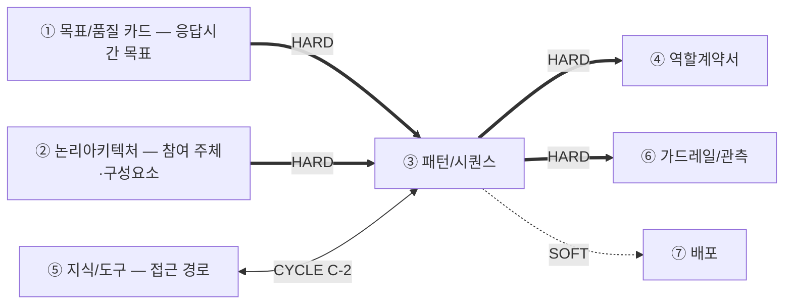
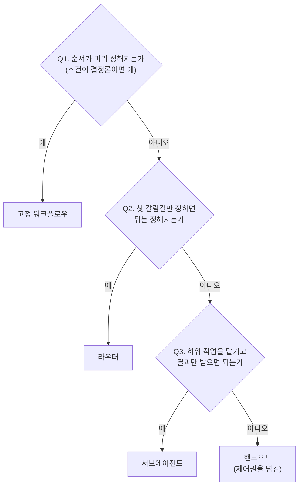
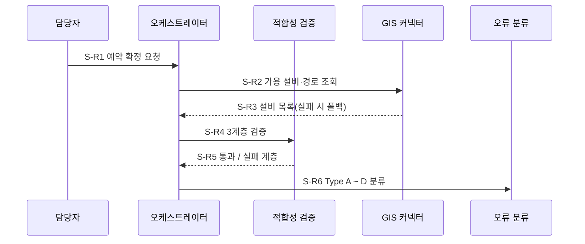

# 설계서 ③ 패턴/시퀀스 — 작성 가이드

## 1. 이 설계서가 답하는 질문

**"누가 어떤 순서로 움직이고, 실패하면 무엇을 하는가"를 못 박는 문서입니다.**

`타임아웃 값의 단일 출처는 본 산출물임` — 머리말에 그대로 둡니다.

**이걸 안 하면 나는 사고 3줄**

- 재시도가 겹쳐 외부 시스템에 호출이 몇 배로 쏟아짐
- 상한 없는 재계획 루프로 요청이 안 끝나고 비용만 쌓임
- 동시에 도는 두 단계가 같은 값을 덮어써 결과가 사라짐

**앞뒤 연결도**

`HARD` 없으면 못 채움 — ③ 패턴/시퀀스는 HARD 유입이 ①②의 2건뿐이라 ② 논리아키텍처가 끝나면 바로 시작합니다.  
**흐름을 먼저 확정해야 그 단계를 누가 맡는지(④ 역할계약서)를 정할 수 있으므로 ③ 패턴/시퀀스가 ④ 역할계약서보다 앞입니다.**  
`CYCLE C-2` ⑤ 지식/도구와 서로 보고 한 번 되돌립니다.

---

## 2. 시작 전 판정

**참여 주체는 ② 논리아키텍처에서 가져옵니다.** ③ 패턴/시퀀스를 쓸 때 ④ 역할계약서는 아직 없으므로 에이전트 이름을 지어내지 않고  
② 논리아키텍처의 구성요소·외부 서비스·저장소 이름을 그대로 씁니다. 그 단계를 누가 맡을지는 ④ 역할계약서가 뒤에서 정합니다.

### 2-1. 트리거부터 가름

시퀀스는 **시작 계기별로 따로 그립니다.** 섞으면 예산이 엉킵니다.

| 트리거 | 무엇인가 | 단계 식별자 | 예산 기준 |
|--------|---------|------------|----------|
| 동기 요청 | 사람이 눌러 기다림 | `S-R1` ~ | ① 목표/품질 카드의 응답시간 목표 |
| 스케줄 배치 | 정해진 주기에 자동 실행 | `S-B1` ~ | ① 목표/품질 카드의 배치 완료 목표 |
| 이벤트 | 앞 단계 완료 신호로 시작 | `S-E1` ~ | 전달 지연 목표 |

### 2-2. 패턴 선택 — 결정 트리

**기본값은 고정 순서입니다.** 모델이 순서를 고르게 하는 것은 필요할 때만 합니다.

후보 5종은 A02에서 가져옵니다 — 고정 워크플로우·라우터·서브에이전트·핸드오프·스킬.  
**패턴과 프레임워크를 섞지 않습니다.** 표에는 패턴만 올립니다.

---

## 3. 칸별 작성법

| 칸 | 무엇을 적나 | 어디서 가져오나 | 좋은 예 | 나쁜 예 |
|----|------------|----------------|---------|---------|
| 패턴 비교 표 | 후보 3개 이상·장단점·선택 1개 | A02 5종 · ① 목표/품질 카드의 품질속성 | 라우터 — 실패 유형 4종이라 분기 필요 | LangGraph 선택 — 많이 씀 |
| 시퀀스 단계 | 단계 1건 = 행위 1개. **참여 주체에 ② 논리아키텍처의 저장소도 포함되며 비동기 경로는 저장소를 경유합니다**(에이전트를 직접 부르지 않음) | **② 논리아키텍처의 구성요소·저장소**(참여 주체) · PR To-Be · US 시나리오 | `S-R4` 3계층 검증 → 종료 `통과/실패계층` | 검증하고 결과를 정리함 |
| 단계 간 데이터 형식 | 보내는 곳·받는 곳·**전달 키 집합 식별자**. 키 이름은 ④ 역할계약서가 뒤에서 채웁니다 | US `[처리 결과] 성공 시` · `[입력 요구사항]`(④ 역할계약서는 아직 없음) | `S-R4 → S-R5 · 검증결과 집합` | 키 이름을 지어내 확정함 |
| 상태 스키마 | 필드명·타입·**갱신 주체 1개** | 단계 간에 흐르는 입력 키(④ 역할계약서의 `공유` 표시는 뒤에 붙음) | `error_history: list` / 주체 1개 / 누적 | `context: dict` / 주체: 전 노드 |
| 출력 스키마 | 최종 결과·근거 필드 | US `[처리 결과] 성공 시` | `items[].evidence: list` 필수 | 결과를 JSON으로 반환 |
| 타임아웃·재시도 | **`p95 배정값`·`타임아웃(상한)` 2열**·직렬/병렬·재시도 | ① 목표/품질 카드의 목표값 · US NFR **성능+확장성** · **모델 문서**(사고 기본값·요금 — 확인일 기재) | p95 4초 / 상한 10초 · 재시도 2회 | 단계별로 적절히 배분함 |

---

## 4. 프롬프트에 없지만 반드시 채울 것

| 추가 칸 | 왜 필요한가 | 적는 법 |
|--------|------------|--------|
| **상태 필드 소유권** | 갱신 기본이 덮어쓰기라 병렬 두 단계가 같은 필드를 쓰면 하나가 사라짐 | 필드마다 주체 **1개**. 병렬 구간은 **누적만** |
| **반복 상한 `max_iter`** | "실패 시 재계획"이 무한 왕복이 됨 | 루프마다 상한을 US에서 인용. **열 1개 더 — `반복 1회의 비용 증분`**(모델·외부 호출 증가분). 0이 아니면 그 `[확인필요]`는 비용 상한 태그임 |
| **소진 시 착지 노드** | 상한에 걸린 뒤 갈 곳이 없으면 멈춤 | `안전 종료` 또는 `사람 확인` 1개 지정 |
| **합계를 2줄로 나눔** | p95 목표를 최악값으로 재면 여유가 오독됨 | (1) **`p95 합계 ≤ 예산`** — 목표 검증. **큐잉 포함·재시도 제외** (2) **`최악값 합계`** — 폭주 방지. **초과 허용·착지 노드 필수** |
| **부하 조건**(5번째) | 칸이 없어 아무도 처리량을 세지 않음. ① 목표/품질 카드가 `(피크 포함)`을 적었는데도 단일 요청 예산만 세고 닫힘 | 열 3개 — `동시 사용자 수`·`요청당 점유 시간`·`자원 상한`(커넥션 풀). 판정 — **`동시 수 × 점유 비율 ≤ 상한`.** 초과면 `통과`로 적지 않습니다 |

**재시도 중첩 — 실제 사례.** KT 자료에 두 계층이 있습니다. DLQ(처리 못 한 건을 모아 두는 대기열)  
적재 **전** 소비자 재처리 5회(US:NFR-SYS-060), 적재 **후** 자동 재시도 3회(ES:08).  
충돌이 아니라 계층이 다르며 합치면 한 건이 **최대 15회** 처리됩니다.  
대책 — 계층마다 이름을 나눠 적습니다(`소비자 재처리`·`DLQ 재시도`). ③ 패턴/시퀀스는 예산·상한만 다룹니다.

**곱하나 더하나.** 같은 호출을 다시 하면 **곱합니다**(×(1+재시도)). 다른 경로로 가면  
앞 단계 타임아웃을 소진한 뒤 그 경로 시간을 **더합니다**(+).  
**대체 경로에도 시간을 배정합니다** — 없으면 폴백 최악값이 0으로 잡힙니다.

**상태 3출처**(A03) — 요청마다 바뀌면 `Runtime Context`, 단계 간은 `State`, 세션 넘기면 `Store`.  
**단계 간에 흐르는 입력 키가 `State` 1순위 후보**입니다. ④ 역할계약서의 `공유` 표시는 뒤에 붙으므로 기다리지 않습니다.

**키 이름 소유자 — ③ 패턴/시퀀스는 `키 집합 식별자`만, ④ 역할계약서가 `키 이름`을 가짐.** ③ 패턴/시퀀스가 ④ 역할계약서보다 먼저 쓰므로 이름을 가질 수  
없고 흐름의 단위만 확정하며, 이름은 에이전트 계약의 일부라 ④ 역할계약서 소유임(G-12 유지). 어긋나면 ③ 패턴/시퀀스에 `변경요청` 1행.

**G-4 경로** — 타임아웃은 ③ 패턴/시퀀스 소유. ⑥ 가드레일/관측에서 안 맞아도 ③ 패턴/시퀀스의 `변경요청` 표에 1행을 남깁니다.  
**⑥ 가드레일/관측이 가드레일을 걸 단계가 ③ 패턴/시퀀스에 없으면 트리거 추가 요청**도 이 경로입니다.

**G-5 경계** — 재시도·폴백·타임아웃 통합 확인의 주인은 ③ 패턴/시퀀스입니다.  
④ 역할계약서는 "무엇을 보면 멈추나"까지만, ⑥ 가드레일/관측은 결과를 관측 항목으로 검증만 합니다.

---

## 5. 예시

### 5-1. KT 개통 자동화 — 한 줄기 완주

> 아래 인용은 강사가 가진 기획 자료입니다. **열 수 없어도 됩니다** — 볼 것은 값이 아니라 **판단 경로**입니다.

출처 — `~/workspace/oss/docs/plan/`(`design/userstory.md` · `think/es/02`·`08` puml).  
정답이 아니며 다르게 판단해도 됩니다. 근거만 남기면 됩니다.

**(1) 트리거** — 담당자가 화면에서 누름 → 동기 요청 → `S-R`.

**(2) 패턴** — 실패 유형이 4종(ES:08 Type A ~ D)이라 갈림길 필요 → 라우터.

**(3) 시퀀스**

S-R4의 1계층(수용성)이 사전 조건 확인 노드임(UFR-FAC-040).

**(4) 타임아웃 예산 — 여기서 충돌이 드러남**

| 단계 | 타임아웃 | 직렬/병렬 | 재시도 | 최악값 | 근거 |
|------|---------|----------|-------|-------|------|
| S-R2 GIS 조회 | 10초 | 직렬 | 2회 | 30초 | US:UFR-FAC-010 |
| S-R4 3계층 검증 | [확인필요: 목표값] | 직렬 | 0회 | - | US:UFR-FAC-040 |

총 예산은 화면 로딩 2초임(US:NFR-SYS-010). S-R2 하나가 10초라 **최악값 30초로 넘김.**  
GIS 조회를 동기 경로에서 빼고 `S-E`로 분리함. 못 맞으면 값을 낮추지 말고 되물음.

**(5) 반복 상한·착지 노드** — `max_iter = 3`(US:UFR-RCV-020). 소진 시 착지는 **사람 확인**  
(US:UFR-RCV-030). 이벤트 재처리 상한 5회, 초과 시 DLQ(US:NFR-SYS-060).

**(6) 상태 필드 소유권**

| 필드 | 타입 | 갱신 주체 | 갱신 방식 |
|------|------|----------|----------|
| `validation_result` | dict | 설비 적합성 검증 | 덮어쓰기 |
| `error_history` | list | 오류 분류 | **누적만**(병렬 구간) |
| `retry_count` | int | 오케스트레이터 1개만 | 덮어쓰기 |

**(7) ⑥ 가드레일/관측으로 넘김** — 단계 6개의 이름·개수를 확정 출력물로 명시함. ⑥ 가드레일/관측은 겹쳐 그리며  
단계를 늘리거나 합치지 않고, 값이 안 맞으면 ③ 패턴/시퀀스의 `변경요청` 표에 1행을 남김(G-4).

### 5-2. 마이데이터 금융상품 추천 — 판단이 달라지는 지점

근거는 [마이데이터 케이스](_shared/마이데이터-케이스.md) 1건입니다.  
기획 산출물이 없어 수치는 전부 추정이며 실제 과제에서는 `[확인필요]`로 되묻습니다.

**(1) R-2가 상태 설계를 정면으로 침** — 같은 입력에 제안서 3건이 병렬 생성됨(케이스:R-2).  
4절 `필드당 주체 1개, 병렬이면 누적만`이 필요해지는 지점임.

| 필드 | 타입 | 갱신 주체 | 갱신 방식 |
|------|------|----------|----------|
| `proposals` | list | 제안서 생성 3개 인스턴스 | **누적만** — 덮어쓰면 3건 중 1건만 남음 |
| `arrival_order` | list | 오케스트레이터 1개만 | 누적(선착순 판정용) |
| `consent_ok` | bool | 동의 확인 1개만 | 덮어쓰기 |

**(2) 동의 확인은 분기 앞에 1회** — `KT:7-3#동의상태확인`. 갈라진 뒤 각자 확인하면  
3번 확인하고 결과가 갈림. **KT와의 차이** — KT는 검증 단계 안이었으나 여기서는  
병렬 분기 **앞의 독립 노드**여야 함.

**(3) 시간과 비용이 갈림** — 병렬은 최댓값 1건만 넣으므로 시간은 3배가 아니나 모델 호출은  
3배임. 표에 시간과 호출 수를 **따로** 적음. 총 예산은 M-1 `5분 이내(추정)`임.

**(4) 출력 스키마에 근거가 필수** — `KT:7-3#추천근거추적`. `proposals[].evidence`를 필수로  
두어 어떤 자산으로 어떤 상품을 권했는지 3건 각각에 붙임. 표기율 100%(추정 · 케이스:M-4).

**(5) 반복 상한은 못 정함** — 재작성 루프 상한이 케이스에 없음. 지어내지 않고  
`max_iter = [확인필요]`로 남기되 **착지 노드는 지금 정함** — 사람 확인.

---

## 6. 자주 틀리는 5가지

| # | 실패 양상 | 왜 생기나 | 어떻게 막나 |
|---|----------|----------|------------|
| 1 | 합산을 놓쳐 한 건이 15회 처리됨 | `재시도`가 두 계층에 쓰임 | 계층별 이름을 나눠 곱해 합산 |
| 2 | 재계획 루프가 안 끝남 | 반복 상한 칸이 없음 | 루프마다 `max_iter`·착지 노드 1행씩 |
| 3 | 병렬 결과가 하나만 남음 | 갱신 기본이 덮어쓰기임 | 다른 필드로 갈라 두기 1순위, 안 되면 누적만 |
| 4 | 합계는 통과인데 실제는 초과 | 성공 경로만 더해 검증 | p95·최악값 2줄로 나눠 검증 |
| 5 | ⑥ 가드레일/관측과 ③ 패턴/시퀀스의 타임아웃이 다름 | ⑥ 가드레일/관측이 값을 직접 고침 | ⑥ 가드레일/관측은 참조만. ③ 패턴/시퀀스에 `변경요청` 1행 |

---

## 7. 제출 전 자가 점검표

- [ ] `타임아웃 값의 단일 출처는 본 산출물임`이 **1건 이상** 있음
- [ ] `sequenceDiagram` 블록이 트리거 종류 수만큼 있음
- [ ] 시퀀스 단계 표 행 수와 도식 단계 수가 **같음**
- [ ] 사전 조건 확인 단계가 **1행 이상**이고 실패 분기가 표기됨
- [ ] 단계 행마다 타임아웃 값이 있거나 `[확인필요]`로 되물어짐(빈 칸 0건)
- [ ] **`p95 합계 ≤ 예산`**(큐잉 포함)·**`최악값 합계`** 2줄이 있고 초과 시 착지 노드가 있음
- [ ] 루프마다 **착지 노드 공란 0건**, `max_iter`는 값 또는 `[확인필요]`
- [ ] **부하 조건** 판정(`동시 수 × 점유 비율 ≤ 상한`)이 있음
- [ ] 상태 필드마다 갱신 주체 **1개**이고 병렬 필드는 누적임
- [ ] 단계 간 데이터 형식에 보내는 곳·받는 곳·**키 집합 식별자**가 있고 키 이름을 지어낸 칸 **0건**임
- [ ] 근거 출처 필수 3개 표의 공란 **0건**임

---

## 8. 다음으로 넘기는 값과 근거 자료

**후행 소비처**

| 넘기는 값 | 받는 곳 | 강도 | 안 넘기면 |
|----------|--------|------|----------|
| 시퀀스 단계 목록 · 단계 간 키 집합 식별자 | ④ 역할계약서의 책임 묶기·입출력 형식 | HARD | ④ 역할계약서가 단계를 묶을 바탕이 없음 |
| 시퀀스 단계 이름·개수 | ⑥ 가드레일/관측의 오버레이 | HARD | ⑥ 가드레일/관측이 그릴 바탕 없음 |
| 타임아웃·재시도 값 | ⑥ 가드레일/관측의 단계별 상한 | HARD(소유 ③ 패턴/시퀀스) | 두 문서 값이 갈라짐 |
| 최종 출력 형식 | ⑦ 배포의 프론트·API 분리 | SOFT | 분리 판단 지연 |
| 커넥터 규격·기대 호출 순서 | ⑤ 지식/도구의 커넥터 목록 | CYCLE C-2 | 검색과 어긋남 |

**근거 자료**

| 아티클 | 거는 칸 |
|--------|--------|
| [A02](../references/articles/A02_doc_langchain-multi-agent.md) | 2절 패턴 후보 5종 · 3절 비교 표 |
| [A03](../references/articles/A03_doc_langchain-context-eng.md) | 4절 상태 3출처 판정 |
