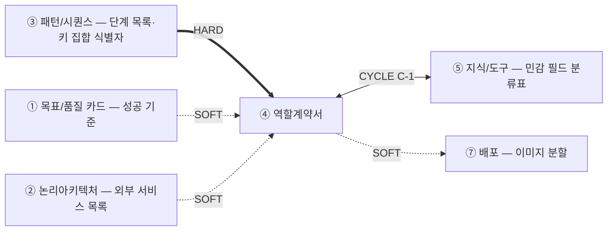

# 설계서 ④ 역할계약서 — 작성 가이드

## 1. 이 설계서가 답하는 질문

**"담당자 하나가 무엇을 책임지고, 어디까지 손댈 수 있는가"를 못 박는 문서임.**

사람으로 치면 근로계약서입니다 — 직무·열람 권한·성과 기준·해고 조건을 미리 적습니다.

**이걸 안 하면 나는 사고 3줄**

- 권한 경계가 없어 봐서는 안 될 컬럼까지 읽어 감사에서 걸림
- 출력 키를 사람마다 다르게 지어 ③ 패턴/시퀀스가 정한 단계 사이에서 데이터가 안 붙음
- 중단 조건이 없어 같은 호출을 계속 반복함

**앞뒤 연결도**

`HARD` 없으면 못 채움 · `SOFT` 나중에 고침 · `CYCLE C-1` 서로 보고 한 번 되돌림.  
**④ 역할계약서는 ③ 패턴/시퀀스의 단계 목록이 있어야 시작됨** — ③ 패턴/시퀀스의 단계를 묶어 역할을 나누기 때문입니다. ⑤ 지식/도구와는 서로를 보며 씁니다.  
민감 필드 ID의 단일 출처는 **⑤ 지식/도구**이고(G-11), 단계 간 **키 집합 식별자**는 **③ 패턴/시퀀스** 소유입니다.  
그 안의 **키 이름**은 본 산출물이 소유합니다(G-12) — 이름은 담당자 계약의 일부이기 때문입니다.

---

## 2. 시작 전 판정

### 2-1. LLM 담당자를 몇 명 둘까 — 판정 사다리

**먼저 무엇을 세는지 정합니다.** 이 설계서가 계약서를 쓰는 대상은 **담당자**임 —  
`한 묶음의 컨텍스트 + 한 묶음의 권한`이 담당자 1명임.

- **노드 수가 아님** — 담당자 1명이 노드 여러 개를 순서대로 돌 수 있음(노드 수는 ③ 패턴/시퀀스 소유)
- **담당자는 두 종류임** — 모델을 쓰는 담당자(에이전트)와 모델을 안 쓰는 담당자(결정론적 처리기).
  **둘 다 계약서를 1장씩 씀** — 모델을 안 쓴다고 빼면 되돌릴 수 없는 쓰기가 계약 없이 남음
- 아래 판정 사다리는 **모델을 쓰는 담당자**의 수만 정함. 모델을 안 쓰는 담당자는 3문 대신 권한 경계로 가름(표 아래 1줄)

**1단계** — ③ 패턴/시퀀스의 단계마다 아래 판단기준을 적용해 LLM 담당자 후보와 결정론적 처리기로 가릅니다.  
하나라도 "예"면 LLM 담당자 후보, 전부 "아니오"면 결정론적 처리기입니다.

| 판단기준 | "예"로 판정하는 기준 | 예 |
|------|--------------------|-----|
| L1 규칙 완결성 | 입력 → 출력 매핑을 표·조건문으로 전부 못 닫고, 새 예외가 계속 생김 | "이 문의가 환불 대상인가"는 예외가 계속 늘어 규칙표로 못 닫음 |
| L2 비정형 해석 | 입력이 자유 텍스트·이미지·음성이고, 그 의미(의도·요약·분류)를 해석해야 결과가 나옴 | 고객 문의 원문에서 불만 사유를 뽑아냄 |
| L3 재구성·종합 | 여러 출처를 종합하거나 근거를 들어 설명·제안을 새로 만들어야 함(단순 조회·계산이 아님) | 검증 실패 사유를 근거와 함께 서술 |

**판단과 실행이 한 단계에 붙어 있으면 먼저 쪼갭니다** — "예약해도 되는가"(판단)와 "예약 확정 호출"(실행)은 다른 단계입니다.  
`쓰기(되돌림 불가)` 실행 그 자체는 L1 ~ L3 결과와 무관하게 항상 결정론적 처리기가 맡습니다.  
되돌릴 수 없는 실행에 판단이 섞이면 사람이 승인한 값과 실제 실행한 값이 어긋납니다.

**결정론적 처리기로 갈린 단계는 2 · 3단계를 타지 않고 권한 경계로만 담당자 수를 가릅니다** —  
`읽기`끼리는 한 명으로 묶고 `쓰기(되돌림 가능)`도 함께 둘 수 있으나 `쓰기(되돌림 불가)`는 반드시 따로 1명으로 뗍니다.

아래 2 · 3단계는 **LLM 담당자 후보로 갈린 단계만** 대상으로 합니다.  
**기본값은 LLM 담당자 1명임.** 나눌 이유를 못 대면 나누지 않음.  
Microsoft Azure 문서도 같은 말을 합니다 — 단일로 풀리면 단일로 갑니다.  
3문은 **후보를 검사하는 도구**입니다. 검사 대상 후보를 먼저 만듭니다.

**2단계** — LLM 담당자 후보로 갈린 단계를 **컨텍스트 단위로 묶어** 할 일 목록으로 적습니다(단계에 없는 것은 유저스토리에서 보탬).  
업무 종류(동사)가 아니라 "같은 자료·같은 규칙을 보는가"로 묶습니다 — 동사로 쪼개면 담당자만 늘어납니다.  
**3 ~ 7개가 통상 범위입니다.** 8개를 넘으면 동사 단위로 쪼갠 것이 아닌지 다시 보고, 그래도 넘으면 사유 1줄을 적고 진행합니다(하드캡 아님).

**3단계** — 2단계 묶음 안에서 **읽는 자료나 손대는 권한이 다른 하위 묶음**이 보이면 그 경계에 3문을 던집니다.  
하나도 "예"가 아니면 단일(1명) 확정입니다. 하나라도 "예"면 그 경계로 나눕니다.

| 질문 | "예"로 판정하는 기준 | 예 |
|------|--------------------|-----|
| Q1 컨텍스트 오염 | 하나로 묶으면 같은 낱말이 서로 다른 뜻으로 쓰이거나, 한쪽 업무의 규칙을 보느라 다른 쪽과 무관한 내용을 계속 끌고 다님 | `상태`가 설비 상태와 작업 상태 두 뜻 |
| Q2 병렬화 | 하나로 순차 실행하면 ① 목표/품질 카드의 응답시간 목표를 넘김. **넘기는 초 수를 적음** | 순차 40초 · 목표 15초 |
| Q3 전문화 | 두 묶음이 쓰는 도구·규칙·배경지식이 서로 독립적이고, 권한 등급까지 다름 — 한쪽은 읽기만, 다른 쪽은 외부에 씀 | 설비 조회 vs 예약 확정 |

**Q3은 ⑤ 지식/도구 없이도 답합니다** — 두 묶음이 서로 다른 도구·자료를 쓰는지, 그리고 ② 논리아키텍처에서 쓰기가 일어나는 서비스를 누가 만지는지만 보면 됩니다.  
**Q3의 권한 등급 축은 설계판단임** — A01(Anthropic) 원문의 전문화는 도구·시스템프롬프트·도메인지식 3축뿐이고 읽기·쓰기 축은 없음. 이 축은 LangChain "How and when to build multi-agent systems"(미확인 아티클)의 읽기·쓰기 구분을 참고해 보탠 것으로, 확정 인용이 아니라 실무 보조 신호로 씀.

**3문이 전부 "아니오"인데 나누고 싶으면 취향입니다. 단일로 갑니다.**

### 2-2. 시작 조건 확인

| 확인 | 없으면 |
|------|--------|
| **③ 패턴/시퀀스의 단계 목록·단계 간 키 집합 식별자** | 묶을 단계가 없어 시작이 안 됩니다. ③ 패턴/시퀀스를 먼저 끝냅니다 |
| ⑤ 지식/도구의 민감 필드 분류표 초안 | `[확인필요: 선행 미생성]`을 적고 계속 진행합니다 |
| ② 논리아키텍처의 외부 서비스 목록 | `사용 도구`에 후보만 적고 확정 시 갱신합니다 |
| US `[처리 결과] 실패 시` | 중단 조건을 지어내지 말고 기획에 되묻습니다 |

---

## 3. 설계항목 작성법

| 설계항목 | 무엇을 적나 | 어디서 가져오나 | 좋은 예 | 나쁜 예 |
|----|------------|----------------|---------|---------|
| 책임 | - 이 담당자가 만들어 내는 결과물을 **1개**만 적음 - 결과물은 눈에 보이는 산출물로 씀(판정 1건·리포트 1건 같이) - 하는 일을 여러 개 늘어놓지 않음 — 문장에 `그리고`·`및`이 들어가면 담당자를 나눌지 2절 판정 사다리로 다시 봄 - 업무 분야 이름(`설비 업무 전반`)이 아니라 산출물 이름으로 씀 | US 스토리 헤더 `~하기 위해` 목적절 | 3계층 검증을 수행해 설비 확정 가부 1건 산출 | 설비 관련 업무 전반을 처리 |
| 접근 가능한 정보 항목 | - 이 담당자가 볼 수 있는 테이블과 **컬럼 이름을 하나씩** 적음 - 민감 필드(개인을 알아볼 수 있는 값)는 건마다 `포함`인지 `제외`인지 적음 — 개수가 민감 필드 건수와 같아야 함 - 민감 필드 ID(민감 필드에 붙인 번호)는 ⑤ 지식/도구가 정한 이름을 그대로 씀 — 여기서 새로 만들지 않음(G-11) - ⑤ 지식/도구의 분류표가 아직 없으면 `[확인필요: 선행 미생성]`이라고 적고 계속 진행함 - `설비 데이터 전체`처럼 뭉쳐 쓰지 않음 — 금지어 4종에 걸림 | ⑤ 지식/도구의 민감 필드 분류표 · US `[입력 요구사항]` | `설비`(설비ID·유형·가용포트수·거리) — 고객 이름·전화 제외 | 설비 데이터 전체 |
| 입출력 형식 | - 입력 키와 출력 키를 **이름·타입·필수 여부** 3개 묶음으로 하나씩 적음 - **키 이름을 정하는 곳은 이 칸 한 군데뿐임**(단일 출처) — 다른 설계서는 이 이름을 베껴 씀(G-12) - 그 키가 어느 묶음에 드는지는 ③ 패턴/시퀀스가 붙인 **키 집합 식별자**(`S-R4 → S-R5` 같은 묶음 이름)로 표시함 - 식별자 자체는 ③ 패턴/시퀀스 소유이므로 여기서 새로 만들지 않음 - `요청 정보를 받아 결과를 반환`처럼 설명문으로 쓰지 않음 — 키 이름이 없으면 미설계임 | ③ 패턴/시퀀스의 단계 간 키 집합 식별자 · US `[입력 요구사항]` · `[처리 결과] 성공 시` | 입력 `{request_id: str, facility_id: str}` (③ 패턴/시퀀스의 `S-R4 → S-R5` 집합) | 요청 정보를 받아 결과를 반환 |
| **사용 도구** | - 이 담당자가 부르는 도구 이름을 ② 논리아키텍처·⑤ 지식/도구에 적힌 **그대로** 옮겨 적음 — 새 이름을 지어내지 않음 - 바깥 시스템에 붙는 도구면 커넥터(외부 시스템에 붙는 도구)라고 적음 - 우리 안에 있는 저장소를 읽는 도구면 뒤에 `커넥터 아님`을 붙임 — 외부 접근만 커넥터임(G-13) - **도구마다 `읽기`·`쓰기(되돌림 가능)`·`쓰기(되돌림 불가)` 중 1개를 반드시 함께 적음** — 공란을 두지 않음. 표시가 없으면 되돌릴 수 없는 쓰기가 확인 없이 실행됨 - `쓰기(되돌림 불가)`(예약 확정·발송·결제처럼 한 번 하면 취소가 안 되는 일)는 ③ 패턴/시퀀스가 **이미 둔** 사람 확인 노드(사람이 승인해야 넘어가는 자리)와 짝지어 적음 — 짝지을 노드가 ③에 없으면 여기서 만들지 않고 ③에 `변경요청` 1행을 남김 - ② 논리아키텍처의 외부 서비스 목록이 아직 없으면 후보 이름만 적고 확정되면 갱신함 - `필요시 외부 API 호출`처럼 적지 않음 — 금지어 4종에 걸림 | ② 논리아키텍처의 외부 서비스 · ⑤ 지식/도구의 커넥터 목록 · ③ 패턴/시퀀스의 사람 확인 노드 | GIS 조회 커넥터 `읽기`, 설비 저장소 조회 `읽기`(커넥터 아님), 예약 확정 커넥터 `쓰기(되돌림 불가)` — ③ 패턴/시퀀스의 사람 확인 노드 `S-R7`과 짝지음 | 필요시 외부 API 호출 / 표시 없음 — 되돌릴 수 없는 쓰기가 확인 없이 실행됨 |
| 사용 모델 | - 쓰는 모델 이름을 적음 — 모델을 안 쓰면 빈칸으로 두지 않고 `모델 미사용(결정론적 실행)`이라고 그대로 적음 - **호출 설정**을 함께 적음 — 사고(모델이 답하기 전에 속으로 더 생각하는 기능) 켬/끔, 최대 출력 토큰 - 그 모델을 고른 이유를 1줄 적음 - 설정값은 기억에 의존하지 않고 **모델 문서를 열어 확인하고 확인일까지 적음** — 사고를 안 적으면 저절로 켜지는 모델이 있고 사고 토큰도 출력 단가로 과금됨 - 벤더 정책이 아직 안 정해졌으면 `[확인필요: 모델 벤더 정책]`로 적고 배정 근거만 씀 | 벤더 정책 + **모델 문서로 확인하고 확인일 기재**(기억 금지 — 사고를 생략하면 켜지는 모델이 있고 사고 토큰이 출력 단가로 과금됨) | 소형 모델 · 사고 끔 · 출력 상한 / **모델 미사용(결정론적 실행)** | 성능 좋은 모델 사용 |
| 성공 기준 | - 참인지 거짓인지 딱 갈리는 문장으로 적음 - 숫자가 있으면 US `[검증 요구사항]`의 숫자를 그대로 인용함 - 판정이 안 갈리게 읽히는 말(`정확하게 수행됨`)은 쓰지 않음 - 참·거짓으로 못 가르겠으면 표현을 다듬지 말고 US 숫자를 찾아 붙임 | US `[검증 요구사항]` 판정형 항목 | 3계층 전부 통과 건만 확정, 검증 리포트 100% 저장 | 검증이 정확하게 수행됨 |
| 중단 조건 | - 어떤 신호를 보면 멈추는지 적음 — 보고 바로 판정할 수 있는 문장으로 씀 - US `[처리 결과] 실패 시`에 적힌 조건을 옮겨 씀 — 없으면 지어내지 않고 기획에 되물음 - **재시도 횟수·타임아웃 값은 이 칸에 정하지 않음** — 그 값은 ③ 패턴/시퀀스 소유라 인용만 함(G-5) - `오류 발생 시 중단`처럼 뭉뚱그리지 않음 — 어떤 오류인지 써야 판정이 됨 | US `[처리 결과] 실패 시` | 동일 실패 3회 반복 시 운영자 에스컬레이션 | 오류 발생 시 중단 |
| 중단 조건의 **판정 주체·시점** | - 실패를 **세는 주체를 1개만** 적음(예: 오케스트레이터) - 언제 세는지 **시점**을 적음(예: 노드 종료 직후) - 시점은 ③ 패턴/시퀀스의 단계 경계에서 골라 씀 — 새 시점을 만들지 않음 - 중단 조건이 여러 개면 조건마다 주체·시점을 각각 적음 - 비워 두지 않음 — 누가 세는지 없으면 아무도 안 셈 | ③ 패턴/시퀀스의 단계 경계 · US `[처리 결과] 실패 시` | `주체: 오케스트레이터 / 시점: 노드 종료 직후` | 비워 둠 — 누가 세는지 없으면 아무도 안 셉니다 |
| **공유 상태 후보 표시** | - 출력 키 중 **다른 담당자도 읽는 키**에 `공유` 표시를 붙임 - 표시한 키를 ③ 패턴/시퀀스의 상태 스키마(단계 사이를 흐르는 값 목록)와 하나씩 대조함 - ③ 패턴/시퀀스에 없는 키가 나오면 ③ 패턴/시퀀스에 `변경요청` 1행을 남김 - 표시를 빼지 않음 — 대조가 안 되면 병렬 구간에서 값이 사라짐 | ③ 패턴/시퀀스가 먼저 잡은 상태 스키마와 대조 | 출력 `{passed, failed_layer, report_id}` `공유` | 표시 없음 — ③ 패턴/시퀀스의 상태 스키마와 대조가 안 됨 |

**금지어 4종** — `전체`·`필요시`·`관련 데이터`·`적절한`. 보이면 그 칸은 미설계임.

**판정 사다리는 2절에 둡니다.** 그 밖에 비면 뒤가 막히는 칸이 위 표의 마지막 3행과 아래 경계 규칙임.

**멈춤까지만 씀**(G-5) — 재시도·폴백·타임아웃은 ③ 패턴/시퀀스가 소유합니다.  
④ 역할계약서는 "무엇을 보면 멈추나"까지만 적습니다.

---

## 4. 예시

### 4-1. KT 개통 자동화 — 한 줄기 완주

> 아래 인용은 강사가 가진 기획 자료입니다. **열 수 없어도 됩니다** — 볼 것은 값이 아니라 **판단 경로**입니다.

출처 — `~/workspace/oss/docs/plan/`(`design/userstory.md` · `think/es/02`·`08` puml).  
정답이 아니며 다르게 판단해도 됩니다. 근거만 남기면 됩니다.

**줄기: ③ 패턴/시퀀스의 단계 목록 → 유저스토리 → 판정 → 계약 7칸 → 중단 조건 → ⑤ 지식/도구·⑥ 가드레일/관측**

**(1) 유저스토리** — `UFR-FAC-040 설비 할당 3계층 검증`.  
수용성·기술기준·데이터품질 3계층을 순차 수행함.  
전부 통과해야 확정함(출처: userstory.md UFR-FAC-040).

**(2) 판정** — Q1 아니오, Q2 아니오, **Q3 예**.  
설비 조회와 예약 확정은 쓰는 자료·규칙이 독립적이고, 조회는 읽기, 예약 확정은 쓰기라 권한 등급도 다름(UFR-FAC-030).  
따라서 `설비 적합성 검증`과 `설비 예약 확정` 2개로 나눔.

**(3) 계약 7칸 — 「설비 적합성 검증」**

| 계약 항목 | 내용 | 근거 출처 |
|----------|------|----------|
| 책임 | 3계층 검증을 수행해 확정 가부와 실패 계층 1건 산출 | US:UFR-FAC-040#행위1 |
| 접근 가능한 정보 항목 | `설비`(설비ID·유형·가용포트수·상태·거리) — 고객 이름·전화·주소 제외 | US:UFR-FAC-010#입력1 · US:NFR-SYS-020 |
| 입출력 형식 | 입력 `{request_id: str, facility_id: str}` / 출력 `{passed: bool, failed_layer: str, report_id: str}` `공유` | US:UFR-FAC-040#성공1 |
| 사용 도구 | 설비 저장소 조회 커넥터 `읽기`, GIS 조회 커넥터 `읽기`, 검증 리포트 저장 `쓰기(되돌림 가능)`(커넥터 아님) | ES:02 참여자 · US:UFR-FAC-040#검증1 |
| 사용 모델 | [확인필요: 모델 벤더 정책] — 배정 근거: 규칙 판정 중심 작업임 | 설계판단 |
| 성공 기준 | 3계층 전부 통과 건만 확정, 검증 결과 리포트 저장 100% | US:UFR-FAC-040#검증1 |
| 중단 조건 | 동일 실패 3회 반복 / GIS 조회 10초 초과 / 데이터품질 계층 실패 | US:UFR-RCV-020 · US:UFR-FAC-010 |

**(4) 판정 주체** — 오케스트레이터가 노드 종료 직후 실패 횟수를 셈.  
3회는 지어낸 값이 아니라 `UFR-RCV-020`의 3회 반복 에스컬레이션 인용임.

**(5) ③ 패턴/시퀀스와 맞춰 봄** — ③ 패턴/시퀀스가 앞서 정해 둔 값을 그대로 인용하고 새로 정하지 않습니다.  
③ 패턴/시퀀스의 재시도 표 — `GIS 조회` 10초·재시도 2회, 초과 시 텍스트 목록 폴백(UFR-FAC-010).  
③ 패턴/시퀀스의 착지 노드 — 3회 소진 시 ES:08 오류 분류로 넘겨 Type A ~ D를 판정합니다.  
④ 역할계약서는 "3회에서 멈춤"이라는 **멈춤 신호까지만** 적습니다(G-5). 값이 어긋나면 ③ 패턴/시퀀스에 `변경요청` 1행을 남깁니다.

**(6) ⑥ 가드레일/관측으로 넘어감** — 3회 도달 건수가 임계치를 넘으면 운영자 알림(임계치는 ③ 패턴/시퀀스 소유, ⑥ 가드레일/관측은 참조만).

### 4-2. 마이데이터 금융상품 추천 — 판단이 달라지는 지점

근거는 [마이데이터 케이스](_shared/마이데이터-케이스.md) 1건임.  
기획 산출물이 없어 수치는 전부 추정임. 실제 과제에서는 `[확인필요]`로 되물음.

**(1) R-2가 판정 사다리를 흔듦** — 최대 3명이 선착순으로 제안서를 냄(케이스:R-2).  
같은 입력에 3건이 병렬 생성되므로 2절 Q2(병렬화)가 "예"로 보임.  
그러나 **복제는 답이 아닙니다** — 3건은 조직 제약이고 컨텍스트가 갈린 것이 아닙니다.  
→ 계약서는 **1건**, 동시 실행 수만 `3`으로 적음.  
서로 다른 상품군을 맡아 쓰는 자료·규칙이 독립적으로 갈리면 그때 Q3가 "예"가 되어 계약 3건이 됩니다.  
**KT와의 차이** — KT는 업무가 독립적이고 읽기·쓰기 권한까지 갈려 나눴고(Q3), 여기서는 병렬로 보여도(Q2) 업무가 독립적으로 갈리지 않아 안 나눔.

**(2) R-1이 접근 항목 칸을 바꿈** — 마이데이터가 익명으로 유입됨(케이스:R-1).  
KT는 이름·전화를 **빼는** 문제였으나 여기서는 **애초에 없습니다.**  
제외 목록이 아니라 **재식별 조합**을 막는 것이 최소수집입니다(`KT:7-3#최소수집`).

| 계약 항목 | 내용 | 근거 출처 |
|----------|------|----------|
| 책임 | 익명 자산 프로파일로 상품 포트폴리오 제안서 1건 산출 | 케이스:O-2 |
| 접근 가능한 정보 항목 | `자산`(상품유형·잔액구간·보유기간), `상품`(유형·조건) — 계좌번호·기관명 동시 노출 제외 | `KT:7-3#최소수집` · 케이스:R-1 |
| 입출력 형식 | 출력 `{picks: list, evidence: list, segment_tag: str}` `공유` | `KT:7-3#추천근거추적` |
| 성공 기준 | 근거 표기율 100%(추정), 부적합 상품 포함률 0%(추정) | 케이스:M-4 · M-5 |
| 중단 조건 | 동의 상태 미확인 / 부적합 후보만 남음 / 근거 없는 추천 발생 | `KT:7-3#동의상태확인` |

**(3) 실패의 무게가 다름** — KT는 개통 지연이나 여기서는 부적합 상품 추천입니다.  
그래서 중단 조건이 "느려서 멈춤"이 아니라 **"근거가 없으면 멈춤"** 쪽으로 기욺.

---

## 5. 자주 틀리는 5가지

| # | 실패 양상 | 왜 생기나 | 어떻게 막나 |
|---|----------|----------|------------|
| 1 | 담당자 1명에 책임이 2 ~ 3개 붙음 | US 1건을 그대로 담당자 1명으로 옮김 | 책임 문장에 `그리고`·`및`이 있으면 분해함 |
| 2 | 접근 항목에 테이블 이름만 적힘 | 컬럼까지 적기를 과하다고 느낌 | 민감 필드 각 건에 포함·제외를 적음 |
| 3 | ③ 패턴/시퀀스가 키 이름까지 지어냄 | ③ 패턴/시퀀스는 키 집합 식별자만 적으면 되는 것을 모름 | ④ 역할계약서의 출력 칸 위에 `키 이름의 단일 출처는 ④ 역할계약서임` 1줄을 둠 |
| 4 | 중단 조건에 "재시도 2회 후 중단"을 적음 | ③ 패턴/시퀀스와 ④ 역할계약서의 경계를 모름(G-5) | ④ 역할계약서는 멈춤 신호까지. 횟수는 ③ 패턴/시퀀스의 값을 인용함 |
| 5 | 성공 기준이 "정확히 검증됨"으로 끝남 | US 검증 요구사항을 안 열어 봄 | 참·거짓으로 못 가르면 US 숫자를 인용함 |

---

## 6. 제출 전 자가 점검표

- [ ] 판정 근거가 3줄 이내이고 2절 3개 질문 중 어느 것이 "예"인지 적혔음
- [ ] 담당자 전부가 7개 칸을 채웠고 **공란 0개**임
- [ ] 금지어 4종(`전체`·`필요시`·`관련 데이터`·`적절한`) 검색 결과 **0건**임
- [ ] `입출력 형식` 칸에 키 이름이 담당자마다 **1개 이상** 있고 ③ 패턴/시퀀스의 키 집합 식별자와 짝지어짐
- [ ] 할 일 묶음이 **③ 패턴/시퀀스의 단계에서 나왔음**(단계에 없는 묶음은 근거 1줄이 있음)
- [ ] 민감 필드 각 건에 포함 또는 제외 표기가 있음(개수 = 민감 필드 건수)
- [ ] `사용 도구`가 전부 ② 논리아키텍처 또는 ⑤ 지식/도구에 있는 이름임(새로 만든 이름 0건)
- [ ] 도구마다 `읽기`/`쓰기` 표시가 있음(공란 0건)
- [ ] **`사용 모델`이 모델명인 행은 `사용 도구`에 그 모델을 부르는 도구가 있음**(어긋난 행 0건)
- [ ] US `[입력 요구사항]`·`[검증 요구사항]`이 함께 요구한 항목 대비 **누락 키 0건**임
- [ ] 중단 조건마다 판정 주체와 시점이 적혔음(공란 0건)
- [ ] 중단 조건에 재시도 횟수가 적힌 행이 **0건**임(③ 패턴/시퀀스 소유)
- [ ] 모든 행의 `근거 출처`가 원문 ID 또는 `설계판단`으로 채워짐(공란 0건)

---

## 7. 다음으로 넘기는 값과 근거 자료

**후행 소비처** — ④ 역할계약서는 ③ 패턴/시퀀스 **뒤**에 오므로 ③ 패턴/시퀀스로 값을 넘기지 않습니다. 어긋난 값은 아래 되돌림 경로로만 갑니다.

| 넘기는 값 | 받는 곳 | 강도 | 안 넘기면 |
|----------|--------|------|----------|
| 입출력 형식(키 이름) | ⑤ 지식/도구의 커넥터 입출력 키 | HARD | ⑤ 지식/도구가 새 이름을 지어내 구현 시 안 맞음(G-12) |
| 접근 가능한 정보 항목 | ⑤ 지식/도구의 변환 지점 | CYCLE C-1 | 마스킹을 어느 경로에 걸지 못 정함 |
| 중단 조건(멈춤 신호) | 구현: 담당자 노드 정의 | HARD | 멈출 조건 없이 노드가 계속 돎 |
| 담당자 수·사용 모델 | ⑦ 배포의 이미지 분할 판단 | SOFT | 단일 이미지로 시작해도 무방함 |

**되돌려 보내는 값** — ⑥ 가드레일/관측이 ③ 패턴/시퀀스에 값을 되돌리는 것과 같은 경로입니다(G-4).

| 되돌려 보내는 값 | 받는 곳 | 없으면 |
|----------------|--------|--------|
| 중단 조건과 어긋나는 재시도 값 `변경요청` 1행 | ③ 패턴/시퀀스(되돌림) | 값이 두 개로 남음 |
| ③ 패턴/시퀀스의 상태 스키마에 없는 `공유` 키 `변경요청` 1행 | ③ 패턴/시퀀스(되돌림) | 병렬 구간에서 값이 사라짐 |

**근거 자료**

| 아티클 | 거는 칸 |
|--------|--------|
| [A01](../references/articles/A01_blog_anthropic-when-multi-agent.md) | 2절 판정 사다리 — 3개 질문의 출처. 단일이 기본값(단 Q3의 권한 등급 축은 A01 밖 설계판단, 2-1절 각주 참조) |
| [A05](../references/articles/A05_paper_agentarceval.md) | 중단 조건 칸 — 실패 시나리오로 빠진 조건 점검 |
| [A06](../references/articles/A06_std_owasp-agentic-top10.md) | 접근 가능한 정보 항목 칸 — 최소권한 근거 |
| [근거 계보 검증](_shared/근거-계보-검증.md) V-3 | 역할에 권한을 두는 규칙은 Gaia 원전에 실재함(단 Gaia 권한은 *자원 접근권*) |
