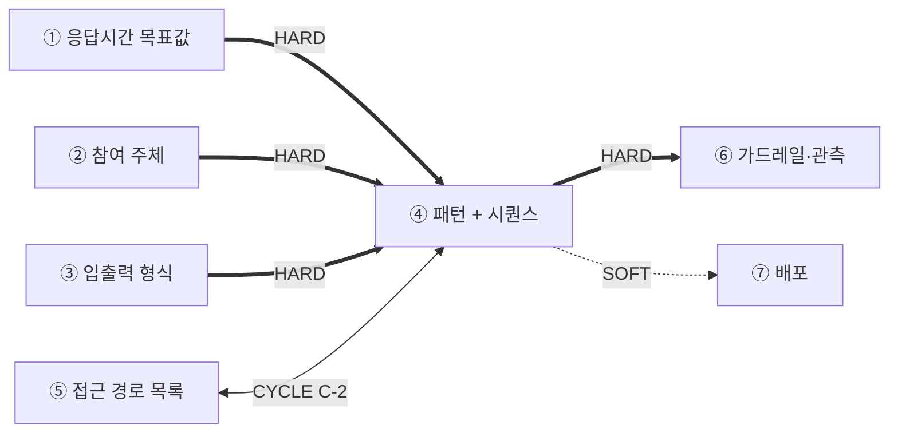
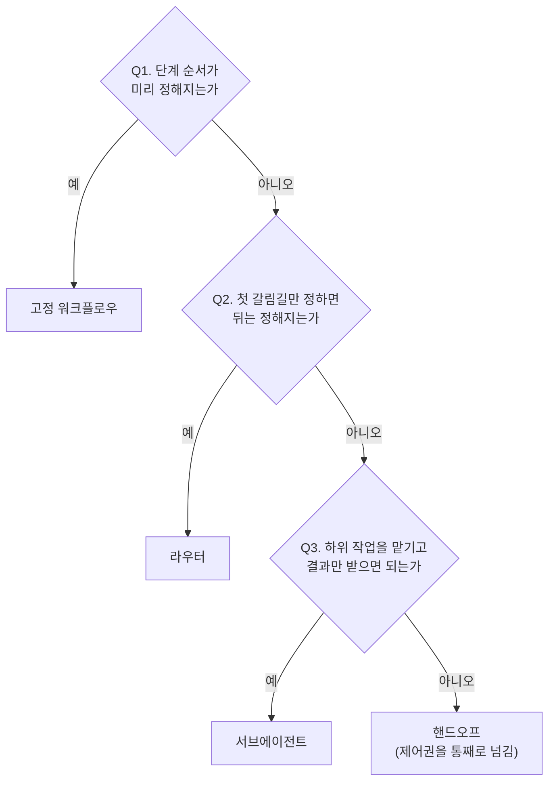
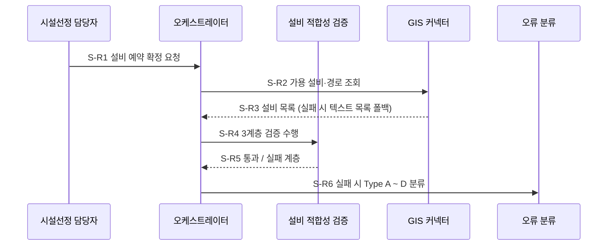

# 설계서 ④ 오케스트레이션 패턴 + 시퀀스 설계 — 작성 가이드

## 1. 이 설계서가 답하는 질문

**"누가 어떤 순서로 움직이고, 실패하면 무엇을 하는가"를 못 박는 문서임.**

`타임아웃 값의 단일 출처는 본 산출물임` — 이 문장을 머리말에 그대로 둠.

**이걸 안 하면 나는 사고 3줄**

- 재시도가 겹쳐 외부 시스템에 호출이 몇 배로 쏟아짐
- 상한 없는 재계획 루프로 요청이 안 끝나고 비용만 쌓임
- 동시에 도는 두 단계가 같은 상태 값을 덮어써 결과가 사라짐

**앞뒤 연결도**

`HARD` = 없으면 못 채움. ④는 HARD 유입 3건이라 가장 늦게 시작됨.  
`CYCLE C-2` = ⑤와 서로 봐야 해서 한 번 되돌려 반영함.

---

## 2. 시작 전 판정

### 2-1. 트리거부터 가름

시퀀스는 **시작 계기별로 따로 그림.** 섞으면 예산이 엉킴.

| 트리거 | 무엇인가 | 단계 식별자 | 예산 기준 |
|--------|---------|------------|----------|
| 동기 요청 | 사람이 눌러 기다림 | `S-R1` ~ | ① 응답시간 목표 |
| 스케줄 배치 | 정해진 시각에 자동 실행 | `S-B1` ~ | ① 배치 완료 목표 |
| 이벤트 | 앞 단계 완료 신호로 시작 | `S-E1` ~ | 전달 지연 목표값 |

### 2-2. 패턴 선택 — 결정 트리

**기본값은 고정 순서임.** 모델이 순서를 고르게 하는 건 필요할 때만 함.

후보 5종은 A02에서 가져옴 — 고정 워크플로우·라우터·서브에이전트·핸드오프·스킬.  
**패턴과 프레임워크를 섞지 않음.** 표에는 패턴만 올림.

---

## 3. 칸별 작성법

| 칸 | 무엇을 적나 | 어디서 가져오나 | 좋은 예 | 나쁜 예 |
|----|------------|----------------|---------|---------|
| 패턴 비교 표 | 후보 3개 이상·장단점·선택 1개 | A02 5종 · ① 품질속성 | 라우터 — 실패 유형별 경로 4개라 분기 필요 | LangGraph 선택 — 많이 씀 |
| 시퀀스 단계 | 단계 1건 = 행위 1개 | PR To-Be 흐름 · US 시나리오 | `S-R4` 3계층 검증 → 종료 `통과/실패계층` | 검증하고 결과를 정리함 |
| 단계 간 데이터 형식 | 보내는 곳·받는 곳·키 이름 | ③ 입출력 형식을 **이름으로 인용** | `③ 설비 적합성 검증 · 출력` | 키를 다시 나열함 |
| 상태 스키마 | 필드명·타입·**갱신 주체 1개** | ③ 출력 중 `공유` 키 | `error_history: list` / 주체 1개 / 누적 | `context: dict` / 주체: 전 노드 |
| 출력 스키마 | 최종 결과 필드·근거 필드 | US `[처리 결과] 성공 시` | `items[].evidence: list` 필수 | 결과를 JSON으로 반환 |
| 타임아웃·재시도 | 단계별 값·직렬/병렬·재시도 | ① 목표값 · US NFR 성능 | GIS 조회 10초 · 재시도 2회 · 폴백 있음 | 단계별로 적절히 배분함 |

---

## 4. 프롬프트에 없지만 반드시 채울 것

| 추가 칸 | 왜 필요한가 | 적는 법 |
|--------|------------|--------|
| **상태 필드 소유권** | 갱신 기본이 덮어쓰기라 병렬 두 단계가 같은 필드를 쓰면 하나가 사라짐 | 필드마다 주체 **1개**. 병렬 구간은 **누적만** |
| **반복 상한 `max_iter`** | "실패 시 재계획"이 무한 왕복이 됨 | 루프마다 상한 숫자를 적고 US에서 인용 |
| **소진 시 착지 노드** | 상한에 걸린 뒤 갈 곳이 없으면 멈춤 | `안전 종료` 또는 `사람 확인` 1개 지정 |
| **재시도 포함 최악값 합계** | 성공 경로만 더하면 예산을 통과함 | 단계 시간 × (1 + 재시도)로 다시 계산 |

**재시도 중첩 — 실제 사례.** KT 기획 자료에 이미 두 계층이 있음.  
DLQ(처리 못 한 건을 따로 모아 두는 대기열) 적재 **전** 소비자 재처리 5회(US:NFR-SYS-060 · userstory.md 679행),  
DLQ 적재 **후** 자동 재시도 3회(ES:08 puml 109 ~ 110행).  
둘은 충돌이 아니라 계층이 다름. 합치면 한 건이 **최대 15회** 처리됨.  
한쪽만 보면 예산이 3배 또는 5배 어긋남.  
대책 — 계층마다 이름을 나눠 적음(`소비자 재처리`·`DLQ 재시도`).  
계층별 기록은 ⑥ 가이드가 다루며 ④는 예산·상한만 다룸.

**상태 3출처**(A03) — 요청마다 바뀌는 값은 `Runtime Context`,  
단계 간 값은 `State`, 세션을 넘길 값은 `Store`에 둠.

**G-4 경로** — 타임아웃은 ④ 소유. ⑥에서 안 맞아도 **⑥을 고치지 않음.**  
④의 `변경요청` 표에 1행을 남기고 ④가 고친 뒤 ⑥이 참조함.

**G-5 경계** — 재시도·폴백·타임아웃 통합 확인의 주인은 ④임.  
③은 "무엇을 보면 멈추나"까지만 적고, ⑥은 결과를 관측 항목으로 검증만 함.

---

## 5. 예시

### 5-1. KT 개통 자동화 — 한 줄기 완주

> 아래 인용은 강사가 가진 기획 자료임. **열 수 없어도 됨.**
> 볼 것은 값이 아니라 **판단 경로**임.

출처 — `~/workspace/oss/docs/plan/`의 `design/userstory.md`,  
`think/es/02-설비-탐색-할당-및-검증게이트.puml`, `think/es/08-검증실패-오류-복구플로우.puml`.  
이 예시는 정답이 아님. 다르게 판단해도 되며 근거만 남기면 됨.

**(1) 트리거** — 담당자가 화면에서 누름 → 동기 요청 → `S-R`.

**(2) 패턴** — 실패 유형이 4종(ES:08 Type A ~ D)이라 갈림길 필요 → 라우터.

**(3) 시퀀스**

S-R4의 1계층(수용성)이 사전 조건 확인 노드임(US:UFR-FAC-040).

**(4) 타임아웃 예산 — 여기서 충돌이 드러남**

| 단계 | 타임아웃 | 직렬/병렬 | 재시도 | 최악값 | 근거 |
|------|---------|----------|-------|-------|------|
| S-R2 GIS 조회 | 10초 | 직렬 | 2회 | 30초 | US:UFR-FAC-010 |
| S-R4 3계층 검증 | [확인필요: 목표값] | 직렬 | 0회 | - | US:UFR-FAC-040 |

총 예산은 화면 로딩 2초임(US:NFR-SYS-010).  
S-R2 하나가 10초라 **최악값 30초로 예산을 넘김.**  
GIS 조회를 동기 경로에서 빼고 이벤트 트리거(`S-E`)로 분리함.  
그래도 못 맞으면 값을 낮추지 말고 `[확인필요]`로 되물음.

**(5) 반복 상한·착지 노드** — `max_iter = 3`(US:UFR-RCV-020 3회 반복).  
소진 시 착지 노드는 **사람 확인** — 운영자 수동 복구(US:UFR-RCV-030).  
이벤트 재처리 상한 5회, 초과 시 DLQ로 감(US:NFR-SYS-060).

**(6) 상태 필드 소유권**

| 필드 | 타입 | 갱신 주체 | 갱신 방식 |
|------|------|----------|----------|
| `validation_result` | dict | 설비 적합성 검증 | 덮어쓰기 |
| `error_history` | list | 오류 분류 | **누적만**(병렬 구간) |
| `retry_count` | int | 오케스트레이터 1개만 | 덮어쓰기 |

**(7) ⑥으로 넘김** — 단계 6개의 이름·개수를 확정 출력물로 명시함.  
⑥은 위에 겹쳐 그리며 단계를 늘리거나 합치지 않음.  
⑥에서 값이 안 맞으면 ④의 `변경요청` 표에 1행을 남김(G-4).

### 5-2. 마이데이터 금융상품 추천 — 판단이 달라지는 지점

근거는 [마이데이터 케이스](_shared/마이데이터-케이스.md) 1건임.  
기획 산출물이 없어 수치는 전부 추정임. 실제 과제에서는 `[확인필요]`로 되물음.

**(1) R-2가 상태 설계를 정면으로 침** — 같은 입력에 제안서 3건이 병렬 생성됨(케이스:R-2).  
4절 규칙 `필드당 갱신 주체 1개, 병렬이면 누적만`이 실제로 필요해지는 지점임.

| 필드 | 타입 | 갱신 주체 | 갱신 방식 |
|------|------|----------|----------|
| `proposals` | list | 제안서 생성 3개 인스턴스 | **누적만** — 덮어쓰면 3건 중 1건만 남음 |
| `arrival_order` | list | 오케스트레이터 1개만 | 누적(선착순 판정용) |
| `consent_ok` | bool | 동의 확인 1개만 | 덮어쓰기 |

**(2) 동의 확인은 분기 앞에 1회** — `KT:7-3#동의상태확인`.  
3갈래로 갈라진 뒤 각자 확인하면 3번 확인하고 결과가 갈릴 수 있음.  
**KT와의 차이** — KT는 사전 조건 확인이 검증 단계 안에 있었음.  
여기서는 병렬 분기 **앞의 독립 노드**여야 함.

**(3) 시간과 비용의 계산이 갈림** — 병렬 구간은 합계에 최댓값 1건만 넣으므로 시간은 3배가 아님.  
그러나 모델 호출은 3배임. 타임아웃 표에 시간과 호출 수를 **따로** 적음.  
총 예산은 M-1 `5분 이내(추정)`를 쓰되 실제 과제에서는 `[확인필요]`로 둠.

**(4) 출력 스키마에 근거가 필수** — `KT:7-3#추천근거추적`.  
`proposals[].evidence`를 필수로 두어 어떤 자산으로 어떤 상품을 권했는지 3건 각각에 붙임.  
근거 표기율 목표는 100%(추정 · 케이스:M-4)임.

**(5) 반복 상한은 아직 못 정함** — 제안서 재작성 루프의 상한 값이 케이스에 없음.  
숫자를 지어내지 않고 `max_iter = [확인필요]`로 남기되 **착지 노드는 지금 정함** — 사람 확인.

---

## 6. 자주 틀리는 5가지

| # | 실패 양상 | 왜 생기나 | 어떻게 막나 |
|---|----------|----------|------------|
| 1 | 합산을 놓쳐 한 건이 15회 처리됨 | 같은 낱말 `재시도`가 두 계층에 쓰임 | 계층별로 이름을 나눠 적고 곱해서 합산 |
| 2 | 재계획 루프가 안 끝남 | 표에 반복 상한 칸이 없음 | 루프마다 `max_iter`·착지 노드를 1행씩 적음 |
| 3 | 병렬 단계 결과가 하나만 남음 | 갱신 기본이 덮어쓰기임 | 병렬 구간은 누적만. 주체 1개 표기 |
| 4 | 합계는 통과인데 실제는 초과 | 성공 경로만 더해 검증함 | 최악값 열을 두고 그 값으로 검증 |
| 5 | ⑥과 ④ 타임아웃이 다름 | ⑥에서 값을 직접 고침 | ⑥은 참조만. ④에 `변경요청` 1행 |

---

## 7. 제출 전 자가 점검표

- [ ] `타임아웃 값의 단일 출처는 본 산출물임`이 문서에 **1건 이상** 있음
- [ ] `sequenceDiagram` 블록이 트리거 종류 수만큼 있음
- [ ] 시퀀스 단계 표 행 수와 도식 단계 수가 **같음**
- [ ] 사전 조건 확인 단계가 **1행 이상** 있고 실패 분기가 표기됨
- [ ] 모든 단계 행에 타임아웃과 `직렬/병렬` 값이 있음(공란 0건)
- [ ] **최악값**(단계 시간 × (1+재시도)) 열이 있고 합계가 총 예산 이하임
- [ ] 루프마다 `max_iter`와 소진 시 착지 노드가 있음(공란 0건)
- [ ] 상태 필드마다 갱신 주체가 **1개**이고 병렬 구간 필드는 누적임
- [ ] 단계 간 데이터 형식이 ③을 이름으로 인용함(재나열 0건)
- [ ] 근거 출처 필수 3개 표의 공란 **0건**임

---

## 8. 다음으로 넘기는 값과 근거 자료

**후행 소비처**

| 넘기는 값 | 받는 곳 | 강도 | 안 넘기면 |
|----------|--------|------|----------|
| 시퀀스 단계 이름·개수 | ⑥ 오버레이 대상 | HARD | ⑥이 그릴 바탕 없음 |
| 타임아웃·재시도 값 | ⑥ 단계별 상한 | HARD(소유 ④) | 두 문서 값이 갈라짐 |
| 최종 출력 형식 | ⑦ 프론트·API 분리 | SOFT | 분리 판단 지연 |
| 커넥터 입출력 규격 | ⑤ 커넥터 목록 | CYCLE C-2 | 검색과 어긋남 |

**근거 자료**

| 아티클 | 거는 칸 |
|--------|--------|
| [A02](../references/articles/A02_doc_langchain-multi-agent.md) | 2절 패턴 후보 5종 · 3절 비교 표 |
| [A03](../references/articles/A03_doc_langchain-context-eng.md) | 4절 상태 3출처 판정 |
