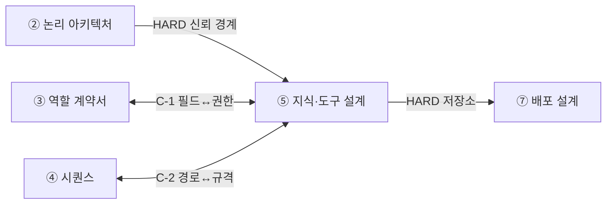
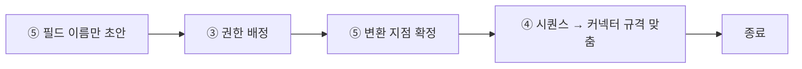

# 설계서 ⑤ 지식·도구 설계 — 작성 가이드

## 1. 이 설계서가 답하는 질문

**"이 에이전트는 무엇을 근거로 답하는가."**  
질문 유형마다 답을 어디서 가져올지 정하고, 민감한 값을 어디서 가리는지 못 박는 문서임.

**이걸 안 하면 나는 사고 3줄**

- 집계 질문을 문서 검색에 던져 숫자가 매번 달라짐. 시연에서 무너짐
- 고객 이름·전화가 가려지지 않은 채 외부 모델로 나감. 되돌릴 수 없음
- ⑦이 저장소를 못 정해 배포 설계가 통째로 멈춤

**앞뒤 연결도**

용어 — `HARD`는 앞이 없으면 못 채움. `C-1`·`C-2`는 서로 보며 한 번 되돌리는 관계임.

---

## 2. 시작 전 판정

**순서를 뒤집음.** 스택을 먼저 늘어놓지 않음.  
`질문 3개 뽑기 → 경로 판정 → 버린 대안 1줄` 순으로 함.

**1단계 — 질문 3개 적기(5분).** 사용자가 실제로 칠 문장 그대로 적음.  
유저스토리의 `[검증 요구사항]` 조회형 항목에서 그대로 베끼면 빠름.

**2단계 — 질문마다 위에서부터 예/아니오로 내려감.**

| 물음 | 예 | 아니오 |
|------|----|--------|
| 답이 개수·합계·정렬인가 | **NL2SQL** | 다음 줄 |
| 답이 문서 1~2군데 문장인가 | **벡터 RAG** | 다음 줄 |
| 관계를 2번 이상 건너가야 하나 | **GraphRAG** | 다음 줄 |
| 사내 코드·용어를 1:1로 고정해야 하나 | **용어사전·온톨로지** | `[확인필요]` |

용어 — NL2SQL은 말을 SQL로 바꿔 표를 조회함. 벡터 RAG는 뜻이 가까운 문단을 찾아옴.  
GraphRAG는 개체를 선으로 이어 두고 그 선을 따라감.

**3단계 — 버린 대안 1줄.** "GraphRAG는 구축 비용 때문에 뺌"처럼 한 줄 남김.  
근거가 남아야 다음 스프린트에서 다시 판단 가능함.

**멈춤 신호** — 질문 3개가 전부 같은 경로로 몰리면 질문을 잘못 뽑은 것임.  
사용자에게 다시 물어본 뒤 시작함.

---

## 3. 칸별 작성법

| 칸 | 무엇을 | 어디서 가져오나 | 좋은 예 | 나쁜 예 |
|----|--------|----------------|---------|---------|
| 정형 접근 경로 | 조회할 표와 목적 | US `[입력 요구사항]` | `code_map` — 3방향 코드 조회 | `DB 전체` |
| 접근 금지 항목 | 못 보게 막을 열 | US 보안 체크리스트 | `cust.phone` | 공란 |
| 비정형 경로 선택 근거 | 왜 이 방식인가 | 질문 유형 | 표현이 달라 낱말 일치로 누락됨 | 요즘 많이 씀 |
| 커넥터 입출력 | 키 이름·타입 | US `[처리 결과]` | `facilityId: string` | `설비정보` |
| 커넥터 검증 기준 | 합격선 | A08 지표 | 호출 순서까지 일치 시 정답 | 잘 붙으면 됨 |
| 민감 필드 변환 지점 | 어느 경계에서 가리나 | ②의 경계 식별자 | `TB-2 외부 모델 직전` | 서비스에서 적절히 |
| 보존·삭제 | 기간과 방식 | US 컴플라이언스 | 개통 완료 후 3년 | 회사 규정대로 |
| Mock·실물 구분 | 붙일지 흉내낼지 | **②가 값을 소유** | ②와 같음(`Mock`) | ⑤에서 새로 정함 |

**G-10 확정** — Mock 구분 목록은 ⑤에 두되 값의 주인은 ②임.  
⑤는 커넥터 단위로 펼쳐 적고, 값이 다르면 ②를 따르고 다르다는 사실만 1행 남김.

**키 이름은 ⑤에서 고치지 않음.** ③·④의 이름이 이상해도 `정합 확인 필요` 칸에만 적음.

---

## 4. 프롬프트에 없지만 반드시 채울 것

**(1) 원천 데이터 오류율 칸**  
검색을 아무리 손봐도 원본이 틀리면 답도 틀림.  
경로별로 `원천 오류율 / 측정 방법 / 측정일` 3칸을 표에 더함.  
못 쟀으면 `[확인필요]`로 둠. 짐작한 숫자를 쓰지 않음.

**(2) 골든셋 20~30문항**  
정답을 먼저 만들고 검색을 고침. 순서가 반대면 고쳤는지 알 수 없음.  
만드는 법 — 실제 문의 로그에서 자주 나온 순으로 뽑음 → 유형 4종을 고르게 섞음 →  
문항마다 `질문 / 정답 / 근거 문서·행`을 적음 → 2명이 따로 풀어 답이 갈리면 버림.

> **경고** — 공개 실습 데이터 BookSQL은 `CC BY-NC-SA 4.0` 비상업 라이선스임.
> 유상 교육·사내 과제에 원본을 그대로 쓰지 않음. **자기 도메인 30문항**으로 대체함.

**(3) 되돌리기 왕복 1회로 끝내는 규칙**

중단 기준 3가지 — 왕복 2회째 시작 / 같은 칸을 세 번째 고침 / 30분 초과.  
셋 중 하나면 멈추고 `[확인필요]`로 남긴 뒤 다음 산출물로 넘어감.

---

## 5. 예시

### 5-1. KT 개통 자동화 — 한 줄기 완주

> 아래 인용은 강사가 가진 기획 자료임. **열 수 없어도 됨.**
> 볼 것은 값이 아니라 **판단 경로**임.

출처는 `~/workspace/oss/docs/plan/`임. 이 예시가 정답은 아님.  
팀이 다르게 판단해도 되며, 근거만 남기면 됨.

**줄기의 시작** — 핵심 문제 2번 `데이터 정합성 오류 25~30% 재작업`  
(출처: `think/비즈니스모델.md` 26행). 이 25~30%가 그대로 검색 실패율이 됨.

**질문 3개와 판정**

| 사용자가 치는 문장 | 유형 | 경로 | 버린 대안 |
|--------------------|------|------|----------|
| "이번 달 검증 실패 몇 건?" | 집계 | NL2SQL | RAG — 숫자가 흔들림 |
| "이 Oracle 코드의 원부 코드는?" | 용어 고정 | 코드 매핑 표 조회 | RAG — 1:1이라 검색 불필요 |
| "이 건은 왜 떨어졌나?" | 해석 | 벡터 RAG | NL2SQL — 사유가 문장임 |

근거 — 코드 3방향 매핑은 `design/userstory.md` UFR-DATA-010·AFR-SYS-020,  
3계층 검증 실패 사유는 같은 문서 UFR-DATA-030임.

**GraphRAG는 뺌** — "서비스유형↔과금플랜 불일치가 어느 단계에서 생겼나"는 관계 추적이 맞음.  
다만 개체 추출·그래프 구축 비용이 MVP 3개월 일정을 넘김. 2차 스프린트로 미루고 1줄 기록함.

**원천 오류율 칸**  
전체 정합성 오류율 25~30%는 기획서에 있음(`design/userstory.md` 20행).  
코드 매핑 표 자체의 오류율은 기획 자료에 없음 → `[확인필요]`로 둠.

**골든셋** — 3계층 검증 실패 사유 상위 유형에서 30문항.  
집계 10 / 코드 조회 10 / 사유 해석 10으로 섞음.

**민감 필드** — 고객 이름·전화·주소. 화면 마스킹은 NFR-SYS-020,  
개통 완료 후 3년 보존·자동 파기는 NFR-SYS-080에서 그대로 인용함.  
변환 지점은 ②가 붙인 경계 식별자로 적음. 새 이름을 만들지 않음.

**끝** — 이 줄기가 ④의 검색 단계 1개와 ⑦의 저장소 2개(표 DB·벡터 인덱스)로 넘어감.

### 5-2. 마이데이터 금융상품 추천

K은행 사회초년생 대상 과제임(`케이스:O-1`~`O-3`). 기획 산출물이 없어 수치가 추정임.  
**실제 과제에서는 추정값을 그대로 쓰지 않고 `[확인필요]`로 되물음.**

**한 도메인 안에서 경로가 세 갈래로 갈림** (출처 `케이스:3-2`)

| 사용자가 치는 문장 | 유형 | 경로 | 판정 이유 |
|--------------------|------|------|----------|
| "내 자산이면 어떤 상품?" | 필터·정렬 | **NL2SQL** | 정형 테이블이 본체임 |
| "중도해지 수수료는?" | 사실 조회 | **벡터 RAG** | 약관 한 대목이면 끝남 |
| "나와 비슷한 사람이 고른 상품은?" | 관계 | **GraphRAG** | 세그먼트→제안서→선택→상품 3홉 |

"마이데이터니까 GraphRAG"가 아님. **이 질문이 관계를 따라가야 해서** GraphRAG임.  
2절 판정표를 질문마다 다시 돌린 결과임.

**5-1과 판단이 뒤집힘** — 개통 자동화는 구축 비용이 이득을 넘어 뺐음.  
여기는 "함께 제시된 상품"·"선택 안 된 제안서에 공통으로 빠진 항목" 같은  
동시 등장·부정 관계 질문이 실제로 있음(`케이스:3-2`). 벡터로는 원리적으로 불가함(B01 §1.4).

**⑤가 정할 것은 노드와 관계 그 자체임** — 세그먼트·자산 항목·제안서·상품·기관을 노드로,  
`추천`·`근거`·`선택함/선택 안 함`·`제공`을 관계로 둘지 여기서 정함(`케이스:3-2` 스키마).  
관계 라벨을 짐작으로 확정하지 않음. 근거가 없으면 `[확인필요]`로 둠.

**민감 필드 분류표가 빌 것 같지만 비지 않음** — 입력은 익명임(`케이스:R-1`).  
그런데 **과거 제안서를 근거로 쓰는 순간 남의 자산 정보가 출력 경로로 들어옴**  
(`케이스:3-2` V-1). 과거 제안서 자료는 `추정`임 — 커리큘럼이 정한 비정형은 약관·설명서뿐임.  
그래서 표에 최소 3행이 남음. 익명화가 끝나는 지점 / 금액·기관명 조합의 재식별 위험 /  
근거 문서에서 인용되는 타인 자산 항목임. 입력 쪽에만 마스킹을 걸면 못 막음.  
이 칸은 `KT:7-3#마스킹비식별`이 ⑤로 지정한 자리임.

**원천 오류율 칸이 실제로 쓰임** — 정형 실습 데이터가 품질 이슈를 일부러 넣은  
합성 데이터임(케이스 4절). 검색 실패 중 몇 %가 원본 탓인지 먼저 갈라야 함.

**골든셋** — 자기 도메인 30문항 원칙은 그대로임.  
채점 항목에 근거 표기율 **100%(추정, M-4)**,  
세그먼트 부적합 상품 포함률 **0%(추정, M-5)**를 넣음.

**Top-K 주의** — 텔레마케터 3명이 제안서를 병렬로 냄(`케이스:R-2`).  
같은 경로를 3번 타므로 1건 기준 비용 상한은 3배가 됨.

---

## 6. 자주 틀리는 5가지

| # | 양상 | 원인 | 대책 |
|---|------|------|------|
| 1 | 전부 벡터 RAG로 밀어붙임 | 한 경로로 통일하면 편해 보임 | 2절 판정표를 질문마다 다시 돌림 |
| 2 | 평가 없이 청킹·모델부터 손댐 | 눈에 보이는 게 그것뿐임 | 골든셋 30문항 먼저 |
| 3 | 원천 오류율을 안 재고 검색만 고침 | 원본은 남의 일로 봄 | 4절 (1) 칸을 표에 추가 |
| 4 | C-1·C-2를 끝없이 왕복함 | 종료 기준이 없음 | 4절 (3) 중단 기준 3가지 |
| 5 | NL2SQL에 상한이 없음 | 조회니까 안전하다고 봄 | 읽기 전용 계정·행 수 상한 명시 |

**1번 보충** — 개수·합계·정렬은 벡터 검색이 원리적으로 답할 수 없음(B01 §4.2).  
데모 질문은 통과하고 시연 질문에서 무너지는 전형적 경로임.

**2번 보충** — Ragas 문서의 Text-to-SQL 사례는 같은 모델·같은 99문항에서  
프롬프트만 3판으로 고쳐 정확도가 **2.02% → 60.61% → 70.71%**로 올랐음(A09).  
모델을 바꾸기 전에 고칠 것이 남아 있다는 증거임.

**5번 보충** — INSERT·UPDATE·DELETE는 막음. 읽기 전용 계정만 씀.  
한 번에 돌려주는 행 수 상한을 숫자로 적음. 권한 방식 확정은 ⑦·도구 담당 몫임.

---

## 7. 제출 전 자가 점검표

- [ ] 정형 접근 경로 표에 데이터 행이 1행 이상 있음
- [ ] `접근 금지 항목` 칸에 공란이 0건임(없으면 `없음(전 항목 허용)`)
- [ ] 비정형 경로 표의 행 수 = 쓰기로 한 검색 방식 수
- [ ] 경로마다 `버린 대안` 1줄이 있음
- [ ] 커넥터 표의 입력·출력·Mock 구분 3칸에 공란이 0건임
- [ ] 민감 필드 표 행 수 ≥ 민감정보 목록 행 수
- [ ] `변환 수행 지점` 칸 전부에 ②의 경계 식별자 문자열이 들어감
- [ ] 보존 기간·삭제 주기 숫자를 기획 자료에서 인용했고 출처를 적음
- [ ] 원천 오류율 칸이 있고, 못 쟀으면 `[확인필요]`로 적혀 있음
- [ ] 골든셋 문항 수가 20 이상이고 유형 4종이 섞여 있음
- [ ] 쓰기 SQL 금지와 행 수 상한이 문장으로 적혀 있음
- [ ] `[확인필요]` 전부가 말미 미확정 항목 표에 1행씩 있음

---

## 8. 다음으로 넘기는 값과 근거 자료

| 넘기는 값 | 받는 곳 | 강도 |
|-----------|---------|------|
| 접근 경로 목록 | ④ 시퀀스의 검색 단계 | C-2 |
| 커넥터 입출력 규격 | ④ 단계 간 데이터 형식 | C-2 |
| 민감 필드 분류표 | ③ 접근 가능한 정보 항목 | C-1 |
| 저장소 종류 | ⑦ 배포 설계의 배치 위치 | HARD |
| 검색 품질 지표 | ⑥ 품질 측정 대상 | 참조 |

| 아티클 | 거는 칸 |
|--------|---------|
| [B01](../references/articles/B01_book_essential-graphrag.md) | 비정형 경로 선택 근거 · 청킹 기본값 · GraphRAG 비용 판단 |
| [A09](../references/articles/A09_tool_ragas-text2sql.md) | NL2SQL 평가 방식 · 골든셋 라이선스 주의 |
| [A08](../references/articles/A08_tool_ragas-agent-metrics.md) | 커넥터 검증 기준 — 순서가 틀리면 인자가 다 맞아도 0점 |
| [A06](../references/articles/A06_std_owasp-agentic-top10.md) | `접근 금지 항목` 칸의 위협 근거 |
| [A10](../references/articles/A10_reg_fsc-ai-guideline.md) | 금융 도메인의 민감 필드 처리 근거 |

**A10 주의** — `최소수집`·`비식별` 2칸은 이 자료에 근거가 없음.  
다른 법령 근거를 찾아 적고, 못 찾으면 `[확인필요]`로 남김.
