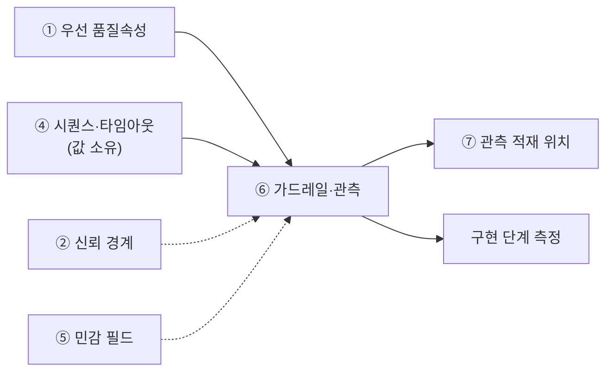

# 설계서 ⑥ 가드레일·관측 설계 — 작성 가이드

작성: 커넥니(도구 연동 엔지니어) · 2026-08-06 · 공통 규격 v1 적용

---

## 1. 이 설계서가 답하는 질문

**"이 시스템이 사고를 치기 전에, 어디서 어떻게 막는가."**

설계서 ④의 시퀀스 위에 제한 장치와 기록 지점을 겹쳐 그리는 문서임.  
새 단계를 만들지 않음. 있는 단계에 태그만 붙임.

**이걸 안 하면 나는 사고 3줄**

- 모델 호출이 루프를 돌아 한 달 예산을 며칠에 씀. 청구서를 봐야 앎
- 고객 이름·전화번호가 응답과 로그에 남음. 유출은 사후에 발견됨
- 품질이 나빠도 원인 단계를 못 찾음. 기록이 없으면 고칠 수 없음

실선은 필수 입력, 점선은 참고임.

---

## 2. 시작 전 판정

값부터 정하면 반드시 막힘. **위치를 먼저 정함.**

### 2-1. 가드레일은 세 지점에만 걸림

| 지점 | 무엇을 막나 | 대표 장치 |
|------|------------|----------|
| 입력측 | 외부 글이 지시로 둔갑함(프롬프트 주입) | 외부 입력은 데이터로만 취급 |
| 도구 호출측 | 권한 밖 실행 · 과금 폭주 | 최소 권한 · 호출 상한 · 사람 승인 |
| 출력측 | 민감정보·기밀이 밖으로 나감 | 반환 직전 노출 검사 |

### 2-2. 단계마다 던지는 5문

예/아니오로만 답함. 1번에서 막히면 뒤가 다 막힘.

| # | 질문 | 예 | 아니오 |
|---|------|----|--------|
| 1 | ④의 단계 목록이 확정됐나 | 3절로 감 | ④부터 끝냄 |
| 2 | 이 단계가 외부 글을 읽나 | 입력측 태그 | 건너뜀 |
| 3 | 쓰기·발송·과금을 하나 | 승인 지점 후보 | 건너뜀 |
| 4 | 민감 필드를 만지나 | 마스킹 태그 | 건너뜀 |
| 5 | 모델을 부르나 | 비용·타임아웃 태그 | `해당 없음` |

### 2-3. 승인 지점은 기본 거부부터

"위험해 보이는 곳"에 감으로 붙이지 않음. 순서가 있음.

1. ⑤ 커넥터 표에서 **쓰기·발송·과금** 행을 전부 뽑음
2. 뽑힌 행을 **일단 전부 승인 필요**로 둠(기본 거부)
3. 되돌릴 수 있는 것만 근거를 적고 자동 실행으로 내림

되돌릴 수 있음의 기준 — 취소 수단이 있고 5분 안에 원상복구됨.

---

## 3. 칸별 작성법

| 칸 | 어디서 가져오나 | 좋은 예 | 나쁜 예 |
|----|----------------|--------|--------|
| 비용 상한 | BM 비용 표 + ④ 호출 횟수 | `33.3%(Σ3단계=100원/건)` | `적정 수준 유지` |
| 타임아웃 | **④ 표에서 인용만** | `30초(④ 타임아웃 표 S-3 행)` | `30초(권장값)` |
| 마스킹 | ⑤ 민감 필드 + ② 신뢰 경계 | `고객 전화 뒤 4자리 치환` | `개인정보 보호함` |
| 관측 기록 지점 | US 실패 사유 + BM 측정 방법 | `요청ID·지연·토큰·실패사유` | `로그 남김` |
| 품질 측정 대상 | ①의 우선 품질 3개 | `정합성 오류율 10% 이하 / 20문항` | `정확도 높게` |
| 출력측 검사 | 민감정보 목록의 검사 방식 3종 | `패턴 · 전화번호 정규식` | `이상하면 거름` |
| 차단 규칙 | US 차단형 검증 + PR 승인 지점 | `규제 위반 → 즉시 중단·법무 통보` | `문제 시 중단` |
| 근거 출처 | `{약칭}:{항목ID}#{하위}` | `US:NFR-SYS-020#마스킹` | 공란 |

`검사 방식`은 `패턴`·`필드 지정`·`라벨 목록` 3종만 씀. 정규식은 `패턴` 행에만 적음.

**타임아웃이 안 맞아 보여도 ⑥을 고치지 않음.**  
④에 `변경요청` 1행을 남기고 ⑥은 인용 그대로 둠(G-4 판정).  
두 곳에서 고치면 어느 쪽이 진짜인지 모르게 됨.

---

## 4. 프롬프트에 없지만 반드시 채울 것

### 4-1. 관측 기록도 마스킹 대상 표의 행임

출력 직전 1회만 가리면 **로그·트레이스·오류 메시지에 원문이 남음.**  
마스킹 표에 아래 3행을 반드시 추가함.

| 추가할 행 | 왜 필요한가 |
|----------|------------|
| 관측 기록의 입력 요약 | 프롬프트 원문이 그대로 적재됨 |
| 오류 메시지·스택 | 실패한 입력값이 통째로 실림 |
| 감사 로그의 변경 전후 값 | 원본과 수정본이 둘 다 남음 |

### 4-2. 근거 없는 점검 칸은 비워 둠

금융 점검표의 `최소수집`·`비식별` 2건은 금융위 가이드라인에 **근거가 없음**.  
개인정보보호법 등 다른 법령 근거를 찾아 적고, 못 찾으면 `[확인필요]`로 남김.  
근거 없이 채우면 규제 문서를 잘못 인용한 것이 됨.

### 4-3. 실패 대응은 ④가 소유함

재시도·폴백·중단 조건은 ④에서 정함(G-5 판정).  
⑥은 그 결과를 **관측 항목으로 검증만** 함.  
⑥에 적을 것은 "재시도 3회"가 아니라 "재시도 횟수를 기록 항목에 넣음"임.

### 4-4. 관측 이름은 아직 표준 후보임

OTel GenAI 이름 규칙은 `Development` 단계임. 확정 표준이 아님.  
쓰되 문서에 `표준 후보 · 조회일 기준` 1줄을 병기함.

### 4-5. 미검증 설계 표기

호출·측정을 안 했으면 머리에 `미검증 설계`라고 적음.

---

## 5. 예시

### 5-1. KT 개통 자동화 — 한 줄기 완주

> 아래 인용은 강사가 가진 기획 자료임. **열 수 없어도 됨.**
> 볼 것은 값이 아니라 **판단 경로**임.

원부 정합성 검증 실패 1건을 처음부터 끝까지 따라감.  
출처는 `~/workspace/oss/docs/plan/`임. 정답이 아니라 판단 예시임.

**대상 줄기**

`정합성검증실패 → 오류 유형 분류 → Type B 선행 보정 → 자동 재개`  
(출처: `think/es/08-검증실패-오류-복구플로우.puml`)

모델을 부르는 단계는 3개임 — S-1 오류 분류, S-2 보정 항목 안내, S-3 재검증 요약.

**비용 상한 완주**

`C-1 ~ C-7`은 **큰 예산 하나를 요청 1건당 금액으로 쪼개는 7단계 절차**임.
단계 이름은 아래로 고정임.

| 단계 | 무엇을 하나 |
|------|-----------|
| C-1 | 원값 `B`(총예산)와 전제 `N`(총 건수)을 기획 자료에서 가져옴 |
| C-2 | 단위를 맞춤(연 → 월 등) |
| C-3 | 요청 1건당으로 나눔 |
| C-4 | **실패·재시도 배수를 반영함**(성공 경로만 계산하면 예산이 뚫림) |
| C-5 | 예비율 `R`만큼 여유를 둠 |
| C-6 | 시퀀스 단계별로 배분함 |
| C-7 | 합계가 100%인지 검증함 |

이 줄기에 넣어 보면 이렇게 됨.

| 단계 | 계산 | 값 | 출처 |
|------|------|----|------|
| C-1 | 원값 `B` · 전제 `N` | 2억 원/년 · 200만 건/년 | `BM:7절#운영 비용` · `BM:6절#재작업 비용 절감` |
| C-2 | 연 → 월 | B=1,667만 원 · N=16.7만 건 | 계산 |
| C-3 | `B_월 ÷ N_월` | **약 100원/건** | 계산 |
| C-4 | 재시도 배수 | **최대 15배**(소비자 5회 × DLQ 3회) | 5-4 참조 |
| C-5 | `C_req ÷ (1+R)` | `[확인필요: 예비율 R]` | 기획 자료에 없음 |
| C-6 | `n_i ÷ Σn`, Σn=3 | S-1·S-2·S-3 각 33.3% | puml 3단계 |
| C-7 | Σ 비율 | 100% — 통과 | 계산 |

**C-4를 빼면 예산이 뚫림.** 100원/건으로 잡아도 최악에는 15배가 나감.
R은 기획 자료에 없는 설계 파라미터임. 지어내지 않고 `[확인필요]`로 남김.

**같은 줄기의 태그·기록**

| 항목 | 값 | 출처 |
|------|----|------|
| 타임아웃 | 이벤트 전달 30초(P99(가장 느린 1%를 뺀 값)) | `US:NFR-SYS-060` · ④ 인용 |
| 마스킹 | 고객 이름·전화·주소 | `US:NFR-SYS-020#마스킹` |
| 관측 기록 | 요청ID · 오류유형 · 재시도 횟수 · 지연 | puml 공통 정책 · `US:NFR-SYS-070` |
| 경보 임계치 | 오류율 5% 초과 | `US:NFR-SYS-070#알림 임계치` |
| 품질 목표 | 정합성 오류율 10% 이하(Y1) | `BM:8절#고객 가치 2` |
| 승인 필요 | Type D 규제 위반 → 즉시 중단·법무 통보 | puml Type D |
| 로그 보존 | 감사 로그 5년 · 변조 방지 저장 | `US:NFR-SYS-050` |

**같은 낱말 `재시도`, 다른 계층**

충돌이 아니라 걸리는 자리가 다름.  
소비자 재처리 **5회** → DLQ(처리 못 한 건을 따로 모아 두는 대기열) 적재(US 679행) → DLQ에서 **3회** 백오프(puml 109 ~ 110행).  
이어 붙으면 한 건이 **최악 15회** 처리됨. 두 가지가 따라옴.

- 재시도 횟수를 `consumer_retry_count`·`dlq_retry_count`로 나눠 적음.  
  한 칸에 합치면 어느 계층이 터졌는지 못 찾음
- 5-2 비용 상한에 이 배수를 반영함. 성공 경로만 더하면 예산이 뚫림

④ 가이드 `재시도 포함 최악값 합계`와 같은 사례임.

---

### 5-2. 마이데이터 금융상품 추천

근거는 [_shared/마이데이터-케이스.md](_shared/마이데이터-케이스.md)임.
기획 산출물이 없어 수치가 `추정`임. 실제 과제에서는 `[확인필요]`로 되물음.

**"익명으로 들어오는데 왜 출력을 검사하나"**

마이데이터는 익명으로 유입됨(`케이스:R-1`). 그런데 커리큘럼은 출력 측 계좌번호 패턴 검사를
요구함(`KT:7-3#출력측유출검사`). 모순처럼 보이나 아님.
**입력이 익명이어도 남의 정보가 출력에 실릴 경로가 따로 있음.**

| 유입 경로 | 무엇이 들어오나 | 입력 마스킹으로 막히나 |
|----------|---------------|---------------------|
| 마이데이터 | 익명 자산 정보 | 익명이라 대상 없음 |
| **과거 제안서**(`케이스:3-2` V-1) | **타 고객 자산 구성·금액** | **못 막음** — 근거 문서로 읽음 |
| 모델 생성 | 계좌번호 형식 문자열 | 못 막음 — 입력에 없던 값임 |

과거 제안서를 근거로 쓰면(`케이스:3-2`) 남의 정보가 출력 경로로 들어옴.
자산 구성이 특이하면 익명이어도 재식별됨. **입력 쪽만 가리면 이 둘을 놓침.**
2절 3지점 중 **출력측이 여기서 유일한 방어선**임.

**적합성 차단이 실적을 이겨야 함**

과거 선택 결과를 근거로 쓰면 쏠림이 생김(`케이스:3-2` V-2).
많이 팔린 상품이 계속 올라오고, 그중 사회초년생 부적합 상품이 섞일 수 있음.

| 충돌 | 어느 쪽이 이기나 |
|------|----------------|
| 선택 실적이 높은 상품 · 세그먼트 부적합 판정 | **부적합 차단이 이김**(`KT:7-3#적합성`) |

이 우선순위를 표에 **명시해야 함.** 안 적으면 구현에서 점수 합산이 되어
실적이 높으면 통과함. 차단은 점수가 아니라 **거름망**임.

**비용 상한이 3배가 됨**

`케이스:R-2`로 제안서 3건이 병렬 생성됨. 5-1의 `약 100원/건`을 그대로 쓰면 실제는 3배임.
C-3 산정에서 `요청 1건 = 제안서 3건`을 전제로 적어야 함.

**관측 기록에 추가로 남길 것**

| 기록 항목 | 왜 |
|----------|-----|
| 근거로 쓴 과거 제안서 ID | V-1 유출 시 출처 추적 |
| 적합성 차단으로 제외한 상품 수 | V-2 쏠림 감시. 0이 계속되면 규칙이 안 도는 것임 |
| 제안서 3건 각각의 생성 비용 | 3배 배수가 맞는지 확인 |

## 6. 자주 틀리는 5가지

| # | 양상 | 원인 | 대책 |
|---|------|------|------|
| 1 | 마스킹을 출력 직전 1회만 검 | 화면만 떠올림 | 관측 기록·오류 로그를 마스킹 표 행으로 넣음(4-1) |
| 2 | 승인 지점을 감으로 붙임 | 느낌으로 판단함 | ⑤ 쓰기·발송·과금 행을 전부 뽑아 기본 거부부터 시작 |
| 3 | 타임아웃을 ⑥에서 새로 적음 | ④를 다시 열기 번거로움 | 인용만 함. 안 맞으면 ④에 `변경요청` 1행 |
| 4 | 비용 상한 칸이 통째로 빔 | 환산 중간에 멈춤 | C-3까지 채우고 나머지는 `[확인필요]` |
| 5 | 외부 문서 내용을 지시로 실행함 | 검색 결과를 그대로 이음 | 외부에서 온 글은 데이터로만 취급한다고 명시 |

---

## 7. 제출 전 자가 점검표

- [ ] 오버레이 단계 수가 ④의 단계 수와 **같은 숫자**임
- [ ] 3종 태그(비용·타임아웃·마스킹) 열에 공란인 행이 **0건**임
- [ ] 타임아웃 칸이 전부 `④ 타임아웃 표 S-n 행` 형식임
- [ ] 마스킹 표에 관측 기록·오류 로그 행이 **있음**
- [ ] 쓰기·발송·과금 도구가 전부 승인 또는 제한 장치를 **가짐**
- [ ] 품질 측정 문항 수가 **숫자**로 적혀 있음
- [ ] 출력측 검사 행의 `검사 방식`이 3종 중 1개이고 패턴 행에 정규식이 있음
- [ ] 근거 없는 행에 `설계판단` 표기와 각주 1줄이 있음
- [ ] `[확인필요]` 태그가 전부 미확정 항목 표에 **1행씩** 있음
- [ ] 호출·측정을 안 했으면 `미검증 설계`라고 적혀 있음

---

## 8. 다음으로 넘기는 값과 근거 자료

| 넘기는 값 | 받는 곳 | 없으면 |
|----------|--------|--------|
| 관측 기록 적재 위치 | ⑦ 저장소 배치 표 | 시작은 가능 |
| 기록 항목·품질 문항 | 구현 단계 측정 | 원인 추적 불가 |
| ④ 변경요청 1행 | ④ 재실행 | 값이 두 개로 남음 |

| 아티클 | 거는 칸 |
|--------|--------|
| [A06](../references/articles/A06_std_owasp-agentic-top10.md) §7 | 가드레일 표 `위협` 열 고정 선택지(ASI01 ~ ASI10) |
| [A06](../references/articles/A06_std_owasp-agentic-top10.md) §4 Q6 | 쓰기·발송 행의 `승인 필요` 칸 근거 |
| [A07](../references/articles/A07_spec_otel-genai-semconv.md) §4 Q6·Q7 | 관측 기록 지점 스팬 이름. `Development`(표준 후보) 병기 필수 |
| [A07](../references/articles/A07_spec_otel-genai-semconv.md) §4 Q8 | 토큰 사용량 · 오류 기록 칸 |
| [A10](../references/articles/A10_reg_fsc-ai-guideline.md) §4 Q3 | 가드레일 강도를 `필수`/`권고`로 2분 |
| [A10](../references/articles/A10_reg_fsc-ai-guideline.md) §5 | 출력측 검사 칸. `최소수집`·`비식별`은 근거 없음 → `[확인필요]` |
