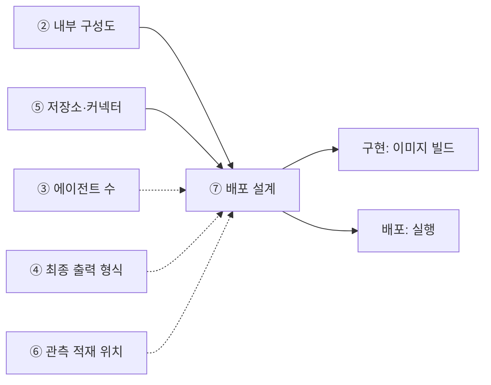

# 설계서 ⑦ 배포 설계 — 작성 가이드

작성: 커넥니(도구 연동 엔지니어) · 2026-08-06 · 공통 규격 v1 적용

---

## 1. 이 설계서가 답하는 질문

**"이 시스템을 몇 덩어리로 포장해서, 어디에 올리고, 열쇠는 어떻게 넣는가."**

배포 단위 · 포트 · 비밀값 주입 · 저장소 배치 4가지를 확정하는 문서임.  
②·⑤만 있으면 시작할 수 있음. ④·⑥을 기다리지 않음.

**이걸 안 하면 나는 사고 3줄**

- 배포 당일 오전이 "컨테이너를 몇 개로 나눌까" 논쟁으로 통째로 사라짐
- API 키가 코드나 설정 파일에 박혀 저장소에 올라감. 되돌려도 이력에 남음
- 로그와 데이터가 재시작하면 사라짐. 사고 원인을 볼 기록 자체가 없음

실선은 없으면 못 채우는 입력, 점선은 참고임.

---

## 2. 시작 전 판정

### 2-1. 나눌까 합칠까 — 4문

예/아니오로 답함. 기본은 1덩어리임.
**Q1 ~ Q3 중 하나라도 "예"면 나눔 후보임. 단 Q4가 "아니오"면 무조건 합침**(Q4가 거부권).

| # | 질문 | 예 = 나눔 근거 |
|---|------|---------------|
| 1 | 두 부분의 배포 형태가 다른가 | 앱 스토어 · 정적 호스팅은 따로 감 |
| 2 | 늘리고 줄이는 기준이 다른가 | 한쪽만 부하가 튀면 따로 감 |
| 3 | 접근 권한 등급이 다른가 | 민감 데이터를 만지는 쪽은 따로 감 |
| 4 | 나눠도 응답시간 목표를 지키나 | **아니오면 무조건 합침** |

3일 과정에서는 1 ~ 2덩어리가 현실적임. 3개를 넘기면 배포 당일에 못 끝냄.

### 2-2. 저장소는 안인가 밖인가

| 질문 | 예 | 아니오 |
|------|----|--------|
| 재시작해도 남아야 하나 | 런타임 **밖** | 안에 둬도 됨 |
| 여러 덩어리가 같이 쓰나 | 런타임 **밖** | 안에 둬도 됨 |
| 법정 보존 기간이 있나 | 런타임 **밖** · 변조 방지 | 안에 둬도 됨 |
| 국내 보관 제한이 있나 | 지역 고정 명시 | 제한 없음 |

`밖`이 하나라도 걸리면 밖임. 헷갈리면 밖에 둠.

### 2-3. 비밀값은 무엇이 있는지부터 셈

**기술 스택 6행**에서 기계적으로 뽑음. 생각으로 만들지 않음.
기술 스택 표는 ②의 부속 표임. 6행은 아래로 고정임.

| 스택 행 | 나오는 비밀값 |
|---------|--------------|
| 모델 벤더 | 모델 API 키 |
| 정형 접근 | 관계형 저장소 접속정보 |
| 비정형 접근 | 색인·그래프 저장소 접속정보 |
| 도구 연결 규격 | 커넥터 접속정보 |
| 오케스트레이션·패키징 | 런타임·이미지 저장소 접근 정보 |
| 관측·기록 | 기록 수집기 전송 키(없으면 `해당 없음`) |

---

## 3. 칸별 작성법

| 칸 | 어디서 가져오나 | 좋은 예 | 나쁜 예 |
|----|----------------|--------|--------|
| 패키징 단위 수 | ② 내부 구성도 | `2개(API 1 · 프론트 1)` | `필요한 만큼` |
| 포함 구성요소 | ② 요소와 1:1 대응 | `그래프·검색·API 서버` | `전부` |
| 배포 형태 | 3종 중 1개 — 런타임 이미지 · 정적 호스팅 · 관리형 함수 | `런타임 이미지` | `클라우드` |
| 런타임 규모 상한 | US 확장성 NFR | `최소 2 · 최대 10` | `충분히 늘림` |
| 분할 근거 | 2-1의 4문 답 | `한 요청이 검색·생성 연속 호출` | `일반적 구성` |
| 내부 포트 | 앱 설정 | `8080` | 공란 |
| 노출 포트 | 서비스 설정 | `80` | 공란 |
| 비밀값 주입 경로 | 플랫폼 비밀 객체 | `비밀 객체 → 환경변수` | `설정 파일에 기재` |
| 저장소 배치 | ⑤ 저장소 목록 | `런타임 밖 · 국내 지역 고정` | `클라우드 어딘가` |
| 근거 출처 | `{약칭}:{항목ID}#{하위}` | `US:NFR-SYS-080#국내 저장` | 공란 |

비밀값의 **실제 값은 어디에도 적지 않음.** 항목명·사용 단위·경로만 적음.

---

## 4. 프롬프트에 없지만 반드시 채울 것

### 4-1. 비밀값 위반 예시 3종

"평문 금지"만 적혀 있고 무엇이 위반인지 안 보임. 아래 3개가 실제 사고임.

| # | 위반 형태 | 왜 위험한가 | 대신 |
|---|----------|------------|------|
| 1 | 이미지 레이어에 구움 | 이미지를 받은 누구나 꺼낼 수 있음 | 실행 시 주입 |
| 2 | 배포 설정 파일에 평문 | 저장소 이력에 영구히 남음 | 비밀 객체 참조 |
| 3 | 로그·오류 메시지에 출력 | 로그 열람 권한 = 키 열람 권한 | 값을 가려 기록 |

3번이 가장 자주 나옴. 접속 실패 로그에 접속 문자열이 통째로 찍힘.

### 4-2. 세션 핸들 보관 위치 1행

MCP가 무상태로 바뀌면서 세션이 없어졌음.  
호출 사이에 상태가 필요하면 서버가 준 **핸들을 도구 인자로 주고받음**.  
핸들은 짧게 사는 값이지만 **어디에 두는지는 정해야 함.**  
저장소 배치 표에 `핸들 보관 위치` 1행을 반드시 추가함.

### 4-3. 되돌리기 계획 1줄

"어떻게 올리나"만 적고 "어떻게 되돌리나"를 안 적음.  
단위마다 직전 버전으로 돌아가는 방법 1줄을 적음.  
못 돌아가는 단위(데이터 구조 변경 등)는 그렇게 적음.

### 4-4. 미검증 설계 표기

실제 배포를 안 했으면 머리에 `미검증 설계`라고 적음.

---

## 5. 예시

### 5-1. KT 개통 자동화 — 한 줄기 완주

> 아래 인용은 강사가 가진 기획 자료임. **열 수 없어도 됨.**
> 볼 것은 값이 아니라 **판단 경로**임.

⑥에서 따라간 오류 복구 줄기를 그대로 배포까지 이음.  
출처는 `~/workspace/oss/docs/plan/`임. 정답이 아니라 판단 예시임.

**대상 줄기**

`오류 분류 엔진 → 오류 이력 저장소 → DLQ → 알림`  
(출처: `think/es/08-검증실패-오류-복구플로우.puml`)

**나눌까 합칠까**

| 질문 | 답 | 근거 |
|------|----|------|
| 배포 형태가 다른가 | 아니오 | 둘 다 런타임 이미지 |
| 확장 기준이 다른가 | 아니오 | 같은 요청 흐름에서 연속 호출 |
| 권한 등급이 다른가 | 아니오 | 둘 다 개통 데이터를 만짐 |
| 나눠도 목표를 지키나 | — | 이벤트 전달 30초(`US:NFR-SYS-060`) |

판정 — **1덩어리로 합침.** 버린 대안은 오류 분류를 별도 서비스로 떼는 안임.  
뗄 만큼 부하 특성이 다르지 않고 3일 안에 배포 대상만 늘어남.

**이 줄기의 표 4종**

| 항목 | 값 | 출처 |
|------|----|------|
| 런타임 규모 상한 | 최소 2 · 최대 10 파드(런타임에서 도는 실행 단위 1개) | `US:NFR-SYS-040` |
| 내부 포트 | 8080 · `/health` 필수 | `US:NFR-SYS-030#헬스체크` |
| 비밀값 K-1 | 오류 이력 DB 접속정보 → 비밀 객체 → 환경변수 | `US:NFR-SYS-020#JWT·RBAC` |
| 저장소 S-1 | 오류 이력 저장소 · 런타임 밖 · 국내 지역 | `US:NFR-SYS-080#국내 저장소` |
| 저장소 S-2 | 감사 로그 · 런타임 밖 · 변조 방지 · 5년 | `US:NFR-SYS-050` |
| 저장소 S-3 | DLQ · 런타임 밖 | puml DLQ 정책 |
| 저장소 S-4 | 관측 기록 적재 위치 | ⑥에서 받음 |
| 저장소 S-5 | 세션 핸들 보관 위치 | `[확인필요: 보관 수단]` |

**범위 밖으로 밀어낸 것**

교육 과정은 배포 자동화를 범위에서 뺐음.  
`US:NFR-SYS-040`의 자동 확장 항목은 표 본문에 쓰지 않음.  
말미 대조 기록에 `유형=범위외`로 1행만 남김.  
같은 요구 안의 최소·최대 파드 수는 정상 반영하고 `부분반영`을 붙임.

---

### 5-2. 마이데이터 금융상품 추천

근거는 [_shared/마이데이터-케이스.md](_shared/마이데이터-케이스.md)임.
기획 산출물이 없어 구성이 `추정`이며, 실제 과제에서는 `[확인필요]`로 되물어야 함.

**저장소가 한 종류 더 늘어남**

개통 자동화는 관계형 저장소 위주였음. 여기는 GraphRAG를 쓰므로(`케이스:3-2`)
**그래프 저장소가 추가**됨. 커리큘럼 8-1절이 `Neo4j 사전 구축 dump와 복원 스크립트`를
강사 제작물로 두고 있으므로, 배포 설계는 **dump를 어떻게 복원해 올리느냐**가 됨.

| ID | 저장소 | 배치 위치 | 초기 적재 | 근거 |
|----|--------|----------|----------|------|
| S-1 | 정형(마이데이터 테이블) | 클러스터 내부 | 합성 데이터 적재 | 커리큘럼 4절 |
| S-2 | 벡터 색인(상품설명서·약관) | 클러스터 내부 | 색인 생성 | 커리큘럼 8-1절 |
| S-3 | **그래프(Neo4j)** | 클러스터 내부 | **사전 구축 dump 복원** | 커리큘럼 8-1절 |
| S-4 | 과거 제안서 원문(`추정`) | 클러스터 내부 | `[확인필요: 적재 방식]` | `케이스:3-2` |

**S-3이 배포 순서를 바꿈.** dump 복원은 애플리케이션 기동보다 **먼저** 끝나야 함.
복원이 몇 분 걸리면 그 사이 앱이 떠서 빈 그래프를 조회함.
기동 순서 의존을 배포 설계에 적어 두지 않으면 배포 당일에 발견하게 됨.

**병렬 3건이 배포 단위 판단에 걸림**

`케이스:R-2`로 같은 입력에 제안서 3건이 병렬 생성됨.
2절 `나눌까 합칠까` 판정을 다시 돌리면 답이 달라질 수 있음.

| 질문 | 개통 자동화 | 마이데이터 |
|------|-----------|-----------|
| 부하가 다른 부분이 있는가 | 단계별로 고름 | **제안서 생성만 3배** |
| 따로 늘릴 필요가 있는가 | 아니오 | **예 — 생성 단위만** |
| 그래서 | 단일 이미지 가능 | **생성 단위 분리 검토** |

다만 3일 편성에서는 최소 완주가 우선임. **분리 근거를 적어 두되 실제 분리는 선택**으로 둠.
근거 없이 나누면 이미지 수만 늘고 배포 시간이 길어짐.

**익명 데이터라 저장소 제약이 오히려 단순해짐**

개통 자동화는 고객 회선정보가 저장소에 남아 암호화·접근통제 판단이 필요했음.
여기는 익명으로 유입되므로(`케이스:R-1`) 그 부담이 줄어듦.
**단 S-4(과거 제안서)는 예외임.** 타 고객 제안서 원문이 들어 있어 접근 주체를 좁혀야 함
(`케이스:3-2` V-1). 저장소 배치 표에서 S-4만 접근 제한을 따로 적음.

## 6. 자주 틀리는 5가지

| # | 양상 | 원인 | 대책 |
|---|------|------|------|
| 1 | 키를 설정 파일에 넣고 커밋함 | 급해서 일단 동작시킴 | 4-1의 3종을 리뷰 항목으로 고정 |
| 2 | 접속 실패 로그에 키가 찍힘 | 오류 객체를 통째로 출력함 | 로그 출력 전 값을 가림 |
| 3 | 저장소를 런타임 안에 둠 | 로컬에서 잘 돌아감 | 2-2의 4문을 전부 통과시킴 |
| 4 | ⑤의 저장소 일부가 표에서 빠짐 | 눈으로 대조함 | 대응·미대응 건수를 숫자로 적음 |
| 5 | 배포 단위를 3개 넘게 나눔 | 깔끔해 보임 | 2-1에서 아니오가 하나면 합침 |

---

## 7. 제출 전 자가 점검표

- [ ] 패키징 단위 수가 **숫자**로 적혀 있음
- [ ] ② 구성요소와 배포 단위가 1:1로 붙고 미대응이 **0건**임
- [ ] 단위마다 내부 포트·노출 포트 **2칸**이 다 차 있음
- [ ] 비밀값 항목이 스택 6행에서 나왔고 주입 경로가 **공란 0건**임
- [ ] 비밀값 **실제 값이 문서에 없음**
- [ ] ⑤의 저장소가 **전부** 배치 표에 있고 안·밖이 정해짐
- [ ] `핸들 보관 위치` 행이 **있음**
- [ ] 단위마다 되돌리기 방법 **1줄**이 있음
- [ ] 범위 밖 항목이 본문에 없고 대조 기록에만 **건수와 함께** 있음
- [ ] 배포를 안 했으면 `미검증 설계`라고 적혀 있음

---

## 8. 다음으로 넘기는 값과 근거 자료

| 넘기는 값 | 받는 곳 | 없으면 |
|----------|--------|--------|
| 배포 단위·포함 구성요소 | 구현: 이미지 빌드 | 빌드 대상이 안 정해짐 |
| 포트·비밀값 주입 경로 | 배포: 실행 | 실행이 뜨지 않음 |
| 저장소 배치·지역 제한 | 배포: 저장소 준비 | 규정 위반 가능 |
| 배포 실행 입력값 목록 | 배포 실행자 | 당일에 값을 찾아다님 |

| 아티클 | 거는 칸 |
|--------|--------|
| [A04](../references/articles/A04_spec_mcp-changelog-260728.md) §2 C1 | 저장소 배치 표의 `핸들 보관 위치` 1행 |
| [A04](../references/articles/A04_spec_mcp-changelog-260728.md) §4 Q5 | 커넥터 판본 고정 근거(폐기 창) |
| [A06](../references/articles/A06_std_owasp-agentic-top10.md) §7 ASI03 | 비밀값 주입 경로 · 단기 토큰 근거 |
| [A06](../references/articles/A06_std_owasp-agentic-top10.md) §7 ASI04 | 이미지 출처·의존성 고정 근거 |
| [A07](../references/articles/A07_spec_otel-genai-semconv.md) §5 | 관측 기록 적재 위치 행. `Development`(표준 후보) 병기 |
| [A10](../references/articles/A10_reg_fsc-ai-guideline.md) §4 Q3 | 긴급정지 수단의 배치 위치 근거 |
