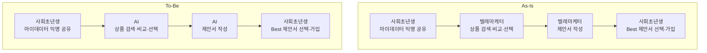
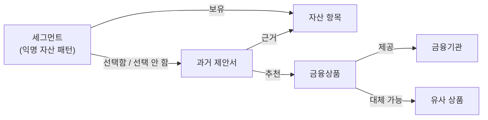

# 마이데이터 금융상품 추천 — 케이스 정의

가이드 7종의 `### 4-2.` 예시가 공유하는 케이스임. 2026-08-06 갑빠님 제공.

**출처 구분이 개통 자동화와 다름** — 개통 자동화는 기획 산출물 원문에서 값을 인용하지만,
본 케이스는 **기획 산출물이 아직 없음**. 아래 `확정`은 제공받은 사실이고 `추정`은 만들어 낸 값임.
가이드에서 인용할 때 **반드시 태그를 함께 적음**.

---

## 1. 확정 사실 (제공받음 — 지어내지 않음)

| 항목 | 내용 |
|------|------|
| 고객사 | **K은행** — 동양 최대 은행 |
| 사업 성격 | 사회초년생을 위한 **ESG 사업의 일환** |
| 과제 | 사회초년생 대상 마이데이터 기반 금융상품 포트폴리오 **추천 제안서** |
| 대상 사용자 | 사회초년생(제안서를 받는 쪽) · 텔레마케터(제안서를 내는 쪽) |

**미충족 아웃컴 3건**

| # | 아웃컴 |
|---|--------|
| O-1 | 사회초년생의 금융상품 **선택 시간** 최소화 |
| O-2 | 텔레마케터의 제안서 **작성 시간** 최소화 |
| O-3 | 텔레마케터의 제안서 **품질이 떨어질 확률** 최소화 |

**As-Is / To-Be**

**핵심 제약 2가지** — 설계에 직접 걸림

| # | 제약 | 설계에 미치는 영향 |
|---|------|------------------|
| R-1 | 마이데이터가 **익명으로** 공유됨 | 개인식별정보가 처음부터 들어오지 않음. 신뢰 경계와 마스킹 설계가 통상 금융과 다름 |
| R-2 | **최대 3명의 텔레마케터가 선착순**으로 제안서를 제공함 | To-Be에서도 유지됨. 같은 고객에 대해 **제안서 3건이 병렬 생성**됨. 사회초년생은 그중 Best를 고름 |

R-2가 특히 중요함. AI가 제안서를 만들어도 **텔레마케터 3명이 각자 내는 구조가 그대로 남음**.
"AI 1개가 최적안 1건을 낸다"로 잘못 읽으면 설계 전체가 어긋남.

---

## 2. 추정값 (만들어 낸 값 — `추정` 태그 필수)

기획 산출물이 없어 위 확정 사실에서 도출함. **실제 값이 아님.**
가이드에서 쓸 때 `추정` 태그를 붙이고, 실제 과제에서는 `[확인필요]`로 되물어야 함을 함께 적음.

| ID | 지표 | As-Is | To-Be 목표 | 도출 근거 |
|----|------|-------|-----------|----------|
| M-1 | 제안서 1건 작성 시간(텔레마케터) | 2 ~ 3시간 | 5분 이내 | O-2. 검색·비교·작성 3단계를 사람이 함 |
| M-2 | 사회초년생이 제안서를 받기까지 대기 | 1 ~ 3일 | 당일 | O-1. 선착순 배정 + 작성 대기 |
| M-3 | 제안서 간 상품 커버리지 편차 | 담당자별 차이 큼 | 편차 축소 | O-3. 담당자가 아는 상품만 넣음 |
| M-4 | 근거 표기율(어떤 자산 항목으로 이 상품을 권했는지) | 측정 안 됨 | 100% | KT 7-3절 `추천 근거 추적` |
| M-5 | 세그먼트 부적합 상품 포함률 | 측정 안 됨 | 0% | KT 7-3절 `적합성 — 사회초년생 부적합 상품 차단` |

M-4·M-5는 커리큘럼 7-3절 점검 항목에서 나온 것이라 **요구 자체는 확정**이고 목표 수치만 추정임.

---

## 3. 커리큘럼이 지정한 설계 반영 위치

KT 커리큘럼 7-3절 표임. **어느 설계서에 무엇이 들어갈지가 이미 지정되어 있음.**

| 점검 항목 | 들어갈 설계서 |
|-----------|--------------|
| 최소수집 — 담당자별 접근 가능 정보 항목 한정 | ④ 역할계약서 |
| 마스킹·비식별 지점 | ⑤ 지식/도구(민감 필드 분류표) |
| 동의 상태 확인 지점 | ③ 패턴/시퀀스 |
| 추천 근거 추적 — 어느 자산 항목으로 어떤 상품을 권했는지 끝까지 전파 | ③ 패턴/시퀀스 제안서 출력 형식 |
| 출력 측 유출 검사 — 계좌번호 등 패턴 검사 | ⑥ 가드레일/관측 |
| 적합성 — 사회초년생 세그먼트 부적합 상품 차단 | ⑥ 가드레일/관측 |
| 사람의 최종 판단 — 확정 권유가 아닌 `제안서`임을 명시 | ① 목표/품질 카드 |

② 논리아키텍처와 ⑦ 배포는 직접 대응이 없음. ② 논리아키텍처는 커리큘럼 산출물 표의 `개인신용정보가 외부로 나가는 경계선`,
⑦ 배포는 `Neo4j 사전 구축 dump`·`EKS 수동 배포`를 근거로 씀.

---

## 3-2. 비정형 데이터와 GraphRAG 시나리오 (`추정`)

커리큘럼 8-1절이 정한 비정형 자료는 **상품설명서·약관**뿐임(`확정`).
여기에 **과거 제안서와 그 선택 결과**를 비정형 자료로 더 두는 시나리오를 `추정`으로 둠.
GraphRAG가 벡터 검색보다 유리한 이유를 설명하기 위한 것임.

**비정형 자료 2종**

| 자료 | 출처 | 내용 |
|------|------|------|
| 상품설명서·약관 | `확정`(커리큘럼 8-1절) | 상품 조건·수수료·가입 자격. 파싱 난이도를 일부러 넣은 합성 문서 |
| **과거 제안서 + 선택 결과** | **`추정`** | 텔레마케터가 낸 제안서 원문과, 사회초년생이 그중 무엇을 골랐는지(가입·미가입) |

과거 제안서를 두는 근거는 `케이스:O-3`(제안서 품질이 떨어질 확률 최소화)임.
**선택된 제안서와 선택되지 않은 제안서가 함께 쌓임**(`케이스:R-2` 3명 선착순 구조의 부산물).
이것이 품질 판단의 재료가 됨.

**그래프 스키마(추정)**

**왜 벡터 검색으로는 부족한가**

| 질문 | 벡터 검색 | GraphRAG |
|------|----------|----------|
| "이 상품의 중도해지 수수료는?" | **가능** — 약관 한 대목만 찾으면 됨 | 과함 |
| "나와 비슷한 자산 구성인 사람이 실제로 **고른** 상품은?" | **불가** — 세그먼트 → 제안서 → 선택 → 상품 3홉을 따라가야 함 | 가능 |
| "이 상품을 추천할 때 **함께 제시된** 상품은?" | 불가 — 제안서 단위의 동시 등장 관계임 | 가능 |
| "선택되지 **않은** 제안서에 공통으로 빠진 자산 항목은?" | 불가 — 부정 관계 집계임 | 가능 |

커리큘럼 4-2절이 "마이데이터는 계좌·상품·기관 간 관계가 뚜렷하다"고 적은 것이 이 지점임.
개통 자동화에서는 그래프 구축 비용이 이득을 넘었지만, 여기서는 **관계를 따라가는 질문이 실제로 있음**.

**이 시나리오가 만드는 위험 2가지** — 설계에서 반드시 다뤄야 함

| # | 위험 | 어디서 다루나 |
|---|------|-------------|
| V-1 | **과거 제안서 내용이 새 제안서에 그대로 흘러나옴.** 익명이라도 자산 구성·금액이 특이하면 재식별 가능함 | ⑥ 가드레일/관측 출력 측 유출 검사(`KT:7-3#출력측유출검사`) · ⑤ 지식/도구 민감 필드 분류표 |
| V-2 | **과거에 많이 팔린 상품이 계속 추천됨.** 선택 결과를 근거로 쓰면 쏠림이 강화되고, 사회초년생에게 부적합한 상품도 실적이 있으면 올라옴 | ⑥ 가드레일/관측 적합성 차단(`KT:7-3#적합성`) · ① 목표/품질 카드의 품질속성 |

**V-1이 "익명인데 왜 출력을 검사하나"의 답임.** 입력이 익명이어도 **과거 문서를 근거로 쓰는 순간
남의 정보가 출력 경로로 들어옴**. 마스킹을 입력 쪽에만 걸면 막지 못함.

## 4. 기술 범위 (커리큘럼 4절)

| 구분 | 내용 |
|------|------|
| 정형 데이터 | 마이데이터 테이블 컬럼 기준 **합성 데이터**(품질 이슈 포함). 접근 경로는 NL2SQL |
| 비정형 데이터 | 상품설명서·약관 등 **합성 문서**(파싱 난이도 포함) |
| 검색 방식 비교 | Neo4j GraphRAG 대 벡터 RAG. 계좌·상품·기관 간 관계가 뚜렷해 비교에 적합함 |
| 멀티 LLM | 벤더 2종 이상, 작업 성격별로 나눠 씀 |
| 멀티 MCP | Mock 서버 포함 여러 도구 서버 조합 |
| 배포 | 컨테이너 + EKS 수동 배포 |
| 품질 측정 | RAGAS 4지표(Precision·Recall·Faithfulness·Relevance) |

---

## 5. 가이드에서 쓸 때의 규칙

- `확정` 사실은 출처를 `케이스:O-1` · `케이스:R-2` 형식으로 적음
- `추정` 값은 **반드시 `추정` 태그**를 붙임. 예: `5분 이내(추정)`
- 커리큘럼에서 온 요구는 `KT:7-3#추천근거추적` 형식으로 적음
- **개통 자동화 예시와 섞지 않음.** 4-1과 4-2를 나눠 쓰고, 두 도메인의 차이가 드러나면 1줄로 짚음
- 실제 과제 수행 시 추정값을 그대로 쓰지 말고 `[확인필요]`로 되물어야 함을 가이드에 밝힘

---

## 6. 두 도메인의 대비 (가이드에서 활용)

같은 설계서라도 도메인이 바뀌면 판단이 어떻게 달라지는지 보여주는 것이 4-2의 목적임.

| 축 | KT 개통 자동화 | 마이데이터 금융상품 추천 |
|----|---------------|----------------------|
| 사용자 | 내부 직원(운영자·현장) | **외부 고객**(사회초년생) + 내부(텔레마케터) |
| 민감정보 | 고객 회선정보가 그대로 흐름 | **익명화 후 유입**(R-1) — 경계 설계가 다름 |
| 산출물 | 시스템 처리 결과 | **사람이 고르는 제안서**(확정 실행 아님) |
| 병렬성 | 단계별 순차 + 일부 병렬 | **같은 입력에 3건 병렬 생성**(R-2) |
| 실패의 무게 | 개통 지연 | **부적합 상품 추천** — 규제·평판 위험 |
| 정량 근거 | 기획 산출물에 실측값 있음 | **없음** — 전부 추정 또는 `[확인필요]` |
