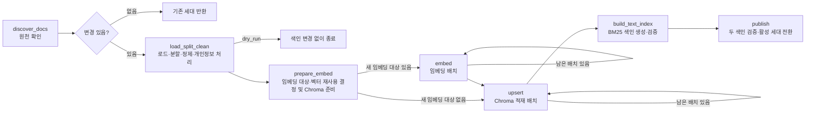

# 문서별 구분자로 만드는 Vector·BM25 인덱서

약관·혜택·상담에 서로 다른 구분자를 적용하되, 실제 분할은 하나의 공통 분할기로 처리합니다.
정제와 개인정보 처리는 **청킹 전에** 문서 단위로 끝내고, 정제된 글을 나눕니다.

**로드 → 정제(머리말·꼬리말 제거, 접힌 줄 복원, 표 Markdown 변환) → 개인정보 처리 → 분할 → 임베딩 → 적재**

PDF는 쪽마다 정제한 뒤 연결하고, 상담 파일은 상담 건마다 구조 필드 줄을 지우고 개인정보를 치환합니다.
이전 버전(`../vector-bm25-v2-backup`)은 원문을 그대로 나눈 뒤 청크마다 지웠습니다.

기본값은 임베딩 토크나이저 기준 **800토큰, 중첩 상한 200토큰**입니다.
약관은 조항, 혜택은 상품·혜택 코드, 상담은 발화자 표식을 우선 경계로 사용합니다.
길면 문장·줄바꿈·공백·문자 순서로 더 나눕니다. 설정은 `config/document_policies.json`에서 확인합니다.
중첩은 분할기와 경계에 따라 실제 길이가 달라집니다. 모든 청크가 정확히 200토큰씩 겹치지는 않습니다.

## 실행하기

Python 3.13으로 이 폴더에서 실행합니다. 기존 인덱서의 환경과 결과는 덮어쓰지 않습니다.
패키지는 모두 프로젝트 가상환경(`.venv`)에 설치합니다. 시스템 파이썬의 패키지는 섞어 쓰지 않습니다.

```powershell
uv venv .venv --python 3.13
uv pip install --python .venv/Scripts/python.exe -r requirements-torch-cpu.txt   # 1) PyTorch 판 선택(아래 표)
uv pip install --python .venv/Scripts/python.exe -r requirements-dev.txt         # 2) 나머지 패키지
.venv/Scripts/python.exe run_indexer.py --dry-run
.venv/Scripts/python.exe run_indexer.py --thread-id build-001
```

이번 검증과 같은 전체 패키지 버전이 필요하면 2)에서 `requirements-lock.txt`로 설치합니다.
lock 파일에는 pytest·mypy가 없으므로 시험이 필요하면 `uv pip install pytest mypy`를 추가로 실행합니다.

실행 중에는 노드가 끝날 때마다 표준 오류(화면)에 진행 상황을 한 줄씩 표시합니다.
결과 JSON은 표준 출력으로만 나가므로 `> result.json`으로 저장해도 진행 표시가 섞이지 않습니다.

```text
[노드 완료] load_split_clean       노드     6.08초 | 누적     6.10초
[노드 완료] embed #2               노드     0.08초 | 누적     7.75초
```

`노드`는 그 노드 한 번의 소요 시간이고 `누적`은 이번 실행 시작부터의 경과 시간입니다.
`embed`·`upsert`는 배치마다 반복되므로 두 번째부터 `#2`처럼 회차를 붙입니다.
중단 후 같은 thread ID로 재개하면 누적 시간은 재개한 시점부터 다시 셉니다.

### PyTorch 판 고르기(CPU·GPU·MPS)

PyTorch는 같은 2.14.0이라도 계산 장치별로 설치 파일이 다릅니다.
1)에서 장치에 맞는 파일을 **먼저** 설치합니다. `EMBED_DEVICE`의 기본값 `auto`는 설치한 판으로 쓸 수 있는
장치를 cuda → mps → cpu 순으로 자동 선택합니다. 특정 장치로 고정하려면 `.env`에 아래 표의 값을 적습니다.

| 장치 | 1)에서 설치할 파일 | `EMBED_DEVICE` | 설치 조건 |
|---|---|---|---|
| CPU | `requirements-torch-cpu.txt` | `cpu` | 없음 |
| NVIDIA GPU | `requirements-torch-cuda.txt` | `cuda` | Windows·Linux, NVIDIA 드라이버가 CUDA 12.6 이상 지원 |
| Apple 실리콘 GPU | `requirements-torch-mps.txt` | `mps` | macOS 14 이상 |

순서를 지켜야 하는 이유는 다음과 같습니다.

- `requirements.txt`는 `torch==2.14.0` 버전만 고정하고 판은 정하지 않습니다.
  2)만 실행하면 Windows에서는 기본 저장소(PyPI)의 **CPU 판**이 설치되어 GPU가 있어도 쓰지 못합니다.
- 1)에서 먼저 설치한 `2.14.0+cu126` 같은 판은 `torch==2.14.0` 조건을 만족하므로 2)에서 바뀌지 않습니다.

NVIDIA 드라이버가 지원하는 CUDA 버전은 `nvidia-smi` 출력 오른쪽 위의 `CUDA Version`에서 확인합니다.
13.0 이상이면 `requirements-torch-cuda.txt`의 주소 끝 `cu126`을 `cu130`으로 바꿔 사용할 수 있습니다.

설치 후 다음 명령으로 판과 장치 인식을 확인합니다.

```powershell
.venv/Scripts/python.exe -c "import torch; print(torch.__version__, torch.cuda.is_available(), torch.backends.mps.is_available())"
```

| 설치한 판 | 정상 출력 예 |
|---|---|
| CPU | `2.14.0+cpu False False` |
| NVIDIA GPU | `2.14.0+cu126 True False` |
| Apple 실리콘 GPU | `2.14.0 False True` |

이미 만든 가상환경의 판을 바꿀 때는 `.venv`를 지우고 위 순서대로 다시 설치하는 편이 가장 확실합니다.
CPU와 GPU는 같은 모델이라도 벡터 값이 소수점 아래에서 조금 다를 수 있습니다.
`auto`는 실행하는 PC에 따라 장치가 달라지므로, 결과를 재현해야 하는 환경에서는 장치를 직접 지정합니다.
장치를 바꾼 뒤에는 `--full-reindex`로 전체를 다시 만들어 한 세대 안에 서로 다른 장치의 벡터가 섞이지 않게 합니다.

기본 원문은 `../../docs`, 결과는 `data`입니다. 다른 위치는 `--input`, `--output`으로 지정합니다.
`--doc D3 --segment 2`처럼 일부 원천만 갱신할 수 있습니다. 미선택 원천의 청크는 보존합니다.
정책·모델·메타데이터 규칙을 바꾸면 일부 문서만 새 규칙을 적용하지 않도록 전체 실행을 요구합니다.

모델은 로컬에 저장된 `nlpai-lab/KURE-v2` revision
`3431f86d399d666083890dbb882aced6708873bc`를 사용합니다.
최초 다운로드가 필요한 환경에서는 `.env.example`을 `.env`로 복사하고
`HF_LOCAL_FILES_ONLY=false`로 한 번 실행합니다. 이후 `true`로 돌려 고정된 모델을 재사용할 수 있습니다.

### 모델 revision 확인과 변경

revision은 Hugging Face 모델 저장소의 **커밋 해시(40자리)**입니다.
`main` 같은 브랜치 이름은 새 커밋이 올라오면 다른 파일을 가리키므로, 같은 모델을 다시 쓰도록 해시로 고정합니다.
값은 `.env`의 `EMBED_REVISION`에서 읽고, 없으면 `app/infrastructure/settings.py`의 기본값을 사용합니다.

**확인 방법**

| 확인할 것 | 방법 |
|---|---|
| 지금 설정된 값 | `.env`의 `EMBED_REVISION`. 없으면 `settings.py`의 기본값 |
| 저장소에 있는 커밋 목록 | [모델 페이지](https://huggingface.co/nlpai-lab/KURE-v2) → **Files and versions → History** |
| 현재 `main`이 가리키는 커밋 | `curl https://huggingface.co/api/models/nlpai-lab/KURE-v2/commits/main`의 첫 항목 `id` |
| 로컬 캐시에 받아 둔 버전 | `~/.cache/huggingface/hub/models--nlpai-lab--KURE-v2/snapshots/` 아래 폴더 이름 |
| 게시된 인덱스를 만든 버전 | 세대 폴더 안 `search_indexes/generations/<세대>/manifest.json`의 `embedding_contract.revision` |

**변경 방법**

1. History에서 사용할 커밋의 전체 해시를 복사합니다. 7자리 줄임 해시는 인식하지 않습니다.
2. 새 revision을 로컬 캐시에 받습니다. `HF_LOCAL_FILES_ONLY=true`이면 캐시에 없는 모델을 받지 않고 중단하기 때문입니다.

   ```powershell
   hf download nlpai-lab/KURE-v2 --revision <새 커밋 해시>
   ```

3. `.env`의 `EMBED_REVISION`을 새 해시로 바꿉니다.
4. `--dry-run`으로 새 토크나이저 기준의 분할·길이 검증을 먼저 확인합니다.
5. 새 thread ID로 **전체 재색인**을 실행합니다.

   ```powershell
   .venv/Scripts/python.exe run_indexer.py --full-reindex --thread-id rev-<새 해시 앞 7자리>
   ```

revision이 바뀌면 벡터 재사용 조건(`embedding_contract`)이 달라져 모든 청크를 새 모델로 다시 임베딩합니다.
다만 `--doc`이나 `--segment`로 일부만 실행하면 선택하지 않은 문서는 다시 분할하지 않습니다.
그 청크는 이전 revision의 토크나이저로 나눈 경계를 그대로 유지합니다.
분할 기준을 새 모델에 맞추려면 revision을 바꾼 뒤 `--doc all` 상태로 전체 실행합니다.
새 세대가 게시되면 위 표의 manifest 값이 새 해시와 같은지 확인합니다.

## 토큰과 모델을 구분해 읽기

기존 저장 인덱스와 비교할 수 있도록 SentenceTransformer의 같은 단일 벡터 변환 방식을 유지합니다.
실제 출력은 **768차원**이며 정규화합니다. KURE-v2의 네이티브 다중 벡터 검색을 구현한 것은 아닙니다.
기존 실행 환경의 기본 입력 상한은 실측 **255토큰**이었습니다.
신규에서는 `max_seq_length=800`을 명시하여 800토큰 청크의 뒤쪽도 임베딩에 반영합니다.
모델 revision·변환 방식·입력 상한은 게시 manifest에 기록합니다.

분할 크기에는 특수토큰도 포함합니다. 토크나이저는 문자열을 붙였을 때 길이가 단순 합이 되지 않을 수 있어,
분할 결과의 실제 길이를 다시 확인하고 필요한 경우 공통 분할기의 길이 보정을 적용합니다.
정제를 분할 전에 끝내므로 분할기가 실제로 저장될 글의 길이로 청크를 자릅니다.
청크마다 다시 한도를 확인하고 초과하면 게시 전에 중단합니다.

### PDF 정제 규칙

| 규칙 | 방법 |
|---|---|
| 머리말·꼬리말 | 페이지 위·아래 7% 영역에서 2쪽 이상 반복되는 줄을 지움(숫자는 같은 글자로 보아 쪽번호 포함) |
| 접힌 줄 복원 | ① 줄이 본문 오른쪽 끝까지 찼는지 ② 같은 문서의 줄 안쪽 띄어쓰기 다수결 ③ Kiwi로 이음매 한 곳만 판정 |
| 선 있는 표 | PyMuPDF `find_tables`로 찾고, 셀 글자와 원문 글자가 같을 때만 Markdown 표로 바꿈 |
| D2 테두리 없는 표 | 같은 높이의 떨어진 조각을 칸으로 묶은 뒤 Markdown 표로 바꿈(`borderless_tables` 설정) |

표 행 경계(`| `로 시작하는 줄)는 문장 경계보다 먼저 자르는 구분자입니다.
표가 청크 경계에서 잘리면 뒤쪽 청크 앞에 그 표의 머리글 행과 구분선을 다시 붙입니다.
쪽·조항·카드 메타데이터는 정제된 글 기준 위치로 계산하며, 그 위치(글자 위치)는 저장하지 않습니다.
현재 PDF 로더는 텍스트 계층만 읽으며 OCR은 수행하지 않습니다.

## 대상 경계로 끊어 나누기와 색인용 머리말

혜택 안내서(D2)는 카드 하나당 설명이 짧습니다. 분할기가 800토큰을 채우려고 조각을 이어 붙이면
**한 청크에 카드 두 개의 설명이 섞입니다.** 그러면 그 청크의 카드 메타데이터도 앞쪽 카드 하나로 잘못 붙습니다.
또 청크 대부분이 "D2-C040-B03 | 온라인쇼핑 할인"처럼 코드만 담고 카드명을 담지 않아
"가게모음 프리미엄 혜택" 같은 질문이 그 카드를 못 찾았습니다.

그래서 두 가지를 넣었습니다. 둘 다 문서 정책 설정으로 켜고 끕니다.

### 1) 하드 경계 — 경계를 넘어 합치지 않음

`config/document_policies.json`의 문서별 `segment` 설정으로 경계를 정합니다.

| 키 | 뜻 |
|---|---|
| `boundary_regex` | 대상 구간이 시작하는 줄(첫 캡처가 대상 코드). D2는 코드만 있는 줄 `^D2-C\d{3}$` |
| `tail_regex` | 문서 끝 참고 목록이 시작하는 줄. 마지막 구간 안에서 찾고 앞의 빈 줄까지 거슬러 올라감 |
| `key_field` | 문맥 정보에서 대상 코드를 담은 키(`card_id`) |
| `value_fields` | 코드와 함께 구간 값으로 쓸 키(`card_name`) |
| `metadata_fields` | 구간 값으로 채울 메타데이터 키 → 값 이름 |
| `clear_keys` | 구간 값으로 덮기 전에 지울 메타데이터 키 |
| `ambiguity_keys` | 모두 비어 있으면 `context_ambiguous` 표시를 지움 |

정제된 본문을 경계에서 먼저 구간으로 끊고, **구간 안에서만** 기존 공통 분할기·구분자·크기·중첩을 적용합니다.
분할기 자체는 손대지 않았으므로 바뀌는 것은 "조각이 경계를 넘어 합쳐지지 않는다"는 점뿐입니다.

### 2) 대상 없음 구간

첫 경계 이전(표지·목차)과 문서 끝 참고 목록은 **어느 카드에도 속하지 않는 구간**입니다.
이 구간의 청크에는 `card_id`·`card_name`·`product_id`를 아예 붙이지 않습니다.
목차 청크에 첫 코드 카드가 붙던 오류가 이것으로 사라집니다.

### 3) 색인용 머리말 — 색인에만, 본문은 그대로

`index_header` 설정으로 문서 유형별 머리말을 정합니다. 현재 D2에만 두었고 D1·D3는 없습니다.

| 키 | 뜻 |
|---|---|
| `template` | 모든 필드가 본문에 없을 때 쓸 서식(`[카드: {card_name} ({card_id})]`) |
| `field_templates` | 한 필드만 본문에 없을 때 쓸 서식. **적힌 순서가 필드 순서**임 |
| `separator` | 머리말과 본문 사이에 넣을 문자열 |

본문에 이미 같은 값이 있으면 그 필드는 빼고, 둘 다 있으면 머리말 자체를 붙이지 않습니다.
공백·대소문자·전각 차이는 같은 값으로 봅니다.

**중요한 계약 — 머리말은 색인용 텍스트에만 들어갑니다.**

| 쓰임 | 쓰는 값 |
|---|---|
| 임베딩 입력 · BM25 토큰화 | 머리말 + 본문(`index_text`) |
| Chroma에 저장되는 document · 검색 결과 표시 · 인용 검증 | 원래 본문(`text`) |
| 벡터 재사용 지문(`text_hash`) · `chunk_id` | 머리말 + 본문 |

corpus 레코드는 머리말이 붙은 청크에만 `index_text` 필드를 더합니다.
이 필드가 없는 이전 세대는 `text`가 곧 색인용 텍스트이므로 검색기가 그대로 읽습니다.

### 4) 길이 예산

머리말이 붙을 구간은 **분할 전에** 머리말 몫의 토큰을 청크 크기에서 빼 둡니다.
그래서 머리말을 붙인 뒤에도 800토큰을 넘지 않습니다(현재 문서 묶음 최대 779).

### 적용 결과(현재 문서 묶음)

| 항목 | 적용 전 | 적용 후 |
|---|---|---|
| 전체 청크 | 195 | 218 |
| D2 청크 | 137 | 160 |
| 카드 코드가 2개 이상 섞인 D2 청크 | 66 | 12(표지·목차·참고 목록, `card_id` 없음) |
| 자기 카드명을 담은 D2 청크 | 37/137 (27%) | 148/160 (92%) |
| 800토큰 초과 | 0 | 0 |

## 카드명 별칭과 날짜 표기 통일

사람들은 카드를 정식명으로 부르지 않습니다. "한빛 모아생활 카드"를 "모아생활"이라고만 묻습니다.
또 문서는 `2026-02`로 적는데 질문은 "2026년 2월"로 씁니다. 두 경우 모두 글자가 달라 키워드 검색이 어긋납니다.
그래서 **색인과 검색이 똑같이 쓰는 별칭 사전과 날짜 표기 규칙**을 토크나이저에 넣었습니다.

### 별칭 만드는 규칙

`config/card_alias_rules.json`에서 규칙을 바꿉니다.

| 키 | 뜻 | 기본값 |
|---|---|---|
| `brand_prefixes` | 카드명 앞에서 떼어 낼 브랜드 낱말 | `["한빛"]` |
| `suffixes` | 사람들이 뒤에 덧붙여 부르는 낱말 | `["카드"]` |
| `min_length` | 별칭의 최소 글자 수(공백 제외) | `3` |

정식명 `한빛 모아생활`의 정식 토큰은 공백을 뺀 `한빛모아생활`입니다. 여기서 별칭 세 가지를 만듭니다.

| 별칭 | 만든 규칙 |
|---|---|
| `모아생활` | 접두어 제거 |
| `모아생활카드` | 접두어 제거 + 접미어 |
| `한빛모아생활카드` | 전체 + 접미어 |

띄어 쓴 "모아생활 카드"는 토큰이 `모아생활`과 `카드`로 나뉘므로 따로 별칭을 두지 않습니다.

### 띄어 쓴 이름도 제 카드를 가리키게 하기

정식명이 여러 낱말인 카드(`한빛 가게모음 프리미엄`)는 접두어를 뗀 뒤에도 띄어쓰기가 남습니다.
사람들은 "가게모음 프리미엄 혜택"처럼 띄어 씁니다. 그런데 `가게모음`도 별칭이라서,
붙여 쓴 별칭만 등록하면 Kiwi가 짧은 쪽을 먼저 잡아 **기본 카드(`한빛가게모음`)로 잘못 치환**했습니다.

Kiwi는 사용자 단어를 **공백과 무관하게 한 항목으로** 봅니다(kiwipiepy 0.23.2 실측).
그래서 **띄어 쓴 표면형 하나만 등록하면 띄어 쓴 입력과 붙여 쓴 입력이 모두 같은 단어로 잡힙니다.**
접두어를 뗀 별칭만 원래 띄어쓰기를 살려 등록하고, 접미어가 붙은 형태는 붙여 쓴 모양만 둡니다.

| 입력 | 바뀌기 전 | 바뀐 뒤 |
|---|---|---|
| `가게모음 프리미엄 혜택` | `한빛가게모음` + `프리미엄` + `혜택` | `한빛가게모음프리미엄` + `혜택` |
| `가게모음 프리미엄 카드 혜택` | `한빛가게모음` + `프리미엄` + `카드` + `혜택` | `한빛가게모음프리미엄` + `카드` + `혜택` |
| `가게모음프리미엄 혜택` | `한빛가게모음프리미엄` + `혜택` | 그대로 |
| `가게모음 혜택` | `한빛가게모음` + `혜택` | 그대로 |
| `한빛 가게모음 카드의 혜택` | `한빛가게모음` + `카드` + `혜택` | 그대로 |

같은 별칭 키에 띄어쓰기만 다른 두 표면형을 함께 넣으면 Kiwi가 한 항목으로 보기 때문에 오류로 막습니다.
현재 문서 묶음의 카드 64건에서는 띄어 쓴 표면형이 13건 나옵니다
(`가게모음 프리미엄`·`모아생활 플러스`·`통신할부 a` 등).

### 자동으로 빼는 별칭과 검수

아래에 걸리면 자동으로 빼고 세대 폴더의 `card_aliases_review.json`에 사유와 함께 남깁니다.

| 사유 코드 | 뜻 |
|---|---|
| `too_short` | `min_length`보다 짧아 아무 문서나 끌어옴 |
| `ambiguous` | 한 별칭이 카드 둘 이상을 가리켜 어느 쪽인지 고를 수 없음 |
| `common_noun` | 사용자 사전 없이 분석했을 때 사전에 실린 일반명사 한 개임(예: 대중교통·장보기·출퇴근) |
| `excluded_by_override` | 사람이 제외 목록에 넣음 |

`common_noun` 판정은 Kiwi가 모르는 말을 통째로 한 덩어리(NNG)로 묶는 경우와 구분하기 위해
토큰의 미등록어(oov) 표시를 함께 봅니다. 그래서 `해오름마을` 같은 카드 고유명은 빠지지 않습니다.

검수 결과 "이 별칭은 쓰고 싶다"면 `config/card_alias_overrides.json`에 적습니다. 다음 색인부터 반영됩니다.

```json
{
  "include": { "대중교통": "한빛 대중교통" },
  "exclude": ["장보기"]
}
```

- `include`: 자동 제외를 뚫고 넣을 별칭 → 정식 카드명(띄어 쓴 원래 이름). 목록에 없는 카드명을 적으면 색인이 멈춥니다.
  별칭을 띄어 써서 적으면 그 띄어쓰기 그대로 사전에 등록합니다.
- `exclude`: 자동으로 만들어져도 쓰지 않을 별칭

### 세대에 남는 산출물

| 파일 | 내용 |
|---|---|
| `card_names.dict` | 카드 정식명 사용자 사전(형식·manifest 6키 계약은 그대로 유지) |
| `card_aliases.tsv` | `별칭 표면형<탭>정식 토큰` 한 줄씩. 정렬·중복 제거된 UTF-8. 1열은 낱말 사이 공백을 가질 수 있음 |
| `card_aliases_review.json` | 채택·제외 목록과 제외 사유. 채택 항목은 `alias`(공백 뺀 키)·`surface`(등록 표면형)·`canonical`·`source_name`·`origin`을 가짐 |

`active_index.json`에 `card_aliases` 경로·`card_aliases_sha256`·`card_aliases_count`를,
manifest에 `card_aliases`(path·sha256·count·rules_sha256·overrides_sha256)를 기록하고 게시 전에 해시를 검증합니다.
별칭이 0개여도 같은 형식으로 기록합니다. 검색기는 이 해시가 맞아야 색인을 띄웁니다.

### 날짜 표기 통일

토큰으로 자르기 전 정규화 단계에서만 바꿉니다. **청크 본문은 바꾸지 않습니다.**

| 바꾸기 전 | 바꾼 뒤 |
|---|---|
| `2026년 2월 15일` · `2026.2.15` · `2026-2-15` · `2026/2/15` | `2026-02-15` |
| `2026년 2월` · `2026.2` · `2026-2` · `2026/2` | `2026-02` |

네 자리 연도 `19xx`·`20xx`만 대상이고 월은 1~12, 일은 1~31만 바꿉니다.
`26년 2월` 같은 두 자리 연도, `d2-c001` 같은 상품코드, `2026.5원` 같은 소수 금액은 그대로 둡니다.
다만 `2026.5.1` 같은 버전 표기는 날짜로 보고 바꿉니다. 질문과 문서에 같은 규칙을 적용하므로 검색은 어긋나지 않습니다.

### 어휘 정책 지문

원천 문서가 하나도 바뀌지 않아도 별칭 규칙이나 토큰화 정책이 바뀌면 기존 BM25는 질의와 다른 토큰을 쓰게 됩니다.
그래서 manifest에 `lexical_policy_fingerprint`(토큰화 정책 + 별칭 규칙·승인 설정의 해시)를 기록하고
무변경 판정에서 비교합니다. 값이 다르면 무변경이 아니므로 새 세대를 만들지만,
본문 해시가 같은 청크의 벡터는 그대로 재사용하므로 **다시 임베딩하지 않습니다**(`newly_embedded`가 0).
이 지문이 없는 이전 세대는 항상 다른 것으로 봅니다.

## 계층별 책임

`references/layered-architecture-guide.md`에 따라 업무 규칙과 실행 기술을 분리했습니다.

| 위치 | 맡은 일 |
|---|---|
| `app/domain` | 문서·청크 값 객체, 문자열 정제·가명화·문맥 규칙, 대상 경계·색인 머리말 규칙, 카드명 별칭 생성·제외 규칙 |
| `app/application` | 요청·결과·포트 계약, 증분 판단, 처리 순서, 배치 진행 상태 |
| `app/infrastructure` | PDF 로더, 공통 분할기, 모델, Chroma·BM25, 파일·SQLite, LangGraph |
| `app/presentation` | 명령행 입력과 결과 출력 |
| `app/bootstrap.py` | 구현체 생성과 포트 주입 |

LangGraph는 다음 흐름을 실행합니다. 각 노드가 호출하는 업무 단계는 응용 계층에 있습니다.



개인정보 처리 전 텍스트가 SQLite 체크포인트에 들어가지 않도록 로딩부터 개인정보 처리까지는
하나의 `load_split_clean` 노드 안에서 순서대로 호출합니다. 각 기능의 포트와 구현체는 따로 유지합니다.
상담 기록은 레코드 전체에서 개인정보를 찾아 분할 전에 치환합니다. 접수 칸에 적힌 이름도 본문에서 찾습니다.
분할 뒤에는 청크마다 전화번호·이메일·카드번호·회원번호 형식이 남았는지 다시 검사합니다.

## 실패 후 재개와 증분 처리

실행 시작 시 표시되는 `thread_id`를 기록합니다. 실패한 명령을 **같은 옵션과 같은 thread ID**로
다시 실행하면 완료된 체크포인트부터 이어갑니다. 새 입력·설정으로 실행할 때는 새 ID를 사용합니다.
현재 그래프는 체크포인트 키에 워크플로우 버전을 포함합니다. 이전 그래프에서 중단된 실행을
새 노드 이름으로 자동 재개하지 않으며, 새 그래프는 별도 체크포인트 흐름으로 시작합니다.

체크포인트에는 요청·정책 지문, 대상 세대, 처리 계획, 예상 건수, 배치 커서와 안전한 파일 참조를 저장합니다.
`build_text_index` 완료 뒤에는 BM25 산출물 검증값을 저장하므로, `publish`가 실패해도 BM25를 다시 만들지 않습니다.
이전 프로세스의 메모리 객체가 없어도 재개할 수 있습니다.
진행 중인 Python 작업을 타임아웃으로 취소했다고 가정하고 겹쳐 실행하는 재시도는 사용하지 않습니다.
종료가 확인된 일시 오류만 LangGraph에서 제한 횟수만큼 재시도합니다.

원천 해시와 처리 정책이 같으면 파싱·분할·임베딩·BM25 재구축을 건너뜁니다.
본문이 같고 메타데이터만 바뀌면 저장된 벡터를 재사용합니다.
ID는 문서와 정제 본문의 해시를 사용하고 같은 본문이 반복될 때만 별도 순번을 붙입니다.
전체 실행은 사라진 원천의 청크를 다음 세대에서 제외합니다.
선택 조건에 맞는 원천이 아예 없으면 실수로 빈 인덱스를 게시하지 않도록 중단합니다.

각 결과는 `data/generations/<세대>/`에 만들고, 두 인덱스가 완성되면
`data/active_generation.json`을 원자적으로 교체합니다. 이전 세대는 남아 있습니다.
검색기는 이 포인터를 한 번 읽어 `chroma_path`와 `search_index_root`를 같은 세대에서 선택해야 합니다.
기존 검색기는 `CHROMA_PATH`, `SEARCH_INDEX_ROOT`에 이 경로를 명시하면 그대로 사용할 수 있습니다.

되돌릴 때는 실행 중인 인덱싱을 먼저 종료하고, 보관된 이전 세대의 두 경로를 검색기 설정에 함께 적용합니다.
새 세대의 경로 한 가지만 이전 것으로 바꾸면 벡터와 BM25의 청크가 달라집니다.
체크포인트와 중간 산출물은 기본 보관하며 자동 정리는 수행하지 않습니다.
같은 결과 디렉터리에는 한 실행만 쓸 수 있습니다. 운영체제 파일 잠금을 사용하므로
프로세스가 강제 종료되어도 잠금은 해제됩니다. 잠금 파일 자체가 남는 것은 정상입니다.

## 검색 품질 비교

`evaluation/group2_questions.json`은 지정된 수업 자료의 2조 질문 20개와 원문 근거를 보관합니다.
평가 대상은 사용자가 확정한 고객·카드로 고정합니다.
기존 검색기의 `RetrieverService.search()`를 사용하여 Vector·Hybrid, Top-5, 질문 변환 끔으로 비교합니다.

```powershell
../../retriever/vector-retriever/.venv/Scripts/python.exe evaluation/compare.py
```

기존 `../vector-bm25-v1-backup/data`의 Chroma와 BM25를 평가용 디렉터리에 복사하여 읽습니다.
평가 전후 원본 파일의 SHA-256을 비교합니다. 원본을 신규 프로그램으로 다시 색인하지 않습니다.
두 인덱스에 동일한 질문 벡터와 검색 설정을 적용하며, 고객·상품 필터는 순위 계산 전에 적용합니다.
서로 다른 문서 범위가 필요한 복합 질문은 범위를 OR로 결합하여 총 5개를 반환합니다.

청크 ID는 프로그램마다 달라지므로 같은 원문과 근거 문자열을 기준으로
Hit@5, 원문 근거 Recall@5, MRR@5, 근거 포함 청크 Precision@5를 계산합니다.
중첩된 청크가 같은 근거를 여러 번 포함해도 근거 Recall이 중복 증가하지 않습니다.
이 수치는 사람이 정한 원문 조각에 대한 검색 지표이며 의미적 동등성을 판정하는 RAGAS 점수가 아닙니다.
‘근거 없음’ 질문은 정답 근거 검색률의 분모에서 빼고 반환 현황을 따로 기록합니다.
검색 결과만으로 답변 거절의 정확도를 평가하지 않습니다.

검색 시간은 모델 적재와 질문 임베딩을 제외한 단일 실행 관측값입니다.
질문 임베딩 시간은 별도 기록하고 두 프로그램의 순위 비교에는 같은 캐시를 사용합니다.
신규는 분할·정제뿐 아니라 255토큰 절단도 수정했으므로, 점수 차이를 청킹 방식만의 효과로 해석하지 않습니다.

## 검증

```powershell
.venv/Scripts/python.exe -m pytest -q
.venv/Scripts/python.exe -m mypy app --ignore-missing-imports --follow-imports=silent
```

시험은 계층 의존성, 분할 위치, 개인정보 경계, 필수 메타데이터, 중단 후 재개,
메타데이터 변경 시 벡터 재사용, 게시 실패 시 이전 세대 보존을 확인합니다.
실제 문서의 인덱싱·검색 비교 결과는 `evaluation/results`에 별도로 기록합니다.
검토 결과는 [검색 품질 비교 보고서](evaluation/results/검색품질-비교보고서.md)에서 확인할 수 있습니다.
