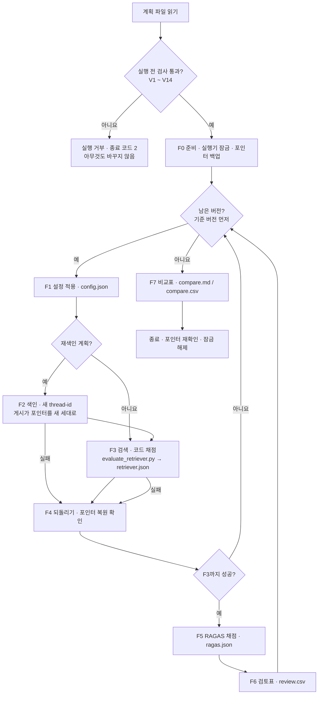

# 품질평가 프로그램 — 평가셋 · RAGAS · 사람 검토표 · 버전 실험 실행기

하이퍼 파라미터 버전을 **같은 잣대로 비교**하기 위한 프로그램임.
계획 파일(`plans/*.yaml`) 하나로 재색인 → 검색 · 코드 채점 → RAGAS 채점 → 사람 검토표 → 비교표까지 한 번에 돌림.
설계서: `~/Documents/강의/신한카드/품질평가설계서.pptx`

## 1. 목표 및 주요 기능

**목표**: 버전마다 `.env`를 손으로 고치고 명령 3개를 따로 돌리던 일을 명령 하나로 묶고,
어떤 설정 · 어떤 세대 · 어떤 평가자로 쟀는지를 버전 폴더에 남겨 버전끼리 비교할 수 있게 함.

| 기능 | 실행 스크립트 | 하는 일 |
|---|---|---|
| 평가셋 준비 | `build_eval_set.py` | `eval-set.md`(사람용) → `eval-set.json`(기계용). 검증 5검사를 통과할 때만 저장 |
| 평가셋 검증 | `verify_eval_set.py` | 사용 중 색인 세대로 ① 글자 대조 ② 카드 블록 ③ 숫자 대조 ④ 답 없음 ⑤ 구조를 다시 검사 |
| RAGAS 채점 | `evaluate_ragas.py` | 리트리버 결과 로그를 RAGAS 핵심 4지표(ContextPrecision · ContextRecall · Faithfulness · AnswerRelevancy) × 반복 수로 채점 → 평균 · 반복 간 표준편차 · 최소 · 최대 |
| 사람 검토표 | `human_review.py` | `export` 문항당 1행 CSV / `agree` 사람 판정 vs 지표별 LLM 판정의 일치율 · F1 · kappa |
| 버전 실험 | `run_experiments.py` | 계획 파일로 F0 ~ F7을 돌리고 `experiments/{하이퍼 파라미터}/compare.md`를 만듦 |

지켜지는 원칙(설계서 「공통 원칙」)

- **같은 조건**: 평가셋 지문 · 평가자 · 반복 수 · 합격 기준값을 계획 파일에 고정. 다르면 실행을 거부하거나 Δ를 계산하지 않음
- **되돌리기**: 실행 전 사용 중 세대 포인터(`active_generation.json`)를 백업하고, 버전마다 검색 직후 · 종료 때 되돌림
- **이어 하기**: 단계 상태를 `state.json`에 남김. `--resume`이면 성공 단계는 건너뛰고 실패 · 끊긴 단계부터 다시 함

## 2. Workflow



| 단계 | 하는 일 | 결과 파일 | 실패하면 |
|---|---|---|---|
| F0 | 계획 · 평가셋 지문 · 검색 API 서버 꺼짐 확인, 잠금, 포인터 백업 | `_backup/active_generation.json` · `state.json` | 거부(종료 코드 2) |
| F1 | 적용기(env · config_file · code_arg)로 값을 넣고 설정 스냅샷 기록 | `config.json` · 설정 복사본 | 버전 실패 → F4 |
| F2 | 재색인 계획만 — `run_indexer.py --full-reindex --thread-id exp-…` | 새 세대 `gen-exp-…` | 버전 실패 → F4 |
| F3 | `evaluate_retriever.py --generate-answer` (+ `--top-k` 등) | `retriever.json` | 버전 실패 → F4 |
| F4 | 포인터를 백업 값으로 되돌리고 내용으로 확인 | `config.json`의 `pointer_restored` | 건너뛰지 않음 |
| F5 | 답 있는 행만 4지표 × 반복 수 채점 | `ragas.json` | 버전 실패(F3 결과는 남음) |
| F6 | 문항당 1행 검토표 내보내기(판정은 기다리지 않음) | `review.csv` | 버전 실패 |
| F7 | 버전 폴더를 모아 기준 대비 차이 · 판정 | `compare.md` · `compare.csv` | 로그는 남음 |

## 3. 디렉토리 구조

```
ragas/
├─ eval-set.md                 평가셋 v2 20문항(사람용 원본 · 검토 칸)
├─ eval-set.json               기계용 평가셋(build_eval_set.py가 검증 통과 때만 씀)
├─ plans/
│  ├─ chunk_size.yaml          청크 크기 600 · 800(기준 800, 재색인)
│  └─ top_k.yaml               Top-k 3 · 5 · 10(기준 5, 재색인 아님)
├─ experiments/                실험 결과(하이퍼 파라미터 / 버전)
│  ├─ _registry.csv            실험으로 만든 색인 세대 목록(정리 판단용)
│  └─ chunk_size/
│     ├─ state.json · _backup/active_generation.json
│     ├─ 800/  config.json · document_policies.json · retriever.json · ragas.json · review.csv · logs/
│     ├─ 600/  (같은 구성)
│     └─ compare.md · compare.csv
├─ app/
│  ├─ domain/                  순수 규칙 — 평가셋 변환 · 검증 · 계획 검사 · 채점 집계 · 비교 판정
│  ├─ application/             models.py(DTO) · ports.py(포트) · *_service.py(평가셋 · RAGAS · 검토표 · 비교표 · 실행기)
│  ├─ infrastructure/          settings · files(저장소 · 포인터 · 잠금 · 말뭉치) · processes(하위 프로세스) ·
│  │                            ragas_judge(평가자 · 임베딩) · anthropic_llm(Claude 구조화 출력)
│  ├─ presentation/cli.py      하위 명령 build · verify · ragas · review · run · compare
│  └─ bootstrap.py             조립 지점(구현체 생성은 여기서만)
├─ tests/                      가짜 포트 주입 시험 + live 시험(실제 색인 · 로컬 평가자)
├─ build_eval_set.py · verify_eval_set.py · evaluate_ragas.py · human_review.py · run_experiments.py
├─ requirements.txt · requirements-dev.txt · requirements-torch-{cpu,cuda,mps}.txt
└─ .env.example
```

함께 바뀐 파일: `../retriever/vector-retriever/evaluate_retriever.py` — 인자 5개 추가(`--top-k` · `--metric-k` · `--fixed-k` ·
`--version-label` · `--config-snapshot`). 인자를 주지 않으면 top_k 5 · 지표 @5로 지금과 같은 값이 나옴.

## 4. 가상환경 설정

Python 3.13 기준. 패키지는 이 폴더의 `.venv`에만 설치함. 리트리버 · 인덱서와 **가상환경이 다름** —
ragas가 langchain 계열을 함께 깔아 리트리버 의존성과 부딪치기 때문임. 실행기는 두 도구를 import하지 않고
각 `.venv`의 python을 하위 프로세스로 부름.

설치는 두 걸음임. 1) 장치에 맞는 torch 판을 먼저 깔고 2) 나머지를 깖(1을 건너뛰면 GPU가 있어도 CPU 판이 깔림).

| 장치 | 1)에서 설치할 파일 | `.env`의 `EMBED_DEVICE` |
|---|---|---|
| CPU | `requirements-torch-cpu.txt` | `cpu` |
| NVIDIA GPU | `requirements-torch-cuda.txt` | `cuda` |
| Apple 실리콘 GPU | `requirements-torch-mps.txt` | `mps` |

### Windows · Git Bash

```bash
uv venv .venv --python 3.13
uv pip install --python .venv/Scripts/python.exe -r requirements-torch-cuda.txt   # 1) 장치 판 먼저
uv pip install --python .venv/Scripts/python.exe -r requirements-dev.txt          # 2) 나머지
.venv/Scripts/python.exe -c "import ragas, torch; print(ragas.__version__, torch.cuda.is_available())"
```

### Windows · PowerShell

```powershell
uv venv .venv --python 3.13
uv pip install --python .venv\Scripts\python.exe -r requirements-torch-cuda.txt   # 1) 장치 판 먼저
uv pip install --python .venv\Scripts\python.exe -r requirements-dev.txt          # 2) 나머지
.venv\Scripts\python.exe -c "import ragas, torch; print(ragas.__version__, torch.cuda.is_available())"
```

### macOS · 기본 터미널(zsh · bash)

```bash
uv venv .venv --python 3.13
uv pip install --python .venv/bin/python -r requirements-torch-mps.txt            # 1) 장치 판 먼저
uv pip install --python .venv/bin/python -r requirements-dev.txt                  # 2) 나머지
.venv/bin/python -c "import ragas, torch; print(ragas.__version__, torch.backends.mps.is_available())"
```

### macOS · PowerShell 7

```powershell
uv venv .venv --python 3.13
uv pip install --python .venv/bin/python -r requirements-torch-mps.txt            # 1) 장치 판 먼저
uv pip install --python .venv/bin/python -r requirements-dev.txt                  # 2) 나머지
.venv/bin/python -c "import ragas, torch; print(ragas.__version__, torch.backends.mps.is_available())"
```

`uv`가 없으면 `python -m venv .venv` 뒤에 `uv pip install --python …`을 `.venv/Scripts/python.exe -m pip install …`
(macOS는 `.venv/bin/python -m pip install …`)로 바꿔 실행함. 정상이면 `0.4.3 True`가 나옴.

### 설정과 준비물

`.env.example`을 `.env`로 복사함. 읽는 순서는 **환경변수 → 이 폴더 `.env` → `hybrid-ai-lab/.env`**(앞이 우선).

| 준비물 | 확인 방법 |
|---|---|
| 인덱서 · 리트리버 가상환경 | `../indexer/vector-bm25/.venv` · `../retriever/vector-retriever/.venv`가 있어야 함(각 README 참고) |
| 사용 중 색인 세대 | `../indexer/vector-bm25/data/active_generation.json` |
| 로컬 평가자 | Ollama에 `hf.co/unsloth/Qwen3.5-9B-GGUF:Q4_K_M` — `ollama pull hf.co/unsloth/Qwen3.5-9B-GGUF:Q4_K_M` |
| 임베딩 모델 | KURE-v2가 로컬 캐시에 있어야 함(`HF_LOCAL_FILES_ONLY=true` — 실행 중 내려받지 않음) |
| 비밀키 | 리트리버 답변 생성용 `GROQ_API_KEY`. API 평가자를 쓸 때만 `CLAUDE_API_KEY`(또는 `ANTHROPIC_API_KEY`) · `GROQ_API_KEY` |
| 검색 API 서버 | 같은 data 폴더를 보는 서버(`:8020`)는 **실험 동안 내림** — 리트리버가 포인터를 요청마다 다시 읽어 실험 세대로 넘어감 |

## 5. 실행 방법

Windows Git Bash 기준. PowerShell은 `/`를 `\`로, macOS는 `.venv/Scripts/python.exe`를 `.venv/bin/python`으로 바꿈.

### 5-1. 평가셋 준비 — md → json

```bash
.venv/Scripts/python.exe build_eval_set.py                     # 검증 통과 때만 eval-set.json 저장
.venv/Scripts/python.exe verify_eval_set.py --out logs/verify.json   # 다른 세대에서 다시 검증
```

출력의 `eval_set_hash`를 계획 파일의 `eval_set.sha256`에 적음(평가셋이 바뀌면 함께 고침).

### 5-2. 버전 실험

```bash
.venv/Scripts/python.exe run_experiments.py --plan plans/top_k.yaml --check-only    # 실행 전 검사만
.venv/Scripts/python.exe run_experiments.py --plan plans/chunk_size.yaml             # 기준 800 + 600
.venv/Scripts/python.exe run_experiments.py --plan plans/top_k.yaml --versions 3     # 기준 5 + 3만
.venv/Scripts/python.exe run_experiments.py --plan plans/top_k.yaml --resume         # 실패 · 끊긴 단계부터
```

RAGAS 결과나 사람 판정(`review-agree.json`)을 더한 뒤 비교표만 다시 만들 때는 하위 명령을 씀.

```bash
.venv/Scripts/python.exe -m app.presentation.cli compare --plan plans/top_k.yaml
```

종료 코드: 0 정상 · 1 실행 오류 · 2 실행 전 검사 거부(아무것도 바꾸지 않음) · 130 중단.

### 5-3. 도구 하나씩 쓰기

```bash
# RAGAS 채점 — 평가자 local(기본) · anthropic · groq
.venv/Scripts/python.exe evaluate_ragas.py --log experiments/top_k/5/retriever.json --repeat 3 --out logs/ragas.json

# 사람 검토표 — export 뒤 human_pass(pass / fail) · human_reason 칸을 사람이 채움
.venv/Scripts/python.exe human_review.py export --log experiments/top_k/5/retriever.json \
  --ragas-log experiments/top_k/5/ragas.json --out experiments/top_k/5/review.csv
.venv/Scripts/python.exe human_review.py agree experiments/top_k/5/review.csv \
  --out experiments/top_k/5/review-agree.json
```

`review-agree.json`을 버전 폴더에 두면 비교표 ③ 칸에 kappa가 들어감. 판정이 60건 미만이면 결과에 '참고값'이 붙음.

### 5-4. 계획 파일 쓰는 법

| 필드 | 뜻 | 예 |
|---|---|---|
| `hyperparameter` | 실험 폴더 이름 | `chunk_size` |
| `apply` | 바꾸는 종류 | `config_file` · `env` · `code_arg` |
| `target` | 대상 키 `{도구}:{종류}:{대상}` | `indexer:config:config/document_policies.json#defaults.chunk_size` · `retriever:env:GRADE_MIN_GAP` · `retriever:arg:--top-k` |
| `reindex` | 재색인 계획인지 | `true` |
| `baseline` · `versions` | 기준 값 · 버전 목록(기준 포함) | `800` · `[{id: "600", value: 600}]` |
| `eval_set` | 평가셋 경로 · 지문 | `eval-set.json` · `253f89d84905` |
| `scoring` | 평가자 · 반복 수 · 합격 기준값 | `local` · `3` · `0.5` |

## 6. 시험

```bash
.venv/Scripts/python.exe -m pytest -q                 # 전체(live 포함 — 실제 색인 · Ollama 필요)
.venv/Scripts/python.exe -m pytest -q -m "not live"   # 가짜 포트만
```

| 시험 파일 | 보증하는 것 |
|---|---|
| `test_domain.py` | md 변환 규칙 · 평가셋 지문 · 검증 5검사가 실패를 잡음 · 계획 거부/미지원 · 교재 kappa 예시(0.75 · 0.83 · 0.39) |
| `test_services.py` | 검증 실패면 json을 안 씀 · RAGAS는 지표가 읽는 칸만 넘김 · 실패 칸 기록 · 사람 판정 덮어쓰기 막음 · 비교표 Δ · 흔들림 폭 판정 |
| `test_runner.py` | 버전마다 포인터 복원(다음 색인이 기준 세대에서 시작) · 실패해도 복원 · 이어 하기 · 실행 전 거부는 아무것도 안 바꿈 · Ctrl+C 복원 |
| `test_adapters.py` | 계층 import 방향 · 포트 추상 메서드 · 원자적 쓰기 · 잠금 · 인덱서 결과 읽기 · live(말뭉치 · 로컬 평가자) |

결과는 7장에 적음.

## 7. 실측 결과

2026-10-04, Windows 11 · RTX 4090 Laptop(16GB) · 평가자 로컬 Qwen3.5-9B(Ollama) · 리트리버 답변 Groq gpt-oss-120b.

### 7-1. 평가셋 준비

| 항목 | 결과 |
|---|---|
| `build_eval_set.py` | 20문항 검증 5검사 **모두 통과**(실패 0) — 사용 중 세대 `gen-ch2-20261003-001-17151790` 기준 |
| 구성 | 약관 6 · 카드 혜택 7 · 상담 이력 4 · 답 없음 3 |
| 평가셋 지문 | `253f89d84905`(두 계획 파일의 `eval_set.sha256`) |

### 7-2. 버전 실험(기준 + 1버전씩)

| 계획 | 버전 | 단계 결과 | 전체 시간 |
|---|---|---|---|
| `chunk_size.yaml` | 800(기준, 새로 색인) · 600 | 두 버전 F1 ~ F6 **모두 성공**, F7 비교표 생성 | 40분 43초 |
| `top_k.yaml --versions 3` | 5(기준) · 3 | 두 버전 F1 · F3 ~ F6 성공, F2 건너뜀(재색인 아님), F7 생성 | 36분 49초 |

단계별 소요 시간 — RAGAS 채점이 대부분을 차지함.

| 버전 | F2 색인 | F3 검색 · 코드 채점 | F5 RAGAS(당시 6지표 × 3회) |
|---|---|---|---|
| chunk 800 | 38초 | 110초 | 21분 30초(채점 행 11) |
| chunk 600 | 42초 | 107초 | 14분 12초(채점 행 8) |
| top_k 5 | — | 108초 | 16분 49초(채점 행 10) |
| top_k 3 | — | 103초 | 16분 24초(채점 행 10) |

되돌리기 확인

- 실행 전후 `../indexer/vector-bm25/data/active_generation.json` 내용이 **같음**(diff 결과 차이 없음) — 세대 `gen-ch2-20261003-001-17151790`
- 실험 세대 2개가 `experiments/_registry.csv`에 기록됨: `gen-exp-chunk_size-800-…`(6.9MB) · `gen-exp-chunk_size-600-…`(7.9MB)
- 600 색인도 기준 세대에서 시작해 게시가 거부되지 않음(버전마다 되돌린 효과)

비교표 요약(전문은 `experiments/*/compare.md`)

| 계획 | 코드 지표(@5) | 최종 응답 | RAGAS |
|---|---|---|---|
| chunk 600 vs 800 | Recall · nDCG · Hit 같음(0.912 · 0.898 · 0.941) | 근거를 들고 끝난 문항 11 → 8 | 채점 행이 11 → 8로 달라 Δ에 ⚠(참고만) |
| top_k 3 vs 5 | Recall@5 −0.030 · Hit@5 −0.059(조각이 3개뿐) | 10 → 10 | ContextPrecision +0.011 · AnswerRelevancy +0.021 · Faithfulness 0 |

RAGAS 지표 변경(2026-10-04, 사용자 결정): 6지표 → 핵심 4지표. 위 실험은 6지표로 채점했으며, `ragas.json`에는 6지표 값이
남아 있음. 비교표 · 검토표는 4지표로 다시 만들었음(로컬 평가자는 같은 입력에 같은 값이라 4지표 값은 그대로임).
다음 실행부터는 4지표만 채점해 RAGAS 시간이 약 2/3로 줄 것으로 봄(실측 전).

### 7-3. 평가자 연결 확인(지표 1 ~ 2개씩 실제 호출)

| 평가자 | 결과 |
|---|---|
| local(Qwen3.5-9B) | 지표 채점됨, 3회 반복이 모두 같은 값(흔들림 0) |
| anthropic(Claude Opus 5.5) | ContextRecall · Faithfulness 채점됨 — ragas 기본 경로는 400이라 전용 어댑터를 씀(8장 ⑦) |
| groq(gpt-oss-120b) | ContextRecall 채점됨 |

### 7-4. 시험

| 명령 | 결과 |
|---|---|
| `ragas` 전체 `pytest -q` | **48건 통과**(live 2건 포함) |
| `ragas` 새 가상환경에 README 순서로 설치 후 `pytest -m "not live"` | 45건 통과(requirements만으로 설치되는지 확인) |
| `retriever/vector-retriever` 전체 `pytest -q` | **192건 통과**(인자 추가 시험 6건 포함) |
| `ruff --select D100,D101,D102,D103,F,E9` · 가이드 §7.1 DIP 점검 | 위반 없음 |

## 8. 설계와 다른 점

| # | 설계서 | 구현 | 이유 |
|---|---|---|---|
| ① | 실행기는 `eval-runner/`, 전용 `.venv` | `ragas/` 하나에 합침(`ragas/.venv`) | 사용자 결정. 실행기는 하위 프로세스만 불러 의존성 충돌 없음 |
| ② | RAGAS · 검토표도 하위 프로세스로 호출 | 같은 가상환경의 서비스로 직접 부름 | 같은 `.venv`라 프로세스를 나눌 이유가 없음 |
| ③ | 하위 프로세스에 필요한 환경변수만 넘김 | 지금 환경을 물려받고 바꿀 값만 얹음 | Windows에서 PATH · CUDA 변수를 빼면 python · torch가 뜨지 않음 |
| ④ | 검증 ③ 숫자 대조는 평가셋만 봄 | 원문 조각을 담은 색인 조각 전체에서 찾음 | 원문 조각은 핵심 문장만 옮겨 적어, 정답의 월 한도 같은 숫자가 같은 조각의 옆 칸에 있음 |
| ⑤ | 프롬프트 제약 「LangChain 사용」 | 평가자는 ragas `llm_factory` | 사용자 결정. ragas 0.4.3의 지표 묶음은 LangChain 래퍼를 거부함(Instructor 형식만 받음) |
| ⑥ | `retriever.json` 머리에 세대 이름 | `config.json`에 세대 이름 · 기준 세대 · 복원 확인을 남기고, `retriever.json`은 `--config-snapshot`으로 그 내용을 품음 | 세대는 실행기가 알고 있어 평가 스크립트를 더 고치지 않음 |
| ⑦ | 평가자 3종 모두 `llm_factory` | Claude만 `AnthropicParseLLM`(SDK `messages.parse` 구조화 출력) | Claude Opus 5.5가 `temperature` · 강제 도구 호출을 400으로 거부 — ragas의 Anthropic 경로가 둘 다 보냄(실측). 거절 대비 `fallbacks="default"`를 켬 |
| ⑧ | RAGAS 6지표(검색 3 · 생성 3) | 핵심 4지표(ContextPrecision · ContextRecall · Faithfulness · AnswerRelevancy) | 사용자 결정 — 보조 지표 ContextEntityRecall · FactualCorrectness는 재지 않음. 코드 채점 5지표는 그대로 |

## 9. 남은 과제 · 알려진 한계

솔직히 적어 둠. 아래는 **아직 해결하지 못한 것**임.

1. **흔들림 폭이 리트리버의 흔들림을 빼먹음(결정 필요)** — 흔들림 폭은 평가자 반복만 봄. 로컬 평가자는 흔들림이 0이라
   작은 Δ도 개선 · 악화로 읽힘. 그런데 설정이 같은 두 기준(chunk 800 새 세대 · top_k 5 기존 세대)이
   근거를 들고 끝난 문항 11 대 10, Faithfulness 0.803 대 0.850으로 달랐음 — 리트리버 답변 생성(LLM)이 실행마다 흔들림.
   기준 버전을 2회 이상 돌려 그 차이를 흔들림 폭에 넣을지 정해야 함. 그 전까지 RAGAS Δ는 참고만 함
2. **RAGAS 채점 행이 버전마다 다름** — 채점 대상은 '근거를 들고 끝난 답 있음 문항'이라 600은 8행, 800은 11행.
   3행 이상 차이면 비교표에 ⚠를 붙임(기준 3은 설계 가정)
3. **평가자가 엄격하게 판정하는 사례** — 「A이고 B이면 면제」를 주장 둘로 쪼갠 뒤 각각 '조건을 빠뜨렸다'며 0으로 봄
   (Qwen Faithfulness · gpt-oss ContextRecall 실측). 사람 판정으로 평가자를 보정해야 하나 **사람 판정은 아직 0건**
4. **사람 판정 20건은 참고값** — 검증 기준 60건에 못 미침(사용자 결정). 비교표 ③의 kappa는 판정을 채운 뒤
   `human_review.py agree … --out {버전}/review-agree.json` → `compare` 하위 명령으로 다시 만들면 들어감
5. **RAGAS 시간** — 버전당 14 ~ 22분. 로컬 평가자는 3회가 모두 같은 값이라 2회분이 같은 계산을 되풀이함.
   로컬 평가자일 때 반복 수를 1로 줄일지는 결정 필요(교재 · 설계서는 3회)
6. **시간 상한 · API 재시도 없음** — `PROCESS_TIMEOUT_SECONDS` 기본값 없음, 외부 API 재시도 0회(근거가 없어 결정 필요)
7. **실험 세대 정리는 수동** — `data/generations/`에 실험 세대 2개(약 15MB)가 남아 있음. 비교표를 확정한 뒤 지움
   (사용 중 세대 · 다른 세대의 `base_generation`은 지우지 않음)
8. **Top-k 10 버전은 이번에 돌리지 않음** — 완료 확인은 기준 + 1버전으로 함(사용자 결정). `--versions 10 --resume`으로 이어 돌릴 수 있음
9. **RAGAS 판정 이유(reason)가 비어 있음** — ragas 0.4.3의 지표들이 MetricResult.reason을 채우지 않아 검토표 이유 칸이 빈칸임
