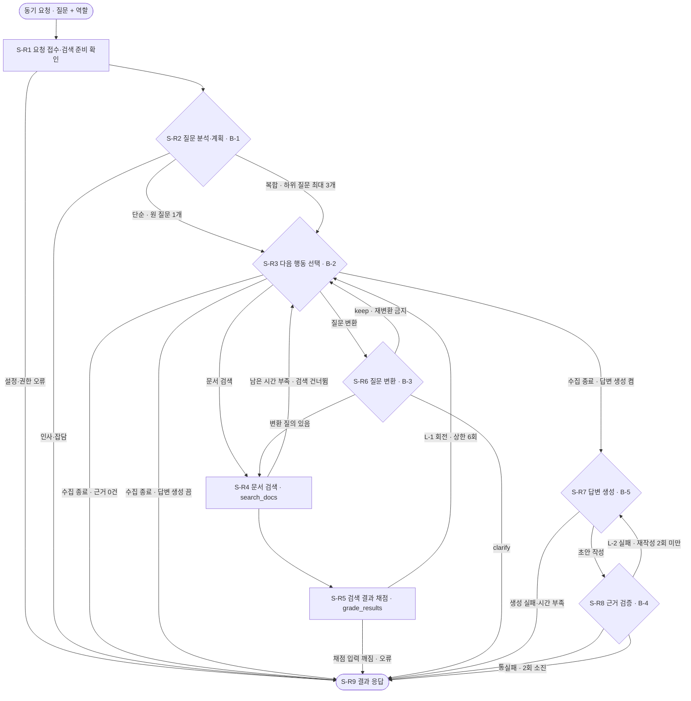

# 문서 검색(Agentic RAG) 리트리버

질문 1건을 받아 **필요한 만큼만** 검색·채점·질문 변환을 되풀이하고, 찾은 근거로만 답하거나 「확인 필요」로 끝내는 예제임.  
앞 단계 인덱서(W-1 `indexer/vector-bm25`)가 만들어 둔 벡터·BM25 색인을 **읽기만** 함 — 색인을 새로 만들지 않음.

용어 먼저 풀어 둠. 처음 보는 낱말이 나오면 여기로 돌아와 확인함.

| 낱말 | 뜻 |
|---|---|
| RAG | 질문에 답하기 전에 문서를 먼저 찾아 그 내용만 근거로 답하는 방식 |
| Agentic RAG | 한 번 찾고 끝내지 않고, 결과를 보고 "더 찾을지·질문을 바꿀지·끝낼지"를 스스로 고르는 RAG |
| 조각(chunk) | 긴 문서를 검색하기 좋게 잘라 둔 토막. 검색·인용의 최소 단위임 |
| 벡터 검색 | 글자가 달라도 **뜻이 가까운** 조각을 찾는 방법 |
| BM25 | **낱말이 똑같은** 조각을 찾는 고전 검색 방법 |
| 리랭커(Reranker) | 질문과 조각을 한꺼번에 읽어 "정말 관련 있나"를 다시 점수 매기는 모델 |
| 색인 세대(generation) | 인덱서가 한 번 만들어 게시한 색인 한 벌. 세대가 바뀌면 조각ID도 바뀜 |
| LangGraph | 단계와 분기를 그래프로 적어 두고 그 순서대로 실행해 주는 파이썬 라이브러리 |

## 1. 목표 및 주요 기능

- 목표: 약관·혜택 안내·상담 이력 문서에서 질문의 근거를 찾아 주고, 근거가 없으면 **답을 지어내지 않고** 되묻기
- 처리 단위: 질문 1건 = 실행 1회(동기 요청·1회 응답). 단계ID는 `S-R1` ~ `S-R9`

| 기능 | 하는 일 | 맡은 곳 |
|---|---|---|
| 질문 분석·계획 | 인사·잡담인지, 단순 질문인지, 하위 질문으로 쪼갤 복합 질문인지 가름 | S-R2 (LLM) |
| 다음 행동 선택 | 더 검색할지, 질문을 바꿀지, 수집을 끝낼지 고름 | S-R3 (LLM) |
| 문서 검색 | 벡터 `top_k`×8건 + BM25 `top_k`×8건 → 점수 합치기 `top_k`×2건 → 리랭크 상위 `top_k`건 | S-R4 (규칙·모델) |
| 결과 채점 | 점수와 핵심어 일치로 정확·불확실·부정확을 가름. **LLM을 쓰지 않음** | S-R5 (규칙) |
| 질문 변환 | 부정확하면 질문을 다시 써서 재검색. 대상이 불분명하면 되물음 | S-R6 (LLM) |
| 답변 생성 | 요청 옵션을 켤 때만 동작. 끄면 근거 목록만 돌려줌 | S-R7 (LLM) |
| 근거 검증 | 답변의 인용문이 근거 본문과 **글자 그대로** 같은지 대조 | S-R8 (규칙) |
| 결과 응답 | 상태 6종 중 하나로 마감하고 감사 로그 1줄을 남김 | S-R9 (규칙) |

반드시 붙인 안전장치 4종.

1. LLM 호출 상한 — 요청당 설정값 `MAX_LLM_CALLS`(기본 16)까지만 부름
2. 권한은 검색기 안에서 — 역할을 열람 등급으로 바꿔 순위 계산 **전에** 걸러냄. LLM이 바꿀 수 없음
3. 결정적 관문 유지 — 채점(S-R5)과 검증(S-R8)은 LLM이 아니라 규칙이 판정함
4. 근거 부족 시 종료 — 「확인 필요」로 끝냄

권한은 두 역할뿐임(`app/domain/access.py`).

| 역할 | 볼 수 있는 문서 |
|---|---|
| `agent` | `public` |
| `auditor` | `public` + `restricted`(상담 이력) |

## 2. Workflow

`([ ])`는 시작·끝, `[ ]`는 단계, `{ }`는 갈림길임. 화살표 위 글자가 갈라지는 조건임.



되돌아가는 선은 모두 상한으로 묶음. 상한은 `app/application/state.py`의 `ROUTES` 표와 설정값이 함께 정함.

| 되돌아가는 선 | 상한 | 설정 변수 |
|---|---|---|
| S-R5 → S-R3 (근거 수집 반복 L-1) | S-R3 진입 6회 | `MAX_TURNS` |
| S-R8 → S-R7 (답변 재작성 반복 L-2) | 재작성 2회 | `MAX_REWRITES` |
| S-R6 → S-R3 (`keep`) | 그 질문의 재변환 금지 | — |

설계서 도식에 없던 선이 코드에 하나 더 있음. **S-R4 → S-R3**임.  
남은 시간이 단계 시작 기준(`START_THRESHOLD_SECONDS`, 기본 1.5초)보다 적으면 검색을 시작하지 않고 S-R3으로 돌아가  
수집을 끝냄(`app/application/steps.py` `s_r4`). 위 도식은 이 선을 포함해 실제 코드(`ROUTES`)와 맞춤.

## 3. 디렉토리 구조

```text
vector-retriever/
├─ run_retriever.py            CLI 실행 진입점. 윈도우 콘솔 출력을 UTF-8로 바꾼 뒤 cli.main()을 부름
├─ serve_retriever.py          API 서버 실행 진입점. --host·--port를 받아 uvicorn을 띄움
├─ requirements.txt            공통 패키지 버전 고정(torch는 버전만 고정, 판은 아래 파일이 정함)
├─ requirements-torch-cpu.txt  PyTorch CPU 판
├─ requirements-torch-cuda.txt PyTorch NVIDIA GPU(CUDA 12.6) 판
├─ requirements-torch-mps.txt  PyTorch Apple 실리콘 GPU(MPS) 판
├─ requirements-dev.txt        위 공통 패키지 + pytest·httpx·mypy
├─ pytest.ini                  시험 경로와 표식(integration·live) 정의
├─ .env.example                설정 보기 파일. .env로 복사해 값을 채움
├─ logs/audit.jsonl            감사 로그(실행하면 생김. Git에 올리지 않음)
└─ app/
   ├─ bootstrap.py             구현체를 만들어 끼우는 유일한 조립 지점
   ├─ domain/                  외부 기술 없이 같은 입력에 같은 결과를 내는 업무 규칙
   │  ├─ access.py             역할 → 열람 등급 변환(agent·auditor)
   │  ├─ actions.py            S-R3에서 고를 수 있는 행동 목록과 검사
   │  ├─ budget.py             남은 시간 예산·반복·호출 상한 계산
   │  ├─ fusion.py             벡터·BM25 점수 정규화·가중합·RRF로 순위 합치기
   │  ├─ grading.py            정확·불확실·부정확 채점 규칙
   │  ├─ keywords.py           질문에서 채점용 핵심어(드문 명사·숫자·코드) 고르기
   │  ├─ models.py             조각·후보·하위 질문 등 불변 값 객체
   │  ├─ plan_rules.py         질문 분석(C-01) 응답 형식·개수·조건 보존 검사
   │  ├─ transform_rules.py    질문 변환(C-03) 응답에 서버가 강제하는 금지 규칙
   │  └─ verification.py       인용문과 근거 본문의 글자 단위 대조
   ├─ application/             흐름과 약속. 바깥 기술을 직접 모름
   │  ├─ models.py             요청·응답·오류 모델과 LLM 커넥터 입출력(DTO)
   │  ├─ ports.py              필요한 기능의 약속(포트) 7종
   │  ├─ services.py           요청 1건을 워크플로우로 실행하고 표준 응답으로 바꿈
   │  ├─ state.py              단계가 주고받는 상태 필드와 ROUTES(갈 수 있는 다음 단계) 표
   │  └─ steps.py              S-R1 ~ S-R9 단계 로직
   ├─ infrastructure/          포트를 실제 기술로 구현한 어댑터
   │  ├─ audit_log.py          감사 레코드를 JSON Lines 파일에 한 줄씩 덧붙임
   │  ├─ clock.py              경과 시간·기준일을 주는 시스템 시계
   │  ├─ embedder.py           질문을 색인과 같은 규칙으로 벡터 1개로 바꿈
   │  ├─ graph.py              단계를 LangGraph StateGraph로 묶어 실행
   │  ├─ groq_gateway.py       Groq Chat Completions 호출(커넥터 C-01 ~ C-04)
   │  ├─ index_store.py        색인 세대를 서명·해시 대조 후 적재하고 검색
   │  ├─ korean_tokenizer.py   색인과 글자까지 같은 낱말을 만드는 한국어 분석기
   │  ├─ reranker.py           Cross-Encoder로 관련도 재점수
   │  ├─ settings.py           환경변수·.env를 읽어 불변 Settings로 담음
   │  └─ prompts/              C-01 ~ C-04 프롬프트 4개(c01_plan.md ~ c04_answer.md)
   └─ presentation/            바깥에서 부르는 입구
      ├─ api.py                /search·/health를 가진 FastAPI 앱
      └─ cli.py                명령행 인자 해석과 사람이 읽는 요약 출력
```

의존 방향은 **바깥에서 안쪽으로 한 방향**임. `presentation` → `application` → `domain` 순으로만 가져오고,  
`domain`은 아무것도 가져오지 않음. `infrastructure`는 `application/ports.py`의 약속을 상속해 구현하며,  
`application`은 그 구현체 이름을 모름. 실제 구현체를 골라 끼우는 일은 `bootstrap.py` 한 곳에서만 함.  
그래서 Chroma·Groq·LangGraph를 다른 기술로 바꿀 때 `infrastructure`와 `bootstrap.py`만 고치면 됨.  
이 import 방향은 `tests/test_architecture.py`가 소스를 읽어 자동으로 검사함.

## 4. 가상환경 설정

Python 3.13 기준임. 패키지는 모두 이 폴더의 `.venv`에 설치하고, 시스템 파이썬의 패키지는 섞어 쓰지 않음.

설치 순서가 **두 걸음**인 이유가 있음. `requirements.txt`는 `torch==2.14.0`처럼 버전만 고정하고 계산 장치별 판은 정하지 않음.  
2)만 실행하면 기본 저장소(PyPI)의 CPU 판이 깔려 GPU가 있어도 쓰지 못함. 그래서 1)에서 장치에 맞는 판을 **먼저** 깖.  
1)에서 깐 `2.14.0+cu126` 같은 판은 `torch==2.14.0` 조건을 이미 만족하므로 2)에서 바뀌지 않음.

| 장치 | 1)에서 설치할 파일 | `.env`의 `EMBED_DEVICE` | 설치 조건 |
|---|---|---|---|
| CPU | `requirements-torch-cpu.txt` | `cpu` | 없음 |
| NVIDIA GPU | `requirements-torch-cuda.txt` | `cuda` | Windows·Linux, 드라이버가 CUDA 12.6 이상 지원 |
| Apple 실리콘 GPU | `requirements-torch-mps.txt` | `mps` | macOS 14 이상 |

기본값 `auto`는 깔린 판으로 쓸 수 있는 장치를 cuda → mps → cpu 순으로 고름.  
드라이버가 지원하는 CUDA 버전은 `nvidia-smi` 출력 오른쪽 위 `CUDA Version`에서 확인함.

### Windows · Git Bash

```bash
uv venv .venv --python 3.13
uv pip install --python .venv/Scripts/python.exe -r requirements-torch-cuda.txt   # 1) 장치 판 먼저
uv pip install --python .venv/Scripts/python.exe -r requirements-dev.txt          # 2) 나머지
.venv/Scripts/python.exe -c "import torch; print(torch.__version__, torch.cuda.is_available())"
```

### Windows · PowerShell

```powershell
uv venv .venv --python 3.13
uv pip install --python .venv\Scripts\python.exe -r requirements-torch-cuda.txt   # 1) 장치 판 먼저
uv pip install --python .venv\Scripts\python.exe -r requirements-dev.txt          # 2) 나머지
.venv\Scripts\python.exe -c "import torch; print(torch.__version__, torch.cuda.is_available())"
```

### macOS · 기본 터미널(zsh·bash)

```bash
uv venv .venv --python 3.13
uv pip install --python .venv/bin/python -r requirements-torch-mps.txt            # 1) 장치 판 먼저
uv pip install --python .venv/bin/python -r requirements-dev.txt                  # 2) 나머지
.venv/bin/python -c "import torch; print(torch.__version__, torch.backends.mps.is_available())"
```

### macOS · PowerShell 7

```powershell
uv venv .venv --python 3.13
uv pip install --python .venv/bin/python -r requirements-torch-mps.txt            # 1) 장치 판 먼저
uv pip install --python .venv/bin/python -r requirements-dev.txt                  # 2) 나머지
.venv/bin/python -c "import torch; print(torch.__version__, torch.backends.mps.is_available())"
```

`uv`가 없으면 표준 도구로도 같은 일을 함 — `python -m venv .venv` 뒤에 위의 `uv pip install …`을
`.venv/Scripts/python.exe -m pip install …`(macOS는 `.venv/bin/python -m pip install …`)로 바꿔 실행함.

판과 장치 인식이 제대로 되면 아래처럼 보임.

| 설치한 판 | 정상 출력 예 |
|---|---|
| CPU | `2.14.0+cpu False` |
| NVIDIA GPU | `2.14.0+cu126 True` |
| Apple 실리콘 GPU | `2.14.0 True`(`mps.is_available()` 기준) |

이미 만든 `.venv`의 판을 바꿀 때는 `.venv` 폴더를 지우고 위 순서대로 다시 깔는 편이 가장 확실함.

### 설정 파일과 색인·모델 준비

`.env.example`을 `.env`로 복사해 값을 채움. 읽는 순서는 **이 폴더의 `.env` → `hybrid-ai-lab/.env` → 환경변수**이며  
환경변수가 가장 우선임(`app/infrastructure/settings.py`). 비밀값은 `.env.example`에 적지 않음.

실행 전에 아래 3가지가 준비돼야 함.

1. **색인** — W-1 인덱서가 먼저 색인을 만들어 게시해야 함. `DATA_ROOT`(기본 `../../indexer/vector-bm25/data`)
   아래에 `active_generation.json`과 `generations/`가 있어야 하며, 없으면 상태 확인이 `ready=false`가 됨
2. **모델** — `EMBED_MODEL`(`nlpai-lab/KURE-v2`)과 `RERANK_MODEL`(`BAAI/bge-reranker-v2-m3`)을 쓰며,
   `HF_LOCAL_FILES_ONLY=true`가 기본이라 **로컬 캐시에 이미 받아 둔 모델만** 씀. 처음 한 번은 `false`로 두고
   받은 뒤 다시 `true`로 돌려 고정된 모델을 재사용함. 임베딩 모델·`EMBED_REVISION`은 색인과 같아야 하며
   다르면 색인 적재가 서명 대조에서 멈춤
3. **LLM 비밀키** — `GROQ_API_KEY`를 이 폴더의 `.env` 또는 공용 `hybrid-ai-lab/.env`에 둠. 비어 있으면
   서버는 뜨지만 LLM 단계(C-01 ~ C-04)가 모두 대체 경로로 돌아감(경고 로그가 남음)

## 5. 실행 방법

아래 명령은 Windows Git Bash 기준임. PowerShell은 `/`를 `\`로, macOS는 `.venv/Scripts/python.exe`를
`.venv/bin/python`으로 바꿈.

### CLI

`--query`와 `--role`은 필수임. 역할은 본문이 아니라 **실행하는 사람이 직접** 주는 값임.

| 인자 | 뜻 |
|---|---|
| `--query` | 질문(500자 이하) |
| `--role` | `agent` 또는 `auditor` |
| `--generate-answer` | 답변 생성까지 함(기본은 꺼짐 — 근거 목록만) |
| `--top-k` | 반환 수(1 ~ 10, 기본 5) |
| `--json` | 사람이 읽는 요약 대신 응답 JSON 원본 출력 |

```bash
# 1) 검색만 — 근거 목록과 점수만 봄
.venv/Scripts/python.exe run_retriever.py --query "모아생활 카드의 주요 혜택은?" --role agent

# 2) 답변까지 — 인용이 원문과 맞는지 검증을 통과한 문장만 나옴
.venv/Scripts/python.exe run_retriever.py --query "연회비 면제 조건은 무엇인가요?" --role agent --generate-answer

# 3) 감사자 역할 — 상담 이력(restricted)까지 봄
#    현재 채점 기준값(설계 가정)에서는 상담 이력 질문이 '확인 필요'로 끝나는 경우가 많음(9장 남은 과제 참고)
.venv/Scripts/python.exe run_retriever.py --query "최근 상담에서 반복된 불만은?" --role auditor --top-k 5

# 4) 응답 JSON 원본 저장
.venv/Scripts/python.exe run_retriever.py --query "연회비 면제 조건은 무엇인가요?" --role agent --json > result.json
```

서비스 조립(색인 적재 + 모델 미리 올리기)에 **약 17초**가 걸림(GPU, 2026-10-03 실측).  
CLI는 실행마다 한 번씩 조립하므로 여러 질문을 던져 볼 때는 아래 API 서버를 띄우는 편이 빠름.  
종료 코드는 정상 0, 응답 상태가 `error`면 1, 인자 오류면 2임.

### API 서버

```bash
.venv/Scripts/python.exe serve_retriever.py                      # 기본 127.0.0.1:8020
.venv/Scripts/python.exe serve_retriever.py --host 0.0.0.0 --port 9020
```

색인·모델 적재는 서버가 **뜰 때 한 번** 일어남. 시작 로그가 멈춘 뒤부터 요청을 보냄.

| 경로 | 뜻 |
|---|---|
| `GET /health` | 색인을 쓸 수 있으면 200, 아니면 503. 본문에 세대ID·조각 수·마지막 오류 종류 |
| `POST /search` | 질문 1건 검색. 역할은 `X-User-Role` 헤더로만 받음 |
| `GET /docs` | 자동 생성된 Swagger 문서(브라우저에서 바로 호출해 볼 수 있음) |

`X-User-Role` 헤더가 없으면 401, 정의되지 않은 역할이면 403임. 요청 **본문에 적은 `role` 값은 무시**함
(앞단 로그인 게이트웨이가 넣어 준 헤더만 믿음).

**Git Bash — curl**

```bash
curl -s http://127.0.0.1:8020/health

# 윈도우에서는 한글을 명령줄 인자로 바로 넣으면 코드페이지 변환으로 깨져 400이 남.
# 반드시 UTF-8 파일로 만들어 --data-binary로 보냄
cat > body.json <<'JSON'
{"query": "연회비 면제 조건은 무엇인가요?", "generate_answer": true, "top_k": 5}
JSON

curl -s -X POST http://127.0.0.1:8020/search \
  -H "Content-Type: application/json" \
  -H "X-User-Role: agent" \
  --data-binary @body.json
```

**PowerShell — Invoke-RestMethod**

```powershell
Invoke-RestMethod -Uri http://127.0.0.1:8020/health

$body = @{ query = "연회비 면제 조건은 무엇인가요?"; generate_answer = $true; top_k = 5 } | ConvertTo-Json
# 문자열을 그대로 보내면 한글이 깨지므로 UTF-8 바이트로 바꿔 보냄
$bytes = [System.Text.Encoding]::UTF8.GetBytes($body)
$headers = @{ "X-User-Role" = "agent" }
$type = "application/json; charset=utf-8"
Invoke-RestMethod -Uri http://127.0.0.1:8020/search -Method Post -Body $bytes -Headers $headers -ContentType $type
```

### 감사 로그

요청 1건이 끝날 때마다 `logs/audit.jsonl`(설정 `AUDIT_LOG_PATH`)에 JSON 한 줄이 쌓임.  
**질문 원문은 남기지 않음** — SHA-256 해시 앞 16자(`query_sha256`)와 앞 20자(`query_head`)만 남김.  
그 밖에 요청ID·역할·세대·상태·종료 사유·회전 수·LLM 호출 수·단계별 시간·근거 조각ID가 들어감.

## 6. 응답 읽는 법 — 상태 6종

응답의 `status`를 먼저 봄. 상태에 따라 채워지는 칸이 다름.

| `status` | 우리말 | 언제 | 응답에 담기는 것 |
|---|---|---|---|
| `answered` | 답변 완료 | S-R8 근거 검증 통과 | 답변 문장 + 인용 + 근거 목록 |
| `retrieved` | 검색 결과 | 답변 생성 끔 + 근거 있음 | 근거 목록(출처·본문·점수) |
| `no_retrieval` | 검색 불필요 | S-R2가 인사·잡담으로 판단 | 짧은 응답문(문서 내용 없음) |
| `needs_confirmation` | 확인 필요 | 근거 0건 · 되물음(clarify) · 재작성 소진 | 확인 못 한 항목·이유·확인 질문 |
| `answer_failed` | 답변 생성 실패 | S-R7 시간 초과·생성 실패 | 근거 목록만 |
| `error` | 오류 | S-R1 입력·권한·세대 오류, S-R5 입력 깨짐 | 오류 코드·요청ID |

`answered`여도 근거를 못 찾은 하위 질문이 있으면 `unresolved`(확인 못 한 항목)에 따로 적음.  
찾은 부분만 답하고 나머지는 지어내지 않기 때문임.

실제로 확인한 보기(GPU, 2026-10-03 실측).

| 질문 | 결과 |
|---|---|
| "연회비 면제 조건은 무엇인가요?"(`--generate-answer`) | `answered` · LLM 3회 · 약 2.4초 · 인용이 약관 제6조의2 원문과 글자 그대로 일치 |
| "안녕하세요" | `no_retrieval` · 0.6초(검색하지 않음) |
| "모아생활 카드의 주요 혜택은?" | `retrieved` · 한빛 모아생활 조각 리랭크 점수 0.917 |
| "다음 연도 기본 연회비 면제 기준과 생활 포인트 적립을 위한 전월 최소 이용액" | 하위 질문 2개 — 연회비는 근거 확보, 생활 포인트는 카드가 특정되지 않아 되물음(clarify) |
| "해외 결제 수수료 우대 조건" | `needs_confirmation`(문서에 없는 내용을 지어내지 않음) |

근거 1건의 점수는 4종임. 해당 검색기 후보에 없던 점수는 `null`(CLI 요약에서는 `-`)로 보임.

| 점수 | 뜻 |
|---|---|
| `vector` | 벡터 검색 코사인 점수(1 − 거리) |
| `bm25` | BM25 원점수 |
| `fused` | 정규화 가중합(기본 벡터 0.6 : BM25 0.4) |
| `rerank` | 리랭커 점수 0 ~ 1(실패하면 `null`) |

HTTP 상태는 응답의 `error_code`로 정함 — `invalid_input` 400, `role_missing` 401, `invalid_role` 403,
`index_unavailable` 503, `broken_state`·`internal_error` 500. 오류 코드가 없으면 200임.

## 7. 설계와 다른 점·결정 사항

설계서를 그대로 옮기지 않은 자리임. 왜 그렇게 했는지 함께 적어 둠.

| # | 항목 | 설계 | 실제 구현 | 이유 |
|---|---|---|---|---|
| ① | API 역할 전달 | 명시 없음 | 앞단 로그인 게이트웨이가 넣는 `X-User-Role` 헤더만 믿음(CLI는 `--role`) | 요청 본문으로 역할을 올리면 호출자가 권한을 스스로 바꿀 수 있음 |
| ② | 반복·호출 상한 | 본문 값 | 회전 6 · LLM 16 · 재작성 2 | 설계 본문 값을 그대로 씀 |
| ③ | 추론 내용 숨김 | `reasoning_format=hidden` | `include_reasoning=false` | gpt-oss가 앞 값을 지원하지 않음(context7 확인) |
| ④ | 리랭커 입력 상한 | 512토큰 | 1024토큰(`RERANK_MAX_LENGTH`) | 512면 조각 뒤쪽 정답이 잘림(E12 0.048→0.402 · E13 0.060→0.338) |
| ⑤ | 채점 핵심어 | 드문 명사·숫자·코드 | 상품명·숫자·코드 중 드문 낱말만(일반 명사 제외) | '주요'가 없어 정답(0.917)도 근거 부족이 됨 |
| ⑥ | 리랭커가 읽는 글 | 조각 본문 | 리랭크는 `index_text`, 표시·인용 대조는 `text` | D2 본문엔 카드명이 없음(정답 0.063 → 0.917) |
| ⑦ | Groq 타임아웃 | 단계별 타임아웃 | SDK 단계별 타임아웃 + **호출 전체 마감 시간**을 따로 걸음 | 단계별 값만으로는 최악값이 타임아웃을 넘음(첫 호출 3.8초 실측) |
| ⑧ | 프롬프트 데이터 감싸기 | 명시 없음 | XML 태그로 감싸고 본문은 `<`·`>`만 무력화 | 본문의 `&`·`"`까지 바꾸면 인용문이 원문과 글자가 달라져 검증에 걸림 |
| ⑨ | API 응답 문자셋 | 명시 없음 | `application/json; charset=utf-8` | 없으면 PowerShell 5.1이 한글을 깨뜨림(실측) |
| ⑩ | '대상 섞임' 판정 | 대상명 없음 + 대상 섞임 | 대상 = 카드. 검색 1위가 카드 조각일 때만 섞임 | 약관 1위 질문을 카드로 되묻던 E12 해결 |

④의 리랭커 점수는 평가셋 세 문항에서 모두 올랐음 — E12 0.048 → 0.402, E13 0.060 → 0.338, E02 0.603 → 0.868.

## 8. 시험

```bash
.venv/Scripts/python.exe -m pytest -q                      # 전체(통합 시험 포함)
.venv/Scripts/python.exe -m pytest -q -m "not integration" # 색인·모델 없이 빠르게
```

실측 결과임.

| 명령 | 결과 |
|---|---|
| `python -m pytest -q` | **167건 통과**, 약 35초(색인 세대와 로컬 모델이 있어야 함) |
| `python -m pytest -q -m "not integration"` | **160건 통과 · 7건 건너뜀**, 약 9초(실제 색인·모델 없이 실행) |

`integration` 표식이 붙은 7건은 실제 색인 세대 폴더와 로컬 모델 파일을 씀.  
`live` 표식은 실제 Groq API를 부르는 시험이며 비밀키와 네트워크가 필요함.

시험이 보증하는 것.

| 시험 파일 | 확인하는 것 |
|---|---|
| `test_architecture.py` | 계층 import 방향(바깥 → 안쪽) 위반이 없음 |
| `test_domain.py` | 권한·시간 예산·점수 합치기·채점·인용 대조·행동·변환 규칙이 설계값대로 동작 |
| `test_workflow.py` | 설계 분기·상한·시간 예산이 실제 LangGraph 실행에서 그대로 도는지 |
| `test_index_store.py` | 색인 세대 서명·해시 대조와 권한 걸러내기 |
| `test_korean_tokenizer.py` | 질의 낱말이 색인 낱말과 같아지는지(표기 통일·별칭) |
| `test_groq_gateway.py` | 요청 인자와 오류 분류(네트워크 없이 가짜 클라이언트) |
| `test_presentation.py` | API·CLI 계약(헤더 권한·오류 코드·종료 코드) |
| `test_settings.py` | 기본값·환경변수 우선순위·상대 경로 해석 |

### 평가셋으로 검색 품질 재기

W-1 인덱서의 평가셋 `../../indexer/vector-bm25/evaluation/group2_questions.json`(20문항: 답 있음 13 · 없음 7)을
그대로 씀. 정답 판정은 인덱서 평가와 같음 — 출처 파일이 맞고 정답 원문 조각(`any_of`) 하나가 조각 본문에 있으면 관련.

```bash
.venv/Scripts/python.exe evaluate_retriever.py                    # 답변 생성 끔
.venv/Scripts/python.exe evaluate_retriever.py --generate-answer  # 답변 생성 켬(Groq 호출이 늘어남)
```

두 층을 따로 잼. 결과 전체는 `logs/eval-시각.json`에 저장됨.

| 층 | 무엇을 재나 |
|---|---|
| 검색(첫 검색 상위 5) | S-R4 한 번의 결과로 Hit@5 · 근거 Recall@5 · MRR@5 · Precision@5 — 인덱서 평가와 같은 기준 |
| 최종 응답 | 워크플로우 전체 실행 뒤 상태와, 채점 관문을 통과한 근거 목록의 같은 지표. 답 없음 문항은 '확인 필요'여야 정답 |

평가셋의 `filters`(`card_id` · `member_pseudo_id`)는 설계 입력에 없어 쓰지 않음.
회원별 상담 문항(`member_pseudo_id` 필터)은 `auditor`, 나머지는 `agent`로 물음.

2026-10-03 실측(GPU, 답변 생성 끔).

| 지표 | 전체 20문항 | 필터 없는 9문항 |
|---|---|---|
| 검색 Hit@5 · Recall@5 · MRR@5 | 0.923 · 0.846 · 0.776 | 1.0 · 1.0 · 0.875 |
| 답 있음 → 근거를 들고 끝남 | 3 / 13 | 3 / 4 |
| 답 없음 → 확인 필요로 끝남 | 6 / 7 | 5 / 5 |
| 응답 시간 중앙값 · LLM 호출 평균 | 약 3.0초 · 2.65회 | 약 2.6초 · 2.56회 |

검색 자체는 필터를 쓴 인덱서 평가(하이브리드 Hit@5 0.923)와 같은 수준임.  
7장 ⑩ 반영 뒤에는 E12가 10회 중 10회 근거를 들고 끝남. E03은 질문 변환 결과에 따라 10회 중 7회만
근거를 들고 끝나, 답 있음 문항 수는 실행마다 3 ~ 4문항 사이에서 움직임(기대값 약 3.7, 9장 9번).
최종 응답에서 답 있음 문항이 막히는 이유는 9장에 정리함.

## 9. 남은 과제·알려진 한계

솔직히 적어 둠. 아래는 **아직 해결하지 못한 것**이며 숨기지 않음.

1. **채점 기준값은 설계 가정임** — 상한 0.7 · 하한 0.3 · 1·2위 최소 격차 0.05 · 최소 겹침 1, 그리고 핵심어
   '드묾' 비율 0.1은 측정으로 정한 값이 아님. 평가셋에서 하한 0.3은 답 없음 7문항 중 5문항을 걸러내고
   답 있는 문항은 유지해 그대로 둠
2. **상한 0.7이 너무 높은 사례가 있음** — 감사자의 상담 이력 질문이 1위 점수 0.47로 근거 부족으로 끝남
3. **감사자 역할에서 D2 정답이 밀리는 사례가 있음** — 상담 조각이 융합 상위 10개를 차지해 혜택 안내서 정답이 리랭커까지
   가지 못함
4. **카드·회원 필터를 지원하지 않음** — 평가셋의 `card_id`·`member_pseudo_id` 필터는 설계 입력에 없어 구현하지 않음
5. **LLM 호출 최대치는 16이 아니라 13회임** — 상한 설정은 16이지만 C-03이 하위 질문당 1회라 실제 최대는
   1(C-01) + 6(C-02) + 3(C-03) + 3(C-04) = 13회임
6. **CPU에서는 느림** — 리랭크 1회가 약 7초라 30초 시간 예산을 금방 씀. GPU 사용을 권함
7. **설계 도식에 없는 선이 하나 있음** — S-R4에서 남은 시간이 부족해 검색을 건너뛰고 S-R3으로 돌아가는 선임
   (2절 도식에 포함해 둠)
8. **평가셋에서 답 있음 13문항 중 10문항이 '확인 필요'로 끝남**(8장 실측) — 원인별로 나누면 아래와 같음
   - 카드명이 없는 카드 질문 5문항(E05·E13·E16·E17·E20): 평가셋은 필터로 카드를 정하지만 질문에는 카드명이 없어
     '대상명 없음 + 대상 섞임' 규칙이 되물음. 필터가 없는 설계에서는 맞는 동작임
   - (해결) 약관 질문인데 카드를 되묻던 E12는 '1위가 카드 조각일 때만 섞임'으로 고쳐 근거를 들고 끝남(7장 ⑩)
   - 정답 조각이 상위 5에 있는데 리랭크 점수가 하한 미만인 3문항(E08 0.078 · E11 0.02 · E18 0.174)
   - 검색에서 정답을 못 찾은 1문항(E10, 회원 필터가 필요한 상담 문항)
9. **질문 변환 결과가 실행마다 조금씩 다름** — temperature 0 · seed 고정이어도 C-03이 만든 질의가 달라짐.
   같은 문항을 10회씩 돌린 실측(2026-10-03, `logs/repeat-E01-E03-E12.json`)은 아래와 같음

   | 문항 | 질문 변환 | 10회 결과 | 흔들리는 이유 |
   |---|---|---|---|
   | E01 · E02 | 없음 | 근거 반환 10 / 10 | 검색·채점은 규칙이라 결과가 항상 같음 |
   | E12 | rewrite(오타 '몐제' → '면제') | 근거 반환 10 / 10 | 질의가 2가지로만 나오고 둘 다 0.83 이상 |
   | E03 | rewrite | 근거 반환 7 / 10 | 10회에 질의 8가지. '휴면 상태가 된 …' 꼴은 0.54 ~ 0.59로 상한 0.7 미달 |

   즉 흔들림은 LLM이 만드는 변환 질의 한 곳에서만 생김. 평가셋 답 있음 13문항 기준 기대값은 약 3.7문항
   (E01 · E02 · E12 + E03의 70%)임. 줄이는 방법(미적용, 결정 필요): 변환 기법을 multi(질의 2 ~ 3개)로 유도해
   가장 높은 점수를 쓰게 하기, 상한 0.7을 평가셋으로 다시 정하기
