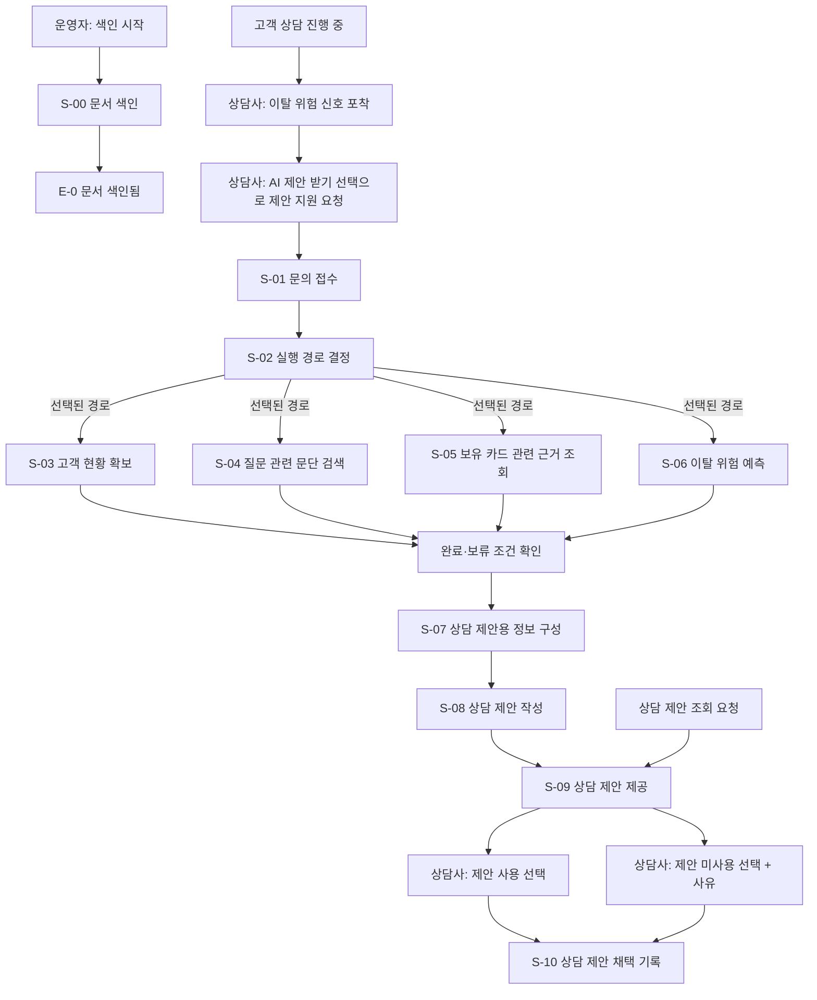

# 이탈위험 대응 상담 시스템 - 유저스토리

이 시스템의 목표는 고객 상담 중 상담사가 이탈 위험 신호를 포착했을 때,  
해당 고객을 응대하는 데 필요한 상담 제안을 상담사에게 제공하는 것입니다.  
상담사는 진행 중인 고객 상담에서 이탈 위험 신호를 포착하면 시스템 사용을 시작하고,  
고객의 질문·현황과 관련 근거를 바탕으로 작성된 제안 사항·이탈 확률·근거·주의사항을 확인해 고객 응대에 활용합니다.  
상담사는 제안을 사용할지 여부를 선택하고, 시스템은 그 선택을 채택 기록으로 남깁니다.

다른 대화에서도 요구사항의 맥락을 이어갈 수 있도록 첨부 이벤트 모델링과 논리 설계 6장의 내용을 정리했습니다.  
예제 문서의 서비스별 유저스토리와 시나리오 형식을 따르며, 원본의 식별자를 함께 남깁니다.  
첨부 자료의 명령형 문장은 시스템이 수행할 업무를 설명하는 자료로 해석했습니다.

- [시스템 목표와 사용 시점](#시스템-목표와-사용-시점)
- [작성 기준과 자료](#작성-기준과-자료)
- [서비스 구성과 업무 경계](#서비스-구성과-업무-경계)
- [전체 업무 흐름과 추적표](#전체-업무-흐름과-추적표)
- [유저스토리](#유저스토리)
- [공통 데이터와 외부 연계 요구사항](#공통-데이터와-외부-연계-요구사항)
- [미확정 사항](#미확정-사항)

## 시스템 목표와 사용 시점

고객과 상담을 진행하다 보면 상담사가 고객의 이탈 위험 신호를 포착하는 상황이 생깁니다.  
이때 상담사가 해당 고객에게 어떻게 응대할지 판단할 수 있도록 상담 제안을 제공하는 것이 시스템의 목적입니다.  
시스템의 직접 사용자는 상담사이며, 제공된 제안을 고객 응대에 활용하는 주체도 상담사입니다.

| 구분 | 정의 |
|---|---|
| 목표 | 이탈 위험 신호를 포착한 상담사에게 해당 고객을 응대할 상담 제안 제공 |
| 사용 상황 | 상담사가 고객과 상담을 진행하고 있는 상황 |
| 업무상 시작 계기 | 진행 중인 상담에서 상담사가 이탈 위험 신호를 포착한 경우 |
| 시스템 사용 시작 | 상담사가 회원·질문 정보를 전달하고 문의 접수 화면의 ‘AI 제안 받기’ 선택(UT-1) |
| 제공 결과 | 고객의 질문·현황과 관련 근거에 기반한 제안 사항, 이탈 확률, 근거, 주의사항 |
| 결과 활용 | 상담사가 제안을 검토해 ‘제안 사용’ 또는 ‘제안 미사용’을 선택(UT-2·UT-3)하고 고객 응대에 활용 |

여기서 UT-1의 ‘AI 제안 받기’는 이미 진행 중인 고객 상담에서 이 시스템의 제안 지원을 요청하는 동작입니다.  
S-01의 ‘문의 접수’는 그 요청을 시스템에 접수하는 단계로 해석합니다.  
이탈 위험 신호의 포착은 상담사가 시스템을 사용하게 되는 선행 상황이며, 이 문서에서 별도 자동 감지 기능을 뜻하지 않습니다.

시스템 사용이 시작된 뒤에는 실행 경로에 따라 고객 현황과 문서·상담 근거를 확보하고,  
필요한 경우 S-06의 예측형 AI로 이탈 위험을 추가 분석하여 제안 작성에 활용합니다.  
따라서 상담사의 신호 포착과 S-06의 위험 예측은 시점과 역할이 다릅니다.

운영자의 문서 색인은 이러한 상담 제안을 뒷받침할 검색 자료를 준비하는 별도 업무입니다.  
시스템은 규칙 기반 처리, 예측형 AI, 생성형 AI를 연결해 상담사가 사용할 제안을 구성합니다.

## 작성 기준과 자료

### 자료의 범위

이벤트 모델링과 논리 설계에 기반하여 작성

### 표기와 확정 수준

`UFR-*`는 이 문서에서 부여한 요구사항 ID입니다. `S-*`, `UT-*`, `AT-*`, `C-*`, `E-*`, `P-*`,
`TB-*`, `SL-*`, `U-*`, `V-*`는 첨부 자료의 식별자입니다.

| 표기 | 의미 |
|---|---|
| S | 하나의 업무 단위인 슬라이스 |
| UT | 사용자의 화면 선택으로 시작하는 트리거 |
| AT | 이벤트나 조건을 받아 자동으로 시작하는 트리거 |
| C | 시스템에 요청하는 작업인 커맨드 |
| E | 작업 결과로 발생한 사실을 나타내는 이벤트 |
| U | 화면 |
| V | 화면에 필요한 데이터를 모은 읽기 모델 |
| P | 논리 설계에서 결정한 배포 단위 |
| TB | 사용자·당사·연계 시스템·외부 사업자를 나누는 통제 경계 |
| SL | 자료에 표시된 정보 분류 |

원본에서 확인되는 동작은 요구사항으로 작성하고, 원본의 충돌이나 빈칸은 마지막 절에 분리합니다.  
Biz중요도와 스토리 포인트는 팀 합의 근거가 없어 각각 미정·미산정으로 표기함.  

## 서비스 구성과 업무 경계

### 사용자와 서비스의 역할

고객은 상담사에게 상담 질문과 본인확인 정보를 전달하고 상담 안내를 받습니다.  
상담사는 고객 상담 중 이탈 위험 신호를 포착하면 시스템에 제안 지원을 요청하고,  
시스템이 제공한 상담 제안을 검토해 사용 여부를 선택하고 해당 고객 응대에 활용합니다.  
고객이 시스템에 직접 접속하는 화면이나 고객에게 제안을 자동 전송하는 기능은 자료에 정의되어 있지 않습니다.

| 역할 | 행동 |
|---|---|
| 고객 | 상담 질문·본인확인 정보 전달, 상담 안내 수신 |
| 상담사 | 상담 중 이탈 위험 신호 포착, AI 제안 받기 선택, 문의 접수, 상담 제안 수신·조회·검토, 제안 사용·미사용 선택, 고객 응대에 활용 |
| 운영자 | 대상 문서 경로를 지정해 색인 시작 선택 |

### 화면 구성

| 화면 | 구성 | 사용자 선택 |
|---|---|---|
| U-1 문의 접수 | 회원·질문 정보 입력 | ‘AI 제안 받기’(UT-1) |
| U-2 검토 | 제안 사항, 이탈 확률, 근거, 주의사항 4개 섹션 | ‘제안 사용’(UT-2), ‘제안 미사용’(UT-3) |

### 마이크로서비스 구성: 논리 설계의 배포 단위

운영 비용과 복잡도를 고려해 다음 세 배포 단위로 결정합니다.  
이 문서의 서비스 구분은 이 결정을 따르며, 별도의 제품명이나 구현 기술을 추가하지 않습니다.

#### 배포 단위
| 배포 단위 | 서비스 | 담당 업무 | 관련 슬라이스 |
|---|---|---|---|
| P-1 | 상담 오케스트레이션 | 상담 진행 관리, 실행 경로 조율, 상담 제안용 정보 구성·작성, 제안 채택 기록 | S-01, S-02, S-07 ~ S-10 |
| P-2 | 상담 근거 탐색 | 고객 현황, 지식 검색, 이탈 위험 예측 | S-03 ~ S-06 |
| P-3 | 문서 색인 | 색인 요청, 색인 생성·갱신 | S-00 |

#### 배포단위 간 통신

| 연결 | 관계 | 통신 |
|---|---|---|
| P-1 ↔ P-2 | 상담 근거 탐색 요청·응답 | 동기 방식 |
| P-2 → P-3 | 색인 조회 | 벡터DB는 로컬경로 공유, 그래프DB는 API 동기 호출 |
| MQ ↔ P-3 | 색인 요청·수행 | 비동기 방식; 요청·완료·실패 이벤트 전달 |

MQ는 색인 작업 메시지를 전달하는 구성요소입니다. 별도의 업무 서비스로 추가하지 않습니다.  
MQ 요청 발행 주체와 완료·실패 이벤트의 소비 주체는 자료에 명시되어 있지 않습니다.

## 전체 업무 흐름과 추적표

문서 색인은 운영자가 시작하는 별도 흐름입니다.  
고객 상담 중 상담사가 이탈 위험 신호를 포착하면 이 시스템의 제안 지원을 요청합니다.  
시스템은 그 요청을 문의로 접수하고, 실행 경로를 결정한 뒤 필요한 상담 정보를 확보합니다.  
정보를 취합·선별해 제안을 작성하고, 제안의 제공과 상담사의 채택 여부를 각각 기록합니다.

그림에서 이탈 위험 신호 포착은 상담사의 업무상 시작 계기이고, ‘AI 제안 받기’ 선택은 시스템 실행 트리거입니다.  
상담사는 U-2 검토 화면에서 제안을 검토해 진행 중인 고객 응대에 활용하며,  
시스템은 ‘제안 사용’ 또는 ‘제안 미사용’ 선택을 S-10의 채택 기록으로 남깁니다.

그림의 분기는 A4의 ‘조건에 따라 병렬’을 나타냅니다. 모든 경로를 무조건 동시에 실행한다는 뜻은 아닙니다.  
S-05에는 카드ID, S-06에는 고객 현황이 필요하므로 실행 시점에는 각 입력이 준비되어야 합니다.  
취합은 선택된 경로만 기다리며, 필수 경로는 완료하고 예측은 완료 또는 보류 상태이면 진행합니다.  

| 슬라이스 | 유저스토리 ID | 스윔레인 | 
|---|---|---|
| S-00 | UFR-IDX-010 | 문서 색인; A4 매트릭스 밖의 별도 흐름 |
| S-01 | UFR-ORCH-010 | 상담 진행 관리 |
| S-02 | UFR-ORCH-020 | 실행 경로 관리 | 
| S-03 | UFR-EVID-010 | 고객 현황 조회 | 
| S-04 | UFR-EVID-020 | 지식 검색 |
| S-05 | UFR-EVID-030 | 지식 검색 | 
| S-06 | UFR-EVID-040 | 이탈 위험 예측 |
| S-07 | UFR-ORCH-030 | 상담 제안 작성 | 
| S-08 | UFR-ORCH-040 | 상담 제안 작성 |
| S-09 | UFR-ORCH-050 | 상담 진행 관리 | 
| S-10 | UFR-ORCH-060 | 상담 진행 관리 | 

## 유저스토리

### 1. P-1 상담 오케스트레이션

#### UFR-ORCH-010: [문의 접수]

- **서비스:** P-1 상담 오케스트레이션  
- **ID:** UFR-ORCH-010  
- **Epic:** 상담 진행 관리  
- **Epic 설명:** 상담사의 제안 지원 요청 접수와 후속 처리에 필요한 상담 정보 생성  
- **유저스토리:** 상담사로서 | 나는 상담 중 포착한 이탈 위험 신호에 대응할 제안을 받기 위해 |  
  회원·질문 정보를 전달하고 제안 지원을 요청하고 싶습니다.  
- **Biz중요도:** 미정(팀 협의 필요)

**수용기준**

**시나리오명: 상담 중 이탈 위험 신호 포착 후 제안 지원 요청**

Given 상담사가 진행 중인 고객 상담에서 이탈 위험 신호를 포착한 상황에서 |  
When 회원·질문 정보를 전달하고 U-1의 ‘AI 제안 받기’를 선택하면 |  
Then 시스템은 제안 지원 요청을 문의로 접수하고 상담ID, 접수 시간, 권한 확인 결과를 생성합니다.

**체크리스트**

- [ ] 필수 입력: 회원ID, 상담 질문, 상담사ID  
- [ ] 업무상 선행 조건: 상담사의 이탈 위험 신호 포착; 시스템 처리 시작 조건: UT-1 선택  
- [ ] 문의 접수와 E-1 생성: 규칙 기반 코드 처리  
- [ ] E-1 구성: 상담ID, 접수 시간, 권한 확인 결과  
- [ ] 권한 확인 결과의 다음 실행 경로 결정 단계 전달 및 E-1에 따른 S-02 시작  
- [ ] 권한 거부 시 중단·안내 방식: 추후 정의

- **스토리 포인트:** 미산정(팀 추정 필요)

---

#### UFR-ORCH-020: [실행 경로 결정]

- **서비스:** P-1 상담 오케스트레이션  
- **ID:** UFR-ORCH-020  
- **Epic:** 실행 경로 관리  
- **Epic 설명:** 질문과 상담 제약에 따른 정보 확보 경로 및 대기 조건 결정  
- **유저스토리:** 상담사로서 | 나는 질문과 상담 제약에 맞는 정보를 확보하기 위해 |  
  필요한 실행 경로가 결정되기를 원합니다.  
- **Biz중요도:** 미정(팀 협의 필요)

**수용기준**

**시나리오명: 문의 접수 후 실행 경로 결정**

Given 문의가 접수된 상황에서 |  
When E-1이 발생하면 |  
Then 시스템은 질문을 해석하고 선택 경로, 필수 여부, 대기시간, 선택 이유를 정합니다.

**체크리스트**

- [ ] 입력: 질문, 권한 확인 결과, 상담 제약  
- [ ] 질문 해석: 생성형 AI 지원; 실행 경로 확정: 규칙 기반 코드 처리  
- [ ] 외부 LLM 질문 해석 시 공통 외부 LLM 전달 제한 적용  
- [ ] 선택 후보: 고객 현황 확보, 질문 관련 문단 검색, 보유 카드 관련 근거 조회, 이탈 위험 예측  
- [ ] E-2 구성: 선택 경로, 필수 여부, 대기시간, 선택 이유  
- [ ] 각 정보 확보 업무의 시작 조건: E-2 발생과 해당 경로 선택  
- [ ] 경로 선택 규칙, 필수 여부 판정 기준, 대기시간 수치: 추후 정의

- **스토리 포인트:** 미산정(팀 추정 필요)

---

#### UFR-ORCH-030: [상담 제안용 정보 구성]

- **서비스:** P-1 상담 오케스트레이션  
- **ID:** UFR-ORCH-030  
- **Epic:** 상담 제안 작성  
- **Epic 설명:** 고객 상황과 검색·예측 결과의 취합을 통한 출처 기반 제안 정보 구성  
- **유저스토리:** 상담사로서 | 나는 질문과 고객 상황에 맞는 제안을 받기 위해 |  
  검색·예측 결과 중 사용할 정보가 출처와 함께 선별되기를 원합니다.  
- **Biz중요도:** 미정(팀 협의 필요)

**수용기준**

**시나리오명: 상담에 사용할 정보 취합과 선별**

Given 정보 확보 업무가 취합 시작 조건을 충족한 상황에서 |  
When AT-6이 시작되면 |  
Then 규칙 기반 코드는 결과를 취합하고 제안에 사용할 정보와 제외할 정보를 구분합니다.

**체크리스트**

- [ ] 대기 대상: E-2에서 선택된 경로만 포함  
- [ ] 취합 시작 조건: 선택된 필수 경로 완료; 예측 경로 완료 또는 보류 상태 허용  
- [ ] 선택되지 않은 경로: 대기 대상 제외 및 실행·완료 기록 금지  
- [ ] 입력: 실행 경로와 필수 여부, 고객 현황, 질문 관련 문단, 보유 카드 관련 문서·상담 근거,  
  이탈 위험 예측 결과 또는 처리 상태, 고객 요청과 제약  
- [ ] 검색·예측 결과의 취합 및 사용할 정보 선별: 규칙 기반 코드 처리  
- [ ] 제외 정보와 제외 이유의 별도 구분; 예측 보류 상태와 예측 결과값의 별도 구분  
- [ ] 결과: 상담 제안 정보 ID, 선별한 고객 현황, 관련 문서·문단, 관련 상담 근거,  
  이탈 위험 예측 결과 또는 보류 상태, 제외 정보·이유, 정보별 출처, 주의사항  
- [ ] 비필수 경로 대기시간, 예측 보류 조건, 구체적인 정보 선별 기준: 추후 정의

- **스토리 포인트:** 미산정(팀 추정 필요)

---

#### UFR-ORCH-040: [상담 제안 작성]

- **서비스:** P-1 상담 오케스트레이션  
- **ID:** UFR-ORCH-040  
- **Epic:** 상담 제안 작성  
- **Epic 설명:** 선별된 정보를 바탕으로 한 상담 제안 초안 생성, 검증 및 저장  
- **유저스토리:** 상담사로서 | 나는 이탈 위험 신호가 포착된 고객을 응대하기 위해 |  
  근거와 주의사항을 포함한 상담 제안을 받고 싶습니다.  
- **Biz중요도:** 미정(팀 협의 필요)

**수용기준**

**시나리오명: 선별된 정보로 상담 제안 작성**

Given 상담 제안용 정보가 구성된 상황에서 |  
When E-7이 발생하면 |  
Then 생성형 AI는 초안을 만들고 규칙 기반 코드는 이를 검증·저장하여 상담 제안을 작성합니다.

**체크리스트**

- [ ] 입력: E-7 결과  
- [ ] 외부 LLM 역할: 상담 제안 초안 생성  
- [ ] 외부 LLM 전달 전 식별자·민감정보 제거 또는 대체: 공통 전달 제한 적용  
- [ ] 생성 초안의 검증·저장: 규칙 기반 코드 처리  
- [ ] E-8 구성: 상담제안ID, 제안 내용, 근거 참조, 주의사항  
- [ ] 제안 작성 사실과 상담사 제공·채택 사실의 별도 구분  
- [ ] 검증 세부 규칙과 검증 실패 시 처리 방식: 추후 정의

- **스토리 포인트:** 미산정(팀 추정 필요)

---

#### UFR-ORCH-050: [상담 제안 제공]

- **서비스:** P-1 상담 오케스트레이션  
- **ID:** UFR-ORCH-050  
- **Epic:** 상담 진행 관리  
- **Epic 설명:** 작성된 상담 제안의 제공·재조회와 제공 이력 기록  
- **유저스토리:** 상담사로서 | 나는 작성된 제안을 상담에 활용하기 위해 |  
  해당 상담의 제안 데이터를 받거나 다시 조회하고 싶습니다.  
- **Biz중요도:** 미정(팀 협의 필요)

**수용기준**

**시나리오명: 작성된 제안 제공**

Given 상담 제안이 작성된 상황에서 |  
When E-8 완료를 받으면 |  
Then 시스템은 제안 데이터를 제공하고 제공 이력을 기록합니다.

**체크리스트**

- [ ] 작성 완료된 해당 상담 제안 데이터 제공  
- [ ] 제공 이력 E-9 생성

**시나리오명: 조회 요청에 따른 제안 제공**

Given 상담 제안 조회 요청이 도착한 상황에서 |  
When 시스템이 해당 요청을 처리하면 |  
Then 시스템은 요청한 제안 데이터를 제공하고 이번 제공의 이력을 기록합니다.

**체크리스트**

- [ ] 조회 요청 입력: 요청ID, 상담ID, 상담제안ID, 요청자ID  
- [ ] 요청 대상 제안 데이터 제공과 이번 제공 이력 E-9 생성

**공통 체크리스트**

- [ ] 제안 데이터 제공 및 제공 이력 기록: 규칙 기반 코드 처리  
- [ ] E-9 구성: 요청ID, 상담제안ID, 제공 시각, 요청자ID, 제공 출처  
- [ ] 제공 출처 구분: 저장소, 캐시, 체크포인트; 세 방식 모두의 구축 의무 아님  
- [ ] 제공 데이터의 U-2 검토 화면 4개 섹션 충족: 제안 사항, 이탈 확률, 근거, 주의사항(V-3)  
- [ ] 제공 이력 E-9와 상담사의 열람·채택 사실의 별도 구분

- **스토리 포인트:** 미산정(팀 추정 필요)

---

#### UFR-ORCH-060: [상담 제안 채택 기록]

- **서비스:** P-1 상담 오케스트레이션  
- **ID:** UFR-ORCH-060  
- **Epic:** 상담 진행 관리  
- **Epic 설명:** 상담사의 제안 사용 여부와 미사용 사유 기록  
- **유저스토리:** 상담사로서 | 나는 제안의 실제 사용 여부를 남겨 이후 품질 개선에 활용하기 위해 |  
  검토 화면에서 제안 사용 또는 미사용을 선택하고 싶습니다.  
- **Biz중요도:** 미정(팀 협의 필요)

**수용기준**

**시나리오명: 제안 사용 기록**

Given 상담사가 U-2 검토 화면에서 상담 제안을 검토한 상황에서 |  
When ‘제안 사용’을 선택하면 |  
Then 시스템은 채택여부=사용과 상담제안ID, 상담사ID, 기록 시각을 E-10으로 기록합니다.

**체크리스트**

- [ ] 채택여부=사용 기록  
- [ ] E-10의 상담제안ID, 상담사ID, 기록 시각 포함

**시나리오명: 사유와 함께 제안 미사용 기록**

Given 상담사가 U-2 검토 화면에서 미사용 사유를 입력한 상황에서 |  
When ‘제안 미사용’을 선택하면 |  
Then 시스템은 채택여부=미사용과 미사용 사유를 E-10으로 기록합니다.

**체크리스트**

- [ ] 채택여부=미사용 및 미사용 사유 기록  
- [ ] 미사용 사유 입력 방식: 선택형 사유 코드와 자유 입력; 사유 코드 목록 추후 정의

**시나리오명: 사유 없는 미사용 선택 보류**

Given 상담사가 미사용 사유를 입력하지 않은 상황에서 |  
When ‘제안 미사용’을 선택하면 |  
Then 시스템은 E-10을 기록하지 않고 미사용 사유 입력을 요청합니다.

**체크리스트**

- [ ] E-10 미기록 및 미사용 사유 입력 요청

**공통 체크리스트**

- [ ] 입력: 상담ID, 상담제안ID, 상담사ID, 채택여부(사용/미사용), 미사용 선택 시 필수인 미사용 사유  
- [ ] 채택 결과 기록: 규칙 기반 코드 처리  
- [ ] E-10 구성: 상담제안ID, 상담사ID, 채택여부, 미사용 사유, 기록 시각  
- [ ] 제공 기록 E-9와 채택 기록 E-10의 별도 구분  
- [ ] 채택여부의 의미: 해당 제안의 고객 응대 사용 여부; 고객 전달 완료·상담 종료 상태 제외  
- [ ] 동일 제안에 대한 채택 여부 재선택 허용 여부: 추후 정의

- **스토리 포인트:** 미산정(팀 추정 필요)

### 2. P-2 상담 근거 탐색

#### UFR-EVID-010: [고객 현황 확보]

- **서비스:** P-2 상담 근거 탐색  
- **ID:** UFR-EVID-010  
- **Epic:** 고객 현황 조회  
- **Epic 설명:** 고객의 보유 카드와 이용 현황 확보 및 기준시점 기록  
- **유저스토리:** 상담사로서 | 나는 고객이 가진 카드와 이용 현황을 고려하기 위해 |  
  조회 기준일에 맞는 고객 현황을 확보하고 싶습니다.  
- **Biz중요도:** 미정(팀 협의 필요)

**수용기준**

**시나리오명: 선택된 경로에서 고객 현황 조회**

Given E-2가 발생하고 고객 현황 확보 경로가 선택된 상황에서 |  
When AT-2가 시작되면 |  
Then 시스템은 사내 연계 시스템을 조회해 출처와 기준시점이 있는 고객 현황을 확보합니다.

**체크리스트**

- [ ] 입력: 회원ID, 조회 기준일  
- [ ] 고객정보계 조회: 회원ID와 조회 기준일 전달, 카드ID와 상품ID 수신  
- [ ] 카드이용계 조회: 회원ID와 카드ID 전달, 승인 사용액과 연체액 수신  
- [ ] 두 사내 연계 조회: 규칙 기반 코드 처리  
- [ ] E-3 구성: 카드ID, 상품ID, 승인 사용액, 출처, 연체액, 기준시점  
- [ ] 요청의 조회 기준일과 결과의 기준시점 구분·보존  
- [ ] E-3의 S-06 이탈 위험 예측 및 S-08 제안 작성 입력 활용

- **스토리 포인트:** 미산정(팀 추정 필요)

---

#### UFR-EVID-020: [질문 관련 문단 검색]

- **서비스:** P-2 상담 근거 탐색  
- **ID:** UFR-EVID-020  
- **Epic:** 지식 검색  
- **Epic 설명:** 접근 범위 안에서 상담 질문과 의미가 유사한 문단 후보 확보  
- **유저스토리:** 상담사로서 | 나는 고객의 질문에 답할 문서 근거를 찾기 위해 |  
  질문과 의미가 유사한 문단을 확보하고 싶습니다.  
- **Biz중요도:** 미정(팀 협의 필요)

**수용기준**

**시나리오명: 접근 범위 안에서 질문 관련 문단 확보**

Given E-2가 발생하고 문서후보 확보 경로가 선택된 상황에서 |  
When AT-3이 시작되면 |  
Then 시스템은 상담 질문과 의미가 유사한 문단 후보를 검색합니다.

**체크리스트**

- [ ] 입력: 질문, 회원ID, 접근 범위  
- [ ] 검색 수행: 규칙 기반 코드 처리; 접근 범위 입력 적용  
- [ ] 색인 조회 연결: P-2의 논리 설계 연결 사용  
- [ ] E-4 구성: 문서ID, 관련 문단, 유사도, 원문 위치, 버전  
- [ ] E-4의 문단 후보 성격과 S-07의 실제 제안 사용 정보 선별 구분  
- [ ] 검색 알고리즘, 검색 건수, 유사도 임계값: 추후 정의

- **스토리 포인트:** 미산정(팀 추정 필요)

---

#### UFR-EVID-030: [보유 카드 관련 문서와 상담 근거 조회]

- **서비스:** P-2 상담 근거 탐색  
- **ID:** UFR-EVID-030  
- **Epic:** 지식 검색  
- **Epic 설명:** 보유 카드와 연결된 상품 문서·상담 근거 및 관계 출처 확보  
- **유저스토리:** 상담사로서 | 나는 고객의 보유 카드에 연결된 근거를 활용하기 위해 |  
  상품 문서와 관련 상담 내용을 관계의 출처까지 함께 확인하고 싶습니다.  
- **Biz중요도:** 미정(팀 협의 필요)

**수용기준**

**시나리오명: 보유 카드에 연결된 근거 확보**

Given E-2가 발생하고 보유 카드 관련 근거 조회 경로가 선택된 상황에서 |  
When AT-4가 시작되면 |  
Then 시스템은 보유 카드에 연결된 상품 문서와 상담 근거를 조회합니다.

**체크리스트**

- [ ] 입력: 회원ID, 카드ID, 상담 질문, 조회 기준일, 접근 권한 범위  
- [ ] 보유 카드와 연결된 상품 문서·상담 근거 조회: 규칙 기반 코드 처리  
- [ ] 결과 관계: 회원-카드 보유, 카드-상품 연결과 상품ID, 회원·카드·상품·문서·상담 간 연결  
- [ ] 문서 결과: 문서ID, 버전, 유효기간, 관련 문단, 문단ID, 원문 위치  
- [ ] 상담 결과: 상담ID, 상담일, 관련 발언  
- [ ] 각 연결 관계의 출처 포함  
- [ ] 조회 기준일과 접근 권한 범위 입력 적용; 구체적 필터 규칙 추후 정의  
- [ ] 관계 포함 근거 조회 요구; 특정 그래프DB·GraphRAG 채택 여부 추후 정의

- **스토리 포인트:** 미산정(팀 추정 필요)

---

#### UFR-EVID-040: [이탈 위험 예측]

- **서비스:** P-2 상담 근거 탐색  
- **ID:** UFR-EVID-040  
- **Epic:** 이탈 위험 예측  
- **Epic 설명:** 고객 현황을 이용한 예측 기간별 이탈 위험 및 판단 신호 확보  
- **유저스토리:** 상담사로서 | 나는 이미 포착한 이탈 위험 신호에 대응할 제안을 보완하기 위해 |  
  예측 기간과 판단 신호가 있는 위험 예측을 받고 싶습니다.  
- **Biz중요도:** 미정(팀 협의 필요)

**수용기준**

**시나리오명: 고객 현황을 이용한 이탈 위험 예측**

Given E-2가 발생하고 이탈 위험 예측 경로가 선택된 상황에서 |  
When AT-5가 시작되면 |  
Then 예측형 AI는 회원과 고객 현황을 바탕으로 지정한 기간의 이탈 위험을 예측합니다.

**체크리스트**

- [ ] 입력: 회원ID, 고객 현황, 예측 기간  
- [ ] 업무상 선행 상황: 상담사의 이탈 위험 신호 포착과 시스템 사용 시작  
- [ ] 예측 수행 조건: 실행 경로의 이탈 위험 예측 선택  
- [ ] 예측 처리: 당사 예측AI 서비스 연계  
- [ ] E-6 구성: 이탈 확률, 위험 등급, 판단 신호, 예측 기간, 입력 데이터 기준시점  
- [ ] U-2 검토 화면의 ‘이탈 확률’ 섹션에 이탈 확률 제공  
- [ ] 위험 등급의 개수·이름·임계값과 예측 기간 기본값: 추후 정의

- **스토리 포인트:** 미산정(팀 추정 필요)

### 3. P-3 문서 색인

#### UFR-IDX-010: [문서 색인]

- **서비스:** P-3 문서 색인  
- **ID:** UFR-IDX-010  
- **Epic:** 문서 색인  
- **Epic 설명:** 상담 근거 검색에 필요한 문서 색인의 생성·갱신과 결과 기록  
- **유저스토리:** 운영자로서 | 나는 상담에 사용할 문서를 검색할 수 있게 준비하기 위해 |  
  대상 문서의 색인을 시작하고 싶습니다.  
- **Biz중요도:** 미정(팀 협의 필요)

**수용기준**

**시나리오명: 운영자의 문서 색인 시작**

Given 운영자가 대상 문서 경로를 지정한 상황에서 |  
When ‘색인 시작’을 선택하면 |  
Then 시스템은 문서를 색인하고 완료 시간과 원본 문서 경로를 남깁니다.

**체크리스트**

- [ ] 입력: 대상 문서 경로(A5 표기: 원본 문서 경로)  
- [ ] 문서 색인 수행: 규칙 기반 코드 처리  
- [ ] P-3 담당 범위: 색인 요청과 색인 생성·갱신  
- [ ] 색인 요청·수행: MQ 비동기 방식; 요청·완료·실패 메시지 구분  
- [ ] 온라인 상담과 독립된 실행 트리거 및 배포 단위 유지  
- [ ] E-0 구성: 색인 완료 시간, 원본 문서 경로  
- [ ] 색인 결과의 P-2 색인 조회 활용  
- [ ] 실패 이벤트 ID·내용 및 재시도 정책: 추후 정의

- **스토리 포인트:** 미산정(팀 추정 필요)

## 공통 데이터와 외부 연계 요구사항

### 통제 경계

| 경계 | 포함 대상 | 업무상 의미 |
|---|---|---|
| TB-1 외부 사용자 경계 | 고객, 상담사, 운영자 | 사용자와 시스템 사이의 입력·출력 구분 |
| TB-2 당사 통제 경계 | 이탈위험 대응 상담 시스템 | 문의 처리, 근거 확보 조율, 제안 작성·제공·채택 기록 |
| TB-3 사내 연계 시스템 경계 | 고객정보계, 카드이용계, 예측 AI 서비스 | 고객·카드 정보 조회와 위험 예측 연계 |
| TB-4 외부 AI 사업자 경계 | 외부 LLM | 질문 해석 지원과 상담 제안 초안 생성 |

### 경계별 전달 데이터

다음 표의 요청과 응답은 업무 데이터의 방향을 정리한 것입니다. API 경로나 JSON 스키마는 아직 정의하지 않습니다.

| 연결 | 요청·입력 | 응답·출력 |
|---|---|---|
| 고객 ↔ 상담사 | 상담 질문, 본인확인 정보 | 상담 안내 |
| 상담사 ↔ 상담 시스템 | 회원ID, 질문, 상담사ID, 채택여부, 미사용 사유 | 제안 사항, 이탈 확률, 근거, 주의사항 |
| 운영자 ↔ 상담 시스템 | 원본 문서 경로 | 색인 완료 시각 |
| 상담 시스템 ↔ 고객정보계 | 회원ID, 조회 기준일 | 카드ID, 상품ID |
| 상담 시스템 ↔ 카드이용계 | 회원ID, 카드ID | 승인 사용액, 연체액 |
| 상담 시스템 ↔ 예측 AI 서비스 | 회원ID, 고객 현황, 예측 기간 | 이탈 확률, 위험 등급; 상세 결과는 S-06 참조 |
| 상담 시스템 ↔ 외부 LLM | 민감정보 삭제·대체한 상담 질문, 선별된 근거 문단, 이탈위험 등급 | 제안 내용, 근거, 주의사항 |

LLM 연결은 주로 제안 작성의 입출력을 보여줍니다.  
S-02의 질문 해석 지원에 대한 상세 응답 형식은 정의되어 있지 않습니다.  
또한 S-08의 입력인 E-7 전체를 외부 LLM에 그대로 전송하는 것으로 해석하지 않습니다.  
고객 현황 조회는 화면 연결 없이 상담 시스템 내부 호출로만 사용됩니다.

### 화면과 읽기 모델

| 읽기 모델 | 사용 화면 | 필요 데이터 |
|---|---|---|
| V-3 | U-2 검토 | 제안 사항, 이탈 확률, 근거, 주의사항 |

### 외부 LLM 전달 제한

외부 LLM을 사용하기 전에 회원ID, 카드ID, 상담사ID, 상담ID를 제거하고 대체 ID를 사용합니다.  
상담 질문은 민감정보를 삭제·대체한 형태로 전달합니다.  
관계도에 명시된 제안 작성용 전달 내용은 이렇게 처리한 상담 질문, 선별된 근거 문단, 이탈위험 등급입니다.

이 제한은 S-02의 질문 해석과 S-08의 제안 작성에서 외부 LLM을 사용하는 경우에 함께 적용합니다.  
대체 ID 생성 규칙, 원본과의 매핑 보관 방식, 근거 문단 내부의 민감정보 판별 세칙은 추가 정의가 필요합니다.

### 정보 분류

| 분류 | 명칭 | 자료에 명시된 항목 |
|---|---|---|
| SL-1 | 개인정보 | 회원ID, 상담사ID |
| SL-2 | 상담정보 | 상담ID, 질문, 발언 |
| SL-3 | 금융정보 | 카드ID, 상품ID, 승인액, 연체액 |
| SL-4 | 추론정보 | 이탈 확률, 위험 등급, 판단 신호 |
| SL-5 | 내부업무정보 | 문서ID, 문단, 원문 위치, 버전 |

A1·A5의 연계 항목은 ‘승인 사용액’, A5의 SL-3 범례는 ‘승인액’이라고 표기합니다.  
이 문서에서는 업무 결과에 ‘승인 사용액’을 사용하고 범례의 표현도 위 표에 보존합니다.  
채택여부와 미사용 사유의 정보 분류는 자료에 정의되어 있지 않습니다.

### 결과를 구분하는 기준

| 구분할 값·기록 | 구분 이유 |
|---|---|
| 상담ID / 상담 제안 정보 ID / 상담제안ID | 문의, 선별된 정보 묶음, 작성된 제안은 서로 다른 결과물입니다. |
| 조회 기준일 / 데이터 기준시점 | 어느 날짜를 기준으로 요청했는지와 사용한 데이터가 어느 시점의 것인지 구분합니다. |
| 문서 버전 / 유효기간 / 원문 위치 | 어떤 문서의 어느 내용이 상담의 근거인지 확인할 수 있어야 합니다. |
| 이탈 확률 / 위험 등급 / 판단 신호 | 예측 수치, 위험 분류, 판단에 사용된 신호를 구분합니다. |
| 예측 결과 / 보류 상태 | 예측이 없는 상태를 실제 예측값으로 취급하지 않습니다. |
| E-8 작성 / E-9 제공 / E-10 채택 | 제안 생성, 데이터 전달, 상담사의 사용 여부 선택은 서로 다른 사실입니다. |
| 채택여부 사용 / 미사용과 사유 | 미사용은 사유와 함께 기록해야 제안 품질 개선 지표로 쓸 수 있습니다. |
| 정보별 출처 / 제공 출처 | 근거의 출처와 제안 데이터를 가져온 저장소·캐시·체크포인트는 다릅니다. |

## 미확정 사항

| 영역 | 자료에 없는 내용 |
|---|---|
| 입력 | 필수 입력의 형식·길이, 조회 기준일·예측 기간 기본값, 고객 요청·상담 제약의 수집 방식 |
| 실행 경로 결정 | 선택·필수 판정 규칙, 대기시간 수치, 미선택 경로를 표현할 상태값 |
| 취합·보류 | 필수 경로 실패 시 처리, 예측 보류 조건·기록, 지연 결과의 후속 반영 여부 |
| 데이터 선별 | 출처·유효기간·권한 검증 세칙, 정보 제외 기준과 주의사항 생성 규칙 |
| AI 결과 | 위험 등급 체계, 제안 검증 기준, 검증 실패 시 처리 |
| 채택 기록 | 미사용 사유 코드 목록, 자유 입력 길이, 채택 여부 재선택 허용 여부, 채택 지표 집계 방식 |
| 권한·민감정보 | 권한 거부 시 동작, 대체 ID·민감정보 처리 세칙, 채택여부·미사용 사유의 정보 분류 |
| 메시지·연계 | MQ 생산·소비 주체, 실패 이벤트 명세, API·메시지 스키마, 재시도·중복 처리 |
| 예외 처리 | 연계 실패·시간초과, 색인 없음·노후화, 검색 무결과, 제안 없음·작성 중 조회 시 처리 |
| 근거 원천 | 과거 상담 근거의 저장 시스템과 조회 방식, E-0과 MQ 완료 이벤트의 정확한 연결 |
| 식별자 전달 | E-8에 없는 요청ID·요청자ID 및 후속 상담ID를 연결하는 방식 |
| 화면·읽기 모델 | A4가 참조하는 슬라이스 상세표, V-3 외 읽기 모델 ID·구성, 화면 배치·상태 표시·오류 안내 |
| 저장·운영 | 데이터 저장 구조·보존 기간, 응답시간·동시처리량·가용성 목표 |
| 계획 | 유저스토리 우선순위와 개발 규모 |

이 항목들은 현재 요구사항을 보완하기 위한 후속 결정 목록이며, 임의의 기본값을 넣지 않았습니다.  
회원가입·로그인, 제안 편집·승인, 혜택 실행, 고객 자동 발송, 상담 종료 등의 기능은 범위 밖으로 정의하지 않습니다.  
구현 언어·프레임워크·DB·AI 모델·메시지 제품도 이번 문서에서 새로 선정하지 않습니다.
