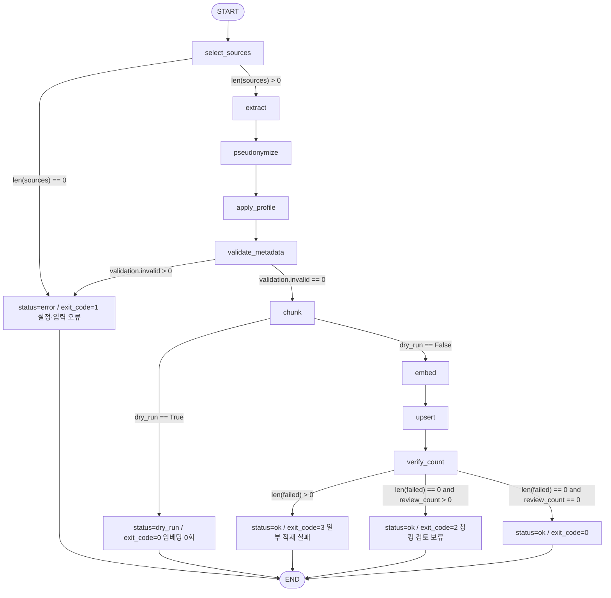
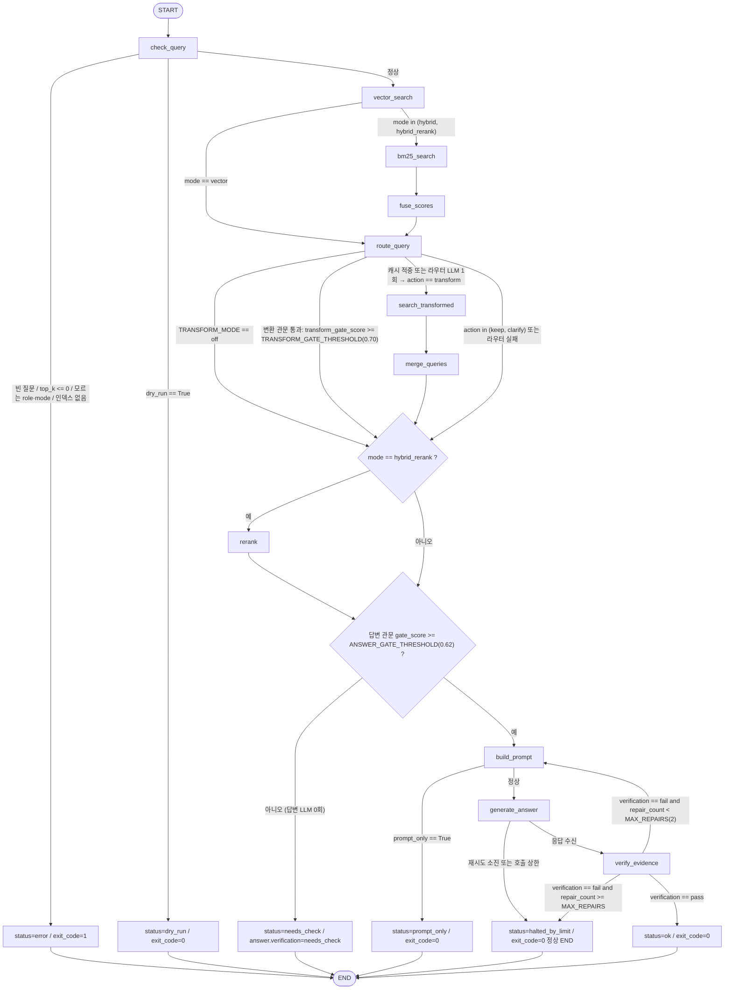

# 개발 계획서 (2단계) — LangChain·LangGraph 기반 Indexer·Retriever

작성: 클로니(총괄) 수렴. 초안 4건(플로니·지식니·커넥니·스택니)을 교차 대조하여 공유 계약으로 동결함.  
근거: `analysis.md`(1단계 분석·실측). 이 문서의 1절 "공유 계약서"는 G1 승인 후 변경 금지이며, 변경이 필요하면 팀원이
클로니에게 요청하고 클로니가 양쪽 반영을 확인함.

## 목차
0. G1 결정 요청 항목 (사용자 판단 필요)
1. 공유 계약서 (동결 대상)
2. Mermaid 워크플로우 2종
3. State 스키마 2종과 결과 JSON 대응
4. 노드 20개 계획서 (8항목)
5. 지식·데이터 설계 (자료형·인덱스·검색 시그니처·권한·평가셋)
6. LLM 어댑터·Config 설계
7. 계층 배치표·CLI 규격·requirements
8. Retriever HTTP API 규격·SSE 규격
9. 시험 계획 (Indexer 18건 이상 · Retriever 22건 이상)
10. 단계별 위임 계획과 예산

---

## 0. G1 결정 요청 항목

프롬프트 확정값과 실측 결과가 어긋나거나, 확정값만으로 결정할 수 없는 항목임. 클로니 권고안을 먼저 적음.

| # | 항목 | 실측·근거 | 권고안 | 대안 |
|---|---|---|---|---|
| G1-1 | `GET /answer/stream`의 체크포인터 | 동기 `SqliteSaver`로 컴파일한 그래프에 `astream_events`를 부르면 `NotImplementedError`(analysis.md 부록 F-3 실측) | **stream 경로만 체크포인터 없이**(`checkpointer=None`) 컴파일. 같은 빌더를 재사용하므로 노드 로직은 한 벌. CLI·POST는 동기 `SqliteSaver` 유지. 근거: stream은 사람이 보는 화면이라 끊기면 다시 질문하면 되고, 동기·비동기 saver가 같은 sqlite 파일을 동시에 쓰는 위험을 들이지 않음(플로니 권고) | 같은 빌더를 `AsyncSqliteSaver`(같은 파일, WAL)로 한 번 더 컴파일(재개 가능하나 스키마 호환·잠금 검증 필요) |
| G1-2 | "구조화 판정 max_tokens 256" | 원문 근거 검증(`verify_evidence`)은 기존 `evidence.py` 규칙 기반 대조를 승계하며 LLM 판정 호출이 없음. LLM 호출은 `generate_answer`(답변 2,000)만 | Config 키 `LLM_MAX_TOKENS_JUDGE`를 두지 않음(미사용 설정 금지). API 요청당 상한 2회 = 답변 1회 + 수정 재호출 1회로 해석 | 판정용 LLM 호출을 추가(요청당 호출이 3회가 되어 상한 2회와 충돌) |
| G1-3 | 임베딩 실행 장치 | CPU 임베딩 485건 486초(약 8분). RTX 4090 사용 시 수십 배 단축 예상이나 기존 기준선은 CPU였고 교육생 환경에 GPU 보장 없음 | CPU 기본 유지(`torch==2.14.0` CPU 빌드 핀). 최초 1회만 8분 소요, 이후 증분 적재 | CUDA torch를 별도 index-url로 설치(requirements에 플랫폼 분기 필요) |
| G1-4 | 공통 설정 모듈 배치 | 출력 파일 목록에 공통 모듈 자리가 없음. 두 앱은 독립 실행 예제임 | `app/settings.py`를 두 앱에 **동일 파일**로 배치(diff 0을 시험으로 보장). LLM 어댑터는 Retriever에만 둠(Indexer는 LLM 0회) | `vector/common/` 패키지 공유(앱이 독립 실행 예제가 아니게 됨) |
| G1-5 | 검색 후보 수 옵션 | 기존은 `--retrieve-k`(10)·`--judge-k`(3)·`--top-n`(5) 3개 이름. 목표 소유표는 `--top-k` 하나 | `--top-k` = 최종 건수(기본 5), 후보 수 = Top-K × 4 고정(프롬프트 확정값) | 옵션 추가(소유표 위반) |
| G1-6 | `verify_evidence` 실패 시 루프 상한 `MAX_REPAIRS` | 프롬프트: 루프 상한 2회, 초과 시 `halted_by_limit`. 기존 s3.3은 1회 재호출. 재시도가 super-step을 소모하는 최악 가정에서도 2회면 23/25(플로니 계산) | `MAX_REPAIRS=2`(프롬프트 상한 그대로). 실제 재호출 횟수는 LLM 호출 예산(CLI 8회·API 요청당 2회)이 추가로 제한함 → API에서는 사실상 1회. 각 재호출은 `llm_calls`에 집계 | `MAX_REPAIRS=1`(기존 s3.3 동작과 동일) |
| G1-10 | 관문 0.62를 hybrid·hybrid_rerank의 융합 점수에 그대로 쓰면 작동하지 않음 | 기존 0.62는 코사인 유사도(`round(1-distance,3)`) 기준이고, 융합 점수는 후보 집합 최소-최대 정규화 후 가중합이라 1등이 거의 항상 0.6 이상. s3.3에는 관문 자체가 없음(플로니 소스 확인) | `Hit`에 `vector_score`(코사인 유사도)를 보존하고, 모든 mode에서 **최종 `hits` 중 `vector_score` 최댓값**(`gate_score`)에 0.62를 적용. BM25로만 올라온 청크는 `vector_score=None`으로 판정에서 제외 | 관문을 `vector` mode에만 적용(hybrid 경로는 근거 없는 답변을 막지 못함) |
| G1-11 | 오류 종료(exit 1) 시 `status` 값 | 5종(`ok`·`needs_check`·`halted_by_limit`·`dry_run`·`prompt_only`)에 오류용 값이 없어 `ok`로 보고하면 정직한 보고 위반 | `status` 값에 **`error`** 1종 추가(6종). `needs_check`는 유사도 관문 미달 전용 | `needs_check` 재사용(exit_code로만 구분) |
| G1-12 | `hybrid_rerank` 동등성 합격 기준 | **해소됨.** 사용자 지시로 질문 변환이 범위에 들어오면서 기존 실측 4종이 모두 기준선이 됨(`vector` 6/7·2.125, `hybrid` 6/7·2.375, `transform+hybrid` 7/7·1.125, `transform+hybrid_rerank` 7/7·1.375) | 조합별 기준선과 나란히 비교(5-5절 표). 네 조합 모두 포함률 ≥ 기준선, 평균 순위 ≤ 기준선이면 통과 | — |
| G1-13 | 질문 변환 범위 편입 (사용자 지시) | 원 프롬프트는 "s3.3의 적응형 검색·질문 변환·LLM 라우팅 제외"였으나 사용자가 워크플로우에 명시하도록 지시함 | Retriever 노드 8 → **11**(`route_query`·`search_transformed`·`merge_queries` 추가). `--transform {off,auto}` 신설, 기본 `off`. 기법 5종(rewrite·multi·hyde·stepback·decomposition)과 가중 RRF 병합·decomposition 커버리지 이식. `rerank_each_query_and_merge()`도 함께 이식(원 프롬프트의 이식 제외 지시를 사용자 지시가 덮음) | — |
| G1-14 | 주요 숫자 Config 분리 (사용자 지시) | 검색·변환·청킹 숫자가 코드에 박히면 실험 조정이 불가 | 1-3-2절의 Config 표 33키로 분리. 노드 코드에 리터럴 숫자를 두지 않고 `settings.X` 참조. "고정"(동등성 기준)과 "조정"을 표에 구분 | — |
| G1-7 | LLM 타임아웃 60초 × 3시도와 총 대기 180초의 산술 충돌 | 60×3 + 백오프(1.2 + 2.4) = 183.6초 > 180초(커넥니 계산) | **마감(deadline) 방식**: 총 예산 180초를 먼저 정하고 마지막 시도의 타임아웃을 남은 시간으로 줄임(최악 정확히 180초). API 경로는 요청 마감 120초를 어댑터까지 내려보내 잔여 시간 안에서만 호출 | 60초 미만 남으면 재시도 안 함(최악 123.6초) |
| G1-8 | API 요청당 LLM 호출 상한 2회의 집계 단위 | CLI 상한 8회는 "재시도 포함"이 명시됨. API 2회는 단위 미명시. 전송 시도로 세면 429 한 번 맞고 재시도하면 품질 재호출 자리가 없음(커넥니) | **전송 시도 기준 2회**(프롬프트 문자 그대로). 첫 답변이 이미 있으면 상한 도달 시 429가 아니라 200 + `status="halted_by_limit"`으로 부분 결과 반환. 첫 답변조차 못 만들면 429 | 생성 호출 2회 + 전송 시도 6회로 분리 집계 |
| G1-9 | Groq `reasoning_effort` 미승계 | 기존 `groq_client.py:45`가 `GROQ_REASONING_EFFORT=medium`을 보냄. Config 19키에 없음 | 미승계(제공자 기본값 사용). 5단계 실측에서 지연이 예산(답변 15초)을 넘으면 키 추가를 재논의 | `GROQ_REASONING_EFFORT` 키 추가(20키) |

---

## 1. 공유 계약서 (동결 대상)

### 1-1. 그래프 구성과 실행 방식

| 항목 | 확정값 |
|---|---|
| 그래프 수 | 2개(Indexer·Retriever), 서브그래프·그래프 간 메시지 없음, 인덱스 컬렉션만 공유 |
| Indexer 노드(9) | `select_sources` → `extract` → `pseudonymize` → `apply_profile` → `validate_metadata` → `chunk` → `embed` → `upsert` → `verify_count` |
| Retriever 노드(11) | `check_query` → `vector_search` → `bm25_search` → `fuse_scores` → `route_query` → `search_transformed` → `merge_queries` → `rerank` → `build_prompt` → `generate_answer` → `verify_evidence` |
| 실행 config | `{"configurable": {"thread_id": ...}, "recursion_limit": 25}` |
| 실행 방식 | Indexer `invoke` / Retriever CLI·`POST /search`·`POST /answer` `invoke` / `GET /answer/stream` `astream_events(version="v2")`. 그 외(`stream`·`ainvoke`·`abatch`) 사용 금지 |
| 체크포인터 | Indexer `SqliteSaver` → `indexer/data/checkpoints/indexer.sqlite`. Retriever `SqliteSaver` → `retriever/data/checkpoints/retriever.sqlite`. stream 경로는 G1-1 |
| 루프 상한 | 노드마다 최대 2회. 상한 도달 시 예외 대신 `status="halted_by_limit"`로 정상 END |
| 검색 병렬성 | `vector_search`·`bm25_search`는 순차 실행(SSE 이벤트 순서 결정성, 체크포인트 단순화) |

### 1-2. 자료형 (문서 ↔ 청크 ↔ 검색 결과 ↔ 답변)

| 자료형 | 정의 | 원본 위치 |
|---|---|---|
| 문서 | `langchain_core.documents.Document(page_content: str, metadata: dict)`. 메타데이터 키는 `analysis.md` 부록 A-1 그대로 | s2.3 `documents.jsonl` |
| 청크 | `Document`이며 `id = chunk_id`, `metadata["chunk_id"] = chunk_id`. `chunk_id` 정본 = `{doc_key}_{index:04d}`(`D1_0000`, `D3_0000`). 추가 키는 부록 A-2 | s3.1 `chunks.jsonl` |
| `Hit`(Pydantic) | `chunk_id: str, score: float, vector_score: float \| None, rerank_score: float \| None, access_level: str, source: str, location: str, text: str, metadata: dict`. `score` = vector `round(1-distance, 3)` / hybrid 융합 점수(6자리). `vector_score` = 코사인 유사도(BM25로만 올라온 청크는 None). `location` = `clause_no`(D1·D2) 또는 `record_id` + ` 턴 ` + `turn_range`(D3) | s3.2 `models.Hit`, s3.3 `lab_cli` |
| `AnswerDraft`(LLM Structured Output 스키마) | `conclusion: str, caution: str, evidence: list[EvidenceDraft{ref: int, quote: str}]`. 앱 밖으로 나가지 않는 중간 자료형 | s3.2 `evidence.py` 입력 형식 |
| `Answer`(Pydantic, 최종) | `conclusion: str, caution: str, evidence: list[str]('{location} \| "{quote}"'), sources: list[str], verification: Literal["pass","fail","needs_check"], verification_errors: list[str], gate_score: float \| None` | s3.2 `evidence.py` 출력 형식 |
| `RouteDecision`(Pydantic, 라우터 Structured Output 스키마) | `action: Literal["clarify","keep","transform"], technique: Literal["rewrite","multi","hyde","stepback","decomposition"] \| None, queries: list[str], reason: str, clarification: str` | s3.3 `adaptive_search.RouteDecision` |
| Retriever 결과 `SearchResult` | `query, mode, transform, role, top_k, hits: list[Hit], answer: Answer \| None, prompt: str \| None, route{action, technique, transformed_queries, merge_weights, coverage_applied, gate_score, reason, error, clarification, cache_hit}, timings: dict, llm_calls: int, status: str, thread_id: str`. `timings` 키는 노드명 + `total_ms` | 신규(세 곳 공유) |
| Indexer 결과 `IndexResult` | `sources: int, extract{document_count, by_doc_type, consultation_mismatch, pseudonymized}, chunk{input_units, skipped, chunk_count, review_count, exception_count, by_doc}, index{collection_count, newly_embedded, skipped_by_hash, failed, embedding_dimension}, timings{extract_ms, chunk_ms, embed_ms, upsert_ms, total_ms}, status, exit_code, thread_id` | 프롬프트 예시 |
| API 전용 필드 | `request_id`(응답 최상위). 그 외 필드는 CLI 결과 JSON과 키·자료형 동일 | — |
| `status` 값 | `ok` · `needs_check`(관문 미달) · `halted_by_limit` · `dry_run` · `prompt_only` · `error`(설정·입력 오류, exit 1) | — |
| `chunk_id` 정본 | D1·D2 `{doc_key}_{index:04d}`(`D1_0010`), D3 `D3_{record_id}_{index:04d}`(`D3_C-20260302-002_0000`). `chunk` 노드의 저장 ID 재부여 단계 한 곳에서만 생성 | s3.1 `run_chunking.py:63,69`, 실데이터 |

규칙: **Pydantic 모델은 `app/application/state.py`에 1벌**만 두고 CLI(`model_dump`)·API(응답 모델)·State(같은 키 이름)가 공유함.  
State 필드명 = 결과 JSON 키. 이름을 바꾸려면 세 곳을 함께 바꿈.

### 1-3. Config 키 (두 앱 공통 `app/settings.py`)

우선순위: CLI 인자 → 환경변수 → 앱 `.env` → `hybrid-ai-lab/.env` → 기본값. **빈 문자열은 "없음"으로 보고 다음 단계로 내려감.**

| 키 | 기본값 | 읽는 앱 | 용도 |
|---|---|---|---|
| `CHROMA_PATH` | Indexer `<indexer>/data/chroma`, Retriever `<retriever>/../indexer/data/chroma` | 둘 다 | 벡터DB 경로(같은 폴더를 가리킴) |
| `CHROMA_COLLECTION` | `card_docs` | 둘 다 | 컬렉션명 |
| `EMBED_MODEL` | `nlpai-lab/KURE-v1` | 둘 다 | 임베딩 모델(1,024차원, cosine, 접두어 없음, normalize) |
| `RERANK_MODEL` | `BAAI/bge-reranker-v2-m3` | Retriever | 리랭커(max_length 512, 지연 로드) |
| `LLM_PROVIDER` | `groq` | Retriever | `groq` \| `claude` \| `openai` |
| `GROQ_API_KEY` / `GROQ_MODEL` | — / `openai/gpt-oss-120b` | Retriever | Groq |
| `CLAUDE_API_KEY` / `CLAUDE_MODEL` | — / `claude-opus-5` | Retriever | Claude. 키는 `CLAUDE_API_KEY` → `ANTHROPIC_API_KEY` 순으로 찾아 `api_key=`로 명시 전달 |
| `OPENAI_API_KEY` / `OPENAI_MODEL` | — / — (미설정 시 `LLMConfigError`) | Retriever | OpenAI |
| `LLM_TIMEOUT_SECONDS` | `60` | Retriever | LLM 호출 1회 타임아웃 |
| `LLM_MAX_TOKENS_ANSWER` | `2000` | Retriever | 답변 생성 |
| `MAX_LLM_CALLS_CLI` | `8` | Retriever | CLI 1회 실행 상한(`--max-llm-calls`로만 변경) |
| `MAX_LLM_CALLS_PER_REQUEST` / `MAX_LLM_CALLS_TOTAL` | `2` / `200` | Retriever(API) | 요청당·서버 누적 상한 → 429 |
| `REQUEST_TIMEOUT_SECONDS` | `120` | Retriever(API) | 요청 전체 제한 → 504 |
| `API_HOST` / `API_PORT` | `127.0.0.1` / `8001` | Retriever(API) | 바인딩. `0.0.0.0` 기본 금지 |

### 1-3-2. 조정 가능한 숫자 Config (코드에 숫자를 박지 않음)

검색·질문 변환·청킹의 주요 숫자는 모두 `app/settings.py`가 읽어 노드에 주입함. 노드 코드에는 리터럴 숫자를 두지 않고
`settings.X`를 참조하며, 숫자의 근거는 `settings.py` 주석에 적음.

"동등성" 열: **고정** = 기존 실측 재현에 쓰이는 값이라 실험 전 변경 금지(변경 시 `COMPARISON.md`에 기록) /
**조정** = 실험용으로 바꿔도 동등성 판정과 무관

| 키 | 기본값 | 읽는 앱 | 쓰는 곳 | 동등성 | 기존 소스 |
|---|---|---|---|:--:|---|
| **검색·융합** | | | | | |
| `TOP_K_DEFAULT` | `5` | Retriever | `--top-k` 기본값, 최종 건수 | 고정 | `s3.2/lab_cli.py:36` |
| `CANDIDATE_MULTIPLIER` | `4` | Retriever | 후보 수 = Top-K × 이 값 | 고정 | `s3.3/hybrid_search_ref.py:37` |
| `HYBRID_WEIGHT_BM25` | `0.4` | Retriever | 융합 가중치 | 고정 | `hybrid_search_ref.py:20` |
| `HYBRID_WEIGHT_VECTOR` | `0.6` | Retriever | 융합 가중치 | 고정 | `hybrid_search_ref.py:21` |
| `ANSWER_GATE_THRESHOLD` | `0.62` | Retriever | 답변 관문(Top-1 `vector_score`) | 고정 | `s3.2/src/answering.py:25` |
| `RERANK_MAX_LENGTH` | `512` | Retriever | CrossEncoder 입력 길이 | 고정 | `s3.3/src/rerank.py:16` |
| **질문 변환** | | | | | |
| `TRANSFORM_MODE` | `off` | Retriever | `off`(변환 안 함) \| `auto`(관문 미달 시에만 변환) | 조정 | `--transform` 신설 |
| `TRANSFORM_GATE_THRESHOLD` | `0.70` | Retriever | **변환 판단 관문.** 원 질문 Top-1 점수가 이 값 이상이면 변환하지 않음 | 고정 | `adaptive_search.py:227` |
| `TRANSFORM_RRF_K` | `60` | Retriever | 가중 RRF의 k. 순위 1위 점수 = 가중치/(k+1) | 고정 | `adaptive_search.py:179` |
| `TRANSFORM_ORIGINAL_WEIGHT` | `0.5` | Retriever | 일반 기법(rewrite·multi·hyde·stepback)의 원 질문 가중치 | 고정 | `run_rerank.py:139`, `adaptive_search.py:281` |
| `TRANSFORM_ORIGINAL_WEIGHT_DECOMPOSITION` | `0.1` | Retriever | **decomposition의 원 질문 가중치.** 하위 질문이 각 답을 대표하므로 원 질문은 보조 역할만 | 고정 | `run_rerank.py:142`, `rerank.py:18` |
| `TRANSFORM_PER_QUERY_TOP_K` | `3` | Retriever | decomposition에서 하위 질문마다 보장하는 상위 후보 수 | 고정 | `rerank.py:19` |
| `TRANSFORM_MULTI_COUNT` | `3` | Retriever | multi 기법의 변환 질의 개수(정확히 이 수) | 고정 | `adaptive_search.py:156` |
| `TRANSFORM_DECOMPOSITION_MIN` / `_MAX` | `2` / `4` | Retriever | decomposition 하위 질문 허용 개수 범위 | 고정 | `adaptive_search.py:158` |
| `TRANSFORM_CACHE_PATH` | `data/transform_cache.json` | Retriever | 변환 결과 캐시. 같은 질문 재실행 시 LLM 0회 | 조정 | `run_rerank.py --transform-cache` |
| `LLM_MAX_TOKENS_ROUTER` | `500` | Retriever | 변환 라우터 호출의 출력 상한 | 조정 | `s3.3/src/s32_bridge.py:54-56` |
| **그래프·루프** | | | | | |
| `RECURSION_LIMIT` | `25` | 둘 다 | `config={"recursion_limit": ...}` | 조정 | 프롬프트 확정값 |
| `MAX_REPAIRS` | `2` | Retriever | `verify_evidence → build_prompt` 루프 상한 | 조정 | 프롬프트 확정값 |
| **적재·청킹** | | | | | |
| `EMBED_BATCH_SIZE` | `32` | Indexer | 임베딩·적재 배치 크기 | 고정 | `indexing_ref.py:11` |
| `UPSERT_RETRY` | `1` | Indexer | 배치 재시도 횟수 | 고정 | `indexing_ref.py:26` |
| `CHUNK_MAX_CHARS` | `600` | Indexer | 청크 글자 상한 | 고정 | `run_chunking.py:130` |
| `CHUNK_OVERLAP` | `80` | Indexer | D1 중첩 | 고정 | `run_chunking.py:131` |
| `CHUNK_D2_OVERLAP` | `0` | Indexer | D2 중첩 | 고정 | `run_chunking.py:132` |
| `CHUNK_TURNS_PER_CHUNK` | `4` | Indexer | D3 턴 수 | 고정 | `run_chunking.py:133` |
| `CHUNK_OVERLAP_TURNS` | `1` | Indexer | D3 중첩 턴 | 고정 | `run_chunking.py:134` |
| `MAX_INPUT_TOKENS` | `8192` | Indexer | KURE-v1 토큰 한도 | 고정 | `s3.1/data/chunked/report.json` |
| **타임아웃(초)** | | | | | |
| `TIMEOUT_PDF_PER_FILE` / `TIMEOUT_CHUNK_PER_DOC` | `60` / `30` | Indexer | 노드 타임아웃 | 조정 | 프롬프트 확정값 |
| `TIMEOUT_EMBED_BATCH` | `120` | Indexer | 〃 | 조정 | 〃 |
| `TIMEOUT_VECTOR_SEARCH` / `TIMEOUT_RERANK` | `10` / `60` | Retriever | 〃 | 조정 | 〃 |

`.env.example`에는 위 키를 주석과 함께 모두 적되 값은 비움. 비어 있으면 표의 기본값을 씀.

`.env.example`에는 위 키 이름만 두고 값은 비움. 두 앱 `.gitignore`: `.env`, `.venv/`, `data/`, `__pycache__/`, `*.pyc`

### 1-4. 종료 코드 ↔ HTTP 상태 코드 ↔ `error_code`

| 종료 코드 | 뜻 | HTTP | `error_code` | 발생 조건 |
|---|---|---|---|---|
| 0 | 성공 | 200 | — | `status` ok·needs_check·prompt_only·dry_run |
| 1 | 설정·입력 오류 | 400 | `invalid_request` / `invalid_role` | 빈 질문, `top_k` 비양수, 잘못된 `mode`, `X-Role` 누락·모르는 값, 분리 건수 불일치, 프로필 금지 키, 원문 폴더 출력, 키 미설정, CLI 호출 상한 초과 |
| 2 | 청킹 검토 보류 발생 | — | — | Indexer `review_count > 0`(나머지 적재는 계속) |
| 3 | 일부 적재 실패 | — | — | Indexer `failed` 비어 있지 않음 |
| — | LLM 호출 상한 초과 | 429 | `llm_call_limit` | 요청당 2회·누적 200회 초과, 상류 429 재시도 소진 |
| — | 인덱스 없음·모델 미준비 | 503 | `index_unavailable` | 컬렉션 0건, 서명·cosine 불일치, 모델 로드 실패 |
| — | 요청 제한 시간 초과 | 504 | `timeout` | 120초 초과(진행 중 호출 중단) |
| — | 그 외 | 500 | `internal_error` | — |

오류 응답 본문: `{"error_code": str, "message": str, "detail": Any}`. FastAPI 기본 422는 핸들러로 400 + 위 형식으로 변환.

### 1-5. SSE 이벤트 ↔ 그래프 노드명

| 이벤트 | 발생 시점 | `data` |
|---|---|---|
| `node_start` | `astream_events` `on_chain_start`이며 `metadata.langgraph_node`가 있는 것(루트 `LangGraph` 제외) | `{"node": 노드명, "elapsed_ms": 누적}` |
| `node_end` | 같은 조건의 `on_chain_end` | `{"node": 노드명, "elapsed_ms": 누적, "hit_count": int(검색·리랭킹 노드만)}` |
| `final` | 그래프 종료 후 1회 | `POST /answer` 응답 본문과 같은 구조(`SearchResult` + `request_id`) |
| `error` | 예외 발생 시 1회 후 종료 | `{"error_code", "message", "detail"}` |
| (주석) | 15초마다 | `sse-starlette` `ping=15` 하트비트 |

이벤트의 `node` 값은 그래프 노드명 그대로임. **노드 이름이 바뀌면 SSE 이벤트도 함께 바뀜**(계약 관계).  
클라이언트가 끊으면(`request.is_disconnected()`) 그래프 실행을 취소하고 LLM을 더 호출하지 않음.

### 1-6. 고정값 승계표 (변경 금지)

| 구분 | 값 |
|---|---|
| 추출·정제 | 상담 분리 `[상담ID]` 머리글, 분리 건수 ≠ 머리글 수 → 오류 중단. 가명화 항상(옵션 없음). PDF 여백 제거(위 5.5%·아래 95%). 결과를 원문 폴더 하위에 저장 금지. 프로필이 `source·page·record_id·member_id·member_pseudo_id·pseudonymized` 덮어쓰기 → 오류. 파일별 SHA-256 → `manifest.json` |
| 청킹 | `max_chars` 600, `overlap` 80, D2 `overlap` 0, `turns_per_chunk` 4, `overlap_turns` 1, KURE-v1 토크나이저 8,192, `review.jsonl`·`exceptions.jsonl` 분리 |
| 적재 | KURE-v1 1,024차원, 접두어 없음, normalize, 토큰 초과는 실패 기록(자르지 않음). ChromaDB `PersistentClient`, cosine, `card_docs`, 배치 32, 배치 재시도 1회. 증분 적재(`index_manifest.json` = `{chunk_id: sha256(text)}`), `--full-reindex`는 컬렉션 삭제 후 전량 |
| 검색 | Top-K 5, 후보 Top-K × 4, Hybrid BM25 0.4 · Vector 0.6(후보 집합 최소-최대 정규화 후 가중합), BM25 토큰화 `split()`, 리랭커 Sigmoid·최종 Top-5, 관문 0.62(Top-1 `score`) |
| 권한 | `agent` → public·internal / `auditor` → public·internal·restricted / 그 외 오류. Chroma `where`(검색 전)와 BM25 후보(융합 후) 두 곳이 `domain/access.py` 규칙 하나를 호출 |
| 타임아웃 | PDF 1건 60초 · 청킹 1문서 30초 · 임베딩 배치 120초 · 벡터 검색 10초 · 리랭킹 60초 · LLM 60초. 모델 최초 로드는 제외·로그 기록 |
| 재시도 | 429·5xx·연결 오류만 지수 백오프 2회(초기 1초·배수 2·지터 ±20%), 4xx 재시도 없음, 노드 총 대기 180초 이내. LangChain 클라이언트 `max_retries=0` |
| 비용 | 원문 SHA-256 동일 시 추출·청킹 재사용, `--dry-run` 임베딩·LLM 0회, 동등성 7건은 `--prompt-only`(LLM 0회), 답변 실측은 대표 질문 1건 |

### 1-7. 계층 배치 원칙

| 계층 | 책임 | 파일(Indexer / Retriever) |
|---|---|---|
| `presentation/` | 옵션 해석·경로 결정·결과 안내·종료 코드·HTTP 변환 | `cli.py` / `cli.py`, `api.py` |
| `application/` | StateGraph 조립·노드 함수·State·Pydantic 결과 모델·Protocol | `graph.py`, `state.py`, `ports.py` / 동일 |
| `domain/` | 규칙(외부 I/O 금지) | `consultations.py`, `validation.py`, `chunking.py` / `scoring.py`, `access.py`, `query_transform.py` |
| `infrastructure/` | PDF·파일·Chroma·임베딩·BM25·리랭커·LLM·변환 캐시 | `pdf_reader.py`, `file_store.py`, `embedder.py`, `chroma_store.py` / `chroma_store.py`, `bm25_index.py`, `reranker.py`, `llm_client.py`, `transform_cache.py` |
| 공통 | Config 로딩 | `app/settings.py`(두 앱 동일 파일) |

라우트 함수·CLI 함수 안에 검색 방식 선택·점수 계산·권한 판정을 두지 않음. 응용 계층 함수 하나만 호출함.

### 1-8. 클로니 수렴 판정 (초안 이의에 대한 결정)

| # | 이의(제기자) | 결정 |
|---|---|---|
| R1 | `vector`·`hybrid` 모드에서 `hits`가 비게 됨(스택니) | 각 모드의 **마지막 검색 노드가 `hits`를 씀**: `vector` → `vector_search`, `hybrid` → `fuse_scores`, `hybrid_rerank` → `rerank`. SSE `hit_count`도 같은 규칙 |
| R2 | 응용 함수와 그래프 조립이 `graph.py`에 섞임(스택니) | 파일 추가 없이 `graph.py`를 `# --- 그래프 조립(플로니) ---`·`# --- 응용 함수(스택니) ---` 두 구역으로 나눔 |
| R3 | `halted_by_limit`의 종료 코드(스택니) | 재시도 루프 상한 도달 → `status="halted_by_limit"`, **종료 코드 0(정상 종료, 프롬프트 확정)**. `--max-llm-calls` 상한 초과는 별개로 `LLMCallLimitError` → CLI 종료 코드 1 / API 429 |
| R4 | Retriever CLI에 `--out`이 없음(스택니) | 옵션 소유표를 우선함. Retriever CLI는 **stdout JSON만** 출력하고 파일은 셸 리다이렉트로 저장(`> data/search_run1.json`). Indexer는 `--out/index_run{n}.json` 자동 번호(재실행 증명용) |
| R5 | 504 이후 스레드가 계속 돌 수 있음(스택니) | 노드·인프라 호출 단위 타임아웃이 실제 중단을 담당하고 504는 응답 마감선임을 README에 명시 |
| R6 | 브라우저 `EventSource`는 `X-Role` 헤더 불가(스택니) | 소비자는 CLI·`curl`·`httpx`로 한정. README에 `fetch` + `ReadableStream` 안내 한 줄 |
| R7 | `X-Role` 필수 헤더 422 vs 400(스택니) | `str \| None` 선택 헤더로 받아 표현 계층에서 누락·모르는 값 모두 400 `invalid_role`로 변환. `/docs` 설명에 "(필수)" 표기 |
| R8 | cosine 지정 키(지식니, 설치본 소스 확인) | `Chroma(collection_configuration={"hnsw": {"space": "cosine"}}, collection_metadata={"lab_embedding": 서명})`. `collection_metadata={"hnsw:space": ...}`는 cosine이 걸리지 않으므로 금지 |
| R9 | `embed`·`upsert` 분리 시 `add_documents`가 재임베딩함(지식니) | `VectorStorePort.upsert(ids, texts, embeddings, metadatas)`로 하부 컬렉션 `upsert`를 직접 호출. `add_documents`는 쓰지 않음 |
| R10 | D3 `chunk_id` 실제 형식(지식니, 실데이터 확인) | 정본 = D1·D2 `{doc_key}_{index:04d}`, **D3 `D3_{record_id}_{index:04d}`**(예 `D3_C-20260302-002_0000`). 기존 `chunks.jsonl` 485건과 동일 |
| R11 | `Answer`에 `caution`이 없어 검사 규칙 1개 소실(지식니) | LLM 스키마 `AnswerDraft{conclusion, caution, evidence[{ref, quote}]}`와 최종 `Answer{conclusion, caution, evidence[str], sources[str], verification, verification_errors}`를 분리. `caution` 승계 |
| R12 | `metadata["chunk_id"]` 저장은 부록 A 대비 키 1개 추가(지식니) | 저장함(읽기 경로 단순화, 검색 결과·순위 영향 없음). 부록 A-2 예외 항목으로 명시 |
| R13 | `documents`에 누적 Reducer를 걸면 3배로 불어남(플로니) | `documents`는 **덮어쓰기**. `extract → pseudonymize → apply_profile`이 변형 후 교체하는 구조 |
| R14 | `vectors`를 State에 두면 체크포인트 약 4 ~ 12MB(플로니) | `embed`가 `data/embeddings/{thread_id}.npy`에 저장하고 State에는 `vectors_path`·`pending_ids`만 둠 |
| R15 | exit 2와 exit 3 동시 성립(플로니) | 우선순위 1 > 3 > 2. 결과 JSON에는 `chunk.review_count`·`index.failed`를 둘 다 채움 |
| R16 | 동등성 평가 실행 역할(지식니 `auditor` 제안) | `agent`(기본값) 사용. 정답 2종이 모두 `public`이라 결과 동일하며 README 예시와 같은 명령을 유지. 채점 스크립트는 `retriever/eval_equivalence.py`(추가 파일, G1-4에 병기) |
| R17 | `Hit` 필드 통합(플로니 `vector_score` + 지식니 `source·location`) | `Hit{chunk_id, score, vector_score, rerank_score, access_level, source, location, text, metadata}` 9필드로 확정(1-2절 갱신) |

---

## 2. Mermaid 워크플로우 2종 (플로니 초안 수렴)

### 2-1. Indexer (9노드)



- 정상 전량 경로 9 super-step. 되돌아오는 엣지 없음(노드 단위 배치 루프는 16배치 × 3노드 = 48 > 25라 금지)  
- `extract`·`pseudonymize`·`apply_profile` 안의 검증 실패(분리 건수 불일치·가명화 항목 누락·프로필 금지 키)는 예외로 그래프를
  중단하고 표현 계층이 잡아 `status=error`·exit 1로 기록함  
- 종료 코드 우선순위 1 > 3 > 2(R15)

### 2-2. Retriever (11노드 — 질문 변환 포함)



두 관문의 구분(가장 헷갈리는 지점이므로 계약에 명시)

| 관문 | 위치 | 기준값 Config | 보는 점수 | 미달 시 |
|---|---|---|---|---|
| **변환 판단 관문** | `route_query` 진입 | `TRANSFORM_GATE_THRESHOLD` 0.70 | `transform_gate_score` = 원 질문 검색 Top-1 `score` | 질문을 변환해 다시 검색함(라우터 LLM 1회) |
| **답변 관문** | `generate_answer` 진입 전 | `ANSWER_GATE_THRESHOLD` 0.62 | `gate_score` = 최종 `hits`의 `vector_score` 최댓값 | 답변 LLM을 부르지 않고 `needs_check`로 종료 |

#### 답변 관문이 `score`가 아니라 `vector_score`를 보는 이유 (G1-10)

관문 0.62는 원래 **코사인 유사도** 기준으로 정해진 값임(`s3.2/src/retrieval_ref.py:41`의 `round(1 - distance, 3)`).
뜻이 얼마나 비슷한지를 0 ~ 1로 잰 **절대 점수**임.

그런데 Hybrid의 `score`는 성격이 다름. 후보를 모아 놓고 그 안에서 1등을 1.0, 꼴등을 0.0으로 다시 펴는
**최소-최대 정규화**를 거친 뒤 가중합한 값임(`s3.3/src/hybrid_utils.py:57-68`). 정의상 1등은 실제 관련성과 무관하게
거의 항상 높은 값을 받음.

| 상황 | 실제 코사인 유사도 | `vector` 모드 `score` | `hybrid` 모드 `score` | 0.62 관문 판정 |
|---|---:|---:|---:|---|
| 관련 있는 질문 | 0.81 | 0.81 | 약 1.0 | 둘 다 통과 (정상) |
| **엉뚱한 질문** | 0.21 | 0.21 | **약 1.0** | `vector` 차단 / **`hybrid` 통과(오작동)** |

즉 씨앗대로 `hits[0].score`에 0.62를 걸면 Hybrid·Rerank 경로에서는 관문이 사실상 꺼진 상태가 되어
근거가 없는데도 답변 LLM을 부르게 됨. 덧붙여 기존 s3.3에는 이 관문 코드 자체가 없어 "기존 동작 승계"라는 근거도 없음
(`grep -n "THRESHOLD\|0\.62" s3.3/src/answering.py` 0건).

**계약**: `Hit`에 코사인 유사도를 `vector_score`로 따로 보존하고, 관문은 **모든 mode에서
`gate_score = max(h.vector_score for h in hits if h.vector_score is not None)`** 로 판정함.
BM25로만 올라온 청크는 `vector_score`가 `None`이라 판정에 기여하지 않음. `hits`가 비었거나 `vector_score`가 전부 `None`이면
`gate_score = None`으로 두고 관문 미달로 처리함. 이렇게 하면 0.62가 세 mode에서 같은 뜻이 되고 s3.2 동작과 수치가 일치함.

- super-step: `TRANSFORM_MODE=off`이면 `vector` 6 · `hybrid` 8 · `hybrid_rerank` 9.
  변환이 일어나면 `search_transformed`·`merge_queries` 2개가 더해져 최대 11. 답변 루프 2회 +6 → **최대 17 ≤ 25**
- `search_transformed`는 변환 질의 2 ~ 4개를 **노드 안 루프**로 처리함(노드 단위 fan-out을 만들지 않아 super-step이 늘지 않음)
- 두 그래프를 합치면 9 + 17 > 25이므로 별개 StateGraph 2개 유지

### 2-3. 질문 변환 3노드 상세

| 노드 | 하는 일 | 쓰는 Config |
|---|---|---|
| `route_query` | 1) `TRANSFORM_MODE`가 `off`면 그대로 통과. 2) `transform_gate_score >= 0.70`이면 통과(변환 이득 없음). 3) 캐시(`TRANSFORM_CACHE_PATH`)에 이 질문의 결정이 있으면 재사용(LLM 0회). 4) 없으면 라우터 LLM 1회로 `action`(clarify·keep·transform)과 `technique`·`queries`를 받아 캐시에 저장 | `TRANSFORM_MODE`, `TRANSFORM_GATE_THRESHOLD`, `TRANSFORM_CACHE_PATH`, `TRANSFORM_MULTI_COUNT`, `TRANSFORM_DECOMPOSITION_MIN/_MAX`, `LLM_MAX_TOKENS_ROUTER` |
| `search_transformed` | 변환 질의마다 원 질문과 같은 경로(`mode`에 따라 vector 또는 hybrid)로 검색하여 후보 목록을 모음. 노드 안에서 순차 반복 | `CANDIDATE_MULTIPLIER`, `HYBRID_WEIGHT_*`, `TIMEOUT_VECTOR_SEARCH` |
| `merge_queries` | 원 질문 결과와 변환 결과를 **가중 RRF**로 병합. 원 질문 가중치는 `decomposition`이면 `0.1`, 그 외 `0.5`이고 나머지를 변환 질의 수로 나눔. `decomposition`이면 하위 질문별 상위 `TRANSFORM_PER_QUERY_TOP_K`(3)건을 결과에 보장함 | `TRANSFORM_RRF_K`, `TRANSFORM_ORIGINAL_WEIGHT`, `TRANSFORM_ORIGINAL_WEIGHT_DECOMPOSITION`, `TRANSFORM_PER_QUERY_TOP_K` |

가중 RRF 계산식(기존 `adaptive_search.weighted_rrf` 승계, `settings` 값만 주입)

```
original_weight    = TRANSFORM_ORIGINAL_WEIGHT_DECOMPOSITION if technique == "decomposition" else TRANSFORM_ORIGINAL_WEIGHT
transformed_weight = (1 - original_weight) / len(transformed_queries)
rrf_score(청크)    = Σ(목록별 가중치 / (TRANSFORM_RRF_K + 그 목록에서의 순위))
정렬              = (-rrf_score, 가장 좋은 순위, chunk_id)
```

지원 기법 5종과 질의 개수 규칙: `rewrite`·`hyde`·`stepback` 각 1개, `multi` 정확히 `TRANSFORM_MULTI_COUNT`(3)개,
`decomposition` `TRANSFORM_DECOMPOSITION_MIN`(2) ~ `_MAX`(4)개. 개수가 어긋나면 변환을 버리고 원 질문 결과를 그대로 씀
(기존 `adaptive_search.py:156-161`의 검증 규칙 승계, 실패 시 `keep`으로 격하하되 사유를 State `route_error`에 기록함 —
기존은 조용히 격하했으나 새 앱은 기록함)

`action == "clarify"`(핵심 대상을 문맥에서 복원할 수 없는 질문) 처리: 변환하지 않고 원 질문 결과를 유지한 뒤
결과 JSON에 `clarification`(사용자에게 되물을 한 문장)을 담아 `status="needs_check"`로 종료함. 답변 LLM을 부르지 않음.

---

## 3. State 스키마 2종과 결과 JSON 대응 (플로니 초안 수렴)

### 3-1. 공통 Reducer

```python
# app/application/state.py
import operator
from typing import Annotated, Any, Literal, TypedDict
from langchain_core.documents import Document

def merge_dict(left: dict, right: dict) -> dict:
    """나중 값이 이김. 서로 다른 키를 쓰는 사전(fingerprints)에 씀."""
    return {**left, **right}

def merge_timings(left: dict[str, int], right: dict[str, int]) -> dict[str, int]:
    """같은 노드가 루프로 두 번 돌면 걸린 시간을 합산함(덮어쓰지 않음)."""
    out = dict(left)
    for k, v in right.items():
        out[k] = out.get(k, 0) + v
    return out
```

### 3-2. IndexerState

```python
class IndexerState(TypedDict, total=False):
    # 입력(표현 계층이 채움, 덮어쓰기)
    input_path: str; output_path: str
    doc: Literal["D1", "D2", "D3", "all"]; segment: int | None
    backend: Literal["sentence-transformers", "smoke"]
    dry_run: bool; full_reindex: bool; thread_id: str
    profiles: dict[str, Any]; schema: dict[str, Any]
    force_fail_node: str | None                          # 재개 시험 전용 스위치
    # select_sources
    sources: list[str]                                   # 덮어쓰기
    # extract / pseudonymize / apply_profile
    documents: list[Document]                            # 덮어쓰기(R13)
    reports: Annotated[list[dict], operator.add]
    fingerprints: Annotated[dict[str, str], merge_dict]  # 파일명 → sha256
    pseudonymized: bool
    # validate_metadata
    validation: dict[str, Any]                           # {checked, invalid, errors}
    warnings: Annotated[list[str], operator.add]
    # chunk
    chunks: Annotated[list[Document], operator.add]
    reviews: Annotated[list[dict], operator.add]
    exceptions: Annotated[list[dict], operator.add]
    skipped: Annotated[list[dict], operator.add]
    input_units: int
    # embed (증분)
    pending_ids: list[str]; vectors_path: str            # R14: 벡터는 npy 파일
    newly_embedded: int; skipped_by_hash: int
    # upsert / verify_count
    ok_ids: Annotated[list[str], operator.add]
    failed: Annotated[list[dict], operator.add]          # {chunk_id, reason}
    count_before: int; count_after: int; accounting_ok: bool; embedding_dimension: int
    # 공통
    llm_calls: Annotated[int, operator.add]              # Indexer는 항상 0
    timings: Annotated[dict[str, int], merge_timings]
    status: Literal["ok", "dry_run", "error"]
    exit_code: int
```

결과 JSON `IndexResult`(표현 계층이 `build_index_result(state)`로 집계, 1-2절 구조):
`sources`(건수), `extract{document_count, by_doc_type, consultation_mismatch=0, pseudonymized}`,
`chunk{input_units, skipped, chunk_count, review_count, exception_count, by_doc}`,
`index{collection_count, newly_embedded, skipped_by_hash, failed, embedding_dimension}`,
`timings{extract_ms, chunk_ms, embed_ms, upsert_ms, total_ms}`, `status`, `exit_code`, `thread_id`

### 3-3. RetrieverState

```python
class RetrieverState(TypedDict, total=False):
    # 입력
    query: str; role: Literal["agent", "auditor"]
    mode: Literal["vector", "hybrid", "hybrid_rerank"]; top_k: int
    dry_run: bool; prompt_only: bool; max_llm_calls: int; thread_id: str
    force_fail_node: str | None
    # check_query
    index_info: dict[str, Any]                           # {collection, count, dimension, signature_ok}
    transform_mode: Literal["off", "auto"]               # --transform
    # 검색 3노드
    vector_hits: list[Hit]; bm25_scores: dict[str, float]; candidates: list[Hit]
    baseline_hits: list[Hit]                             # 원 질문 검색 결과(변환 병합의 기준 목록)
    hits: list[Hit]                                      # 최종 Top-K(R1: mode별 마지막 검색 노드가 씀)
    gate_score: float | None                             # 답변 관문용. 최종 hits의 vector_score 최댓값
    # 질문 변환 3노드
    transform_gate_score: float | None                   # 변환 판단용. 원 질문 Top-1 score
    route_action: Literal["off", "gate_pass", "keep", "clarify", "transform"]
    technique: str | None                                # rewrite/multi/hyde/stepback/decomposition
    transformed_queries: list[str]
    transformed_hit_groups: list[list[Hit]]              # 변환 질의별 검색 결과
    merge_weights: dict[str, float]                      # {original, transformed_each}
    coverage_applied: bool                               # decomposition 하위 질문 보장 적용 여부
    route_reason: str; route_error: str; clarification: str
    transform_cache_hit: bool                            # True면 라우터 LLM 0회
    # 답변 3노드
    prompt: str; raw_answer: dict[str, Any]              # AnswerDraft.model_dump()
    answer: dict[str, Any]                               # Answer.model_dump()
    repair_hints: Annotated[list[str], operator.add]
    repair_count: Annotated[int, operator.add]
    # 공통
    warnings: Annotated[list[str], operator.add]
    llm_calls: Annotated[int, operator.add]              # 전송 시도 수 누적
    timings: Annotated[dict[str, int], merge_timings]
    status: Literal["ok", "needs_check", "halted_by_limit", "dry_run", "prompt_only", "error"]
    exit_code: int
```

`Hit`·`Answer`·`AnswerDraft`·`SearchResult`·`IndexResult` Pydantic 모델은 같은 `state.py`에 둠(1-2절).  
결과 JSON `SearchResult`는 `build_search_result(state)`가 조립하며 CLI·POST·SSE `final`이 같은 함수를 씀.
`timings` 키는 노드명 그대로(`check_query, vector_search, bm25_search, fuse_scores, rerank, build_prompt, generate_answer,
verify_evidence`) + `total_ms`. 1-2절의 `embed_query_ms`·`search_ms` 등 축약 키는 쓰지 않고 노드명 키로 통일함(계약 갱신)

### 3-4. 체크포인트

| 앱·경로 | 체크포인터 | 파일 |
|---|---|---|
| Indexer CLI | `SqliteSaver(sqlite3.connect(path, check_same_thread=False))` + `PRAGMA journal_mode=WAL` | `indexer/data/checkpoints/indexer.sqlite` |
| Retriever CLI·POST | 같은 방식 | `retriever/data/checkpoints/retriever.sqlite` |
| `GET /answer/stream` | `checkpointer=None`(G1-1 권고) | — |

- `thread_id`: `--thread-id` 없으면 `idx-{YYYYMMDD-HHMMSS}-{uuid 8자}` / `ret-…`. API는 요청마다 `api-{request_id 8자}` 생성
- 재개 = `invoke(None, config)`만. 새 입력으로 같은 `thread_id`를 부르면 누적 Reducer가 두 배가 되므로 CLI는 체크포인트가 있는
  `--thread-id`에 새 입력이 오면 stderr 경고 후 `None`으로 재개함
- 재개 시험(부록 F 실측 방식): `--force-fail-node embed`로 강제 예외 → `update_state(config, {"force_fail_node": None})` →
  `invoke(None, config)` → 노드 로그(`data/logs/{thread_id}.jsonl`)가 `select_sources ~ chunk` 6건 재등장 없이 `embed, upsert,
  verify_count` 3건만 추가되고 `chunks` 길이가 485(970 아님)임을 확인. Retriever는 `--force-fail-node generate_answer`

---

## 4. 노드 20개 계획서 (8항목)

### 4-1. Indexer 9노드

| 노드 | 입력 State | 출력 State(Reducer) | 실패 시 동작 | 타임아웃 | 재시도 | 컴포넌트 | 검증(정상/실패 시험) |
|---|---|---|---|---|---|---|---|
| `select_sources` | `input_path, doc, segment` | `sources`(덮), `timings`(합) | 0건·허용 밖 → `status=error, exit_code=1` 후 END(예외 없음) | 10초 | 0 | `pathlib`, `StateGraph.add_node` | `test_select_sources_picks_8_files` / `test_select_sources_empty_sets_exit1` |
| `extract` | `sources` | `documents`(덮), `reports`(add), `fingerprints`(merge), `timings` | 암호화 PDF·분리 건수 불일치·머리글 오류 → `IndexerInputError` 중단(exit 1). 표 인식 실패는 `reports` 경고 | PDF 1건 60초(`ThreadPoolExecutor.result(timeout)`) | 0 | `pymupdf` 직접 + `langchain_core.documents.Document` | `test_extract_counts_259` / `test_extract_mismatch_raises` |
| `pseudonymize` | `documents` | `documents`(덮), `pseudonymized`(덮), `warnings`(add), `timings` | 필요 항목 누락 → `PseudonymizeError` 중단(exit 1). 부분 가명화 상태로 넘기지 않음 | 30초 | 0 | `domain/consultations.py`(순수 파이썬) | `test_pseudonymize_removes_member_id` / `test_pseudonymize_missing_field_raises` |
| `apply_profile` | `documents, profiles` | `documents`(덮), `warnings`(add), `timings` | 금지 키 6종 덮어쓰기 → `ProfileOverrideError` 중단(exit 1). 필수 키 빈 것은 경고 | 10초 | 0 | `domain/validation.py` | `test_apply_profile_sets_owner_dept` / `test_apply_profile_forbidden_key_raises` |
| `validate_metadata` | `documents, schema, output_path` | `validation`(덮), `warnings`(add), `status·exit_code`(덮), `timings`. 파일 4종 저장 | `invalid > 0` → `status=error, exit 1` 후 END. 출력이 원문 폴더 하위 → `OutputPathError` 중단 | 30초 | 0 | Pydantic 스키마 검증 + `mkstemp → os.replace` | `test_validate_metadata_zero_invalid_259` / `test_validate_metadata_output_inside_input_raises` |
| `chunk` | `documents, output_path, dry_run` | `chunks·reviews·exceptions·skipped`(add), `input_units`(덮), `status·exit_code`(dry_run 시), `timings`. 파일 4종 저장 | 분할 `ValueError`는 `reviews` 격하 후 계속. `chunk_id` 중복·`char_len` 불일치 → `ChunkIntegrityError` 중단 | 문서 1건 30초 | 0 | `tokenizers.Tokenizer`(KURE-v1 로컬) + `domain/chunking.py` + `Document` | `test_chunk_produces_485` / `test_chunk_duplicate_id_raises` |
| `embed` | `chunks, full_reindex, backend` | `pending_ids·vectors_path·newly_embedded·skipped_by_hash`(덮), `failed`(add), `timings` | 배치 실패 재시도 1회(승계) 후 해당 청크 `failed` 기록·계속. 토큰 한도 초과 → 실패 기록(자르지 않음). 모델 로드 실패 → 중단 | 배치 120초(모델 로드 제외·로그) | 배치 1(승계) + 노드 `RetryPolicy(max_attempts=3, retry_on=EmbedRetryableError)` | `langchain_huggingface.HuggingFaceEmbeddings(model_name=EMBED_MODEL, encode_kwargs={"normalize_embeddings": True, "batch_size": 32})` 또는 smoke, `numpy.save` | `test_embed_skips_unchanged_hash` / `test_embed_token_overflow_recorded_failed` |
| `upsert` | `pending_ids, vectors_path, chunks` | `ok_ids`(add), `failed`(add), `count_before`(덮), `warnings`, `timings` | 배치 재시도 후 실패 → `failed` + 경고, 계속. 권한 키 누락·허용 밖 → `MetadataError` 중단 | 배치 120초 | `RetryPolicy(max_attempts=3, retry_on=UpsertRetryableError)` | Chroma 하부 컬렉션 `upsert(ids, embeddings, documents, metadatas)`(R9), `collection_configuration cosine`(R8) | `test_upsert_indexes_485` / `test_upsert_invalid_access_level_raises` |
| `verify_count` | `ok_ids, failed, reviews, count_before` | `count_after·accounting_ok·embedding_dimension·status·exit_code`(덮), `warnings`, `timings`. `index_manifest.json` 저장 | 건수 불일치 → `accounting_ok=False` + 경고(중단 아님). `failed > 0` → exit 3, 아니면 `review_count > 0` → exit 2 | 10초 | 1 | `VectorStorePort.count()`, `peek` 1건으로 차원 확인 | `test_verify_count_matches_485` / `test_verify_count_failed_sets_exit3` |

### 4-2. Retriever 11노드

| 노드 | 입력 State | 출력 State(Reducer) | 실패 시 동작 | 타임아웃 | 재시도 | 컴포넌트 | 검증(정상/실패 시험) |
|---|---|---|---|---|---|---|---|
| `check_query` | `query, role, mode, top_k, dry_run` | `index_info·status·exit_code`(덮), `timings` | 빈 질문·`top_k<=0`·모르는 role/mode → `status=error, exit 1`(HTTP 400). 컬렉션 0건·서명 불일치 → `exit 1` + `index_info.signature_ok=False`(HTTP 503) | 10초 | 0 | Pydantic 입력 검증, `VectorStorePort.count/check_signature` | `test_check_query_ok_sets_index_info` / `test_check_query_unknown_role_exit1` |
| `vector_search` | `query, role, top_k` | `vector_hits`(덮), mode=vector면 `hits·gate_score`(덮), `timings` | Chroma 오류 재시도 후 `RetrievalError` 중단. 빈 컬렉션은 빈 목록 → 관문 차단 | 10초 | `RetryPolicy(max_attempts=3, retry_on=RetrievalRetryableError)` | `HuggingFaceEmbeddings.embed_query` + `Chroma.similarity_search_with_score(query, k=top_k*4, filter=where)`, `score=round(1-distance,3)` | `test_vector_search_returns_top_k` / `test_vector_search_db_error_retries_then_raises` |
| `bm25_search` | `query, top_k` | `bm25_scores`(덮), `warnings`, `timings` | 색인 없음 → 빈 사전 + 경고 후 계속(승계) | 10초(색인은 기동 시 워밍업) | 1 | `rank_bm25.BM25Okapi`(`split()` 토큰화), `data/bm25_index.pkl` 캐시 | `test_bm25_scores_nonempty` / `test_bm25_missing_index_returns_empty_and_warns` |
| `fuse_scores` | `vector_hits, bm25_scores, role, top_k` | `candidates·baseline_hits`(덮), `transform_gate_score`(덮), mode=hybrid면 `hits·gate_score`(덮), `timings` | 가중치 음수·합 0 → `ConfigError` 중단. BM25 신규 후보 권한 재검사 미충족은 제외 | 10초 | 0 | `domain/scoring.normalize/fuse/rank` + `domain/access.filter_candidates` | `test_fuse_matches_baseline_ranking` / `test_fuse_zero_weight_raises` |
| `route_query` | `query, transform_mode, transform_gate_score, baseline_hits` | `route_action·technique·transformed_queries·route_reason·route_error·clarification·transform_cache_hit`(덮), `llm_calls`(+), `timings` | `TRANSFORM_MODE=off` 또는 관문 통과 → `route_action`만 채우고 통과(LLM 0회). 라우터 실패·질의 개수 규칙 위반 → `keep`으로 격하하고 `route_error`에 사유 기록(중단 아님). 호출 상한 도달 시 호출 없이 `keep` | 60초/시도, 총 180초 마감 | 어댑터 내부 2회 | `LLMPort.complete_structured(system, user, RouteDecision, max_tokens=LLM_MAX_TOKENS_ROUTER)`. 캐시 적중 시 호출 없음 | `test_route_query_skips_when_gate_passes` / `test_route_query_invalid_query_count_falls_back_to_keep` |
| `search_transformed` | `transformed_queries, mode, role, top_k` | `transformed_hit_groups`(덮), `warnings`, `timings` | 질의 1건 검색 실패 → 그 질의만 빈 결과로 두고 경고 후 계속. 전부 실패 → 원 질문 결과 유지 | 10초 × 질의 수(노드 안 순차 루프) | 질의별 1 | `vector_search`·`fuse_scores`와 같은 인프라 포트 재사용 | `test_search_transformed_returns_group_per_query` / `test_search_transformed_partial_failure_warns` |
| `merge_queries` | `baseline_hits, transformed_hit_groups, technique, top_k` | `hits`(덮), `gate_score`(덮), `merge_weights·coverage_applied`(덮), `timings` | 병합 결과 0건 → `baseline_hits`를 그대로 씀 + 경고 | 10초 | 0 | `domain/scoring.weighted_rrf`·`ensure_decomposition_coverage`(`adaptive_search.py:176-220` 이식, 가중치는 settings 주입) | `test_merge_uses_weight_05_for_rewrite` / `test_merge_uses_weight_01_and_coverage_for_decomposition` |
| `rerank` | `query, candidates, top_k` | `hits·gate_score`(덮), `warnings`, `timings` | 타임아웃·모델 로드 실패 → `candidates` 상위 Top-K를 그대로 `hits`로 통과(폴백) + 경고, `rerank_score=None` | 60초 | 0(폴백) | `sentence_transformers.CrossEncoder(RERANK_MODEL, max_length=512)` 지연 로드 + Sigmoid + `domain/scoring.apply_rerank` | `test_rerank_reorders_top5` / `test_rerank_timeout_falls_back` |
| `build_prompt` | `query, hits, repair_hints, prompt_only` | `prompt`(덮), `status·exit_code`(prompt_only 시), `timings` | 프롬프트 길이 초과 → 근거를 뒤에서부터 줄임 + 경고. 1건까지 줄여도 초과 → `PromptTooLongError` 중단 | 10초 | 0 | `langchain_core.prompts.ChatPromptTemplate`(system·user 분리) | `test_build_prompt_includes_chunk_ids` / `test_build_prompt_shrinks_on_overflow` |
| `generate_answer` | `prompt, max_llm_calls, llm_calls` | `raw_answer`(덮), `llm_calls`(+전송 시도 수), `status·exit_code`(소진 시), `timings` | 진입 전 `llm_calls >= max_llm_calls` → 호출 없이 `halted_by_limit`. 429·5xx·연결 재시도 소진 → `halted_by_limit`. `LLMAuthError`·`LLMRequestError` → 중단 exit 1. 파싱 실패는 `raw_answer.parsing_error`로 넘김 | 60초/시도, 총 180초 마감(G1-7) | 어댑터 내부 2회(백오프 1초·×2·±20%) | `LLMPort.complete_structured(system, user, AnswerDraft, max_tokens=2000)` ← `ChatGroq/ChatAnthropic/ChatOpenAI.with_structured_output(method="json_schema", include_raw=True)` | `test_generate_answer_returns_structured` / `test_generate_answer_blocked_at_call_limit` |
| `verify_evidence` | `raw_answer, hits, repair_count` | `answer`(덮), `repair_hints`(add), `repair_count`(+1), `status·exit_code`, `timings` | 대조 실패 & `repair_count < 2` → `build_prompt`로 엣지 복귀. 상한 → `halted_by_limit`(exit 0). LLM 0회 | 10초 | 0(엣지 루프) | `domain/scoring.build_answer/verify_quote`(`evidence.py` 이식) | `test_verify_evidence_accepts_exact_quote` / `test_verify_evidence_loops_back_on_mismatch` |

노드 함수 첫머리 3줄 주석("받은 것 → 하는 일 → 넘기는 것") 초안은 플로니 초안 D-5를 4단계 구현 시 그대로 사용함.
`recursion_limit` 25 최악 계산: Indexer 9(+재시도 소모 가정 14), Retriever 14(+재시도 소모 가정 23) — 모두 25 이내.
`MAX_REPAIRS`를 3 이상으로 올리면 한도를 넘기므로 `settings.py` 주석에 명시

---

## 5. 지식·데이터 설계 (지식니 초안 수렴)

### 5-1. `Document` 사용 규약

| 단계 | `id` | `metadata["chunk_id"]` | 채우는 노드 |
|---|---|---|---|
| 문서(페이지·상담 1건) | `None` | 없음 | `extract` |
| 청크 | 정본 `chunk_id` | 같은 값 | `chunk`(저장 ID 재부여 단계 한 곳) |
| Chroma 적재 | `ids=` | 메타데이터로 저장(R12) | `upsert` |
| 검색 결과 | — | 읽은 `ids`로 덮어씀 | `vector_search`·`bm25_search` |

### 5-2. 인덱스 컬렉션 규격

```python
Chroma(collection_name=CHROMA_COLLECTION, embedding_function=embedder, persist_directory=str(CHROMA_PATH),
       collection_configuration={"hnsw": {"space": "cosine"}},                     # 거리 함수(R8)
       collection_metadata={"lab_embedding": "sentence-transformers:nlpai-lab/KURE-v1:prompt-policy-v2"})
```

- `similarity_search_with_score`는 **거리**를 반환(작을수록 유사) → `score = round(1 - distance, 3)`(기존과 동일)
- 메타데이터 키: analysis.md 부록 A-1·A-2 전부 + `chunk_id`. `None` 값은 키 제거, 복합 값(`product_ids`)은 JSON 문자열 보존,
  `access_level`·`doc_type` 허용 밖은 중단(기존 `sanitize_metadata` 승계)
- `--backend smoke`: 384차원 SHA-256 바이그램 해시, `data/chroma_smoke/` 고정 경로, 서명 `smoke-sha256-bigram-v1`, 단위 시험 전용
- `index_manifest.json`: `{format_version, generated_at, collection, backend, embed_model, embedding_signature, embedding_dimension,
  tokenizer_sha256, chunk_params, inputs_sha256{파일: sha256}, chunks{chunk_id: {text_sha256, metadata_sha256, indexed_at}}, counts}`.
  판정: 없음 → 신규 / 해시 동일 → 건너뜀 / 다름 → 재임베딩 / 서명·파라미터 변경 → 전체 재적재 승격 + 경고

### 5-3. Protocol(포트) 시그니처 요약

| 포트 | 메서드 | 위치 |
|---|---|---|
| `PdfReaderPort` | `read(path, *, remove_margins=True) -> tuple[list[Document], dict]` | indexer |
| `FileStorePort` | `read_text(path)`, `save_jsonl(path, rows)`, `save_json(path, value)`, `sha256(path)` (원자적 교체) | indexer |
| `TokenCounterPort` | `count(text) -> int`, 속성 `limit·prefix·sha256` | indexer |
| `EmbedderPort` | `embed(texts, *, kind="passage") -> list[list[float]]`, `embed_query(text)`, 속성 `dimension` | 둘 다 |
| `VectorStorePort` | `search(query_embedding, k, where) -> list[Hit]`, `upsert(ids, texts, embeddings, metadatas)`, `get_all()`, `count()`, `check_signature(expected)` | 둘 다 |
| `BM25Port` | `scores(query) -> dict[str, float]`, `chunks() -> dict[str, Hit]`, `is_ready()` | retriever |
| `RerankerPort` | `score(query, texts) -> list[float]`(지연 로드) | retriever |
| `LLMPort` | `complete_structured(system, user, schema, *, max_tokens, deadline_seconds=None) -> StructuredResult` | retriever |
| `TransformCachePort` | `get(query) -> RouteDecision \| None`, `put(query, decision)` (`TRANSFORM_CACHE_PATH` JSON) | retriever |

도메인 함수: `scoring.normalize/fuse/rank/apply_rerank/passes_gate(hits, threshold)/verify_quote/build_answer`
`/weighted_rrf(ranked_lists, rrf_k)/ensure_decomposition_coverage(ranked, hit_groups)`(질문 변환 병합, `adaptive_search.py:176-220` 이식),
`access.ROLE_ACCESS/allowed_levels(role)/build_where(role, filters)/filter_candidates(...)` — 권한 규칙 한 곳을 두 지점(검색 전 where·
융합 후 필터)이 호출함

### 5-4. 노드별 도메인 규칙 배치

지식니 초안 D-1(Indexer 6노드 규칙 44행)·D-2(`chunk` 내부 25단계)·D-3(Retriever 6노드 규칙 36행)을 4단계 구현 명세로 그대로 사용함.
핵심 재현 조건: 485 / 예외 56 / 보류 0은 **KURE-v1 토크나이저(`max_input_tokens=8192`, `token_prefix=""`) 설정 필수**. 미설정이면
예외 56건이 전부 보류로 떨어짐. `chunk` 내부 순서: 파라미터 검사 → `validate_documents` → `prepare_units`(D1 조 경계·D2 표 정규화·
D3 그대로) → `--doc` 필터 → `chunk_by_turn`/`chunk_by_clause` → 예외 수집 → `enforce_token_limit` → 지문 부착 → 저장 ID 재부여 →
중복·길이 검사 → 파일 4종 저장

### 5-5. 검색 품질 평가셋·동등성 절차

- 채점 7건: q1·q2·q3·q4·q8 → `D1_0010`, q5 → `D2_0003`, q6 → `D1_0010` + `D2_0003`(둘 다 Top-5 안이어야 통과), q7 제외
- 평균 순위 표본 8개(q6이 2개). 미포함 페널티 6. 검산: 기존 `hybrid_top5` = 19/8 = 2.375, `vector_top5` = 17/8 = 2.125 일치
- 실행: `python run_retriever.py --query "<질문>" --mode <모드> --transform <off|auto> --top-k 5 --prompt-only`를
  7건 × 아래 4조합으로 실행. `retriever/eval_equivalence.py`가 채점하여 `data/equivalence_run1.json` 저장
  (`rows` 키는 기존 `slide28_rerank_actual.json`과 동일)
- **질문 변환이 범위에 들어오면서 기존 실측 4종 모두가 기준선이 됨** — G1-12의 "기준선 없음" 문제가 해소됨

| 조합 | 기존 실측 기준선 | 포함률 | 평균 순위 | 답변 LLM | 라우터 LLM |
|---|---|:--:|:--:|:--:|:--:|
| `--mode vector --transform off` | `vector_top5` | 6/7 | 2.125 | 0회 | 0회 |
| `--mode hybrid --transform off` | `hybrid_top5` | 6/7 | 2.375 | 0회 | 0회 |
| `--mode hybrid --transform auto` | `tuned_transform_hybrid_top5` | 7/7 | 1.125 | 0회 | 질문당 최대 1회(캐시 적중 시 0회) |
| `--mode hybrid_rerank --transform auto` | `tuned_transform_hybrid_rerank_top5` | 7/7 | 1.375 | 0회 | 〃 |

- 판정: 네 조합 모두 **포함률이 기준선 이상이고 평균 순위가 기준선 이하**이면 통과. 하나라도 미달하면 부분 통과로 기록함
- `--prompt-only`는 **답변 생성 LLM만** 0회로 만듦. `--transform auto`의 라우터 호출은 별개이며 `llm_calls`에 집계됨.
  캐시(`TRANSFORM_CACHE_PATH`)를 미리 채우면 라우터도 0회로 재현 가능(기존 `--reuse-transform`과 같은 방식)
- 적재 485건·차원 1,024 전제

---

## 6. LLM 어댑터·Config 설계 (커넥니 초안 수렴)

### 6-1. 어댑터 팩터리와 생성 인자

| 인자 | `ChatGroq` | `ChatAnthropic` | `ChatOpenAI` |
|---|---|---|---|
| 모델 | `GROQ_MODEL`(`openai/gpt-oss-120b`) | `CLAUDE_MODEL`(`claude-opus-5`) | `OPENAI_MODEL`(필수) |
| 키 | `api_key=SecretStr` | `api_key=SecretStr`(`CLAUDE_API_KEY` → `ANTHROPIC_API_KEY`) | `api_key=SecretStr` |
| `timeout` / `max_retries` / `max_tokens` | 60 / **0** / 2000 | 60 / **0** / 2000 | 60 / **0** / 2000 |
| temperature | 넘기지 않음(제공자 기본) | 동일 | 동일 |
| `with_structured_output` | `method="json_schema", strict=True, include_raw=True`(설치본 문서에 gpt-oss-120b strict 지원 명시) | `method="json_schema", include_raw=True` | `method="json_schema", strict=True, include_raw=True` |

`max_retries=0` 필수: SDK 기본 2회와 어댑터 3시도가 곱해져 최악 6회 전송이 되는 것을 막음.
`AnswerDraft`는 `ConfigDict(extra="forbid")` + 전 필드 필수(strict 스키마 조건). 팩터리는 네트워크를 건드리지 않아 키 없이 생성 시험 가능

### 6-2. 예외 분류와 재시도

| 상황 | 올라오는 예외 | 자체 예외 | 재시도 |
|---|---|---|---|
| 429 / 5xx / 연결·타임아웃 | groq SDK 원본(`status_code`) 또는 `langchain_core.exceptions.Model*`(`is_retryable=True`) | `LLMRetryableError` | 대상(2회) |
| 401·403 | `AuthenticationError`·`PermissionDeniedError` | `LLMAuthError` | 비대상 |
| 400·404·422·문맥 초과 | `BadRequestError`·`NotFoundError`·`ContextOverflowError` | `LLMRequestError` | 비대상 |
| 키·모델 미설정 | 팩터리 | `LLMConfigError`(변수 이름만, 값 금지) | 비대상 |
| 스키마 불일치 | 예외 아님 → `StructuredResult.parsing_error` | (그래프가 품질 재호출로 처리) | 비대상 |

분류기는 `status_code` 우선 → `ModelError.is_retryable` 차선 → 이름 기반 연결 오류 판정. 3사 SDK를 import하지 않음.
`raise ... from error`로 원인 체인 유지. 백오프 `delay(n) = 1.0 × 2^(n-1) × uniform(0.8, 1.2)`.
마감 방식(G1-7): `hard_budget = min(60 × 3, 180)`, 시도별 `timeout = min(60, 남은 시간)`, 남은 시간 < 5초면 재시도 중단.
API 경로는 `deadline_seconds = 요청 잔여 시간 - 8초`를 어댑터에 내려보냄

### 6-3. 호출 상한

- State `llm_calls`(누적, 전송 시도 수)와 `max_llm_calls`(CLI 8 / API 2). `generate_answer` 진입 전 검사하고 어댑터에
  `max_attempts = min(3, max_llm_calls - llm_calls)`를 넘겨 넘김 자체가 생기지 않게 함
- CLI 초과 → stderr 안내 + 부분 결과 stdout + exit 1. API: 첫 답변 전 초과 → 429 `llm_call_limit`(`detail{scope, limit, used}`),
  첫 답변 후 초과 → 200 + `status=halted_by_limit`(G1-8)
- 서버 누적 200회: `app.state`의 `LLMCallCounter`(`threading.Lock`), 라우트 진입 시 검사·반환 시 가산, 재시작 시 0

### 6-4. `settings.py`

`load_settings(cli_overrides) -> Settings(frozen dataclass, SecretStr 키, sources{키: 출처})`. 단계별 순회(사전 병합 금지)로
CLI → 환경변수 → 앱 `.env`(`APP_DIR/.env`) → `LAB_ROOT/.env` → 기본값, **빈 문자열·공백은 없음으로 건너뜀**.
19키만 조회(`os.environ` 전체 복사 금지), `dotenv_values` 사용(`load_dotenv` 금지). 정수 키는 `int()` 실패·0 이하 → `LLMConfigError`.
`.env.example`: Indexer는 `CHROMA_PATH·CHROMA_COLLECTION·EMBED_MODEL` 3키만, Retriever는 19키 전부(값 비움, `ANTHROPIC_API_KEY`는 주석)

---

## 7. 계층 배치표 · CLI 규격 · requirements (스택니 초안 수렴)

### 7-1. 계층 배치표

Indexer (`vector/indexer/`)

| 파일 | 계층 | 책임 한 줄 | 부르는 계층 | 외부 I/O | 담당 |
|---|---|---|---|---|---|
| `run_indexer.py` | 진입 | `cli.main()` 호출 후 `sys.exit` | 표현 | stdout | 스택니 |
| `app/presentation/cli.py` | 표현 | argparse → `run_indexing()` 1회 호출 → JSON 출력 → 종료 코드 | 응용 | stdout·결과 파일 | 스택니 |
| `app/application/graph.py` | 응용 | 노드 9개·엣지·StateGraph 조립(플로니 구역) + `run_indexing()`(스택니 구역) | 도메인·인프라(ports 경유) | 없음 | 플로니·스택니 |
| `app/application/state.py` | 응용 | `IndexerState`·`IndexResult` | — | 없음 | 플로니·스택니 |
| `app/application/ports.py` | 응용 | `PdfReaderPort`·`DocumentStorePort`·`EmbedderPort`·`VectorStorePort` Protocol | — | 없음 | 스택니 |
| `app/domain/consultations.py` | 도메인 | 상담 분리·가명화 규칙 | 도메인 | 없음 | 지식니 |
| `app/domain/validation.py` | 도메인 | 메타데이터·개인정보 잔존 검사 | 도메인 | 없음 | 지식니 |
| `app/domain/chunking.py` | 도메인 | 조·항·표·턴 청킹, 토큰 한도 | 도메인 | 없음 | 지식니 |
| `app/infrastructure/pdf_reader.py` | 인프라 | PyMuPDF 어댑터(여백 제거·표 보존) | — | PDF | 지식니 |
| `app/infrastructure/file_store.py` | 인프라 | JSONL·manifest 원자적 저장, 경로 이탈 차단 | — | 파일 | 지식니 |
| `app/infrastructure/embedder.py` | 인프라 | KURE-v1(`sentence-transformers`) / `smoke` 384차원 | — | 모델 | 지식니 |
| `app/infrastructure/chroma_store.py` | 인프라 | 컬렉션 열기·cosine·서명 검사·upsert·count | — | DB | 지식니 |
| `app/settings.py` | 설정 | Config 5단계 로딩(두 앱 동일 파일) | — | `.env` | 커넥니 |
| `config/*.json`, `tests/`, `requirements.txt`, `.env.example`, `.gitignore` | 자료·시험·설정 | — | — | — | 스택니(골격)·전원(시험) |

Retriever (`vector/retriever/`)

| 파일 | 계층 | 책임 한 줄 | 부르는 계층 | 외부 I/O | 담당 |
|---|---|---|---|---|---|
| `run_retriever.py` / `serve_retriever.py` | 진입 | `cli.main()` / argparse → `uvicorn.run(app, workers=1)` | 표현 | stdout / 포트 | 스택니 |
| `app/presentation/cli.py` | 표현 | 옵션 해석 → 응용 함수 1개 호출 → stdout JSON → 종료 코드 | 응용 | stdout | 스택니 |
| `app/presentation/api.py` | 표현 | FastAPI 앱·라우트 4종·`X-Role` 형식 확인·예외 핸들러·`lifespan`·SSE | 응용 | HTTP | 스택니 |
| `app/application/graph.py` | 응용 | 노드 8개 조립(mode 분기·루프) + `search_documents`·`answer_question`·`stream_answer`·`check_health` | 도메인·인프라(ports) | 없음 | 플로니·지식니·스택니 |
| `app/application/state.py` | 응용 | `RetrieverState`·`Hit`·`Answer`·`SearchResult` | — | 없음 | 플로니·지식니 |
| `app/application/ports.py` | 응용 | `VectorStorePort`·`BM25Port`·`RerankerPort`·`LLMPort` | — | 없음 | 지식니·커넥니 |
| `app/domain/scoring.py` | 도메인 | 최소-최대 정규화·가중합·관문 0.62·근거 원문 대조 | 도메인 | 없음 | 지식니 |
| `app/domain/access.py` | 도메인 | `ROLE_ACCESS`·`is_known_role`·where 조립·후보 필터 | 도메인 | 없음 | 지식니 |
| `app/domain/query_transform.py` | 도메인 | 라우터 프롬프트·질의 개수 규칙 검증·가중 RRF·decomposition 커버리지 | 도메인 | 없음 | 지식니 |
| `app/infrastructure/chroma_store.py` | 인프라 | 질의 임베딩 + Chroma 조회(`$and`/`$in`) | — | DB·모델 | 지식니 |
| `app/infrastructure/bm25_index.py` | 인프라 | `data/bm25_index.pkl` 적재·없으면 컬렉션에서 생성 | — | 파일·DB | 지식니 |
| `app/infrastructure/reranker.py` | 인프라 | CrossEncoder 지연 로드·`max_length=512`·Sigmoid | — | 모델 | 지식니 |
| `app/infrastructure/llm_client.py` | 인프라 | 제공자 팩터리·재시도·예외 분류·Structured Output | — | HTTP | 커넥니 |
| `app/infrastructure/transform_cache.py` | 인프라 | 질문 변환 결정 JSON 캐시 읽기·쓰기 | — | 파일 | 커넥니 |
| `app/settings.py` | 설정 | Indexer와 동일 파일 | — | `.env` | 커넥니 |

### 7-2. CLI 규격

`run_indexer.py`

| 옵션 | 타입 | 기본값 | choices | 설명 |
|---|---|---|---|---|
| `--in` | Path | `../../docs` | — | 원문 폴더(`dest="in_path"`) |
| `--out` | Path | `data` | — | 결과 폴더. 원문 폴더 하위면 종료 코드 1 |
| `--doc` | str | `all` | D1·D2·D3·all | 처리 문서 |
| `--segment` | int | None | 1 ~ 6 | D3 상담 파일 번호 |
| `--thread-id` | str | `idx-` + UUID 8자리 | — | 체크포인트 세션 키 |
| `--full-reindex` | flag | False | — | 해시 무시 전량 재적재(컬렉션 삭제 후) |
| `--dry-run` | flag | False | — | chunk까지만, 임베딩 0회, `status=dry_run` |
| `--backend` | str | `sentence-transformers` | sentence-transformers·smoke | `smoke`는 `data/chroma_smoke/` 별도 저장 |

`run_retriever.py`

| 옵션 | 타입 | 기본값 | choices | 설명 |
|---|---|---|---|---|
| `--query` | str | 필수 | — | 빈 문자열 → 종료 코드 1 |
| `--top-k` | int | 5 | — | 최종 건수(후보 = × 4) |
| `--mode` | str | `hybrid_rerank` | vector·hybrid·hybrid_rerank | 검색 경로 |
| `--transform` | str | `off` | off·auto | 질문 변환. `auto`는 원 질문 Top-1이 `TRANSFORM_GATE_THRESHOLD`(0.70) 미만일 때만 변환 |
| `--role` | str | `agent` | agent·auditor | 모르는 값은 argparse가 차단 |
| `--thread-id` | str | `ret-` + UUID 8자리 | — | 체크포인트 세션 키 |
| `--dry-run` | flag | False | — | check_query까지, 인덱스 연결·건수만 |
| `--prompt-only` | flag | False | — | build_prompt까지, `llm_calls=0` |
| `--max-llm-calls` | int | 8 | — | 초과 시 호출 없이 종료 코드 1 |

`serve_retriever.py`: `--host`(기본 `settings.API_HOST`=127.0.0.1), `--port`(기본 `settings.API_PORT`=8001), `--reload`(flag).
내부 `uvicorn.run(app, host, port, workers=1, reload)`

출력 규칙: stdout에는 결과 JSON 1건만(`ensure_ascii=False, indent=2`), 진행·경고는 stderr. Indexer는 `--out/index_run{n}.json`
자동 번호 저장. 종료 코드는 표현 계층만 결정(`IndexResult.exit_code` 그대로 / Retriever `status` → 0, 예외 → 1)

### 7-3. requirements.txt 2종 (설치 실측 버전 핀)

공통(두 파일 동일 버전): `langchain==1.4.0`, `langchain-core==1.6.3`, `langgraph==1.2.11`, `langgraph-checkpoint-sqlite==3.1.1`,
`langchain-huggingface==1.2.2`, `langchain-chroma==1.1.0`, `chromadb==1.5.9`, `sentence-transformers==6.0.1`, `torch==2.14.0`,
`python-dotenv==1.2.3`, `pydantic==2.13.5`  
Indexer 추가: `PyMuPDF==1.28.2`, `PyYAML==6.0.3`  
Retriever 추가: `rank-bm25==0.2.2`, `fastapi==0.141.1`, `uvicorn==0.52.4`, `sse-starlette==3.4.11`, `httpx==0.28.1`, `aiosqlite==0.22.1`,
`langchain-groq==1.1.3`, `langchain-anthropic==1.7.2`, `langchain-openai==1.6.2`, `groq==0.37.1`, `anthropic==1.5.0`, `openai==3.13.0`  
주석: torch CPU 전제(Linux는 `--index-url https://download.pytorch.org/whl/cpu` 선행 설치 안내), 모델 최초 다운로드 안내
(KURE-v1 약 2GB, bge-reranker 약 2.2GB)

---

## 8. Retriever HTTP API 규격 · SSE 규격 (스택니 초안 수렴)

### 8-1. 라우트 4종

| 메서드 | 경로 | 요청 | 응답 | 오류 |
|---|---|---|---|---|
| `GET` | `/health` | `X-Role` | `HealthResponse{status, index_connected, collection_count, embedding_dimension, llm_provider, models{embed, rerank, llm}}` | 400·503·500 |
| `POST` | `/search` | `X-Role` + `SearchRequest{query, top_k=5, mode="hybrid_rerank", transform="off"}` | `SearchResponse`(= `SearchResult` + `request_id`, `answer=null`) | 400·503·504·500 |
| `POST` | `/answer` | 같음 | `SearchResponse`(`answer` 포함) | 400·429·503·504·500 |
| `GET` | `/answer/stream?query=&top_k=&mode=&transform=` | `X-Role` | `text/event-stream` | 400·503은 스트림 전 JSON, 429·504는 `error` 이벤트 |

`SearchRequest`에 `transform: Literal["off","auto"] = "off"` 필드를 둠. `POST /search`는 답변 LLM을 부르지 않으므로 `answer=null`이지만
`transform="auto"`이면 라우터 LLM이 1회 호출될 수 있어 `llm_calls`가 0이 아닐 수 있음(요청당 상한 2회에 함께 집계).
응답에는 `route_action`·`technique`·`transformed_queries`·`merge_weights`·`clarification`을 포함하여 어떤 변환이 일어났는지 보이게 함.

`/docs`·`/openapi.json` 자동 생성. 인증 없음, `127.0.0.1:8001`, README 첫 줄 "로컬 전용 — 외부 노출 금지".

Pydantic(표현 계층 `api.py`): `SearchRequest(query: str(min 1), top_k: int(1 ~ 50)=5, mode: Literal[...]="hybrid_rerank")`,
`SearchResponse(SearchResult) + request_id: str`, `HealthResponse`, `ErrorResponse{error_code: Literal[6종], message, detail}`.
`SearchResult`·`Hit`·`Answer`는 `application/state.py`에서 import.

요청·응답 예시는 스택니 초안 D-3(①health ②search ③answer ④400)을 그대로 채택하며 README에 옮김.

### 8-2. 라우트 구현 규칙

- `X-Role`: `Annotated[str | None, Header(alias="X-Role")]`로 받아 `require_role()` 의존성에서 누락·모르는 값 → `InvalidRoleError` → 400 `invalid_role`.
  등급 매핑은 `domain/access.is_known_role()` 호출만(표현 계층은 형식 확인)
- 예외 핸들러: `RequestValidationError` → 400 `invalid_request`, `InvalidRoleError` → 400, `LLMCallLimitError` → 429, `IndexUnavailableError` → 503,
  `TimeoutError` → 504, 그 외 → 500(`detail`은 예외 클래스명까지)
- `lifespan(app)`: `asyncio.to_thread(load_resources)`로 임베딩 모델·리랭커·BM25 색인 1회 적재 → `app.state.resources`, `app.state.llm_calls_total=0`
- POST: `await asyncio.wait_for(asyncio.to_thread(answer_fn, req, res), timeout=REQUEST_TIMEOUT_SECONDS)`; 라우트 본문은
  값 꺼내기 → 요청 객체 → 응용 함수 1회 → 응답 감싸기 4단계만
- 의존성 주입 지점(시험에서 교체): `get_resources`, `get_search_fn`, `get_answer_fn`, `get_stream_fn`, `get_health_fn`

### 8-3. SSE 규격

- 변환: `astream_events(version="v2")`에서 `metadata.langgraph_node`가 있고 `name`과 같은 이벤트만 → `on_chain_start` → `node_start`,
  `on_chain_end` → `node_end`. 루트(`name="LangGraph"`) 제외. `elapsed_ms`는 스트림 시작 기준 누적
- `hit_count`: `vector_search`(`vector_hits` 길이) · `bm25_search`(`bm25_scores` 항목 수) · `fuse_scores`(`candidates` 길이) · `rerank`(`hits` 길이)
- `final`: 루트 `on_chain_end`의 최종 State → `SearchResult`(POST와 같은 변환 함수) + `request_id`. 1회만
- `EventSourceResponse(gen(), ping=15, send_timeout=30)`. 매 이벤트 전 `await request.is_disconnected()` → `break`로 취소
- 120초: `async with asyncio.timeout(REQUEST_TIMEOUT_SECONDS)` → `error{timeout}` 이벤트 후 종료
- 이벤트 순서 샘플(`--transform off`): `vector` 6노드(check_query·vector_search·route_query·build_prompt·generate_answer·verify_evidence),
  `hybrid` 8노드(+bm25_search·fuse_scores), `hybrid_rerank` 9노드(+rerank).
  `--transform auto`에서 변환이 일어나면 `route_query` 뒤에 `search_transformed`·`merge_queries` 2개가 더 나옴(최대 11노드).
  검증 루프 시 `build_prompt`·`generate_answer`·`verify_evidence` 한 벌 추가(최대 2회). `final`은 끝까지 1회

### 8-4. 라우트 시험 후보 (`TestClient`, `dependency_overrides`로 모델 미적재)

| # | 이름 | 통과 기준 |
|---|---|---|
| 1 | `test_health_ok` | 200, `index_connected`, `embedding_dimension=1024`, `models` 3키 |
| 2 | `test_search_agent_ok` | 200, `answer is None`, `llm_calls == 0`, `request_id` 32자, `hits[0]` 8키 |
| 3 | `test_missing_role_400` | 400, `error_code == "invalid_role"`, 본문 키 3개 |
| 4 | `test_unknown_role_400` | 400, `invalid_role`, 받은 값 미반사 |
| 5 | `test_invalid_body_400` | `{"query": "", "top_k": 0}` → 400(422 아님), `invalid_request` |
| 6 | `test_stream_event_order` | `text/event-stream`, `node_start/end` 8쌍, `final` 정확히 1회, 이후 이벤트 없음 |
| 7 | `test_openapi_exposes_four_routes` | `/docs` 200, `paths` 정확히 4개 |
| 8 | `test_llm_call_limit_429` | 429 `llm_call_limit` |
| 9 | `test_request_timeout_504` | 제한 0.1초 override → 504 `timeout` |
| 10 | `test_index_unavailable_503` | `index_connected=False` → 503 `index_unavailable` |

---

## 9. 시험 계획

| 앱 | 범위 | 최소 | 계획 건수 | 출처 |
|---|---|---|---|---|
| Indexer | 노드 9개 정상·실패 각 1건(18) + 상담 분리 불일치·원문 폴더 출력 금지·프로필 덮어쓰기 금지(6종 파라미터)·증분 적재·체크포인트 재개·종료 코드 2/3 | 18 | 27 이상 | 지식니 F-1 · 플로니 D-2 |
| Retriever | 노드 11개 정상·실패 각 1건(22) + 권한 필터 3건·답변 관문 0.62 경계 3건·정규화·융합·정렬·근거 대조 + **질문 변환 8건**(아래) + API 라우트 10건(`TestClient`, `dependency_overrides`로 모델 미적재) + LLM 계약 시험 18건(키 없이 통과) + `settings.py` diff 0 | 22(API 6 포함) | 60 이상 | 지식니 F-2 · 스택니 F-2 · 커넥니 F |

질문 변환 시험 8건(LLM 없이, 라우터 응답을 가짜로 주입)

| # | 이름 | 기대값 |
|---|---|---|
| 1 | `test_route_query_off_skips_router` | `TRANSFORM_MODE=off` → 라우터 호출 0회, `route_action="off"` |
| 2 | `test_route_query_gate_pass_skips_router` | 원 질문 Top-1 `0.71` ≥ 0.70 → 호출 0회, `route_action="gate_pass"` |
| 3 | `test_route_query_calls_router_below_gate` | Top-1 `0.69` → 라우터 1회, `llm_calls` +1 |
| 4 | `test_route_query_cache_hit_skips_router` | 캐시에 같은 질문 결정 존재 → 호출 0회, `transform_cache_hit=True` |
| 5 | `test_route_query_multi_requires_exact_3` | multi인데 질의 2개 → `keep`으로 격하, `route_error`에 사유 기록 |
| 6 | `test_route_query_decomposition_range_2_to_4` | 하위 질문 5개 → `keep` 격하 / 3개 → 통과 |
| 7 | `test_merge_uses_original_weight_05` | rewrite 1개 변환 → `merge_weights == {"original": 0.5, "transformed_each": 0.5}` |
| 8 | `test_merge_uses_original_weight_01_with_coverage` | decomposition 3개 → `original 0.1`, `transformed_each 0.3`, 하위 질문별 상위 3건이 결과에 보장됨(`coverage_applied=True`) |

가중치·관문 값은 시험에서 `settings`를 바꿔 주입함(예: `TRANSFORM_GATE_THRESHOLD=0.9`) → 숫자가 Config로 빠졌음을 시험이 증명함
| LLM 실호출 | groq Structured Output 1건(`@live` 마커, 기본 실행 제외) | — | 1 | 커넥니 T-19(5단계) |

실행: 두 앱 각각 `python -m unittest discover -s tests -v`. 실패·오류 0건이 통과 기준. 통과 로그 전문을 `verify-report.md`에 보관.
`smoke` 백엔드와 임시 폴더만 사용하여 실모델을 내려받지 않고 시험이 돌아야 함. 전체 테스트 재실행 상한 3회

---

## 10. 단계별 위임 계획과 예산

| 단계 | 패턴 | 위임 | 누적(상한 42) | 산출물 |
|---|---|---|---|---|
| 1 분석 | 토론형(병렬 4) | 4 | 4 | `analysis.md` ✔ |
| 2 계획 | 토론형(병렬 4) → 클로니 수렴 | 4 | 8 | `plan.md` ✔ → **G1** |
| 3 골격 | 계층형 | 스택니 1 ~ 2 | ≤ 10 | 디렉터리·CLI·API 골격·requirements·.env.example·.gitignore·config 복사 |
| 4 구현 | 협업형(병렬) + 중개 | 플로니(Indexer 그래프) · 지식니(Indexer 도메인·인프라 / Retriever 검색 노드·도메인) · 커넥니(settings·llm_client) · 스택니(API 본문·CLI) · 에듀니(주석 검수) + 라운드 중개 | ≤ 22 | 코드·단위 시험·통과 로그 |
| 5 실측 검증 | 계층형(순차) | 수정 위임 ≤ 7 | ≤ 39 | Indexer 실행 → **G2** → Retriever·API·동등성 → `verify-report.md` |
| 6 문서 | 계층형 | 에듀니 ≤ 3 | ≤ 42 | README 2종·`COMPARISON.md` |
| 7 통합 | 클로니 직접 | 0 | 42 | 계약 준수 대조 → **G3** |

80% 도달(34회) 시 잔여 계획을 먼저 보고함. 한 노드당 재작성 2회 이내. Advisor(Opus) 호출은 별도 계정(시작 전 1회 완료, 진행 중 최대 3회, 종료 후 1회)

---

## 부록 1. 질문 변환 편입에 따른 계약 변경 요약 (사용자 지시 반영, 2026-09-13)

원 프롬프트는 질문 변환을 범위에서 제외했으나 사용자 지시로 편입함. 바뀐 곳만 모아 둠.

| 구분 | 변경 전 | 변경 후 |
|---|---|---|
| Retriever 노드 | 8개 | **11개** (`route_query`·`search_transformed`·`merge_queries` 추가) |
| CLI 옵션 | `--mode`만 | `--transform {off,auto}` 추가(기본 `off`) |
| API 요청 | `{query, top_k, mode}` | `{query, top_k, mode, transform}` |
| API 응답 | `hits`·`answer`·`timings`·`llm_calls`·`status` | `route{action, technique, transformed_queries, merge_weights, coverage_applied, gate_score, reason, error, clarification, cache_hit}` 추가 |
| 관문 | 답변 관문 0.62 1개 | 답변 관문 0.62 + **변환 판단 관문 0.70** 2개(2-2절 표로 구분) |
| LLM 호출 지점 | `generate_answer` 1곳 | `generate_answer` + `route_query` 2곳(둘 다 `llm_calls`에 집계, 상한 공유) |
| 이식 제외 | `rerank_each_query_and_merge()`·`adaptive_search` 의존 제외 | **이식함**(가중 RRF·decomposition 커버리지 포함). 제외로 남는 것은 없음 |
| 동등성 기준선 | `vector` 6/7·2.125, `hybrid` 6/7·2.375 2종 | **4종**(변환 포함 2종 추가: 7/7·1.125, 7/7·1.375) |
| 숫자 관리 | 노드 코드에 상수 | **Config 33키**(1-3-2절). 노드는 `settings.X`만 참조 |
| 새 파일 | — | `retriever/app/domain/query_transform.py`, `retriever/app/infrastructure/transform_cache.py`, `retriever/data/transform_cache.json` |

변환 관련 숫자와 근거(전부 기존 소스 실측값)

| Config 키 | 값 | 근거 |
|---|---|---|
| `TRANSFORM_GATE_THRESHOLD` | 0.70 | `s3.3/src/adaptive_search.py:227` `threshold: float = 0.70` |
| `TRANSFORM_RRF_K` | 60 | `adaptive_search.py:179` `rrf_k: int = 60` |
| `TRANSFORM_ORIGINAL_WEIGHT` | 0.5 | `adaptive_search.py:281`, `s3.3/run_rerank.py:139` |
| `TRANSFORM_ORIGINAL_WEIGHT_DECOMPOSITION` | 0.1 | `s3.3/src/rerank.py:18` `DECOMPOSITION_ORIGINAL_WEIGHT = 0.1`, `run_rerank.py:142` |
| `TRANSFORM_PER_QUERY_TOP_K` | 3 | `rerank.py:19` `DECOMPOSITION_PER_QUERY_TOP_K = 3` |
| `TRANSFORM_MULTI_COUNT` | 3 | `adaptive_search.py:156` |
| `TRANSFORM_DECOMPOSITION_MIN/_MAX` | 2 / 4 | `adaptive_search.py:158` |
| `LLM_MAX_TOKENS_ROUTER` | 500 | `s3.3/src/s32_bridge.py:54-56` |

decomposition의 원 질문 가중치가 0.1인 이유(기존 코드 주석 `adaptive_search.py:279-280` 요지):
하위 질문이 각 답을 대표하므로 원 질문은 보조 역할만 맡음. 일반 기법은 원 질문이 여전히 주된 의도이므로 0.5임.
