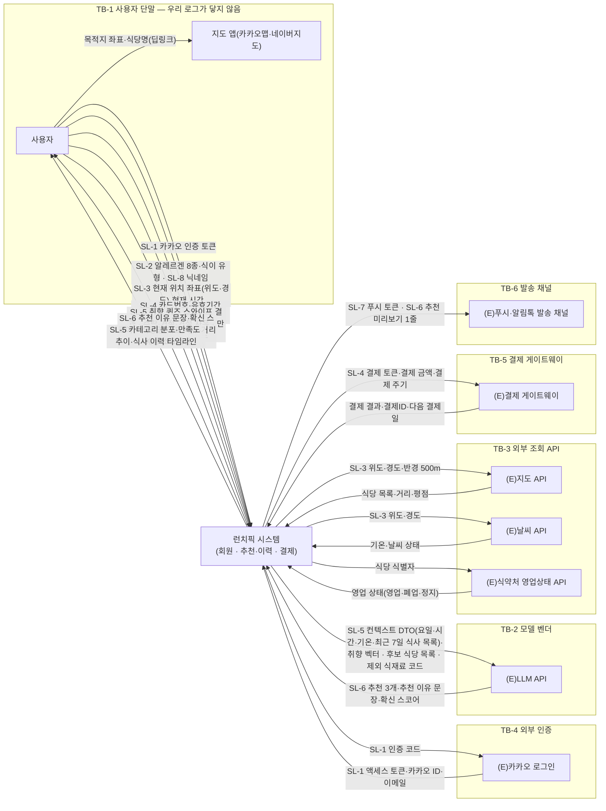
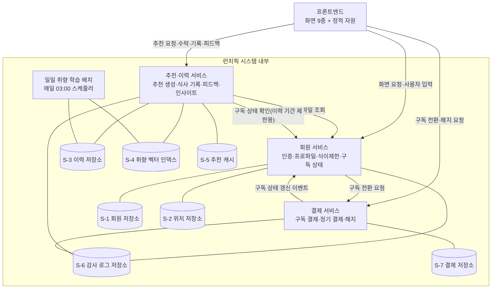

# 설계서 ② 논리아키텍처 — 런치픽(LunchPick)

작성: 클로니(Agentic AI 아키텍트 총괄) · 2026-08-08 · **미검증 설계**(연결·호출을 하지 않음)

이 문서는 **무엇이 어디에 있고 어디부터 우리 통제 밖인가**만 정함.
`TB`는 Trust Boundary(신뢰 경계)의 약자로 **제어권이 바뀌는 선**임.
`SL`은 Sensitive Label(민감정보 라벨)로 **그 선을 넘는 데이터의 유형 이름**임.

`[확인필요]` **4건** — 말미 미확정 항목 표 4행과 같음.

**갱신 이력 1건(2026-08-08, 클로니 조정 판정)** — ⑤ 지식/도구가 `F-18 취향 퀴즈 스와이프 결과
원본`이 `TB-1`을 넘는데 `SL` 항목이 없다고 되돌려 왔음. **`SL-5` 행동 프로파일에 포함시킴** —
취향 퀴즈 결과는 사용자 행동 기록이라 새 라벨을 만들 이유가 없음. 함께 `TB-1`의 단말 → 시스템
간선 라벨에 `SL-5`를 붙였음(수락·거절·피드백도 같은 라벨인데 빠져 있었음).
`F-13 동의 상태`·`F-15 직군 클러스터`는 **`SL` 대상이 아님** — 신뢰 경계를 넘지 않으므로
판정 2-1의 대상이 아니고, 성격은 `S-1` 저장소의 `담는 것` 칸이 담음.

**갱신 이력 2건(2026-08-08, 클로니 조정 판정)** — ⑦ 배포가 `S-4`에 **직전 벡터 1세대를 보관할
자리가 없다**고 되돌려 왔음. **`S-4`의 `담는 것`에 더함** — `US:UFR-REC-100#처리결과`가
`학습 실패 시 이전 취향 벡터 유지`를 요구하므로 이전 세대를 보관해야 그 요구가 성립함.
원문 근거가 있는 확장이라 받았음.

---

## 1. 전체 관계도 — 우리 시스템을 상자 하나로 두고 본 바깥

노드는 이벤트스토밍 PlantUML 8건의 `actor`·`participant`를 **그대로 옮긴 것**임.
새로 넣은 노드는 6절 구성요소 대조 표에 `신설`로 남겼음.

---

## 2. 내부 구성도 — 상자 안을 따로 배포되는 단위로 나눔

노드는 프로젝트 파라미터 `V-08` 코드베이스 구성요소 목록 8종임.
**나누는 기준은 하나임 — 따로 배포·실행되는가.**

### 내부 저장소 목록

| ID | 저장소명 | 담는 것 | 보존 기간 | 근거 출처 |
|----|---------|--------|----------|----------|
| S-1 | 회원 저장소 | 회원ID·카카오 ID·이메일·닉네임·알림설정·동의 이력·알레르겐·식이 유형·구독 상태 | `[확인필요: 보존 기간]` — 회원 탈퇴·계정 삭제 요구가 원문에 없음 | ES:01#카카오인증, US:UFR-MBR-040·050, US:NFR-SYS-030 |
| S-2 | 위치 저장소 | 현재·과거 위치 좌표(위도·경도), 위치 동의 상태 | 6개월, 이후 자동 삭제 | US:NFR-SYS-040#체크리스트, ES:규제반영표#위치정보법 |
| S-3 | 이력 저장소 | 식사 기록·피드백·컨텍스트 스냅샷·추천 이력·수락·거절 이력 | 무료 30일 · 프리미엄 무제한(해지 후 30일 이전 열람 제한) | US:UFR-REC-110#검증, ES:07#구독상태갱신 |
| S-4 | 취향 벡터 인덱스 | 사용자 취향 벡터, 음식·메뉴 임베딩, **직전 세대 취향 벡터 1세대** | `[확인필요: 보존 기간]` | ES:01#초기프로파일, ES:05#취향임베딩갱신, US:UFR-REC-100#처리결과(학습 실패 시 이전 벡터 유지) |
| S-5 | 추천 캐시 | 직전 추천 결과(LLM 지연·오류 시 폴백용) | `[확인필요: 보존 기간]` | US:NFR-SYS-020#체크리스트, US:UFR-REC-010#실패시 |
| S-6 | 감사 로그 저장소 | 개인정보 접근 로그, 쓰기 도구 호출 감사 레코드 | 6개월 | US:NFR-SYS-030#체크리스트 |
| S-7 | 결제 저장소 | 결제ID·구독 플랜·다음 결제일·결제 실패 이력 | `[확인필요: 보존 기간]` — 결제 실패 7일 유예만 원문에 있음 | ES:07#정기결제등록, US:UFR-PAY-020 |

**S-1의 알레르겐·식이 유형은 내부 연결로도 흐름.** TB가 없는 내부-내부 연결이라 SL 번호를
붙이지 않고, 성격만 위 `담는 것` 칸에 적어 ⑤ 지식/도구와 ⑥ 가드레일/관측이 각자 다루게 함.

---

## 3. 신뢰 경계와 경계 통과 데이터

### 판정 2 — 경계를 어디에 그었나

구조적 잣대 둘만 씀. 데이터 종류는 보지 않음.

| 대상 간선 | 로그를 못 보게 되나 | 권한 주체가 바뀌나 | 부여한 번호 |
|----------|------------------|-----------------|-----------|
| 사용자 단말 ↔ 런치픽 시스템 | 예 — 단말 안의 동작은 우리 로그에 없음 | 예 — 단말 소유자는 사용자임 | TB-1 |
| 추천·이력 서비스 → (E)LLM API | 예 — 벤더 내부 처리 기록을 볼 수 없음 | 예 — 모델 벤더 계정 권한임 | TB-2 |
| 추천·이력 서비스 ↔ (E)지도·날씨·식약처 API | 예 | 예 — 각 사업자 API 키 권한임 | TB-3 |
| 회원 서비스 ↔ (E)카카오 로그인 | 예 | 예 — 카카오 계정 권한임 | TB-4 |
| 결제 서비스 ↔ (E)결제 게이트웨이 | 예 | 예 — PG 가맹점 권한임 | TB-5 |
| 추천·이력 서비스 → (E)푸시·알림톡 발송 채널 | 예 | 예 — 발송 사업자 권한임 | TB-6 |
| 회원 서비스 ↔ 추천·이력 서비스 | 아니오 | 아니오 | 경계 아님 — 내부 연결 |
| 추천·이력 서비스 ↔ 일일 학습 배치 | 아니오 | 아니오 | 경계 아님 — 내부 연결 |
| 각 서비스 ↔ 내부 저장소 7종 | 아니오 | 아니오 | 경계 아님 — 내부 연결 |

### 판정 2-1 — 민감정보 라벨을 어디에 붙였나

재료는 프로젝트 파라미터 `V-06` 민감정보 목록임. **TB가 있는 간선에서만** 판정함.

| SL | 항목 유형 이름 | 어느 경계를 넘나 | 넘는 방향 | 근거 출처 |
|----|--------------|---------------|----------|----------|
| SL-1 | 인증 정보(카카오 인증 토큰·액세스 토큰·카카오 ID·이메일) | TB-1 · TB-4 | 단말 → 시스템 · 시스템 ↔ 카카오 | US:UFR-MBR-010#입력요구사항, US:NFR-SYS-030#JWT |
| SL-2 | 건강·식이 정보(알레르겐 8종·식이 유형) | TB-1 | 단말 → 시스템 | US:UFR-MBR-040#입력요구사항 |
| SL-3 | 위치 좌표(위도·경도) | TB-1 · TB-3 | 단말 → 시스템 → 지도·날씨 | US:UFR-MBR-030, ES:02#주변식당조회 |
| SL-4 | 결제 카드 정보(카드번호·유효기간·CVC·결제 토큰) | TB-1 · TB-5 | 단말 → 시스템 → PG | US:UFR-PAY-020#입력요구사항 |
| SL-5 | 행동 프로파일(취향 벡터·최근 7일 식사 목록·집계 인사이트 · **취향 퀴즈 스와이프 결과 원본** · 수락·거절 사유 · 피드백) | TB-1 · TB-2 | 단말 → 시스템 · 시스템 → LLM · 시스템 → 단말 | ES:02#컨텍스트DTO, US:UFR-REC-120, ES:01#스와이프, US:UFR-MBR-020 |
| SL-6 | 모델이 만든 문장(추천 이유·확신 스코어·미리보기 1줄) | TB-1 · TB-2 · TB-6 | LLM → 시스템 → 단말·발송 채널 | ES:02#LLM추천생성, US:UFR-REC-020 |
| SL-7 | 푸시 토큰 | TB-6 | 시스템 → 발송 채널 | US:UFR-REC-090#검증 |
| SL-8 | 프로필 표시정보(닉네임) | TB-1 | 단말 → 시스템 | US:UFR-MBR-050#입력요구사항 |

**경계를 두 번 넘는 데이터 4건** — 가리는 일이 두 번 필요하므로 ⑥ 가드레일/관측이 두 지점에
각각 규칙을 둠. `SL-3`(TB-1 → TB-3) · `SL-4`(TB-1 → TB-5) · `SL-5`(TB-1 → TB-2) ·
`SL-6`(TB-2 → TB-1 그리고 TB-2 → TB-6).

### 판정 2-2 — 경계를 넘기지 않기로 한 항목

⑤ 지식/도구·⑥ 가드레일/관측의 가리기보다 **앞선 방어선**임.
가장 강한 방법은 **입력 규격에서 칸을 없애는 것**임 — 칸이 없으면 넣을 경로가 없음.

| 항목 이름 | 어느 경계를 안 넘나 | 안 넘기는 방법 | 근거 출처 |
|----------|------------------|--------------|----------|
| 알레르겐 원문 라벨(`allergyItems`) | TB-2 모델 벤더 | LLM 입력 규격에 `allergyItems` 칸을 만들지 않음. `제외 식재료 코드` 배열만 둠 | US:NFR-SYS-030#민감정보별도키, ES:02#하드필터 |
| 이메일·카카오 ID | TB-2 · TB-3 · TB-6 | 입력 규격에 식별자 칸을 만들지 않음. 요청 상관용 익명 키만 둠 | US:NFR-SYS-030#체크리스트 |
| 정확 위치 좌표(소수점 전체) | TB-2 모델 벤더 | LLM 입력 규격에 좌표 칸을 만들지 않음. `지역 라벨`만 둠. 지도·날씨(TB-3)에는 좌표가 필요하므로 그쪽만 넘김 | US:NFR-SYS-040#목적명시, 설계판단(② 논리아키텍처 TB-2 판정) |
| 카드번호·유효기간·CVC | 우리 시스템 내부 전체 | 서버 입력 규격에 칸을 만들지 않음. 단말에서 PG로 직접 보내 토큰만 받음 | US:UFR-PAY-020#입력요구사항 |
| 식이 유형(`dietType`) | TB-3 외부 조회 API | 후보 식당 조회 파라미터에 칸을 만들지 않음. 필터는 시스템 안에서만 적용 | US:UFR-MBR-040, ES:02#하드필터 |
| 인증 토큰(JWT·카카오 토큰) | TB-2 · TB-3 · TB-6 | 외부 호출 규격에 토큰 칸을 만들지 않음 | US:NFR-SYS-030#JWT |
| 닉네임 | TB-2 모델 벤더 | LLM 입력 규격에 칸을 만들지 않음. 인사 문구는 응답을 받은 뒤 시스템이 붙임 | 설계판단(② 논리아키텍처 TB-2 판정) |

### 경계선을 긋고 나서의 확인 3건

| 확인 | 결과 |
|------|------|
| 넘는 간선이 하나도 없는 TB·SL이 있나 | 없음 — TB 6개와 SL 8개 모두 넘는 간선을 1개 이상 가짐. 지운 경계 0건 |
| SL 간선에 라벨이 없는 곳이 있나 | 없음 — 도식의 TB 통과 화살표 17개 전부에 항목 이름 라벨이 있음 |
| 같은 데이터가 SL을 두 번 넘는 곳이 있나 | 4건 있음(`SL-3`·`SL-4`·`SL-5`·`SL-6`). 위 판정 2-1 마지막 문단에 적어 ⑥으로 넘김 |

---

## 4. 외부 서비스 목록

`구분`은 `실물`·`Mock` **2값만** 씀. Mock 사유는 확인된 사실만 적음.
**이 표가 Mock·실물 구분의 값 주인임** — ⑤ 지식/도구는 커넥터 단위로 펼쳐 쓰기만 함.

| 외부 서비스 | 어느 TB | 구분 | 쓰려는 필드를 주나 | 대체 사유 | 근거 출처 |
|------------|--------|------|-----------------|----------|----------|
| (E)카카오 로그인 | TB-4 | 실물 | 예 — 카카오 ID·이메일을 준다고 원문에 적혀 있음 | — | ES:01#카카오인증, US:UFR-MBR-010 |
| (E)LLM API | TB-2 | 실물 | 예 — 추천 3개·이유·확신 스코어를 응답으로 받는 구조가 시퀀스에 있음 | — | ES:02#LLM추천생성, BM:비용구조#LLM API비용 |
| (E)지도 API | TB-3 | 실물 | **아니오(부분)** — 식당 목록·거리·평점은 주나 `대표 메뉴·가격`을 주는지 원문에 없음. **그 경로는 Mock임** | 대표 메뉴·가격 경로만 Mock — 제공 API가 원문에 지정되지 않음(`V-04` 9번) | ES:02#주변식당조회, US:UFR-REC-010#추천카드 |
| (E)날씨 API | TB-3 | 실물 | 예 — 기온·날씨 상태 | — | ES:02#날씨API |
| (E)식약처 영업상태 API | TB-3 | Mock | 확인 못 함 | 연동이 계획 문장뿐이고 확정이 아님 — 원문은 "연동이 필요하다"까지임(`V-04` 20번) | ES:규제반영표#식품위생법, PR:시장조사#공공API |
| (E)결제 게이트웨이 | TB-5 | Mock | 확인 못 함 | 통신판매업 신고·개인정보처리방침 수립이 론칭 전(M1 ~ M4) 과제로 남아 있어 심사 완료 전에는 실결제를 붙일 수 없음 | BM:GTM#Pre-launch법적기반, US:UFR-PAY-020 |
| (E)푸시·알림톡 발송 채널 | TB-6 | Mock | 확인 못 함 | 제공자가 원문에 지정되지 않음(`V-06` 14번). 알림톡은 채널 개설 심사가 필요함 | US:UFR-REC-090#검증, BM:채널#Delivery |
| 지도 앱 딥링크(카카오맵·네이버지도) | TB-1 | 실물 | 예 — 목적지 좌표·식당명으로 앱 전환이 됨 | — | US:UFR-REC-060#검증 |

---

## 5. 왜 이렇게 배치했나 — 배치 결정 사유

① 목표/품질 카드의 우선 품질 3개를 근거로 3줄로 적음.

- **응답시간(Q-1, 3,000ms)** 때문에 외부 왕복 3개(이력·날씨·지도)와 LLM 호출을
  **추천·이력 서비스 한 곳에 모으고** 폴백용 추천 캐시(S-5)를 그 서비스 옆에 뒀음.
- **설명가능성(Q-2, 3필드 완전성 100%)** 때문에 추천 이유·확신 스코어를 **만드는 지점과 저장하는
  지점을 같은 서비스**에 뒀음. 근거 ~ 결과 대조가 서비스 밖으로 나가지 않음.
- **안전성(Q-3, 위반 노출 0건)** 때문에 알레르기 하드 필터를 LLM 호출 **앞**(TB-2 안쪽)에 두고,
  카드 정보는 결제 서비스만 지나가게 격리했음(판정 2-2 4번 행).

---

## 6. 구성요소 대조 표 — 기획의 참여자가 어디로 갔나

**미대응 0건 · 신설 6건**임. 신설 행마다 근거를 적었음.

| 기획의 참여자·액터 | 대응 노드 | 대응 여부 | 근거 출처 |
|------------------|----------|----------|----------|
| `actor 사용자` | 전체 관계도 `사용자`(TB-1) | 그대로 옮김 | ES:01 ~ 07#actor |
| `participant 회원업무` | 내부 구성도 `회원 서비스` | 그대로 옮김 | ES:01,07, ES:MVP마이크로서비스구성 |
| `participant 추천업무` | 내부 구성도 `추천·이력 서비스` | 그대로 옮김 | ES:02,03,05, ES:MVP마이크로서비스구성 |
| `participant 이력업무` | 내부 구성도 `추천·이력 서비스`에 **병합** | 병합 — 기획이 MVP에서 추천과 병합하기로 판정했음 | ES:분할병합결정#이력컨텍스트 |
| `participant 결제업무` | 내부 구성도 `결제 서비스` | 그대로 옮김 | ES:07, ES:MVP마이크로서비스구성 |
| `participant 시스템 스케줄러` | 내부 구성도 `일일 취향 학습 배치` | 그대로 옮김 | ES:05#스케줄러 |
| `participant (E)카카오 로그인` | 전체 관계도 `(E)카카오 로그인`(TB-4) | 그대로 옮김 | ES:01 |
| `participant (E)LLM API` | 전체 관계도 `(E)LLM API`(TB-2) | 그대로 옮김 | ES:02,05 |
| `participant (E)지도 API` | 전체 관계도 `(E)지도 API`(TB-3) | 그대로 옮김 | ES:02,03 |
| `participant (E)날씨 API` | 전체 관계도 `(E)날씨 API`(TB-3) | 그대로 옮김 | ES:02 |
| `participant (E)결제 게이트웨이` | 전체 관계도 `(E)결제 게이트웨이`(TB-5) | 그대로 옮김 | ES:07 |
| — | 내부 구성도 `프론트엔드` | **신설** | 화면 9종과 정적 자원 CDN 캐싱이 요구에 있으나 PlantUML에 노드가 없음. `V-08` 4번 · US:UIUX · US:NFR-SYS-020#체크리스트 |
| — | 전체 관계도 `(E)푸시·알림톡 발송 채널`(TB-6) | **신설** | 푸시 1회 발송이 요구에 있으나 PlantUML에 노드가 없음. US:UFR-REC-090#검증 · BM:채널#Delivery |
| — | 전체 관계도 `(E)식약처 영업상태 API`(TB-3) | **신설** | 폐업 식당 제외 필터가 규제 반영표에 있으나 PlantUML에 노드가 없음. ES:규제반영표#식품위생법 |
| — | 전체 관계도 `지도 앱 딥링크`(TB-1) | **신설** | 앱 전환이 요구에 있으나 PlantUML에 노드가 없음. US:UFR-REC-060#검증 |
| — | 내부 저장소 `S-1` ~ `S-7` 7종 | **신설** | PlantUML에 `database` 노드가 0건임. `V-08` 6 ~ 8번과 보존 기간 요구(US:NFR-SYS-030·040, US:UFR-REC-110)에서 논리 구획으로 나눴음 |
| — | 내부 구성도 `S-6 감사 로그 저장소` | **신설** | 개인정보 접근 로그를 서비스 로그와 분리 보관하는 요구가 있음. US:NFR-SYS-030#체크리스트 |

---

## 7. 노드·간선 근거 대조표

| 도식 요소 | 개수 | 근거 |
|----------|------|------|
| 전체 관계도 노드 | 10개(사용자 · 지도 앱 · 런치픽 시스템 · 외부 서비스 7종) | ES `actor`·`participant` 11종 중 내부 5종을 상자 하나로 접고, 신설 4종을 더함 |
| 전체 관계도 TB 통과 간선 | 17개 | 도식 화살표 전수. 전부 항목 이름 라벨을 가짐 |
| 신뢰 경계 `subgraph` | 6개(TB-1 ~ TB-6) | 3절 판정 2 표 |
| 민감정보 라벨 | 8개(SL-1 ~ SL-8) | 3절 판정 2-1 표. 재료는 `V-06` 15행 |
| 내부 구성도 노드 | 11개(실행 단위 5종 + 저장소 7종 중 도식 표기 7) | `V-08` 8종 기준. 실행 단위 5종이 ⑦ 배포 덩어리 수의 근거가 됨 |
| 경계 미통과 항목 | 7건 | 3절 판정 2-2 표 |
| 외부 서비스 `구분` | 실물 4 · Mock 3 · 부분 Mock 1 | 4절 표. `실물`·`Mock` 밖의 값이 적힌 칸 0건 |

---

## 8. 후행 소비처 — 이 값을 뒤에서 누가 쓰나

| 넘기는 값 | 받는 곳 | 강도 |
|----------|--------|------|
| 전체 관계도의 참여 주체·내부 구성요소 | ③ 패턴/시퀀스의 참여 주체 | HARD |
| 신뢰 경계 `TB-1` ~ `TB-6` | ⑥ 가드레일/관측 접근제어·감사로그 | HARD |
| 민감정보 라벨 `SL-1` ~ `SL-8`과 경계 통과 데이터 | ⑤ 지식/도구 변환 지점(가리는 자리) | HARD |
| 경계 미통과 항목 7건 | ⑤ 지식/도구 **커넥터 입출력 키에서 제외**(가리는 것이 아니라 칸 자체를 안 만듦) | HARD |
| 내부 구성도의 실행 단위 5종 · 내부 저장소 목록 7종 | ⑦ 배포 이미지 분할·저장소 배치 · ④ 역할계약서 사용 도구 | HARD |
| 외부 서비스 목록 8종 | ④ 역할계약서 사용 도구 후보 | SOFT |
| Mock·실물 구분(값의 주인은 이 문서) | ⑤ 지식/도구 목록 전개 | 소유 관계 |
| 경계를 두 번 넘는 데이터 4건 | ⑥ 가드레일/관측 마스킹 대상 표 | HARD |

**기술 스택 6행은 이 문서의 표가 아님** — 프로젝트 파라미터 `V-07`이 소유하며
⑦ 배포가 비밀값을 뽑을 때 그 파일을 봄. 여기에 만들지 않았음.

---

## 9. 기획 산출물 대조 기록

| 기획 항목 ID | 반영 여부 | 반영 위치 | 사유 |
|------------|----------|----------|------|
| ES:01 ~ 07#actor·participant(11종) | 반영 | 1절 전체 관계도 · 2절 내부 구성도 | 그대로 옮겼음. 이력업무만 기획 판정에 따라 병합 |
| ES:컨텍스트맵(4개 연결) | 반영 | 2절 내부 구성도의 서비스 간 화살표 4개 | 동기·비동기 구분은 ③ 패턴/시퀀스 소유이므로 여기서는 방향만 그림 |
| ES:분할병합결정 | 반영 | 6절 대조 표 `이력업무` 행 | MVP 병합 판정을 그대로 따름 |
| ES:규제반영표#4개 법령 | 부분반영 | 1절 TB-3(식약처) · S-2 보존 기간 · 판정 2-2 | 전자상거래법 청약철회는 ⑥ 소관이라 여기서 다루지 않음 |
| US:NFR-SYS-030(보안·암호화) | 반영 | 3절 SL 8종 · S-6 · 판정 2-2 | 암호화 방식은 ⑥ 소관이라 위치만 정함 |
| US:NFR-SYS-040(위치정보법·개인정보보호법) | 부분반영 | S-2 보존 기간 6개월 · 판정 2-2 3번 | 책임자 지정·전송요구권은 ⑦ 소관 |
| US:NFR-SYS-020(피크타임 확장성) | 부분반영 | 2절 프론트엔드 신설 · S-5 추천 캐시 | 오토스케일 설정값은 ⑦ 소관 |
| US:UFR-PAY-020(구독 결제) | 반영 | TB-5 · SL-4 · 판정 2-2 4번 | 카드 정보를 시스템 내부에 두지 않는 결정을 명시 |
| US:UFR-REC-060(길찾기) | 반영 | TB-1 지도 앱 딥링크(신설) | PlantUML에 노드가 없어 신설로 기록 |
| US:UFR-REC-090(피드백·리마인더) | 반영 | TB-6 발송 채널(신설) · SL-7 | 발송 상한 규칙은 ⑥ 소관 |
| US:UFR-REC-110(이력 타임라인) | 반영 | S-3 보존 기간 | 무료 30일 · 프리미엄 무제한 |
| US:UFR-REC-030(콜드스타트 안전망) | 미반영 | — | 직군 정보 수집 항목이 온보딩 요구에 없어 입력 노드를 만들 근거가 없음(`V-04` 23번) |
| `V-04` 24번(알레르겐 판정 데이터) | 미반영 | — | 원천이 없어 노드를 만들 수 없음. 판정 2-2 1번은 **입력 쪽** 보호이며 판정 데이터와 다른 문제임 |
| `V-09` 5·6번(이미지·음성 입력) | 반영 | 1절 TB-1 간선 라벨 | 입력 항목을 텍스트·좌표·라벨로만 두어 모달리티를 구조에서 배제 |
| ① 목표/품질 카드 Q-1·Q-2·Q-3 | 반영 | 5절 배치 결정 사유 | 품질 3개 전부를 배치 근거로 인용 |

---

## 10. 미확정 항목 — `[확인필요]` 4건

| `[확인필요]` 태그 | 무엇이 없나 | 누구에게 되묻나 | 안 오면 무엇이 막히나 |
|-----------------|-----------|--------------|-------------------|
| `[확인필요: 보존 기간]` | `S-1`·`S-4`·`S-5`·`S-7` 4종의 보존 기간이 원문에 없음. `S-1`은 회원 탈퇴 요구 자체가 없음 | 기획 담당 · 개인정보 보호책임자 | ⑦ 배포가 저장소 배치와 삭제 배치를 못 잡고, ⑥ 가드레일/관측이 보존 정책 표를 못 채움 |
| `[확인필요: 대표 메뉴·가격 제공 원천]` | 지도 API가 대표 메뉴·가격을 주는지 원문에 없음 | 기획 담당 · 외부 API 담당 | 추천 카드의 표시 항목이 비고, 그 경로가 Mock으로 남음 |
| `[확인필요: 식약처 공공 API 연동 확정 여부]` | 연동이 계획 문장뿐임 | 기획 담당 | TB-3의 식약처 노드가 Mock으로 고정되고 식품위생법 반영이 성립하지 않음 |
| `[확인필요: 푸시·알림톡 제공자]` | 발송 채널 제공자가 지정되지 않음 | 기획 담당 · 인프라 담당 | TB-6이 Mock으로 고정되고 ⑦ 배포가 발송 비밀값을 특정 못 함 |
