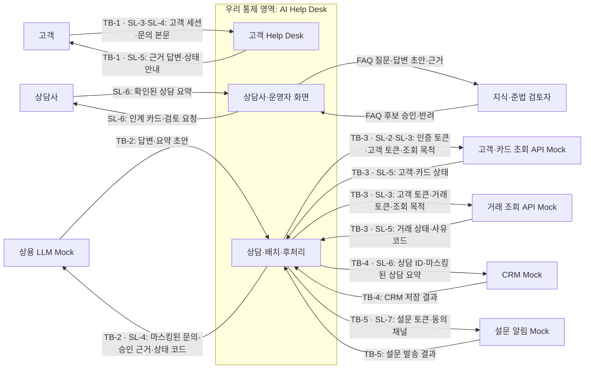
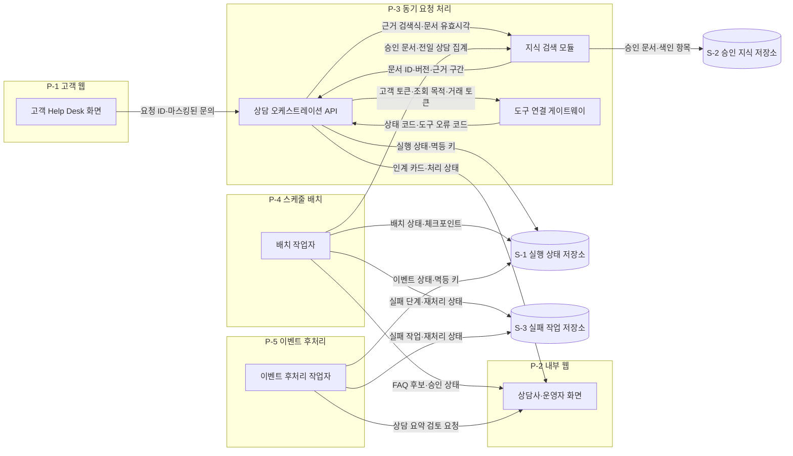

# ② 논리아키텍처: 신용카드사 AI Help Desk

## 구조

### 전체 관계도

### 내부 관계도

S-1은 P-3·P-4·P-5가 공유함. S-2는 P-3의 검색 모듈과 P-4의 후보 생성 흐름이 공유함.  
S-3은 P-4·P-5가 공유함.

### 프로세스 분리표

| 프로세스 | 담는 구성요소 | 분리 근거 | 근거 출처 |
|---|---|---|---|
| P-1 고객 웹 | 고객 Help Desk 화면 | P1: 외부 웹 채널을 별도로 배포함. P3: 내부 화면 장애와 격리함 | BM:CMP-01 |
| P-2 내부 웹 | 상담사·운영자 화면 | P1: 내부 채널을 별도로 배포함. P3: 외부 채널 장애와 격리함 | BM:CMP-02 |
| P-3 동기 요청 처리 | 상담 오케스트레이션 API·지식 검색 모듈·도구 연결 게이트웨이 | P1·P2·P3: 피크 분당 200건을 독립 배포·확장·격리함 | BM:CMP-03, BM:CMP-04, BM:CMP-05 |
| P-4 스케줄 배치 | 배치 작업자 | P1·P2·P3·P4: 02:00 주기 실행과 실패를 동기 요청에서 격리함 | BM:CMP-06, ES:WF-02 |
| P-5 이벤트 후처리 | 이벤트 후처리 작업자 | P1·P2·P3·P4: 상담 종료 이벤트 소비와 재시도를 동기 요청에서 격리함 | BM:CMP-07, ES:WF-03 |

지식 검색 모듈과 도구 연결 게이트웨이는 P1 ~ P4가 모두 아니오임.  
P-3 안의 모듈 경계로 유지해 네트워크 호출과 별도 운영 비용을 만들지 않음.

## 경계

### 신뢰경계표

| 노드 | 종류 | 신뢰경계 | 실물/Mock | 근거 출처 |
|---|---|:---:|:---:|---|
| 고객 | 사용자 | TB-1 | — | BM:ACT-01 |
| 상담사 | 사용자 | — | — | BM:ACT-02 |
| Help Desk 운영자 | 사용자 | — | — | BM:ACT-03 |
| 지식·준법 검토자 | 사용자 | — | — | BM:ACT-04 |
| P-1 고객 웹 | 내부실행 | — | — | BM:CMP-01 |
| P-2 내부 웹 | 내부실행 | — | — | BM:CMP-02 |
| P-3 동기 요청 처리 | 내부실행 | — | — | BM:CMP-03 |
| P-4 스케줄 배치 | 내부실행 | — | — | BM:CMP-06 |
| P-5 이벤트 후처리 | 내부실행 | — | — | BM:CMP-07 |
| 상용 LLM | 외부시스템 | TB-2 | Yes(Mock) | BM:TECH-01 |
| 고객·카드 조회 API | 외부시스템 | TB-3 | Yes(Mock) | BM:TOOL-02 |
| 거래 조회 API | 외부시스템 | TB-3 | Yes(Mock) | BM:TOOL-03 |
| CRM | 외부시스템 | TB-4 | Yes(Mock) | BM:TOOL-05 |
| 설문 알림 | 외부시스템 | TB-5 | Yes(Mock) | BM:TOOL-06 |

TB-1은 고객 단말과 우리 시스템의 로그·권한 주체가 달라지는 경계임.  
TB-2 ~ TB-5는 외부 제품·시스템으로 제어권과 접근 권한 주체가 바뀌는 경계임.

### 경계통과 민감정보

| 소스 | 대상 | 정보 | 민감정보ID | 근거 출처 |
|---|---|---|:---:|---|
| 고객 | TB-1 고객 Help Desk | 고객 세션·문의 본문 | SL-3·SL-4 | BM:DATA-04, US:UFR-HDK-010 |
| TB-1 고객 Help Desk | 고객 | 근거 답변·카드·거래 상태 안내 | SL-5 | US:UFR-HDK-020, US:UFR-HDK-030 |
| P-3 동기 요청 처리 | TB-2 상용 LLM | 마스킹된 문의·승인 근거·상태 코드 | SL-4 | BM:POL-01, US:NFR-SYS-010 |
| P-3 동기 요청 처리 | TB-3 고객·카드 조회 API | 인증 토큰·고객 토큰·조회 목적 | SL-2·SL-3 | BM:POL-02, US:UFR-HDK-030 |
| TB-3 고객·카드 조회 API | P-3 동기 요청 처리 | 고객·카드 상태 | SL-5 | BM:DATA-02 |
| P-3 동기 요청 처리 | TB-3 거래 조회 API | 고객 토큰·거래 토큰·조회 목적 | SL-3 | US:UFR-HDK-030 |
| TB-3 거래 조회 API | P-3 동기 요청 처리 | 거래 상태·사유 코드 | SL-5 | BM:DATA-03 |
| P-5 이벤트 후처리 | TB-4 CRM | 상담 ID·마스킹된 상담 요약 | SL-6 | US:UFR-OPS-020 |
| P-5 이벤트 후처리 | TB-5 설문 알림 | 상담 ID 토큰·설문 토큰·동의 채널 | SL-7 | US:UFR-OPS-030 |

SL-1은 카드번호 전체·CVC·비밀번호임. SL-2는 인증 토큰·인증코드임.  
SL-3은 고객 식별정보임. SL-4는 문의·상담 대화임. SL-5는 카드·거래 상태임.  
SL-6은 상담 요약·CRM 기록임. SL-7은 설문 식별자임.

### 경계 미통과 항목

| 항목 이름 | 어느 경계를 안 넘나 | 안 넘기는 방법 | 근거 출처 |
|---|---|---|---|
| 카드번호 전체·CVC·비밀번호 | TB-2 상용 LLM | LLM 입력 계약에 해당 항목을 두지 않음 | BM:POL-01 |
| 인증 토큰·인증코드 | TB-2 상용 LLM | LLM 입력 계약에 해당 항목을 두지 않음 | BM:POL-01 |
| 원문 고객 ID·연락처 | TB-2 상용 LLM | 고객 토큰만 입력 계약에 허용함 | US:NFR-SYS-010 |
| 상담 대화 원문 | TB-4 CRM | CRM 계약에는 마스킹 검사 통과 요약만 허용함 | US:UFR-OPS-020 |
| 원문 고객 ID·상담 내용 | TB-5 설문 알림 | 설문 계약에는 토큰과 동의 채널만 허용함 | US:UFR-OPS-030 |

## 저장

### 내부 저장소 목록

| ID | 저장소명 | 용도 | 소속 프로세스 | 근거 출처 |
|---|---|---|---|---|
| S-1 | 실행 상태 저장소 | 실행 상태·멱등 키·감사 메타데이터 | P-3·P-4·P-5 공유 | BM:CMP-08 |
| S-2 | 승인 지식 저장소 | 승인 문서와 검색용 색인 항목 | P-3·P-4 공유 | BM:DATA-01, BM:CMP-04 |
| S-3 | 실패 작업 저장소 | 배치·이벤트 실패와 재처리 상태 | P-4·P-5 공유 | BM:TECH-07, US:AFR-OPS-040 |

### 배치 결정 ADR

| 후보 | 장점 | 단점 | ① 품질속성 대조 | 결정 | 근거 출처 |
|---|---|---|---|---|---|
| 단일 프로세스 | 호출 단순성·운영비 최소화 | 배치·이벤트 장애가 동기 문의에 전파됨 | Q-1 정확성·Q-2 응답시간·Q-3 안전성 모두 격리 약함 | 기각 | 설계판단 |
| 웹 2종·동기 API·배치·이벤트의 5개 프로세스 | 채널 권한 분리·동기 지연 보호·실패 격리 | 프로세스별 운영 단위 증가 | Q-2 경로 독립 확장, Q-3 내부/외부 채널 격리, Q-1 실패 범위 축소 | 채택 | BM:CMP-01, BM:CMP-02, BM:CMP-03, BM:CMP-06, BM:CMP-07 |
| 모든 모듈의 독립 프로세스화 | 개별 확장 가능 | 네트워크 호출·운영 복잡도 과다 | Q-2 지연 증가, Q-1·Q-3 경계 수 증가 | 기각 | 설계판단 |

결정 상태: 교육용 논리 배치 결정임. 제품·포트·접속정보는 확정하지 않음.

**구성요소 대조**

| 기획 구성요소 | 상태 | 논리아키텍처 위치 | 근거 출처 |
|---|---|---|---|
| CMP-01 고객 Help Desk 화면 | 반영 | P-1 | BM:CMP-01 |
| CMP-02 상담사·운영자 화면 | 반영 | P-2 | BM:CMP-02 |
| CMP-03 상담 오케스트레이션 API | 반영 | P-3 | BM:CMP-03 |
| CMP-04 지식 수집·검색 구성요소 | 반영 | P-3 | BM:CMP-04 |
| CMP-05 도구 연결 게이트웨이 | 반영 | P-3 | BM:CMP-05 |
| CMP-06 배치 작업자 | 반영 | P-4 | BM:CMP-06 |
| CMP-07 이벤트 후처리 작업자 | 반영 | P-5 | BM:CMP-07 |
| CMP-08 관계형 상태 저장소 | 반영 | S-1 | BM:CMP-08 |
| 승인 지식 저장소 | 신설 | S-2 | BM:DATA-01, BM:TECH-03 |
| 실패 작업 저장소 | 신설 | S-3 | BM:TECH-07, US:AFR-OPS-040 |

구성요소 미대응 0건, 저장소 신설 2건임.

**미대응 Pain Point**

| 기획서의 Pain Point | 이번 범위에서 안 다루는 이유 | 언제 다루나 |
|---|---|---|
| 0건 | 기획 구성요소와 3개 워크플로우의 참여 주체를 모두 반영함 | 해당 없음 |

**대조 기록**

| 기획 항목 ID | 반영 여부(반영·부분반영·범위외·미반영) | 반영 위치 | 사유 |
|---|---|---|---|
| BM:CMP-01 ~ CMP-08 | 반영 | 구조·저장 | 구성요소 8건 전부 반영 |
| BM:TOOL-01 ~ TOOL-06 | 반영 | 전체 관계도·신뢰경계표 | 외부 도구와 내부 검색 경계 반영 |
| BM:POL-01·POL-02 | 반영 | 경계통과·미통과 항목 | 민감정보 경계와 미통과 항목 반영 |
| ES:WF-01 ~ WF-03 | 반영 | P-3 ~ P-5 | 동기·배치·이벤트 실행 경계 반영 |

**미확정 항목**

| `[확인필요]` 태그 | 무엇이 없나 | 누구에게 되묻나 | 안 오면 무엇이 막히나 |
|---|---|---|---|
| 0건 | ②가 사용하는 값의 미확정 항목 없음 | 해당 없음 | 해당 없음 |
