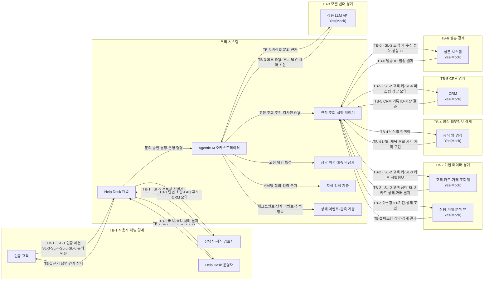
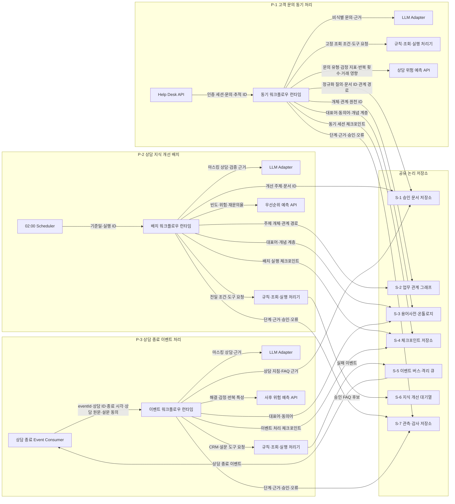

# ② 논리아키텍처

## 구조

### 전체 관계도

### 내부 관계도

공유 저장소 `S-1` ~ `S-4`와 `S-7`은 `P-1` ~ `P-3`이 함께 사용함.  
`S-5`는 `P-3`, `S-6`은 `P-2`의 주 쓰기 대상임.

### 프로세스 분리표

| 프로세스 | 담는 구성요소 | 분리 근거 | 근거 출처 |
|---|---|---|---|
| `P-1` 고객 문의 동기 처리 | Help Desk API·동기 런타임·모델 Adapter·규칙 처리·위험 예측 | `P2`: 피크 분당 200건에 맞춰 독립 확장함. `P3`: 배치·이벤트 장애와 고객 응답을 격리함. `P4`: 동기 요청 방식임 | BM:BM-A01, ES:W-01#트리거 |
| `P-2` 상담 지식 개선 배치 | Scheduler·배치 런타임·모델 Adapter·규칙 처리·우선순위 예측 | `P2`: 전일 최대 10,000건 분석 부하가 동기 요청과 다름. `P4`: 매일 02:00 주기 실행임 | ES:S-B1#시작, ES:S-B2#행상한 |
| `P-3` 상담 종료 이벤트 처리 | Event Consumer·이벤트 런타임·모델 Adapter·규칙 처리·사후 위험 예측 | `P3`: CRM·설문 실패를 동기 문의와 격리함. `P4`: 이벤트 구독 방식임 | ES:W-03#트리거, US:UFR-HDS-030#실패 |

## 경계

### 신뢰경계표

| 노드 | 종류 | 신뢰경계 | 실물/Mock | 근거 출처 |
|---|---|---|---|---|
| 인증 고객 | 사용자 | `TB-1` | — | ES:3#액터 |
| 상담사·지식 검토자 | 사용자 | `TB-1` | — | ES:3#액터 |
| Help Desk 운영자 | 사용자 | `TB-1` | — | ES:3#액터 |
| 우리 시스템 | 내부업무 | — | — | BM:BM-S01 |
| 고객·카드·거래 조회계 | 외부시스템 | `TB-2` | Yes(Mock) | ES:3#외부시스템 |
| 상담·거래 분석 뷰 | 외부시스템 | `TB-2` | Yes(Mock) | ES:3#외부시스템 |
| 상용 LLM API | 외부시스템 | `TB-3` | Yes(Mock) | 설계판단 |
| 공식 웹·영상 | 외부시스템 | `TB-4` | Yes(Mock) | ES:3#외부시스템 |
| CRM | 외부시스템 | `TB-5` | Yes(Mock) | ES:3#외부시스템 |
| 설문 시스템 | 외부시스템 | `TB-6` | Yes(Mock) | ES:3#외부시스템 |
| `P-1` 동기 처리 | 내부실행 | — | — | ES:W-01#트리거 |
| `P-2` 배치 처리 | 내부실행 | — | — | ES:W-02#트리거 |
| `P-3` 이벤트 처리 | 내부실행 | — | — | ES:W-03#트리거 |

외부시스템 6종은 교육용 기획에 접속정보와 실행 가능한 계정이 없어 모두 Mock으로 판정함.

### 경계통과 민감정보

| 소스 | 대상 | 정보 | 민감정보ID | 근거 출처 |
|---|---|---|---|---|
| 인증 고객 | `TB-1` Help Desk 채널 | 인증 세션 | `SL-1` | US:UFR-HDS-010#입력 |
| 인증 고객 | `TB-1` Help Desk 채널 | 문의 원문에 포함될 수 있는 카드번호·CVC | `SL-3` | US:NFR-PRI-010 |
| 인증 고객 | `TB-1` Help Desk 채널 | 문의 원문에 포함될 수 있는 비밀번호 | `SL-4` | US:NFR-PRI-010 |
| 인증 고객 | `TB-1` Help Desk 채널 | 문의 원문에 포함될 수 있는 주민등록번호 | `SL-5` | US:NFR-PRI-010 |
| 인증 고객 | `TB-1` Help Desk 채널 | 상담 문의 원문 | `SL-6` | US:UFR-HDS-010#입력 |
| 상담사·지식 검토자 | `TB-1` Help Desk 채널 | 검토자 식별자·승인 결정 | `SL-2` | US:NFR-AUD-010 |
| 우리 시스템 | `TB-2` 고객·카드·거래 조회계 | 고객 키·카드 식별정보 | `SL-2`, `SL-3` | US:AC-010-1 |
| `TB-2` 고객·카드·거래 조회계 | 우리 시스템 | 고객 상태·카드 상태·거래 결과 | `SL-2`, `SL-3` | BM:K-ST-FQ-01 |
| 우리 시스템 | `TB-5` CRM | 고객 키·마스킹 상담 요약 | `SL-2`, `SL-6` | US:AC-030-3 |
| 우리 시스템 | `TB-6` 설문 시스템 | 고객 키·수신 동의·상담 ID | `SL-2` | US:AC-030-4 |

`TB-3`과 `TB-4`에는 민감정보를 통과시키지 않으므로 `SL`을 부여하지 않음.

### 경계 미통과 항목

| 항목 이름 | 어느 경계를 안 넘나 | 안 넘기는 방법 | 근거 출처 |
|---|---|---|---|
| 카드번호 전체·CVC | `TB-3` 모델 벤더, `TB-4` 공식 외부정보 | 모델 입력과 외부 검색 요청 계약에 해당 필드를 두지 않음 | BM:POL-01 |
| 비밀번호·인증 토큰 | `TB-2` 기업 데이터, `TB-3` 모델 벤더, `TB-4` 공식 외부정보 | 조회·모델·검색 요청 계약에 원문 필드를 두지 않음 | BM:POL-01 |
| 주민등록번호 | `TB-3` 모델 벤더, `TB-4` 공식 외부정보 | 모델·검색 요청 전에 탐지되면 호출을 중단함 | US:NFR-PRI-010 |
| 고객 식별자 | `TB-3` 모델 벤더, `TB-4` 공식 외부정보 | 비식별 질의와 마스킹 ID만 허용함 | US:NFR-PRI-010 |
| 상담 원문 | `TB-4` 공식 외부정보, `TB-6` 설문 시스템 | 외부 검색에는 비식별 검색어만, 설문에는 고객 키·상담 ID만 보냄 | US:NFR-AUD-010 |

## 저장

### 내부 저장소 목록

| ID | 저장소명 | 용도 | 소속 프로세스 | 근거 출처 |
|---|---|---|---|---|
| `S-1` | 승인 문서 저장소 | 약관·상품 안내·상담 지침·FAQ의 근거 구간 저장 | `P-1`, `P-2`, `P-3` | BM:K-SEM-01 |
| `S-2` | 업무 관계 그래프 | 고객·카드·상품·거래·문의·분쟁 관계 저장 | `P-1`, `P-2` | BM:K-REL-01 |
| `S-3` | 용어사전·온톨로지 | 대표어·동의어·개념 계층 저장 | `P-1`, `P-2`, `P-3` | BM:K-GLS-01, BM:K-ONT-01 |
| `S-4` | 체크포인트 저장소 | 동기·배치·이벤트 워크플로우 상태 저장 | `P-1`, `P-2`, `P-3` | 설계판단 |
| `S-5` | 이벤트 버스·격리 큐 | 상담 종료 이벤트 수신과 실패 이벤트 격리 | `P-3` | ES:W-03#트리거 |
| `S-6` | 지식 개선 대기열 | 승인된 FAQ 개선 후보 등록 | `P-2` | ES:S-B10#등록 |
| `S-7` | 관측·감사 저장소 | 추적·근거·승인·모델·도구·오류 기록 | `P-1`, `P-2`, `P-3` | US:NFR-AUD-010 |

### 배치 결정 ADR(Architectural Decision Record)

| ADR | 후보 | 장점 | 단점 | 결정과 이유 | 근거 출처 |
|---|---|---|---|---|---|
| `ADR-01` 워크플로우 실행 경계 | 단일 프로세스, 동기·배치·이벤트 3개 프로세스 | 단일은 설정이 단순함. 3개는 부하·장애·실행 방식을 격리함 | 3개는 네트워크 계약과 운영 단위가 늘어남 | 3개 프로세스 선택: `Q-1` 응답시간 보호와 `Q-3` 안전한 장애 격리를 우선함 | 설계판단(① `Q-1`, `Q-3`) |
| `ADR-02` 외부 호출 경로 | 각 런타임의 직접 호출, 규칙·조회·실행 처리기 경유 | 직접 호출은 지연이 짧음. 경유는 승인·권한·감사 규칙이 단일화됨 | 경유는 내부 홉이 1개 늘어남 | 규칙 처리기 경유 선택: `Q-2` 근거 추적과 `Q-3` 기본 거부를 일관 적용함 | 설계판단(① `Q-2`, `Q-3`) |
| `ADR-03` 공유 지식 계층 | 프로세스별 복제, 논리 저장소 공유 | 복제는 독립성이 높음. 공유는 근거 버전과 관계 원천의 일관성이 높음 | 공유 저장소 장애가 여러 프로세스에 영향을 줌 | 논리 저장소 공유 선택: `Q-2` 출처 일관성을 우선하고 프로세스별 접근 계약을 분리함 | 설계판단(① `Q-2`) |

## 제외 지표

| 지표 | 분류(공동 책임·책임 밖) | 탈락 테스트 번호 | 목표값 | 근거 출처 |
|---|---|---|---|---|
| 0건 | 해당 없음 | 해당 없음 | 해당 없음 | 설계판단 |

## 미대응 Pain Point

| 기획서의 Pain Point | 이번 범위에서 안 다루는 이유 | 언제 다루나 |
|---|---|---|
| 0건 | 기획의 3개 문제 영역을 내부 구성요소와 프로세스에 반영함 | 해당 없음 |

## 대조 기록

| 기획 항목 ID | 반영 여부(반영·부분반영·범위외·미반영) | 반영 위치 | 사유 |
|---|---|---|---|
| `V-08-1` | 반영 | `02-논리아키텍처.md:전체 관계도` | 사용자 채널을 반영함 |
| `V-08-2` | 반영 | `02-논리아키텍처.md:내부 관계도` | 워크플로우 런타임 3종으로 반영함 |
| `V-08-3` | 반영 | `02-논리아키텍처.md:내부 관계도` | LLM Adapter로 반영함 |
| `V-08-4` | 반영 | `02-논리아키텍처.md:내부 관계도` | 위험 예측 API로 반영함 |
| `V-08-5` | 반영 | `02-논리아키텍처.md:내부 관계도` | 규칙·조회·실행 처리기로 반영함 |
| `V-08-6` | 반영 | `02-논리아키텍처.md:내부 관계도` | 공유 지식 저장소 3종으로 반영함 |
| `V-08-7` | 반영 | `02-논리아키텍처.md:내부 관계도` | 체크포인트·이벤트·격리 큐로 반영함 |
| `V-08-8` | 반영 | `02-논리아키텍처.md:전체 관계도` | CRM·설문·대기열 경계로 반영함 |
| `V-08-9` | 반영 | `02-논리아키텍처.md:내부 관계도` | 관측·감사 저장소로 반영함 |

구성요소 미대응 0건, 신설 0건임.

## 미확정 항목

| `[확인필요]` 태그 | 무엇이 없나 | 누구에게 되묻나 | 안 오면 무엇이 막히나 |
|---|---|---|---|
| 0건 | 해당 없음 | 해당 없음 | 차단 없음 |
