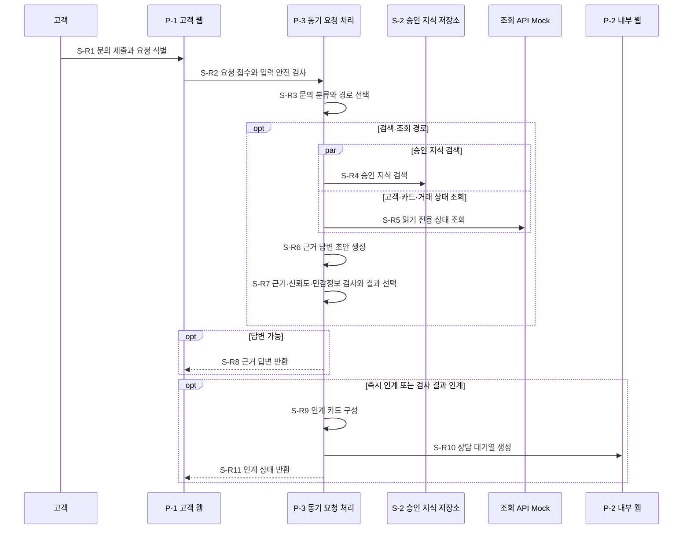
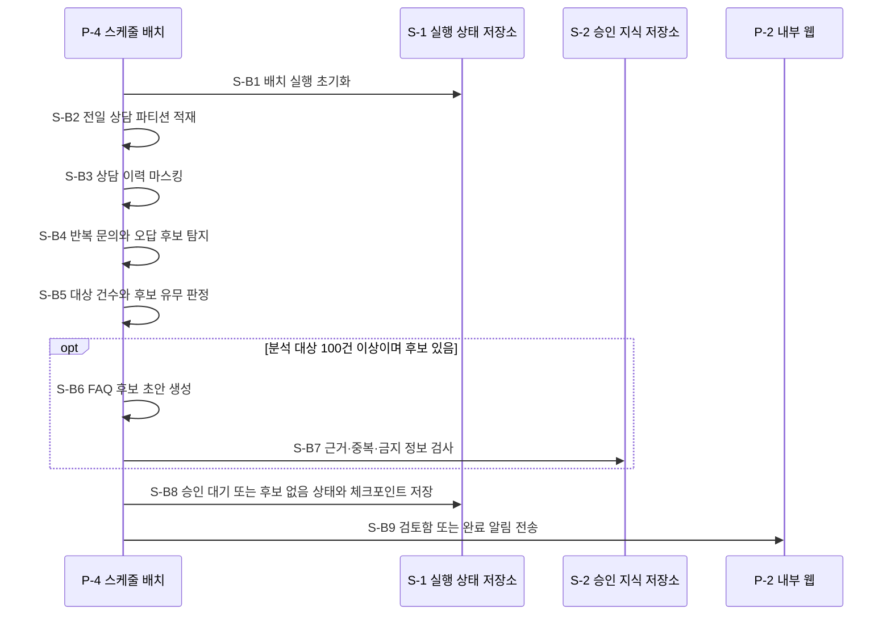
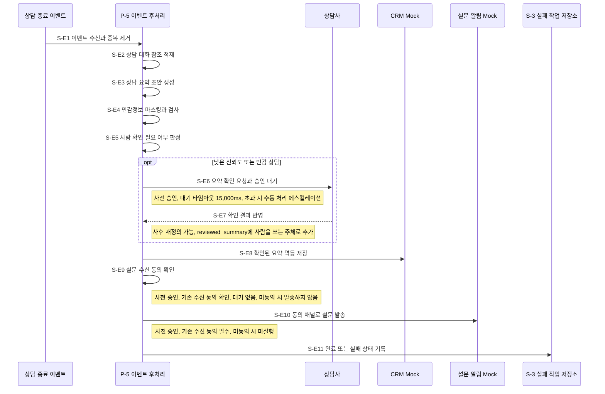

# ③ 워크플로우 설계: 신용카드사 AI Help Desk

`타임아웃 값의 단일 출처는 본 산출물임`

## 워크플로우 표

| 워크플로우ID | 워크플로우명 | 트리거 유형 | 설명 |
|---|---|---|---|
| `W-1` | 고객 문의 처리 | 동기 요청 | 문의를 검사·분류하고 승인 지식과 읽기 전용 상태를 조회하여 근거 답변 또는 상담사 인계 안내를 반환함 |
| `W-2` | 상담 지식 개선 배치 | 스케줄 배치 | 매일 02:00 전일 상담을 분석하여 FAQ 후보를 승인 대기 상태로 저장함 |
| `W-3` | 상담 종료 후처리 | 이벤트 | 상담 종료 이벤트 뒤 요약·마스킹·CRM 저장·동의 기반 설문 발송을 처리함 |

**참여 주체**

| 구분 | 참여 주체 | 사용 워크플로우 | 근거 출처 |
|---|---|---|---|
| 사용자·화면 | 고객·고객 Help Desk 화면·상담사·운영자 화면·지식·준법 검토자 | `W-1`·`W-2`·`W-3` | BM:ACT-01, BM:ACT-02, BM:ACT-04, BM:CMP-01, BM:CMP-02 |
| 내부 실행 | 상담 오케스트레이션 API·지식 검색 모듈·도구 연결 게이트웨이·배치 작업자·이벤트 후처리 작업자 | `W-1`·`W-2`·`W-3` | BM:CMP-03, BM:CMP-04, BM:CMP-05, BM:CMP-06, BM:CMP-07 |
| 내부 저장 | S-1 실행 상태 저장소·S-2 승인 지식 저장소·S-3 실패 작업 저장소 | `W-1`·`W-2`·`W-3` | BM:CMP-08, BM:DATA-01, BM:TECH-07 |
| 외부 시스템 | 상용 LLM Mock·고객·카드 조회 API Mock·거래 조회 API Mock·CRM Mock·설문 알림 Mock | `W-1`·`W-2`·`W-3` | BM:TECH-01, BM:TOOL-02, BM:TOOL-03, BM:TOOL-05, BM:TOOL-06 |

**단계 패턴 판정**

| 후보 | 판정 | 이유 | 적용 단계 |
|---|---|---|---|
| 고정 워크플로우 | 채택 | 실행 순서와 조건 분기가 기획 정책으로 미리 정해짐 | 라우터 2개를 제외한 모든 단계 |
| 라우터 | 채택 | 문의 유형과 결과 검사에 따라 다음 경로가 택일됨 | `S-R3`·`S-R7` |
| 서브에이전트 | 기각 | 결과만 돌려받는 독립 하위 목표가 없고 세 워크플로우가 직접 단계를 소유함 | 해당 없음 |
| 핸드오프 | 기각 | 상담사 인계는 대기열 생성으로 워크플로우가 종료되며 AI 제어권 위임이 아님 | 해당 없음 |

**정보 검색 워크플로우 패턴 판정**

| 질문 | 판정 | 이유 | 결과 |
|---|---|---|---|
| Q1 검색 없이 답할 수 있는 질의가 섞여 있는가 | 예 | 민감 조치·민원·분쟁 문의는 검색 없이 상담사 인계 경로로 갈 수 있음 | `S-R3` 라우터, Self-RAG 참고 라벨 |
| Q2 질의에 따라 정형·의미정보·관계정보·외부검색 중 갈 곳이 달라지는가 | 예 | S-2 승인 지식과 고객·카드·거래 조회 API의 경로가 문의 유형에 따라 달라짐 | `S-R3` 라우터, Adaptive RAG 참고 라벨 |
| Q3 결과가 부실할 때 되돌려 다시 찾아야 하는가 | 아니오 | 낮은 신뢰도·근거 없음은 재검색하지 않고 상담사 인계로 종료함 | 반복 구간 미생성 |
| Q4 한 번으로 끝나지 않고 도구를 오가야 하는가 | 아니오 | 조회 대상은 `S-R3`에서 정한 뒤 `S-R4`·`S-R5`에서 한 번씩 실행함 | 서브에이전트·도구 루프 미생성 |

## 워크플로우별 설계

### `W-1` 고객 문의 처리

**총 시간예산**

- 전체 하드 타임아웃: 15,000ms
- 응답시간 목표: 문의 접수부터 근거 답변 또는 상담사 인계 안내까지 5,000ms 이하(p95)
- 단말 구간을 포함한 End-to-End 예산이며 `S-R1`부터 `S-R11`까지 적용함

**Sequence**

**단계별 설계**

| 단계 | 참여 주체 | 행동 1개 | p95 배정 | 타임아웃(상한) | 재시도 | 최악값 | 초과 시 처리 | 인간 개입 | 모델 호출 | 패턴 | 근거 출처 |
|---|---|---|---:|---:|---:|---:|---|---|---:|---|---|
| `S-R1` | 고객 → 고객 Help Desk 화면 | 문의 제출과 요청 ID 발급 | 100ms | 200ms | 0회 | 200ms × (1+0회) = 200ms | 안전 종료: 입력 수정과 재요청 안내 | — | 0회 | 고정 워크플로우 | US:UFR-HDK-010 |
| `S-R2` | 고객 Help Desk 화면 → 상담 오케스트레이션 API | 요청 접수와 입력 불신 표시·민감정보 차단 | 150ms | 300ms | 0회 | 300ms × (1+0회) = 300ms | 안전 종료: 요청 ID와 상담 연결 경로 안내 | — | 0회 | 고정 워크플로우 | BM:POL-01, US:NFR-SYS-010 |
| `S-R3` | 상담 오케스트레이션 API → 상용 LLM Mock | 문의 유형·위험·조회 경로 판정 | 250ms | 500ms | 0회 | 500ms × (1+0회) = 500ms | 안전 종료: 분류 실패와 상담 연결 선택지 안내 | — | 1회 | 라우터 | ES:WF-01, BM:POL-03, BM:POL-04 |
| `S-R4` | 상담 오케스트레이션 API → 지식 검색 모듈·S-2 승인 지식 저장소 | 유효한 승인 근거 검색 | 600ms | 1,500ms | 1회 | 1,500ms × (1+1회) = 3,000ms | 부분 결과로 계속: 근거 없음 표시 후 인계 경로만 사용 | — | 0회 | 고정 워크플로우 | US:UFR-HDK-020, BM:DATA-01 |
| `S-R5` | 상담 오케스트레이션 API → 도구 연결 게이트웨이·조회 API Mock | 권한 확인 뒤 읽기 전용 상태 조회 | 1,000ms | 3,000ms | 2회 | 3,000ms × (1+2회) = 9,000ms | 부분 결과로 계속: 조회 실패 표시와 상담 연결 선택지 제공 | — | 0회 | 고정 워크플로우 | US:UFR-HDK-030 |
| `S-R6` | 상담 오케스트레이션 API → 상용 LLM Mock | 근거·상태를 합친 답변 초안 생성 | 700ms | 1,500ms | 1회 | 1,500ms × (1+1회) = 3,000ms | 부분 결과로 계속: 초안 미사용과 상담 인계 전환 | — | 2회 | 고정 워크플로우 | ES:WF-01, US:UFR-HDK-020 |
| `S-R7` | 상담 오케스트레이션 API | 근거·신뢰도·금지 표현·민감정보 검사 후 결과 선택 | 100ms | 300ms | 0회 | 300ms × (1+0회) = 300ms | 안전 종료: 검사 실패와 상담 연결 선택지 안내 | — | 0회 | 라우터 | US:UFR-HDK-020, BM:POL-03 |
| `S-R8` | 상담 오케스트레이션 API → 고객 Help Desk 화면 | 근거 답변과 다음 행동 반환 | 100ms | 300ms | 0회 | 300ms × (1+0회) = 300ms | 안전 종료: 요청 ID와 재조회 안내 | — | 0회 | 고정 워크플로우 | BM:OUT-01 |
| `S-R9` | 상담 오케스트레이션 API | 기존 State로 인계 카드 구성 | 150ms | 400ms | 0회 | 400ms × (1+0회) = 400ms | 부분 결과로 계속: 조회 상태 없이 사유와 요청 ID만 구성 | — | 0회 | 고정 워크플로우 | US:UFR-HDK-040 |
| `S-R10` | 상담 오케스트레이션 API → 상담사·운영자 화면 | 멱등 키로 상담 대기열 항목 생성 | 250ms | 600ms | 0회 | 600ms × (1+0회) = 600ms | 안전 종료: 대기열 실패와 대체 연락 경로 안내 | — | 0회 | 고정 워크플로우 | US:UFR-HDK-040, BM:TOOL-04 |
| `S-R11` | 상담 오케스트레이션 API → 고객 Help Desk 화면 | 상담사 연결 상태 반환 | 100ms | 300ms | 0회 | 300ms × (1+0회) = 300ms | 안전 종료: 요청 ID와 대체 연락 경로 안내 | — | 0회 | 고정 워크플로우 | BM:OUT-02 |

반복 구간: 0건, `max_iter = 0회`

- 최악값 합계: 200(`S-R1`) + 300(`S-R2`) + 500(`S-R3`)
  + max(3,000(`S-R4`), 9,000(`S-R5`)) + 3,000(`S-R6`) + 300(`S-R7`)
  + max(300(`S-R8`), 400+600+300(`S-R9` ~ `S-R11`)) = 14,600ms ≤ 15,000ms임. 통과함
- p95 합계: 100 + 150 + 250 + max(600, 1,000) + 700 + 100
  + max(100, 150+250+100) = 2,800ms ≤ 5,000ms임. 통과함
- 최악 모델 호출: 1회(`S-R3`) + 2회(`S-R6`) = 요청당 3회임
- 단계 표 11행과 도식의 고유 단계 `S-R1` ~ `S-R11` 11개가 일치함
- 판단 단계 `S-R3`·`S-R7`과 반환·대기열 생성 단계 `S-R8`·`S-R10`을 분리함

**State 구조**

| State 필드 | 타입 | 쓰는 단계 | 읽는 단계 | 누적·갱신 규칙 | 민감정보 대조 | 근거 출처 |
|---|---|---|---|---|---|---|
| `request_id` | string | `S-R1` | `S-R2` ~ `S-R11` | 최초 발급 뒤 불변 | 없음 | US:UFR-HDK-010 |
| `customer_session_ref` | string | `S-R1` | `S-R2`·`S-R5` | 참조값만 보존 | SL-3 | US:UFR-HDK-010 |
| `inquiry_text` | string | `S-R2` | `S-R3`·`S-R6`·`S-R9` | 차단 검사 통과 텍스트로 1회 갱신 | SL-4 | BM:POL-01 |
| `route_decision` | object | `S-R3` | `S-R4` ~ `S-R7` | 경로 1개와 병렬 조회 여부를 고정 | 없음 | ES:WF-01 |
| `evidence_refs` | array | `S-R4` | `S-R6`·`S-R7`·`S-R9` | 문서 참조를 배열에 누적 | 없음 | BM:DATA-01 |
| `status_codes` | array | `S-R5` | `S-R6`·`S-R7`·`S-R9` | API별 결과를 배열에 누적 | SL-5 | BM:DATA-02, BM:DATA-03 |
| `answer_draft` | object | `S-R6` | `S-R7`·`S-R8` | 마지막 성공 호출 결과만 사용 | SL-5 | US:UFR-HDK-020 |
| `result_decision` | enum | `S-R7` | `S-R8` ~ `S-R11` | `answer`·`handoff`·`safe_stop` 중 1개 | 없음 | BM:POL-03 |
| `handoff_card` | object | `S-R9` | `S-R10`·`S-R11` | 기존 State의 허용 필드만 복사 | SL-4·SL-5·SL-6 | BM:OUT-02 |

**체크포인트 보존**

| 보존 사유 | 스레드 식별 단위 | 세션 격리 키 성분 | 체크포인트를 남기는 단계 | 스레드 최소 생존 시간 | 적재되는 민감 State 필드 | 삭제 트리거 |
|---|---|---|---|---|---|---|
| 없음: 체크포인터 미사용 | 해당 없음 | 해당 없음 | 해당 없음 | 해당 없음 | 해당 없음 | 해당 없음 |

### `W-2` 상담 지식 개선 배치

**총 시간예산**

- 전체 하드 타임아웃: 14,400,000ms, 02:00 시작 후 06:00 이전 완료
- 배치 완료 목표: 후보 승인 대기 또는 후보 없음 상태까지 14,400,000ms 이하

**Sequence**

**단계별 설계**

| 단계 | 참여 주체 | 행동 1개 | p95 배정 | 타임아웃(상한) | 재시도 | 최악값 | 초과 시 처리 | 인간 개입 | 모델 호출 | 패턴 | 근거 출처 |
|---|---|---|---:|---:|---:|---:|---|---|---:|---|---|
| `S-B1` | 배치 작업자 → S-1 실행 상태 저장소 | 기준일자·데이터버전 실행 키 초기화 | 30,000ms | 60,000ms | 0회 | 60,000ms × (1+0회) = 60,000ms | 안전 종료: 운영자 경고와 마지막 성공 단계 유지 | — | 0회 | 고정 워크플로우 | US:UFR-KNW-010 |
| `S-B2` | 배치 작업자 | 전일 상담 파티션 적재 | 180,000ms | 300,000ms | 2회 | 300,000ms × (1+2회) = 900,000ms | 부분 결과로 계속 금지: 부분 실패 상태와 재개 지점 저장 | — | 0회 | 고정 워크플로우 | US:UFR-KNW-010 |
| `S-B3` | 배치 작업자 | 상담 이력 민감정보 마스킹 | 300,000ms | 600,000ms | 2회 | 600,000ms × (1+2회) = 1,800,000ms | 안전 종료: 원문 분석 중단과 실패 파티션 격리 | — | 0회 | 고정 워크플로우 | BM:DATA-04, BM:POL-01 |
| `S-B4` | 배치 작업자 → 상용 LLM Mock | 반복 문의와 오답 후보 탐지 | 600,000ms | 900,000ms | 2회 | 900,000ms × (1+2회) = 2,700,000ms | 부분 결과로 계속 금지: 부분 실패 상태와 재개 지점 저장 | — | 3회 | 고정 워크플로우 | US:UFR-KNW-010 |
| `S-B5` | 배치 작업자 | 100건 기준과 후보 유무 판정 | 30,000ms | 60,000ms | 0회 | 60,000ms × (1+0회) = 60,000ms | 안전 종료: 판정 실패와 재개 가능 상태 안내 | — | 0회 | 고정 워크플로우 | US:UFR-KNW-010 |
| `S-B6` | 배치 작업자 → 상용 LLM Mock | 근거와 영향도가 있는 FAQ 후보 초안 생성 | 480,000ms | 900,000ms | 2회 | 900,000ms × (1+2회) = 2,700,000ms | 부분 결과로 계속: 생성 성공 후보만 검증하고 누락 수 기록 | — | 3회 | 고정 워크플로우 | US:UFR-KNW-020 |
| `S-B7` | 배치 작업자 → S-2 승인 지식 저장소 | 근거 유효성·중복·금지 정보 검사 | 300,000ms | 600,000ms | 2회 | 600,000ms × (1+2회) = 1,800,000ms | 부분 결과로 계속: 통과 후보만 남기고 격리 사유 기록 | — | 0회 | 고정 워크플로우 | US:UFR-KNW-020, BM:POL-05 |
| `S-B8` | 배치 작업자 → S-1 실행 상태 저장소 | 후보 승인 대기 또는 후보 없음 상태 저장 | 180,000ms | 300,000ms | 2회 | 300,000ms × (1+2회) = 900,000ms | 안전 종료: 저장 실패와 마지막 성공 단계 유지 | — | 0회 | 고정 워크플로우 | ES:WF-02, BM:POL-05 |
| `S-B9` | 배치 작업자 → 상담사·운영자 화면 | 검토함 또는 완료 알림 전송 | 120,000ms | 300,000ms | 2회 | 300,000ms × (1+2회) = 900,000ms | 부분 결과로 계속: 후보 상태는 유지하고 알림 실패 기록 | — | 0회 | 고정 워크플로우 | ES:WF-02 |

반복 구간: 0건, `max_iter = 0회`

- 최악값 합계: 60,000 + 900,000 + 1,800,000 + 2,700,000 + 60,000
  + 2,700,000 + 1,800,000 + 900,000 + 900,000 = 11,820,000ms
  ≤ 총 시간예산 14,400,000ms임. 통과함
- p95 합계: 30,000 + 180,000 + 300,000 + 600,000 + 30,000 + 480,000
  + 300,000 + 180,000 + 120,000 = 2,220,000ms ≤ 배치 완료 목표 14,400,000ms임. 통과함
- 최악 모델 호출: 3회(`S-B4`) + 3회(`S-B6`) = 배치 실행당 6회임
- 단계 표 9행과 도식의 고유 단계 `S-B1` ~ `S-B9` 9개가 일치함
- 판단 단계 `S-B5`와 승인 대기 상태 저장 단계 `S-B8`을 분리함
- FAQ 후보 저장은 승인 대기 상태까지만 수행함.  
  자동 게시 행동은 워크플로우에 포함하지 않음

**State 구조**

| State 필드 | 타입 | 쓰는 단계 | 읽는 단계 | 누적·갱신 규칙 | 민감정보 대조 | 근거 출처 |
|---|---|---|---|---|---|---|
| `batch_key` | object | `S-B1` | `S-B2` ~ `S-B9` | 기준일자·데이터버전 조합으로 불변 | 없음 | US:UFR-KNW-010 |
| `partition_cursor` | string | `S-B2` | `S-B3`·재개 시 `S-B2` | 마지막 완결 파티션만 갱신 | 없음 | US:UFR-KNW-010 |
| `masked_records_ref` | array | `S-B3` | `S-B4` | 원문 대신 마스킹 결과 참조만 누적 | SL-4 | BM:DATA-04 |
| `candidate_signals` | array | `S-B4` | `S-B5`·`S-B6` | 파티션별 신호를 배열에 누적 | 없음 | US:UFR-KNW-010 |
| `candidate_decision` | enum | `S-B5` | `S-B6` ~ `S-B9` | `generate`·`no_candidate`·`insufficient_data` 중 1개 | 없음 | ES:WF-02 |
| `faq_candidates` | array | `S-B6` | `S-B7`·`S-B8` | 후보별 해시를 키로 누적 | 없음 | US:UFR-KNW-020 |
| `validation_results` | array | `S-B7` | `S-B8`·`S-B9` | 후보별 검사 결과를 누적 | 없음 | US:UFR-KNW-020 |
| `batch_status` | enum | `S-B8` | `S-B9`·재개 시 `S-B1` | 마지막 성공 단계와 종료 상태를 함께 갱신 | 없음 | ES:WF-02 |

**재개 방안**

| 재개 단위 | 경계 단계 | 재실행 부작용 | 중복 방지 키(집합 식별자) |
|---|---|---|---|
| 기준일자·데이터버전 1건 | `S-B1` ~ `S-B9`의 각 성공 단계 직후 | 후보 중복 생성·중복 알림 가능성 있음. 후보 해시와 완료 단계로 차단함 | 기준일자 + 데이터버전 |

**체크포인트 보존**

| 보존 사유 | 스레드 식별 단위 | 세션 격리 키 성분 | 체크포인트를 남기는 단계 | 스레드 최소 생존 시간 | 적재되는 민감 State 필드 | 삭제 트리거 |
|---|---|---|---|---|---|---|
| A 재개 | 기준일자·데이터버전 1건 | `W-2` + 기준일자 + 데이터버전 | `S-B1` ~ `S-B9`의 각 성공 단계 직후 | 14,400,000ms | `masked_records_ref`(SL-4 참조) | 만료 배치: 미완 실행과 실패 재처리 대상은 제외함 |

### `W-3` 상담 종료 후처리

**총 시간예산**

- 전체 하드 타임아웃: 75,000ms, 설문 발송 또는 실패 보관까지의 활성 처리 시간
- CRM 저장 마일스톤 목표: 상담 종료 이벤트부터 60,000ms 이하(p95)
- 사람 확인 대기는 활성 처리에 포함하며 `S-E6`에서 15,000ms로 제한함

**Sequence**

**단계별 설계**

| 단계 | 참여 주체 | 행동 1개 | p95 배정 | 타임아웃(상한) | 재시도 | 최악값 | 초과 시 처리 | 인간 개입 | 모델 호출 | 패턴 | 근거 출처 |
|---|---|---|---:|---:|---:|---:|---|---|---:|---|---|
| `S-E1` | 이벤트 후처리 작업자 → S-1 실행 상태 저장소 | eventId 수신과 중복 제거 | 100ms | 200ms | 0회 | 200ms × (1+0회) = 200ms | 안전 종료: 중복은 기존 결과 반환, 신규 실패는 재처리 안내 | — | 0회 | 고정 워크플로우 | US:UFR-OPS-010 |
| `S-E2` | 이벤트 후처리 작업자 | 상담 대화 참조 적재 | 500ms | 1,000ms | 0회 | 1,000ms × (1+0회) = 1,000ms | 안전 종료: 원문 CRM 복사 없이 실패 보관 | — | 0회 | 고정 워크플로우 | US:UFR-OPS-010 |
| `S-E3` | 이벤트 후처리 작업자 → 상용 LLM Mock | 상담 요약 초안 생성 | 3,000ms | 10,000ms | 0회 | 10,000ms × (1+0회) = 10,000ms | 안전 종료: 요약 실패와 수동 처리 안내 | — | 1회 | 고정 워크플로우 | US:UFR-OPS-010 |
| `S-E4` | 이벤트 후처리 작업자 | 민감정보 마스킹과 출력 검사 | 300ms | 1,000ms | 0회 | 1,000ms × (1+0회) = 1,000ms | 안전 종료: 원문 저장 차단과 실패 보관 | — | 0회 | 고정 워크플로우 | US:UFR-OPS-010, US:UFR-OPS-020 |
| `S-E5` | 이벤트 후처리 작업자 | 낮은 신뢰도·민감 상담 여부 판정 | 100ms | 300ms | 0회 | 300ms × (1+0회) = 300ms | 안전 종료: 판단 실패 시 사람 확인 경로 사용 | — | 0회 | 고정 워크플로우 | US:UFR-OPS-010 |
| `S-E6` | 이벤트 후처리 작업자 → 상담사 | 필요한 경우 요약 승인 요청과 대기 | 15,000ms | 15,000ms | 0회 | 15,000ms × (1+0회) = 15,000ms | 안전 종료: CRM 미저장, 실패 보관과 수동 처리 에스컬레이션 | 사전 승인, 대기 타임아웃 15,000ms, 초과 시 수동 처리 에스컬레이션 | 0회 | 고정 워크플로우 | US:UFR-OPS-010 |
| `S-E7` | 상담사 → 이벤트 후처리 작업자 | 승인·수정·반려 결과 반영 | 200ms | 500ms | 0회 | 500ms × (1+0회) = 500ms | 안전 종료: 확인 결과 불명확 시 CRM 미저장과 수동 처리 | 사후 재정의 가능, `reviewed_summary`에 사람을 쓰는 주체로 추가 | 0회 | 고정 워크플로우 | US:UFR-OPS-010 |
| `S-E8` | 이벤트 후처리 작업자 → CRM Mock | 확인된 요약을 멱등 키로 한 번 저장 | 1,000ms | 5,000ms | 3회 | 5,000ms × (1+3회) = 20,000ms | 안전 종료: CRM 미저장, 실패 보관과 운영자 알림 | — | 0회 | 고정 워크플로우 | US:UFR-OPS-020 |
| `S-E9` | 이벤트 후처리 작업자 | 설문 수신 동의와 동의 채널 확인 | 100ms | 200ms | 0회 | 200ms × (1+0회) = 200ms | 부분 결과로 계속: CRM 결과를 유지하고 설문은 생략 | 사전 승인, 기존 수신 동의 확인, 대기 없음, 미동의 시 발송하지 않음 | 0회 | 고정 워크플로우 | US:UFR-OPS-030 |
| `S-E10` | 이벤트 후처리 작업자 → 설문 알림 Mock | 동의 채널로 설문 링크 발송 | 1,000ms | 5,000ms | 3회 | 5,000ms × (1+3회) = 20,000ms | 부분 결과로 계속: CRM 결과 유지, 설문 실패 보관과 운영자 알림 | 사전 승인, `S-E9`의 기존 수신 동의 필수, 미동의 시 미실행 | 0회 | 고정 워크플로우 | US:UFR-OPS-030 |
| `S-E11` | 이벤트 후처리 작업자 → S-1·S-3 저장소 | 완료 또는 실패 상태 기록 | 200ms | 500ms | 0회 | 500ms × (1+0회) = 500ms | 안전 종료: 감사 추적 ID와 수동 기록 경로 안내 | — | 0회 | 고정 워크플로우 | US:AFR-OPS-040 |

반복 구간: 0건, `max_iter = 0회`

- 최악값 합계: 200 + 1,000 + 10,000 + 1,000 + 300 + 15,000 + 500
  + 20,000 + 200 + 20,000 + 500 = 68,700ms ≤ 총 시간예산 75,000ms임. 통과함
- CRM 마일스톤 p95 합계: 100 + 500 + 3,000 + 300 + 100 + 15,000 + 200 + 1,000
  = 20,200ms ≤ 응답시간 목표 60,000ms임. 통과함
- 전체 성공 경로 p95 합계: CRM 마일스톤 20,200 + 100 + 1,000 + 200 = 21,500ms임
- 최악 모델 호출: 1회(`S-E3`) = 이벤트당 1회임
- 단계 표 11행과 도식의 고유 단계 `S-E1` ~ `S-E11` 11개가 일치함
- 판단 단계 `S-E5`·`S-E9`와 실행 단계 `S-E8`·`S-E10`을 분리함

**State 구조**

| State 필드 | 타입 | 쓰는 단계 | 읽는 단계 | 누적·갱신 규칙 | 민감정보 대조 | 근거 출처 |
|---|---|---|---|---|---|---|
| `event_ref` | string | `S-E1` | `S-E2` ~ `S-E11` | 토큰화된 참조값으로 불변 | 없음 | US:UFR-OPS-010 |
| `consultation_ref` | string | `S-E1` | `S-E2`·`S-E8` | 원문 ID 대신 참조값 사용 | SL-6 | ES:WF-03 |
| `customer_ref_token` | string | `S-E1` | `S-E9`·`S-E10` | 토큰값으로 불변 | SL-3 | ES:WF-03 |
| `transcript_ref` | string | `S-E2` | `S-E3` | 상담 대화 원문 대신 위치 참조만 사용 | SL-4 | ES:WF-03 |
| `summary_draft` | object | `S-E3` | `S-E4` | 초안 1건만 유지 | SL-6 | US:UFR-OPS-010 |
| `masked_summary` | object | `S-E4` | `S-E5`·`S-E6`·`S-E8` | 검사 통과 결과만 기록 | SL-6 | US:UFR-OPS-020 |
| `review_required` | boolean | `S-E5` | `S-E6`·`S-E8` | 판정 뒤 불변 | 없음 | US:UFR-OPS-010 |
| `reviewed_summary` | object | `S-E7`·사람 | `S-E8` | 승인·수정 결과만 갱신하며 반려는 저장 차단 | SL-6 | US:UFR-OPS-010 |
| `crm_result` | object | `S-E8` | `S-E9`·`S-E11` | eventId+CRM저장 키의 단일 결과만 유지 | SL-6 | US:UFR-OPS-020 |
| `survey_consent` | object | `S-E9` | `S-E10` | 확인 시각이 아닌 동의 상태와 채널만 기록 | SL-7 | US:UFR-OPS-030 |
| `survey_result` | object | `S-E10` | `S-E11` | eventId+설문발송 키의 단일 결과만 유지 | SL-7 | US:UFR-OPS-030 |
| `failure_state` | object | `S-E11` | 재개 시 실패 단계 | 성공 단계와 실패 사유를 분리해 기록 | 없음 | US:AFR-OPS-040 |

**재개 방안**

| 재개 단위 | 경계 단계 | 재실행 부작용 | 중복 방지 키(집합 식별자) |
|---|---|---|---|
| 상담 종료 이벤트 1건 | `S-E1` ~ `S-E11`의 각 성공 단계 직후 | CRM 중복 저장·설문 중복 발송 가능성 있음. 성공 단계 재실행 금지와 작업별 멱등 키로 차단함 | eventId + 작업종류 |

**체크포인트 보존**

| 보존 사유 | 스레드 식별 단위 | 세션 격리 키 성분 | 체크포인트를 남기는 단계 | 스레드 최소 생존 시간 | 적재되는 민감 State 필드 | 삭제 트리거 |
|---|---|---|---|---|---|---|
| A 재개·B 정지·재진입·C 사후 접근 | 상담 종료 이벤트 1건 | `W-3` + event 참조값 + 작업종류 | `S-E1` ~ `S-E11` 성공 직후와 `S-E6` 승인 대기 진입 시 | 15,000ms | `consultation_ref`·`customer_ref_token`·`transcript_ref`·`summary_draft`·`masked_summary`·`reviewed_summary`·`crm_result`·`survey_consent`·`survey_result` | 스레드 완료 즉시, 실패 작업은 S-3 이관 완료 뒤, 미완 승인 대기는 15,000ms 초과 뒤 |

## 프로세스별 API 설계

### `P-1` 고객 웹

P-1이 다른 프로세스에 노출하는 엔드포인트는 0건임.

### `P-2` 내부 웹

| 엔드포인트 | 요청 키(이름·타입·필수/선택) | 응답 키(이름·타입·필수/선택) | 호출하는 워크플로우·단계 |
|---|---|---|---|
| `POST /internal/handoffs` | `request_id` string 필수, `handoff_card` object 필수 | `handoff_ref` string 필수, `queue_status` string 필수 | `W-1`의 `S-R10` |
| `POST /internal/faq-candidates` | `batch_key` object 필수, `faq_candidates` array 필수, `validation_results` array 필수 | `review_ref` string 필수, `review_status` string 필수 | `W-2`의 `S-B9` |
| `POST /internal/summary-reviews` | `event_ref` string 필수, `masked_summary` object 필수, `review_reason` array 필수 | `review_ref` string 필수, `review_status` string 필수 | `W-3`의 `S-E6` |

### `P-3` 동기 요청 처리

| 엔드포인트 | 요청 키(이름·타입·필수/선택) | 응답 키(이름·타입·필수/선택) | 호출하는 워크플로우·단계 |
|---|---|---|---|
| `POST /helpdesk/inquiries` | `request_id` string 필수, `inquiry_text` string 필수, `channel` string 필수, `customer_session_ref` string 필수 | `result_type` string 필수, `answer` object 선택, `handoff_ref` string 선택, `request_status` string 필수 | `W-1`의 `S-R2`·`S-R8`·`S-R11` |

### `P-4` 스케줄 배치

P-4가 다른 프로세스에 노출하는 엔드포인트는 0건임.

### `P-5` 이벤트 후처리

| 엔드포인트 | 요청 키(이름·타입·필수/선택) | 응답 키(이름·타입·필수/선택) | 호출하는 워크플로우·단계 |
|---|---|---|---|
| `POST /events/consultations/closed` | `event_ref` string 필수, `consultation_ref` string 필수, `customer_ref_token` string 필수, `transcript_ref` string 필수, `schema_version` string 필수 | `accepted` boolean 필수, `duplicate` boolean 필수, `processing_ref` string 필수 | `W-3`의 `S-E1` |
| `POST /internal/summary-reviews/{review_ref}/decision` | `decision` string 필수, `reviewed_summary` object 선택, `decision_reason` string 선택 | `accepted` boolean 필수, `resume_stage` string 필수 | `W-3`의 `S-E7` |

**뒤 산출물이 사용할 확정 목록**

| 워크플로우 | 단계 이름·개수 |
|---|---|
| `W-1` 고객 문의 처리 | `S-R1` 문의 제출과 요청 식별, `S-R2` 요청 접수와 입력 안전 검사, `S-R3` 문의 분류와 경로 선택, `S-R4` 승인 지식 검색, `S-R5` 읽기 전용 상태 조회, `S-R6` 근거 답변 초안 생성, `S-R7` 출력 검사와 결과 선택, `S-R8` 근거 답변 반환, `S-R9` 인계 카드 구성, `S-R10` 상담 대기열 생성, `S-R11` 인계 상태 반환: 11개 |
| `W-2` 상담 지식 개선 배치 | `S-B1` 배치 실행 초기화, `S-B2` 전일 상담 파티션 적재, `S-B3` 상담 이력 마스킹, `S-B4` 반복 문의·오답 후보 탐지, `S-B5` 후보 유무 판정, `S-B6` FAQ 후보 초안 생성, `S-B7` 후보 검사, `S-B8` 승인 대기 상태 저장, `S-B9` 검토함 알림: 9개 |
| `W-3` 상담 종료 후처리 | `S-E1` 이벤트 수신과 중복 제거, `S-E2` 상담 대화 참조 적재, `S-E3` 상담 요약 초안 생성, `S-E4` 마스킹과 검사, `S-E5` 사람 확인 필요 판정, `S-E6` 승인 요청과 대기, `S-E7` 확인 결과 반영, `S-E8` CRM 저장, `S-E9` 설문 수신 동의 확인, `S-E10` 설문 발송, `S-E11` 완료·실패 기록: 11개 |

| 프로세스 | 확정 엔드포인트 |
|---|---|
| `P-1` | 0건 |
| `P-2` | `POST /internal/handoffs`·`POST /internal/faq-candidates`·`POST /internal/summary-reviews` |
| `P-3` | `POST /helpdesk/inquiries` |
| `P-4` | 0건 |
| `P-5` | `POST /events/consultations/closed`·`POST /internal/summary-reviews/{review_ref}/decision` |

**미확정 항목**

| `[확인필요]` 태그 | 무엇이 없나 | 누구에게 되묻나 | 안 오면 무엇이 막히나 |
|---|---|---|---|
| 0건 | ③이 사용하는 값의 미확정 항목 없음 | 해당 없음 | 해당 없음 |

**변경요청**

| 무엇 | 받는 곳 | 사유 |
|---|---|---|
| — | — | 0건 |
