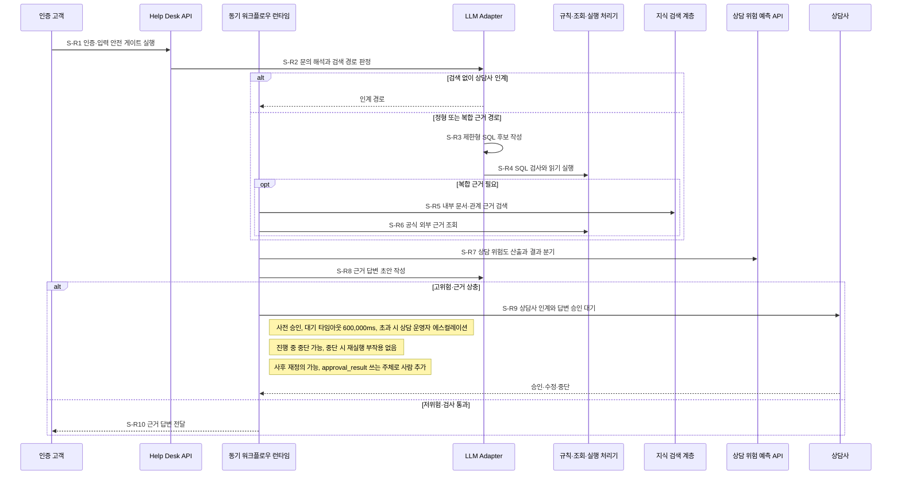
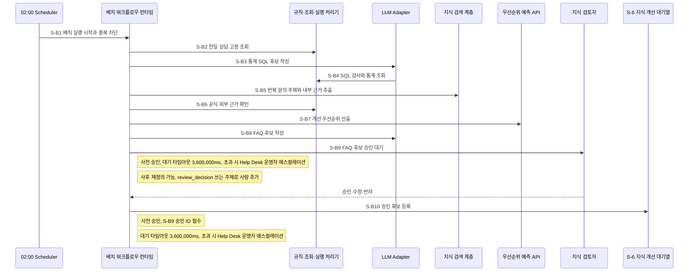
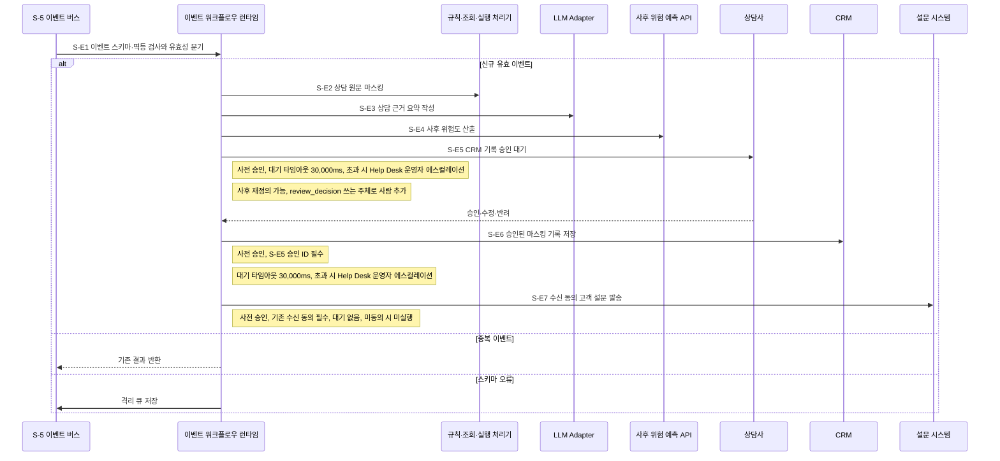

# ③ 워크플로우 설계

`타임아웃 값의 단일 출처는 본 산출물임`

## 워크플로우 표

| 워크플로우ID | 워크플로우명 | 트리거 유형 | 설명 | 근거 출처 |
|---|---|---|---|---|
| `W-1` | 고객 문의 동기 처리 | 동기 요청 | 인증 문의를 해석하고 정형·의미·관계·외부 근거로 답변하거나 상담사에게 인계함 | ES:W-01#트리거 |
| `W-2` | 상담 지식 개선 배치 | 스케줄 배치 | 매일 02:00 전일 상담을 분석하고 승인된 FAQ 개선 후보를 대기열에 등록함 | ES:W-02#트리거 |
| `W-3` | 상담 종료 이벤트 처리 | 이벤트 | 상담 종료 이벤트를 마스킹·요약하고 승인 후 CRM 기록과 설문 발송을 처리함 | ES:W-03#트리거 |

**참여 주체**

| 구분 | 참여 주체 | 사용 워크플로우 | 근거 출처 |
|---|---|---|---|
| 사용자 채널 | 인증 고객·상담사·지식 검토자·Help Desk 운영자·Help Desk 채널 | `W-1`·`W-2`·`W-3` | ES:3#액터 |
| 내부 실행 | 동기·배치·이벤트 워크플로우 런타임·LLM Adapter·규칙·조회·실행 처리기·위험 예측 API | `W-1`·`W-2`·`W-3` | 설계판단(② 논리아키텍처 내부 관계도) |
| 내부 저장 | `S-1` 승인 문서 저장소·`S-2` 업무 관계 그래프·`S-3` 용어사전·온톨로지·`S-4` 체크포인트 저장소·`S-5` 이벤트 버스·격리 큐·`S-6` 지식 개선 대기열·`S-7` 관측·감사 저장소 | `W-1`·`W-2`·`W-3` | 설계판단(② 논리아키텍처 내부 저장소 목록) |
| 외부 서비스 | 고객·카드·거래 조회계·상담·거래 분석 뷰·상용 LLM API·공식 웹·영상·CRM·설문 시스템 | `W-1`·`W-2`·`W-3` | 설계판단(② 논리아키텍처 신뢰경계표) |

**단계 패턴 후보 판정**

| 후보 | 판정 | 이유 | 적용 단계 |
|---|---|---|---|
| 고정 워크플로우 | 예 | 순서와 조건이 기획 정책으로 결정되는 단계임 | 라우터 외 전 단계 |
| 라우터 | 예 | 검색 경로·위험·이벤트 유효성에 따라 택일 분기가 필요함 | `S-R2`·`S-R7`·`S-E1` |
| 서브에이전트 | 아니오 | 결과만 돌려받는 독립 하위 목표가 없음 | 해당 없음 |
| 핸드오프 | 아니오 | 사람 승인 대기는 같은 워크플로우의 정지·재진입이며 제어권 위임이 아님 | 해당 없음 |

**정보 검색 워크플로우 패턴 판정**

| 질문 | 판정 | 이유 | 결과 |
|---|---|---|---|
| Q1 검색 없이 답할 수 있는 질의가 섞여 있는가 | 예 | 고객이 상담사 연결을 요청하거나 입력 검사에 실패하면 검색 없이 종료함 | `S-R2` 라우터, Self-RAG 참고 라벨 |
| Q2 정형·의미정보·관계정보·외부검색 중 갈 곳이 달라지는가 | 예 | `S-1`·`S-2`·`S-3`와 외부정보·정형 조회의 용도가 다름 | `S-R2` 라우터, Adaptive RAG 참고 라벨 |
| Q3 결과가 부실할 때 다시 찾아야 하는가 | 아니오 | 검색 품질 임계값이 아직 ⑤ 소유값이므로 근거 없음·상충은 사람 인계로 종료함 | 반복 검색 없음 |
| Q4 도구를 여러 번 오가야 하는가 | 아니오 | 경로 판정 뒤 정해진 조회를 한 번씩 수행하며 자율 도구 루프가 없음 | 서브에이전트·도구 루프 없음 |

라우터 최악값은 실행되지 않는 분기를 합산하지 않고  
각 라우터의 가장 비싼 분기만 반영함.

## 워크플로우별 설계

### `W-1` 고객 문의 동기 처리

**총 시간예산**

- 전체 하드 타임아웃: 615,000ms. 상담사 승인 대기 600,000ms 포함값임
- 응답시간 목표: 근거 답변 또는 상담사 인계 접수까지 5,000ms 이내(p95)임
- 고위험 분기는 `S-R9` 진입과 동시에 인계 접수를 반환함.  
  승인 대기는 응답 마일스톤 뒤에 계속됨

**Sequence**

**단계별 설계**

| 단계 | 참여 주체 | 행동 1개 | p95 배정 | 타임아웃(상한) | 재시도 | 최악값 | 초과 시 처리 | 인간 개입 | 모델 호출 | 패턴 | 근거 출처 |
|---|---|---|---:|---:|---:|---:|---|---|---:|---|---|
| `S-R1` | 인증 고객 → Help Desk API | 인증·입력 안전 게이트 실행 | 100ms | 200ms | 1회 | 200ms × (1+1회) = 400ms | 안전 종료: 입력 수정 안내와 상담사 연결 경로 표시 | 해당 없음 | 0회 | 고정 워크플로우 | US:UFR-HDS-010#입력, US:NFR-PRI-010 |
| `S-R2` | 동기 워크플로우 런타임 → LLM Adapter | 문의 의미를 해석하고 택일 검색 경로 결정 | 300ms | 700ms | 1회 | 700ms × (1+1회) = 1,400ms | 대체 경로로 계속: 해석 실패를 상담사 인계 경로로 전환 | 해당 없음 | 2회 | 라우터 | ES:S-R2#문의해석 |
| `S-R3` | 동기 워크플로우 런타임 → LLM Adapter | 제한형 SQL 후보 작성 | 200ms | 400ms | 0회 | 400ms × (1+0회) = 400ms | 대체 경로로 계속: 내부 근거 검색 또는 상담사 인계로 전환 | 해당 없음 | 1회 | 고정 워크플로우 | ES:S-R3#SQL작성 |
| `S-R4` | 규칙·조회·실행 처리기 → 상담·거래 분석 뷰 | SQL 검사와 읽기 전용 실행 | 300ms | 700ms | 0회 | 700ms × (1+0회) = 700ms | 안전 종료: 금지 SQL 차단과 상담사 인계 안내 | 해당 없음 | 0회 | 고정 워크플로우 | US:AC-010-1 |
| `S-R5` | 동기 워크플로우 런타임 → `S-1`·`S-2`·`S-3` | 승인 문서·관계·온톨로지 근거 검색 | 500ms | 1,000ms | 0회 | 1,000ms × (1+0회) = 1,000ms | 부분 결과로 계속: 빠진 내부 근거 유형을 응답 후보에 표시 | 해당 없음 | 1회 | 고정 워크플로우 | US:AC-010-2 |
| `S-R6` | 규칙·조회·실행 처리기 → 공식 웹·영상 | 비식별 검색어로 공식 외부 근거 조회 | 500ms | 1,000ms | 0회 | 1,000ms × (1+0회) = 1,000ms | 부분 결과로 계속: 외부 근거 누락을 표시하고 내부 근거만 사용 | 해당 없음 | 0회 | 고정 워크플로우 | US:AC-010-3 |
| `S-R7` | 동기 워크플로우 런타임 → 상담 위험 예측 API | 고정 특성으로 위험 점수를 산출하고 저위험·고위험 분기 결정 | 100ms | 300ms | 0회 | 300ms × (1+0회) = 300ms | 대체 경로로 계속: 오류를 고위험으로 간주하고 상담사 인계 | 해당 없음 | 0회 | 라우터 | ES:S-R7#위험산출 |
| `S-R8` | 동기 워크플로우 런타임 → LLM Adapter | 검증 근거로 답변 초안 작성 | 600ms | 1,200ms | 1회 | 1,200ms × (1+1회) = 2,400ms | 대체 경로로 계속: 초안을 폐기하고 상담사 인계로 전환 | 해당 없음 | 2회 | 고정 워크플로우 | ES:S-R8#답변초안 |
| `S-R9` | 동기 워크플로우 런타임 → 상담사 | 인계 접수를 반환하고 답변 승인 대기 | 인계 접수 100ms | 600,000ms | 0회 | 600,000ms × (1+0회) = 600,000ms | 안전 종료: 자동 답변을 보류하고 상담 운영자에게 에스컬레이션 | 사전 승인, 대기 타임아웃 600,000ms, 초과 시 상담 운영자 에스컬레이션; 진행 중 중단 가능, 중단 시 재실행 부작용 없음; 사후 재정의 가능, `approval_result` 쓰는 주체로 사람 추가 | 0회 | 고정 워크플로우 | US:AC-010-4 |
| `S-R10` | 동기 워크플로우 런타임 → 인증 고객 | 승인·검사된 근거 답변 전달 | 100ms | 300ms | 1회 | 300ms × (1+1회) = 600ms | 안전 종료: 전달 실패와 요청 ID를 표시하고 상담사 연결 안내 | 해당 없음 | 0회 | 고정 워크플로우 | US:AC-010-5 |

| 반복구간ID | 되돌아가는 구간(단계 범위) | 최대 반복 횟수(`max_iter`) | 착지 노드 |
|---|---|---:|---|
| `R-1` | `S-R3` ~ `S-R4` | 1회 | `S-R5` 내부 근거 검색 또는 안전 종료 |

- 최악값 합계: 400(`S-R1`) + 1,400(`S-R2`) +
  (400(`S-R3`) + 700(`S-R4`)) × (1+1회) + 1,000(`S-R5`) + 1,000(`S-R6`) +
  300(`S-R7`) + 2,400(`S-R8`) + 600,000(`S-R9`, 가장 비싼 고위험 분기) + 600(`S-R10`)
  = 609,300ms ≤ 총 시간예산 615,000ms임. 통과함
- p95 합계: 100 + 300 + (200+300) × (1+1회) + 500 + 500 + 100 + 600 +
  max(100(`S-R9` 인계 접수), 100(`S-R10` 답변 전달)) = 3,200ms ≤ 응답시간 목표 5,000ms임. 통과함
- 최악 모델 호출: 2(`S-R2`) + 1(`S-R3`) × (1+1회) + 1(`S-R5`) + 2(`S-R8`)
  = 요청당 7회임
- 단계 표 10행과 도식의 고유 단계 `S-R1` ~ `S-R10` 10개가 일치함
- `S-R2`·`S-R7` 라우터는 각 택일 분기 중 복합 근거·고위험 분기만 최악값에 반영함

**State 구조**

| State 필드 | 타입 | 쓰는 단계 | 읽는 단계 | 누적·갱신 규칙 | 민감정보 대조 | 근거 출처 |
|---|---|---|---|---|---|---|
| `request_id` | string | `S-R1` | `S-R2` ~ `S-R10` | 최초 발급 뒤 불변 | 없음 | US:UFR-HDS-010#입력 |
| `auth_session_ref` | string | `S-R1` | `S-R1` | 원문 토큰 없이 참조값만 기록 | `SL-1` 인증 세션 | 설계판단(② 논리아키텍처 경계통과 민감정보) |
| `customer_ref` | string | `S-R1` | `S-R7`·`S-R9` | 비식별 참조값으로 불변 | `SL-2` 고객 식별자 | 설계판단(② 논리아키텍처 경계통과 민감정보) |
| `safe_inquiry_text` | string | `S-R1` | `S-R2`·`S-R8` | 입력 검사 통과 상담 원문 1건만 유지 | `SL-6` 상담 원문 | US:NFR-PRI-010 |
| `route_decision` | enum | `S-R2` | `S-R3` ~ `S-R6` | `handoff`·`structured`·`composite` 중 1개 | 없음 | 설계판단 |
| `sql_candidate` | string | `S-R3` | `S-R4` | 반복마다 교체하며 최종 검사본만 유지 | 없음 | US:AC-010-1 |
| `evidence_refs` | array | `S-R5` | `S-R8`·`S-R9` | 원천별 참조를 배열에 누적 | 없음 | US:AC-010-2 |
| `risk_result` | object | `S-R7` | `S-R8`·`S-R9` | 마지막 결정론적 결과 1건 유지 | 없음 | ES:S-R7#위험산출 |
| `answer_draft` | object | `S-R8` | `S-R9`·`S-R10` | 재시도 성공 결과로 교체 | `SL-6` 상담 원문 파생 | US:AC-010-4 |
| `approval_result` | object | `S-R9`·사람 | `S-R10` | 승인·수정·중단 결과만 기록 | `SL-2` 검토자 식별자·`SL-6` 수정 답변 | US:AC-010-4 |

**재개 방안**

동기 요청이므로 축 A 재개 방안은 적용하지 않음.

**체크포인트 보존**

| 보존 사유 | 스레드 식별 단위 | 세션 격리 키 성분 | 체크포인트를 남기는 단계 | 스레드 최소 생존 시간 | 적재되는 민감 State 필드 | 삭제 트리거 |
|---|---|---|---|---:|---|---|
| `B 정지·재진입`: `S-R9` 승인 대기·`C 사후 접근`: 답변 중단·재정의·`D 멀티턴`: 같은 고객 세션 후속 문의 | 고객 문의 요청 1건 | `W-1` + 고객 참조값 + 요청ID | `S-R9` 승인 대기 진입·승인 결과 수신 직후 | 600,000ms | `auth_session_ref`(`SL-1`)·`customer_ref`(`SL-2`)·`safe_inquiry_text`(`SL-6`)·`answer_draft`(`SL-6`)·`approval_result`(`SL-2`,`SL-6`) | 스레드 완료 즉시. 미완 승인 흐름은 600,000ms 초과 후 만료 배치 |

민감 State 필드 5건은 ②의 `SL-1`·`SL-2`·`SL-6`과 대조했으며  
⑤ 지식/도구의 적재 금지·암호화 판정 입력임.

### `W-2` 상담 지식 개선 배치

**총 시간예산**

- 전체 하드 타임아웃: 14,400,000ms. 매일 02:00 시작 후 06:00 이전 완료 기준임
- 사람 승인 대기 타임아웃 3,600,000ms를 포함함.  
  승인 ID가 없는 후보는 `S-B10`을 실행하지 않음

**Sequence**

**단계별 설계**

| 단계 | 참여 주체 | 행동 1개 | p95 배정 | 타임아웃(상한) | 재시도 | 최악값 | 초과 시 처리 | 인간 개입 | 모델 호출 | 패턴 | 근거 출처 |
|---|---|---|---:|---:|---:|---:|---|---|---:|---|---|
| `S-B1` | 02:00 Scheduler → 배치 워크플로우 런타임 | 실행 ID로 배치 시작과 중복 차단 | 60,000ms | 600,000ms | 0회 | 600,000ms × (1+0회) = 600,000ms | 안전 종료: 실행 잠금 유지 없이 운영자에게 실패 안내 | 해당 없음 | 0회 | 고정 워크플로우 | ES:S-B1#시작 |
| `S-B2` | 규칙·조회·실행 처리기 → 상담·거래 분석 뷰 | 전일 마스킹 상담 최대 10,000건 조회 | 300,000ms | 600,000ms | 1회 | 600,000ms × (1+1회) = 1,200,000ms | 부분 결과로 계속: 실패 파티션을 제외하고 누락 수 기록 | 해당 없음 | 0회 | 고정 워크플로우 | US:AC-020-1 |
| `S-B3` | 배치 워크플로우 런타임 → LLM Adapter | 통계 SQL 후보 작성 | 60,000ms | 120,000ms | 0회 | 120,000ms × (1+0회) = 120,000ms | 대체 경로로 계속: 고정 집계만 사용 | 해당 없음 | 1회 | 고정 워크플로우 | ES:S-B3#SQL작성 |
| `S-B4` | 규칙·조회·실행 처리기 → 상담·거래 분석 뷰 | SQL 검사와 통계 조회 | 120,000ms | 300,000ms | 0회 | 300,000ms × (1+0회) = 300,000ms | 안전 종료: 금지 SQL 차단과 실패 후보 제외 | 해당 없음 | 0회 | 고정 워크플로우 | ES:S-B4#통계조회 |
| `S-B5` | 배치 워크플로우 런타임 → LLM Adapter·`S-1`·`S-2`·`S-3` | 반복 문의 주제와 내부 근거 추출 | 600,000ms | 1,200,000ms | 1회 | 1,200,000ms × (1+1회) = 2,400,000ms | 부분 결과로 계속: 근거 있는 성공 주제만 유지하고 누락 수 기록 | 해당 없음 | 2회 | 고정 워크플로우 | US:AC-020-2 |
| `S-B6` | 규칙·조회·실행 처리기 → 공식 웹·영상 | 비식별 주제로 공식 외부 근거 확인 | 300,000ms | 900,000ms | 1회 | 900,000ms × (1+1회) = 1,800,000ms | 부분 결과로 계속: 외부 확인 실패를 표시하고 내부 근거만 유지 | 해당 없음 | 0회 | 고정 워크플로우 | US:AC-020-3 |
| `S-B7` | 배치 워크플로우 런타임 → 우선순위 예측 API | 고정 특성으로 개선 우선순위 산출 | 60,000ms | 120,000ms | 0회 | 120,000ms × (1+0회) = 120,000ms | 부분 결과로 계속: 오류 후보를 수동 검토 대상으로 표시 | 해당 없음 | 0회 | 고정 워크플로우 | US:AC-020-4 |
| `S-B8` | 배치 워크플로우 런타임 → LLM Adapter | 검증 근거로 FAQ 후보 최대 20건 작성 | 480,000ms | 900,000ms | 1회 | 900,000ms × (1+1회) = 1,800,000ms | 부분 결과로 계속: 작성 성공 후보만 승인 요청하고 누락 수 기록 | 해당 없음 | 2회 | 고정 워크플로우 | ES:S-B8#후보작성 |
| `S-B9` | 배치 워크플로우 런타임 → 지식 검토자 | FAQ 후보 승인·수정·반려 대기 | 1,800,000ms | 3,600,000ms | 0회 | 3,600,000ms × (1+0회) = 3,600,000ms | 안전 종료: 미승인 후보를 등록하지 않고 Help Desk 운영자에게 에스컬레이션 | 사전 승인, 대기 타임아웃 3,600,000ms, 초과 시 Help Desk 운영자 에스컬레이션; 사후 재정의 가능, `review_decision` 쓰는 주체로 사람 추가 | 0회 | 고정 워크플로우 | US:AC-020-5 |
| `S-B10` | 규칙·조회·실행 처리기 → `S-6` 지식 개선 대기열 | 승인 ID가 있는 FAQ 후보 등록 | 60,000ms | 300,000ms | 1회 | 300,000ms × (1+1회) = 600,000ms | 안전 종료: 중복 등록을 막고 승인 후보와 오류를 운영자에게 표시 | 사전 승인, `S-B9` 승인 ID 필수, 대기 타임아웃 3,600,000ms, 초과 시 Help Desk 운영자 에스컬레이션 | 0회 | 고정 워크플로우 | US:AC-020-5 |

| 반복구간ID | 되돌아가는 구간(단계 범위) | 최대 반복 횟수(`max_iter`) | 착지 노드 |
|---|---|---:|---|
| `R-2` | `S-B3` ~ `S-B4` | 1회 | `S-B5` 주제 추출 또는 안전 종료 |

- 최악값 합계: 600,000(`S-B1`) + 1,200,000(`S-B2`) +
  (120,000(`S-B3`) + 300,000(`S-B4`)) × (1+1회) + 2,400,000(`S-B5`) +
  1,800,000(`S-B6`) + 120,000(`S-B7`) + 1,800,000(`S-B8`) + 3,600,000(`S-B9`) +
  600,000(`S-B10`) = 12,960,000ms ≤ 총 시간예산 14,400,000ms임. 통과함
- p95 합계: 60,000 + 300,000 + (60,000+120,000) × (1+1회) + 600,000 + 300,000 +
  60,000 + 480,000 + 1,800,000 + 60,000 = 4,020,000ms임.
  매일 02:00 + 4,020,000ms = 03:07 완료 ≤ 배치 완료 목표 06:00임. 통과함
- 최악 모델 호출: 1(`S-B3`) × (1+1회) + 2(`S-B5`) + 2(`S-B8`) = 배치 실행당 6회임
- 단계 표 10행과 도식의 고유 단계 `S-B1` ~ `S-B10` 10개가 일치함

**State 구조**

| State 필드 | 타입 | 쓰는 단계 | 읽는 단계 | 누적·갱신 규칙 | 민감정보 대조 | 근거 출처 |
|---|---|---|---|---|---|---|
| `batch_id` | string | `S-B1` | `S-B2` ~ `S-B10` | 기준일과 데이터 버전에서 만든 참조값으로 불변 | 없음 | ES:S-B1#시작 |
| `batch_date` | date | `S-B1` | `S-B2`·재개 시 | 대상 업무일 1개로 불변 | 없음 | US:AC-020-1 |
| `masked_consultation_refs` | array | `S-B2` | `S-B5` | 파티션별 참조를 배열에 누적 | `SL-6` 상담 원문 파생 | 설계판단(② 논리아키텍처 경계통과 민감정보) |
| `sql_candidate` | string | `S-B3` | `S-B4` | 반복마다 교체하고 최종 검사본만 유지 | 없음 | US:AC-020-1 |
| `topic_evidence` | array | `S-B5` | `S-B7`·`S-B8` | 주제별 근거 참조를 배열에 누적 | 없음 | US:AC-020-2 |
| `priority_result` | array | `S-B7` | `S-B8`·`S-B9` | 후보별 점수·오류 표시를 누적 | 없음 | US:AC-020-4 |
| `faq_candidates` | array | `S-B8` | `S-B9`·`S-B10` | 후보 해시를 키로 최대 20건 누적 | `SL-6` 상담 원문 파생 | US:UFR-HDS-020#성공 |
| `review_decision` | object | `S-B9`·사람 | `S-B10` | 승인자 결정과 수정본으로 1회 갱신 | `SL-2` 검토자 식별자·`SL-6` 수정 후보 | US:AC-020-5 |
| `registration_result` | object | `S-B10` | 재개 시 | 후보 해시별 단일 등록 결과 유지 | 없음 | ES:S-B10#등록 |

**재개 방안**

| 재개 단위 | 경계 단계 | 재실행 부작용 | 중복 방지 키(집합 식별자) |
|---|---|---|---|
| 대상 업무일 배치 1건 | `S-B1` ~ `S-B10` 각 성공 단계 직후 | 후보 중복 작성·등록 가능성 있음. 후보 해시와 마지막 성공 단계로 차단함 | 워크플로우ID + 대상 업무일 + 데이터 버전 |

**체크포인트 보존**

| 보존 사유 | 스레드 식별 단위 | 세션 격리 키 성분 | 체크포인트를 남기는 단계 | 스레드 최소 생존 시간 | 적재되는 민감 State 필드 | 삭제 트리거 |
|---|---|---|---|---:|---|---|
| `A 재개`: 단계 실패 뒤 이어서 실행·`B 정지·재진입`: `S-B9` 승인 대기·`C 사후 접근`: 후보 재정의 | 대상 업무일 배치 1건 | `W-2` + 대상 업무일 + 데이터 버전 | 각 성공 단계 직후·`S-B9` 승인 대기 진입 | 3,600,000ms | `masked_consultation_refs`(`SL-6`)·`faq_candidates`(`SL-6`)·`review_decision`(`SL-2`,`SL-6`) | 스레드 완료 즉시. 미완 배치는 제외하고 3,600,000ms 초과 승인 대기는 만료 배치 |

민감 State 필드 3건은 ②의 `SL-2`·`SL-6`과 대조했으며  
⑤ 지식/도구의 적재 금지·암호화 판정 입력임.

### `W-3` 상담 종료 이벤트 처리

**총 시간예산**

- 전체 하드 타임아웃: 60,000ms.  
  이벤트 수신부터 CRM 기록·설문 결과 또는 안전 종료까지 적용함
- 응답시간 목표: CRM 기록 완료까지 60,000ms 이내(p95)임

**Sequence**

**단계별 설계**

| 단계 | 참여 주체 | 행동 1개 | p95 배정 | 타임아웃(상한) | 재시도 | 최악값 | 초과 시 처리 | 인간 개입 | 모델 호출 | 패턴 | 근거 출처 |
|---|---|---|---:|---:|---:|---:|---|---|---:|---|---|
| `S-E1` | `S-5` 이벤트 버스·격리 큐 → 상담 종료 Event Consumer | 이벤트 스키마·멱등 검사와 신규·중복·오류 분기 | 100ms | 200ms | 0회 | 200ms × (1+0회) = 200ms | 안전 종료: 중복은 기존 결과 반환, 오류는 격리 큐와 재처리 안내 기록 | 해당 없음 | 0회 | 라우터 | US:AC-030-1 |
| `S-E2` | 이벤트 워크플로우 런타임 → 규칙·조회·실행 처리기 | 상담 원문의 고정 민감정보 마스킹 | 200ms | 500ms | 0회 | 500ms × (1+0회) = 500ms | 안전 종료: 모델·CRM 호출을 막고 격리 큐에 실패 참조 저장 | 해당 없음 | 0회 | 고정 워크플로우 | ES:S-E2#마스킹 |
| `S-E3` | 이벤트 워크플로우 런타임 → LLM Adapter·`S-1`·`S-3` | 마스킹 원문과 승인 지침으로 상담 요약 작성 | 1,000ms | 3,000ms | 1회 | 3,000ms × (1+1회) = 6,000ms | 안전 종료: CRM 쓰기를 막고 수동 요약 재처리 대상으로 격리 | 해당 없음 | 2회 | 고정 워크플로우 | US:AC-030-2 |
| `S-E4` | 이벤트 워크플로우 런타임 → 사후 위험 예측 API | 고정 특성으로 사후 위험도 산출 | 100ms | 300ms | 0회 | 300ms × (1+0회) = 300ms | 대체 경로로 계속: 오류를 고위험으로 처리하고 사람 승인 요청 | 해당 없음 | 0회 | 고정 워크플로우 | ES:S-E4#위험산출 |
| `S-E5` | 이벤트 워크플로우 런타임 → 상담사 | CRM 기록 승인·수정·반려 대기 | 20,000ms | 30,000ms | 0회 | 30,000ms × (1+0회) = 30,000ms | 안전 종료: CRM 쓰기를 보류하고 Help Desk 운영자에게 에스컬레이션 | 사전 승인, 대기 타임아웃 30,000ms, 초과 시 Help Desk 운영자 에스컬레이션; 사후 재정의 가능, `review_decision` 쓰는 주체로 사람 추가 | 0회 | 고정 워크플로우 | US:AC-030-3 |
| `S-E6` | 규칙·조회·실행 처리기 → CRM | 승인된 마스킹 기록을 멱등 저장 | 1,000ms | 5,000ms | 2회 | 5,000ms × (1+2회) = 15,000ms | 안전 종료: 성공 단계는 유지하고 실패 이벤트를 격리 큐에 저장 | 사전 승인, `S-E5` 승인 ID 필수, 대기 타임아웃 30,000ms, 초과 시 Help Desk 운영자 에스컬레이션 | 0회 | 고정 워크플로우 | US:AC-030-3 |
| `S-E7` | 규칙·조회·실행 처리기 → 설문 시스템 | 수신 동의 고객에게 설문 링크 발송 | 1,000ms | 3,000ms | 1회 | 3,000ms × (1+1회) = 6,000ms | 부분 결과로 계속: CRM 결과를 유지하고 발송 실패를 격리 큐에 기록 | 사전 승인, 기존 수신 동의 필수, 대기 없음, 미동의 시 미실행 | 0회 | 고정 워크플로우 | US:AC-030-4, US:AC-030-5 |

반복 구간: 0건.

- 최악값 합계: 200(`S-E1`) + 500(`S-E2`) + 6,000(`S-E3`) + 300(`S-E4`) +
  30,000(`S-E5`) + 15,000(`S-E6`) + 6,000(`S-E7`, 신규 유효 이벤트 분기)
  = 58,000ms ≤ 총 시간예산 60,000ms임. 통과함
- p95 합계: 100 + 200 + 1,000 + 100 + 20,000 + 1,000 + 1,000
  = 23,400ms ≤ 응답시간 목표 60,000ms임. 통과함
- 최악 모델 호출: 2회(`S-E3`) = 이벤트당 2회임
- 단계 표 7행과 도식의 고유 단계 `S-E1` ~ `S-E7` 7개가 일치함
- `S-E1` 라우터는 중복·오류 분기를 합산하지 않고  
  가장 비싼 신규 유효 이벤트 분기만 반영함

**State 구조**

| State 필드 | 타입 | 쓰는 단계 | 읽는 단계 | 누적·갱신 규칙 | 민감정보 대조 | 근거 출처 |
|---|---|---|---|---|---|---|
| `event_id` | string | `S-E1` | `S-E2` ~ `S-E7` | 최초 수신 뒤 불변 | 없음 | US:UFR-HDS-030#입력 |
| `consultation_ref` | string | `S-E1` | `S-E2`·`S-E6` | 원문 식별자 대신 참조값 사용 | `SL-2` 고객·상담 식별자 | 설계판단(② 논리아키텍처 경계통과 민감정보) |
| `masked_transcript` | string | `S-E2` | `S-E3` | 마스킹 검사 통과본으로 1회 갱신 | `SL-6` 상담 원문 | ES:S-E2#마스킹 |
| `summary_draft` | object | `S-E3` | `S-E5` | 재시도 성공 결과로 교체 | `SL-6` 상담 원문 파생 | US:AC-030-2 |
| `risk_result` | object | `S-E4` | `S-E5` | 결정론적 점수와 오류 표시 1건 유지 | 없음 | ES:S-E4#위험산출 |
| `review_decision` | object | `S-E5`·사람 | `S-E6` | 승인자 결정과 수정 요약으로 갱신 | `SL-2` 검토자 식별자·`SL-6` 수정 요약 | US:AC-030-3 |
| `crm_result` | object | `S-E6` | `S-E7`·재개 시 | event ID별 단일 결과 유지 | `SL-2` 고객 참조·`SL-6` 마스킹 요약 | US:AC-030-3 |
| `survey_consent_ref` | string | `S-E1` | `S-E7` | 동의 원문 대신 참조값으로 불변 | `SL-2` 고객 식별자 | US:AC-030-4 |
| `survey_result` | object | `S-E7` | 재개 시 | event ID별 단일 발송 결과 유지 | `SL-2` 고객·상담 식별자 | US:AC-030-4 |

**재개 방안**

| 재개 단위 | 경계 단계 | 재실행 부작용 | 중복 방지 키(집합 식별자) |
|---|---|---|---|
| 상담 종료 이벤트 1건 | `S-E1` ~ `S-E7` 각 성공 단계 직후 | CRM 중복 저장·설문 중복 발송 가능성 있음. 성공 단계 재실행 금지와 작업별 멱등 키로 차단함 | 워크플로우ID + event ID + 작업 종류 |

**체크포인트 보존**

| 보존 사유 | 스레드 식별 단위 | 세션 격리 키 성분 | 체크포인트를 남기는 단계 | 스레드 최소 생존 시간 | 적재되는 민감 State 필드 | 삭제 트리거 |
|---|---|---|---|---:|---|---|
| `A 재개`: 실패 단계 재처리·`B 정지·재진입`: `S-E5` 승인 대기·`C 사후 접근`: 요약 재정의 | 상담 종료 이벤트 1건 | `W-3` + event ID + 작업 종류 | 각 성공 단계 직후·`S-E5` 승인 대기 진입 | 60,000ms | `consultation_ref`(`SL-2`)·`masked_transcript`(`SL-6`)·`summary_draft`(`SL-6`)·`review_decision`(`SL-2`,`SL-6`)·`crm_result`(`SL-2`,`SL-6`)·`survey_consent_ref`(`SL-2`)·`survey_result`(`SL-2`) | 스레드 완료 즉시. 미완 재처리 대상은 제외하고 만료 배치 |

민감 State 필드 7건은 ②의 `SL-2`·`SL-6`과 대조했으며  
⑤ 지식/도구의 적재 금지·암호화 판정 입력임.

## 프로세스별 API 설계

### `P-1` 고객 문의 동기 처리

| 엔드포인트 | 요청 키(이름·타입·필수/선택) | 응답 키(이름·타입·필수/선택) | 호출하는 워크플로우·단계 | 근거 출처 |
|---|---|---|---|---|
| `POST /v1/inquiries` | `request_id` string 필수, `auth_session_ref` string 필수, `inquiry_text` string 필수, `channel` string 필수 | `result_type` string 필수, `answer` object 선택, `handoff_ref` string 선택, `request_status` string 필수 | `W-1`의 `S-R1`·`S-R9`·`S-R10` | US:UFR-HDS-010#입력 |

### `P-2` 상담 지식 개선 배치

| 엔드포인트 | 요청 키(이름·타입·필수/선택) | 응답 키(이름·타입·필수/선택) | 호출하는 워크플로우·단계 | 근거 출처 |
|---|---|---|---|---|
| `POST /internal/faq-candidates/{candidate_id}/decisions` | `candidate_id` string 필수, `decision` string 필수, `reviewer_ref` string 필수, `revised_candidate` object 선택 | `approval_id` string 선택, `decision_status` string 필수, `resume_stage` string 필수 | `W-2`의 `S-B9` | US:AC-020-5 |

### `P-3` 상담 종료 이벤트 처리

| 엔드포인트 | 요청 키(이름·타입·필수/선택) | 응답 키(이름·타입·필수/선택) | 호출하는 워크플로우·단계 | 근거 출처 |
|---|---|---|---|---|
| `POST /events/consultations/closed` | `event_id` string 필수, `consultation_ref` string 필수, `ended_at` datetime 필수, `transcript` string 필수, `survey_consent_ref` string 필수 | `accepted` boolean 필수, `duplicate` boolean 필수, `processing_ref` string 필수 | `W-3`의 `S-E1` | US:UFR-HDS-030#입력 |
| `POST /internal/crm-record-reviews/{review_id}/decisions` | `review_id` string 필수, `decision` string 필수, `reviewer_ref` string 필수, `revised_summary` object 선택 | `approval_id` string 선택, `decision_status` string 필수, `resume_stage` string 필수 | `W-3`의 `S-E5` | US:AC-030-3 |

**뒤 산출물이 사용할 확정 목록**

| 워크플로우 | 단계 이름·개수 |
|---|---|
| `W-1` 고객 문의 동기 처리 | `S-R1` 입력·상태 검사, `S-R2` 문의 해석·경로 판정, `S-R3` SQL 작성, `S-R4` SQL 검사·실행, `S-R5` 내부 근거 검색, `S-R6` 외부 근거 조회, `S-R7` 위험 산출·분기, `S-R8` 답변 초안, `S-R9` 인계·승인 대기, `S-R10` 답변 전달: 10개 |
| `W-2` 상담 지식 개선 배치 | `S-B1` 배치 시작, `S-B2` 전일 상담 조회, `S-B3` SQL 작성, `S-B4` SQL 검사·실행, `S-B5` 주제·근거 추출, `S-B6` 외부 근거 확인, `S-B7` 우선순위 산출, `S-B8` FAQ 후보 작성, `S-B9` 승인 대기, `S-B10` 승인 후보 등록: 10개 |
| `W-3` 상담 종료 이벤트 처리 | `S-E1` 이벤트 검사·분기, `S-E2` 원문 마스킹, `S-E3` 상담 요약, `S-E4` 위험 산출, `S-E5` CRM 승인 대기, `S-E6` CRM 저장, `S-E7` 설문 발송: 7개 |

| 프로세스 | 확정 엔드포인트 |
|---|---|
| `P-1` | `POST /v1/inquiries` |
| `P-2` | `POST /internal/faq-candidates/{candidate_id}/decisions` |
| `P-3` | `POST /events/consultations/closed`·`POST /internal/crm-record-reviews/{review_id}/decisions` |

**미확정 항목**

| `[확인필요]` 태그 | 무엇이 없나 | 누구에게 되묻나 | 안 오면 무엇이 막히나 |
|---|---|---|---|
| 0건 | 해당 없음 | 해당 없음 | 차단 없음 |

**변경요청**

| 무엇 | 받는 곳 | 사유 |
|---|---|---|
| 해당 없음 | 해당 없음 | 0건 |
