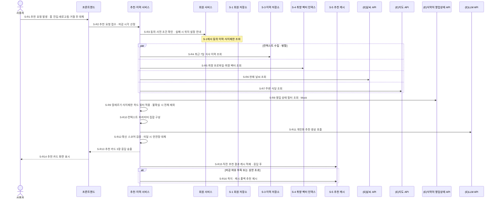
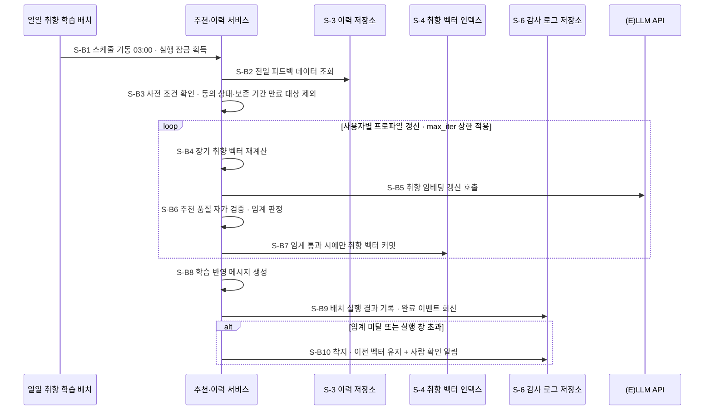
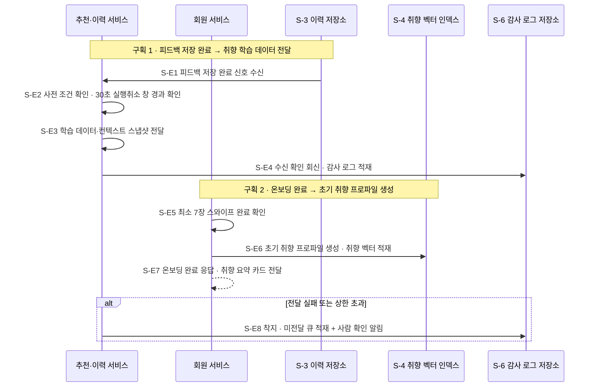
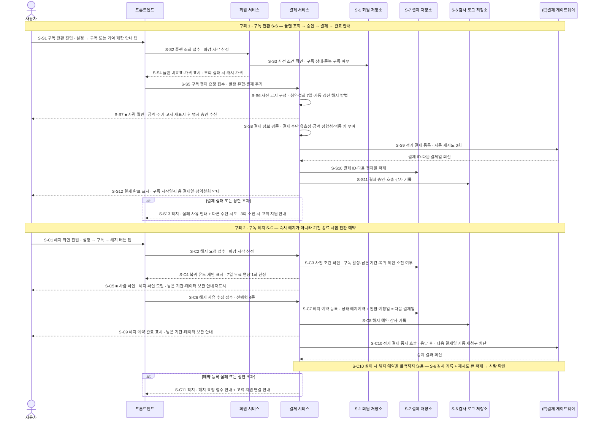
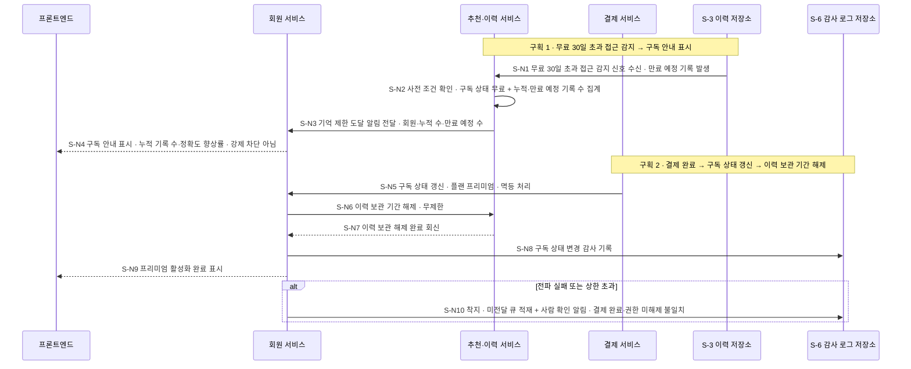
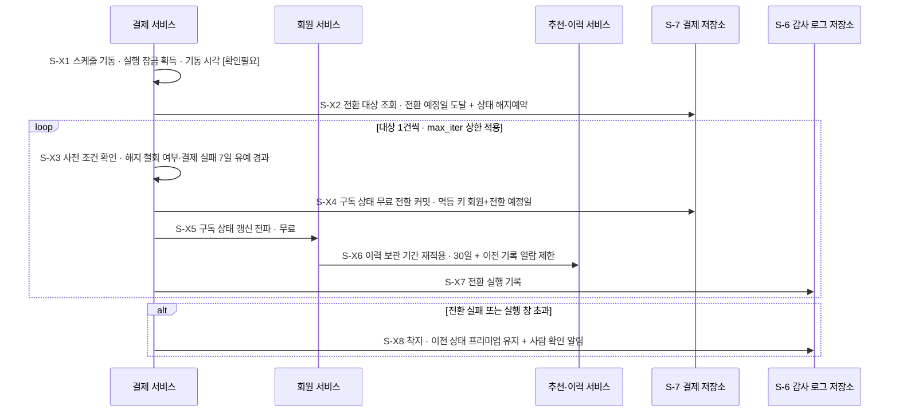
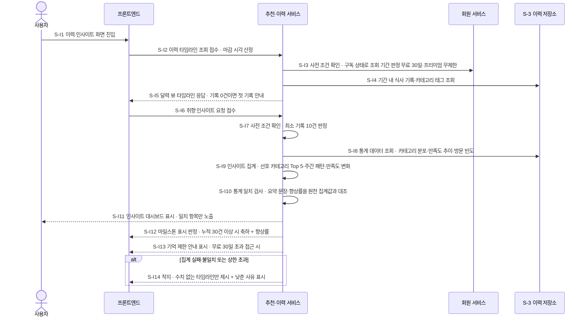

# 설계서 ③ 패턴/시퀀스 — 런치픽(LunchPick)

작성: 플로니(오케스트레이션 엔지니어) · 2026-08-08 · **미검증 설계**(구현·호출·측정을 하지 않음)

**타임아웃 값의 단일 출처는 본 산출물임.** 재시도 횟수·반복 상한·단계 간 키 집합 식별자도 같음.
뒤 산출물은 인용만 하고 값은 여기서 고침(소유 관계 `G-4`·`G-5`).

**갱신 이력**  
- 2026-08-08 ⑥ 가드레일/관측의 변경요청 6건을 판정해 반영함
- 2026-08-08 `V-02` 케이스 2번 추가로 구독·해지·인사이트 트리거를 더함
- 2026-08-08 클로니 조정 판정 `J-20` 반영 — PG 정기 결제 중지 호출 1단계 신설(`S-C10`) · 89개 → 90개

`[확인필요]` **22건** — 말미 미확정 항목 표 22행과 같음(`J-20`으로 새 태그가 늘지 않음 · 15절 세는 규칙).

단계 총 **90개**(동기 요청 54 · 스케줄 배치 18 · 이벤트 18). 도식 단계 수와 단계 표 행 수가 같음.

| 케이스 | 트리거 인스턴스 · 단계 접두 | 단계 수 |
|-------|--------------------------|--------|
| 케이스 1 — 오늘의 추천 3개 생성·제시 | 동기 `S-R` · 스케줄 `S-B` · 이벤트 `S-E` | 34 |
| 케이스 2 — 구독 전환·해지·인사이트 조회 | 동기 `S-S`·`S-C`·`S-I` · 스케줄 `S-X` · 이벤트 `S-N` | 56 |

---

## 1. 시작 전 판정

### 판정 1-1 — 트리거를 어떻게 갈랐나

`V-02`의 시작 계기 3종을 가이드 2-1 표의 트리거 유형에 붙임. **트리거마다 시퀀스를 따로 그림.**

| 문항 | 예/아니오 | 이유 | 부여한 트리거 · 접두 | 예산 기준 | 근거 출처 |
|------|----------|------|------------------|----------|----------|
| ⓐ 사람이 눌러 기다리는 계기가 있나 | 예 | 홈 화면 진입 · 새로고침 · 거절 후 대체 추천 3건이 모두 사용자 조작이며 응답을 기다림 | 동기 요청 · `S-R` | ① 목표/품질 카드 G-1·Q-1의 3,000ms(p95) | US:UFR-REC-010, US:UFR-REC-050 |
| ⓑ 정해진 주기에 자동 실행되는 계기가 있나 | 예 | 매일 03:00 일일 취향 학습 배치가 스케줄러 기동임 | 스케줄 배치 · `S-B` | 배치 실행 창 — `[확인필요: 배치 실행 창 종료 시각]` | US:UFR-REC-100(03:00), ES:05#스케줄러 |
| ⓒ 앞 단계 완료 신호로 시작되는 계기가 있나 | 예 | 피드백 저장 완료 후 학습 데이터 전달 · 온보딩 완료 후 초기 프로파일 생성 2건이 완료 신호 뒤에 붙음 | 이벤트 · `S-E` | 전달 지연 목표 — 모델 비호출 API 계층 200ms | ES:04#학습데이터전달, ES:01#초기프로파일 |
| ⓑ의 두 번째 스케줄(점심 30분 전 푸시)도 단계를 그릴 수 있나 | **아니오** | 발송 시각 문장만 있고 대상 산정·추천 생성 시점이 기획 원문의 도식 8건에 없음. 단계를 지어내지 않음 | 그리지 않음 | — | BM:채널#Delivery → `[확인필요: 점심 30분 전 푸시 스케줄의 대상 산정·추천 생성 시점]` |
| ⓒ의 두 건을 한 도식에 담아도 예산이 엉키지 않나 | 예 | 둘 다 모델을 부르지 않는 내부 전달이고 예산 기준이 같은 200ms 계층임. 구획을 나눠 한 도식에 둠 | 이벤트 1건으로 합침 | 200ms 계층 공유 | 설계판단(① 목표/품질 카드의 200ms 계층 판정 인용) |

**트리거 인스턴스 대응** — 동기 요청 3건은 같은 단계 집합을 씀. 거절 후 대체 추천은 반복 루프로 표기함.

### 판정 1-2 — 패턴 결정 트리를 위에서부터 돌림

후보는 아티클 A02의 5종임. **패턴만 올리고 프레임워크 이름은 올리지 않음.**

| 문항 | 예/아니오 | 이유 |
|------|----------|------|
| Q1 순서가 미리 정해지는가(조건이 결정론이면 예) | **예** | 컨텍스트 수집 → 하드 필터 → 모델 호출 → 스코어 검증 순서가 ES:02에 고정돼 있고, 분기 조건 3개가 전부 결정론임 — 동의 상태(예/아니오) · 필터 적용 결과(적용/불확실) · 확신 스코어 임계(이상/미달) |
| Q2 첫 갈림길만 정하면 뒤는 정해지는가 | 물음 안 함 | Q1에서 `예`로 멈춤 |
| Q3 하위 작업을 맡기고 결과만 받으면 되는가 | 물음 안 함 | Q1에서 `예`로 멈춤 |

| # | 패턴 후보 | 장점 | 단점 | 판정 | 근거 출처 |
|---|----------|------|------|------|----------|
| 1 | 고정 워크플로우 | 순서가 코드에 있어 최악값을 단계 합으로 계산 가능함. 모델 호출 수가 요청당 1건으로 고정돼 건당 10원 상한을 지킴 | 새 분기가 생기면 코드를 고쳐야 함 | **채택** | 설계판단(A02 후보 5종 · ES:02 순서 고정) |
| 2 | 라우터 | 질문 유형이 여러 개면 첫 분기만 모델이 고르면 됨 | 런치픽은 질문 유형이 `오늘의 추천` 1종이라 고를 갈림길이 없음 | 탈락 | 설계판단(`V-02` 케이스 1건) |
| 3 | 서브에이전트 | 하위 작업을 맡기고 결과만 받음 | 맡길 하위 작업이 없고 모델 호출 수가 3 ~ 4배로 늘어 건당 10원 상한을 넘김 | 탈락 | 설계판단(`V-05` 단가 상한) |
| 4 | 핸드오프 | 제어권을 넘겨 전문화가 됨 | 넘길 담당자가 1명뿐이라 넘길 상대가 없음 | 탈락 | 설계판단 |
| 5 | 스킬 | 작업별 지시를 필요할 때만 불러 씀 | 지시가 1종이라 불러 쓸 구분이 없음 | 탈락 | 설계판단 |

**결정 트리 결론과 비교 표 최종 선택이 같음** — 둘 다 고정 워크플로우임.

### 판정 1-3 — 케이스 2번의 트리거를 어떻게 갈랐나(2026-08-08 신설)

`V-02`에 **케이스 2번**(구독 전환·해지·인사이트 조회)이 추가돼 가이드 2-1 트리거 판정을 **다시 실행함.**
케이스 1의 `S-R`·`S-B`·`S-E`는 손대지 않고 **새 접두 5개**를 이어 붙임(기존 번호와 겹치지 않음).

| 문항 | 예/아니오 | 이유 | 부여한 트리거 · 접두 | 예산 기준 | 근거 출처 |
|------|----------|------|------------------|----------|----------|
| ⓐ 사람이 눌러 기다리는 계기가 있나 — 구독 전환 | 예 | 설정 > 구독 진입 또는 기억 제한 안내 탭 → 플랜 조회 → 결제 요청이 전부 사용자 조작이며 응답을 기다림 | 동기 요청 · `S-S` | 모델 비호출 API 계층 200ms(플랜 조회 구간) · 결제 구간은 외부 PG 왕복이라 **계층 적용 안 함** | US:UFR-PAY-010#시나리오, US:UFR-PAY-020#시나리오, ES:07#구독플랜선택 |
| ⓐ 사람이 눌러 기다리는 계기가 있나 — 구독 해지 | 예 | `설정 > 구독 > 해지` 화면 진입 후 해지 버튼 탭이 사용자 조작이며 응답을 기다림 | 동기 요청 · `S-C` | 모델 비호출 API 계층 200ms | US:UFR-PAY-030#시나리오 |
| ⓐ 사람이 눌러 기다리는 계기가 있나 — 인사이트 조회 | 예 | 이력 화면·인사이트 화면 진입과 리포트 요청이 사용자 조작임 | 동기 요청 · `S-I` | 이력 조회 p95 500ms 계층(US:NFR-SYS-010#체크리스트) | ES:06#식사이력조회, US:UFR-REC-110, US:UFR-REC-120 |
| ⓑ 정해진 주기에 자동 실행되는 계기가 있나 | 예 | 해지가 **즉시 실행이 아니라 결제 기간 종료 시점 전환**임 — 예약을 만료 시점에 집행할 주기 실행이 반드시 필요함 | 스케줄 배치 · `S-X` | 실행 창 — `[확인필요: 해지 예약 만료 전환 배치의 실행 시각·실행 창]` | US:UFR-PAY-030#검증(기간 종료 후 전환), 설계판단(예약의 집행 수단) |
| ⓒ 앞 단계 완료 신호로 시작되는 계기가 있나 | 예 | 두 건 — ① 무료 30일 초과 접근 감지 → 기억 제한 도달 알림 → 구독 안내 ② 결제 완료 → 구독 상태 갱신 → 이력 보관 기간 해제 | 이벤트 · `S-N` | 전달 지연 목표 — 모델 비호출 API 계층 200ms(구획 2) · 구획 1은 이력 집계를 포함해 500ms 계층 | ES:06#기억제한안내(34 ~ 37행), ES:07#기억제한도달알림(13행), ES:07#구독활성화(36 ~ 40행) |
| ⓒ의 두 건을 한 도식에 담아도 예산이 엉키지 않나 | 예 | 둘 다 모델을 부르지 않는 내부 전달이며 같은 이벤트 마감선(가시성 타임아웃)을 씀. 구획을 나눠 한 도식에 둠 | 이벤트 1건으로 합침 | 마감선 공유 | 설계판단(케이스 1의 `S-E` 합침 판정과 같은 잣대) |
| 구독 전환과 해지를 한 접두로 묶어도 되나 | **아니오** | 참여 주체와 단계 집합이 다름 — 전환은 `(E)결제 게이트웨이` 왕복이 **응답 경로 안**에 있고, 해지는 예약 쓰기가 응답 경로이며 PG 중지 왕복은 **응답 후 후처리**(`S-C10` · 2026-08-08 `J-20`)임. 최악값 계산이 섞임 | 접두 2개로 나눔(`S-S`·`S-C`) | 각각 따로 대조 | 설계판단(ES:07에 해지 흐름 자체가 없음 · US:UFR-PAY-030이 1차 출처) |
| 전환·해지를 **한 도식**에 담아도 되나 | 예 | 트리거 유형이 같은 동기 요청이고 화면 경로가 `설정 > 구독` 하나로 이어짐. 접두를 갈라 두면 단계 혼동이 없음 | 도식 1개 · 구획 2개 | 구획마다 대조 2줄을 따로 냄(9-4절) | 설계판단 |
| 기억 제한 도달을 주기 감지로 둘 수 있나 | **아니오(이번 판)** | ES:06 34 ~ 37행은 `무료 사용자 30일 접근 시`로 **조회 시점 감지**만 적었고, 만료 D-1 같은 주기 감지 시각은 원문에 없음 | 이벤트로만 둠 | — | ES:06#기억제한안내 → `[확인필요: 기억 제한 도달 감지의 촉발 수단(조회 시점 감지 vs 만료 D-1 주기 감지)]` |

**트리거 인스턴스 대응** — 케이스 2의 동기 요청 3종은 **단계 집합이 서로 다름**(케이스 1의 동기 3건이
같은 집합을 쓴 것과 다름). 그래서 접두를 3개로 나눠 각각 대조 2줄을 따로 냄.

**되돌릴 수 없는 단계가 있는 트리거 표시** — `S-S`(결제 등록)·`S-C`(해지 예약 · **PG 정기 결제 중지**)·
`S-X`(구독 강등) 3종임. 세 곳 모두 **사람 확인 지점 또는 사후 사람 확인 알림**을 단계로 박음(4-5 ~ 4-8절).

### 판정 1-4 — 케이스 2번의 패턴(결정 트리 재실행)

| 문항 | 예/아니오 | 이유 |
|------|----------|------|
| Q1 순서가 미리 정해지는가 | **예** | ES:07·ES:06의 순서가 고정이고 분기 조건이 전부 결정론임 — 구독 상태(무료/프리미엄) · 결제 결과(성공/실패) · 최소 기록 수(10건 이상/미달) · 누적 30건(달성/미달) |
| Q2 · Q3 | 물음 안 함 | Q1에서 `예`로 멈춤 |

**케이스 2도 고정 워크플로우임.** 케이스 1과 같은 패턴이므로 1-2절 비교 표를 다시 쓰지 않음.
**차이 1줄** — 케이스 2는 **모델 호출이 0건**임(ES:06·ES:07에 LLM 참여자가 없음). 따라서 `비용` 상한의
증분이 0원이고 건당 10원 전제를 소진하지 않음. 단 인사이트 요약 문장의 생성 수단이 모델로 확정되면
비용 계산을 다시 해야 함 → `[확인필요: 인사이트 주간 패턴 요약 문장의 생성 수단(집계 템플릿 vs 모델 호출)]`.

---

## 2. 참여 주체 — ② 논리아키텍처에서 그대로 옮김

담당자 이름을 지어내지 않음(④ 역할계약서 소유). 아래 **17종**만 도식에 등장함(저장소 6종을 한 행으로 묶음).
**2026-08-08 케이스 2번 추가로 3종을 더함** — 결제 서비스 · `S-7` 결제 저장소 · `(E)결제 게이트웨이`.
세 노드 모두 ② 논리아키텍처에 이미 있던 것이며 **새로 지어낸 주체는 0건**임.

| 참여 주체 | ② 논리아키텍처의 출처 | 성격 |
|----------|-------------------|------|
| 사용자 | 1절 전체 관계도(TB-1) | 액터 |
| 프론트엔드 | 2절 내부 구성도 | 실행 단위 |
| 회원 서비스 | 2절 내부 구성도 | 실행 단위 |
| 추천·이력 서비스 | 2절 내부 구성도 | 실행 단위 |
| 일일 취향 학습 배치 | 2절 내부 구성도 | 실행 단위 |
| 결제 서비스 | 2절 내부 구성도 | 실행 단위 · **케이스 2 추가** |
| S-1 회원 저장소 · S-3 이력 저장소 · S-4 취향 벡터 인덱스 · S-5 추천 캐시 · S-6 감사 로그 저장소 · **S-7 결제 저장소** | 2절 내부 저장소 목록 | 저장소 |
| (E)LLM API | 1절 TB-2 | 외부 서비스 · 실물 |
| (E)날씨 API · (E)지도 API | 1절 TB-3 | 외부 서비스 · 실물 |
| (E)식약처 영업상태 API | 1절 TB-3 | 외부 서비스 · **Mock** |
| **(E)결제 게이트웨이** | 1절 TB-5 | 외부 서비스 · **케이스 2 추가** |

**Mock 판정과 시퀀스의 관계 1줄** — Mock은 구현 대체이지 단계 삭제가 아니므로 `S-R8`을 단계로 두고 상한만 배정함.

**케이스 2에서 필요했으나 ② 논리아키텍처에 없는 주체 1건** — `결제 실패 3회 소진 후 고객 지원 연결`의
상대(고객 지원 채널)가 ②의 노드 17종·외부 서비스 6종에 **없음.** 지어내지 않고 `S-S13` 단계에서
`프론트엔드가 안내 문구만 표시`하는 데까지만 그림 →
`[확인필요: 결제 실패 3회 소진 후 고객 지원 연결 채널]`(② 논리아키텍처에 노드 신설이 필요한지 상위 조정 대상).

---

## 3. 시퀀스 도식 — 트리거 인스턴스 8종(케이스 1 3종 + 케이스 2 5종)

도식 블록 수와 트리거 인스턴스 수가 **7:8**임 — `S-S`와 `S-C`를 한 도식의 구획 2개로 묶었기 때문이며
그 근거는 3-4절 머리에 적음. 트리거 **유형**은 3종(동기 요청·스케줄 배치·이벤트) 그대로임.

### 3-1. 동기 요청 `S-R` — 오늘의 추천 조회



### 3-2. 스케줄 배치 `S-B` — 매일 03:00 일일 취향 학습



### 3-3. 이벤트 `S-E` — 앞 단계 완료 신호



### 3-4. 동기 요청 `S-S`·`S-C` — 구독 전환·구독 해지(케이스 2)

**한 도식에 둔 근거** — 트리거 유형이 같은 동기 요청이고 화면 경로가 `설정 > 구독` 하나임.
단계 접두는 갈라 두어(`S-S`·`S-C`) 최악값 계산이 섞이지 않게 함(판정 1-3).
`■ 사람 확인` 표시가 **되돌릴 수 없는 작업 직전의 승인 지점**임.



### 3-5. 이벤트 `S-N` — 기억 제한 도달 알림 · 구독 활성화 전파(케이스 2)



### 3-6. 스케줄 배치 `S-X` — 해지 예약 만료 시점 무료 전환(케이스 2)

**이 트리거를 왜 뒀나 1줄** — 원문의 해지가 `즉시 해지 아닌 기간 종료 후 전환`이라
**예약 상태(`S-C7`)와 집행 시점(`S-X`)이 시간축에서 갈라짐.** 예약만 두고 집행 트리거를 안 그리면
전환이 영원히 일어나지 않으므로 스케줄 배치를 새로 부여함(US:UFR-PAY-030#검증 · 설계판단).



### 3-7. 동기 요청 `S-I` — 취향 인사이트 조회(케이스 2)



---

## 4. 시퀀스 단계 표 — 90행(케이스 1의 34행 + 케이스 2의 56행)

### 4-1. 동기 요청 `S-R` — 16행

`응답 마감선`(하드 상한) — `[확인필요: 동기 요청 응답 마감선 — API 게이트웨이·로드밸런서·클라이언트 타임아웃 설정값]`.
셋 중 가장 짧은 값이 마감선이나 세 값 모두 기획 원문·`V-07`에 없음. **지어내지 않고 되물음.**

| 단계 | 참여 주체 | 행동 1개 | p95 배정 | 타임아웃(상한) | 재시도 | 최악값 | 초과 시 처리 | 근거 출처 |
|------|----------|---------|---------|--------------|-------|-------|------------|----------|
| `S-R1` | 사용자 → 프론트엔드 | 추천 요청 발생 | TB-1 단말 구간 · API 예산 밖 | 클라이언트 타임아웃 `[확인필요]` | 0회 | 예산 밖 | 안전 종료(재시도 안내) | US:UFR-REC-010#입력요구사항 |
| `S-R2` | 프론트엔드 → 추천·이력 서비스 | 추천 요청 접수 · 마감 시각 산정 | 20ms | 50ms | 0회 | 50ms | 안전 종료 | 설계판단(진입 노드) |
| `S-R3` | 추천·이력 서비스 → 회원 서비스 · S-1 | 동의·사전 조건 확인 | 60ms | 200ms | 1회 | 400ms | **안전 종료** — 위치 미확인 안내 + 수동 입력 경로 | US:UFR-MBR-030, US:UFR-REC-010#실패시, ES:01#위치동의 |
| `S-R4` | 추천·이력 서비스 → S-3 | 최근 7일 식사 이력 조회(병렬) | 300ms | 500ms | 1회 | 1,000ms | 부분 결과로 계속 — 이력 없이 계산 | US:NFR-SYS-010#이력조회500ms, ES:02#식사이력조회 |
| `S-R5` | 추천·이력 서비스 → S-4 | 취향 프로파일·취향 벡터 조회(병렬) | 150ms | 300ms | 1회 | 600ms | 부분 결과로 계속 — 콜드스타트 경로 | ES:02#취향프로파일, ES:01#초기프로파일 |
| `S-R6` | 추천·이력 서비스 → (E)날씨 API | 현재 날씨 조회(병렬) | 400ms | 800ms | 1회 | 1,600ms | 부분 결과로 계속 — 날씨 가중치 제외 | ES:02#날씨API |
| `S-R7` | 추천·이력 서비스 → (E)지도 API | 주변 식당 조회(병렬) | 500ms | 1,000ms | 1회 | 2,000ms | **안전 종료** — 후보 0건이면 추천을 만들지 않음 | ES:02#주변식당조회, US:UFR-REC-010#검증 |
| `S-R8` | 추천·이력 서비스 → (E)식약처 API(Mock) | 영업 상태 필터 조회 | 300ms | 600ms | 0회 | 600ms | 부분 결과로 계속 — 필터 미적용 사유를 상태에 기록 | ES:규제반영표#식품위생법, `V-04` 20번 |
| `S-R9` | 추천·이력 서비스 | 알레르기·식이제한 하드 필터 적용 | 40ms | 100ms | 0회 | 100ms | **안전 종료** — 불확실 시 해당 식당 전체 제외 후 후보 0건이면 중단 | US:UFR-MBR-040#검증, ES:02#하드필터, `V-10` 5번 |
| `S-R10` | 추천·이력 서비스 | 컨텍스트 파라미터 집합 구성 | 30ms | 100ms | 0회 | 100ms | 안전 종료 | ES:02#컨텍스트DTO |
| `S-R11` | 추천·이력 서비스 → (E)LLM API | 개인화 추천 생성 호출 | 1,400ms | **1,800ms** | **조건부 1회** — `deadline_at`까지 남은 시간 ≥ 1,800ms일 때만 발화 | **1,900ms** | **부분 결과로 계속** — 캐시 폴백(`S-R16`) | ES:02#LLM추천생성, US:NFR-SYS-020#LLM폴백, 설계판단(⑥ 변경요청 1번 판정 2026-08-08) |
| `S-R12` | 추천·이력 서비스 | 확신 스코어 검증 · 안전망 대체 판정 | 40ms | 100ms | 0회 | 100ms | 부분 결과로 계속 — 안전망 추천 + 학습 중 안내 | ES:02#확신스코어검증, US:UFR-REC-030, `V-10` 6번 |
| `S-R13` | 추천·이력 서비스 → 프론트엔드 | 추천 카드 3장 응답 송출 | 50ms | 100ms | 0회 | 100ms | 안전 종료 | US:UFR-REC-010#추천카드 |
| `S-R14` | 프론트엔드 → 사용자 | 추천 카드 화면 표시 | TB-1 단말 구간 · API 예산 밖 | `[확인필요: 화면 표시 3,000ms 안의 네트워크·렌더 배정]` | 0회 | 예산 밖 | 안전 종료 | US:UFR-REC-010#검증(3초), US:NFR-SYS-010#3G로드 |
| `S-R15` | 추천·이력 서비스 → S-5 | 직전 추천 결과 캐시 적재(응답 후) | 예산 밖(비동기) | 300ms | 1회 | 600ms | 부분 결과로 계속 — 적재 실패를 상태에 기록 | US:NFR-SYS-020#캐시폴백 → `[확인필요: 추천 캐시(S-5) 적재 시점·보존 기간]` |
| `S-R16` | S-5 → 추천·이력 서비스 → 프론트엔드 | 착지 — 캐시 폴백 추천 제시 | 150ms | 300ms | 0회 | 300ms | 안전 종료(캐시도 없으면 안내) | US:UFR-REC-010#실패시(캐시된 이전 추천) |

**LLM 상한 1,800ms의 산출식** — 지어낸 값이 아니라 총 예산에서 역산한 값임.

```
LLM 밖 p95 합계 = 2,440ms − 1,400ms = 1,040ms
LLM 상한        = 총 예산 3,000ms − 1,040ms − 착지 경로 150ms = 1,810ms → 1,800ms로 내림
```

이 값이 `V-05` 지연 모순 ⓓ(`LLM 폴백 전환 타임아웃 초 없음`)를 메움. ① 목표/품질 카드의
`[확인필요: LLM 폴백 전환 타임아웃 초]`에 **1,800ms**로 회신함(타임아웃 소유는 ③임 · `G-4`).

**`S-R11` 재시도를 조건부 1회로 고친 이유** — ⑥ 가드레일/관측이 되돌린 값 모순 1건의 판정임
(12절 4번). `조건부 재시도` = 마감선까지 남은 시간이 타임아웃만큼 있을 때만 한 번 더 부르는 방식임.

```
S-R11 진입 시점 = 접수 + 950ms  (S-R2 20 + S-R3 60 + 병렬 500 + S-R8 300 + S-R9 40 + S-R10 30)
진입 시 남은 시간 = 진입선 2,850ms − 950ms = 1,900ms
무조건 1회 재시도 = 1,800ms × 2 = 3,600ms  >  1,900ms  →  구조적으로 못 들어감
조건부 1회 재시도 = (첫 시도 실패까지 소요 t) + 1,800ms ≤ 1,900ms  →  t ≤ 100ms일 때만 발화
S-R11 최악값     = 100ms + 1,800ms = 1,900ms  (진입 시 남은 시간과 같음)
```

발화 조건은 **첫 시도가 100ms 안에 실패한 경우**이며 즉시 반환되는 429·503·연결 거부가 그 자리임.
이 유형이 LLM API 일시 장애의 다수라 재시도를 살릴 값이 있음. 버린 대안 2개를 남김.

| 대안 | 왜 버렸나 |
|------|----------|
| 재시도를 0회로 내림 | `S-R11`이 유일한 모델 호출 단계라 즉시 반환 실패 1건에도 곧바로 착지로 감. ⑥의 차단 임계 `요청 1건당 2콜`(`B-11`)도 근거를 잃음 |
| 타임아웃을 950ms로 내려 2회를 끼움 | 1,400ms p95 배정을 밑돌아 정상 경로가 상시 타임아웃됨. 정상 경로 타임아웃을 깎지 않는다는 규칙에 걸림 |

**⑥이 인용한 값이 그대로 유효한 부분** — 상한 1,800ms는 안 바뀌었고 재시도 상한도 1회 그대로임.
따라서 ⑥ 7-2절 최악 배수 4배·월 1,200만 원과 7-3절 차단 임계 2콜/요청은 **고치지 않아도 됨**.
`S-R11` 최악값만 3,600ms → **1,900ms**로 바뀌므로 ⑥ 6절 34행의 최악값 인용 칸이 있으면 그 값만 맞춤.

### 4-2. 스케줄 배치 `S-B` — 10행

`응답 마감선`(하드 상한) — 실행 창임. `[확인필요: 배치 실행 창 종료 시각]`.
원문은 `매일 03:00 실행` · `다음 날 추천에 반영`까지이며 종료 시각이 없음.

| 단계 | 참여 주체 | 행동 1개 | p95 배정 | 타임아웃(상한) | 재시도 | 최악값 | 초과 시 처리 | 근거 출처 |
|------|----------|---------|---------|--------------|-------|-------|------------|----------|
| `S-B1` | 일일 취향 학습 배치 → 추천·이력 서비스 | 스케줄 기동(03:00) · 실행 잠금 획득 | 200ms | 1,000ms | 0회 | 1,000ms | 안전 종료 — 잠금 실패는 중복 실행이므로 즉시 종료 | US:UFR-REC-100(03:00), ES:05#스케줄러 |
| `S-B2` | 추천·이력 서비스 → S-3 | 전일 피드백 데이터 조회 | 1,000ms | 3,000ms | 1회 | 6,000ms | 사람 확인 — 대상 조회 실패 알림 | ES:05#전일피드백조회 |
| `S-B3` | 추천·이력 서비스 | 사전 조건 확인 — 동의 상태·보존 기간 만료 대상 제외 | 500ms | 2,000ms | 0회 | 2,000ms | **사람 확인** — 동의 판정 불가 대상은 갱신에서 제외하고 목록을 알림 | `V-10` 24번, US:NFR-SYS-040#보유기간, ES:01#동의절차 |
| `S-B4` | 추천·이력 서비스 | 장기 취향 벡터 재계산(루프 내) | 100ms | 300ms | 0회 | 300ms | 사람 확인 — 해당 사용자 건너뛰고 기록 | ES:05#장기취향벡터 |
| `S-B5` | 추천·이력 서비스 → (E)LLM API | 취향 임베딩 갱신 호출(루프 내) | 1,500ms | 3,000ms | 1회 | 6,000ms | 사람 확인 — 이전 벡터 유지 후 미갱신 목록 알림 | ES:05#취향임베딩갱신, US:UFR-REC-100#실패시 |
| `S-B6` | 추천·이력 서비스 | 추천 품질 자가 검증 · 임계 판정(루프 내) | 50ms | 200ms | 0회 | 200ms | **사람 확인** — 임계 미달 시 알림 발생 | ES:05#자가검증, US:UFR-REC-100#검증, `V-10` 7번 |
| `S-B7` | 추천·이력 서비스 → S-4 | 임계 통과 시에만 취향 벡터 커밋(루프 내) | 100ms | 300ms | 1회 | 600ms | **사람 확인** — 미통과는 자동 반영 금지, 이전 벡터 유지 | `V-10` 7번, US:UFR-REC-100#실패시 |
| `S-B8` | 추천·이력 서비스 | 학습 반영 메시지 생성 | 300ms | 1,000ms | 0회 | 1,000ms | 부분 결과로 계속 — 메시지 없이 갱신만 반영 | ES:05#학습반영메시지, `V-10` 10번 |
| `S-B9` | 추천·이력 서비스 → S-6 | 배치 실행 결과 기록 · 완료 이벤트 회신 | 200ms | 1,000ms | 1회 | 2,000ms | 사람 확인 — 기록 실패 알림 | ES:05#학습완료, `V-10` 27번 |
| `S-B10` | 추천·이력 서비스 → S-6 | 착지 — 이전 벡터 유지 + 사람 확인 알림 | 3,000ms | 5,000ms | 0회 | 5,000ms | 안전 종료 | US:UFR-REC-100#실패시, ES:05#임계미달알림 |

### 4-3. 이벤트 `S-E` — 8행

`응답 마감선`(하드 상한) — 메시지 가시성 타임아웃·리스 기간임.
`[확인필요: 이벤트 전달 마감선 — 메시지 가시성 타임아웃·리스 기간]`. 메시지 전달 수단이 `V-07`에 미지정임.

| 단계 | 참여 주체 | 행동 1개 | p95 배정 | 타임아웃(상한) | 재시도 | 최악값 | 초과 시 처리 | 근거 출처 |
|------|----------|---------|---------|--------------|-------|-------|------------|----------|
| `S-E1` | S-3 → 추천·이력 서비스 | 피드백 저장 완료 신호 수신 | 20ms | 50ms | 0회 | 50ms | 사람 확인 | ES:04#피드백저장완료 |
| `S-E2` | 추천·이력 서비스 | 사전 조건 확인 — 30초 실행취소 창 경과 확인 | 30ms | 100ms | 0회 | 100ms | **사람 확인** — 취소 창 안이면 전달 보류 후 재평가 | US:UFR-REC-080#실행취소, ES:04#30초수정, `V-10` 8번 |
| `S-E3` | 추천·이력 서비스 | 학습 데이터·컨텍스트 스냅샷 전달 | 80ms | 200ms | 1회 | 400ms | 사람 확인 — 미전달 큐 적재 | ES:04#학습데이터전달, `V-10` 28번 |
| `S-E4` | 추천·이력 서비스 → S-6 | 수신 확인 회신 · 감사 로그 적재 | 40ms | 100ms | 1회 | 200ms | 사람 확인 | ES:04#수신확인, `V-10` 29번 |
| `S-E5` | 회원 서비스 | 최소 7장 스와이프 완료 확인 | 30ms | 100ms | 0회 | 100ms | **안전 종료** — 미달 시 온보딩 계속 안내 | ES:01#최소7장, US:UFR-MBR-020 |
| `S-E6` | 회원 서비스 → S-4 | 초기 취향 프로파일 생성 · 취향 벡터 적재 | 120ms | 300ms | 1회 | 600ms | 사람 확인 — 적재 실패 알림 | ES:01#초기프로파일 |
| `S-E7` | 회원 서비스 | 온보딩 완료 응답 · 취향 요약 카드 전달 | 40ms | 100ms | 1회 | 200ms | 사람 확인 | ES:01#온보딩완료 |
| `S-E8` | 추천·이력 서비스 → S-6 | 착지 — 미전달 큐 적재 + 사람 확인 알림 | 100ms | 200ms | 0회 | 200ms | 안전 종료 | 설계판단 → `[확인필요: 미전달 건의 대기열(DLQ) 유무·보관 위치]` |

### 4-4. 사전 조건 확인·승인 단계와 `V-10` 대응(2026-08-08 케이스 2 반영으로 확장)

| `V-10` # | 점검 항목 | 대응 단계 | 실패 분기 |
|---------|----------|----------|----------|
| 5 | 알레르기 하드필터 불확실 시 추천 확정 금지 | `S-R9` | 해당 식당 전체 제외 → 후보 0건이면 안전 종료 |
| 6 | 확신 스코어 임계 미달 추천 노출 금지 | `S-R12` | 안전망 추천으로 강제 대체(부분 결과로 계속) |
| 7 | 배치 벡터 갱신 품질 미달 시 자동 반영 금지 | `S-B6` · `S-B7` | 커밋 생략 · 이전 벡터 유지 → 사람 확인 |
| 8 | 식사 기록 30초 실행취소 창 보장 | `S-E2` | 취소 창 안이면 전달 보류 후 재평가 |
| 24 | 동의 없는 도구 호출 기본 거부 | `S-R3` · `S-B3` | 위치 설정 안내 · 대상 제외 후 알림 |
| 1 | 정기 결제 등록·최초 결제는 명시 승인 없이 실행 금지 | **`S-S7`**(2026-08-08 신설) | 승인 없으면 `S-S9` PG 호출에 진입하지 않음 → 안전 종료 |
| 2 | 구독 해지 실행은 확인 모달 통과 후에만 | **`S-C5`**(2026-08-08 신설) | 확인 플래그가 없으면 `S-C7` 예약 등록에 진입하지 않음 → 안전 종료 |
| 11 | 인사이트 요약 문장·수치의 통계 일치 검사 | **`S-I10`**(2026-08-08 신설) | 불일치 항목은 비노출 · 수치 없는 타임라인만 제시(`S-I14`) |
| 31 | 청약철회권 7일·자동 갱신 고지·해지 방법 안내 | **`S-S6`**(2026-08-08 신설) | 고지 구성 실패 시 `S-S7` 승인 화면을 띄우지 않음 → 안전 종료 |
| 3 · 4 | 푸시 발송 · 카카오톡·알림톡 발송 | **이번 판 시퀀스 대상 아님** | 케이스 2에도 발송 흐름이 없음(구독 안내는 화면 표시임). ⑥이 `C-10` 커넥터 호출 지점으로 덮음 |
| 26 | 개인정보 전송요구권 대응·내보내기 이력 | **이번 판 시퀀스 대상 아님** | 케이스 1·2 어디에도 내보내기 계기가 없음. 유일한 대응 불가 항목으로 남음(12절) |

**2026-08-08 판정 뒤집기 1줄** — 위 4행(`1`·`2`·`11`·`31`)은 직전 판까지 `이번 판 시퀀스 대상 아님`이었음.
`V-02`에 케이스 2번이 추가돼 **케이스 정의가 넓어졌으므로 판정을 뒤집고 이번에 반영함**(12절 5·7번).

### 4-5. 동기 요청 `S-S` — 구독 전환 · 13행(케이스 2)

`응답 마감선`(하드 상한) — **구간마다 따로 적용됨.** 승인 게이트(`S-S7`)가 요청을 2개로 쪼개므로
`S-S2 ~ S-S4`(플랜 조회 요청)와 `S-S5 ~ S-S12`(결제 요청)가 **각각 별개의 마감선을 씀.**
값은 케이스 1과 같은 태그를 재사용함 — `[확인필요: 동기 요청 응답 마감선 — API 게이트웨이·로드밸런서·클라이언트 타임아웃 설정값]`.
**결제 구간은 200ms 계층에 넣지 않음** — 외부 PG 왕복이 있고 원문에 결제 API 응답 목표가 없음.

| 단계 | 참여 주체 | 행동 1개 | p95 배정 | 타임아웃(상한) | 재시도 | 최악값 | 초과 시 처리 | 근거 출처 |
|------|----------|---------|---------|--------------|-------|-------|------------|----------|
| `S-S1` | 사용자 → 프론트엔드 | 구독 전환 진입 | TB-1 단말 구간 · API 예산 밖 | 클라이언트 타임아웃 `[확인필요]` | 0회 | 예산 밖 | 안전 종료 | US:UFR-PAY-010#시나리오 |
| `S-S2` | 프론트엔드 → 회원 서비스 | 플랜 조회 접수 · 마감 시각 산정 | 20ms | 50ms | 0회 | 50ms | 안전 종료 | 설계판단(진입 노드) |
| `S-S3` | 회원 서비스 → S-1 | 사전 조건 확인 — 구독 상태·중복 구독 여부 | 60ms | 120ms | 1회 | 240ms | **안전 종료** — 이미 프리미엄이면 결제 진입 차단 | ES:07#구독상태갱신, US:UFR-PAY-010#검증 |
| `S-S4` | 회원 서비스 → 프론트엔드 | 플랜 비교표·가격 표시 | 40ms | 80ms | 0회 | 80ms | **부분 결과로 계속** — 캐시된 가격 표시 + 낮춘 사유 | US:UFR-PAY-010#실패시 → `[확인필요: 구독 플랜 가격 캐시의 보관 위치]` |
| `S-S5` | 프론트엔드 → 결제 서비스 | 구독 결제 요청 접수 — 플랜 유형·결제 주기 | 20ms | 50ms | 0회 | 50ms | 안전 종료 | US:UFR-PAY-020#입력요구사항, ES:07(23행) |
| `S-S6` | 결제 서비스 | 사전 고지 구성 — 청약철회 7일·자동 갱신·해지 방법 | 20ms | 50ms | 0회 | 50ms | **안전 종료** — 고지 없이 승인 화면을 띄우지 않음 | `V-10` 31번, ES:07(30행), US:UFR-PAY-020#검증 |
| `S-S7` | 결제 서비스 → 사용자 | **사람 확인** — 금액·주기·고지 재표시 후 명시 승인 수신 | 사람 대기 · API 예산 밖 | `[확인필요: 결제·해지 사람 승인 대기의 유효 시간(승인 세션 만료)]` | 0회 | 예산 밖 | **안전 종료** — 미승인·만료면 결제하지 않고 종료 | `V-10` 1번, US:UFR-PAY-020#검증 |
| `S-S8` | 결제 서비스 | 결제 정보 검증 · 멱등 키 부여 | 30ms | 100ms | 0회 | 100ms | 안전 종료 | ES:07(25행), `V-07` 4행(멱등성 키) |
| `S-S9` | 결제 서비스 → (E)결제 게이트웨이 | 정기 결제 등록 | `[확인필요]` | `[확인필요: PG 정기 결제 등록 호출의 응답 타임아웃·PG SLA와 해지 시 정기 결제 중지 호출 유무]` | **자동 0회** — 멱등 키 확인 전 재호출은 이중 결제 위험 | 상한 1배 | **사람 확인** — 결과 미확정은 `확인 중`으로 두고 응답을 닫음 | ES:07(27 ~ 28행), 설계판단(재시도 0회) |
| `S-S10` | 결제 서비스 → S-7 | 결제 ID·다음 결제일 적재 | 40ms | 100ms | 1회(멱등 키 필수) | 200ms | **사람 확인** — PG는 성공·기록은 실패면 대조 대상임 | ES:07(28행), ② 논리아키텍처 `S-7` |
| `S-S11` | 결제 서비스 → S-6 | 결제 승인·호출 감사 기록 | 40ms | 100ms | 1회 | 200ms | 사람 확인 — 기록 실패 알림 | `V-10` 29번, US:NFR-SYS-030#체크리스트 |
| `S-S12` | 결제 서비스 → 프론트엔드 → 사용자 | 결제 완료 표시 · 청약철회 안내 | 40ms | 100ms | 0회 | 100ms | 안전 종료 | ES:07(32행), US:UFR-PAY-020#처리결과 |
| `S-S13` | 결제 서비스 → 프론트엔드 | 착지 — 결제 실패 안내 · 3회 소진 시 고객 지원 안내 | 60ms | 150ms | 0회 | 150ms | 안전 종료(모델 호출 0건 · 비용 0원) | US:UFR-PAY-020#실패시, ES:07(45 ~ 47행) → `[확인필요: 결제 실패 3회 소진 후 고객 지원 연결 채널]` |

**승인 게이트와 외부 호출을 왜 다른 단계로 나눴나** — 오케스트레이션 프레임워크 문서 확인 결과
(확인일 2026-08-08) **승인 대기 지점이 있는 단계는 재개될 때 그 단계가 처음부터 다시 실행됨.**
승인과 결제 호출을 한 단계에 두면 재개 때 결제가 두 번 나감. 그래서 `S-S7`(승인만)과 `S-S9`(호출만)을
쪼개고 `S-S8`에서 멱등 키를 만들어 `S-S9`가 몇 번 재실행돼도 결제가 1건이 되게 함.
**버린 대안** — 승인과 호출을 한 단계로 묶기: 단계 수는 줄지만 재개 시 이중 결제 위험이 남아 버림.

### 4-6. 동기 요청 `S-C` — 구독 해지 · 11행(케이스 2 · 2026-08-08 `J-20`으로 1행 늘어남)

`응답 마감선`(하드 상한) — 4-5절과 같은 태그를 씀(같은 게이트웨이 설정값).
`S-C5` 사람 확인이 요청을 2개로 쪼개므로 마감선도 **확인 앞 구간·뒤 구간에 각각** 적용됨.
`S-C10`은 **응답을 닫은 뒤 도는 후처리**라 어느 마감선에도 들어가지 않음(`S-R15`와 같은 취급).

| 단계 | 참여 주체 | 행동 1개 | p95 배정 | 타임아웃(상한) | 재시도 | 최악값 | 초과 시 처리 | 근거 출처 |
|------|----------|---------|---------|--------------|-------|-------|------------|----------|
| `S-C1` | 사용자 → 프론트엔드 | 해지 화면 진입·해지 버튼 탭 | TB-1 단말 구간 · API 예산 밖 | 클라이언트 타임아웃 `[확인필요]` | 0회 | 예산 밖 | 안전 종료 | US:UFR-PAY-030#시나리오 |
| `S-C2` | 프론트엔드 → 결제 서비스 | 해지 요청 접수 · 마감 시각 산정 | 20ms | 50ms | 0회 | 50ms | 안전 종료 | 설계판단(진입 노드) |
| `S-C3` | 결제 서비스 → S-7 | 사전 조건 확인 — 구독 활성·남은 기간·복귀 제안 소진 여부 | 60ms | 120ms | 1회 | 240ms | **안전 종료** — 구독 상태를 못 읽으면 해지를 예약하지 않음 | US:UFR-PAY-030#검증, ② 논리아키텍처 `S-7` |
| `S-C4` | 결제 서비스 → 프론트엔드 | 복귀 유도 제안 표시 — 7일 무료 연장 1회 한정 | 30ms | 80ms | 0회 | 80ms | 부분 결과로 계속 — 제안 없이 해지 흐름 진행 | US:UFR-PAY-030#검증(복귀 유도) |
| `S-C5` | 결제 서비스 → 사용자 | **사람 확인** — 해지 확인 모달 통과(남은 기간·보관 안내 재표시) | 사람 대기 · API 예산 밖 | `[확인필요: 결제·해지 사람 승인 대기의 유효 시간(승인 세션 만료)]` | 0회 | 예산 밖 | **안전 종료** — 확인 없으면 해지하지 않음 | `V-10` 2번, US:UFR-PAY-030#검증(userstory.md:518,520 ~ 524) |
| `S-C6` | 프론트엔드 → 결제 서비스 | 해지 사유 수집 접수 — 선택형 4종 | 20ms | 50ms | 0회 | 50ms | 부분 결과로 계속 — 사유 없이 예약 진행(사유는 필수 아님) | US:UFR-PAY-030#검증(해지 사유 선택형) |
| `S-C7` | 결제 서비스 → S-7 | **해지 예약 등록** — 상태 `해지예약` + 전환 예정일 = 다음 결제일 | 50ms | 120ms | 1회(멱등 키 필수) | 240ms | **사람 확인** — 실패 시 접수 상태로 남기고 사람이 처리 | US:UFR-PAY-030#검증(즉시 해지 아님)·#실패시 |
| `S-C8` | 결제 서비스 → S-6 | 해지 예약 감사 기록 | 40ms | 100ms | 1회 | 200ms | 사람 확인 — 기록 실패 알림 | `V-10` 29번 |
| `S-C9` | 결제 서비스 → 프론트엔드 → 사용자 | 해지 예약 완료 표시 — 남은 기간·데이터 보관 안내 | 40ms | 100ms | 0회 | 100ms | 안전 종료 | US:UFR-PAY-030#처리결과 |
| **`S-C10`** | 결제 서비스 → **`(E)결제 게이트웨이`** | **PG 정기 결제 중지 호출** — 다음 결제일 자동 갱신(재청구) 차단 · 응답 후 후처리 | **예산 밖(비동기 · 응답 후)** | `[확인필요: PG 정기 결제 등록 호출의 응답 타임아웃·PG SLA와 해지 시 정기 결제 중지 호출 유무]`(4-5절 `S-S9`와 **같은 태그·같은 값**을 씀 — 등록·중지가 같은 PG의 같은 SLA임) | **1회**(중지 멱등 키 필수 · 백오프 = `1s`) — 중복 중지는 이미 중지된 구독에 무해해 `S-S9`와 달리 재시도를 허용함 | 상한 2배 | **사람 확인** — **해지 예약(`S-C7`)을 롤백하지 않음.** 실패를 `S-6` 감사 로그에 남기고 **재시도 대상 큐에 적재** → 다음 결제일 전에 사람이 확인함. `pg_cancel_status = 실패` | 클로니 조정 판정 `J-20`(2026-08-08) · 설계판단(자동 재청구 차단) → 큐 수단은 `[확인필요: 미전달 건의 대기열(DLQ) 유무·보관 위치]`와 같은 태그를 씀 |
| `S-C11` | 결제 서비스 → 프론트엔드 | 착지 — 해지 요청 접수 안내 + 고객 지원 연결 안내 | 60ms | 150ms | 0회 | 150ms | 안전 종료(모델 호출 0건 · 비용 0원) | US:UFR-PAY-030#실패시 → `[확인필요: 결제 실패 3회 소진 후 고객 지원 연결 채널]`(같은 채널 미상) |

**`S-C10`의 사전 조건 1줄** — **해지 예약이 방금 등록됨**(`S-C7` 커밋 성공 · `cancel_schedule` 기록됨).
예약이 없으면 부르지 않음 — 예약 없는 중지 호출은 결제 중인 구독을 끊는 반대 방향 사고가 됨.
보내는 값은 `K-36`이며 **PG 결제 ID는 `S-S10`이 `S-7`에 적재한 값**을 `S-C3`가 읽어 실어 보냄.

**PG 중지 호출을 왜 넣었나 — 채택 근거 1줄**(2026-08-08 `J-20`) — 해지는 원문상 **즉시가 아니라 결제
기간 종료 시점 전환**임(`US:UFR-PAY-030#시나리오`). 예약만 쓰고 PG의 자동 갱신을 멈추지 않으면
**다음 결제일에 자동 재청구가 나감** — 되돌리기 어려운 금전 사고라 예약과 짝을 이뤄야 함.

**버린 대안 2건**

- **`S-X4`(만료 배치) 앞에서 중지**: 직전 판의 예고였으나 버림. **전환 예정일 = 다음 결제일**이라
  배치가 도는 순간에는 이미 청구가 나간 뒤임 — 막으려던 사고를 그대로 통과시킴.
- **`S-C7`과 한 단계로 묶기**: 저장소 쓰기와 외부 호출이 한 단계에 들어가면 재개 시 둘 중 하나만
  성공한 상태를 가릴 수 없음. 프레임워크 문서 확인 결과 **중단 지점이 있는 단계는 재개 때 처음부터
  다시 실행됨**(확인일 2026-08-08 · 4-5절과 같은 근거)이라 갈라 둠.

**응답 뒤에 둔 이유 1줄** — 응답 앞(`S-C9` 앞)에 두면 PG 왕복이 확인 뒤 구간의 200ms 계층을 깨고,
PG만 실패했을 때 **예약은 성공했는데 사용자에게 착지 안내(`S-C11`)가 나가는** 잘못된 표시가 됨.
응답 후로 빼면 사용자는 정확한 예약 완료를 받고, PG 중지는 감사 로그 + 재시도 큐 + 사람 확인으로 보장됨.
**다음 결제일까지 시간이 남아 있어 후처리로 미뤄도 사고가 나지 않는다는 점**이 이 배치의 전제임.

### 4-7. 이벤트 `S-N` — 기억 제한 도달 · 구독 활성화 전파 · 10행(케이스 2)

`응답 마감선`(하드 상한) — 케이스 1과 같은 태그를 씀 —
`[확인필요: 이벤트 전달 마감선 — 메시지 가시성 타임아웃·리스 기간]`.

| 단계 | 참여 주체 | 행동 1개 | p95 배정 | 타임아웃(상한) | 재시도 | 최악값 | 초과 시 처리 | 근거 출처 |
|------|----------|---------|---------|--------------|-------|-------|------------|----------|
| `S-N1` | S-3 → 추천·이력 서비스 | 무료 30일 초과 접근 감지 신호 수신 | 20ms | 50ms | 0회 | 50ms | 사람 확인 | ES:06(34 ~ 37행) → `[확인필요: 기억 제한 도달 감지의 촉발 수단(조회 시점 감지 vs 만료 D-1 주기 감지)]` |
| `S-N2` | 추천·이력 서비스 | 사전 조건 확인 — 구독 상태 무료 + 누적·만료 예정 기록 수 집계 | 100ms | 300ms | 1회 | 600ms | **안전 종료** — 프리미엄이면 안내를 보내지 않음 | ES:07(13행), US:UFR-REC-110#검증, US:NFR-SYS-010#이력조회500ms |
| `S-N3` | 추천·이력 서비스 → 회원 서비스 | 기억 제한 도달 알림 전달 | 40ms | 100ms | 1회 | 200ms | 사람 확인 — 미전달 큐 적재 | ES:07(13행) |
| `S-N4` | 회원 서비스 → 프론트엔드 | 구독 안내 표시 — 누적 기록 수·정확도 향상률 | 40ms | 100ms | 0회 | 100ms | **부분 결과로 계속** — 향상률 없이 누적 수만 표시 | ES:07(15 ~ 16행), `V-10` 11번 → `[확인필요: 추천 정확도 향상률 산출식·원천]` |
| `S-N5` | 결제 서비스 → 회원 서비스 | 구독 상태 갱신 — 플랜 프리미엄(멱등 처리) | 40ms | 100ms | 1회(멱등 키 필수) | 200ms | **사람 확인** — 결제는 완료·상태는 미갱신 불일치 | ES:07(36행) |
| `S-N6` | 회원 서비스 → 추천·이력 서비스 | 이력 보관 기간 해제 — 무제한 | 40ms | 100ms | 1회(멱등 키 필수) | 200ms | **사람 확인** — 돈을 받고 기능을 못 준 상태라 자동 무시 금지 | ES:07(37행), `V-10` 25번 |
| `S-N7` | 추천·이력 서비스 → 회원 서비스 | 이력 보관 해제 완료 회신 | 30ms | 80ms | 1회 | 160ms | 사람 확인 | ES:07(38행) |
| `S-N8` | 회원 서비스 → S-6 | 구독 상태 변경 감사 기록 | 30ms | 80ms | 1회 | 160ms | 사람 확인 — 기록 실패 알림 | `V-10` 29번 |
| `S-N9` | 회원 서비스 → 프론트엔드 | 프리미엄 활성화 완료 표시 | 40ms | 100ms | 0회 | 100ms | 부분 결과로 계속 — 안내 없이 권한만 반영 | ES:07(40행) |
| `S-N10` | 회원 서비스 → S-6 | 착지 — 미전달 큐 적재 + 사람 확인 알림 | 80ms | 200ms | 0회 | 200ms | 안전 종료 | 설계판단 → `[확인필요: 미전달 건의 대기열(DLQ) 유무·보관 위치]`(케이스 1과 같은 태그) |

### 4-8. 스케줄 배치 `S-X` — 해지 예약 만료 전환 · 8행(케이스 2)

`응답 마감선`(하드 상한) — 실행 창임. `[확인필요: 해지 예약 만료 전환 배치의 실행 시각·실행 창]`.
원문은 `기간 종료 시점에 무료 플랜으로 전환`까지이며 **실행 시각·창이 없음.** 03:00 학습 배치와
같은 창인지도 원문에 없어 별 태그로 둠.

| 단계 | 참여 주체 | 행동 1개 | p95 배정 | 타임아웃(상한) | 재시도 | 최악값 | 초과 시 처리 | 근거 출처 |
|------|----------|---------|---------|--------------|-------|-------|------------|----------|
| `S-X1` | 결제 서비스 | 스케줄 기동 · 실행 잠금 획득 | 200ms | 1,000ms | 0회 | 1,000ms | 안전 종료 — 잠금 실패는 중복 실행이므로 즉시 종료 | 설계판단(예약 집행 수단) · US:UFR-PAY-030#검증 |
| `S-X2` | 결제 서비스 → S-7 | 전환 대상 조회 — 전환 예정일 도달 + 상태 `해지예약` | 500ms | 2,000ms | 1회 | 4,000ms | 사람 확인 — 대상 조회 실패 알림 | US:UFR-PAY-030#처리결과, ② 논리아키텍처 `S-7` |
| `S-X3` | 결제 서비스 | 사전 조건 확인 — 해지 철회 여부·결제 실패 7일 유예 경과(루프 내) | 50ms | 200ms | 0회 | 200ms | **사람 확인** — 판정 불가 대상은 강등하지 않고 목록을 알림 | US:UFR-PAY-020#실패시(7일 유예), `V-10` 25번 |
| `S-X4` | 결제 서비스 → S-7 | 구독 상태 무료 전환 커밋(루프 내) | 60ms | 200ms | 1회(멱등 키 필수) | 400ms | **사람 확인** — 커밋 실패는 프리미엄 유지 후 알림 | US:UFR-PAY-030#검증(기간 종료 후 전환) |
| `S-X5` | 결제 서비스 → 회원 서비스 | 구독 상태 갱신 전파 — 무료(루프 내) | 50ms | 150ms | 1회 | 300ms | 사람 확인 — 전파 실패 목록 알림 | ES:07(36행 역방향) · 설계판단 |
| `S-X6` | 회원 서비스 → 추천·이력 서비스 | 이력 보관 기간 재적용 — 30일 + 이전 기록 열람 제한(루프 내) | 60ms | 200ms | 1회 | 400ms | **사람 확인** — 열람 제한 실패는 과다 노출이므로 자동 무시 금지 | US:UFR-PAY-030#검증(30일 이전 열람 불가), `V-10` 25번 |
| `S-X7` | 결제 서비스 → S-6 | 전환 실행 기록(루프 내) | 40ms | 150ms | 1회 | 300ms | 사람 확인 — 기록 실패 알림 | `V-10` 29번 |
| `S-X8` | 결제 서비스 → S-6 | 착지 — 이전 상태(프리미엄) 유지 + 사람 확인 알림 | 300ms | 1,000ms | 0회 | 1,000ms | 안전 종료 | 설계판단(사용자에게 불리한 자동 강등을 하지 않음) |

**왜 강등 실패를 `안전 종료`가 아니라 `사람 확인`으로 뒀나 1줄** — 강등이 안 되면 회사가 손해를 보고
강등이 잘못되면 사용자가 손해를 봄. 둘 다 되돌리려면 사람이 봐야 하므로 `사람 확인`임(배치라 기다릴 수 있음).

### 4-9. 동기 요청 `S-I` — 취향 인사이트 조회 · 14행(케이스 2)

`응답 마감선`(하드 상한) — 4-5절과 같은 태그를 씀(같은 게이트웨이 설정값).
`예산 기준`은 **이력 조회 p95 500ms 계층**임(US:NFR-SYS-010#체크리스트) — 모델을 부르지 않고
이력 저장소를 읽는 경로라 3,000ms(LLM 경로) 예산을 쓰지 않음.
화면 1개가 **API 2건**(타임라인 · 인사이트 리포트)으로 나뉘므로 구획마다 따로 대조함(9-7절).

| 단계 | 참여 주체 | 행동 1개 | p95 배정 | 타임아웃(상한) | 재시도 | 최악값 | 초과 시 처리 | 근거 출처 |
|------|----------|---------|---------|--------------|-------|-------|------------|----------|
| `S-I1` | 사용자 → 프론트엔드 | 이력·인사이트 화면 진입 | TB-1 단말 구간 · API 예산 밖 | 클라이언트 타임아웃 `[확인필요]` | 0회 | 예산 밖 | 안전 종료 | US:UFR-REC-110#시나리오 |
| `S-I2` | 프론트엔드 → 추천·이력 서비스 | 이력 타임라인 조회 접수 · 마감 시각 산정 | 20ms | 50ms | 0회 | 50ms | 안전 종료 | 설계판단(진입 노드) |
| `S-I3` | 추천·이력 서비스 → 회원 서비스 | 사전 조건 확인 — 구독 상태로 조회 기간 판정 | 60ms | 120ms | 1회 | 240ms | **안전 종료** — 구독 상태를 못 읽으면 **좁은 쪽(무료 30일)** 으로 판정하지 않고 중단함 | ES:06(13행), US:UFR-REC-110#검증, `V-10` 25번 |
| `S-I4` | 추천·이력 서비스 → S-3 | 기간 내 식사 기록·카테고리 태그 조회 | 200ms | 500ms | 1회 | 1,000ms | 부분 결과로 계속 — 최근 구간만 표시 + 낮춘 사유 | ES:06(15행), US:NFR-SYS-010#이력조회500ms |
| `S-I5` | 추천·이력 서비스 → 프론트엔드 | 달력 뷰 타임라인 응답 | 40ms | 100ms | 0회 | 100ms | 안전 종료 — 기록 0건이면 첫 기록 안내 | US:UFR-REC-110#처리결과 |
| `S-I6` | 프론트엔드 → 추천·이력 서비스 | 취향 인사이트 요청 접수 | 20ms | 50ms | 0회 | 50ms | 안전 종료 | ES:06(19행) |
| `S-I7` | 추천·이력 서비스 | 사전 조건 확인 — 최소 기록 10건 판정 | 30ms | 80ms | 0회 | 80ms | **안전 종료** — 미달 시 인사이트를 만들지 않고 안내만 함 | US:UFR-REC-120#검증(10건), #실패시 |
| `S-I8` | 추천·이력 서비스 → S-3 | 통계 데이터 조회 — 카테고리 분포·만족도 추이·방문 빈도 | 200ms | 500ms | 1회 | 1,000ms | 부분 결과로 계속 — 조회된 지표만 집계 | ES:06(21 ~ 22행), `V-07` 2행(사전 정의 집계 쿼리) |
| `S-I9` | 추천·이력 서비스 | 인사이트 집계 — Top 5·주간 패턴·만족도 변화 | 60ms | 150ms | 0회 | 150ms | 부분 결과로 계속 | ES:06(24행), US:UFR-REC-120#처리결과 |
| `S-I10` | 추천·이력 서비스 | **통계 일치 검사** — 요약 문장·향상률을 원천 집계값과 대조 | 40ms | 100ms | 0회 | 100ms | **부분 결과로 계속** — 불일치 항목은 **비노출**(자동 노출 금지) | `V-10` 11번, ES:06(24·30행), US:UFR-REC-120#검증 |
| `S-I11` | 추천·이력 서비스 → 프론트엔드 → 사용자 | 인사이트 대시보드 표시 — 일치 항목만 | 40ms | 100ms | 0회 | 100ms | 안전 종료 | US:UFR-REC-120#처리결과 |
| `S-I12` | 추천·이력 서비스 → 프론트엔드 | 마일스톤 표시 판정 — 누적 30건 이상 시 축하 + 향상률 | 30ms | 80ms | 0회 | 80ms | 부분 결과로 계속 — 향상률 없이 축하 문구만 | ES:06(29 ~ 31행) → `[확인필요: 추천 정확도 향상률 산출식·원천]` |
| `S-I13` | 추천·이력 서비스 → 프론트엔드 | 기억 제한 안내 표시 — 무료 30일 초과 접근 시 | 30ms | 80ms | 0회 | 80ms | 부분 결과로 계속 — 안내 없이 타임라인만 표시 | ES:06(34 ~ 37행) · `S-N1`의 촉발 지점임 |
| `S-I14` | 추천·이력 서비스 → 프론트엔드 | 착지 — 수치 없는 타임라인만 제시 + 낮춘 사유 표시 | 60ms | 150ms | 0회 | 150ms | 안전 종료(재조회 0건 · 모델 호출 0건 · 비용 0원) | US:UFR-REC-120#실패시, `V-10` 11번 |

**`S-I10`을 왜 단독 단계로 뺐나** — ⑥ 가드레일/관측이 `V-10` 11번을 걸 자리가 필요하고,
집계(`S-I9`)와 검사(`S-I10`)를 한 단계에 두면 **집계가 스스로를 검사하는 모양**이 되어 실패를 못 잡음.
**버린 대안** — `S-I11` 응답 직전에 검사를 붙이기: 검사 실패 시 이미 조립된 화면을 되돌려야 해서 버림.

**`S-I13`이 케이스 2의 두 트리거를 잇는 자리 1줄** — 여기서 기억 제한을 안내하면
`S-N1`(무료 30일 초과 접근 감지)이 걸리고 그 흐름이 `S-S`(구독 전환)로 이어짐 — 세 트리거가 붙는 지점임.

---

## 5. 단계 간 데이터 형식 — 키 집합 식별자만

**키 이름은 ④ 역할계약서 소유임(`G-12`).** ③은 흐름의 단위(집합)까지만 정하고 이름을 붙이지 않음.

| # | 보내는 단계 → 받는 단계 | 키 집합 식별자 | 근거 출처 |
|---|----------------------|--------------|----------|
| K-1 | `S-R2` → `S-R3` | 요청 접수 집합(위치·시간·마감 시각) | US:UFR-REC-010#입력요구사항 |
| K-2 | `S-R3` → `S-R4` ~ `S-R7` | 사전조건 결과 집합(동의 상태·제외 식재료 코드) | US:UFR-MBR-030, US:UFR-MBR-040#입력요구사항 |
| K-3 | `S-R4` ~ `S-R7` → `S-R9` | 컨텍스트 수집 집합(이력·취향 벡터·날씨·후보 식당) | ES:02#컨텍스트DTO |
| K-4 | `S-R8` → `S-R9` | 영업 상태 판정 집합 | ES:규제반영표#식품위생법 |
| K-5 | `S-R9` → `S-R10` | 후보 확정 집합 | ES:02#하드필터 |
| K-6 | `S-R10` → `S-R11` | 모델 입력 집합 | ES:02#LLM추천생성 |
| K-7 | `S-R11` → `S-R12` | 모델 산출 집합(추천 3개·이유·확신 스코어) | ES:02#추천결과생성됨 |
| K-8 | `S-R12` → `S-R13` | 검증 결과 집합 | ES:02#확신스코어검증 |
| K-9 | `S-R13` → `S-R14` | 응답 카드 집합 | US:UFR-REC-010#추천카드 |
| K-10 | `S-R16` → `S-R13` | 폴백 카드 집합(낮춘 사유 포함) | US:UFR-REC-010#실패시 |
| K-11 | `S-B2` → `S-B4` | 전일 피드백 집합 | ES:05#전일피드백조회 |
| K-12 | `S-B5` → `S-B6` | 갱신 벡터 후보 집합 | ES:05#취향임베딩갱신 |
| K-13 | `S-B6` → `S-B7` | 품질 판정 집합 | ES:05#자가검증 |
| K-14 | `S-B9` → 스케줄러 | 배치 결과 집합(갱신 사용자 수·평균 변화량) | ES:05#학습완료 |
| K-15 | `S-E2` → `S-E3` | 학습 데이터 전달 집합(기록·만족도·키워드·스냅샷) | ES:04#학습데이터전달 |
| K-16 | `S-E6` → `S-E7` | 초기 프로파일 집합(취향 벡터·선호 카테고리) | ES:01#초기프로파일 |

**케이스 2 추가분 20건(2026-08-08 · `J-20`으로 `K-36` 1건 추가)** — 같은 규칙으로 키 이름을 붙이지 않고
집합 식별자만 둠.

| # | 보내는 단계 → 받는 단계 | 키 집합 식별자 | 근거 출처 |
|---|----------------------|--------------|----------|
| K-17 | `S-S3` → `S-S4` | 구독 상태 판정 집합(현재 플랜·중복 구독 여부) | ES:07#구독상태갱신 |
| K-18 | `S-S5` → `S-S6` | 결제 요청 집합(플랜 유형·결제 주기) | US:UFR-PAY-020#입력요구사항 |
| K-19 | `S-S6` → `S-S7` | 사전 고지 집합(청약철회 7일·자동 갱신·해지 방법) | `V-10` 31번, ES:07(30행) |
| K-20 | `S-S7` → `S-S8` | 승인 증거 집합(승인 시각·표시된 금액·표시된 주기) | `V-10` 1번 |
| K-21 | `S-S8` → `S-S9` | 결제 등록 요청 집합(결제 수단 토큰·금액·주기·멱등 키) | ES:07(27행), `V-07` 4행 |
| K-22 | `S-S9` → `S-S10` | 결제 등록 결과 집합(결제 ID·다음 결제일) | ES:07(28행) |
| K-23 | `S-S10` → `S-S12` | 결제 완료 안내 집합(구독 시작일·다음 결제일·청약철회 안내) | ES:07(32행) |
| K-24 | `S-C3` → `S-C5` | 해지 사전 조건 집합(남은 기간·전환 예정일·복귀 제안 소진 여부) | US:UFR-PAY-030#검증 |
| K-25 | `S-C5` → `S-C7` | 해지 확인 증거 집합(확인 플래그·표시된 보관 안내) | `V-10` 2번 |
| K-26 | `S-C6` → `S-C7` | 해지 사유 집합(선택형 라벨 1개) | US:UFR-PAY-030#검증 |
| K-27 | `S-C7` → `S-C9` | 해지 예약 결과 집합(예약 상태·전환 예정일) | US:UFR-PAY-030#처리결과 |
| K-28 | `S-N2` → `S-N3` | 기억 제한 도달 집합(누적 기록 수·만료 예정 기록 수) | ES:07(13행) |
| K-29 | `S-N5` → `S-N6` | 구독 상태 갱신 집합(플랜·적용 시각) | ES:07(36 ~ 37행) |
| K-30 | `S-X2` → `S-X3` | 전환 대상 집합(회원·전환 예정일) | US:UFR-PAY-030#검증 |
| K-31 | `S-X4` → `S-X6` | 보관 기간 재적용 집합(무료 30일 경계·열람 제한 기준일) | US:UFR-PAY-030#검증, `V-10` 25번 |
| K-32 | `S-I3` → `S-I4` | 조회 기간 판정 집합(구독 상태·허용 기간) | ES:06(13행), US:UFR-REC-110#검증 |
| K-33 | `S-I8` → `S-I9` | 통계 원천 집합(카테고리 분포·만족도 추이·방문 빈도) | ES:06(21 ~ 22행) |
| K-34 | `S-I9` → `S-I10` | 인사이트 후보 집합(Top 5·주간 패턴·향상률) | ES:06(24행), US:UFR-REC-120#검증 |
| K-35 | `S-I10` → `S-I11` | 노출 승인 집합(일치 검사 결과·비노출 항목 목록) | `V-10` 11번, ES:06(30행) |
| **K-36** | `S-C7` → `S-C10` | PG 중지 요청 집합(PG 결제 ID·해지 예약 ID·중지 멱등 키) — PG 결제 ID는 `S-S10`이 `S-7`에 적재한 값이며 `S-C3`가 읽어 실어 보냄 | 클로니 조정 판정 `J-20`, ES:07(28행 결제 ID) |

---

## 6. 상태 스키마 — 필드당 갱신 주체 1개

`3출처`는 아티클 A03의 구분임 — 요청마다 바뀌면 `Runtime Context`, 단계 간은 `State`, 세션을 넘기면 `Store`.
**그래프 내부 상태 필드 이름은 ③가 가짐.** 단계 간 전달 키 이름은 5절대로 ④ 소유임.

| # | 필드 이름: 타입 | 갱신 주체(1개) | 3출처 | 병렬 처리 | 근거 출처 |
|---|---------------|--------------|-------|----------|----------|
| 1 | `trigger_kind: enum` | 진입 노드 1개(`S-R2` / `S-B1` / `S-E1`·`S-E5` / **`S-S2`·`S-S5` / `S-C2` / `S-I2`·`S-I6` / `S-X1` / `S-N1`·`S-N5`**) | Runtime Context | 불변 | `V-02` 시작 계기(케이스 1 3종 + 케이스 2 3종) |
| 2 | `deadline_at: timestamp` | 진입 노드 1개(시퀀스별) | State | 불변 — 이후 읽기만 | 설계판단(가이드 권장 마감 시각 1개) |
| 3 | `precheck_result: dict` | 사전 조건 확인 노드 1개(`S-R3` / `S-B3` / `S-E2`·`S-E5` / **`S-S3` / `S-C3` / `S-I3`·`S-I7` / `S-X3` / `S-N2`**) | State | 단독 갱신 | `V-10` 24번 |
| 4 | `partial_context: list` | 컨텍스트 수집 누적 리듀서 1개 | State | **누적만**(병렬 `S-R4` ~ `S-R7`) | ES:02#컨텍스트DTO |
| 5 | `context_bundle: dict` | `S-R10` 1개 | State | 단독 갱신 | ES:02#컨텍스트DTO |
| 6 | `candidate_set: list` | `S-R9` 1개 | State | 단독 갱신 | ES:02#하드필터 |
| 7 | `recommendation_set: dict` | `S-R11` 1개 | State | 단독 갱신 | ES:02#LLM추천생성 |
| 8 | `verification_result: dict` | `S-R12` 1개 | State | 단독 갱신 | ES:02#확신스코어검증 |
| 9 | `fallback_reason: str` | 착지 노드 1개(`S-R16` / `S-B10` / `S-E8` / **`S-S13` / `S-C11` / `S-I14` / `S-X8` / `S-N10`**) | State | 단독 갱신 | US:UFR-REC-010#실패시 |
| 10 | `retry_count_by_step: dict` | 재시도 래퍼 1개 | State | 단계 키별 증가(키 충돌 없음). `S-R11` 키는 **조건부** — `deadline_at − now ≥ 1,800ms`일 때만 증가함 | 설계판단(12절 4번 판정) |
| 11 | `iteration_count: int` | 반복 진입 노드 1개(`S-R2` 재진입 / `S-B4` / **`S-X3`**) | State | 단독 증가 | US:UFR-REC-050, ES:05#루프, US:UFR-PAY-030 |
| 12 | `error_history: list` | 실패 기록 리듀서 1개 | State | **누적만** | 설계판단 |
| 13 | `resume_cursor: dict` | 커밋 노드 1개(`S-B7` / `S-E3` / **`S-X4` / `S-N6`**) | Store | 단독 갱신 | 설계판단(재개 경계 11절) |
| 14 | `preference_vector_ref: str` | 없음 — 읽기 전용 | Store | 갱신 주체 없음 | ES:05#취향임베딩갱신 |
| **15** | `subscription_state: enum` | 트리거별 1개(`S-N5` 전환 반영 / `S-X5` 만료 반영) | Store | 단독 갱신 | ES:07(36행), US:UFR-PAY-030#검증 |
| **16** | `approval_evidence: dict` | 승인 게이트 1개(`S-S7` / `S-C5`) | State | **한 번만 쓰고 불변** — 승인 후 덮어쓰기 금지(감사 증거) | `V-10` 1·2번 |
| **17** | `payment_idempotency_key: str` | `S-S8` 1개 | State | 불변 — 재시도·재개에도 같은 값 | `V-07` 4행(멱등성 키), 설계판단 |
| **18** | `payment_result: dict` | `S-S9` 1개 | State | 단독 갱신 · `확인 중` 값을 허용함 | ES:07(28·45행) |
| **19** | `cancel_schedule: dict` | `S-C7` 1개 | Store | 단독 갱신 — `S-X`가 읽기만 함 | US:UFR-PAY-030#처리결과 |
| **20** | `disclosure_record: dict` | `S-S6` 1개 | Store | 단독 갱신(고지 표시 항목·시각) | `V-10` 31번, ES:07(30행) |
| **21** | `insight_aggregate: dict` | `S-I9` 1개 | State | 단독 갱신 | ES:06(22·24행) |
| **22** | `consistency_check: dict` | `S-I10` 1개 | State | 단독 갱신 — 비노출 항목 목록을 담음 | `V-10` 11번 |
| **23** | `pg_cancel_status: enum` | **`S-C10` 1개** | Store | 단독 갱신 · `중지완료` / `확인 중` / `실패` 3값 — `실패`가 재시도 큐·사람 확인의 대상 표시임 | 클로니 조정 판정 `J-20`(2026-08-08) |

**마감 시각 1개를 쓸지 판정 1줄** — **씀.** 단계가 늘어도 마감선을 구조적으로 못 넘기므로 채택하며,
`deadline_at`의 갱신 주체는 진입 노드 1개로 못 박고 이후 불변임.

**진입선 값** — 동기 요청은 `요청 접수 시각 + 2,850ms`임(= 총 예산 3,000ms − 착지 경로 150ms).
각 단계는 시작 전에 `남은 시간 < 이 단계 타임아웃`인지 보고, 걸리면 즉시 착지로 감.
**착지 경로 150ms를 진입선에서 이미 뺐으므로 단계별 판정에 150ms를 또 더하지 않음**(이중 계상 방지).

**재시도 시도도 같은 진입선 규칙을 한 번 더 통과해야 함** — 이것이 4-1절 `S-R11`의 `조건부 1회`임.
재시도 값을 표에만 적어 두고 마감선 아래에서 못 돌게 두면 관측 지표가 항상 0이 되므로 조건을 못 박음.

**케이스 2의 `deadline_at`는 구간마다 새로 잡힘(2026-08-08 추가)** — 사람 확인 지점(`S-S7`·`S-C5`)이
요청을 2개로 쪼개므로 `deadline_at`도 **구간 진입 노드가 새로 넣음**(`S-S2`·`S-S5` / `S-C2`·`S-C6`).
사람이 화면을 보는 시간은 어떤 마감선에도 들어가지 않음 — 대신 승인 자체의 유효 시간을 따로 되물음
(`[확인필요: 결제·해지 사람 승인 대기의 유효 시간(승인 세션 만료)]`).
**버린 대안** — 승인 대기까지 한 마감선에 넣기: 사람이 5분을 보면 무조건 마감선 초과라 폐기함.

**`pg_cancel_status`를 `State`가 아니라 `Store`에 둔 이유 1줄**(2026-08-08 `J-20`) — `S-C10`은 응답을
닫은 뒤 돌고 실패하면 **다음 결제일까지 며칠을 살아 있어야** 재시도 큐와 사람 확인이 그 값을 읽음.
요청 안에서만 사는 `State`에 두면 응답이 닫히는 순간 사라져 재청구를 막을 근거가 없어짐.
**버린 대안** — `cancel_schedule`(19번) 안에 함께 넣기: 갱신 주체가 `S-C7`·`S-C10` 2개가 되어
`필드당 갱신 주체 1개` 규칙이 깨지므로 별 필드로 갈라 둠.

---

## 7. 출력 스키마 — 최종 결과 항목

**영문 키 이름은 ④ 역할계약서 소유임(`G-12`).** 여기서는 항목명·타입·필수 여부만 정함.

| 출력 항목 | 타입 | 필수 여부 | 근거가 되는 필드 | 근거 출처 |
|----------|------|----------|---------------|----------|
| 추천 카드 수 | 정수(3 고정) | 필수 | `recommendation_set` | US:UFR-REC-010#추천카드 |
| 메뉴명 | 문자열 | 필수 | `recommendation_set` | US:UFR-REC-010#추천카드 |
| 식당명 | 문자열 | 필수 | `candidate_set` | US:UFR-REC-010#추천카드 |
| 거리(m) | 숫자 | 필수 | `candidate_set` | ES:02#주변식당조회 |
| 예상 소요시간(분) | 숫자 | 필수 | `candidate_set` | US:UFR-REC-060 |
| 추천 이유 1줄 | 문자열 | 필수 | `context_bundle` + `recommendation_set` | US:UFR-REC-010#추천카드 |
| 확신 스코어(%) | 숫자 | 필수 | `verification_result` | US:UFR-REC-020#검증 |
| 반영된 컨텍스트 태그 3종(날씨·이력·취향) | 목록 | 필수 | `context_bundle` | US:UFR-REC-020#검증 |
| 추천 이유 상세 | 문자열 | 선택 — 상세 확인 시에만 | `context_bundle` | US:UFR-REC-020 |
| 낮춘 사유 표시 | 문자열 | 조건 필수 — 착지 경로일 때 | `fallback_reason` | US:UFR-REC-010#실패시, US:UFR-REC-030#투명성 |
| 대표 메뉴·가격 | 문자열 | `[확인필요: 대표 메뉴·가격 제공 원천]`(② 논리아키텍처 인용) | `candidate_set` | ② 논리아키텍처 4절 부분 Mock 판정 |

### 7-2. 케이스 2의 출력 항목(2026-08-08 추가)

`V-03`의 최종 산출물(추천 카드 3장)은 케이스 1의 것임. 케이스 2는 **화면 산출물 4종**을 냄.

| 출력 항목 | 타입 | 필수 여부 | 근거가 되는 필드 | 근거 출처 |
|----------|------|----------|---------------|----------|
| 플랜 비교표(무료 vs 프리미엄) | 목록 | 필수 | `precheck_result` | US:UFR-PAY-010#검증, ES:07(21행) |
| 가격 표시(월 4,900원 · 연 결제 월 3,900원) | 문자열 | 필수 | `precheck_result` | US:UFR-PAY-010#검증 |
| 사전 고지 3종(청약철회 7일·자동 갱신·해지 방법) | 목록 | **필수 — 승인 화면에 반드시 함께 나감** | `disclosure_record` | `V-10` 31번, ES:07(30행) |
| 구독 시작일 · 다음 결제일 | 날짜 | 조건 필수 — 결제 성공일 때 | `payment_result` | ES:07(32행) |
| 결제 실패 사유 안내 | 문자열 | 조건 필수 — 결제 실패일 때 | `fallback_reason` | US:UFR-PAY-020#실패시 |
| 해지 예약 결과(전환 예정일 · 남은 기간) | 날짜·숫자 | 조건 필수 — 해지 흐름일 때 | `cancel_schedule` | US:UFR-PAY-030#처리결과 |
| 데이터 보관 안내(무료 전환 후 30일 이전 열람 불가) | 문자열 | **필수 — 해지 확인 모달과 완료 화면 양쪽** | `cancel_schedule` | US:UFR-PAY-030#검증, `V-10` 25번 |
| 식사 이력 타임라인(달력 뷰 · 일별 기록 + 카테고리 태그) | 목록 | 필수 | `precheck_result` + 이력 조회 결과 | US:UFR-REC-110#처리결과, ES:06(15행) |
| 선호 카테고리 Top 5 · 주간 패턴 · 만족도 변화 | 목록 | 필수 — 기록 10건 이상일 때 | `insight_aggregate` | US:UFR-REC-120#처리결과, ES:06(24행) |
| 주간 패턴 요약 문장 | 문자열 | 조건 필수 — 통계 일치 검사 통과 항목만 | `consistency_check` | `V-10` 11번 → `[확인필요: 인사이트 주간 패턴 요약 문장의 생성 수단(집계 템플릿 vs 모델 호출)]` |
| 마일스톤 문구 + 추천 정확도 향상률(%) | 문자열·숫자 | 조건 필수 — 누적 30건 이상일 때 | `insight_aggregate` | ES:06(30행) → `[확인필요: 추천 정확도 향상률 산출식·원천]` |
| 기억 제한 안내 + 구독 안내 | 문자열 | 조건 필수 — 무료 사용자 30일 초과 접근 시 | `precheck_result` | ES:06(35행), ES:07(15행) |

**민감 필드 ID·키 이름을 여기서 정하지 않음** — 결제 카드 정보는 `V-06` 7번(⑤ 소유)이며 ③은
**출력에 카드 정보가 나가지 않는다**는 사실만 확인함(위 표에 카드 관련 항목 0건).

---

## 8. 제어 규칙

### 8-1. 상한 초과 처리 3종 판정 — 위에서부터 묻고 처음 `예`에서 멈춤

`시간`·`반복`·`비용` 3유형에 **같은 순서**를 적용함. 트리거별로 답이 갈리므로 트리거 축을 함께 둠.

| 상한 유형 | 트리거 | ① 낮춘 답이 쓸모 있고 표시 가능? | ② 사람이 판단·기다릴 수 있나? | 착지 값 | 근거 출처 |
|----------|-------|------------------------------|--------------------------|--------|----------|
| `시간` | 동기 요청 | **예** — 캐시된 이전 추천이 쓸모 있고 낮춘 사유 표시 칸이 있음 | 물음 안 함 | **부분 결과로 계속** | US:UFR-REC-010#실패시 |
| `시간` | 스케줄 배치 | 아니오 — 부분 갱신 벡터는 품질 미보증이라 쓰면 안 됨 | **예** — 배치이며 임계 미달 알림 경로가 있음 | **사람 확인** | US:UFR-REC-100#실패시, ES:05#임계미달알림 |
| `시간` | 이벤트 | 아니오 — 부분 전달은 학습 데이터를 깨뜨림 | **예** — 이벤트이며 사용자 응답은 이미 나갔음 | **사람 확인** | ES:04#학습데이터전달 |
| `반복` | 동기 요청 | **예** — 지역 인기 메뉴 Top 3가 원문의 최종 폴백임 | 물음 안 함 | **부분 결과로 계속** | US:UFR-REC-030#실패시 → `[확인필요: 지역 인기 메뉴 Top N 산출 원천]` |
| `반복` | 스케줄 배치 | 아니오 | **예** | **사람 확인** — 미처리 대상자 목록 알림 | ES:05#루프, US:UFR-REC-100#검증 |
| `반복` | 이벤트 | 해당 없음 — 루프가 없음 | — | 해당 없음 | 설계판단 |
| `비용` | 동기 요청 | **예** — 모델을 부르지 않는 규칙 기반 추천으로 낮춤 | 물음 안 함 | **부분 결과로 계속** | US:UFR-REC-030#실패시, BM:비용구조#LLM API비용 |
| `비용` | 스케줄 배치 | 아니오 | **예** | **사람 확인** — 예산 초과 시 갱신 중단 알림 | BM:비용구조#변동비용 |
| `비용` | 이벤트 | 해당 없음 — 모델 호출 0건이라 증분이 0임 | — | 해당 없음 | ES:04#학습데이터전달 |

**착지 노드 성립 조건 2가지 확인**

- ⓐ **성립함** — 상한에 닿기 전 마지막 여유에서 들어감. `deadline_at` 진입선을 `접수 + 2,850ms`로 두고
  각 단계가 시작 전에 남은 시간을 보므로 넘겨서 끊길 자리가 없음.
- ⓑ **성립함** — 착지 경로가 상한을 다시 쓰지 않음. 동기 요청 착지(`S-R16`)는 캐시 조회 + 응답 조립뿐이며
  모델 호출 0건 · 시간 150ms(상한 300ms) · 비용 증분 0원임. 배치 착지(`S-B10`)는 쓰기 0건 · 알림 1건임.

**부분 결과로 계속의 낮춘 사유 필드** — `fallback_reason`(6절 9번)이 그 자리이며 출력에도 나감(7절).
그 경로의 시간 150ms와 비용 0원이 예산 안임을 한 줄로 확인함.

### 8-1-2. 케이스 2의 상한 초과 처리 판정(2026-08-08 추가)

같은 순서(① 낮춘 답 → ② 사람 판단 → ③ 안전 종료)를 케이스 2의 트리거 5종에 다시 적용함.
**결제·해지 구간은 ①에서 곧바로 걸림** — 결제를 반쯤 할 수 없고 해지를 반쯤 예약할 수 없음.

| 상한 유형 | 트리거 · 구간 | ① 낮춘 답이 쓸모 있고 표시 가능? | ② 사람이 판단·기다릴 수 있나? | 착지 값 | 근거 출처 |
|----------|-------------|------------------------------|--------------------------|--------|----------|
| `시간` | `S-S` 플랜 조회 구간(`S-S2` ~ `S-S4`) | **예** — 캐시된 가격 표시가 원문의 실패 처리임 | 물음 안 함 | **부분 결과로 계속** | US:UFR-PAY-010#실패시 |
| `시간` | `S-S` 결제 구간(`S-S5` ~ `S-S12`) | 아니오 — 부분 결제가 성립하지 않고 잘못 표시하면 돈 문제가 됨 | **예** — 되돌릴 수 없는 작업이며 동기 요청이라 `확인 중` 상태만 남기고 응답을 닫음 | **사람 확인** | US:UFR-PAY-020#실패시, 설계판단(가이드 8-1 ② 동기 요청의 확인 대기 규칙) |
| `시간` | `S-C` 해지(`S-C2` ~ `S-C9`) | 아니오 — 예약이 됐는지 안 됐는지를 흐리게 답할 수 없음 | **예** — 원문이 `해지 요청이 접수되었어요` + 고객 지원 연결을 지정함 | **사람 확인** | US:UFR-PAY-030#실패시 |
| `시간` | **`S-C` PG 중지 후처리(`S-C10`)**(2026-08-08 `J-20` 추가) | 아니오 — 자동 갱신을 반쯤 멈출 수 없음 | **예** — 응답은 이미 나갔고 **다음 결제일까지 시간이 남음** | **사람 확인** — 예약 롤백 없이 감사 기록 + 재시도 큐 적재 | 클로니 조정 판정 `J-20`, 설계판단 |
| `시간` | `S-I` 인사이트 조회 | **예** — 수치를 빼고 타임라인만 내면 화면이 성립하고 낮춘 사유를 표시함 | 물음 안 함 | **부분 결과로 계속** | US:UFR-REC-120#실패시, `V-10` 11번 |
| `시간` | `S-N` 이벤트 전파 | 아니오 — 권한을 반쯤 주면 결제·권한 불일치가 남음 | **예** — 이벤트이며 사용자 응답은 이미 나갔음 | **사람 확인** | ES:07(37 ~ 38행), `V-10` 25번 |
| `시간` | `S-X` 만료 전환 배치 | 아니오 — 부분 강등은 보관 기간과 결제 상태가 어긋남 | **예** — 배치이며 알림 경로가 있음 | **사람 확인** | US:UFR-PAY-030#검증 |
| `반복` | `S-S`·`S-C`·`S-I`·`S-N` | 해당 없음 — 루프가 없음 | — | 해당 없음 | 설계판단(도식 3-4 ~ 3-7에 루프 0개) |
| `반복` | `S-X` 만료 전환 배치(L-3) | 아니오 — 대상 일부만 전환하면 남은 대상이 무기한 프리미엄임 | **예** | **사람 확인** — 미처리 대상 목록 알림 | US:UFR-PAY-030#검증, 설계판단 |
| `비용` | 케이스 2 전체 | 해당 없음 — **모델 호출 0건이라 증분이 0원임** | — | 해당 없음 | ES:06·ES:07에 LLM 참여자 0건 |

**착지 노드 성립 조건 2가지 확인(케이스 2)**

- ⓐ **성립함** — 사람 확인 지점을 뺀 모든 구간이 `deadline_at` 진입선을 보고 들어가며, 되돌릴 수 없는
  단계(`S-S9`·**`S-C10`**·`S-X4`) **앞**에 승인·사전 조건 단계를 둬 상한에 닿기 전에 갈라짐
  (`S-C10`의 앞 승인은 `S-C5`이고 사전 조건은 `S-C7` 커밋 성공임). **`S-C7`은 되돌릴 수 없는
  단계 목록에서 뺌**(2026-08-08 정정 · ⑥ 조정 요청) — `S-X3`가 `해지 철회 여부`를 사전 조건으로
  확인한다는 것 자체가 예약이 철회 가능함을 전제함. ④ `R-9` 계약의 `쓰기(되돌림 가능)` 판정과
  맞춤. 되돌릴 수 없는 단계는 외부 시스템 상태를 바꾸는 `S-S9`·`S-C10`·`S-X4` 3개뿐임.
- ⓑ **성립함** — 착지 경로가 상한을 다시 쓰지 않음. `S-S13`·`S-C11`·`S-I14`는 화면 안내 조립뿐이며
  **외부 호출 0건 · 모델 호출 0건 · 비용 증분 0원 · 시간 150ms(상한)** 임. `S-X8`은 쓰기 0건 · 알림 1건임.
- **`S-I14`의 시간 배정 1줄** — 타임라인은 `S-I5`에서 이미 응답됐으므로 착지는 재조회 없이 150ms 안에 끝남.

**결제 구간의 `사람 확인`이 실제로 무엇을 남기나 1줄** — `payment_result = 확인 중` + `S-6` 감사 레코드임.
운영자가 PG 조회로 대조하며, **자동 재시도로 덮지 않음**(이중 결제 방지 · 4-5절 `S-S9`).

### 8-2. 반복 상한 `max_iter` — 루프 3개(2026-08-08 L-3 추가)

| 루프 | 구간 | `max_iter` | 반복 1회의 비용 증분 | 요청당 호출 수 | 초과 시 처리(착지 노드) | 근거 출처 |
|------|------|-----------|-------------------|--------------|---------------------|----------|
| L-1 거절 후 대체 추천 | `S-R2` ~ `S-R13` 재진입 | `[확인필요: 거절 후 대체 추천 반복 상한(max_iter)]` · **비용 상한 표시** | 모델 호출 1건 | `1 + (max_iter × 1)` | **부분 결과로 계속** — 지역 인기 메뉴 Top 3 제시 | US:UFR-REC-050, US:UFR-REC-030#실패시 |
| L-2 사용자별 프로파일 갱신 | `S-B4` ~ `S-B7` | `[확인필요: 배치 1회 대상 사용자 수 상한과 병렬도]` · **비용 상한 표시** | 모델 호출 1건/사용자 | `대상자 수 N` | **사람 확인** — 미처리 대상자 목록 알림 | ES:05#루프, US:UFR-REC-100#검증 |
| **L-3 해지 예약 만료 전환**(2026-08-08 추가) | `S-X3` ~ `S-X7` | `[확인필요: 해지 예약 만료 전환 배치 1회 대상 건수 상한과 병렬도]` · **비용 증분 0원이라 비용 상한 표시 불필요** | **모델 호출 0건** · 저장소 쓰기 3건/대상 | `전환 대상 건수 M` | **사람 확인** — 미처리 대상 목록 알림 + 프리미엄 유지 | US:UFR-PAY-030#검증, 설계판단 |

**L-3의 상한이 없어도 예산이 터지지 않는 이유 — 실제로 계산함**

```
전제  전환 1건 = 모델 호출 0건 = 0원(비용 증분 없음)
      대상 M의 구조적 상한 = 프리미엄 구독자 수(해지 예약은 구독자만 할 수 있음)
      프리미엄 구독자 수 = MAU 1만 명 × 구독 전환율 5% = 500명   ← BM:KeyMetrics#Revenue(① 인용)

비용 상한 = 0원 × M = 0원                       →  `비용` 상한과 충돌하지 않음
시간 상한 = 실행 창 W 안에 M ÷ P가 들어가는지    →  아래 9-6절에서 계산함
```

**해지율은 원문에 없으므로 M을 구독자 전원 500건으로 잡음**(가장 보수적인 값 · 설계판단).
`비용`은 0원이라 상한이 안 걸리고 남는 상한은 `시간`뿐임 — 그래서 L-3의 `초과 시 처리`가 `사람 확인`임.

**L-1의 비용 상한이 왜 값을 못 정하게 하는가 — 실제로 계산함**

```
전제  추천 1건 = 모델 호출 1건 = 10원(V-05 단가 상한)

최악 배수 = 재시도 배수 × 루프 배수
  재시도 배수 = 1 + S-R11 조건부 재시도 1회 = 2배        ← 4-1절 S-R11 행
  루프 배수   = 1 + max_iter

max_iter = 0 → 요청당 호출 2건 = 20원/요청 → 월 30만 요청 × 20원 =   600만 원 (2.0배 초과)
max_iter = 1 → 요청당 호출 4건 = 40원/요청 → 월 30만 요청 × 40원 = 1,200만 원 (4.0배 초과)
상한 300만 원 기준 두 경우 모두 초과
```

즉 **`max_iter`를 0으로 내려도 재시도 상한 때문에 2.0배 초과가 남음.** 재추천을 별도 건수로 세는
전제가 없으면 예산이 닫히지 않으므로 `max_iter` 값을 임의로 정하지 않고 되물음.

**조건부 재시도를 최악 배수에 그대로 2배로 세는 이유** — 발화 조건이 좁아 평균 배수는 2배보다
훨씬 낮으나 **상한 계산은 발생 가능한 최댓값으로 잡아야 차단 임계가 헐거워지지 않기 때문임.**
같은 이유로 ⑥ 가드레일/관측의 최악 배수 4배·월 1,200만 원과 차단 임계 2콜/요청은 유효한 값임.

**L-2의 비용 계산 — 건수 전제와 어긋남**

```
배치 호출 수 = MAU 1만 명 × 30일 = 월 30만 콜
총 호출 수   = 추천 30만 + 배치 30만 = 월 60만 콜
실효 단가    = 300만 원 ÷ 60만 콜 = 5원/콜  <  전제 10원/건
```

`V-05`의 건수 전제 `월 30만 건`이 배치 호출을 포함하는지 원문에 없음 →
`[확인필요: 배치 LLM 호출이 월 30만 건 건수 전제에 포함되는지]`.

**모델 문서 확인** — 설계 기본값 모델(`V-07` 1행)의 요금과 사고 기본값을 문서로 확인함(확인일 2026-08-08).
사고는 기본 동작(adaptive)이며 요금은 100만 토큰 단위로 고지됨. 그러나 **추천 1콜의 프롬프트·응답
토큰 수 전제가 기획 원문에 없어** 1콜 단가를 원 단위로 환산할 수 없음 →
`[확인필요: 추천 1콜의 프롬프트·응답 토큰 수 전제]`. 위 계산은 `V-05`의 10원/건을 그대로 인용한 값임.

### 8-3. 재시도 중첩 — 계층마다 이름을 나눔

| 계층 이름 | 어디에 붙나 | 횟수 | 근거 출처 |
|----------|-----------|------|----------|
| `단계 재시도` | 4절 표의 `재시도` 열 — 외부 호출·저장소 접근 단계 | 각 1회. **`S-R11`은 조건부 1회** — `남은 시간 ≥ 1,800ms`일 때만 발화(4-1절) | 설계판단(타임아웃·재시도 소유는 ③ · `G-4`) |
| `사용자 재요청` | 사용자가 새로고침·거절을 누름 | 재시도가 아니라 새 요청임 — 곱하지 않음 | US:UFR-REC-050 |
| `전달 재시도` | 이벤트 경로(`S-E3`·**`S-N3`**) 뒤의 대기열 재처리 | **원문에 계층이 없음** → `[확인필요: 미전달 건의 대기열(DLQ) 유무·보관 위치]` | 원문 0건 확인(ES:01 ~ 07 전수) |
| **`PG 자동 재시도`**(2026-08-08 추가) | `S-S9` 정기 결제 등록 호출 | **0회로 못 박음** — 응답을 못 받은 상태에서 재호출하면 이중 결제가 남음 | 설계판단 + `V-07` 4행(멱등성 키가 확정돼야 재시도가 가능해짐) |
| **`결제 사용자 재시도`**(2026-08-08 추가) | 사용자가 다른 결제 수단으로 다시 누름 | **3회 상한**(원문 값) · 재시도가 아니라 새 요청임 — **곱하지 않음** | US:UFR-PAY-020#실패시(3회 실패), ES:07(47행) |

**곱해 합산한 결과 1줄** — 현재 확인된 중첩 계층은 `단계 재시도` 1개뿐이라 곱셈 대상이 없음.
대기열 재처리가 확정되면 한 건의 최대 처리 횟수가 `단계 재시도 2회 × 전달 재시도 N회`로 늘어남.

**결제 경로의 최대 처리 횟수 — 실제로 계산함(2026-08-08 추가)**

```
PG 호출 1건당 자동 재시도 = 0회            →  호출 1회
사용자 재시도 상한       = 3회(원문)       →  각 시도가 새 요청이며 새 멱등 키를 받음
한 회원의 최대 PG 호출 수 = 1 × 3 = 3콜    →  곱셈 계층이 아니라 사용자 조작 3회의 합임
```

**왜 원문의 `3회 재시도`를 자동 재시도로 읽지 않았나** — 원문 문장이 `다른 결제 수단을 시도해주세요`
(US:UFR-PAY-020#실패시)여서 **수단을 바꿔 사람이 다시 누르는 행위**임. 같은 수단으로 시스템이 3번
자동 재호출하는 뜻으로 읽으면 실패한 카드에 3연속 승인 요청이 나가므로 그 해석을 버림.

---

## 9. 대조 2줄 — 목표치와 최악값을 따로 잼

### 9-1. 동기 요청

**균등 배정 기준선을 먼저 냄** — 총 예산을 예산 대상 단계 수로 나눔.

```
예산 대상 단계 = S-R2 ~ S-R13 = 12단계 (S-R1·S-R14는 TB-1 단말 구간, S-R15는 응답 후, S-R16은 착지)
균등 기준선   = 3,000ms ÷ 12단계 = 250ms/단계
```

**1줄 — 목표치 대조**(기준 = `총 예산`. 큐잉 포함, 재시도 제외)

```
병렬 A 기여 = max(300, 150, 400, 500) = 500ms          (병렬은 가장 큰 값 1개만)
p95 합계    = 20 + 60 + 500 + 300 + 40 + 30 + 1,400 + 40 + 50 = 2,440ms
대조        = 2,440ms ≤ 총 예산 3,000ms  →  통과 (여유 560ms)
```

**2줄 — 최악값 대조**(기준 = `응답 마감선 − 착지 경로 시간`. 재시도 포함)

```
최악값 = 타임아웃 × (1 + 재시도)
  단 S-R11은 조건부 재시도라 이 식을 쓰지 않음 → 진입 시 남은 시간 1,900ms가 상한임(4-1절)
  S-R2  50×1=50 · S-R3 200×2=400
  병렬 A max(500×2, 300×2, 800×2, 1,000×2) = 2,000
  S-R8 600×1=600 · S-R9 100×1=100 · S-R10 100×1=100
  S-R11 = 1,900 (조건부) · S-R12 100×1=100 · S-R13 100×1=100
최악값 합계 = 50 + 400 + 2,000 + 600 + 100 + 100 + 1,900 + 100 + 100 = 5,350ms
착지 경로   = 150ms
대조        = 5,350ms ≤ (응답 마감선 [확인필요] − 150ms)  →  **판정 보류**
되물을 값   = 마감선이 5,500ms 이상인가 (5,350 + 150)
총 예산 대조 = 5,350ms > 3,000ms  →  총 예산 초과. 허용됨(`시간` 상한의 초과 시 처리가 채워져 있음)
```

**구조 보정 1줄** — `deadline_at` 도입으로 실제 벽시계 상한을 3,000ms에 묶음.
따라서 되물을 마감선 기준은 **5,500ms → 3,000ms로 내려감**. 단순 합산 5,350ms는 마감선 없이
구조 보정도 없을 때의 값이며, 정상 경로 타임아웃을 깎아 만든 값이 아님.

**합계가 7,050ms → 5,350ms로 내려간 이유** — ⑥ 변경요청 1번 판정으로 `S-R11` 최악값이
3,600ms → 1,900ms가 됨(12절 4번). 차이 1,700ms가 그대로 합계에서 빠짐 — 7,050 − 1,700 = 5,350ms.
① 목표/품질 카드 `못 지킨 조건` ⓐ의 초과분도 4,050ms → **2,350ms**로 회신함.

### 9-2. 스케줄 배치

```
고정 구간 p95 = 200 + 1,000 + 500 + 300 + 200 = 2,200ms
사용자당 p95  = 100 + 1,500 + 50 + 100 = 1,750ms
p95 합계      = 2,200ms + (1,750ms × N ÷ P)          N = 대상자 수 · P = 병렬도

고정 구간 최악 = 1,000 + 6,000 + 2,000 + 1,000 + 2,000 = 12,000ms
사용자당 최악  = 300 + 6,000 + 200 + 600 = 7,100ms
최악값 합계    = 12,000ms + (7,100ms × N ÷ P)
착지 경로      = 5,000ms(S-B10 상한)

실측 대입 — N = 1,000(MVP DAU 목표) · P = 1
  p95   = 2,200 + 1,750,000 = 1,752,200ms = 29분 12초
  최악값 = 12,000 + 7,100,000 = 7,112,000ms = 1시간 58분 32초  →  03:00 기동 시 04:58 종료
실측 대입 — N = 10,000(MAU 전제) · P = 1
  최악값 = 12,000 + 71,000,000 = 71,012,000ms = 19시간 43분 32초  →  다음 날 22:43 종료

대조 = 실행 창 [확인필요] · N·P [확인필요]  →  **판정 보류**
필요 병렬도 역산식 = N ÷ P ≤ (실행 창 W − 12,000ms − 5,000ms) ÷ 7,100ms
```

N을 MAU 전제로 두면 직렬 처리로는 어떤 오전 시간대에도 끝나지 않으므로 **병렬도 확정이 필수임.**

### 9-3. 이벤트

```
구획 1 p95   = 20 + 30 + 80 + 40 = 170ms  ≤  200ms 계층  →  통과 (여유 30ms)
구획 1 최악값 = 50 + 100 + 400 + 200 = 750ms
구획 2 p95   = 30 + 120 + 40 = 190ms      ≤  200ms 계층  →  통과 (여유 10ms)
구획 2 최악값 = 100 + 600 + 200 = 900ms
착지 경로     = 200ms
대조 = 900ms ≤ (전달 마감선 [확인필요] − 200ms)  →  **판정 보류** · 되물을 값 = 1,100ms 이상인가
```

### 9-4. 구독 전환 `S-S` · 구독 해지 `S-C`(2026-08-08 추가)

**구간마다 따로 잼** — 사람 확인이 요청을 쪼개므로 한 줄로 합산하면 사람 대기 시간이 섞임.

```
[S-S 플랜 조회 구간 · 기준 모델 비호출 API 계층 200ms]
p95 합계 = 20(S-S2) + 60(S-S3) + 40(S-S4) = 120ms   ≤ 200ms  →  통과 (여유 80ms)
최악값   = 50 + 240 + 80 = 370ms
착지 경로 = 캐시 가격 표시 60ms · 외부 호출 0건 · 비용 0원   ← S-S4 안의 대체 경로(별 단계로 두지 않음)
대조     = 370ms ≤ (동기 마감선 [확인필요] − 60ms)  →  **판정 보류** · 되물을 값 = 430ms 이상인가
총 예산 대조 = 370ms > 200ms  →  계층 초과. 허용됨(`시간` 상한의 초과 시 처리 = 부분 결과로 계속)

[S-S 결제 구간 · 200ms 계층을 적용하지 않음 — 외부 PG 왕복이 있고 원문에 목표가 없음]
T_pg = S-S9 타임아웃 [확인필요: PG 정기 결제 등록 호출의 응답 타임아웃·PG SLA…]
p95 합계 = 20 + 20 + 30 + T_pg + 40 + 40 + 40 = 190ms + T_pg   (S-S7 사람 대기는 예산 밖)
최악값   = 50 + 50 + 100 + T_pg + 200 + 200 + 100 = 700ms + T_pg   (자동 재시도 0회라 T_pg는 1배)
착지 경로 = 150ms(S-S13) · 비용 0원
대조     = (700ms + T_pg) ≤ (동기 마감선 [확인필요] − 150ms)  →  **판정 보류**
되물을 값 = 마감선 ≥ 850ms + T_pg   (T_pg가 오면 곧바로 확정됨)

[S-C 확인 앞 구간 · 기준 200ms 계층]
p95 합계 = 20(S-C2) + 60(S-C3) + 30(S-C4) = 110ms   ≤ 200ms  →  통과 (여유 90ms)
최악값   = 50 + 240 + 80 = 370ms

[S-C 확인 뒤 구간 · 기준 200ms 계층 · S-C10은 응답 후라 넣지 않음]
p95 합계 = 20(S-C6) + 50(S-C7) + 40(S-C8) + 40(S-C9) = 150ms   ≤ 200ms  →  통과 (여유 50ms)
최악값   = 50 + 240 + 200 + 100 = 590ms
착지 경로 = 150ms(S-C11) · 외부 호출 0건 · 비용 0원
대조     = 590ms ≤ (동기 마감선 [확인필요] − 150ms)  →  **판정 보류** · 되물을 값 = 740ms 이상인가

[S-C 응답 후 후처리 · 예산 밖(비동기) · 2026-08-08 J-20 추가]
T_pgc = S-C10 타임아웃 [확인필요: PG 정기 결제 등록 호출의 응답 타임아웃·PG SLA…]  (S-S9와 같은 값)
p95   = T_pgc                       최악값 = T_pgc × 2   (재시도 1회 · 백오프 1s → +1,000ms)
최악값(백오프 포함) = (T_pgc × 2) + 1,000ms
대조  = **마감선 대조에 넣지 않음** — 응답이 이미 닫혔음(S-R15와 같은 취급 · 9-1절도 S-R15를 뺐음)
보장 수단 = 재시도 큐 + S-6 감사 기록 + 사람 확인 · 마감선은 **다음 결제일**이며 ms 단위가 아님
```

**동기 요청 마감선의 지배값은 안 바뀜** — 케이스 1의 되물을 값 **5,500ms**가 여전히 가장 큰 값이며
케이스 2의 구간들은 그 안에 들어감. 단 `T_pg`가 4,650ms를 넘으면 결제 구간이 지배값이 됨
(850 + T_pg > 5,500). **PG 타임아웃을 정할 때 이 경계를 함께 봐야 함.**

**PG 타임아웃 하나가 두 자리에 쓰임(2026-08-08 `J-20`)** — `S-S9`(등록)과 `S-C10`(중지)이 같은 값을 씀.
`S-C10`은 응답 밖이라 **마감선 경계에는 영향이 없고**, 대신 후처리 워커의 1건 처리 시간에만 얹힘.
따라서 위 경계 판단은 `S-S9` 하나만 보면 됨(값이 커져도 동기 마감선은 안 흔들림).

### 9-5. 이벤트 `S-N`(2026-08-08 추가)

```
구획 1 p95   = 20 + 100 + 40 + 40 = 200ms   ≤ 이력 조회 500ms 계층  →  통과 (여유 300ms)
구획 1 최악값 = 50 + 600 + 200 + 100 = 950ms
구획 2 p95   = 40 + 40 + 30 + 30 + 40 = 180ms   ≤ 200ms 계층  →  통과 (여유 20ms)
구획 2 최악값 = 200 + 200 + 160 + 160 + 100 = 820ms
착지 경로     = 200ms(S-N10)
대조 = 950ms ≤ (전달 마감선 [확인필요] − 200ms)  →  **판정 보류** · 되물을 값 = 1,150ms 이상인가
```

**이벤트 마감선 되물을 값이 올라감** — 케이스 1의 `1,100ms 이상`(9-3절)에서 **`1,150ms 이상`** 으로 바뀜.
지배 구간이 `S-E` 구획 2(900ms + 200ms)에서 **`S-N` 구획 1(950ms + 200ms)** 로 옮겨졌기 때문임.
9-3절의 값은 케이스 1만 볼 때의 값이라 그대로 두고, **되물을 최종 기준은 1,150ms임.**

### 9-6. 스케줄 배치 `S-X`(2026-08-08 추가)

```
고정 구간 p95 = 200(S-X1) + 500(S-X2) = 700ms
대상당 p95    = 50 + 60 + 50 + 60 + 40 = 260ms
p95 합계      = 700ms + (260ms × M ÷ P)          M = 전환 대상 건수 · P = 병렬도

고정 구간 최악 = 1,000 + 4,000 = 5,000ms
대상당 최악    = 200 + 400 + 300 + 400 + 300 = 1,600ms
최악값 합계    = 5,000ms + (1,600ms × M ÷ P)
착지 경로      = 1,000ms(S-X8)

실측 대입 — M = 500(MAU 1만 × 구독 전환율 5%, 해지율 미상이라 구독자 전원으로 잡음) · P = 1
  p95   = 700 + 130,000 = 130,700ms = 2분 10.7초
  최악값 = 5,000 + 800,000 = 805,000ms = 13분 25초

대조 = 실행 창 [확인필요: 해지 예약 만료 전환 배치의 실행 시각·실행 창]  →  **판정 보류**
필요 병렬도 역산식 = M ÷ P ≤ (실행 창 W − 5,000ms − 1,000ms) ÷ 1,600ms
되물을 값 = 실행 창 W ≥ 806,000ms(13분 26초) 인가 · P = 1 기준
```

**`S-B`(학습 배치)와 달리 직렬로도 끝남** — 모델 호출이 0건이라 대상당 최악값이 1,600ms에 머묾
(`S-B`는 6,000ms짜리 모델 호출 때문에 대상당 7,100ms임). **같은 새벽 창을 공유해도 13분 26초면 됨.**
단 두 배치를 같은 창에 넣을지는 원문에 없어 확정하지 않음(`[확인필요]` 실행 창 태그).

### 9-7. 인사이트 조회 `S-I`(2026-08-08 추가)

```
[구획 A · 이력 타임라인 API · 기준 이력 조회 p95 500ms 계층]
p95 합계 = 20(S-I2) + 60(S-I3) + 200(S-I4) + 40(S-I5) = 320ms   ≤ 500ms  →  통과 (여유 180ms)
최악값   = 50 + 240 + 1,000 + 100 = 1,390ms

[구획 B · 인사이트 리포트 API · 기준 이력 조회 p95 500ms 계층]
p95 합계 = 20 + 30 + 200 + 60 + 40 + 40 + 30 + 30 = 450ms   ≤ 500ms  →  통과 (여유 50ms)
최악값   = 50 + 80 + 1,000 + 150 + 100 + 100 + 80 + 80 = 1,640ms
착지 경로 = 150ms(S-I14) · 재조회 0건 · 모델 호출 0건 · 비용 0원
대조 = 1,640ms ≤ (동기 마감선 [확인필요] − 150ms)  →  **판정 보류** · 되물을 값 = 1,790ms 이상인가
```

**여유 50ms가 얇은 자리 1줄** — 구획 B는 집계 쿼리(`S-I8` 200ms 배정)가 예산의 절반을 씀.
`V-07` 2행이 `사전 정의 집계 쿼리·뷰` + `일일 배치 집계`를 이미 지정했으므로 **실시간 집계로 만들면
이 배정이 깨짐.** 집계 방식 확정은 ⑤ 지식/도구 소관이며 ③은 200ms 배정만 넘김.

---

## 10. 부하 조건 — 곱을 자원 상한과 대조

| 항목 | 값 | 출처 |
|------|----|------|
| 동시 사용자 수 | 1,000명(피크 12 ~ 13시) | ① 목표/품질 카드 G-1 채점 수단(인용) · US:NFR-SYS-020 |
| 요청당 관계형 DB 점유 시간 | 510 커넥션·ms — `S-R3` 60ms + `S-R4` 300ms + `S-R5` 150ms | 4-1 표 |
| 요청당 총 응답 시간 | 2,440ms | 9-1 절 |
| 자원 상한(커넥션 풀) | 100개 | US:NFR-SYS-020#체크리스트 |

```
점유 비율 = 510 커넥션·ms ÷ 2,440ms = 0.209
판정식    = 1,000명 × 0.209 = 209  >  커넥션 상한 100  →  **초과 109개**
허용 점유 = (100 ÷ 1,000) × 2,440ms = 244 커넥션·ms  →  현재 510이므로 266 커넥션·ms 초과
```

**초과이므로 `통과`라고 적지 않음.** 정상 경로 타임아웃을 깎지 않고 구조를 바꿔 대응함.

| 구조 대응 | 줄어드는 점유 | 대응 후 점유 비율 | 판정 | 확정 필요 |
|----------|-------------|----------------|------|----------|
| 대응 1 — `S-R5` 취향 벡터 조회를 관계형 커넥션 풀 밖(벡터 인덱스 전용 연결)으로 분리 | −150 커넥션·ms | 360 ÷ 2,440 = 0.148 → 148개 | 여전히 초과 | `V-08` 7번(관계형 DB 확장 vs 별도 인덱스)이 먼저 확정돼야 함 |
| 대응 1 + 대응 2 — `S-R4` 최근 7일 이력을 배치 생성 요약의 캐시 조회로 대체 | 추가 −300 커넥션·ms | 60 ÷ 2,440 = 0.025 → 25개 | **25 ≤ 100 통과** | ② 논리아키텍처의 `S-3`·`S-5` 역할 변경이 필요해 **상위 조정 대상**임 |

`[확인필요: 피크 시간대 트래픽 집중 비율]` — 초당 요청 수와 커넥션 회전율을 못 내므로
위 판정은 동시 점유 기준만 본 값임.

### 10-2. 케이스 2가 같은 커넥션 풀을 더 쓰는 자리(2026-08-08 추가)

케이스 2의 동기 요청 3종도 **같은 커넥션 풀 100개**를 씀(② 논리아키텍처의 관계형 DB 1개).
케이스 2의 동시 사용자 수는 원문에 없으므로 **허용 동시 수를 역산함**(값을 지어내지 않는 방향).

| 경로 | 요청당 커넥션 점유 | 총 응답 시간 | 점유 비율 | 풀 100개로 감당하는 동시 수 |
|------|-----------------|------------|----------|------------------------|
| `S-I` 인사이트 조회 | 460 커넥션·ms — `S-I3` 60 + `S-I4` 200 + `S-I8` 200 | 770ms(구획 A 320 + B 450) | 0.597 | **167명** |
| `S-S` 결제 구간 | 140 커넥션·ms — `S-S3` 60 + `S-S10` 40 + `S-S11` 40 | 190ms + `T_pg` | `140 ÷ (190 + T_pg)` | `T_pg` 확정 후 산출 |
| `S-C` 해지 | 150 커넥션·ms — `S-C3` 60 + `S-C7` 50 + `S-C8` 40 | 260ms(앞 110 + 뒤 150) | 0.577 | **173명** |

```
판정식(인사이트) = 동시 수 × 0.597 ≤ 100  →  동시 167명이 상한
대조            = 케이스 2의 동시 사용자 수 [확인필요: 피크 시간대 트래픽 집중 비율]  →  **판정 보류**
겹침 위험       = 케이스 1이 이미 209개를 요구하므로(10절) 케이스 2가 0명이어도 풀은 이미 초과임
```

**초과이므로 `통과`라고 적지 않음.** 10절의 구조 대응 2건(`S-R5` 분리 · `S-R4` 캐시 대체)을 하면
케이스 1 점유가 25개로 내려가고, 남는 75개로 인사이트 조회 동시 **125명**까지 감당함(75 ÷ 0.597).

**`S-S9` 앞에서 커넥션을 놓아야 함 — 설계 규칙 1줄** — PG 왕복(`T_pg`)을 기다리는 동안 DB 커넥션을
잡고 있으면 점유가 `140 + T_pg`로 늘어나 `T_pg`가 3초면 요청 1건이 커넥션을 3초씩 붙잡음.
따라서 **`S-S8`에서 커넥션을 반환하고 `S-S10`에서 다시 얻음**(설계판단). 이 규칙을 안 지키면
결제 피크에서 추천 경로까지 같이 굶음.

**`S-C10`은 위 표의 점유를 늘리지 않음(2026-08-08 `J-20`)** — 응답을 닫은 뒤 도므로 동기 요청의
커넥션을 잡지 않고 `S-C` 해지 행의 150 커넥션·ms·173명이 그대로 유지됨. 대신 **후처리 워커 몫**이
새로 생기며 워커 수·큐 수단 확정은 ⑦ 배포 소관임(`G-6`).

---

## 11. 재개 경계

**동기 요청은 재개하지 않음 1줄 판정(케이스 1)** — 사람이 기다리므로 재개 단위를 두지 않고
`단계 재시도`로 끝냄. 확인 대기가 필요한 자리도 없음(케이스 1 동기 경로의 착지는 전부 `부분 결과로 계속`임).

**케이스 2에서 이 판정이 갈림(2026-08-08 추가)** — `S-I`는 위와 같으나 **`S-S`·`S-C`는 다름.**
결제·해지가 밖을 바꾸는 쓰기라 `확인 대기` 자리가 생겼고, 그래서 동기인데도 재개(대조) 경계를 둠.

| 트리거 | 재개 단위 | 경계 단계 | 재실행 부작용 | 중복 방지 키(집합 식별자) | 근거 출처 |
|-------|----------|----------|-------------|----------------------|----------|
| 동기 요청 `S-R` | **재개 안 함** | — | — | 해당 없음 | 설계판단(사람이 기다림) |
| 스케줄 배치 `S-B` | 회원 1명 | `S-B7` 취향 벡터 커밋 후 | **있음** — `S-4` 벡터 쓰기 | `회원 + 대상 날짜` 조합 키 | ES:05#루프, ② 논리아키텍처 `S-4` |
| 이벤트 `S-E` 구획 1 | 피드백 1건 | `S-E3` 학습 데이터 전달 후 | **있음** — 학습 데이터 중복 반영 | `기록 + 회원` 조합 키 | ES:04#학습데이터전달 |
| 이벤트 `S-E` 구획 2 | 회원 1명 | `S-E6` 취향 벡터 적재 후 | **있음** — `S-4` 초기 벡터 중복 생성 | `회원 + 온보딩 회차` 조합 키 | ES:01#초기프로파일 |
| **동기 `S-S` 구독 전환** | 결제 요청 1건 | `S-S9` PG 등록 응답 수신 후 | **있음 — 외부 결제**(가장 위험한 자리) | `회원 + 플랜 + 결제 멱등 키`(`payment_idempotency_key`) | ES:07(27 ~ 28행), `V-07` 4행 |
| **동기 `S-C` 구독 해지** | 해지 요청 1건 | `S-C7` 예약 등록 후 | **있음** — `S-7` 예약 중복 등록 | `회원 + 전환 예정일` 조합 키 | US:UFR-PAY-030#처리결과 |
| **`S-C` PG 중지 후처리**(2026-08-08 `J-20`) | 해지 1건 | `S-C10` 중지 응답 수신 후 | **있음 — 외부 PG 상태 변경**(단 중복 중지는 무해함) | `PG 결제 ID + 중지 멱등 키` | 클로니 조정 판정 `J-20` |
| **동기 `S-I` 인사이트 조회** | **재개 안 함** | — | **없음** — 읽기 전용(쓰기 0건) | 해당 없음 | 설계판단(사람이 기다림 + 부작용 없음) |
| **이벤트 `S-N` 구획 1** | 알림 1건 | `S-N3` 알림 전달 후 | **있음** — 구독 안내 중복 표시 | `회원 + 만료 예정 기준일` 조합 키 | ES:07(13행) |
| **이벤트 `S-N` 구획 2** | 결제 1건 | `S-N6` 이력 보관 해제 후 | **있음** — 권한 중복 부여(무해하나 감사 기록이 이중) | `결제 ID` 단일 키 | ES:07(36 ~ 38행) |
| **스케줄 `S-X` 만료 전환** | 회원 1명 | `S-X4` 상태 전환 커밋 후 | **있음** — 구독 강등 중복 실행 | `회원 + 전환 예정일` 조합 키 | US:UFR-PAY-030#검증 |

**동기 요청인데 `S-S`·`S-C`는 왜 재개 단위를 뒀나** — 가이드는 동기 요청을 `재개 안 함`으로 두라고 하나
그 전제는 **부작용이 없을 때**임. 결제·해지는 밖을 바꾸는 쓰기라 재개 대상이 아니라 **대조(reconcile)
대상**이 됨. 사람을 기다리게 두지 않고 `확인 중` 상태로 응답을 닫은 뒤 그 상태에서 다시 들어감
(8-1-2절 `사람 확인`과 같은 판정). `S-I`는 부작용 0건이라 `재개 안 함`이 그대로 성립함.

**승인 게이트가 재개와 겹치는 자리 1줄** — 승인 대기 지점이 있는 단계는 재개될 때 **그 단계가 처음부터
다시 실행됨**(프레임워크 문서 확인 · 확인일 2026-08-08). 그래서 승인(`S-S7`·`S-C5`)과 외부·저장소
쓰기(`S-S9`·`S-C7`·**`S-C10`**)를 **다른 단계로 갈라 뒀고**, 승인 앞 단계에는 밖을 바꾸는 작업을 두지 않음.

**중복 방지 키 공란 0건** — 부작용 있음 **9건**(2026-08-08 `J-20`으로 1건 늘어남) 모두 조합 키를 지정함. **키 이름은 ④ 소유이므로
집합 식별자로만 적음**(`G-12`). 중간 저장은 단계 경계에서만 일어나므로 시작했다가 못 끝낸 단계는
재개 때 다시 실행됨을 전제로 위 키를 둠.

**저장 방식·체크포인트 수단은 여기서 정하지 않음**(`G-6` — 구현 단계와 ⑦ 배포 소관).

---

## 12. 변경요청 — ④⑥이 값을 되돌릴 자리

| # | 요청한 산출물 | 어긋난 값 | 우리가 정한 값 | 처리 |
|---|-------------|----------|-------------|------|
| 1 | ① 목표/품질 카드 | `추천 3개 화면 표시 3,000ms`와 `추천 API p95 3,000ms`가 같아 네트워크·렌더 예산이 0ms임(`V-05` 모순 ⓒ) | API 경로(`S-R2` ~ `S-R13`) p95 합계 **2,440ms** — 여유 560ms를 단말 구간에 남김 | ①에 회신 — 560ms 안에 3G 로드까지 들어가는지 되물음(`[확인필요]` 11번) |
| 2 | ④ 역할계약서 | `S-B7` 취향 벡터 커밋이 되돌림 불가인데 ③의 사람 확인은 사후 착지(`S-B10`)뿐임. 커밋 앞 사람 승인 노드가 필요한지 물음 | **노드를 신설하지 않음.** 기획 원문에 사람 승인 요구가 없음 — `US:UFR-REC-100#처리결과`는 `학습 실패 시 이전 취향 벡터 유지`이고 `ES:05#자가검증`도 기계 검증임. 되돌림 대체 수단은 **자가검증 미달 시 커밋 중단(이전 벡터 유지)** 이며 이미 `S-B6`·`S-B7`에 있음 | **반영하지 않음**(클로니 조정 판정 2026-08-08). 근거 없는 사람 승인 노드를 넣으면 지어낸 설계가 됨. 대신 ⑥ 가드레일/관측이 `V-10` 7번을 `S-B6`에 걸고 **운영자 사후 알림**으로 처리함 |
| 3 | ④ 역할계약서 | `K-13` 품질 판정 집합에 `공유`를 붙였으나 ③ 상태 스키마 14필드에 대응 필드가 없음 | **필드를 더하지 않음.** `K-13`은 단계 간에 오가는 **키 집합 식별자**이고 상태 스키마는 그래프가 들고 다니는 필드임. 품질 판정 결과는 `S-B6` → `S-B7` 한 구간에서만 쓰이고 다음 단계로 넘기지 않으므로 상태 필드가 될 이유가 없음 | **반영하지 않음**(클로니 조정 판정 2026-08-08). ④의 `K-13` 이름 부여는 그대로 두고, 이 칸은 `구간 내 전달`로 성격만 밝힘 |

**⑥ 가드레일/관측이 되돌린 6건**(2026-08-08 접수 · 4 ~ 9번) — 값 불일치 1건 + 트리거 부재 5건임.
4번은 값의 주인이 ③이므로 ③가 판정함. 5 ~ 9번은 **클로니 조정 판정**을 사유로 적음.

| # | 요청한 산출물 | 어긋난 값 | 우리가 정한 값 | 처리 |
|---|-------------|----------|-------------|------|
| 4 | ⑥ 가드레일/관측(12절 1번) | `S-R11`의 재시도 1회가 `deadline_at` 아래에서 실행될 수 없음 — 진입 시점 `접수 + 950ms` · 마감선 `접수 + 2,850ms` · 남은 시간 1,900ms인데 무조건 재시도는 3,600ms라 1,700ms 초과함. `retry_count_by_step['S-R11']`이 항상 0이 되어 관측 표본이 안 생김 | **재시도를 `조건부 1회`로 고침** — `deadline_at`까지 남은 시간 ≥ 1,800ms일 때만 발화함. 상한 1,800ms는 그대로 둠(내리면 p95 배정 1,400ms를 못 담음). `S-R11` 최악값 3,600ms → **1,900ms**, 최악값 합계 7,050ms → **5,350ms**, 되물을 마감선 7,200ms → **5,500ms** | **반영함** — 4-1절 `S-R11` 행 · 4-1절 산출식 절 · 6절 10번 · 6절 진입선 서술 · 8-2절 비용 계산 · 8-3절 계층 표 · 9-1절 대조 2줄을 함께 고침. ⑥의 최악 배수 4배·월 1,200만 원·차단 임계 2콜/요청은 **유효하므로 안 고쳐도 됨**. ①에 `못 지킨 조건` ⓐ 초과분 4,050ms → 2,350ms 회신 |
| 5 | ⑥ 가드레일/관측(12절 2번) | 결제 등록·해지 트리거가 34단계에 없어 승인 게이트를 걸 자리가 없음(`B-12`를 `C-9` 커넥터 호출 지점에 걺 · `B-13` 미가동) | **트리거를 더하지 않음.** `V-02` 케이스 정의가 이 앱이 하는 일을 `추천 3개 생성·제시`로 한정했고 결제·해지는 별개 케이스임. 요구 자체는 범위 안임(`US:UFR-PAY-020`·`US:UFR-PAY-030`) | **반영하지 않음 — 케이스 정의 밖**(클로니 조정 판정 2026-08-08). 그 결과 `V-10` **2번**(구독 해지 확인 모달)과 **31번**(청약철회권 7일·자동 갱신 고지·해지 안내)이 **대응 불가**로 남음. `00-반영대조표.md`에 설계 공백으로 올림 |
| 6 | ⑥ 가드레일/관측(12절 3번) | 발송(푸시·알림톡) 트리거가 34단계에 없어 1일 상한 검사와 본문 출력 검사를 걸 자리가 없음(`B-14`·`B-15`·`O-C6`를 `C-10` 호출 지점에 걺) | **트리거를 더하지 않음.** 1-1절 4행에서 이미 `점심 30분 전 푸시`를 대상 산정·추천 생성 시점이 원문에 없어 그리지 않기로 판정했음. 지금 더하면 단계를 지어내는 설계가 됨 | **반영하지 않음 — 케이스 정의 밖**(클로니 조정 판정 2026-08-08). `V-10` 3번·4번은 ⑥이 커넥터 호출 지점으로 덮었으므로 **대응 불가 항목은 늘지 않음.** 트리거 자체는 `[확인필요: 점심 30분 전 푸시 스케줄의 대상 산정·추천 생성 시점]`으로 계속 남김 |
| 7 | ⑥ 가드레일/관측(12절 4번) | 인사이트 조회 트리거가 34단계에 없어 요약 문장·수치의 통계 일치 검사를 걸 자리가 없음(`O-C5` 미가동) | **트리거를 더하지 않음.** 14절대로 `ES:06`은 `V-02` 시작 계기 3종에 없는 별개 케이스임. 요구 자체는 범위 안임(`US:UFR-REC-120`) | **반영하지 않음 — 케이스 정의 밖**(클로니 조정 판정 2026-08-08). 그 결과 `V-10` **11번**(인사이트 요약 문장·향상률의 통계 일치 검사)이 **대응 불가**로 남음. `00-반영대조표.md`에 설계 공백으로 올림 |
| 8 | ⑥ 가드레일/관측(12절 5번) | 온보딩 식이제한·닉네임 **입력 접수** 단계가 34단계에 없어 길이·허용문자·지시문 패턴 검사를 걸 자리가 없음(`I-5`) | **단계를 더하지 않음.** 입력 접수는 `S-R1`·`S-R14`와 같은 **단말 구간(`TB-1`)** 이라 ③의 단계가 되지 않음. 4-3절은 `ES:01` 중 초기 프로파일 생성 구간만 받음 | **반영하지 않음 — 단말 구간이라 ③의 단계 아님**(클로니 조정 판정 2026-08-08). `V-10` **17번**은 `S-R3`·`S-R9`의 사후 페일세이프로 ⑥이 **부분 대응**했으므로 대응 불가 항목은 늘지 않음. 프론트 입력 검증 위치 확정은 ⑦ 배포·프론트 소관 |
| 9 | ⑥ 가드레일/관측(12절 6번) | 개인정보 내보내기(전송요구권) 실행 경로가 34단계에 없어 요청·실행·범위 감사 기록을 셀 대상이 없음 | **트리거를 더하지 않음.** 내보내기는 `V-02` 케이스 정의 밖의 별개 케이스임. 요구 자체는 범위 안임(`US:NFR-SYS-040`) | **반영하지 않음 — 케이스 정의 밖**(클로니 조정 판정 2026-08-08). 그 결과 `V-10` **26번**(개인정보 전송요구권 대응·내보내기 이력 기록)이 **대응 불가**로 남음. `00-반영대조표.md`에 설계 공백으로 올림 |

**대응 불가로 확정된 `V-10` 4건**(2026-08-08 1차 판정) — **2번 · 11번 · 26번 · 31번**임
(⑥ 13-2절 ⓒ 확인 결과와 같은 4건). 그 시점 단계 수는 **34개 그대로였음**(트리거 0건 추가).

### 12-2. 판정 뒤집기 — `V-02` 케이스 2번 추가 반영(2026-08-08 2차 판정)

위 `5 ~ 9번`은 모두 **`케이스 정의 밖`** 을 사유로 반영하지 않았음. 그 사유의 근거였던 `V-02`가
**케이스 2번(구독 전환·해지·인사이트 조회)을 담도록 넓어졌으므로 판정을 다시 함.**
`V-02`와 `V-10`의 범위가 애초에 어긋나 있었던 것이며 **③의 판단 오류가 아니라 사유의 전제가 바뀐 것**임.

| # | ⑥ 변경요청 | 1차 판정 | **2차 판정** | 실제로 반영한 것 |
|---|-----------|---------|-------------|----------------|
| 5 | 결제 등록·해지 트리거 부재(`B-12`·`B-13`) | 반영하지 않음 — 케이스 정의 밖 | **뒤집어 반영함** — 케이스 정의가 넓어짐 | 동기 트리거 2종 신설 — `S-S1` ~ `S-S13`(13단계) · `S-C1` ~ `S-C10`(10단계). 승인 게이트는 `S-S7`(`V-10` 1번) · `S-C5`(`V-10` 2번), 사전 고지는 `S-S6`(`V-10` 31번) |
| 6 | 발송(푸시·알림톡) 트리거 부재(`B-14`·`B-15`·`O-C6`) | 반영하지 않음 — 케이스 정의 밖 | **여전히 반영하지 않음** | 케이스 2에도 **발송 흐름이 없음** — ES:07 15행·ES:06 30·35행은 모두 `표시됨`(화면)이고 푸시·알림톡 발송이 아님. `점심 30분 전 푸시`의 대상 산정 시점도 원문에 그대로 없음. `V-10` 3·4번은 ⑥이 `C-10` 커넥터 호출 지점으로 덮은 상태를 유지함 |
| 7 | 인사이트 조회 트리거 부재(`O-C5`) | 반영하지 않음 — 케이스 정의 밖 | **뒤집어 반영함** | 동기 트리거 1종 신설 — `S-I1` ~ `S-I14`(14단계). 통계 일치 검사를 **`S-I10` 단독 단계**로 박아 `V-10` 11번이 걸릴 자리를 만듦 |
| 8 | 온보딩 입력 접수 단계 부재(`I-5`) | 반영하지 않음 — 단말 구간이라 ③의 단계 아님 | **여전히 반영하지 않음** | 사유가 `케이스 정의`가 아니라 **단말 구간(`TB-1`)** 이라 케이스가 넓어져도 바뀌지 않음. 케이스 2의 결제 입력값(카드번호·CVC)도 같은 이유로 단계가 아니며, ③은 **출력에 카드 정보가 나가지 않음**만 확인함(7-2절) |
| 9 | 개인정보 내보내기 경로 부재 | 반영하지 않음 — 케이스 정의 밖 | **여전히 반영하지 않음** | 케이스 2는 구독 전환·해지·인사이트 조회 3건이며 **내보내기를 포함하지 않음.** `V-10` 26번은 계속 대응 불가로 남음 |

**대응 불가 `V-10`이 4건 → 1건으로 줄어듦** — 해소 3건은 **2번**(`S-C5`) · **11번**(`S-I10`) ·
**31번**(`S-S6`)이고, 남은 1건은 **26번**(개인정보 전송요구권·내보내기)임.
함께 `V-10` **1번**(결제 승인 게이트)도 `S-S7`로 걸릴 자리가 생겼음(1차에는 ⑥의 커넥터 지점 대응이었음).

**단계 수 변화** — **34개 → 89개**(+55). 트리거 인스턴스 3종 → **8종**(접두 `S-S`·`S-C`·`S-I`·`S-X`·`S-N` 추가).
`00-반영대조표.md`의 설계 공백 항목에서 2·11·31번을 **해소로 옮겨야 함**(⑥·총괄에 통보 대상).

### 12-3. 클로니 조정 판정 `J-20` 반영 — PG 정기 결제 중지 호출(2026-08-08 3차 판정)

③가 올린 조정 요청 3건 중 **1건만 채택됨.** 안 된 2건(고객 지원 연결 노드 신설 · 가격 캐시 저장소 신설)은
③의 `[확인필요]` 태그로 계속 남김(15절 표의 `고객 지원 연결 채널` · `구독 플랜 가격 캐시` 2행 그대로).

| # | 요청한 산출물 | 어긋난 값 | 우리가 정한 값 | 처리 |
|---|-------------|----------|-------------|------|
| 10 | 클로니 조정 판정(`J-20`) | 해지가 **즉시가 아니라 결제 기간 종료 시점 전환**인데(`US:UFR-PAY-030#시나리오`) PG의 정기 결제(자동 갱신)를 멈추는 호출이 `S-C`에 없음 → 해지를 예약해도 **다음 결제일에 자동 재청구**가 나가는 되돌리기 어려운 금전 사고 | **`S-C10` PG 정기 결제 중지 호출 1단계를 신설함.** 위치는 `S-C7` 예약 등록 뒤 · **응답을 닫은 뒤 후처리**(예산 밖). 실패 시 **해지 예약을 롤백하지 않고** `S-6` 감사 기록 + 재시도 대상 큐 적재 → 사람 확인. 상한은 `S-S9`와 같은 PG 태그를 재사용하고 재시도는 1회(백오프 `1s` · 중지 멱등 키) | **반영함** — 함께 고친 자리: 머리(89 → **90개** · 케이스 2 55 → **56**) · 1-3절 판정 2칸 · 3-4절 도식(구획 2에 `S-C10` 1줄 · 착지 `S-C10` → **`S-C11`**) · 4-6절 표 1행 추가·1행 재번호 · 5절 **`K-36`** · 6절 **23번 `pg_cancel_status`** · 8-1-2절 1행 추가 · 9-4절 후처리 블록 · 10-2절 1줄 · 11절 1행 추가(부작용 8건 → **9건**) · 13절 표(`S-C1` ~ **`S-C11`** · 동기 53 → **54**) · 15절 PG 태그 행 1칸. **`[확인필요]`는 22건 그대로**(새 태그 0건 · 기존 PG 태그 재사용) |

**단계 수 변화** — **89개 → 90개**(+1). 트리거 인스턴스는 **8종 그대로**(새 트리거 0건 · 기존 `S-C` 안 추가).
**`V-10` 대응 불가 1건(26번)도 그대로**임 — `J-20`은 가드레일 항목이 아니라 금전 사고 차단 단계임.

---

## 13. 후행 소비처 — 이 값을 뒤에서 누가 쓰나

| 넘기는 값 | 받는 곳 | 강도 | 안 넘기면 |
|----------|--------|------|----------|
| 시퀀스 단계 목록 · 단계 간 키 집합 식별자 | ④ 역할계약서의 책임 묶기·입출력 형식 | HARD | ④ 역할계약서가 단계를 묶을 바탕이 없음 |
| 시퀀스 단계 이름·개수 | ⑥ 가드레일/관측의 오버레이 | HARD | ⑥ 가드레일/관측이 그릴 바탕 없음 |
| 타임아웃·재시도 값 | ⑥ 가드레일/관측의 단계별 상한 | HARD(소유 ③) | 두 문서 값이 갈라짐 |
| 최종 출력 형식 | ⑦ 배포의 프론트·API 분리 | SOFT | 분리 판단 지연 |
| 커넥터 규격·기대 호출 순서 | ⑤ 지식/도구의 커넥터 목록 | CYCLE C-2 | 검색과 어긋남 |

**확정 출력물** — 단계 이름·개수를 아래로 못 박음. ⑥ 가드레일/관측은 이 목록에 태그만 겹쳐 그림.

| 케이스 | 트리거 | 단계 식별자 범위 | 개수 |
|-------|-------|---------------|------|
| 1 | 동기 요청 — 오늘의 추천 조회 | `S-R1` ~ `S-R16` | 16 |
| 1 | 스케줄 배치 — 일일 취향 학습 | `S-B1` ~ `S-B10` | 10 |
| 1 | 이벤트 — 앞 단계 완료 신호 | `S-E1` ~ `S-E8` | 8 |
| 2 | 동기 요청 — 구독 전환 | `S-S1` ~ `S-S13` | 13 |
| 2 | 동기 요청 — 구독 해지 | `S-C1` ~ `S-C11` | 11 |
| 2 | 동기 요청 — 인사이트 조회 | `S-I1` ~ `S-I14` | 14 |
| 2 | 스케줄 배치 — 해지 예약 만료 전환 | `S-X1` ~ `S-X8` | 8 |
| 2 | 이벤트 — 기억 제한·구독 활성화 전파 | `S-N1` ~ `S-N10` | 10 |
| **합계** | 동기 54 · 스케줄 18 · 이벤트 18 | — | **90** |

**⑥ 가드레일/관측이 다시 그릴 범위 1줄** — 오버레이 바탕이 34행에서 **90행**으로 늘었음.
새로 태그를 걸 자리는 `S-S6`·`S-S7`·`S-C5`·`S-I10` 4곳이 핵심임(`V-10` 1·2·11·31번).
여기에 **`S-C10`(PG 중지 호출)이 외부 호출 지점으로 하나 더 늘었음**(2026-08-08 `J-20`) — 결제 등록
지점(`S-S9`)에 걸던 커넥터 호출·실패 분류 태그를 **같은 잣대로 한 자리 더** 걸어야 함.

**기대 호출 순서(⑤ 지식/도구로 넘김)** — 외부 접근은 `S-R4`·`S-R5`(내부 저장소) → `S-R6`·`S-R7`(외부 조회)
→ `S-R8`(외부 조회) → `S-R11`(모델) 순이며, 하드 필터(`S-R9`)는 **모델 호출 앞**에 있어야 함.

---

## 14. 기획 산출물 대조 기록

| 기획 항목 ID | 반영 여부 | 반영 위치 | 사유 |
|------------|----------|----------|------|
| ES:02(오늘의 추천 조회) | 반영 | 3-1 도식 · 4-1 단계 표 | 참여자·순서를 그대로 옮기고 사전 조건 확인·착지 단계를 더함 |
| ES:05(취향 학습·프로파일 갱신) | 반영 | 3-2 도식 · 4-2 단계 표 | 루프와 자가 검증 순서를 그대로 옮김 |
| ES:04(식사 기록·피드백) | 부분반영 | 3-3 구획 1 · 4-3 단계 표 | 학습 데이터 전달 구간만 이벤트 트리거로 받음. 기록·수정 구간은 다른 시작 계기라 이번 범위 밖 |
| ES:01(회원가입·온보딩) | 부분반영 | 3-3 구획 2 · 4-3 단계 표 | 초기 프로파일 생성 구간만 받음. 로그인·퀴즈 구간은 `V-02` 시작 계기에 없음 |
| ES:03(추천 수락·식당 선택) | 미반영 | — | 수락·길찾기는 `V-02` 시작 계기 3종에 없음 |
| ES:06(취향 인사이트 조회) · ES:07(구독 전환) | **미반영 → 반영으로 뒤집음**(2026-08-08 갱신) | 3-4 ~ 3-7 도식 · 4-5 ~ 4-9 단계 표 | 1차에는 `V-02` 시작 계기 3종에 없어 미반영이었음. `V-02` 케이스 2번 추가로 **판정을 뒤집어 반영함**(12-2절). 아래 3행에 반영 위치를 나눠 적음 |
| ES:07(구독 전환 — 결제·활성화·결제 실패) | 반영 | 3-4 구획 1 · 4-5 단계 표 · 3-5 구획 2 · 4-7 단계 표 | 참여자·순서를 그대로 옮기고 **승인 게이트(`S-S7`)·사전 고지(`S-S6`)·착지(`S-S13`)** 를 더함. 결제 실패 `3회`는 자동 재시도가 아니라 사용자 재시도 계층으로 읽음(8-3절) |
| ES:06(취향 인사이트 조회 — 타임라인·리포트·마일스톤) | 반영 | 3-7 도식 · 4-9 단계 표 | 3부분을 모두 단계로 받음 — 타임라인(`S-I2` ~ `S-I5`) · 리포트(`S-I6` ~ `S-I11`) · 마일스톤·기억 제한 안내(`S-I12`·`S-I13`). `V-10` 11번을 `S-I10` 단독 단계로 박음 |
| US:UFR-PAY-030(구독 해지) | 반영 | 3-4 구획 2 · 4-6 단계 표 · 3-6 도식 · 4-8 단계 표(만료 전환) | **ES에 해지 흐름이 없어 US를 1차 출처로 씀**(가이드 2절 대체 절차). `즉시 해지 아닌 기간 종료 후 전환`을 **예약(`S-C7`) + 만료 배치(`S-X`)** 두 트리거로 나눠 표현함 |
| US:UFR-PAY-010(구독 플랜 조회) | 반영 | `S-S2` ~ `S-S4` | 실패 시 캐시 가격 표시를 `부분 결과로 계속` 착지로 씀. 캐시 위치는 ②에 없어 `[확인필요]`로 남김 |
| US:UFR-PAY-020(구독 결제) | 반영 | `S-S5` ~ `S-S13` · 8-3절 | 전자상거래법 3종 고지를 `S-S6`, 명시 승인을 `S-S7`, PG 등록을 `S-S9`로 나눔. PG 자동 재시도는 0회로 못 박음 |
| US:UFR-REC-110(이력 타임라인) | 반영 | `S-I2` ~ `S-I5` | 무료 30일·프리미엄 무제한 판정을 `S-I3` 사전 조건 확인으로 둠 |
| US:UFR-REC-120(인사이트 리포트) | 반영 | `S-I6` ~ `S-I13` | 최소 10건 판정(`S-I7`)·통계 일치 검사(`S-I10`)를 단계로 둠. 요약 문장 생성 수단은 `[확인필요]` |
| US:NFR-SYS-010(API 응답 성능) | 반영 | 4-1 표 상한 · 9-1 절 | `이력 조회 p95 500ms`를 `S-R4` 상한으로 흡수해 `V-05` 모순 ⓑ를 해소함 |
| US:NFR-SYS-020(피크타임 확장성) | 부분반영 | 10절 부하 조건 · `S-R11` 폴백 | 커넥션 풀 100을 자원 상한으로 씀. 오토스케일 설정값은 ⑦ 배포 소관 |
| US:UFR-REC-010#검증(응답 3초) | 반영 | 9-1 절 · 12절 변경요청 | 화면 3초와 API 3초의 겹침을 계산으로 드러내고 ①에 되돌림 |
| US:UFR-REC-020(추천 이유 상세) | 반영 | 7절 출력 스키마 | 이유·스코어·컨텍스트 태그 3종을 필수로 둠 |
| US:UFR-REC-030(콜드스타트 안전망) | 부분반영 | `S-R12` · 8-1 표 `반복` 행 | 착지 값으로 씀. 직군 Prior와 인기 메뉴 원천은 `[확인필요]`로 남김 |
| US:UFR-REC-050(거절 후 대체 추천) | 부분반영 | 8-2 표 L-1 | 루프로 인식했으나 상한이 원문에 없어 `[확인필요]`로 남김 |
| US:UFR-REC-080#실행취소(30초) | 반영 | `S-E2` 사전 조건 확인 | 취소 창 경과 전 학습 데이터 전달을 막음 |
| US:UFR-REC-100(일일 취향 학습) | 반영 | 4-2 단계 표 · 9-2 절 | 03:00 기동과 임계 미달 시 이전 벡터 유지를 단계로 둠 |
| US:NFR-SYS-040(보유 기간) | 부분반영 | `S-B3` 사전 조건 확인 | 만료 대상 제외만 단계로 둠. 삭제 배치는 ⑦ 배포 소관 |
| BM:비용구조#LLM API비용 | 반영 | 8-2 절 계산 | 건당 10원 상한으로 `max_iter`를 역산해 예산 충돌을 드러냄 |
| BM:채널#Delivery(점심 30분 전 푸시) | 미반영 | — | 원문에 시퀀스가 없어 단계를 지어내지 않음. `[확인필요]` 9번 |
| `V-05` 지연 모순 4건 | 부분반영 | ⓐ ① 계층 판정 인용 · ⓑ `S-R4` 상한 흡수 · ⓒ 12절 변경요청 · ⓓ `S-R11` 1,800ms 확정 | ⓑ·ⓓ 해소 · ⓐ ①의 계층 판정을 그대로 인용 · ⓒ `[확인필요]`로 되돌림 |
| ① 목표/품질 카드 G-1·Q-1(3,000ms) | 반영 | 9-1 절 균등 기준선·대조 2줄 | 총 예산을 12단계로 나눠 배정하고 여유를 숫자로 냄 |
| ② 논리아키텍처 참여 주체·저장소 | 반영 | 2절 · 3절 도식 전건 | 11종을 그대로 씀. 지어낸 주체 0건 |

---

## 15. 미확정 항목 — `[확인필요]` 22건(케이스 1의 13건 + 케이스 2의 9건)

**세는 규칙 3줄** — 본문 표 칸의 짧은 표기 `[확인필요]`는 같은 절에서 지목한 명명 태그의 줄임이며
따로 세지 않음. **선행 산출물이 소유한 태그 2건은 ③의 13건에 넣지 않음** — 7절의
`[확인필요: 대표 메뉴·가격 제공 원천]`(② 논리아키텍처 10절 소유 · 인용)과 4-1절의
`[확인필요: LLM 폴백 전환 타임아웃 초]`(① 목표/품질 카드 9절 소유 · **③가 1,800ms로 회신해 해소함**)임.
**줄여 쓴 태그도 따로 세지 않음**(2026-08-08 추가) — 9-4절 계산 블록의
`[확인필요: PG 정기 결제 등록 호출의 응답 타임아웃·PG SLA…]`는 4-5절 `S-S9` 행과 아래 표 1행의
같은 태그를 줄 폭 때문에 줄인 것임. 문서 전체의 명명 태그 문자열은 24종이며 그중 2종이 선행 산출물 소유라
**③의 건수는 22건**임.

| `[확인필요]` 태그 | 무엇이 없나 | 누구에게 되묻나 | 안 오면 무엇이 막히나 |
|-----------------|-----------|--------------|-------------------|
| `[확인필요: 동기 요청 응답 마감선 — API 게이트웨이·로드밸런서·클라이언트 타임아웃 설정값]` | 세 값 모두 원문·`V-07`에 없어 가장 짧은 값을 못 고름 | 인프라 담당 · 기획 담당 | 최악값 대조가 판정 보류로 남고 착지 진입 검증이 닫힘 |
| `[확인필요: 배치 실행 창 종료 시각]` | `03:00 기동`·`다음 날 반영`까지만 있고 종료선이 없음 | 기획 담당 · 운영 담당 | 배치 최악값 대조와 필요 병렬도 역산을 못 함 |
| `[확인필요: 이벤트 전달 마감선 — 메시지 가시성 타임아웃·리스 기간]` | 전달 수단이 `V-07`에 미지정임 | 인프라 담당 | 이벤트 최악값 대조가 판정 보류로 남음 |
| `[확인필요: 거절 후 대체 추천 반복 상한(max_iter)]` | 반복 상한이 기획 원문에 없음. 건당 10원 상한과 정면 충돌함 | 기획 담당(제품 책임자) | 요청당 모델 호출 수가 안 정해져 비용 상한을 못 지킴 |
| `[확인필요: 배치 1회 대상 사용자 수 상한과 병렬도]` | 대상자 수 N과 병렬도 P가 없음 | 기획 담당 · 인프라 담당 | 배치가 실행 창 안에 끝나는지 검증 못 함 |
| `[확인필요: 배치 LLM 호출이 월 30만 건 건수 전제에 포함되는지]` | 건수 전제의 범위가 원문에 없음 | 기획 담당(제품 책임자) | 실효 단가가 10원/건인지 5원/건인지 갈림 |
| `[확인필요: 피크 시간대 트래픽 집중 비율]` | 11 ~ 13시 집중률이 없음(`V-05` 승계) | 기획 담당 | 초당 요청 수·커넥션 회전율을 못 내 부하 판정이 동시 점유 기준에 머묾 |
| `[확인필요: 추천 캐시(S-5) 적재 시점·보존 기간]` | 캐시를 언제 채우는지 원문에 단계가 없음 | 기획 담당 | 착지 경로(`S-R16`)가 읽을 값이 있다는 전제가 성립하지 않음 |
| `[확인필요: 점심 30분 전 푸시 스케줄의 대상 산정·추천 생성 시점]` | 발송 시각 문장만 있고 도식 8건에 시퀀스가 없음 | 기획 담당 | 스케줄 배치 트리거의 두 번째 인스턴스를 그릴 수 없음 |
| `[확인필요: 미전달 건의 대기열(DLQ) 유무·보관 위치]` | 재시도 2계층의 바깥 계층이 원문에 없음 | 인프라 담당 · 기획 담당 | 한 건의 최대 처리 횟수를 곱해 합산할 수 없음 |
| `[확인필요: 화면 표시 3,000ms 안의 네트워크·렌더 배정]` | 단말 구간 예산이 원문에 없음(`V-05` 모순 ⓒ) | 기획 담당 · 프론트 담당 | 여유 560ms로 3G 로드까지 되는지 검증 못 함 |
| `[확인필요: 지역 인기 메뉴 Top N 산출 원천]` | 착지 값의 원천이 미확정임(`V-04` 22번 승계) | 기획 담당 · 데이터 담당 | `반복`·`비용` 착지가 실제로 값을 만들지 못함 |
| `[확인필요: 추천 1콜의 프롬프트·응답 토큰 수 전제]` | 토큰 수 전제가 없어 모델 요금을 원 단위로 환산 못 함 | 기획 담당 · 모달니(지연·단가) | 비용 상한 계산이 `V-05`의 10원/건 인용에 머묾 |

**케이스 2 추가분 9건(2026-08-08)** — 위 13건에 이어 세며, 케이스 1의 태그를 다시 쓴 것은 세지 않음
(동기 마감선 · 이벤트 마감선 · DLQ · 피크 집중률 4건은 케이스 2도 같은 태그를 인용함).

| `[확인필요]` 태그 | 무엇이 없나 | 누구에게 되묻나 | 안 오면 무엇이 막히나 |
|-----------------|-----------|--------------|-------------------|
| `[확인필요: PG 정기 결제 등록 호출의 응답 타임아웃·PG SLA와 해지 시 정기 결제 중지 호출 유무]` | PG 왕복의 응답 목표·SLA가 원문에 없음. 중지 호출은 ES:07에 없어 **설계판단(`J-20`)으로 넣었으므로** SLA 근거도 없음 | 커넥니(도구 연동) · 기획 담당 | **중지 호출 유무는 `J-20`으로 `필요함`이 확정돼 `S-C10`을 신설함**(2026-08-08) — 남은 미확정은 응답 타임아웃·SLA뿐이며 `S-S9`(결제 구간 대조 판정 보류) · `S-C10`(후처리 워커 1건 처리 시간) 두 자리의 상한을 못 정함 |
| `[확인필요: 결제·해지 사람 승인 대기의 유효 시간(승인 세션 만료)]` | 승인 화면을 얼마나 열어 둘 수 있는지 원문에 없음 | 기획 담당 · 인프라 담당 | 승인 대기가 무기한이 되어 오래된 금액·주기로 결제가 나갈 수 있음 |
| `[확인필요: 해지 예약 만료 전환 배치의 실행 시각·실행 창]` | `기간 종료 시점 전환`까지만 있고 실행 시각·창이 없음. 03:00 학습 배치와 같은 창인지도 미상 | 기획 담당 · 운영 담당 | `S-X` 최악값 대조와 필요 병렬도 역산을 못 함 |
| `[확인필요: 해지 예약 만료 전환 배치 1회 대상 건수 상한과 병렬도]` | 전환 대상 건수 M과 병렬도 P가 없음(해지율이 원문에 없음) | 기획 담당 | L-3 루프의 `max_iter`를 못 박음(비용은 0원이라 `시간`만 걸림) |
| `[확인필요: 인사이트 주간 패턴 요약 문장의 생성 수단(집계 템플릿 vs 모델 호출)]` | ES:06에 LLM 참여자가 없는데 문장형 요약이 출력에 있음 | 기획 담당 · 모달니(단가) | 모델 호출이면 케이스 2의 `비용` 증분이 0원이 아니게 되어 8-2절 계산을 다시 해야 함 |
| `[확인필요: 추천 정확도 향상률 산출식·원천]` | `42% 올랐어요`의 산출식이 원문에 없음 | 기획 담당 · 데이터 담당 | `S-I12`·`S-N4`가 표시할 값이 없고 `V-10` 11번 통계 일치 검사의 대조 대상이 비어 있음 |
| `[확인필요: 기억 제한 도달 감지의 촉발 수단(조회 시점 감지 vs 만료 D-1 주기 감지)]` | ES:06은 조회 시점 감지만 적었고 주기 감지 시각이 없음 | 기획 담당 | 조회를 안 하는 사용자는 만료 안내를 못 받음(데이터가 조용히 사라짐) |
| `[확인필요: 결제 실패 3회 소진 후 고객 지원 연결 채널]` | 연결 상대가 ② 논리아키텍처의 노드 17종에 없음 | 클로니(② 소유) · 기획 담당 | `S-S13`·`S-C11` 착지가 안내 문구까지만 그려짐(연결 수단 미정) |
| `[확인필요: 구독 플랜 가격 캐시의 보관 위치]` | `가격 조회 실패 시 캐시된 가격 표시`의 캐시가 ②의 저장소 7종에 없음(`S-5`는 추천 캐시임) | 클로니(② 소유) · 기획 담당 | `S-S4`의 `부분 결과로 계속` 착지가 읽을 값이 있다는 전제가 성립하지 않음 |
