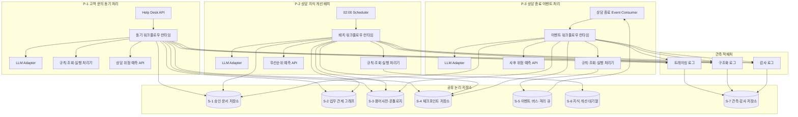

# ⑦ 배포 설계

> 미검증 설계

```mermaid
flowchart TB
  %% 1:1 대조: ② 실행 구성요소 15개, 배치 15개, 미대응 0건
  %% ② 논리 저장소 7개, ③ 체크포인터는 S-4로 존재 확인
  %% ⑥ 관측 적재처 3개, 전체 노드 25개

  subgraph P1["P-1 고객 문의 동기 처리"]
    API["Help Desk API"]
    RUNTIME1["동기 워크플로우 런타임"]
    ADAPTER1["LLM Adapter"]
    RULE1["규칙·조회·실행 처리기"]
    RISK1["상담 위험 예측 API"]
    API --> RUNTIME1
    RUNTIME1 --> ADAPTER1
    RUNTIME1 --> RULE1
    RUNTIME1 --> RISK1
  end

  subgraph P2["P-2 상담 지식 개선 배치"]
    SCHED["02:00 Scheduler"]
    RUNTIME2["배치 워크플로우 런타임"]
    ADAPTER2["LLM Adapter"]
    RULE2["규칙·조회·실행 처리기"]
    RISK2["우선순위 예측 API"]
    SCHED --> RUNTIME2
    RUNTIME2 --> ADAPTER2
    RUNTIME2 --> RULE2
    RUNTIME2 --> RISK2
  end

  subgraph P3["P-3 상담 종료 이벤트 처리"]
    CONSUMER["상담 종료 Event Consumer"]
    RUNTIME3["이벤트 워크플로우 런타임"]
    ADAPTER3["LLM Adapter"]
    RULE3["규칙·조회·실행 처리기"]
    RISK3["사후 위험 예측 API"]
    CONSUMER --> RUNTIME3
    RUNTIME3 --> ADAPTER3
    RUNTIME3 --> RULE3
    RUNTIME3 --> RISK3
  end

  subgraph STORES["공유 논리 저장소"]
    DOCS[("S-1 승인 문서 저장소")]
    GRAPH[("S-2 업무 관계 그래프")]
    DICT[("S-3 용어사전·온톨로지")]
    CHECK[("S-4 체크포인트 저장소")]
    EVENT[("S-5 이벤트 버스·격리 큐")]
    REVIEW[("S-6 지식 개선 대기열")]
    AUDIT[("S-7 관측·감사 저장소")]
  end

  subgraph OBS["관측 적재처"]
    TRACE["트레이싱 로그"]
    STRUCTURED["구조화 로그"]
    AUDIT_LOG["감사 로그"]
  end

  RUNTIME1 --> DOCS
  RUNTIME1 --> GRAPH
  RUNTIME1 --> DICT
  RUNTIME1 --> CHECK
  RUNTIME2 --> DOCS
  RUNTIME2 --> GRAPH
  RUNTIME2 --> DICT
  RUNTIME2 --> CHECK
  RUNTIME3 --> DOCS
  RUNTIME3 --> DICT
  RUNTIME3 --> CHECK
  EVENT --> CONSUMER
  RULE2 --> REVIEW
  RULE3 --> EVENT
  RUNTIME1 --> TRACE
  RUNTIME1 --> STRUCTURED
  RUNTIME1 --> AUDIT_LOG
  RUNTIME2 --> TRACE
  RUNTIME2 --> STRUCTURED
  RUNTIME2 --> AUDIT_LOG
  RUNTIME3 --> TRACE
  RUNTIME3 --> STRUCTURED
  RUNTIME3 --> AUDIT_LOG
  TRACE --> AUDIT
  STRUCTURED --> AUDIT
  AUDIT_LOG --> AUDIT
```
