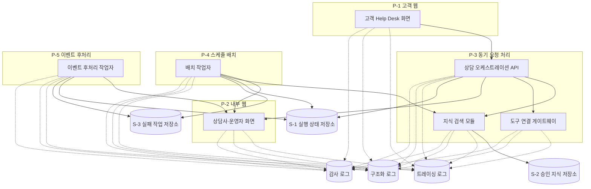

# ⑦ 배포 설계: 신용카드사 AI Help Desk

**미검증 설계**: 실제 배포를 수행하지 않은 교육용 물리 배치 설계임.

## 물리 배치도

② 구성요소 8개: P-1 ~ P-5 실행환경에 7개,  
S-1 실행 상태 저장소에 1개 대응함. 미대응 0건임.  
⑤ 저장소 3개, ③ 체크포인트 상태 저장소 1개, ⑥ 로그 유형 3개를 이름만 표시함.

설계 범위 밖: 제품·접속정보·비밀값 주입 경로·포트·  
저장소 안/밖 세부 배치·지역 제한·백업·복구·  
배포 절차·롤백·규모 상한은 구현·운영 단계에서 정함.

## 미확정 항목

미확정 항목 0건임.

| `[확인필요]` 태그 | 무엇이 없나 | 누구에게 되묻나 | 안 오면 무엇이 막히나 |
|---|---|---|---|
| 0건 | 해당 없음 | 해당 없음 | 해당 없음 |

## 변경요청

| 무엇 | 받는 곳 | 사유 |
|---|---|---|
| 0건 | 해당 없음 | 해당 없음 |
