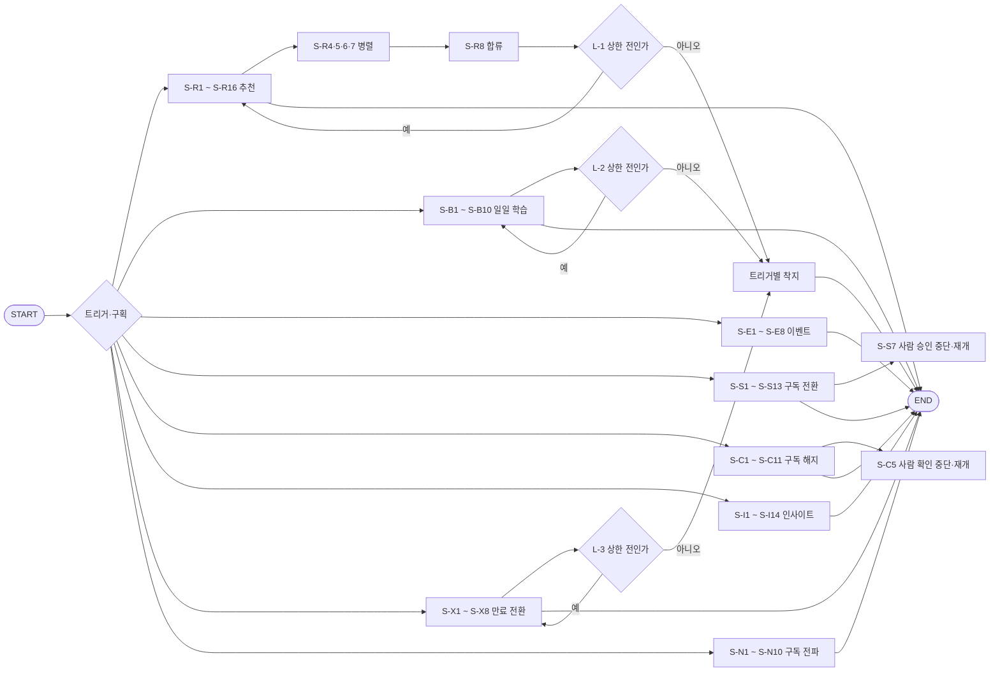

# 런치픽 워크플로우 — v1.1

설계서 ③의 90단계와 설계서 ④의 담당자 16명 계약을 LangGraph 흐름으로 조립한 모듈임.  
API 계층은 `run_flow()`와 `resume_flow()`만 호출하며 상태·설정·체크포인터는 `common`에서 가져옴.

## 1. 적용 판정

| 항목 | 적용 값 | 근거 |
|------|---------|------|
| 패턴 | 트리거별 순차·조건 분기, 추천 컨텍스트 4갈래 병렬 | ③ 1절·3절 |
| 트리거 | `S-R` `S-B` `S-E` `S-S` `S-C` `S-I` `S-X` `S-N` 8종 | ③ 3절 |
| 단계·노드 | 90단계 = 90노드 | ③ 4절, `test_step_and_node_counts.py` |
| 담당자 모듈 | 16명 = 16모듈, 모델 미사용 14명 | ④ 2-6절·8-2절 |
| 루프 | `L-1` `L-2` `L-3` 3개 | ③ 8-2절 |
| 착지 | 트리거마다 1개, 총 8개 | ③ 8-1절·8-1-2절 |
| 재개 | 부작용 경계 9건, 재개 안 함 2종 | ③ 11절 |
| 재시도 계층 | 커넥터 1계층만 사용 | 되묻기 기본값, `common.external_call` |

## 2. 흐름 도식



## 3. 노드 묶음

상세 단계 식별자 90개와 담당자 매핑의 단일 출처는 `steps.py`임.  
`NODE_FUNCTIONS`가 같은 식별자 90개를 가져야 하며 시험에서 집합 일치와 함수명 보존을 확인함.

| 단계 범위 | 노드 파일 | 단계 수 | 착지 | 루프·분기 |
|----------|----------|:------:|------|----------|
| `S-R1` ~ `S-R16` | `nodes_recommend.py` | 16 | `S-R16` | 4갈래 병렬, `L-1` |
| `S-B1` ~ `S-B10` | `nodes_batch.py` | 10 | `S-B10` | `L-2` |
| `S-E1` ~ `S-E8` | `nodes_event.py` | 8 | `S-E8` | 구획 2개 |
| `S-S1` ~ `S-S13` | `nodes_subscribe.py` | 13 | `S-S13` | 구획 2개, `S-S7` 중단 |
| `S-C1` ~ `S-C11` | `nodes_cancel.py` | 11 | `S-C11` | `S-C5` 중단, `S-C10` 후처리 |
| `S-I1` ~ `S-I14` | `nodes_insight.py` | 14 | `S-I14` | 구획 2개 |
| `S-X1` ~ `S-X8` | `nodes_expiry.py` | 8 | `S-X8` | `L-3` |
| `S-N1` ~ `S-N10` | `nodes_propagate.py` | 10 | `S-N10` | 구획 2개 |

모든 노드 함수명은 단계 식별자의 붙임표만 밑줄로 바꿔 유지함.  
예: `S-R11` → `node_S_R11_*` 형태임.

## 4. 담당자 모듈

| 담당자 | 모듈 | 모델 사용 | 부르는 주요 부품 |
|--------|------|:--------:|-----------------|
| `R-1` | `r1_recommendation_sentence.py` | 예 | `C-2` 구조화 추천 생성 |
| `R-2` | `r2_recommendation_request.py` | 아니오 | 조회·`C-4`·`C-7`·`C-8` |
| `R-3` | `r3_batch_learning.py` | 결정론 | `C-3` 임베딩 호출 조립 |
| `R-4` | `r4_vector_commit.py` | 아니오 | 품질 문 뒤 벡터 커밋 |
| `R-5` | `r5_learning_transfer.py` | 아니오 | 학습 데이터 전달 |
| `R-6` | `r6_onboarding_profile.py` | 아니오 | 초기 프로파일 생성 |
| `R-7` | `r7_payment_request.py` | 아니오 | 결제 요청·결과 조립 |
| `R-8` | `r8_pg_register.py` | 아니오 | 승인 뒤 `C-9` |
| `R-9` | `r9_cancel_schedule.py` | 아니오 | 확인 뒤 해지 예약 |
| `R-10` | `r10_pg_stop.py` | 아니오 | 확인 뒤 `C-12` |
| `R-11` | `r11_expiry_downgrade.py` | 아니오 | 제한 장치 뒤 무료 전환 |
| `R-12` | `r12_plan_view.py` | 아니오 | 플랜 읽기 |
| `R-13` | `r13_subscription_state.py` | 아니오 | 구독 상태 반영 |
| `R-14` | `r14_history_insight.py` | 아니오 | 이력·집계 읽기 |
| `R-15` | `r15_memory_limit_notice.py` | 아니오 | 기억 제한 알림 |
| `R-16` | `r16_retention_policy.py` | 아니오 | 보관 정책 반영 |

`R-1`의 시스템·사용자 프롬프트는 각각
`recommendation_history_service/agents/prompts/r1_recommendation_system.md`와
`r1_recommendation_user.md`에 분리함. 바깥 문자열은 XML 태그로 감쌈.

## 5. 상한과 착지

| 상한 | 설정·출처 | 초과 시 처리 | 사유 필드 |
|------|----------|-------------|----------|
| 단계 시간 | `LUNCHPICK_STEP_TIMEOUT_MS`, ③ 4절 | 실행 전 트리거별 착지 | `fallback_reason` |
| 재시도 | `LUNCHPICK_STEP_RETRY_COUNT`, ③ 4절 | 커넥터가 실패를 올리고 착지 | `error_history` |
| 반복 | `LUNCHPICK_LOOP_MAX_ITER`, ③ 8-2절 | 마지막 여유에서 착지 | `fallback_reason` |
| 전체 걸음 | 노드 수 × 루프 상한 × 여유 | LangGraph `recursion_limit` | `flow_step_cap_reached` |

루프 상한값이 비면 상한 없이 실행하지 않고 `loop_limit_unset` 사유로 착지함.  
착지 노드는 모델 호출·재시도·루프를 다시 사용하지 않음.

## 6. 재개와 중복 방지

| 트리거·구획 | 경계 단계 | 재개 단위 | 중복 방지 키 조각 |
|------------|----------|----------|-----------------|
| `S-B` 배치 | `S-B7` | 회원 1명 | `member_id` + `target_date` |
| `S-E` 구획1 | `S-E3` | 피드백 1건 | `meal_record_id` + `member_id` |
| `S-E` 구획2 | `S-E6` | 회원 1명 | `member_id` + `onboarding_round` |
| `S-S` 결제 | `S-S9` | 결제 요청 1건 | `member_id` + `plan_type` + `payment_request_id` |
| `S-C` 해지 | `S-C7` | 해지 요청 1건 | `member_id` + `scheduled_downgrade_on` |
| `S-C` 후처리 | `S-C10` | 해지 1건 | `pg_payment_id` + `cancel_schedule_id` |
| `S-N` 구획1 | `S-N3` | 알림 1건 | `member_id` + `expiring_baseline_on` |
| `S-N` 구획2 | `S-N6` | 결제 1건 | `payment_id` |
| `S-X` 배치 | `S-X4` | 회원 1명 | `member_id` + `scheduled_downgrade_on` |

`S-R`과 `S-I`는 설계서의 `재개 안 함` 판정이므로 `resume_flow()`가 요청을 거부함.  
재개 호출은 체크포인터를 필수로 받고 `Command(resume=...)`와 같은 `thread_id`를 사용함.

## 7. PostgreSQL 체크포인터 사용

```python
async with open_checkpointer(settings) as handle:
    context.idempotency = handle.idempotency
    result = await run_flow(
        trigger_kind,
        context,
        member_id=member_id,
        requested_at=requested_at,
        checkpointer=handle.saver,
    )
```

운영 기본 실패 정책은 `fail_fast`임. PostgreSQL 연결 또는 `setup()` 실패 시 서비스 시작을 막음.  
개발 환경에서만 `memory_fallback_for_development`를 명시하면 메모리로 대체하며
`handle.degraded`와 `handle.fallback_reason`으로 성능 저하 상태를 확인 가능함.

## 8. 실행과 시험

```powershell
cd output\src\v1.1\services
uv sync --extra dev
uv run --extra dev pytest -q
```

실제 외부 API·PostgreSQL 호출은 기본 시험에서 제외함. `-m live_call`을 명시한 경우만 실행함.

## 9. 되묻기 기본값과 보류 항목

| 항목 | 적용 값 | 후속 조치 |
|------|---------|----------|
| 전체 단계 상한 | 노드 수 × 루프별 상한의 곱 + 여유 4걸음 | ③에 전체 단계 상한 열 추가 권고 |
| 병렬 합류 | 즉시 진행 + 빠진 값을 오류 목록에 표시 | ③ 시퀀스 단계에 합류 규칙 열 추가 권고 |
| 사람 확인 | 노드 앞에서 중단, 같은 단계 식별자로 재개 | ③ 재개 경계에 구현 형태 추가 권고 |
| 재시도 계층 | 커넥터 1계층 | 다른 계층 재시도 금지 |

`[확인필요]` 값은 체크포인트 보관 기간, 루프 상한 3개, PG 등록·중지 시간 제한,
동기 요청 마감선, 사람 확인 유효 시간임. 값이 없는 루프는 안전 착지하고, 시간 제한 미확정 단계는
관측 기록에 미확정 표식을 남김. 실제 수치를 임의로 보완하지 않음.

## 10. Context7 확인 근거

2026-08-08 context7의 LangGraph 공식 문서에서 다음 API 형태를 확인함.

- `from langgraph.graph import StateGraph, START, END`
- `builder.add_conditional_edges(source, path, path_map)`
- `builder.compile(checkpointer=...)`
- `from langgraph.checkpoint.memory import InMemorySaver`
- `from langgraph.checkpoint.postgres.aio import AsyncPostgresSaver`
- `AsyncPostgresSaver.from_conn_string(...)`와 최초 `await saver.setup()`
- 호출 설정의 `configurable.thread_id` 및 최상위 `recursion_limit`

설치 버전은 `services/pyproject.toml`과 `uv.lock`에 고정함.
