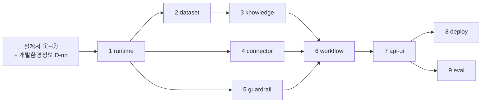

# 개발 프롬프트 작성계획 — 범용 세트 9건

작성: 2026-08-08 · 팀: design-agentic-ai · 협의·조정: 클로니(오케스트레이터)  
협의 참여: 플로니(`flonie`) · 지식니(`jisikni`) · 커넥니(`connectni`) — 병렬 위임 후 클로니가 교차검증·수렴

> **미검증 계획임.** 이 세트를 실제로 돌려 코드를 만들어 본 적이 없음.  
> 설계서 ③ ~ ⑦이 아직 없는 상태에서 세운 계획이며, 근거는 `guides/` 가이드 7종의 설계항목 이름임.

---

## 0. 한눈에 보기

설계서 7종이 나오면 **그 값을 읽어 코드로 옮기는** 개발 프롬프트를 9건 만듦.  
특정 서비스 전용이 아니라 **어느 프로젝트에나 쓰는 범용 템플릿**임.

| # | 프롬프트 | 다루는 것 | 담당 | 선행 |
|:-:|---------|----------|:----:|:----:|
| 1 | `01-runtime.md` | 공통 런타임 — 상태 · 예산 · 설정 · 모델 클라이언트 | 플로니 | — |
| 2 | `02-dataset.md` | 데이터 준비 — 원천 접속 또는 합성 시드 · 용어 매핑 | 지식니 | — |
| 3 | `03-knowledge.md` | 지식 경로 — 설계서가 채택한 검색 방식만 구현 | 지식니 | 1 · 2 |
| 4 | `04-connector.md` | 도구 · 커넥터 — 바깥 시스템 연결 · 인증 · 재시도 | 커넥니 | 1 |
| 5 | `05-guardrail.md` | 가드레일 · 관측 — 3지점 검사 · 가리기 · 기록 · 승인 | 커넥니 | 1 |
| 6 | `06-workflow.md` | 담당자 · 워크플로우 — 모듈 · 흐름 조립 · 상한 · 착지 | 플로니 | 1 · 3 · 4 · 5 |
| 7 | `07-api-ui.md` | API · 화면 — 진입점 · 스트리밍 · 프론트 | 클로니 | 6 |
| 8 | `08-deploy.md` | 패키징 · 배포 — 이미지 · 비밀값 · 되돌리기 | 커넥니 | 7 |
| 9 | `09-eval.md` | 품질 평가 — 골든셋 · 지표 실측 · 리포트 | 지식니 | 7 |

**2026-08-08 진행 상황** — 이 계획을 승인받아 프롬프트 실물 9건 + 변수 기입란 + README를
`prompts/develop/`에 만들었음. 세트 안내는 [`prompts/develop/README.md`](../prompts/develop/README.md)임.  
아직 **돌려 본 적은 없음.** 설계서 ③ ~ ⑦이 완성돼야 실제로 코드를 만들 수 있음.

---

## 1. 왜 새로 짜나

### 없는 것 1개

이 저장소의 설계 트랙은 **어느 프로젝트에나 쓰는 범용 템플릿**으로 완비돼 있음.

```
guides/01-*.md ~ 07-*.md            사람이 읽고 판단하는 가이드 7종
prompts/design/01-*.md ~ 07-*.md    AI가 설계서를 만드는 프롬프트 7종
prompts/design/_shared/프로젝트정보.md   프로젝트별 값 12종(V-01 ~ V-12)
        ↓
output/design/01-*.md ~ 07-*.md     설계서 7종  ← 여기까지가 현재
        ↓
        ???                          설계서를 받아 코드를 만드는 프롬프트가 없음
```

설계서는 **판단이 끝난 결과물**임. 무슨 흐름으로 갈지, 담당자가 몇 명인지, 어느 검색 경로를 쓸지,
무엇을 막고 무엇을 기록할지, 몇 덩어리로 나눠 올릴지가 전부 정해져 있음.  
그런데 그 값을 코드로 옮기는 자리가 비어 있음.

### 기존 자산을 못 쓰는 이유 4개

`prompts/develop-with-plan/`에 개발 프롬프트 7건이 이미 있으나 이번 세트의 바탕으로 못 씀.

| # | 이유 | 확인한 곳 |
|:-:|------|----------|
| 1 | **특정 서비스 전용** — 프로젝트 고유 값이 프롬프트 본문에 박혀 있어 다른 프로젝트에 그대로 못 씀 | 7건 전부 |
| 2 | **입력이 실재하지 않음** — 근거로 삼은 v0 소스 `src/`가 커밋 `7277586`에서 제거됨 | `backend.md` `[입력]` 3 ~ 4항 |
| 3 | **범위 밖 기능** — 4건이 설계서 범위 제외 판정과 정면 충돌 | `index-rag` · `index-graphrag` · `testset-rag` · `testset-graphrag` |
| 4 | **제품 코드 오염** — 그 4건의 산출물을 제품 경로에서 부르게 돼 있음 | `backend.md` `[맥락]` · `[입력]` 7항 |

**파일은 지우지 않고 그대로 둠.** 다만 이번 세트가 그 내용을 이어받지 않음(승계 0건). 자세한 것은 11절임.

---

## 2. 범용화 원칙 — 설계 트랙과 같은 장치를 씀

설계 프롬프트가 범용인 비결은 **프롬프트 본문에 프로젝트 값을 한 글자도 넣지 않은 것**임.  
판단 기준은 가이드에 두고, 프로젝트 값은 변수 파일에 뺐음. 개발 트랙도 같은 방식으로 만듦.

| | 설계 프롬프트 | **개발 프롬프트(신규)** |
|---|---|---|
| 판단 기준 | `guides/` 가이드 7종 | **없음 — 설계서가 이미 판단을 끝냈음** |
| 구현할 값 | (판단으로 만들어 냄) | `{출력 루트}`의 설계서 7종 |
| 프로젝트 값 | `_shared/프로젝트정보.md` `V-01` ~ `V-12` | `_shared/개발환경정보.md` `D-01` ~ `D-12` |
| 본문이 가리키는 것 | 가이드의 **절 번호** | 설계서의 **표 이름** |
| 산출물 | 마크다운 설계서 1건 | 실행되는 코드 + 시험 + README |

### 왜 절 번호가 아니라 표 이름으로 가리키나

설계서는 문서마다 절 번호가 다름. ①은 9절까지, ②는 10절까지임. 절 번호로 가리키면 설계서가 조금만
길어져도 개발 프롬프트가 전부 어긋남.

반면 **본문 표 이름은 `guides/README.md`의 「산출물 1건은 무엇으로 이뤄지나」가 7종 전부 고정**하고
있음. 표 이름으로 가리키면 설계서가 바뀌어도 개발 프롬프트를 안 고쳐도 됨.

> 예 — `03-knowledge.md`는 `설계서 ⑤의 5절`이 아니라 **`설계서 ⑤의 「비정형 경로」 표**`라고 씀.

---

## 3. 확정 사항

### 3-1. 사용자 결정 5건

| # | 결정 |
|---|------|
| 1 | **프롬프트만 만듦.** `references/dev-prompt-guide.md`는 원칙·규칙이 아니라 **참조 자료**. 개발 가이드 세트는 신설하지 않음 |
| 2 | 기존 7건을 **개정하지 않고 처음부터 새로 씀**(승계 0건). 단 **파일은 삭제하지 않고 보존** |
| 3 | 개발 프롬프트는 **8건 내외로 통합**(팀 원안은 12건이었음) |
| 4 | 계획서 산출 경로 = `output/개발프롬프트-작성계획.md` |
| 5 | **특정 서비스가 아닌 범용 프롬프트로 작성** — 설계 프롬프트와 같은 원칙 |

### 3-2. 클로니 조정 판정 4건

플로니·지식니·커넥니의 의견이 갈린 자리를 오케스트레이터가 가름.

| ID | 무엇이 갈렸나 | 판정 | 근거 |
|----|-------------|------|------|
| J-1 | 분할 축 — 플로니 6건(실행 흐름) ↔ 지식니 5건(데이터·검색) ↔ 커넥니 2건(횡단) | **코드 계층 축으로 통합 8건 + 검증 1건** | 세 사람이 각자 다른 축을 봤을 뿐 겹치지 않음. 합치면 12건이라 결정 3에 위배되어 성격이 붙는 것끼리 묶음 |
| J-2 | 모델 벤더 — 참조 자료의 고정값 ↔ 설계서 ④ `사용 모델` | **설계서가 이김.** 단 **어느 쪽도 코드에 박지 않음** — 벤더 어댑터 1겹 + 환경변수 주입 | 결정 1로 참조 자료의 고정값이 구속력을 잃음. 벤더는 프로젝트마다 다르므로 범용 프롬프트가 값을 가질 수 없음 |
| J-3 | 반복 상한 — 참조 자료의 `7회` ↔ 설계서 ③ `반복 상한` | **③이 이김.** 설계서에 값이 있으면 그 값, 없으면 기본값을 제시하고 사용자에게 물음 | 값의 주인이 ③임(`guides/README.md` G-4와 같은 방식) |
| J-4 | `단일 MAS` ↔ ④의 담당자 수 판정 | **충돌 아님.** 낱말만 같음 — 앞은 프로세스 1개, 뒤는 담당자 수 | 오독을 막기 위해 `06-workflow.md`에 `흐름 1개 안에 ④의 담당자 N명` 1줄을 못박음 |

### 3-3. 범용화로 팀 원안에서 걷어낸 것

| 누구 | 원안에 있던 프로젝트 고유값 | 바꾼 방식 |
|------|------------------------|----------|
| 지식니 | 취향 벡터 · 알레르겐 · 03:00 갱신 배치 | 설계서 ⑤ 「비정형 경로」·「민감 필드 분류」에서 읽음 |
| 커넥니 | 지도 · 날씨 · 푸시 · 결제 커넥터 | 설계서 ② 「외부 서비스 목록」에서 읽음 |
| 플로니 | 특정 시퀀스 단계 식별자 | 설계서 ③ 「시퀀스 단계」에서 읽음 |

---

## 4. 개발 프롬프트 세트 9건

`prompts/develop/` 아래 둠. 담당 인격은 `AGENTS.md`에서 주입함.

| # | 프롬프트 | 주 입력 — 설계서와 표 이름 | 코드 산출물 | 담당 | 선행 |
|:-:|---------|--------------------------|------------|:----:|:----:|
| 1 | `01-runtime.md` | ③ 상태 스키마 · 타임아웃·재시도 · 재개 경계 / ④ 사용 모델 · 공유 상태 후보 | 상태 정의(타입 + 병합 규칙) · 예산·마감선 · 설정 로더 · 중간 저장 장치 팩토리 · 모델 클라이언트 어댑터 | 플로니 | — |
| 2 | `02-dataset.md` | ⑤ 정형 접근 경로 · 원천 오류율 / ② 내부 저장소 목록 · 외부 서비스 구분 | 원천 접속 계층 **또는** 합성 시드 생성기 · 코드·용어 매핑 파일 · 원천 품질 리포트 | 지식니 | — |
| 3 | `03-knowledge.md` | ⑤ 정형 접근 경로 · 금지 컬럼 · 비정형 경로 · 채택 방식별 스펙 | **채택한 경로만** 구현 — 조회 계층 / 색인·검색기 / 질의 변환·재정렬 / 결정론 선행 필터 | 지식니 | 1 · 2 |
| 4 | `04-connector.md` | ② 외부 서비스 목록 · 신뢰 경계 / ④ 사용 도구 / ⑤ 커넥터 입출력 키 · 검증 기준 | 커넥터 어댑터 · 도구 정의 · 시간 상한·재시도 · 중복 방지 키 · 인증 · 대역/실물 분기 | 커넥니 | 1 |
| 5 | `05-guardrail.md` | ⑥ 차단 규칙 · 출력측 검사 · 마스킹 · 관측 기록 지점 · 비용 상한 | 입력·도구·출력 3지점 검사 모듈 1벌 · 가리기 매핑 1벌 · 관측 계측 · 승인 문 · 감사 기록 | 커넥니 | 1 |
| 6 | `06-workflow.md` | ③ 패턴 비교 · 시퀀스 단계 · 반복 상한 · 상한 초과 처리 / ④ 담당자별 계약 전부 | 담당자 모듈(계약 1장 = 모듈 1개) · 흐름 조립 · 조건 분기 · 착지 노드 · 재개 진입점 | 플로니 | 1 · 3 · 4 · 5 |
| 7 | `07-api-ui.md` | ③ 출력 스키마 / ⑦ 내부 포트 · 노출 포트 / ① 성공 기준 | 진입 API · 스트리밍 경로 · 화면(`D-04`가 `해당 없음`이면 API만) | 클로니 | 6 |
| 8 | `08-deploy.md` | ⑦ 패키징 단위 · 배포 형태 · 비밀값 · 저장소 배치 · 되돌리기 | 배포 단위 수만큼의 이미지 정의 · 실행 매니페스트 · 비밀값 예시 파일 · 상태 확인 · 보존·파기 작업 · 되돌리기 절차서 | 커넥니 | 7 |
| 9 | `09-eval.md` | ① 성공 기준 · 측정 방법 · 기준선 / ⑤ 골든셋 문항 / ⑥ 품질 측정 대상 | 골든셋 파일 · 평가 실행기 · 지표 설정 · 실측 결과 리포트 | 지식니 | 7 |

### 왜 이렇게 나눴나

**설계서 7종과 1:1로 못 맞추는 이유** — ①②는 코드 산출물이 0건이고(숫자 목표와 배치도임),
⑥⑦은 전 파일을 가로지르는 횡단 관심사임. 1:1로 맞추면 ①② 프롬프트는 만들 게 없고 ⑥⑦ 프롬프트는
다른 프롬프트가 만든 파일을 전부 다시 열어야 함.

**그래서 코드 계층 축으로 나눔.** 파일 경계를 실제로 만드는 것은 ③(흐름·상태)과 ④(담당자)이며,
나머지 설계서는 그 계층 위에 값을 얹음.

### 왜 검증 1건을 따로 두나

`09-eval.md`는 ① 목표/품질 카드의 숫자 목표를 **실제로 재는 유일한 자리**임.  
1 ~ 8의 완료조건은 모듈 단위 시험이고, 9는 경로 전체를 재므로 측정 대상이 다름.  
지식니 지적 — `평가 없이 검색부터 손대면 순서가 뒤집힘`.

### 팀 원안 12건에서 병합한 내역

| 원안 | 어디로 |
|------|-------|
| 플로니 `02-agents`(담당자 모듈) | 6에 흡수 — 계약과 흐름은 같은 파일 묶음을 만듦 |
| 플로니 `04-batch-event`(배치·이벤트 경로) | 6에 흡수 — 같은 ③ 시퀀스에서 나옴 |
| 플로니 `05-api-front` | 7 그대로 |
| 지식니 `A2 용어사전` | 2에 흡수 — 데이터 준비 단계임 |
| 지식니 `A3 색인` · `A4 후보 검색` | 3에 통합 — 색인과 검색은 짝임 |
| 커넥니 `⑧ 가드레일·관측` · `⑨ 배포` | 5 · 8 그대로 |

---

## 5. 범용화 장치 3종

프롬프트 본문에 프로젝트 값이 들어가지 않게 막는 장치임.

### 장치 1 — 개발 환경 변수 `D-01` ~ `D-12`

**신규 파일** `prompts/develop/_shared/개발환경정보.md`.  
설계 트랙의 `프로젝트정보.md`와 같은 방식으로 씀 — 모르는 값은 빈칸이 아니라 `프로젝트 확정 필요`로
적고, 그 상태면 해당 프롬프트가 **시작하지 않고 사용자에게 물음**.

| 변수 | 무엇인가 | 없으면 막히는 곳 |
|------|---------|----------------|
| `D-01` | 언어 · 런타임 버전 | 전 건 |
| `D-02` | 흐름 조립 프레임워크 | 1 · 6 |
| `D-03` | 웹 프레임워크 · API 규격 | 7 |
| `D-04` | 프론트엔드 스택(`해당 없음` 허용) | 7 — `해당 없음`이면 화면 만드는 단계를 건너뜀 |
| `D-05` | 코드 루트 경로 · 디렉터리 규칙 | 전 건 `[출력]` |
| `D-06` | 패키지 매니저 · 의존성 파일 | 전 건 |
| `D-07` | 시험 도구 · 실호출 시험 분리 표식 | 전 건 완료조건 |
| `D-08` | 상태 저장 · 중간 저장 장치 백엔드 | 1 · 6 |
| `D-09` | 컨테이너 · 배포 런타임 | 8 |
| `D-10` | 비밀값 주입 수단 | 8 |
| `D-11` | 관측 백엔드 · 내보내기 방식 | 5 |
| `D-12` | 환경변수 이름 규격(접두) | 1 — 없으면 프롬프트 9건이 제각각 이름을 지음 |

**`D-02`가 왜 필요한가** — 설계서 ⑦의 기술 스택 행에 `AI 흐름 프레임워크 지정 없음`으로 남는
경우가 실제로 있음. 설계서가 안 정한 값이라 개발 쪽에서 받아야 함(플로니 지목).

### 장치 2 — `[처리]` 2단계 「적용 판정」

설계서가 무엇을 채택했느냐에 따라 만들 코드가 갈리는 자리임.  
**프롬프트가 판단하지 않고 설계서에서 읽기만 함.**

| 프롬프트 | 무엇을 가르나 | 읽는 표 |
|:-------:|-------------|--------|
| 2 | 실데이터 접속인가 합성 시드인가 | ⑤ 정형 접근 경로 · ② 외부 서비스 구분(대역/실물) |
| 3 | 채택 경로가 무엇인가 — 조회 / 벡터 / 문서 검색 / 관계 검색 / 질의 생성 | ⑤ 비정형 경로 선택·정의. **미채택 경로는 만들지 않음** |
| 4 | 커넥터가 몇 개이고 되돌릴 수 없는 도구가 있나 | ② 외부 서비스 목록 · ④ 사용 도구의 읽기/쓰기 구분 |
| 6 | 담당자가 몇 명이고 되돌아가는 루프가 있나 | ④ 판정 근거 · ③ 패턴 비교의 채택 패턴 |
| 7 | 화면이 있나, 부분 전송이 필요한가 | `D-04` · ③ 출력 스키마 |
| 8 | 배포 단위가 몇 개이고 형태가 무엇인가 | ⑦ 패키징 단위 수 · 배포 형태 |

### 장치 3 — `[예시]`는 형식만

설계 프롬프트의 규칙을 그대로 씀.

> 아래는 **형식만** 보여 줌. 값은 프로젝트에서 나온 것으로 전부 교체함.

해서는 안 되는 예(anti-example)를 1건 반드시 붙임. 예 — `설계서에 없어서 흔한 기본값으로 채워 넣음`.

---

## 6. 설계서 → 개발 프롬프트 값 인계 매트릭스

이 계획서의 핵심 표임. 행은 `guides/` 각 가이드 3절의 **설계항목 전수**임.  
설계서 실물이 없어도 확정되는 이름이므로 지금 매트릭스를 고정할 수 있음.

`인계 없음`은 코드로 가지 않는 항목이며 **빠뜨린 것이 아니라 의도된 것**임(문서 근거·문서 간 흐름용).

### ① 목표/품질 카드

| 설계항목 | 받는 프롬프트 | 8섹션 중 자리 | 코드에서 무엇이 되나 |
|---------|:------------:|--------------|-------------------|
| 성공 기준 | 전 건 · 9 | `[제약조건]` 완료조건 | 시험이 `통과`라고 부르는 조건 |
| 측정 방법 | 9 | `[처리]` 지표 설정 | 측정 코드가 무엇을 세는가 |
| 채점 수단 | 9 | `[처리]` 지표 설정 | 사람 채점인가 자동 채점인가 → 평가 실행기 구조 |
| 목표값 | 전 건 · 9 | `[제약조건]` 완료조건 | 통과 임계값 상수 |
| 단위 환산 | 5 · 9 | `[처리]` 값 규정 | 1건당 비용·시간 상한 → 카운터 임계 |
| 측정 시점 | 9 | `[처리]` 실행 절 | 언제 재는가 → 평가 실행 주기 |
| 개선 전 기준선 | 9 | `[출력]` 리포트 | 비교 기준선 열 |
| 성격 선언 | 전 건 · 5 | `[맥락]` 1줄 | 사람이 최종 결정하는지 → 승인 문 유무 |
| 분해 회신 | — | **인계 없음** | ③이 ①에 되돌리는 값. 문서 사이의 값임 |
| 후행 소비처 | — | **인계 없음** | 문서 간 흐름 기록 |

### ② 논리아키텍처

| 설계항목 | 받는 프롬프트 | 8섹션 중 자리 | 코드에서 무엇이 되나 |
|---------|:------------:|--------------|-------------------|
| 전체 관계도 노드 | 4 · 8 | `[처리]` 커넥터 절 | 바깥 시스템 목록 = 어댑터 대상 |
| 간선 라벨 | 4 | `[처리]` 어댑터 규격 | 오가는 데이터 → 어댑터 입출력 |
| 내부 구성도 노드 | 1 · 8 | `[출력]` 경로 | 디렉터리 구조 · 이미지 정의 후보 |
| 내부 저장소 목록 | 2 · 8 | `[처리]` 저장 계층 | 접속 대상 · 볼륨 정의 |
| 신뢰 경계 | 4 · 5 | `[처리]` 검사 지점 | 입력 검사를 어느 함수에 붙이나 |
| 경계 통과 데이터 | 5 | `[처리]` 가리기 단계 | 가릴 값이 지나는 지점 |
| 경계 미통과 항목 | 4 · 5 | `[제약조건]` MUST NOT | **그 키를 아예 만들지 않음.** 가리기로 대신하지 않음 |
| 외부 서비스 `구분` | 2 · 4 | `[처리]` 시험 절 | 대역(Mock)/실물 분기 |
| 대체 사유 | — | **인계 없음** | 문서 근거 |
| 배치 결정 사유 | — | **인계 없음** | 문서 근거 |

### ③ 패턴/시퀀스

| 설계항목 | 받는 프롬프트 | 8섹션 중 자리 | 코드에서 무엇이 되나 |
|---------|:------------:|--------------|-------------------|
| 패턴 비교 표 | 6 | `[처리]` 2단계 적용 판정 | 고정 간선인가 조건 분기인가 병렬인가 |
| 시퀀스 단계 | 6 | `[처리]` 토폴로지 표 | 노드 1개 = 단계 1개. **함수명에 단계 식별자 유지** |
| 단계 간 데이터 형식 | 1 · 6 | `[처리]` 상태 정의 | 노드 반환 키 묶음 · 병렬 노드 격리 검증 대상 |
| 상태 스키마 | 1 | `[처리]` 1단계 | 타입 정의 + 병합 규칙. 갱신 주체 1개면 병합 규칙 없음 |
| 출력 스키마 | 7 | `[처리]` · `[예시]` | 구조화 출력 = 응답 모델. 형 정의 1벌을 공유 |
| 타임아웃·재시도 | 1 · 6 | `[처리]` 노드 계약 | 시간 상한 + 재시도 감싸개 + 환경변수 기본값 |
| 반복 상한 | 6 | `[처리]` 루프 절 | 조건 분기의 카운터 비교 |
| 상한 초과 처리 | 6 | `[처리]` 착지 절 | 착지 노드 + 사유 필드 |
| 대조 2줄(목표치·최악값) | 1 · 9 | `[제약조건]` 완료조건 | 재시도 포함 최악값 합계가 목표 안인지 재는 시험 |
| 부하 조건 | 1 · 8 | `[처리]` · `[제약조건]` | 연결 풀 크기 · 동시 실행 상한 |
| 재개 경계 | 1 · 6 | `[처리]` 지속성 절 | 저장 지점 · 재진입 노드 · 중복 방지 키 |
| 변경요청 | 5 | `[입력]` 참조 | ⑥이 새 값을 정하지 않고 ③ 값을 인용하는 근거 |

### ④ 역할계약서

| 설계항목 | 받는 프롬프트 | 8섹션 중 자리 | 코드에서 무엇이 되나 |
|---------|:------------:|--------------|-------------------|
| 책임 | 6 | `[목표]` · 모듈 주석 | 모듈 1개의 존재 이유. `그리고`가 있으면 모듈을 쪼갬 |
| 접근 가능한 정보 항목 | 3 | `[제약조건]` MUST NOT | 조회 컬럼 허용 목록 |
| 입출력 형식 | 6 · 4 | `[처리]` 시그니처 | 함수 인자·반환 키 이름. **개발이 새 이름 짓기 금지** |
| 사용 도구 | 4 · 5 | `[처리]` 도구 절 | 도구 정의. 되돌릴 수 없는 것은 승인 문 뒤에 둠 |
| 사용 모델 | 1 · 6 | `[처리]` 모델 설정 | 벤더 어댑터 인자. `모델 미사용` 행은 순수 함수로 구현 |
| 성공 기준 | 6 · 9 | `[제약조건]` 완료조건 | 단정문 1개 = 기준 1개 |
| 중단 조건 | 6 | `[처리]` 분기 함수 | 조건 분기 함수의 판정식 |
| 중단 조건의 판정 주체·시점 | 6 | `[처리]` 분기 위치 | 어느 노드 뒤에 분기를 붙이나 |
| 공유 상태 후보 표시 | 1 | `[처리]` 상태 정의 | 상태에 올릴지 노드 지역 변수로 둘지 |

### ⑤ 지식/도구

| 설계항목 | 받는 프롬프트 | 8섹션 중 자리 | 코드에서 무엇이 되나 |
|---------|:------------:|--------------|-------------------|
| 정형 접근 경로 | 2 · 3 | `[처리]` 조회 계층 | 조회문 · 행 수 상한 |
| 정형 접근 금지 컬럼 | 3 | `[제약조건]` MUST NOT | 조회 차단 목록 + 위반 시 실패하는 시험 |
| 비정형 경로 선택·정의 | 3 | `[처리]` 2단계 적용 판정 | **채택 방식만 구현.** 미채택은 파일을 만들지 않음 |
| 채택 방식별 필수 스펙 | 3 | `[처리]` 구현 파라미터 | 벡터·문서 검색·관계 검색·용어사전별 설정값 |
| 커넥터 입출력 키 | 4 | `[처리]` 도구 스키마 | 입출력 모델 필드명 — 문자열 그대로 |
| 커넥터 검증 기준 | 4 · 9 | `[제약조건]` 완료조건 | 호출 순서·인자 검증 시험 |
| Mock·실물 구분 | 2 · 4 | `[처리]` 시험 절 | 시험 대역 분기 |
| 커넥터 사용 주체 | 6 | `[처리]` 노드 배치 | 어느 담당자 모듈이 부르나 |
| 민감 필드 ID | 5 | `[처리]` 가리기 단계 | 가리기 필드 목록 상수 |
| 민감 필드 변환 지점 | 5 | `[처리]` 훅 위치 | 호출 직전 변환 함수를 어디에 끼우나 |
| 보존·삭제 | 8 | `[처리]` 보존 작업 | 만료 삭제 작업 + 삭제 실행 기록 |
| 원천 오류율 | 2 | `[처리]` 품질 게이트 | 품질 리포트 임계 검사 |
| 골든셋 문항 | 9 | `[출력]` · 완료조건 | 골든셋 파일 + 평가 실행기 |

### ⑥ 가드레일/관측

| 설계항목 | 받는 프롬프트 | 8섹션 중 자리 | 코드에서 무엇이 되나 |
|---------|:------------:|--------------|-------------------|
| 차단 규칙 | 5 | `[처리]` 3지점 검사 | 입력·도구·출력 검사 모듈 **1벌**. 경로별 복제 금지 |
| 승인 지점(2-3절 판정 결과) | 5 · 4 | `[제약조건]` MUST | 승인 표시 없는 호출은 거부 · 중복 방지 키 |
| 출력측 검사 | 5 | `[처리]` · `[예시]` | 출력 검사 함수 + 검사 방식 설정 파일 |
| 마스킹 | 5 | `[제약조건]` MUST | 필드↔방법 매핑 1벌 |
| 마스킹 추가 행 4종 | 5 | `[처리]` 4경로 적용 | 관측 입력 요약 · 오류 스택 · 감사 변경 전후 값 · 접근 로그 |
| 관측 기록 지점 | 5 | `[처리]` 계측 절 | 단계별 기록 + 필수 항목. **③이 나눈 단계를 합치지 않음** |
| 품질 측정 대상 | 9 | `[처리]` 지표 설정 | 지표 목록 · 임계값 |
| 비용 상한 | 5 | `[처리]` 카운터 | 요청당 토큰·단가 카운터 · 초과 시 알림 |
| 타임아웃(③ 인용) | 5 | `[입력]` 참조 | 환경변수로 뺌. **여기서 새 값을 정하지 않음** |

### ⑦ 배포

| 설계항목 | 받는 프롬프트 | 8섹션 중 자리 | 코드에서 무엇이 되나 |
|---------|:------------:|--------------|-------------------|
| 패키징 단위 수 | 8 | `[출력]` 경로 | 이미지 정의 수 = 단위 수 |
| 포함 구성요소 | 8 | `[출력]` 경로 | 각 이미지에 들어갈 코드 범위 |
| 배포 형태 | 8 | `[처리]` 2단계 적용 판정 | 컨테이너인가 다른 형태인가 |
| 런타임 규모 상한 | 8 | `[처리]` 자원 설정 | 자원 요청·상한 값 |
| 내부 포트 | 7 · 8 | `[처리]` 포트 절 | 서비스 사이 통신 포트 |
| 노출 포트 | 7 · 8 | `[처리]` 포트 절 | 바깥 진입 포트 + 상태 확인 경로 |
| 비밀값 주입 경로 | 8 | `[제약조건]` MUST | 예시 파일에 **키 이름만.** 이미지에 굽지 않음 |
| 저장소 배치 | 8 | `[처리]` 저장 절 | 볼륨 정의 · 접속 정보 위치 |
| 핸들 보관 위치 | 1 · 8 | `[처리]` 세션 절 | 세션 참조값 저장소. 해당 없으면 `해당 없음` 1행 유지 |
| 되돌리기 — 무엇이 되돌아오지 않나 | 8 | 완료조건 | 되돌릴 수 없는 변경 목록 |
| 되돌리기 — 직전 값 1세대 보관 | 8 | 완료조건 | 이전 세대 보관 코드 |
| 배포 전 준비 | 8 | `[처리]` 순서 절 | 배포 순서 · 선행 작업 |
| 분할 근거 | — | **인계 없음** | 문서 근거 |

### 공통

| 설계항목 | 받는 프롬프트 | 비고 |
|---------|:------------:|------|
| 근거 출처(7종 공통 마지막 열) | — | **인계 없음.** 문서 안에서 값의 출처를 밝히는 열임 |
| 부속 표 4종(제외 지표 · 미대응 · 대조 기록 · 미확정 항목) | — | **인계 없음.** 단 `[확인필요]` 행은 각 프롬프트 `[처리]` 3단계 되묻기 목록의 입력이 됨 |

### 대조 결과

가이드 7종 3절의 설계항목을 전수로 뽑아 위 표와 맞춰 봤음(2026-08-08 실측).

| 항목 | 수 |
|------|---|
| 매트릭스 총 행 수 | **78** — 설계서별 76행 + 공통 2행 |
| 설계서별 행 수 | ① 10 · ② 10 · ③ 12 · ④ 9 · ⑤ 13 · ⑥ 9 · ⑦ 13 |
| 코드 인계처가 있는 것 | **71** |
| `인계 없음` | **7** — ① 분해 회신 · ① 후행 소비처 · ② 대체 사유 · ② 배치 결정 사유 · ⑦ 분할 근거 · 근거 출처 · 부속 표 4종 |
| **인계처를 못 정한 것** | **0** |

`근거 출처`는 7종 3절에 각각 있으나 **공통 열**이라 마지막 「공통」 표에 1행으로 합쳤음.  
`승인 지점`은 ⑥ 3절 설계항목이 아니라 ⑥ 2-3절 판정 결과이나, 코드로 가는 값이라 매트릭스에 더했음.

---

## 7. 프롬프트 1건의 공통 골격

`references/prompt-guide.md`의 8섹션 표준을 씀. 설계 프롬프트와 달리 `[예시]`까지 8개 전부 채움.

```
# 개발 프롬프트 {번호} {이름}
> 이 파일 전체를 AI 코딩 도구에 붙여 넣어 코드를 만듦. 이 문서 자체는 코드가 아님.
> 주 입력: {출력 루트}의 설계서 {번호}. 판단은 설계서가 이미 끝냈고 이 프롬프트는 옮기기만 함
> 실행 순서: 1 → 2 → 3 → 4 → 5 → 6 → 7 → 8 (+ 9 검증)
> 담당 인격: {AGENTS.md 팀원}

[목표]      만들 코드 산출물 1문장. 프로젝트 이름을 쓰지 않음
[역할]      AGENTS.md 인격 주입 — 프로파일 · 성향 · 경력 · 이 산출물을 맡는 이유
[맥락]      내 상황 / 담당 경계(밖은 인터페이스만 가정) / 값의 주인 / 결과물 독자
[입력]      우선순위 표 + `없으면` 열
[처리]      1 시작 조건 확인 → 2 적용 판정 → 3 되묻기 → 4~ 구현 → 시험 → README → 자가 점검
[출력]      D-05 기준 경로 · 파일 목록 · 톤앤매너
[제약조건]  MUST / MUST NOT / 완료조건(증거 기준)
[예시]      형식만 보여 주는 표 2 ~ 3개 + 해서는 안 되는 예 1건
```

### `[입력]` 우선순위 8행 (전 건 공통 골격)

앞 자료가 뒤 자료와 어긋나면 **앞 자료를 따름**.

| 순위 | 입력 | 없으면 |
|:----:|------|-------|
| 1 | `prompts/develop/_shared/개발환경정보.md` — 이 프롬프트가 쓰는 `D-nn` | `프로젝트 확정 필요`면 **시작하지 않고 사용자에게 문의** |
| 2 | 주 입력 설계서(4절 표의 해당 행) | **시작하지 않음.** 그 설계서를 먼저 만들라고 보고하고 멈춤 |
| 3 | 선행 설계서(값을 인용하는 것) | 인용 자리를 `[확인필요: 선행 미생성]`으로 남기고 진행 |
| 4 | 선행 프롬프트가 만든 코드 | 인터페이스만 가정하고 직접 만들지 않음 |
| 5 | `prompts/design/_shared/프로젝트정보.md` — `V-07`(기술 스택) · `V-12`(출력 루트) | 기본 경로 `output/design/`을 씀 |
| 6 | context7 MCP — 프레임워크 최신 API | **필수.** 못 쓰면 그 사실을 보고하고 멈춤 |
| 7 | `AGENTS.md` — 마크다운 규칙 · 정직한 보고 규칙 | — |
| 8 | `references/dev-prompt-guide.md` — **참조용, 구속력 없음** | 없어도 진행 |

### `[처리]` 앞 3단계 (전 건 공통)

| 단계 | 하는 일 |
|:----:|--------|
| 1 | **시작 조건 확인** — `D-nn`과 주 입력 설계서가 있는지 봄. 없으면 **코드를 만들지 않고** 무엇이 비었는지 보고 |
| 2 | **적용 판정** — 5절 장치 2 표대로 설계서에서 읽음. 판정 결과를 응답에 먼저 보여 사용자가 되돌릴 수 있게 함 |
| 3 | **되묻기** — 8절 표에서 이 프롬프트 몫을 물음. 기본값을 함께 제시하고, `기본값으로 진행`이라 하면 되묻지 않음 |

### 전 건 공통 규칙 4개

| # | 규칙 | 왜 |
|---|------|-----|
| 1 | **설계서에 값이 있으면 그 값을 씀.** 없으면 지어내지 않고 3단계에서 되물음 | 짐작한 값 위에 코드를 세우면 나중에 전부 다시 씀 |
| 2 | **값의 주인을 넘지 않음** — 키 이름은 ④, 민감 필드 ID는 ⑤, 시간 상한·반복 상한은 ③ 소유 | 같은 값이 두 곳에 생기면 어느 쪽이 진짜인지 모르게 됨(`guides/README.md` G-4 · G-11 ~ G-13) |
| 3 | **설계서 문장을 코드 주석에 옮겨 붙이지 않음** | 코드는 값만 받음. 문장이 들어가면 설계서를 고칠 때 코드도 어긋남 |
| 4 | **context7 MCP 필수 사용** — 코드 작성 **직전에** 확인 | 프레임워크 API 변화가 커서 기억으로 쓰면 안 맞음 |

### 참조 자료에서 빌려 쓰는 것 · 쓰지 않는 것

`references/dev-prompt-guide.md`는 결정 1로 **규칙이 아니라 참조 자료**임.

| 빌려 씀(유용해서) | 쓰지 않음 |
|------------------|----------|
| API 키를 설정 파일이 아닌 환경 파일에서 읽기 | 특정 모델 벤더·모델명 고정값 |
| 설정과 소스 분리 | 특정 벡터 DB · 임베딩 모델 · 청크 크기 고정값 |
| 모듈별 단위 시험 + 실호출 시험 분리 표식 | 특정 검색 가중치 · top-k 고정값 |
| 의존성 파일 정의 | 특정 재정렬 모델 · 특정 평가 프레임워크 고정값 |
| README에 흐름 도식 + 가상환경 3종(GitBash · PowerShell · Linux/Mac) 안내 | 반복 상한 `7회` 고정값(③ 소유) |

**쓰지 않는 값의 자리는 설계서와 `D-nn`이 채움.** 그래야 범용이 됨.

---

## 8. 되묻기 · 변수 배치표

설계서에 칸 자체가 없어 개발 쪽에서 받아야 하는 항목임(플로니 지목 12건).  
프로젝트마다 답이 같은 것은 `D-nn` 변수로, 갈리는 것은 `[처리]` 3단계 되묻기로 배치함.

| 없는 칸 | 처리 | 어느 프롬프트 | 기본값 제시 |
|---------|------|:------------:|------------|
| 흐름 조립 프레임워크 | `D-02` | 1 | — |
| 중간 저장 장치 종류·백엔드 | `D-08` | 1 | — |
| 환경변수 이름 규격 | `D-12` | 1 | `{접두}_{영역}_{항목}` |
| 세션 식별자 조립 규칙 | 되묻기 | 1 | `{주체ID}:{날짜}` |
| 상태 병합 함수 지정 | 되묻기 + **③에 되돌려 적기 권고** | 1 | 목록형은 이어 붙이기 |
| 흐름 전체 단계 상한 | 되묻기 | 6 | 개발이 산정해 제시 |
| 병렬 합류 규칙(한쪽 실패 시) | 되묻기 + **③에 열 추가 권고** | 6 | 즉시 진행 + 빠진 값 표기 |
| 사람 확인 지점의 구현 형태·재진입 경로 | 되묻기 + **③에 열 추가 권고** | 6 | 노드 앞에서 멈춤 |
| 재시도가 걸리는 계층 | 되묻기 | 4 · 6 | 커넥터 1계층만 |
| 시간 상한 초과 시 취소 의미 | 되묻기 | 4 | 되돌릴 수 없는 도구는 승인 문 뒤 |
| 중복 방지 키 저장소 · 보관 기간 | 되묻기 | 4 · 8 | 캐시 24시간 |
| 부분 전송 계약(이벤트 형 · 순서) | 되묻기 | 7 | 최종형만 1회 전송 |

**재시도 계층을 반드시 묻는 이유** — 노드 내부 · 프레임워크 · 커넥터 세 곳에 재시도가 겹치면
횟수가 **곱해짐**. 가이드가 실제 기획 자료에서 `5회 × 3회 = 최대 15회` 사례를 찾아 경고한 자리임.

---

## 9. 실행 순서와 착수 게이트

### 순서



- **1이 먼저** — 상태 타입과 설정 규격을 뒤 프롬프트가 전부 가져다 씀
- **2 · 4 · 5는 병렬 가능** — 1이 끝나면 동시에 돌려도 서로 안 부딪힘
- **6은 3 · 4 · 5가 다 끝나야 시작** — 담당자 모듈이 검색·도구·검사를 전부 부름
- **8과 9는 병렬 가능** — 배포와 평가는 서로를 안 기다림

### 착수 게이트

개발 프롬프트는 설계서 값을 읽으므로 설계서가 앞섬.  
2026-08-08 기준 `output/design/`에는 `01`·`02` 2건만 있음(③ ~ ⑦ 미생성).

| 시점 | 할 수 있는 것 |
|------|-------------|
| 지금 | 이 계획서. 매트릭스는 표 이름 기준이라 설계서 없이 확정됨 |
| 지금 | **프롬프트 실물 9건 작성도 가능** — 값이 아니라 표 이름을 가리키므로 설계서를 기다리지 않아도 됨 |
| 설계서 ③ ~ ⑦ 완성 후 | 프롬프트를 실제로 돌려 코드 생성. 이때 매트릭스에 행이 늘 수 있음 |

---

## 10. 완료조건 규격

`AGENTS.md` 정직한 보고 규칙에 따라 **"썼다"가 아니라 "확인했다"** 수준으로 씀.  
아래는 프로젝트와 무관한 서술이며, 실제 개수는 그 프로젝트 설계서의 행 수에서 나옴.

| 계열 | 증거 |
|------|------|
| 자동 확정 금지 | ⑥ 승인 지점 표의 **전 행**에 대해 승인 없는 호출이 거부되는 시험 로그. **행 수와 로그 수가 같음** |
| 출력측 검사 | ⑥ 출력 검사 표의 위반 유형마다 표본을 넣어 차단·가림 결과 로그. **못 막은 건은 낮춰 보고하지 않고 그대로 적음** |
| 입력측 검사 | 바깥에서 받은 문자열에 지시문을 심어 넣음 → 태그로 감싼 원문과 지시를 따르지 않은 응답 로그 |
| 기록·보존 | 만들어진 로그 전수 검색에서 ⑤ 민감 필드 패턴이 **0건** · 만료 삭제 작업 예행 로그 |
| 지식 경로 품질 | ⑤ 골든셋 문항 전건 실행 · ⑥ 품질 측정 표의 지표별 실측값. **목표는 ①에서 읽고 여기서 새로 정하지 않음** |
| 재현성 | 같은 골든셋을 2회 실행했을 때 지표 평균 차를 숫자로 제시 |
| 전 건 공통 | 만든 파일 목록(`ls` 결과) · 단위 시험 실패 0건 로그 · 표본 요청 3건 이상의 요청→응답 로그 |

**MUST NOT — 목표에 못 미칠 때 목표치를 낮춰 통과시키지 않음.**  
못 미친 사실을 숫자로 그대로 적고 원인을 함께 보고함.

---

## 11. 기존 세트 처리 — 파일은 남기고 승계는 안 함

`prompts/develop-with-plan/` 7건을 **삭제하지 않음.** 다만 이번 세트가 내용을 이어받지 않음.  
승계하지 않는 이유는 1절 「기존 자산을 못 쓰는 이유 4개」임.

**두 폴더를 헷갈리지 않게 하는 장치** — 신규 `prompts/develop/README.md` 머리에 구분표를 둠.

| 폴더 | 성격 | 입력 | 다른 프로젝트에 쓸 수 있나 |
|------|------|------|:--------------------------:|
| `prompts/develop-with-plan/` | 특정 서비스 전용 기존 자산. **보존만 함** | 삭제된 v0 소스 · 교재 | 아니오 |
| `prompts/develop/` | **범용 세트(신규)** | 설계서 7종 · `D-01` ~ `D-12` | 예 |

---

## 12. 가이드 개선 제안 3건

개발 쪽에서 매번 되물어야 하는 항목 중 **프로젝트마다 답이 갈리면 안 되는 것 3건**임.  
`guides/03-패턴시퀀스설계-가이드.md` 3절에 열로 추가할 것을 제안함.

| 제안 | 지금 상태 | 없으면 생기는 일 |
|------|----------|----------------|
| 상태 병합 함수 지정 | 가이드는 `누적`까지만 적게 함 | 이어 붙이기인지 병합인지가 코드에서는 다른 파일이 됨 |
| 병렬 합류 규칙 | 표에 열 자체가 없음 | 병렬 중 한쪽이 실패했을 때 기다릴지 진행할지 프롬프트마다 답이 갈림 |
| 사람 확인 지점의 구현 형태 | `사람 확인 노드`까지만 적음 | 어디서 멈추고 어디로 다시 들어오는지가 프로젝트마다 달라짐 |

**이번에 고치지 않음.** 가이드 수정은 별건임. 되묻기 목록(8절)으로 임시 대응함.

---

## 13. 알려진 한계

| # | 내용 |
|---|------|
| 1 | **미검증 계획임.** 이 세트를 실제로 돌려 코드를 만들어 본 적이 없음 |
| 2 | 설계서 ③ ~ ⑦이 없는 상태에서 세웠음. 매트릭스는 가이드 3절 설계항목 이름 기준이며, 설계서 실물이 나오면 행이 늘 수 있음 |
| 3 | 프롬프트 실물 9건은 2026-08-08에 `prompts/develop/`에 만들었으나 **한 번도 돌려 보지 않았음** |
| 4 | `D-01` ~ `D-12`는 설계 트랙 `V-01` ~ `V-12`와 팀 의견에서 뽑은 것이며, 실제 프로젝트 적용으로 검증하지 않았음 |
| 5 | 12절 가이드 개선 3건은 제안일 뿐이며 반영 여부가 정해지지 않았음 |
| 6 | 9건이라는 수는 사용자 지시 `8건 내외`에 맞춘 것임. 프로젝트 규모에 따라 1 ~ 8을 더 묶거나 더 쪼갤 여지가 있음 |

### 되묻기로 넘어간 미확정 항목

이 계획 단계에서 정하지 않고 각 프롬프트 `[처리]` 3단계로 넘긴 항목은 8절 표 12건임.  
그 외에 프로젝트별로 반드시 확인해야 하는 것은 설계서의 `미확정 항목` 부속 표에서 그대로 옴 —
개발 프롬프트는 그 표의 `[확인필요]` 행을 되묻기 목록의 입력으로 삼음.
