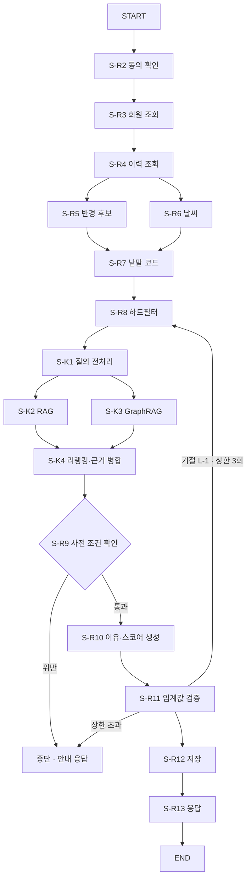

# 개발 프롬프트 — 런치픽 v1 백엔드

> 용도: 아래 `[목표]` ~ `[예시]` 전문을 AI 코딩 도구에 붙여 넣어 백엔드 코드를 생성함  
> 준용: `references/prompt-guide.md`(8섹션 표준) · `references/dev-prompt-guide.md`(dp: 특화 규칙)  
> 채택 기술 모듈: dev-prompt-guide **3.1 · 3.2 · 3.3 · 3.6 · 3.9**  
> 미채택 사유 — 3.4(RAG 인덱서) · 3.5(GraphRAG 인덱서) · 3.7(검색 품질 평가) · 3.8(Web/YouTube 서치)는  
> 검색 구축·평가 담당의 별도 프롬프트 소관이며 백엔드는 완성된 리트리버를 **호출만** 하므로 넣지 않음

> 실행 순서 — ① `gen-data` → ② `index-rag` → ③ `index-graphrag` → ④ `testset-rag` →  
> ⑤ `testset-graphrag` → ⑥ `backend` → ⑦ `frontend`.  
> ⑥ 백엔드는 ③까지 끝나면 ④⑤를 기다리지 않고 시작 가능함(평가는 백엔드를 막지 않음). ⑦ 프론트는 ⑥의 API 경계가 확정된 뒤 시작함

---

## [목표]
런치픽(LunchPick) v1 백엔드를 LangGraph 단일 MAS 워크플로우로 구현하고, 프론트가 호출할 REST API ·
pytest 단위/통합 시험 · README를 `src/v1/` 아래에 산출함.

## [역할]
당신은 백엔드 12년 + LangChain/LangGraph 프로덕션 에이전트 구축 4년 경력의 오케스트레이션 엔지니어임.  
장애 관점에서 그래프를 먼저 의심하며, **상한(몇 번까지) · 타임아웃(몇 초까지) · 착지(넘치면 어디로 가나)**  
세 값이 없는 노드를 하나도 통과시키지 않음.  
전문 용어는 처음 쓸 때 괄호로 쉬운 설명을 1회 붙임(예: 체크포인터 = 대화 중간 저장 장치).

## [맥락]
- 내 상황: 같은 서비스의 v0 구현이 `src/`에 이미 있고 로컬에서 동작을 확인했음. 이번은 **v1**이며
  v0에 없던 RAG(문서 검색) · GraphRAG(관계 검색) 경로를 백엔드가 새로 호출하게 됨
- 대상 서비스: **런치픽 — 직장인 점심 메뉴 추천**. 수도권 오피스 25 ~ 35세 직장인 대상.
  위치 · 취향 · 컨텍스트(날씨 · 요일 · 시간대)를 근거로 **추천 3건 + 추천 이유 문장 + 확신 스코어**를 냄
- 결과물 독자: 이 코드를 받아 로컬에서 띄우고 고칠 백엔드 개발자
- v0에서 이미 드러난 사실을 되풀이하지 않는 것이 이번 v1의 핵심 목적임(`src/README.md` 4절 · 5절)
- 협업 경계 — 아래 담당 밖 영역은 **인터페이스만 가정하고 직접 만들지 않음**

| 영역 | 담당 | 백엔드가 하는 일 |
|------|------|-----------------|
| RAG · GraphRAG 인덱싱 · 리트리버 구현 · 검색 평가 | 별도 프롬프트 | 완성된 리트리버 함수를 **호출**하고 실패를 처리함 |
| 합성 데이터 생성 · 평가 테스트셋 | 별도 프롬프트 | 생성된 데이터를 읽기만 함 |
| 프론트엔드(React + Vite + TypeScript) | 별도 프롬프트 | 프론트가 부를 **API 경계만** 정의하고 코드는 만들지 않음 |

## [입력]
아래 순서대로 읽고, 뒤 항목이 앞 항목과 충돌하면 **앞 항목을 따름**.

1. `references/prompt-guide.md` — 프롬프트 8섹션 표준. 문서 작성 규칙의 최상위 근거
2. `references/dev-prompt-guide.md` — dp: 특화 규칙. 3.1 · 3.2 · 3.3 · 3.6 · 3.9절 `[고정]` · `[기준]` 전문
3. `src/README.md` — v0 실행 결과. **4절(설계와 실제가 어긋난 값 4건)과 5절(구현하며 고친 것 6건)이
   이 프롬프트의 사실 근거임**. 특히 `S-R10` 배정 900ms ↔ 실측 약 5,000ms 어긋남
4. v0 실제 구조 — 무엇을 계승하고 무엇을 새로 만드는지 판단하는 근거
   - `src/recommend/app/graph/state.py` — 상태 스키마 23종과 Reducer(누적 규칙) 지정 방식
   - `src/recommend/app/graph/recommend_graph.py` — `S-R1` ~ `S-R13` 노드와 고정 간선
   - `src/recommend/app/agents/` · `connectors/` · `guardrails/` — 에이전트 · 커넥터 · 입력 검사
   - `src/common/lp_common/` — `budget.py`(단계별 예산) · `config.py`(환경변수) · `guardrails.py` ·
     `masking.py` · `observability.py` · `output_check.py`
   - `src/gateway/app/main.py` · `src/recommend/app/main.py` — v0 API 경계
5. `textbook/script/*.md` — 이 저장소의 교재 원고(dev-prompt-guide 2절 `[입력]`이 요구하는 "관련 교재").
   앞단 아젠다만 보고 개발에 필요한 정보만 추출함. `03-flonie.md`(시퀀스 · 상한 · 실패 착지)를 우선함
6. **context7 MCP** — LangChain · LangGraph는 버전별 API 변화가 크므로 아래를 코드 작성 **직전에** 확인함
   - `StateGraph` 조립 · Reducer · 조건부 간선 · `recursion_limit`
   - 체크포인터(`InMemorySaver` / `SqliteSaver`) 임포트 경로와 `thread_id` 전달 방식
   - `create_agent`의 `response_format` · `middleware` · 도구 오류 처리
   - 모델 클라이언트(Groq) 초기화 파라미터명
7. 지식 검색 인터페이스(별도 프롬프트 산출물, **읽기 전용**)
   - RAG 리트리버: `src/v1/rag/retriever`
   - GraphRAG 리트리버: `src/v1/kg/retriever`

## [처리]

### 0. 시작 전 사용자 확인 — 답을 받기 전에는 코드를 만들지 않음

아래 3건은 **반드시 사용자에게 물음**. 사용자가 "기본값으로 진행"이라고 하면 되묻지 않고 진행함.

- **0-1. 코드 base directory** — 기본값 `src/v1/` 을 제시함. 사용자가 다른 값을 주면
  이 프롬프트의 **모든 산출 경로 접두를 그 값으로 바꿈**
- **0-2. 세션 체크포인터**(체크포인터 = 대화 중간 저장 장치) — `MemorySaver`(메모리에만 저장, 프로세스가
  꺼지면 사라짐)와 `SqliteSaver`(로컬 파일에 저장, 재기동 후에도 남음) 중 무엇을 쓸지 물음.
  기본값 제시는 `SqliteSaver`(재개 시나리오를 실제로 확인해야 하므로)
- **0-3. 지식 경로 분기 규칙** — 질문 유형별로 RAG · GraphRAG 중 무엇을 부를지의 판정표는
  검색 담당 산출물에 속함. 표를 받기 전 기본값은 **둘 다 병렬 호출 후 리랭킹으로 합침**이며,
  판정표를 받으면 설정 파일로 교체 가능하게 둠. 이 기본값을 쓸지 사용자에게 확인함

### 1. 상태(State) 설계

- LangGraph `StateGraph`의 State로 노드 간 데이터를 공유함. 전역 변수 · 모듈 변수로 값을 넘기지 않음
- **필드마다 갱신 주체를 1개만 둠.** 두 노드가 같은 필드에 쓰면 병렬 구간에서 값이 조용히 덮임
- 누적이 필요한 필드에만 Reducer(합치는 규칙)를 붙임. v0의 `Annotated[list[str], operator.add]` ·
  카운터 병합 함수 방식을 계승함
- v0 `RecommendState` 23종을 계승하고, v1 신설 필드를 아래 표대로 추가함

| 신설 필드 | 형 | 갱신 주체 | 뜻 |
|-----------|----|-----------|-----|
| `query_plan` | `dict` | `S-K1` | 검색에 넘길 질의와 적용한 전처리 기법 목록 |
| `rag_hits` | `list[dict]` | `S-K2` | RAG 리트리버 결과(문서 근거) |
| `kg_hits` | `list[dict]` | `S-K3` | GraphRAG 리트리버 결과(관계 근거) |
| `evidence` | `list[dict]` | `S-K4` | 리랭킹 후 LLM에 넘길 최종 근거 묶음 |
| `retrieval_status` | `str` | `S-K4` | `ok` / `partial` / `skipped` — 검색이 비어도 추천은 계속함 |
| `tool_iter_count` | `dict[str,int]` | ReAct 노드 | 도구 반복 횟수(누적 Reducer) |

- `S-K2`(RAG)와 `S-K3`(GraphRAG)는 병렬이므로 **서로 다른 필드에만** 씀

### 2. 그래프 토폴로지 — v0 계승 + v1 신설

- v0의 `S-R1` ~ `S-R13` 동기 요청 시퀀스를 계승함. **`S-R8`(하드필터) → `S-R9`(사전 조건 확인) →
  `S-R10`(LLM 호출) 고정 간선을 깨지 않음** — 순서가 곧 안전 규칙임
- 지식 검색 노드 `S-K1` ~ `S-K4`를 **`S-R8`과 `S-R9` 사이**에 넣음. 하드필터를 통과한 후보에만
  검색을 걸어야 탈락한 식당이 근거로 되살아나지 않음
- `S-R9` 게이트에 **v1 신설 검사 1건**을 추가함 — `evidence`의 식당 식별자가 `candidates`의
  부분집합인지 확인하고, 아니면 즉시 중단하고 `EVIDENCE_OUT_OF_SCOPE`로 착지함

| 노드 | 하는 일 | 병렬 | 착지(실패 시) |
|------|---------|------|--------------|
| `S-R2` | 요청 시점 동의 상태 확인 | | `CONSENT_REQUIRED` 안내 응답 |
| `S-R3` · `S-R4` | 회원 · 취향 · 식이제한 · 이력 조회 | | 오류 착지 |
| `S-R5` ∥ `S-R6` | 반경 후보 캐시 조회 ∥ 날씨 조회 | ○ | 날씨 실패는 태그에서 빼고 계속함 |
| `S-R7` | 낱말 코드 고정(용어사전) | | 미해결 낱말을 상태에 기록하고 계속함 |
| `S-R8` | 하드필터 · 순위 계산 | | 후보 0건이면 `no_candidate` 표시 |
| `S-K1` | 질의 조립 · 전처리 기법 선택 | | 전처리 실패 시 원문 질의로 계속함 |
| `S-K2` ∥ `S-K3` | RAG 리트리버 ∥ GraphRAG 리트리버 호출 | ○ | 한쪽 실패는 `partial`, 양쪽 실패는 `skipped` |
| `S-K4` | Cohere 리랭킹 · 근거 병합 | | 리랭킹 실패 시 원 순서 유지 후 `partial` |
| `S-R9` | 사전 조건 확인(필터 적용 · 근거 범위) | | 위반 시 **폴백 없이 중단** |
| `S-R10` | 추천 이유 · 확신 스코어 생성(LLM) | | 실패 시 기본 근거 문구 폴백 |
| `S-R11` | 확신 스코어 임계값 검증 | | 미달 시 남은 후보로 3건을 채움 |
| `S-R12` · `S-R13` | 이력 · 근거 저장 → 응답 직렬화 | | 저장 실패는 기록 후 응답은 살림 |

- 루프 2종을 조건부 간선으로 둠 — `L-1` 개별 거절 후 대체(→ `S-R8` 복귀) · `L-2` 전체 새로고침
- **모든 루프에 상한을 둠.** 상한 초과 시 루프를 더 돌지 않고 안내 응답으로 착지함
- 그래프 전체에 `recursion_limit`(그래프가 밟을 수 있는 최대 단계 수)을 설정으로 넘기고,
  초과 시 나는 오류를 잡아 안내 응답으로 착지함. 잡지 않고 500으로 흘리지 않음

### 3. 노드 계약 — 예외 없는 3종 규칙

모든 노드는 아래 3개를 코드에 명시함. 하나라도 없으면 그 노드는 미완성으로 봄.

- **타임아웃** — 외부 호출(DB · 리트리버 · LLM · 커넥터)은 예외 없이 타임아웃을 걺
- **재시도** — 대상 오류 유형 · 횟수 · 백오프(다시 걸기까지 기다리는 방식)를 표로 명시함
- **착지** — 재시도 · 상한을 다 쓰면 어디로 가는지(폴백 노드 · 안내 응답 · 중단) 1곳을 지정함

재시도 정책 표를 README에 아래 형식으로 실음.

| 노드 | 실패 유형 | 재시도 | 백오프 | 초과 시 |
|------|-----------|--------|--------|---------|
| `S-K2` | 리트리버 타임아웃 | 1회 | 1s | `rag_hits` 빈 값 + `partial` 기록 후 계속 |
| `S-R10` | 429(속도 제한) | 2회 | 지수 백오프 | 기본 근거 문구 폴백 |
| `S-R10` | 4xx(입력 오류) | 0회 | - | 오류를 상태에 기록하고 폴백 |

### 4. LLM 설정(dev-prompt-guide 3.2 `[고정]`)

- **Groq LPU · 모델 `openai/gpt-oss-120b`** 를 씀. temperature 0(같은 입력에 같은 출력) ·
  타임아웃 30초 · 429 응답 시 지수 백오프 재시도 2회
- **v0는 다른 모델을 썼으므로 v0의 지연 실측치(약 5,000ms)를 그대로 옮겨 적지 않음.**
  v1에서 다시 측정하고, 측정 전에는 값을 비워 두거나 `[미측정]`으로 표기함
- 프롬프트는 **시스템 프롬프트와 유저 프롬프트를 파일 · 함수 단위로 분리**함. 한 문자열에 섞지 않음
- 출력은 **Output Parser를 쓰지 않고 Structured Output**(스키마를 정해 놓고 그 모양으로 받는 방식)으로 받음.
  추천 3건 각각의 `restaurant_id` · `reason_text` · `confidence` · `context_tags`를 스키마로 고정함
- 멀티 LLM(Claude · OpenAI · Gemini) 연동은 이번 요청에 없으므로 넣지 않음

### 5. LCEL 실행 방식 선택(dev-prompt-guide 3.1 `[기준]`)

조건 → 선택 규칙을 그대로 적용하고, **선택 결과와 근거를 README에 기록**함.

| 조건 | 선택 | v1 적용 위치 |
|------|------|-------------|
| UI 스트리밍 + 병렬 도구 호출 | 비동기 스트리밍 `astream` | 동기 추천 요청 경로(`S-K2` ∥ `S-K3` 병렬 + 이유 문장 점진 표시) |
| UI 스트리밍만 필요 | 동기 스트리밍 `stream` | 해당 없음 |
| 배치 · 백그라운드 처리 | 비동기 `ainvoke` | 일 배치 · 캐시 동기화 워커 |
| 단발 검증 · 스크립트 | 동기 `invoke` | pytest 단위 시험 · 점검 스크립트 |

### 6. 도구 호출 · ReAct 루프(dev-prompt-guide 3.3 `[고정]`)

- 도구를 골라 부르는 자리는 `create_agent` 함수로 ReAct 루프를 구현함
- **최대 반복 상한 기본 7회**. 환경변수 `LP_TOOL_MAX_ITER`로 덮을 수 있게 하고 기본값을 코드에 밝힘
- 도구 실패 시 예외를 밖으로 던지지 않고 **observation(관찰 결과)으로 되돌려** 모델이 다시 시도하게 함
- 상한 초과 시 루프를 종료하고, 그때까지 모은 결과와 초과 사실을 함께 보고함(조용히 끝내지 않음)
- 도구 반복 횟수를 `tool_iter_count`에 계층별로 나눠 셈

### 7. 검색 질의 전처리 · 후처리(dev-prompt-guide 3.6)

`S-K1`에서 조건에 해당하는 기법만 골라 조합함. 조건 → 선택 규칙은 아래 그대로임.

| 조건 | 적용 기법 |
|------|-----------|
| 질의가 짧거나 모호함 | Query Rewriting(질의를 다시 씀) |
| 여러 각도에서 찾아야 함 | Multi Query(질의를 여러 개로 늘림) |
| 질의와 문서의 낱말이 어긋남 | HyDE(가상의 답변을 만들어 그것으로 찾음) |
| 추상 개념 질의임 | Step-back(한 단계 넓은 질문으로 바꿔 찾음) |

- 후처리는 **Cohere 리랭킹 모델 고정**. API Key는 `.env`의 `COHERE_API_KEY`를 씀
- 적용한 기법 목록을 `query_plan`에 남겨 관측 기록에서 확인 가능하게 함
- 리랭킹 호출에도 타임아웃 · 재시도 · 착지 3종을 붙임

### 8. API 경계 — 프론트(React + Vite + TypeScript)가 부를 자리

프론트 코드는 만들지 않음. **요청 · 응답 스키마만** 정의하고 서버에서 구현함.

| 메서드 · 경로 | 요청 | 응답 | 실행 방식 |
|--------------|------|------|----------|
| `POST /v1/recommendations` | 회원 식별자 · 좌표 · 요청 시각 · 지역 코드 | 추천 3건 + 이유 + 스코어 + `trace_id` | `astream`(SSE) |
| `POST /v1/recommendations/reject` | 추천 식별자 · 거절 식당 · 요청 시각 | 대체 1건 | `astream` |
| `POST /v1/recommendations/refresh` | 추천 식별자 · 요청 시각 | 추천 3건 재생성 | `astream` |
| `POST /v1/feedback` | 추천 식별자 · 만족 여부 | 접수 결과 | `ainvoke` |
| `GET /health` | - | 서비스 · 의존성 상태 | 동기 |

- 요청 · 응답 모델은 Structured Output 스키마와 **같은 형 정의를 공유**함(두 벌로 갈라지지 않게 함)
- 루프 재실행 경로(`reject` · `refresh`)는 **요청 시각을 반드시 함께 받음**. 서버가 현재 시각으로
  다시 계산하면 영업 시간 필터가 다르게 걸려 후보가 통째로 사라짐(v0에서 실제로 난 사고임)
- 오류 응답은 코드 · 사람이 읽을 메시지 · `trace_id` 3종을 항상 담음

### 9. 지속성 · 재개

- 체크포인터는 0-2에서 사용자가 고른 것을 씀. 선택 결과와 근거를 README에 기록함
- `thread_id`(대화 · 세션을 구분하는 열쇠)는 `{회원 식별자}:{요청 일자}:{추천 세션 식별자}` 형식으로 만듦
- 재개 시나리오 2건을 README에 절차로 적고, 그중 1건은 실제로 돌려 로그를 남김
  - 시나리오 A — `S-R10` 도중 프로세스가 죽음 → 같은 `thread_id`로 다시 부르면 저장된 지점부터 이어감
  - 시나리오 B — `L-1` 개별 거절 루프 중 앞선 검색 결과를 다시 쓰는 경우

### 10. 가드레일 · 관측 · 개인정보

- **가드레일 규칙은 공용 모듈 1벌**(`{base}/app/common/`)로 둠. 요청 경로와 배치 경로가 각각 자기 규칙을
  들고 있으면 조용히 갈라짐(v0에서 실제로 난 문제임)
- 막는 지점은 입구 · 도구 · 출구 3곳임. 외부에서 온 글은 **데이터로만 다루고 지시로 실행하지 않음**
- 관측 기록에 요청 식별자 · 단계 이름 · 지연 · 토큰 수 · 실패 사유 · 폴백 여부 · 적용 전처리 기법을 남김
- 개인정보 접근 기록은 **주체 · 시각 · 항목 종류만 남기고 값은 남기지 않음**
- 저장소 계정을 조회 전용 · 쓰기 · 관측 쓰기 전용 3종으로 나눔. 업무 계정이 관측 기록을 고치지 못하게 함

### 11. 값 규정 — 지어낸 숫자가 코드에 굳지 않게 함

- 단계별 타임아웃 · 재시도 값은 **전부 환경변수로 빼고 기본값을 코드에 밝힘**
- 설계값과 실측값을 **나란히 기록**함. 실측이 설계값과 어긋나면 어긋난 사실을 그대로 남기고,
  기동 로그와 관측 기록에 덮어썼다는 사실을 남김
- 원문에 값이 없어 임시로 채운 항목은 아래 형식의 표로 README에 모음

| 항목 | 기본값 | 환경변수 | 근거 |
|------|--------|----------|------|
| 개별 거절 반복 상한 | 3 | `LP_MAX_REJECT_ITER` | 원문 부재 — 임시값 |
| 전체 새로고침 상한 | 2 | `LP_MAX_REFRESH_ITER` | 원문 부재 — 임시값 |
| 확신 스코어 임계값 | 0.35 | `LP_CONFIDENCE_THRESHOLD` | 원문 부재 — 임시값 |
| 도구 반복 상한 | 7 | `LP_TOOL_MAX_ITER` | dev-prompt-guide 3.3 `[고정]` |
| 그래프 단계 상한 | 50 | `LP_RECURSION_LIMIT` | 루프 2종 + 노드 수에서 산정 |

### 12. 기술적 요구사항

- API Key는 전부 `.env` 파일을 참조함. 소스 · 설정 파일 · 로그에 평문으로 적지 않음
- **Config와 소스를 분리**함. 설정은 `{base}/app/common/config.py` 한 곳에서 환경변수를 읽어 넘김
- 의존성은 `requirements.txt`에 정의함. 공통은 `{base}/requirements.txt`,
  서비스별 추가분은 `{base}/app/{service}/requirements.txt`에서 `-r`로 공통을 참조함
- 라이브러리 임포트 경로 · 함수 시그니처는 **context7 MCP로 확인한 뒤** 적음

### 13. 시험 및 버그 수정

- 프레임워크는 **pytest**. 모듈별 단위 시험을 작성함
- 외부 API 호출(LLM · 리트리버 · 지도 · 날씨 · 푸시)은 **Mock/fixture로 대체**함
- 실제 호출이 필요한 시험은 `integration` 마커로 분리해 기본 실행에서 빠지게 함
- 아래 6건은 반드시 시험으로 고정함
  1. 하드필터가 LLM 호출보다 먼저 실행되는 순서
  2. 근거(`evidence`)가 하드필터 통과 후보 밖으로 나가면 중단됨
  3. 루프 상한 초과 시 안내 응답으로 착지함(무한 루프가 아님)
  4. 리트리버 실패 시 추천이 죽지 않고 `partial`로 계속됨
  5. 확신 스코어 미달 후에도 추천 3건이 채워짐
  6. 같은 `thread_id`로 다시 부르면 저장 지점부터 재개됨
- 시험을 통과시키려고 타임아웃 · 상한 값을 임의로 낮추지 않음

### 14. README.md 작성

`{base}/README.md`에 아래를 순서대로 담음.

- 개요 — 목적과 주요 기능
- 가상환경 설정 및 실행 — **Windows GitBash · Windows PowerShell · Linux/Mac 3환경별 명령어**를 각각 적음
- Graph 구성 가시화 — **Mermaid 스크립트**로 노드 · 간선 · 병렬 구간 · 루프 · 착지를 그림
- 디렉토리 구조와 주요 소스 설명
- 선택 기록 — 체크포인터 선택과 근거 · LCEL 실행 방식 선택과 근거 · 검색 전처리 기법 선택과 근거
- 제어 정책 표 — 노드별 타임아웃 · 재시도 · 백오프 · 착지
- 값 표 — 환경변수 · 기본값 · 설계값 대비 실측값
- 프론트엔드는 별도 산출물이므로 실행 명령을 적지 않고 API 경계만 안내함

- 톤앤매너: 어려운 용어는 처음 나올 때 괄호로 한 줄 쉬운 설명을 붙임
- 작성 규칙
  - 코드 주석 · 문서는 한국어. 문서는 명사체(`~함` / `~임`), 한 줄 120자 이내
  - 값 · 임계값을 코드에 직접 박지 않고 설정으로 뺌
  - 실행 · 확인하지 않은 것을 "동작함"이라고 적지 않음

## [출력]

- 백엔드 소스 — `src/v1/app/gateway/` · `src/v1/app/recommend/` · `src/v1/app/member/` ·
  `src/v1/app/scheduled/` · `src/v1/app/common/`
- 그래프 · 상태 — `src/v1/app/recommend/graph/state.py` · `src/v1/app/recommend/graph/recommend_graph.py`
- 리트리버 호출부 — `src/v1/app/recommend/retrievers/`
  (검색 모듈 자체는 `src/v1/rag/retriever` · `src/v1/kg/retriever`이며 **만들지 않고 가져다 씀**)
- 시험 — `src/v1/tests/`
- 의존성 — `src/v1/requirements.txt` · `src/v1/app/{service}/requirements.txt`
- 환경변수 예시 — `src/v1/.env.example`(실제 키 값은 넣지 않음)
- 문서 — `src/v1/README.md`
- 프론트엔드 `src/v1/front/` 는 **이 산출물의 범위 밖임**(별도 프롬프트 소관)
- 사용자가 0-1에서 다른 base directory를 지정하면 위 경로의 `src/v1/` 접두를 그 값으로 바꿈

## [제약조건]

- MUST
  - 프롬프트 작성 가이드(`references/prompt-guide.md`)를 준용함
  - 반드시 **context7 MCP**로 LangChain · LangGraph · 모델 클라이언트의 최신 문법을 확인한 뒤 코드를 적음
  - 반드시 의존성을 `requirements.txt`에 정의함
  - README의 가상환경 활성화 명령을 **Windows GitBash · Windows PowerShell · Linux/Mac** 3환경으로 안내함
  - 모든 루프에 상한값을, 모든 외부 호출에 타임아웃 · 재시도 · 착지를 명시함
  - 추가 정보나 의사결정이 필요하면 **반드시 사용자에게 문의**함(0절 3건 포함)
  - 실행하지 않은 코드는 "미검증"이라고 밝힘
- MUST NOT
  - 추측하여 생성하지 않음. 데이터와 입력 자료에 기반해 수행함
  - 근거 없는 성능 수치를 적지 않음. 측정 전에는 `[미측정]`으로 남김
  - **시험을 통과시키려고 타임아웃 · 상한 값을 임의로 낮추지 않음**
  - RAG · GraphRAG 인덱서 · 리트리버 · 검색 평가 코드를 직접 만들지 않음(호출만 함)
  - 프론트엔드 코드를 만들지 않음
  - 가드레일 규칙을 경로별로 두 벌 만들지 않음
- 완료조건 — 아래 3종 증거를 모두 제시해야 완료로 봄
  1. **산출 경로의 파일 목록** — 위 `[출력]` 경로별 실제 생성 파일 목록
  2. **pytest 실행 로그(실패 0건)** — `integration` 마커 제외 기준. 실패가 있으면 실패 사실을 그대로 보고함
  3. **샘플 질의 최소 3건의 요청 → 응답 로그** — 정상 1건 · 리트리버 실패 폴백 1건 ·
     루프 상한 초과 착지 1건. 각 로그에 `trace_id`와 단계별 지연이 보여야 함

## [예시]

(그래프 토폴로지 — README에 실을 Mermaid 형식)



(사용자 문의 문구 — 0절에서 그대로 씀)

```text
시작 전 3가지를 확인함.
1) 코드 base directory — 기본값 `src/v1/` 로 진행할까요?
2) 세션 체크포인터 — `MemorySaver`(메모리, 재기동 시 소멸)와 `SqliteSaver`(로컬 파일, 재기동 후 유지)
   중 무엇으로 할까요? 기본값 제시는 `SqliteSaver`임
3) 지식 경로 분기 — 판정표를 받기 전까지 RAG·GraphRAG를 둘 다 병렬 호출 후 합치는 기본값으로 갈까요?
```

(노드 계약 표기 — 모든 노드에 이 3종이 있어야 함)

| 노드 | 타임아웃 | 재시도 | 백오프 | 착지 |
|------|---------|--------|--------|------|
| `S-K3` | 2,000ms | 1회 | 1s | `kg_hits` 빈 값 · `retrieval_status=partial` 후 계속 |
| `S-R10` | 환경변수(기본 설계값) | 429만 2회 | 지수 백오프 | 기본 근거 문구 폴백 · 폴백 사유 기록 |

(잘못된 예 — 아래는 통과시키지 않음)

```text
retriever.search(query)            # 타임아웃 없음 → 통과 불가
while not done: ...                # 상한 없음 → 통과 불가
except Exception: pass             # 착지 없음 → 통과 불가
```
