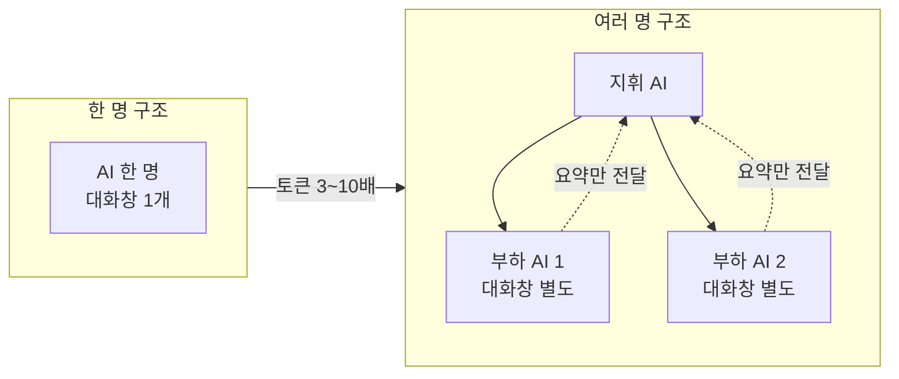
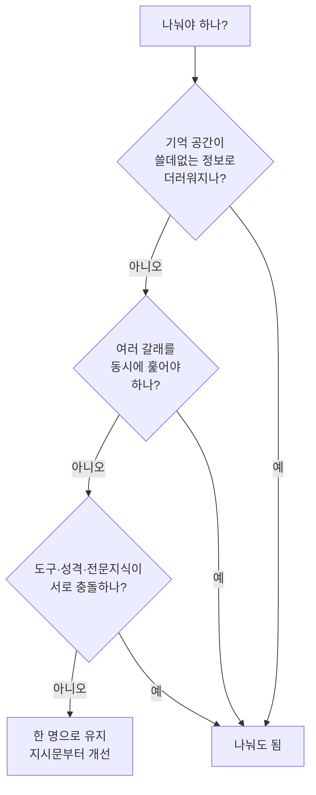
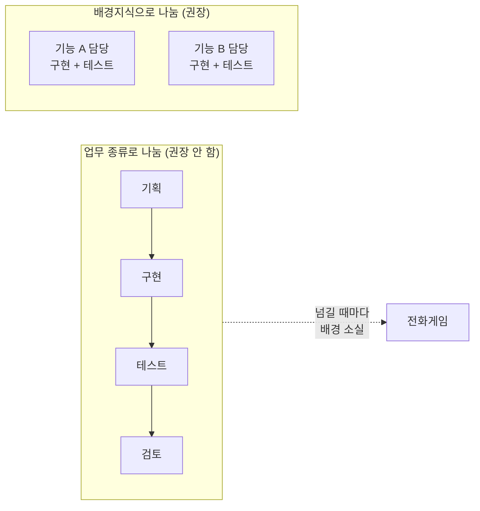
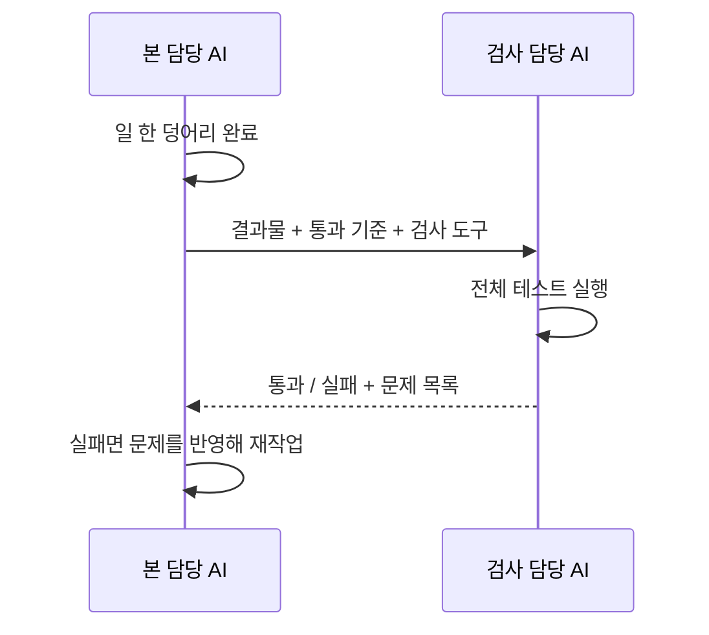

# A01 멀티에이전트 시스템: 언제 어떻게 쓸 것인가 — 쉬운 해설

## 한 줄 요약

이 글이 답하는 질문은 하나입니다.  
"AI 담당자를 여러 명으로 나눌까, 한 명으로 갈까?"  
답은 이렇습니다. 기본은 한 명이고, 딱 세 가지 상황에서만 나눕니다.

## 3분 요약

- AI 담당자 한 명(단일 에이전트)으로 시작하세요.  
  사람들이 생각하는 것보다 훨씬 많은 일을 해냅니다.
- 여러 명으로 나누면 비용이 확 뜁니다.  
  같은 일에 토큰을 3 ~ 10배 더 씁니다.
- 나눠서 이득인 상황은 세 가지뿐입니다.  
  기억 공간 오염, 동시 처리, 전문화입니다.
- 나눌 때는 "업무 종류"로 나누지 마세요.  
  "필요한 배경지식"이 다를 때만 나눕니다.
- 가장 잘 통하는 구성은 검사 담당을 따로 두는 것입니다.  
  단, 대충 통과시키지 않게 지시를 아주 구체적으로 써야 합니다.

## 왜 우리에게 중요한가

우리 교육은 팀마다 AI 담당자 여러 명을 설계하는 실습을 합니다.  
그런데 실습에서 가장 흔한 실수가 여기 다 나옵니다.  
"기획 담당 · 구현 담당 · 검토 담당"으로 나누는 방식입니다.  
이 글은 그 방식이 왜 실패하는지를 정면으로 설명합니다.  
또 나눌지 말지를 판단하는 기준을 세 가지로 딱 줄여 줍니다.  
그래서 설계를 시작하기 전에 먼저 읽어야 하는 글입니다.  
(해설자 보충) 우리 교육 케이스인 마이데이터 금융상품 추천도 같습니다.  
"추천 담당 · 설명 담당"으로 나누면 이 글이 말하는 실패에 그대로 빠집니다.

## 본문 풀이

### 1. 멀티에이전트가 뭔가요 — What is a multi-agent system?

여러 개의 AI가 각자 따로 대화창을 갖고 일하는 구조입니다.  
그리고 그 AI들을 코드가 지휘합니다.  
한 명은 계획을 세우고, 다른 한 명은 조사를 합니다.

지휘 방식에는 여러 종류가 있습니다.  
이 글은 그중 하나만 다룹니다.  
대장 AI가 부하 AI를 불러 쓰는 방식입니다.  
원문은 이걸 `orchestrator-subagent`라고 부릅니다.  
우리말로는 "지휘자와 부하 담당" 구조입니다.  
가장 단순해서 처음 배우기 좋다고 말합니다.

여기서 중요한 경고가 나옵니다.  
지금은 한 명으로 충분한 일을 여러 명으로 나누는 경우가 많다는 것입니다.  
실제로 몇 달 걸려 복잡한 구조를 만든 팀들이 있었습니다.  
그런데 한 명짜리 AI의 지시문만 고쳐도 같은 결과가 나왔습니다.

### 2. 일단 한 명으로 시작하세요 — The case for starting with a single agent

AI를 한 명 늘릴 때마다 세 가지가 같이 늘어납니다.  
고장 날 지점, 관리할 지시문, 예상 못 한 행동입니다.

원문은 실제로 본 실패 사례를 듭니다.  
기획 · 실행 · 검토 · 반복을 각각 다른 AI에게 맡긴 팀들입니다.  
일을 넘길 때마다 앞 상황을 잊어버렸습니다.  
결국 일하는 데 쓴 토큰보다 서로 말 맞추는 데 쓴 토큰이 더 많았습니다.

숫자로도 나옵니다.  
같은 일을 시켰을 때 여러 명 구조는 토큰을 3 ~ 10배 더 씁니다.  
이유는 세 가지입니다.  
같은 배경 설명을 여러 번 복사하고, 서로 연락을 주고받고, 넘길 때마다 요약합니다.

### 3. 나눌지 판단하는 세 가지 기준 — A decision framework for multi-agent systems

원문은 나눠서 이득인 상황을 딱 세 가지로 좁힙니다.  
이 셋 밖에서는 지휘 비용이 이득보다 큽니다.

#### 3-1. 기억 공간이 더러워질 때 — Context protection

AI가 기억할 수 있는 분량에는 한계가 있습니다.  
그 공간을 컨텍스트 윈도(context window)라고 합니다.  
쓸데없는 정보가 이 공간을 채우면 판단력이 떨어집니다.  
원문은 이걸 컨텍스트 오염(context pollution)이라고 부릅니다.

비유하면 이렇습니다.  
책상 위에 관계없는 서류가 잔뜩 쌓인 상태입니다.  
지금 풀어야 할 문제에 집중이 안 됩니다.

원문의 예시는 고객 상담입니다.  
(해설자 보충) 우리 케이스로 바꾸면 카드사 상담이 딱 맞습니다.  
결제 오류를 진단하려는데 과거 결제 내역 수천 토큰이 딸려 들어옵니다.  
그러면 오류 진단 능력이 떨어집니다.

해법은 조회 담당을 따로 두는 것입니다.  
조회 담당이 긴 내역을 다 읽고 핵심만 뽑습니다.  
본 담당은 정말 필요한 50 ~ 100토큰만 받습니다.

효과가 큰 조건도 알려 줍니다.  
하위 일이 1,000토큰 넘게 만들어 내는데 대부분이 본 일과 무관할 때입니다.

#### 3-2. 동시에 여러 갈래를 훑어야 할 때 — Parallelization

대장 AI가 질문을 여러 갈래로 쪼갭니다.  
부하 AI들이 각 갈래를 동시에 조사합니다.  
그리고 각자 요약해서 돌려줍니다.  
조사와 검색 업무에서 특히 효과가 좋았다고 합니다.

여기서 오해하기 쉬운 부분이 있습니다.  
빨라지려고 하는 게 아닙니다.  
원문은 주된 이득이 "속도가 아니라 꼼꼼함"이라고 못박습니다.  
전체 계산량이 늘어서 총 시간은 오히려 길어질 때가 많습니다.

#### 3-3. 서로 다른 전문가가 필요할 때 — Specialization

전문화는 세 방향으로 나뉩니다.

첫째, 도구 전문화입니다.  
도구가 너무 많으면(보통 20개 넘으면) 골라 쓰지 못합니다.  
신호는 세 가지입니다.  
개수가 너무 많을 때, 분야가 뒤섞여 헷갈릴 때, 도구를 추가하니 기존 일이 나빠질 때입니다.

둘째, 지시문 전문화입니다.  
성격이 정반대인 일을 한 AI에게 맡기면 충돌합니다.  
상담 담당은 공감해야 하고, 코드 검토 담당은 깐깐해야 합니다.  
규정 점검 담당은 규칙을 딱딱 지켜야 하고, 아이디어 담당은 자유로워야 합니다.

셋째, 도메인 전문화입니다.  
법률이나 의료처럼 배경지식이 방대한 분야입니다.  
한 AI에 전부 넣으면 벅찹니다.

원문의 예시는 여러 플랫폼 연동입니다.  
플랫폼마다 API 창구가 10 ~ 15개씩 있습니다.  
도구 40개를 가진 AI 한 명은 비슷한 작업을 자꾸 혼동합니다.  
나눠 주면 선택 오류가 풀립니다.

단, 전문화에는 대가가 있습니다.  
누구에게 넘길지 판단하는 일이 새로 생깁니다.  
잘못 넘기면 결과가 나빠집니다.

### 4. 한 명으로는 벅차다는 신호 — Outgrowing single-agent architectures

구체적인 신호 세 가지를 줍니다.

기억 공간을 늘 꽉 채우고 성능이 떨어지고 있을 때입니다.  
다만 요즘은 대화 내용을 눌러 담는 기술이 좋아져서 이 한계가 줄고 있다고 덧붙입니다.

도구가 15 ~ 20개를 넘을 때입니다.  
그런데 원문은 나누기 전에 다른 방법을 먼저 보라고 합니다.  
필요할 때만 도구를 찾아 쓰는 기능입니다.  
토큰을 최대 85%까지 줄이면서 선택도 정확해진다고 합니다.

일이 자연스럽게 독립된 조각으로 쪼개질 때입니다.

마지막에 단서를 답니다.  
이 숫자들은 모델이 좋아지면 바뀝니다.  
고정된 법칙이 아니라 지금 시점의 눈금일 뿐입니다.

### 5. 나누는 기준이 진짜 중요합니다 — Context-centric decomposition

멀티로 갈 때 가장 중요한 결정입니다.  
그리고 팀들이 가장 자주 틀리는 지점이기도 합니다.

틀린 방식은 "업무 종류"로 나누는 것입니다.  
기능 만드는 AI, 테스트 짜는 AI, 코드 보는 AI로 나누는 식입니다.  
넘길 때마다 배경이 사라집니다.  
테스트 담당은 왜 그렇게 만들었는지 모릅니다.

원문은 이걸 전화게임(telephone game)에 비유합니다.  
말을 옮길 때마다 내용이 조금씩 뭉개지는 놀이입니다.

맞는 방식은 "필요한 배경지식"으로 나누는 것입니다.  
기능을 만든 AI가 그 기능의 테스트도 같이 맡습니다.  
이미 배경을 알고 있기 때문입니다.  
배경을 진짜로 떼어 낼 수 있을 때만 쪼갭니다.

나눠도 좋은 경계 세 가지입니다.  
서로 무관한 조사 갈래, 규격이 확실한 별개 부품, 결과만 보고 판정하는 검사입니다.

나누면 안 되는 경계 세 가지입니다.  
같은 일의 앞뒤 단계, 계속 붙어 있어야 하는 부품, 상태를 자주 맞춰야 하는 일입니다.

### 6. 가장 잘 통하는 구성: 검사 담당 — The verification subagent pattern

한 가지 구성만은 어느 분야에서나 잘 통한다고 합니다.  
본 담당의 결과물을 검사만 하는 AI를 따로 두는 것입니다.

왜 통할까요.  
검사는 원래 넘겨야 할 배경이 거의 없기 때문입니다.  
어떻게 만들었는지 몰라도 결과만 보면 됩니다.  
그래서 전화게임 문제를 비껴갑니다.

다만 단서가 있습니다.  
지휘 AI가 더 똑똑해지면 따로 검사 단계를 안 둬도 됩니다.  
검사 담당은 지휘 AI가 약할 때, 특별한 검사 도구가 필요할 때 여전히 쓸모 있습니다.

#### 6-1. 어떻게 붙이나요 — Implementating a multi-agent system

본 담당이 일을 한 덩어리 끝냅니다.  
그다음 검사 담당을 부릅니다.  
넘겨주는 것은 세 가지입니다.  
검사할 결과물, 통과 기준, 검사에 쓸 도구입니다.  
검사 담당은 "왜 이렇게 만들었나"를 알 필요가 없습니다.

#### 6-2. 어디에 쓰나요 — Multi-agent system applications

효과 좋은 용도 네 가지를 듭니다.  
품질 검사, 규정 준수 점검, 출력 형식 검증, 사실 확인입니다.

#### 6-3. 대충 통과시키는 문제 — The early victory problem

가장 큰 실패 양상입니다.  
검사 담당이 테스트 한두 개만 돌려 보고 "통과!"라고 합니다.

막는 방법 네 가지입니다.  
기준을 구체적으로 씁니다. "잘 되는지 봐"가 아니라 "전체 테스트를 돌리고 실패를 다 보고해"라고 씁니다.  
여러 상황과 예외 경우를 다 확인하게 합니다.  
일부러 실패해야 하는 입력도 넣어 보게 합니다.  
그리고 반드시 지켜야 할 문장을 못박아 둡니다.  
원문은 이 지시가 꼭 필요하다고 강조합니다.

### 7. 결론: 어느 쪽을 고를까 — Choosing between single-agent and multi-agent systems

복잡한 구조를 더하기 전에 세 가지를 확인하라고 합니다.

한 명으로는 못 푸는 진짜 제약이 있는지 봅니다.  
기억 공간 한계, 동시 처리 필요, 전문화 필요 중 하나여야 합니다.

나누는 기준이 업무 종류가 아니라 배경지식인지 봅니다.

배경 없이도 검사할 수 있는 지점이 있는지 봅니다.

그리고 마지막 조언이 이 글 전체를 요약합니다.  
가장 단순한 방법으로 시작하고, 증거가 생겼을 때만 복잡하게 만드세요.

## 그림으로 보기

> 그림 1. 한 명 구조와 여러 명 구조의 차이 — **정리자 작도. 원문에 없는 그림임**

> 그림 2. 나눌지 판단하는 세 관문 — **정리자 작도. 원문에 없는 그림임**

> 그림 3. 잘못된 분해와 올바른 분해 — **정리자 작도. 원문에 없는 그림임**

> 그림 4. 검사 담당을 붙이는 흐름 — **정리자 작도. 원문에 없는 그림임**

## 용어 풀이

| 용어 | 우리말 | 한 줄 설명 |
|------|--------|-----------|
| multi-agent system | 멀티에이전트 시스템 | 여러 AI가 각자 대화창을 갖고 일하고, 코드가 그들을 지휘하는 구조 |
| orchestrator-subagent | 지휘자와 부하 담당 | 대장 AI가 부하 AI를 만들어 일을 시키고 결과를 받는 방식 |
| subagent | 부하 담당 AI | 특정 하위 일만 맡아 처리하고 요약해서 돌려주는 AI |
| context window | 기억 공간 | AI가 한 번에 기억할 수 있는 글의 분량 한계 |
| context pollution | 기억 공간 오염 | 지금 일과 무관한 정보가 기억 공간을 채워 판단력이 떨어지는 현상 |
| token | 토큰 | AI가 글을 세는 단위. 비용과 기억 분량이 이 단위로 계산됨 |
| parallelization | 동시 처리 | 여러 AI가 각 갈래를 동시에 조사해 넓게 훑는 방식 |
| specialization | 전문화 | 도구·지시문·배경지식을 갈라서 AI마다 전담 영역을 주는 것 |
| telephone game | 전화게임 | 말을 옮길 때마다 내용이 조금씩 뭉개지는 현상 |
| verification subagent | 검사 담당 AI | 본 담당의 결과물을 검사만 하는 별도 AI |
| API | 외부 연결 창구 | 다른 시스템의 기능을 불러 쓰기 위한 규격화된 접속 지점 |

## 헷갈리기 쉬운 곳

- "여러 명으로 나누면 빨라진다"는 오해입니다.  
  원문은 주된 이득이 꼼꼼함이라고 못박습니다.  
  전체 계산량이 늘어서 총 시간은 오히려 길어질 때가 많습니다.
- "복잡한 일이니까 나눠야 한다"도 오해입니다.  
  기준은 복잡도가 아니라 세 가지 상황에 해당하는지입니다.
- "기획 · 구현 · 검토로 나누면 깔끔하다"는 함정입니다.  
  이 글이 정확히 그 방식을 실패 사례로 듭니다.
- 숫자를 법칙으로 오해하면 안 됩니다.  
  도구 20개, 15 ~ 20개 같은 값은 2026년 1월 기준 눈금입니다.  
  원문 스스로 모델이 좋아지면 바뀐다고 적었습니다.
- 토큰 3 ~ 10배는 공개 실험 결과가 아닙니다.  
  (해설자 보충) Anthropic이 자체 테스트로 관찰한 값이며, 표본과 방법은 원문에 없습니다.

## 원문 정보와 확인 범위

- 원문 제목: Building multi-agent systems: When and how to use them
- URL: `https://claude.com/blog/building-multi-agent-systems-when-and-how-to-use-them`
- 발행일: 2026년 1월 23일 (원문 본문에 표기됨). 읽는 시간 5분으로 표기됨
- 발행 주체: Anthropic 기술 블로그. 집필자 표기 있음
- 접근 수단: `curl` 명령으로 웹페이지를 통째로 내려받은 뒤, 꾸밈 요소를 걷어 내고 본문 글자만 뽑아 읽음.  
  브라우저 도구(Playwright)는 쓰지 않았습니다. 첫 시도로 본문 전체가 확보됐기 때문입니다
- 확인 상태: FULL (본문 전체를 읽음)
- 못 본 것: 본문이 아닌 부분만 못 봤습니다.  
  사이트 메뉴, 다른 글 추천 목록, 뉴스레터 신청 칸, 쿠키 안내입니다
- 그림 관련: 원문에는 설명용 그림이 하나도 없습니다.  
  글 안의 이미지 8개는 전부 장식용이라 쓰지 않았습니다.  
  그래서 이 문서의 그림 4개는 모두 정리자가 직접 그렸습니다
- 정리본: A01_blog_anthropic-when-multi-agent.md
