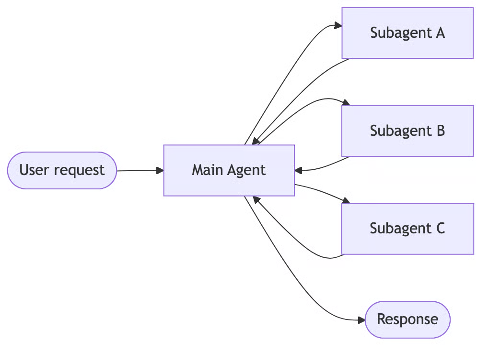
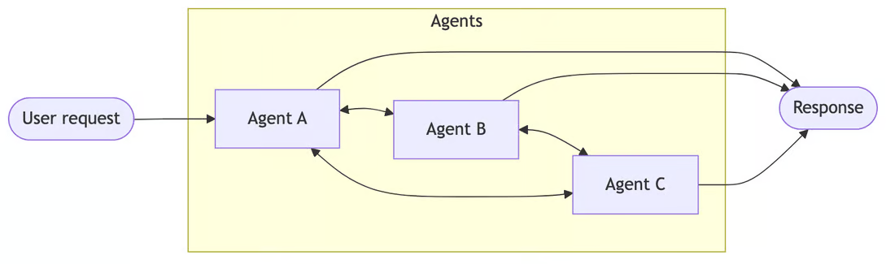
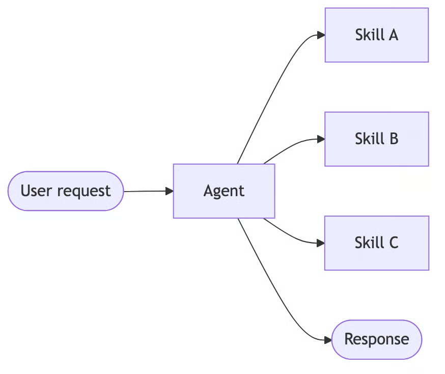
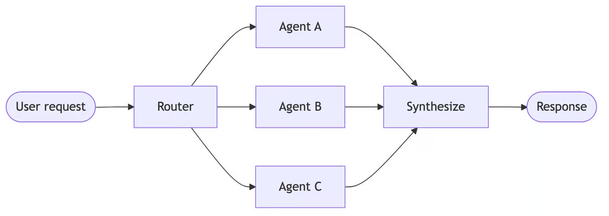
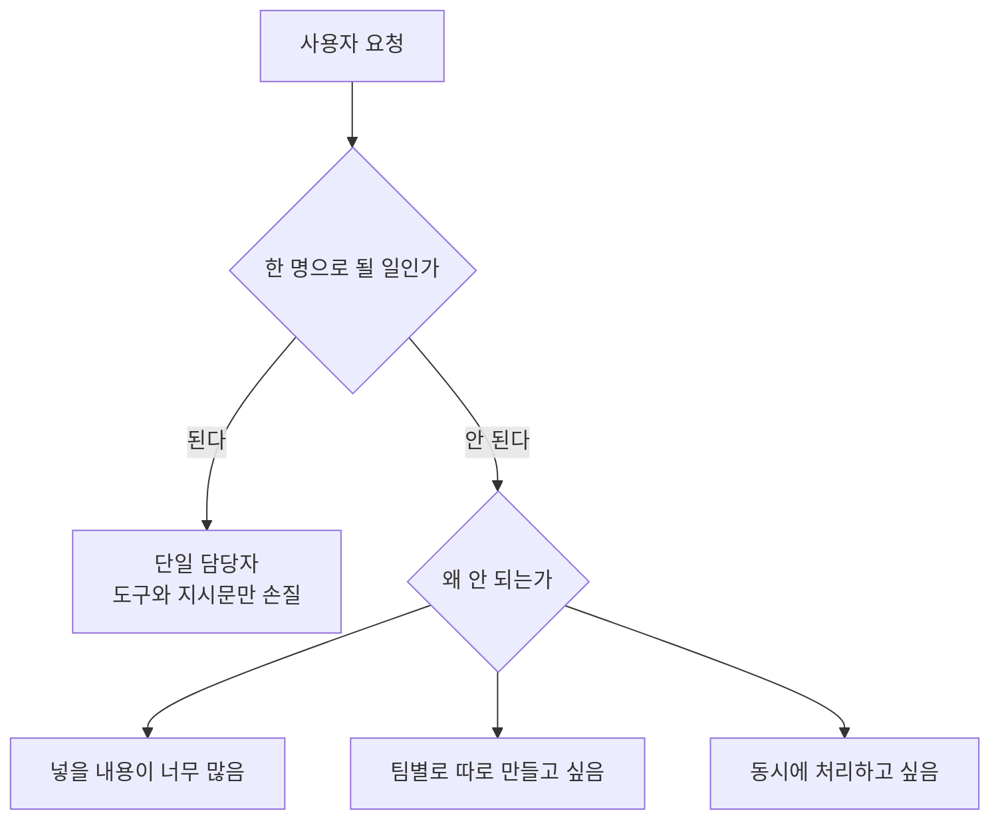
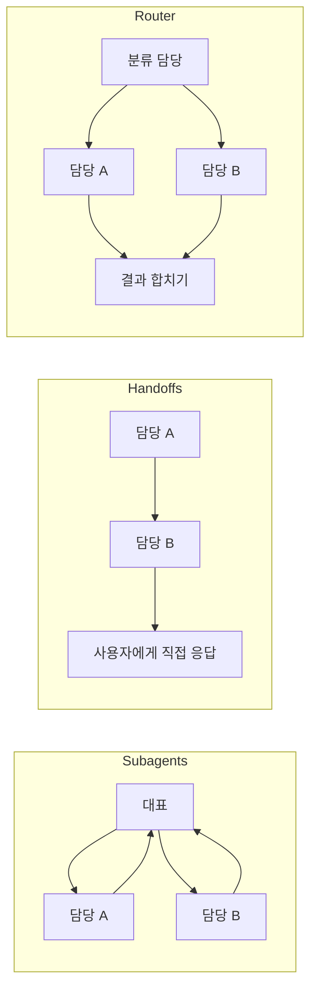
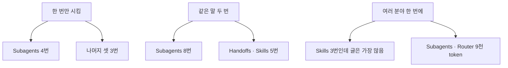

# A02 LangChain 멀티에이전트 문서 — 쉬운 해설

## 한 줄 요약

AI 담당자를 여러 명으로 나눌 때, 어떤 방식으로 엮어야 할까요?  
LangChain은 엮는 방식을 다섯 가지로 정리하고, 방식마다 드는 비용을 숫자로 비교해 줍니다.

## 3분 요약

- AI를 여러 명으로 나누는 것이 늘 정답은 아닙니다.  
  잘 만든 한 명으로도 같은 결과가 나오는 경우가 많습니다.
- 나누고 싶어지는 이유는 크게 셋입니다.  
  머리에 넣을 내용이 너무 많거나, 팀별로 따로 만들고 싶거나, 동시에 처리하고 싶을 때입니다.
- 엮는 방식은 다섯 가지입니다.  
  `Subagents` · `Handoffs` · `Skills` · `Router` · `Custom workflow`입니다.
- 방식마다 AI를 부르는 횟수가 다릅니다.  
  같은 일을 시켜도 3번에 끝나기도 하고 4번이 들기도 합니다.
- 정답은 상황마다 다릅니다.  
  같은 말을 반복하는 대화, 여러 분야를 한 번에 묻는 질문에서 순위가 뒤집힙니다.

## 왜 우리에게 중요한가

설계 회의에서 가장 자주 막히는 질문이 있습니다. "AI를 몇 명으로 나눌까요?"입니다.  
이때 감으로 정하면 나중에 되돌리기 어렵습니다.  
나누는 방식이 바뀌면 코드 구조도, 비용도 같이 바뀌기 때문입니다.  
이 문서가 좋은 이유는 방식마다 드는 비용을 숫자로 적어 두었다는 점입니다.  
숫자가 있으면 "왜 이 방식을 골랐는가"를 문서에 남길 수 있습니다.  
(해설자 보충) 다만 그 숫자는 실제 측정값이 아닙니다. 이 점은 뒤에서 다시 짚습니다.

## 본문 풀이

### 1. 여러 명으로 나눈다는 것 — Multi-agent

여러 AI 담당자가 나눠 일하는 구성을 멀티에이전트라고 합니다.  
여기서 담당자 한 명을 agent라고 부릅니다.  
문서는 첫 문단부터 찬물을 끼얹습니다.  
복잡한 일이라고 해서 전부 나눌 필요는 없다고 적습니다.  
도구와 지시문을 잘 갖춘 한 명으로도 비슷한 결과가 나온다는 것입니다.  
(해설자 보충) 나눌수록 관리할 것이 늘어납니다. 그래서 이 단서가 먼저 나옵니다.

### 2. 그래도 나누고 싶은 이유 — Why multi-agent?

문서는 나누고 싶어지는 이유를 셋으로 정리합니다.

첫째, 넣을 내용이 너무 많을 때입니다.  
AI가 한 번에 읽을 수 있는 분량에는 한계가 있습니다.  
이 한계 안에 모든 지식을 밀어 넣을 수 없어서 나눕니다.

둘째, **멀티팀 필요**: 팀을 나눠 만들고 싶을 때입니다.  
카드사로 치면 상담팀과 심사팀이 각자 자기 담당자를 만드는 식입니다.  
경계가 뚜렷하면 서로 건드리지 않고 고칠 수 있습니다.

셋째, **병렬처리 필요**: 동시에 처리하고 싶을 때입니다.  
셋을 따로 부르면 한꺼번에 답을 받을 수 있습니다.

문서는 특히 이런 때 유효하다고 덧붙입니다.  
도구가 너무 많아 AI가 무엇을 쓸지 헷갈릴 때입니다.  
그리고 조건이 맞아야만 다음 단계로 넘어가게 막고 싶을 때입니다.

마지막으로 중요한 말이 나옵니다.  
멀티에이전트 설계의 핵심은 "각 담당자에게 무엇을 보여줄지" 정하는 일이라는 것입니다.

### 3. 엮는 방식 다섯 가지 — Patterns

문서가 제시하는 방식은 아래 다섯입니다. 이름은 원문 그대로 씁니다.

- `Subagents` — **계층형**: 대표 한 명이 부하 담당자들을 도구처럼 부릅니다.  
  모든 연락은 대표를 거칩니다. 팀장이 실무자에게 시키고 보고받는 모습입니다.
    
    
- `Handoffs` — **파이프라인형**: 담당자끼리 일을 직접 넘깁니다.  
  콜센터에서 "제가 도와드릴 수 없어 다른 부서로 돌려드리겠습니다"와 같습니다.
    
    
- `Skills` — 담당자는 한 명 그대로 두고, 필요한 지식만 그때그때 꺼내 옵니다.  
  직원 한 명이 필요할 때만 매뉴얼을 펼쳐 보는 방식입니다.
    

- `Router` — 앞에 분류 담당을 하나 두고, 질문을 알맞은 곳으로 보냅니다.  
  받은 답들을 합쳐 하나로 만들어 줍니다. 
    
    
- `Custom workflow` — 흐름을 직접 짭니다.  
  정해진 순서와 AI 판단을 섞을 수 있고, 위 방식들을 부품으로 끼워 넣을 수 있습니다.
  
문서는 섞어 써도 된다고 적습니다.  
예를 들어 대표가 부르는 부하 담당자가 안에서 또 다른 흐름을 돌려도 됩니다.

### 4. 무엇을 기준으로 고를까 — Choosing a pattern

문서는 네 가지 잣대로 방식을 비교합니다.

- 팀별로 따로 개발할 수 있는가
- 동시에 여러 개를 돌릴 수 있는가
- 여러 담당자를 이어서 부를 수 있는가(`Multi-hop`)
- 담당자가 사용자와 직접 대화할 수 있는가

여기서 주의할 점이 하나 있습니다.  
이 비교표에는 `Custom workflow`가 빠져 있습니다.  
다섯 중 넷만 비교한 표입니다.

### 5. 그림으로 본 흐름 — Visual overview

문서에는 방식별 흐름 그림이 실려 있습니다.  
탭을 눌러 넷을 번갈아 보는 형태입니다.  
같은 자리에서 흐름을 추적하려면 기록 도구를 붙이라는 안내도 함께 있습니다.

### 6. 비용은 무엇으로 재는가 — Performance comparison

문서는 비용을 재는 잣대를 둘로 정합니다.

하나는 AI를 몇 번 불렀는가입니다(`Model calls`).  
많이 부를수록 느려지고 요금이 늘어납니다.

다른 하나는 읽힌 글의 양입니다.  
AI가 글을 세는 단위를 token이라고 합니다.  
같은 내용을 매번 다시 읽히면 이 값이 불어납니다.

### 7. 한 번만 시키는 경우 — One-shot request

"커피 사줘" 한 마디를 예로 듭니다.  
결과는 이렇습니다. `Subagents`는 4번, 나머지 셋은 각 3번입니다.  
`Subagents`가 한 번 더 드는 이유가 있습니다.  
부하가 낸 결과를 대표가 다시 받아 정리하기 때문입니다.  
문서는 이 한 번을 낭비가 아니라 "중앙에서 통제하는 값"이라고 설명합니다.

### 8. 같은 말을 다시 하는 경우 — Repeat request

같은 요청을 두 번 하면 순위가 갈립니다.  
두 턴을 합치면 `Subagents` 8번, `Handoffs`와 `Skills` 각 5번, `Router` 6번입니다.

차이는 state에서 옵니다. state는 대화가 지금까지 쌓아 온 상태입니다.  
`Handoffs`는 담당자가 이미 바뀐 상태로 남아 있어 다시 넘길 필요가 없습니다.  
`Skills`는 꺼내 둔 지식이 그대로 있어 다시 읽지 않아도 됩니다.  
반면 `Subagents`와 `Router`는 매번 처음부터 다시 시작합니다.

마이데이터 금융상품 추천으로 옮겨 보겠습니다.  
사용자가 조건을 바꿔 가며 여러 번 묻는 흐름이라면 이 차이가 그대로 요금이 됩니다.

### 9. 여러 분야를 한 번에 묻는 경우 — Multi-domain

세 가지 언어를 비교해 달라는 질문이 예시입니다.  
분야마다 문서가 약 2,000 token씩 붙어 있다는 조건이 걸려 있습니다.

- `Subagents` — 5번 호출, 약 9천 token
- `Handoffs` — 7번 이상 호출, 약 1만 4천 token 이상
- `Skills` — 3번 호출, 약 1만 5천 token
- `Router` — 5번 호출, 약 9천 token

여기서 순위가 뒤집힙니다.  
`Skills`는 부르는 횟수가 가장 적은데도 읽히는 글은 가장 많습니다.  
한 번 펼친 매뉴얼을 그다음 호출마다 계속 다시 읽기 때문입니다.  
`Handoffs`는 한 명씩 차례로 넘겨야 해서 동시에 처리하지 못합니다.

### 10. 표 한 장으로 정리 — Summary

문서는 마지막에 목표별 권장 방식을 표로 붙입니다.  
한 번짜리 요청이면 `Handoffs` · `Skills` · `Router`입니다.  
반복 대화면 `Handoffs` · `Skills`입니다.  
동시 처리와 큰 분량이면 `Subagents` · `Router`입니다.  
단순하고 좁은 일이면 `Skills`입니다.

## 그림으로 보기

> 그림 1. 나눌지 말지를 먼저 묻는 순서 — **정리자 작도. 원문에 없는 그림임**

> 그림 2. 대표를 거치는 방식과 직접 넘기는 방식과 앞에서 나누는 방식 — **정리자 작도. 원문에 없는 그림임**

> 그림 3. 상황이 바뀌면 유리한 방식도 바뀜 — **정리자 작도. 원문에 없는 그림임**

## 용어 풀이

| 용어 | 우리말 | 한 줄 설명 |
|------|--------|-----------|
| agent | 에이전트 | 스스로 도구를 골라 쓰며 일을 처리하는 AI 담당자 |
| AI | 인공지능 | 사람이 하던 판단·생성 일을 대신 하는 소프트웨어 |
| token | 토큰 | AI가 글을 세는 단위. 요금 계산의 기준이 됨 |
| context | 맥락 정보 | AI에게 함께 넣어 주는 배경 자료와 대화 내용 |
| state | 상태 | 대화가 지금까지 쌓아 온 정보. 다음 차례에도 남아 있음 |
| `Subagents` | 서브에이전트 | 대표 한 명이 부하 담당자들을 도구처럼 불러 쓰는 방식 |
| `Handoffs` | 핸드오프 | 담당자끼리 일을 직접 넘기는 방식 |
| `Skills` | 스킬 | 담당자는 한 명이고 필요한 지식만 꺼내 오는 방식 |
| `Router` | 라우터 | 앞에서 질문을 분류해 알맞은 담당자에게 보내는 방식 |
| `Custom workflow` | 직접 조립 흐름 | 순서를 손으로 짜고 다른 방식을 부품처럼 끼워 넣는 방식 |
| `Multi-hop` | 연속 호출 | 담당자를 여러 명 이어서 부를 수 있는지를 보는 잣대 |
| `Model calls` | 모델 호출 수 | AI를 몇 번 불렀는지 세는 값. 속도와 요금에 직결됨 |

## 헷갈리기 쉬운 곳

- **숫자가 실험 결과처럼 보이지만 아닙니다.**  
  문서가 만든 예시 상황을 손으로 세어 본 값입니다.  
  몇 명에게 몇 번 돌려 봤다는 표본 정보가 없습니다. 벤치마크로 인용하면 안 됩니다.
- **"호출이 적다 = 싸다"가 아닙니다.**  
  `Skills`는 호출이 가장 적은데도 읽히는 글은 가장 많았습니다.  
  두 잣대를 함께 봐야 합니다.
- **비교표에 다섯 개가 다 있지 않습니다.**  
  `Custom workflow`는 잣대 비교표에서 빠져 있습니다.  
  "다섯 개를 비교했다"고 적으면 틀립니다.
- **다른 자료에서 본 이름과 섞으면 안 됩니다.**  
  감독자형·스웜·네트워크 같은 이름은 이 문서에 나오지 않습니다.  
  다른 책과 다른 블로그의 어휘입니다. 한 문서 안에서 두 체계를 섞으면 검토가 어렵습니다.
- **하나만 골라야 하는 것도 아닙니다.**  
  문서는 섞어 쓰라고 권합니다. 안쪽에 다른 방식을 끼워 넣어도 됩니다.

## 원문 정보와 확인 범위

- 원문 주소: `https://docs.langchain.com/oss/python/langchain/multi-agent`
- 발행일: 원문에 발행일·갱신일·판 번호가 없음. 그래서 본 날짜(2026-08-05)로 대신함
- 접근 수단: `curl` 명령으로 원문을 내려받아 저장한 뒤, 꾸밈 요소를 걷어내고 글자만 뽑아 읽음.  
  현행 표기는 `context7`으로 한 번 더 대조함. 브라우저는 쓰지 않았음
- 확인 상태: FULL(개요 문서의 본문을 처음부터 끝까지 읽음)
- 못 본 것: 방식별 상세 페이지 5건의 본문 전문.  
  주소가 있다는 것과 코드 일부만 확인했고 페이지를 열어 읽지는 않았음
- 그림 안내: 원문에는 방식별 흐름 그림이 실려 있으나 이번에는 내려받지 않았음.  
  위 그림 3개는 원문 설명을 읽고 직접 그린 것임
- 정리본: A02_doc_langchain-multi-agent.md
