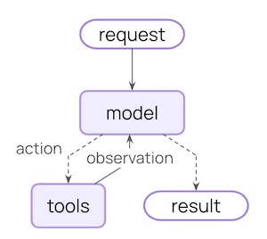
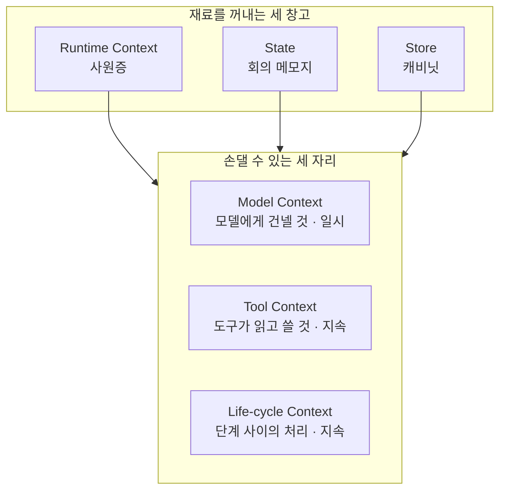
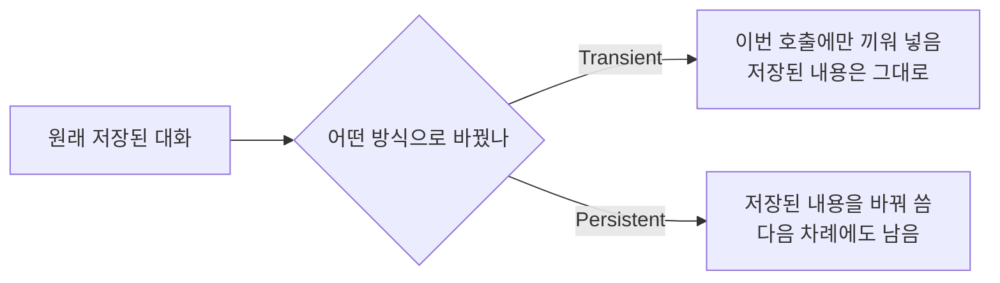
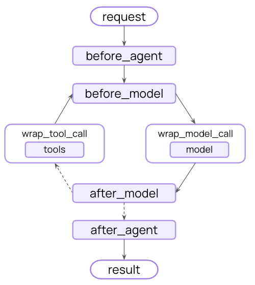

# A03 LangChain 컨텍스트 엔지니어링 문서 — 쉬운 해설

## 한 줄 요약

AI가 자꾸 엉뚱한 답을 내놓을 때, 무엇을 먼저 고쳐야 할까요?  
모델을 바꾸기 전에 "무엇을 넣어 줬는지"를 먼저 보라는 것이 이 문서의 답입니다.

## 3분 요약

- 에이전트가 실패하는 이유는 크게 둘입니다.  
  모델이 부족하거나, 알맞은 자료를 안 넣어 줬거나입니다. 대개는 뒤쪽입니다.
- 넣어 줄 자료를 고르고 다듬는 일을 컨텍스트 엔지니어링이라고 부릅니다.  
  문서는 이 일이 AI 엔지니어의 1순위 업무라고 못박습니다.
- 손댈 수 있는 자리는 셋입니다.  
  모델에게 건넬 것, 도구가 읽고 쓸 것, 그리고 단계 사이에 끼어들 것입니다.
- 자료를 꺼내 오는 창고도 셋입니다.  
  처음부터 주어진 설정, 이번 대화의 메모, 대화를 넘어 남는 저장소입니다.
- 손댄 내용이 한 번만 유효한지, 계속 남는지를 구분해야 합니다.  
  이 구분을 놓치면 지운 줄 알았던 내용이 다음 대화에도 따라옵니다.

## 왜 우리에게 중요한가

현장에서 답이 이상하면 가장 먼저 나오는 말이 "모델을 바꿔 볼까요"입니다.  
이 문서는 그 순서가 틀렸다고 말합니다.  
같은 모델이라도 무엇을 넣어 줬느냐에 따라 결과가 크게 달라지기 때문입니다.  
그리고 손댈 수 있는 자리를 이름 붙여 나눠 줍니다.  
이름이 있으면 "어디를 고쳤는지"를 기록할 수 있습니다.  
기록이 남아야 다음 사람이 같은 실수를 반복하지 않습니다.  
(해설자 보충) 설계 문서에 이 세 자리를 칸으로 두면 검토가 쉬워집니다.

## 본문 풀이

### 1. 어려운 것은 성능이 아니라 신뢰 — Overview

문서는 첫 문장부터 솔직합니다.  
에이전트를 만드는 일에서 어려운 것은 "믿을 만하게 만드는 일"이라고 적습니다.  
시제품은 잘 돌아가는데 실제 업무에 넣으면 자주 무너진다는 것입니다.  
여기서 에이전트(agent)는 스스로 도구를 골라 일을 처리하는 AI 담당자를 뜻합니다.

### 2. 왜 실패하는가 — Why do agents fail?

원인을 딱 둘로 좁힙니다.

하나, 쓰는 모델 자체가 그 일을 해낼 만큼 똑똑하지 않습니다.  
둘, 알맞은 자료가 모델에게 전달되지 않았습니다.

문서는 둘째가 더 흔하다고 적습니다.  
그리고 알맞은 자료와 도구를 알맞은 형식으로 주는 일을 컨텍스트 엔지니어링이라고 정의합니다.  
여기서 context는 AI에게 함께 넣어 주는 배경 자료를 말합니다.

카드사 상담으로 옮겨 보겠습니다.  
상담사가 답을 못 하는 이유가 늘 실력 부족은 아닙니다.  
고객 정보 화면이 안 떠 있어서인 경우가 더 많습니다.

### 3. 에이전트는 두 걸음을 반복함 — The agent loop

에이전트의 동작은 두 단계가 전부입니다.

첫째, 모델을 부릅니다. 지시문과 쓸 수 있는 도구 목록을 함께 건넵니다.  
모델은 답을 내거나, 도구를 써 달라고 요청합니다.

둘째, 요청받은 도구를 실행하고 결과를 돌려줍니다.

모델이 "이제 끝"이라고 판단할 때까지 이 두 걸음이 반복됩니다.

### 4. 손댈 수 있는 세 자리 — What you can control

문서는 손댈 수 있는 자리를 세 층으로 나눕니다.

- `Model Context` — 모델을 부를 때 무엇을 건넬지.  
  지시문, 대화 이력, 도구 목록, 어떤 모델을 쓸지, 답의 형식 다섯 가지입니다.
- `Tool Context` — 도구가 무엇을 읽고 무엇을 쓸 수 있는지.
- `Life-cycle Context` — 모델 호출과 도구 실행 **사이**에 무엇을 할지.  
  대화 줄이기, 위험 문구 걸러내기, 기록 남기기 같은 일입니다.

여기에 성격 구분이 하나 더 붙습니다.

`Transient`는 이번 한 번만 유효한 변경입니다.  
모델에게 보낼 때만 자료를 끼워 넣고, 저장된 내용은 건드리지 않습니다.

`Persistent`는 저장된 내용 자체를 바꾸는 변경입니다.  
한 번 바꾸면 다음 차례에도 그대로 남습니다.

`Model Context`는 일시 쪽이고, 나머지 둘은 지속 쪽입니다.

### 5. 자료를 꺼내 오는 세 창고 — Data sources

세 층 모두 아래 세 창고에서 재료를 꺼냅니다.

- `Runtime Context` — 시작할 때 정해져 바뀌지 않는 설정.  
  사용자 번호, 접속 열쇠, 권한 같은 것입니다. 사원증에 비유할 수 있습니다.
- `State` — 이번 대화가 지금까지 쌓아 온 내용.  
  주고받은 말, 올린 파일, 본인 확인 여부 같은 것입니다. 회의 메모지에 가깝습니다.
- `Store` — 대화가 끝나도 남는 저장소.  
  사용자 취향, 지난 기록 같은 것입니다. 캐비닛에 가깝습니다.

앞의 둘은 이번 대화 안에서만 살아 있습니다.  
`Store`만 다음 대화까지 넘어갑니다.

### 6. 실제로 손대는 장치 — How it works

이 모든 손질을 실제로 가능하게 하는 장치가 middleware입니다.  
middleware는 동작 중간에 끼어들어 자료를 바꾸는 덧붙임 장치입니다.

할 수 있는 일은 둘입니다.  
자료를 고쳐 넣거나, 아예 다른 단계로 건너뛰게 하는 것입니다.

### 7. 모델에게 건네는 다섯 가지 — Model context

모델을 한 번 부를 때 정할 수 있는 것이 다섯 가지입니다.

지시문은 AI의 태도와 할 수 있는 일을 정합니다.  
대화가 길어지면 "짧게 답하라"를 덧붙이는 식으로 바꿀 수 있습니다.

대화 이력은 실제로 모델에게 보낼 말들의 목록입니다.  
문서는 재미있는 요령을 하나 적습니다.  
모델이 마지막 쪽 내용에 더 주목하니 중요한 자료는 끝에 붙이라는 것입니다.

도구 목록은 상황에 따라 줄였다 늘렸다 할 수 있습니다.  
본인 확인 전에는 민감한 도구를 아예 안 보이게 하는 식입니다.

어떤 모델을 쓸지도 도중에 바꿀 수 있습니다.  
대화가 길면 큰 모델로, 짧으면 값싼 모델로 가는 식입니다.

답의 형식은 정해진 서식에 맞춰 받게 하는 장치입니다.  
카드사 상담 문의를 분류할 때 유용합니다.  
구분, 긴급도, 한 줄 요약, 고객 감정 네 칸으로 받아 두면 다음 처리가 쉬워집니다.

### 8. 도구는 이름값이 절반 — Tools

문서는 도구의 이름과 설명이 그냥 꼬리표가 아니라고 강조합니다.  
모델은 그 글만 읽고 언제 어떤 도구를 쓸지 정하기 때문입니다.  
그래서 이름, 설명, 인자 이름, 인자 설명 네 가지를 또박또박 적으라고 합니다.

개수도 문제입니다.  
너무 많으면 모델이 헷갈려 실수가 늘고, 너무 적으면 할 수 있는 일이 줄어듭니다.  
다만 문서는 "몇 개까지"라는 숫자를 주지 않습니다.

### 9. 도구는 읽기도 하고 쓰기도 함 — Tool context

도구는 값을 받아 결과만 돌려주는 물건이 아닙니다.  
세 창고를 직접 들여다볼 수 있습니다.  
사용자 번호가 있어야 조회가 되고, 접속 열쇠가 있어야 외부에 붙을 수 있기 때문입니다.

반대로 도구가 창고에 값을 써 넣을 수도 있습니다.  
본인 확인에 성공하면 "확인됨"을 이번 대화 메모에 적어 두는 식입니다.  
그러면 다음 차례부터 민감한 도구가 열립니다.

마이데이터 금융상품 추천으로 옮겨 보겠습니다.  
동의 여부를 메모에 적어 두면, 동의 전에는 조회 도구가 아예 뜨지 않게 만들 수 있습니다.

### 10. 단계 사이에 끼어들기 — Life-cycle context

가장 흔한 예가 대화 줄이기입니다.  
대화가 길어지면 옛 내용을 요약본 한 덩어리로 바꿔 끼웁니다.

여기서 중요한 차이가 있습니다.  
앞서 나온 일시 변경과 달리, 이 요약은 저장된 내용을 **영구히** 바꿉니다.  
원래 대화는 사라지고 요약본만 남습니다.

문서는 이 일을 해 주는 내장 장치를 소개합니다.  
분량이 정해진 선을 넘으면 자동으로 요약하고, 최근 몇 건만 원문으로 남깁니다.  
예시로 든 값은 4,000토큰과 최근 20건입니다.

### 11. 권고 여섯 줄 — Best practices

문서가 마지막에 남기는 권고는 이렇습니다.  
정적인 지시문과 도구로 단순하게 시작할 것.  
한 번에 하나씩만 바꿔 볼 것.  
호출 수와 분량과 걸린 시간을 계속 지켜볼 것.  
바퀴를 새로 만들지 말고 내장 장치를 쓸 것.  
어떤 자료를 왜 넣는지 문서로 남길 것.  
그리고 일시 변경과 지속 변경의 차이를 잊지 말 것.

## 그림으로 보기

> 그림 1. 에이전트가 반복하는 두 걸음 — 원문 「Agent loop」 그림 (2026-08-05 조회)  
> `action`은 모델이 도구를 부르는 것, `observation`은 도구 결과가 모델로 돌아오는 것입니다.
> 이 두 줄이 계속 돌다가 더 부를 도구가 없으면 `result`로 빠져나갑니다.

> 그림 2. 세 자리와 세 창고가 만나는 격자 — **정리자 작도. 원문에 없는 그림임**

> 그림 3. 같은 손질이라도 남는지 여부가 다름 — **정리자 작도. 원문에 없는 그림임**

> 그림 4. 손댈 수 있는 자리가 어디에 붙는지 — 원문 「Middleware」 그림 (2026-08-05 조회)  
> 요청이 들어와 답이 나가기까지 여섯 자리에서 끼어들 수 있습니다.
> `before_model`은 모델을 부르기 직전, `after_model`은 답을 받은 직후입니다.
> `wrap_` 로 시작하는 둘은 호출을 통째로 감싸서 앞뒤를 다 잡습니다.

## 용어 풀이

| 용어 | 우리말 | 한 줄 설명 |
|------|--------|-----------|
| AI | 인공지능 | 사람이 하던 판단·생성 일을 대신 하는 소프트웨어 |
| agent | 에이전트 | 스스로 도구를 골라 쓰며 일을 처리하는 AI 담당자 |
| context | 맥락 정보 | AI에게 함께 넣어 주는 배경 자료와 대화 내용 |
| middleware | 미들웨어 | 동작 중간에 끼어들어 자료를 바꾸는 덧붙임 장치 |
| `Model Context` | 모델 컨텍스트 | 모델을 부를 때 건네는 것 전체(지시문·이력·도구 목록 등) |
| `Tool Context` | 도구 컨텍스트 | 도구가 읽을 수 있는 것과 써 넣을 수 있는 것 |
| `Life-cycle Context` | 수명주기 컨텍스트 | 모델 호출과 도구 실행 사이에 끼어드는 처리 |
| `Transient` | 일시 | 이번 호출에만 유효하고 저장되지 않는 변경 |
| `Persistent` | 지속 | 저장된 내용 자체를 바꿔 다음 차례에도 남는 변경 |
| `Runtime Context` | 런타임 컨텍스트 | 시작할 때 정해져 바뀌지 않는 설정(사용자 번호·권한 등) |
| `State` | 상태 | 이번 대화가 쌓아 온 내용. 대화가 끝나면 넘어가지 않음 |
| `Store` | 저장소 | 대화가 끝나도 남는 장기 보관 자리 |

## 헷갈리기 쉬운 곳

- **`State`와 `Store`는 이름이 비슷하지만 수명이 다릅니다.**  
  `State`는 이번 대화까지, `Store`는 다음 대화까지 갑니다.  
  둘을 섞으면 남기지 말아야 할 정보가 계속 따라다닙니다.
- **"잠깐 뺐다"와 "지웠다"는 다릅니다.**  
  일시 변경은 보낼 때만 빼는 것이라 저장된 내용에는 그대로 남아 있습니다.  
  정말 없애려면 지속 변경 쪽을 써야 합니다.
- **요약은 되돌릴 수 없습니다.**  
  대화 줄이기는 저장된 내용을 영구히 바꿉니다. 원래 말은 사라집니다.  
  기록 보존이 필요한 업무라면 별도 보관을 함께 설계해야 합니다.
- **도구 개수에 정해진 상한은 없습니다.**  
  문서는 "너무 많으면 실수가 는다"고만 적고 숫자를 주지 않습니다.  
  "도구는 몇 개까지"라는 기준을 이 문서에서 인용하면 안 됩니다.
- **예시에 나온 모델 이름은 그대로 쓰면 안 됩니다.**  
  설명을 위한 문자열일 뿐입니다. 실제 쓸 모델 이름으로 바꿔야 합니다.

## 원문 정보와 확인 범위

- 원문 주소: `https://docs.langchain.com/oss/python/langchain/context-engineering`
- 발행일: 원문에 발행일·갱신일·판 번호가 없음. 그래서 본 날짜(2026-08-05)로 대신함
- 접근 수단: `curl` 명령으로 원문을 내려받아 저장한 뒤, 꾸밈 요소를 걷어내고 글자만 뽑아 읽음.  
  코드 표기는 `context7`으로 한 번 더 대조함. 브라우저는 쓰지 않았음
- 확인 상태: FULL(본문을 처음부터 끝까지 읽음. 코드 예시 약 20건 포함)
- 못 본 것: 본문이 가리키는 연결 문서 8건.  
  개념 개요, 미들웨어, 도구, 메모리, 에이전트 등은 열지 않았음
- 실행하지 않은 것: 코드 예시를 직접 돌려 보지는 않았음
- 그림 안내: 원문에는 다이어그램이 없고 표와 코드만 있어, 위 그림 3개는 모두 직접 그린 것임
- 정리본: A03_doc_langchain-context-eng.md
