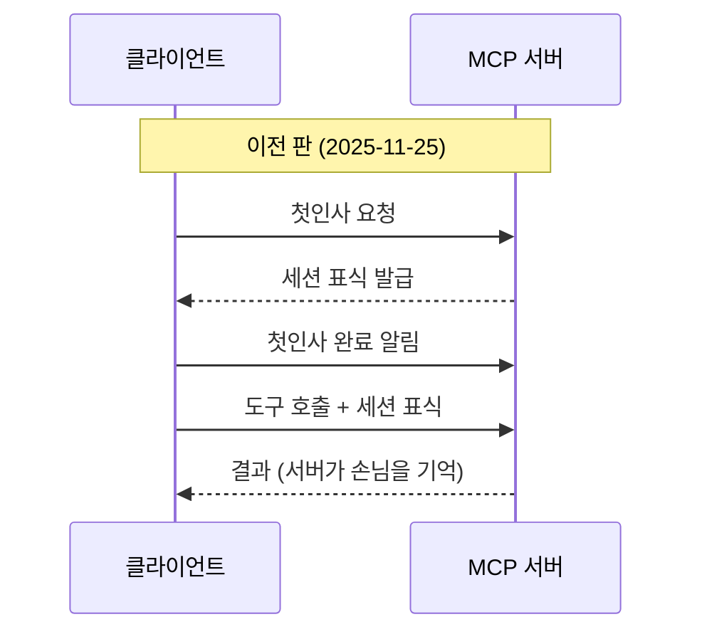
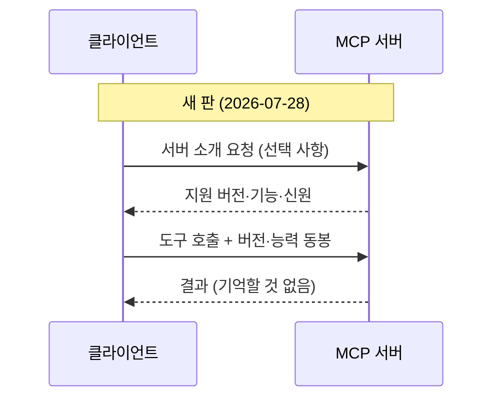
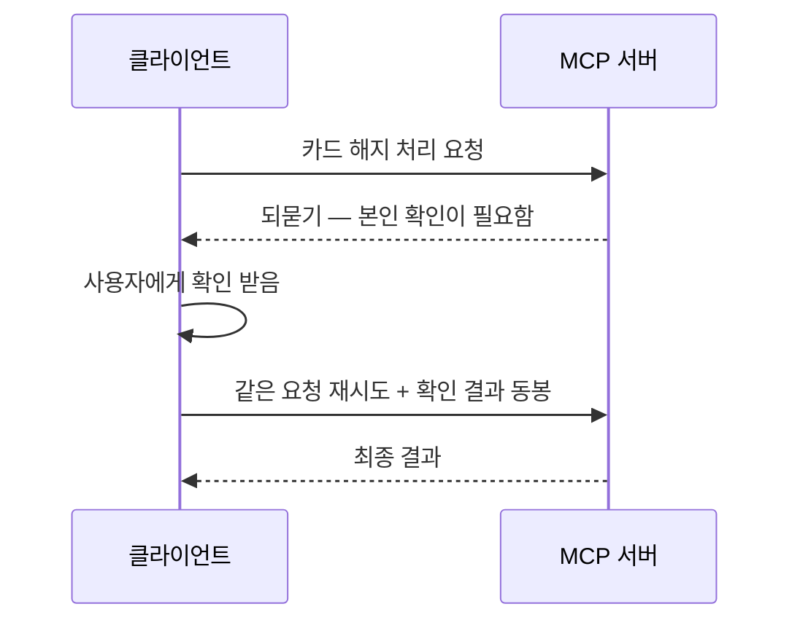

# A04 MCP 명세 2026-07-28 변경 요약 — 쉬운 해설

## 한 줄 요약

이 글이 답하는 질문은 이것임. "AI 도구 연결 표준인 MCP가 이번에 무엇이 바뀌었나."  
답은 이것임. 서버가 대화를 기억하던 방식을 버리고, 매 요청이 스스로를 설명하는 방식으로 바뀌었음.

## 3분 요약

- 서버가 손님을 기억하던 `세션`이 사라짐. 이제 요청 하나하나가 자기소개를 들고 다님
- 통신 시작 전 `첫인사 절차`도 없어짐. 바로 본론부터 시작함
- 서버가 클라이언트에게 되묻는 방식이 바뀜. 되물으면 클라이언트가 답을 넣어 다시 보냄
- Roots · Sampling · Logging 세 기능이 폐기 예정으로 지정됨. 새로 만들 때 쓰지 말라는 뜻임
- 알림을 받는 통로가 하나로 합쳐지고, 끊긴 스트림을 이어 받는 기능은 없어짐

## 왜 우리에게 중요한가

우리가 만들 에이전트는 결국 바깥 시스템을 불러야 일을 함.  
그 부름의 규격이 MCP임. 규격이 바뀌면 우리 코드가 바뀜.  
특히 이번 변경은 "서버가 기억하느냐 마느냐"를 건드림.  
이건 코드 몇 줄이 아니라 서버를 어떻게 띄우고 어떻게 늘릴지의 문제임.  
카드사 상담 에이전트를 예로 들면 이렇게 달라짐.  
예전에는 상담 한 건이 서버 한 대에 묶여 있었음.  
이제는 어느 서버가 받아도 되므로 서버를 여러 대로 늘리기가 쉬워짐.  
반대로 "무엇을 기억할지"는 우리가 직접 설계해야 할 몫이 됨.

## 본문 풀이

### 1. 크게 바뀐 것들 — Major changes

가장 큰 변화는 `stateless`(무상태)로 간다는 선언임.  
무상태란 서버가 이전 요청을 기억하지 않는 방식임.

카페로 비유하면 이럼.  
예전 MCP는 회원카드를 발급하는 카페였음.  
카드를 보여주면 점원이 "지난번 그 손님"이라고 알아봄.  
그 카드가 `Mcp-Session-Id`라는 머리표였음.  
이제 카드가 없어짐. 주문할 때마다 이름과 취향을 함께 적어 냄.

구체적으로 세 가지가 사라졌음.

- 세션과 `Mcp-Session-Id` 머리표가 없어짐
- 통신을 시작할 때 하던 `handshake`(첫인사 절차)가 없어짐
- 끊긴 스트림을 이어 받던 기능이 없어짐

첫인사 절차가 없어진 자리는 무엇이 채우나.  
요청마다 붙는 `_meta`라는 부가 정보칸이 채움.  
여기에 "나는 이 버전을 쓴다", "나는 이런 기능을 쓸 수 있다"를 적어 보냄.  
버전이 맞지 않으면 서버가 버전 불일치 오류를 돌려줌.

대신 새로 생긴 것도 있음. `server/discover`라는 호출임.  
`RPC`(원격 호출)란 남의 서버에 있는 기능을 이름으로 부르는 방식임.  
`server/discover`는 서버가 자기 버전·기능·신원을 알려주는 소개 창구임.  
서버는 반드시 이 창구를 만들어야 함.  
다만 클라이언트가 꼭 불러야 하는 것은 아님. 필요할 때만 부르면 됨.

되묻기 방식도 바뀌었음. 이름이 MRTR(여러 번 왕복 요청)임.  
예전에는 서버가 클라이언트에게 직접 요청을 걸었음.  
이제는 서버가 "정보가 더 필요함"이라는 답을 먼저 돌려줌.  
그러면 클라이언트가 정보를 채워 같은 요청을 다시 보냄.

서류 심사에 비유하면 이럼.  
창구 직원이 전화를 거는 대신 "서류 한 장 부족" 도장을 찍어 돌려줌.  
신청자가 그 서류를 채워 다시 접수함.

그래서 모든 답변에 `resultType`이라는 칸이 필수가 됨.  
이 답이 최종인지, 되묻는 중인지 표시하는 칸임.

알림 통로도 하나로 합쳐졌음.  
예전에는 별도 통로와 구독·구독취소 호출이 따로 있었음.  
이제는 `subscriptions/listen` 하나로 받음.  
클라이언트가 받고 싶은 알림 종류를 고르면 서버가 그것만 보내 줌.

### 2. 작게 바뀐 것들 — Minor changes

작은 변경은 필드·머리표·오류 번호 쪽에 몰려 있음.

- 요청 머리표 두 개가 필수가 됨. 어떤 기능을 어떤 이름으로 부르는지 적는 칸임
- 목록·읽기 결과에 캐시 힌트 두 칸이 생김. 유효 시간과 공유 범위임
- 도구 목록을 항상 같은 순서로 주도록 권고함. 캐시가 잘 맞게 하려는 뜻임
- 없는 자원을 찾았을 때의 오류 번호가 바뀜. 표준 규격에 맞추려는 정리임
- 오류 번호를 두 구역으로 나눔. 한쪽은 구현이 자유롭게 쓰고, 한쪽은 명세가 예약함
- 인증 쪽 규칙이 조여짐. 발급처를 확인하고, 발급처가 바뀌면 다시 등록해야 함

(해설자 보충) 인증 규칙 강화는 "누가 준 열쇠인지 반드시 확인하라"는 뜻으로 읽으면 쉬움.  
남의 집 열쇠를 우리 집에 꽂아 보는 사고를 막는 장치임.

### 3. 없앨 예정인 것들 — Deprecated

`Deprecated`는 폐기 예정이라는 표시임.  
지금은 잘 동작하지만 나중에 없앨 기능이라는 뜻임.  
지하철 노선 폐선 예고와 같음. 아직 다니지만 새 집을 그쪽에 구하면 안 됨.

이번에 폐기 예정이 된 것은 네 묶음임.

- Roots — 클라이언트 쪽 폴더 위치를 서버에 알려 주던 기능임
- Sampling — 서버가 클라이언트를 통해 모델을 부르던 기능임
- Logging — 서버 로그 수준을 프로토콜로 다루던 기능임
- 옛 전송 방식과 옛 등록 방식도 함께 폐기 예정으로 분류됨

대체 방법도 함께 제시됨.  
폴더는 도구 인자나 서버 설정으로 넘김.  
모델 호출은 모델 제공사 쪽 연결 창구에 직접 붙음.  
로그는 표준 오류 출력이나 관측 도구로 보냄.

우리 교육에 바로 걸리는 지점이 여기임.  
실습용 스타터 서버가 이 세 기능에 기대고 있으면 곤란함.  
지금 만들면 얼마 못 가 다시 고쳐야 함.

### 4. 스키마 정정 — Other schema changes

기계가 읽는 규격 파일에 있던 타입 표기 오류 하나를 바로잡았음.  
숫자로 써야 할 값이 정수로만 적혀 있던 문제임.  
생성 도구 설정 때문에 생긴 실수였음.

### 5. 기능 수명 규칙 신설 — Governance and process updates

기능의 일생을 세 단계로 정의했음.  
쓰는 중 / 폐기 예정 / 제거됨 세 단계임.  
폐기 예정으로 찍은 뒤 최소 열두 달은 남겨 두기로 함.  
폐기 예정 기능만 모아 놓은 목록도 따로 운영함.

(해설자 보충) 이 규칙이 생긴 것이 우리에게는 좋은 소식임.  
"어느 날 갑자기 기능이 사라지는 일"에 최소 1년의 예고가 붙기 때문임.

### 6. 제안 절차 정비 — Process changes

명세 변경 제안을 문서 파일과 코드 리뷰 절차로 다루도록 정리했음.  
번호를 매기는 방식과 후원자 책임, 상태 관리 방법을 정함.

## 그림으로 보기

> 그림 1. 이전 판의 흐름. 서버가 세션 표식으로 손님을 기억함 — **정리자 작도. 원문에 없는 그림임**

> 그림 2. 새 판의 흐름. 첫인사와 세션이 사라지고 요청이 스스로를 설명함 — **정리자 작도. 원문에 없는 그림임**

> 그림 3. 여러 번 왕복 요청의 흐름. 서버가 되묻고 클라이언트가 채워서 재시도함 — **정리자 작도. 원문에 없는 그림임**

## 용어 풀이

| 용어 | 우리말 | 한 줄 설명 |
|------|--------|-----------|
| stateless | 무상태 | 서버가 이전 요청을 기억하지 않는 방식임 |
| handshake | 첫인사 절차 | 본격 통신 전에 서로 조건을 맞추던 준비 단계임 |
| Streamable HTTP | 스트림 가능 HTTP 전송 | MCP가 쓰는 현행 통신 방식임. 답을 흘려보낼 수 있음 |
| `Mcp-Session-Id` | 세션 표식 머리표 | 어느 손님인지 알려 주던 머리표임. 이번에 없어짐 |
| RPC | 원격 호출 | 남의 서버 기능을 이름으로 불러 쓰는 방식임 |
| `server/discover` | 서버 소개 호출 | 서버가 자기 버전·기능·신원을 알려 주는 창구임 |
| `_meta` | 부가 정보칸 | 요청·응답에 딸려 가는 추가 정보 주머니임 |
| MRTR | 여러 번 왕복 요청 | 서버가 되물으면 답을 채워 재시도하는 방식임 |
| `resultType` | 결과 종류 칸 | 최종 답인지 되묻는 중인지 표시하는 칸임 |
| `subscriptions/listen` | 알림 듣기 통로 | 서버 알림을 받는 단일 통로임 |
| SSE | 서버 밀어보내기 스트림 | 서버가 일방으로 밀어 보내던 옛 스트리밍 방식임 |
| Deprecated | 폐기 예정 | 지금은 되지만 나중에 없앨 기능이라는 표시임 |

## 헷갈리기 쉬운 곳

- "세션이 없어졌으니 상태를 못 쓴다"는 오해임. 상태는 쓸 수 있음.  
  다만 서버가 발급한 표를 도구 인자로 주고받는 방식으로 바뀐 것임
- "서버 소개 호출을 매번 해야 한다"는 오해임.  
  서버는 반드시 만들어야 하지만, 클라이언트는 필요할 때만 부르면 됨
- "폐기 예정이니 지금 못 쓴다"는 오해임.  
  폐기 기간에는 그대로 동작함. 다만 새로 만들 때 채택하지 말라는 뜻임
- "무상태라 더 빠르다"는 오해임. 원문은 속도 우열을 말하지 않음.  
  바뀐 것은 기억의 위치이지 성능 순위가 아님
- 스트림이 끊겼을 때 이어 받는 기능이 없어진 점을 놓치기 쉬움.  
  끊기면 그 요청은 버려지므로 새 번호로 다시 보내야 함

## 원문 정보와 확인 범위

- 원문 URL: https://modelcontextprotocol.io/specification/2026-07-28/changelog
- 발행일: 2026-07-28 개정판. 직전 개정판은 2025-11-25로 본문에 적혀 있음
- 접근 수단: `curl`로 내려받은 뒤 텍스트로 추출해 판독함. 브라우저는 쓰지 않음
- 저장 파일: `.temp/mcp-changelog-20260728.html`, `.temp/mcp-changelog.txt`
- 조회일: 2026-08-05
- 확인 상태: FULL — 변경 요약 문서의 여섯 개 절 전체를 읽음
- 못 본 것: 각 조항의 명세 본문, 제안 문서 원문, 저장소의 전체 변경 목록, 해설 블로그
- 이 해설본의 그림 세 개는 모두 정리자 작도이며 원문에는 없는 그림임
- 정리본: A04_spec_mcp-changelog-260728.md

