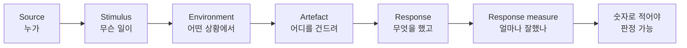
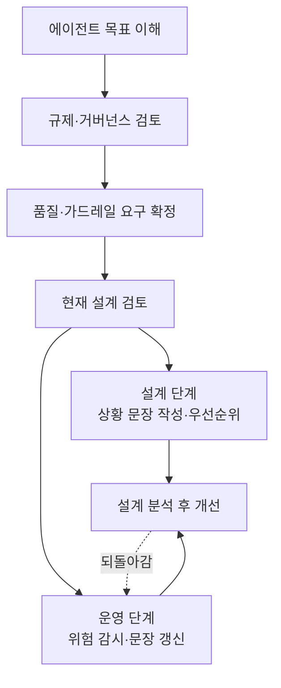
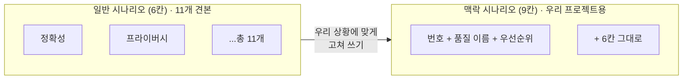
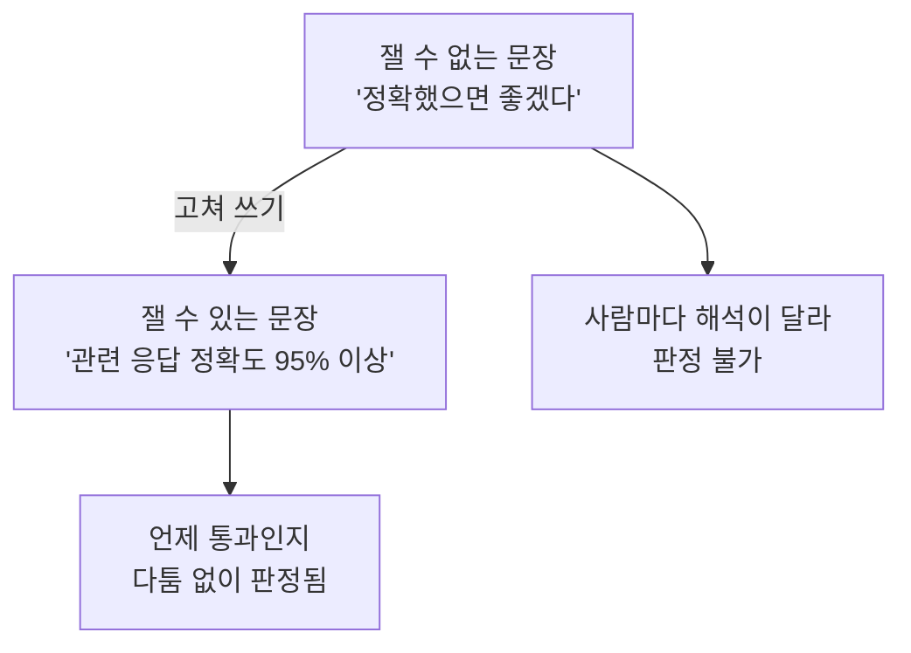

# A05 AgentArcEval — AI 에이전트 설계를 채점하는 방법 — 쉬운 해설

## 한 줄 요약

이 논문이 답하는 질문은 이것입니다.  
"우리가 만든 AI 에이전트 설계가 좋은 설계인지 어떻게 판정하죠?"  
답은 이렇습니다. "좋다 / 나쁘다" 대신 상황별 채점표를 미리 써 두고 재는 것입니다.

## 3분 요약

- 옛날 소프트웨어 설계 채점법은 AI 에이전트에 잘 안 맞습니다.  
  에이전트는 스스로 판단하고 계속 변하기 때문입니다.
- 그래서 오래된 채점법인 ATAM을 에이전트용으로 고쳤습니다.  
  이 고친 방법의 이름이 AgentArcEval입니다.
- 채점 문장은 6칸으로 씁니다.  
  누가 · 무슨 일이 · 어떤 상황에서 · 어디를 건드려 · 무엇을 하고 · 얼마나 잘했나입니다.
- 자주 쓰는 상황 11개를 미리 만들어 뒀습니다.  
  정확성, 프라이버시, 안전성 같은 품질별로 하나씩입니다.
- 세무 상담 AI에 실제로 적용해 봤습니다.  
  다만 사례는 딱 1건이라 "검증됐다"고 말하기는 이릅니다.

## 왜 우리에게 중요한가

우리 교육은 첫날에 목표·품질속성 카드를 씁니다.  
성공 기준 3개와 중요 품질 3개를 "잴 수 있는 문장"으로 적는 일입니다.  
그런데 이게 백지에서는 정말 안 써집니다.  
"정확했으면 좋겠다" 같은 말은 잴 수가 없기 때문입니다.  
이 논문은 그 문장을 어떤 칸으로 쪼개 쓰는지 알려 줍니다.  
그래서 카드 양식의 근거로 쓸 수 있습니다.  
(해설자 보충) 우리 교육이 가져오는 것은 양식뿐입니다.  
논문의 평가 절차 전체는 3일 안에 도저히 들어가지 않습니다.

## 본문 풀이

### 1. 왜 새 채점법이 필요한가 — 1 Introduction

AI 에이전트에는 기존 설계와 다른 특징이 셋 있습니다.

첫째, 여러 부품이 얽힌 복합 구조입니다.  
둘째, 스스로 판단하고 매번 답이 달라집니다.  
셋째, 쓰면서 계속 변합니다.

설계를 어떻게 하느냐가 품질을 크게 좌우합니다.  
그런데 기존 채점법은 이 특징들을 못 다룹니다.

### 2. 기존 방법으로는 왜 안 되나 — 3 Methodology

저자들은 기존 평가 방법들을 훑어봤습니다.  
이런 조사를 체계적 문헌 고찰(systematic literature review)이라고 합니다.  
논문들을 정해진 규칙대로 빠짐없이 모아 살펴보는 방식입니다.

네 가지를 물었습니다.  
기존 방법을 에이전트에 쓸 수 있나?  
스스로 판단하는 성질을 다루나?  
계속 변하는 성질을 다루나?  
바로 쓸 수 있는 상황 예시를 주나?

결론은 "그대로는 안 된다"였습니다.

### 3. 새 방법의 뼈대 — 4 The AgentArcEval Method

이 방법은 ATAM 위에 세워졌습니다.  
ATAM은 2000년에 나온 소프트웨어 설계 채점법입니다.  
품질을 상황 문장으로 적어 놓고 재는 방식이 핵심입니다.

여기에 에이전트용으로 두 가지를 더 넣었습니다.  
에이전트 고유의 부품, 그리고 가드레일(guardrail)입니다.  
가드레일은 AI가 넘으면 안 되는 선을 막아 두는 안전장치입니다.

#### 3-1. 누가 쓰나 — 4.1 User types

두 부류입니다.  
프로젝트 팀의 설계자가 자기 설계를 스스로 점검할 때 씁니다.  
외부 전문가가 독립적으로 심사하거나 감사할 때도 씁니다.

#### 3-2. 언제 쓰나 — 4.2 Evaluation time

네 시점입니다.  
설계 직후, 배포 직전, 배포 이후, 그리고 운영 중 상시입니다.  
마지막 것이 특이합니다.  
한 번 채점하고 끝이 아니라 돌아가는 동안 계속 본다는 뜻입니다.

#### 3-3. 무엇을 넣고 무엇이 나오나 — 4.3 Inputs and outputs

넣는 것은 여섯 가지입니다.  
프로젝트 명세, 설계 명세, 지켜야 할 규제, 상황 예시 모음,  
운영 중 쌓인 데이터, 관계자들의 의견입니다.

나오는 것은 세 가지입니다.  
무엇과 무엇을 맞바꿨는지 정리한 표,  
발견된 위험 목록, 그리고 개선 권고입니다.

#### 3-4. 어떤 순서로 하나 — 4.4 Steps

먼저 네 가지를 앞단에서 합니다.  
에이전트 목표 이해, 규제 검토, 품질 요구 확정, 설계 검토입니다.

그다음 두 갈래로 갈립니다.  
설계 단계 갈래에서는 상황 문장을 만들고 순서를 매깁니다.  
운영 단계 갈래에서는 위험을 계속 감시하고 상황 문장을 갱신합니다.

마지막에 둘을 합쳐 설계를 분석하고 고칩니다.

### 4. 채점 문장 쓰는 법 — 5 General Scenarios

이게 우리에게 가장 중요한 부분입니다.  
상황 문장 하나는 6칸으로 씁니다.

`Source`는 누가 이 일을 일으켰나입니다.  
`Stimulus`는 무슨 일이 벌어졌나입니다.  
`Environment`는 어떤 상황에서 벌어졌나입니다.  
`Artefact`는 시스템의 어느 부분이 건드려졌나입니다.  
`Response`는 시스템이 무엇을 했나입니다.  
`Response measure`는 얼마나 잘했는지 재는 잣대입니다.

마지막 칸이 핵심입니다.  
숫자로 적어야 나중에 판정할 수 있습니다.

(해설자 보충) 우리 케이스인 마이데이터 금융상품 추천으로 채워 보면 이렇습니다.  
누가는 "상품을 추천받으려는 고객"입니다.  
무슨 일이는 "내 소비 내역으로 카드를 추천해 달라는 요청"입니다.  
어떤 상황은 "고객이 동의한 항목만 볼 수 있는 평상시 운영"입니다.  
어디를 건드려는 "추천 엔진과 정형 데이터 조회 부분"입니다.  
무엇을 했나는 "동의 범위 안의 데이터만 써서 추천과 근거를 제시"입니다.  
얼마나 잘했나는 "추천 근거의 숫자가 원본과 100% 일치"처럼 적습니다.

저자들은 품질 11개마다 예시 문장을 하나씩 만들었습니다.  
정확성, 적응성, 효율성, 프라이버시, 보안, 공정성,  
가용성, 관측성, 투명성, 안전성, 이의제기성입니다.

아무거나 넣지는 않았습니다.  
두 관문을 통과한 것만 넣었습니다.  
실제 배포 현장에서 벌어진 일이어야 합니다.  
그리고 6칸 양식으로 쓸 수 있어야 합니다.

(해설자 보충) 이 11개는 출발점일 뿐입니다.  
저자들도 팀마다 더 늘려 쓰라고 적었습니다.

### 5. 실제로 해 본 사례 — 6 Case Study

세무 상담 AI에 적용했습니다.  
이름은 Luna이고 호주 세무 자료를 근거로 답합니다.

여기서 만든 문장을 맥락 시나리오(context scenario)라고 부릅니다.  
앞의 11개가 일반 견본이라면, 이건 우리 프로젝트용으로 고쳐 쓴 것입니다.

맥락 시나리오 카드는 6칸이 아니라 9칸입니다.  
앞에 세 칸이 더 붙습니다.  
번호, 어떤 품질에 대한 것인지, 그리고 우선순위입니다.

총 7장을 썼습니다.  
그리고 각 장마다 설계가 그 기준을 만족하는지 따졌습니다.

실제로 쓴 잣대들이 좋은 견본입니다.  
정확성은 "관련 응답 정확도 95% 이상"입니다.  
적응성은 "유효한 피드백의 99%가 올바른 갱신으로"입니다.  
효율성은 "이미 답한 질문은 1초 미만"입니다.  
투명성은 "사용자 95% 이상이 설명을 이해"입니다.

(해설자 보충) 주의할 점이 있습니다.  
이 숫자들은 측정 결과가 아니라 목표값입니다.  
"Luna가 95%를 달성했다"는 말은 논문에 없습니다.

### 6. 마무리와 한계 — 7 Conclusion

저자들은 스스로 한계 두 가지를 밝힙니다.

첫째, 실제 프로젝트를 많이 못 봤습니다.  
사례연구는 딱 1건입니다.

둘째, AI 기술이 워낙 빨리 변해서 금방 낡을 수 있습니다.  
그래서 계속 고쳐 나가는 공개 문서로 운영하겠다고 합니다.

## 그림으로 보기

> 그림 1. 채점 문장을 이루는 6칸 — **정리자 작도. 원문에 없는 그림임**

> 그림 2. 평가 절차의 전체 흐름 — **정리자 작도. 원문에 없는 그림임**

> 그림 3. 견본 문장과 우리 프로젝트 문장의 관계 — **정리자 작도. 원문에 없는 그림임**

> 그림 4. 잴 수 있는 문장과 없는 문장의 차이 — **정리자 작도. 원문에 없는 그림임**

## 용어 풀이

| 용어 | 우리말 | 한 줄 설명 |
|------|--------|-----------|
| AgentArcEval | 에이전트 설계 평가법 | 이 논문이 제안한 AI 에이전트용 설계 채점 방법 |
| ATAM | 절충점 분석법 | 2000년에 나온 소프트웨어 설계 채점법. 이 논문이 물려받은 원조 |
| quality attribute | 품질속성 | 정확성·안전성처럼 시스템이 얼마나 좋은지 재는 항목 |
| general scenario | 일반 시나리오 | 품질별로 미리 만들어 둔 견본 상황 문장 |
| context scenario | 맥락 시나리오 | 견본을 우리 프로젝트 상황에 맞게 고쳐 쓴 문장 |
| Source · Stimulus | 발생 주체 · 자극 | 누가 일으켰고 무슨 일이 벌어졌는지를 적는 칸 |
| Environment · Artefact | 상황 · 대상 부품 | 어떤 상황에서 시스템의 어느 부분이 건드려졌는지 적는 칸 |
| Response · Response measure | 대응 · 측정 잣대 | 시스템이 무엇을 했고 얼마나 잘했는지 숫자로 재는 칸 |
| guardrail | 가드레일 | AI가 넘으면 안 되는 선을 막아 두는 안전장치 |
| systematic literature review | 체계적 문헌 고찰 | 정해진 규칙대로 관련 논문을 빠짐없이 모아 분석하는 조사 방법 |
| foundation model | 파운데이션 모델 | 방대한 데이터로 미리 학습해 여러 일에 두루 쓰는 대형 AI 모델 |

## 헷갈리기 쉬운 곳

- 이 논문은 AI 성능을 재는 방법이 아닙니다.  
  모델이 얼마나 똑똑한지가 아니라, 설계가 잘 됐는지를 봅니다.
- 11개 품질을 다 써야 하는 게 아닙니다.  
  저자들도 출발점일 뿐이라고 적었습니다.  
  우리 교육은 이 중 3개만 골라 씁니다.
- 사례의 95%, 99% 같은 숫자를 그대로 베끼면 안 됩니다.  
  세무 AI의 목표값이지 우리 프로젝트의 정답이 아닙니다.
- "검증된 방법"이라고 부르면 지나칩니다.  
  사례는 1건이고, 다른 방법과 비교한 실험도 없습니다.  
  게다가 방법을 만든 사람들이 직접 적용해 본 것입니다.
- 이 논문은 국제표준 ISO 25010의 품질 용어를 쓰지 않습니다.  
  (해설자 보충) 이의제기성 같은 고유 용어가 있어 교재에서 어느 쪽 용어를 쓸지 정해야 합니다.

## 원문 정보와 확인 범위

- 원문 제목: AgentArcEval: An Architecture Evaluation Method for Foundation Model based Agents
- URL: `https://arxiv.org/html/2510.21031v1`
- 발행일: 2025년 10월 23일 arXiv 제출. 버전은 v1이며 고쳐진 판이 없습니다
- 발행 주체: 호주 CSIRO Data61 연구진, Empathetic AI, 하와이대학교의 공동 저자 9인.  
  ATAM을 만든 Rick Kazman 본인이 공저자로 참여했습니다
- 접근 수단: `curl` 명령으로 논문 웹페이지를 내려받은 뒤, 꾸밈 요소를 걷어 내고 본문 글자만 뽑아 읽음.  
  버전 확인은 arXiv 서지 페이지를 같은 방식으로 받아 대조함. 브라우저 도구는 쓰지 않았습니다
- 확인 상태: FULL (1장부터 7장까지 본문 전체를 읽음)
- 못 본 것: 본문 그림 14장의 그림 속 내용은 읽지 않았습니다.  
  본문 글이 그림 내용을 그대로 설명하고 있어 글로 대신 읽었습니다.  
  참고문헌 목록과 저자들이 심사용으로만 공개한 조사 자료 2건도 열지 않았습니다
- 그림 관련: 이 문서의 그림 4개는 모두 정리자가 직접 그린 것입니다
- 정리본: A05_paper_agentarceval.md
