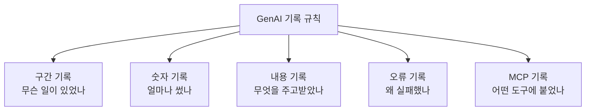
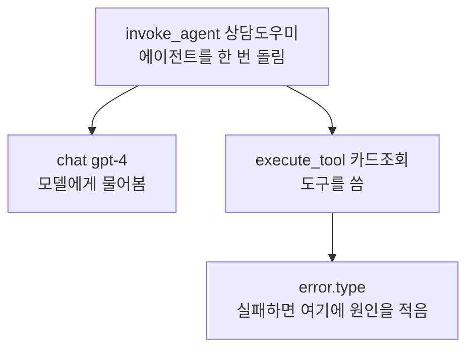
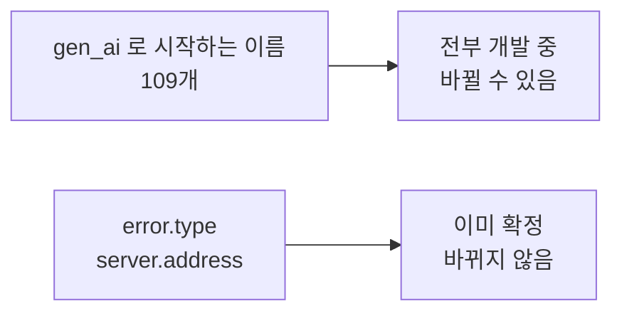

# A07 OpenTelemetry GenAI 시맨틱 컨벤션 — 쉬운 해설

## 한 줄 요약

AI 에이전트가 한 일을 남길 때, 그 기록에 어떤 이름을 붙여야 할까요?  
OpenTelemetry가 그 이름표를 한 벌로 정해 두었습니다. 다만 아직 확정 전 단계입니다.

## 3분 요약

- AI가 일한 내역을 기록할 때 쓰는 **이름표 규칙 모음**입니다.  
  모델을 부른 일, 도구를 쓴 일, 오류가 난 일에 각각 정해진 이름이 있습니다.
- 원래는 큰 규칙 창고 안에 같이 있었습니다. 지금은 GenAI 몫만 따로 나와 있습니다.
- `gen_ai`로 시작하는 이름은 **전부 아직 공사 중** 단계입니다.  
  즉 이름이 나중에 바뀔 수 있습니다.
- 반면 오류와 서버 주소를 적는 이름은 이미 굳어진 단계입니다.  
  이 둘은 GenAI 전용이 아니라 모든 분야가 함께 쓰는 이름이기 때문입니다.
- 정식 배포판이 아직 한 번도 나오지 않았습니다.  
  그래서 인용할 때 버전 대신 **본 날짜**를 같이 적어야 합니다.

## 왜 우리에게 중요한가

설계 단계에서 기록 지점을 정해 두지 않으면, 나중에 품질을 잴 방법이 없습니다.  
문제가 생겨도 어디를 고쳐야 할지 찾을 근거가 없습니다.  
그런데 기록 지점을 정하는 것만으로는 부족합니다. 이름까지 맞춰야 합니다.  
같은 일을 A팀은 `모델호출`로, B팀은 `llm_call`로 적으면 두 기록을 합칠 수 없습니다.  
이 문서는 그 이름을 미리 정해 둔 목록입니다.  
남이 정해 둔 이름을 쓰면, 나중에 만들어진 분석 도구도 그대로 읽을 수 있습니다.  
(해설자 보충) 그래서 이름을 고르는 일은 설계 첫날에 끝내는 편이 좋습니다.

## 본문 풀이

### 1. 이 저장소는 무엇인가 — OpenTelemetry GenAI Semantic Conventions

OpenTelemetry는 프로그램이 남기는 기록의 형식을 정하는 공개 프로젝트입니다.  
그중 GenAI 부분만 따로 담은 곳이 이 저장소입니다.  
여기서 다루는 범위는 세 가지입니다. AI 모델 호출, 에이전트 동작, 그리고 MCP입니다.  
사람이 읽는 설명은 `docs` 폴더에, 기계가 읽는 정의는 `model` 폴더에 있습니다.  
설명 문서는 정의 파일에서 자동으로 만들어집니다. 그래서 둘은 항상 같은 내용입니다.

### 2. 왜 따로 나왔나 — OpenTelemetry GenAI semantic conventions

원문은 이 저장소가 큰 규칙 창고에서 갈라져 나온 것이라고 적습니다.  
GenAI와 상관없는 공통 규칙은 여전히 원래 창고에 남아 있습니다.  
이 저장소는 필요할 때 원래 창고를 특정 시점으로 고정해서 가져다 씁니다.  
(해설자 보충) 갈라져 나온 이유까지는 원문이 설명하지 않습니다.

### 3. 지금 단계는 어디인가 — Semantic conventions for generative AI systems

문서 맨 앞에 상태가 적혀 있습니다. `Development`, 즉 개발 중입니다.  
예전 자료에서 보이는 `experimental`이라는 말은 지금 쓰지 않습니다.  
개발 중이라는 말은 이름이 바뀔 수 있다는 뜻입니다.  
새로 놓는 도로에 임시 이름표를 붙여 둔 상태와 비슷합니다.  
길은 이미 다닐 수 있지만, 표지판 글씨는 아직 바뀔 수 있습니다.

### 4. 모델을 부른 기록 — Semantic conventions for generative client AI spans

AI 모델을 한 번 부르면 한 건의 구간 기록이 남습니다.  
구간 기록에는 시작 시각, 끝 시각, 그리고 무슨 일이었는지가 들어갑니다.  
카드사 상담으로 치면 통화 한 건의 기록과 같습니다.  
언제 걸려 왔고, 얼마나 걸렸고, 무슨 용건이었는지를 남기는 셈입니다.  
이름은 `작업종류 + 모델이름` 형태로 붙입니다. 예를 들어 `chat gpt-4`입니다.  
도구를 쓴 기록은 `execute_tool 도구이름` 형태입니다.  
이 문서는 검색, 임베딩, 메모리 같은 다른 작업의 기록 방법도 함께 담고 있습니다.

### 5. 에이전트가 움직인 기록 — Semantic Conventions for GenAI agent and framework spans

에이전트를 한 번 돌린 일도 기록으로 남깁니다. 이름은 `invoke_agent 에이전트이름`입니다.  
여기서 한 가지가 갈라집니다. 부르는 쪽 기록과, 에이전트 안쪽 기록이 따로 있습니다.  
남의 에이전트를 불렀을 때와, 내 안에서 돌았을 때를 구분하려는 것입니다.  
에이전트를 만든 일, 작업 흐름을 돌린 일, 계획을 세운 일도 각각 이름이 있습니다.

### 6. 숫자로 남기는 기록 — Generative AI client metrics

구간 기록이 "무슨 일이 있었나"라면, 숫자 기록은 "얼마나"에 답합니다.  
가장 많이 쓰는 것은 쓴 token 수와 걸린 시간입니다.  
마이데이터 금융상품 추천을 예로 들어 봅니다.  
추천 한 건마다 token을 얼마나 썼는지 쌓아 두면 월 비용이 바로 나옵니다.  
숫자 기록 이름은 다섯 묶음으로 나뉩니다.  
호출하는 쪽, 모델 서버 쪽, 작업 흐름, 에이전트, 도구입니다.

### 7. 주고받은 내용의 기록 — Semantic conventions for Generative AI events

무엇을 물었고 무엇을 답했는지는 따로 남깁니다.  
이 내용은 양이 크고 민감할 수 있어서 구간 기록과 분리해 둔 것입니다.  
답변을 채점한 결과를 남기는 자리도 따로 마련되어 있습니다.  
(해설자 보충) 카드사 상담이라면 고객 발화가 여기에 해당합니다. 보관 규칙을 따로 정해야 합니다.

### 8. 잘못됐을 때의 기록 — Semantic conventions for Generative AI exceptions

호출이 실패했을 때 남기는 방법입니다.  
실패 원인은 `error.type`이라는 이름에 담습니다.  
이 이름은 GenAI 전용이 아닙니다. 모든 분야가 함께 쓰는 공통 이름입니다.  
그래서 이 이름은 이미 확정된 단계입니다.

### 9. 도구 연결의 기록 — Semantic conventions for Model Context Protocol (MCP)

MCP는 AI가 바깥 도구를 부를 때 쓰는 연결 규약입니다.  
그 연결에서 오간 내용도 기록 대상입니다.  
어느 서버에 붙었는지, 어떤 도구를 불렀는지, 얼마나 걸렸는지를 남깁니다.  
연결 방식별 예시도 문서에 함께 실려 있습니다.

### 10. 이름 사전 — Gen AI

`gen_ai`로 시작하는 이름을 한 표에 모아 둔 사전입니다.  
이름, 단계, 값의 종류, 설명, 예시가 함께 적혀 있습니다.  
여기 실린 이름은 109개인데, **단계가 전부 개발 중**입니다.  
굳어진 이름은 이 표 안에 하나도 없습니다.

## 그림으로 보기

> 그림 1. 기록이 나뉘는 다섯 갈래 — **정리자 작도. 원문에 없는 그림임**

> 그림 2. 상담 한 건이 남기는 기록의 층 구조 — **정리자 작도. 원문에 없는 그림임**

> 그림 3. 같은 문서 안에서도 이름마다 단계가 다름 — **정리자 작도. 원문에 없는 그림임**

## 용어 풀이

표준이 정한 이름은 영문 그대로 씁니다. 아래는 개념어만 풀이한 것입니다.

| 용어 | 우리말 | 한 줄 설명 |
|------|--------|-----------|
| OpenTelemetry | 오픈텔레메트리 | 프로그램이 남기는 기록의 형식을 정하는 공개 프로젝트 |
| Semantic Conventions | 시맨틱 컨벤션 | 기록에 붙이는 이름을 미리 약속해 둔 규칙 모음 |
| GenAI | 생성형 AI | 글·이미지 등을 만들어 내는 AI를 묶어 부르는 말 |
| span | 구간 기록 | 어떤 일의 시작부터 끝까지를 한 건으로 남긴 기록 |
| metric | 숫자 기록 | 횟수·시간·양처럼 숫자로 세는 기록 |
| AI | 인공지능 | 사람이 하던 판단·생성 일을 대신 하는 소프트웨어 |
| attribute | 속성 | 기록에 덧붙이는 이름표 하나하나 |
| namespace | 이름 묶음 | 앞머리를 같게 해서 묶어 둔 이름 무리(`gen_ai`로 시작하는 것들) |
| Development | 개발 중 | 아직 손볼 수 있는 단계. 이름이 바뀔 수 있음 |
| Stable | 확정 | 더 이상 바꾸지 않기로 한 단계 |
| MCP | 모델 컨텍스트 프로토콜 | AI가 바깥 도구에 붙을 때 쓰는 연결 규약 |
| token | 토큰 | AI가 글을 세는 단위. 비용 계산의 기준이 됨 |

## 헷갈리기 쉬운 곳

- **확정된 표준이 아닙니다.** 이름이 정해져 있다고 해서 굳어진 것은 아닙니다.  
  `gen_ai`로 시작하는 이름은 전부 개발 중입니다. 교재에서도 표준 후보로 부르는 편이 맞습니다.
- **`experimental`이라는 옛 표기를 그대로 쓰면 틀립니다.**  
  지금 문서가 쓰는 말은 `Development`입니다. 옛 자료를 베끼면 어긋납니다.
- **한 문서 안에서도 단계가 섞여 있습니다.**  
  `error.type`처럼 확정된 이름과 개발 중인 이름이 같은 표에 나란히 있습니다.  
  확정된 쪽은 GenAI 전용이 아니라 원래 공통으로 쓰던 이름들입니다.
- **버전 번호를 붙여 인용하면 안 됩니다.**  
  아직 정식 배포판이 한 번도 나오지 않았습니다. 대신 본 날짜를 적어야 합니다.
- **이름을 우리말로 바꿔 적으면 안 됩니다.**  
  기록에 실제로 들어가는 글자라서, 한 글자만 달라도 도구가 못 알아봅니다.

## 원문 정보와 확인 범위

- 원문 주소: `https://github.com/open-telemetry/semantic-conventions-genai`
- 발행일: 저장소 생성 2026-05-05, 마지막 손질 2026-08-05(마지막 커밋 기준)
- 정식 배포판: 없음. 버전 번호가 없어 본 날짜로 대신함
- 접근 수단: `curl -sL` 명령과 GitHub 공개 조회 기능으로 원문 파일을 받아 읽음  
  브라우저는 쓰지 않았음
- 확인 상태: PARTIAL(일부만 읽음)
- 못 본 것: 특정 회사별 추가 규칙 4종, 참고 구현 코드,  
  MCP·OpenAI·AWS 이름 사전, 정의 파일 전체
- 그림 안내: 원문에는 다이어그램이 없고 단계 표시 배지만 있어, 위 그림 3개는 모두 직접 그린 것임
- 정리본: A07_spec_otel-genai-semconv.md
