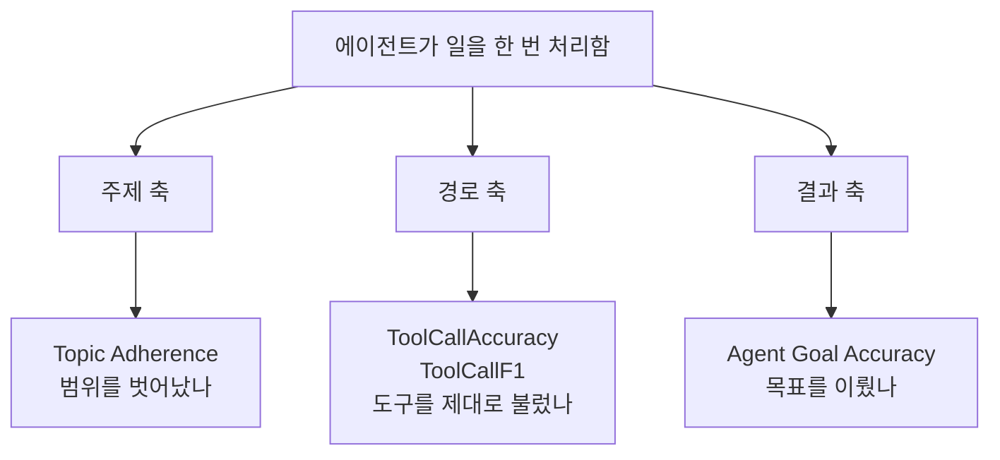
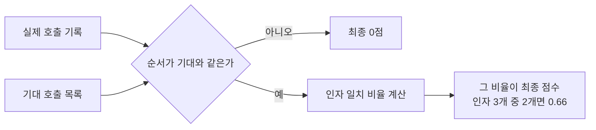
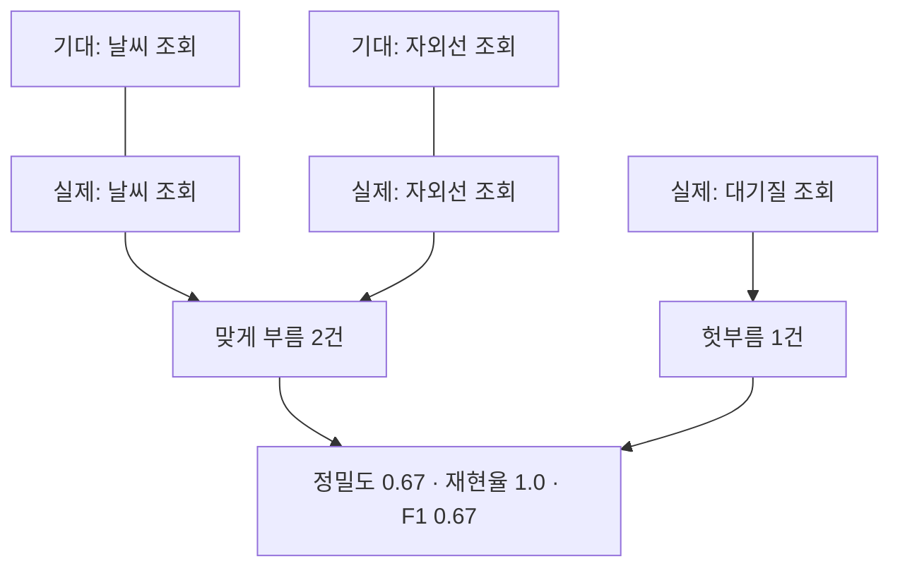

# A08 에이전트가 도구를 제대로 썼는지 재는 법 — 쉬운 해설

## 한 줄 요약

AI 에이전트가 일을 잘했는지, 최종 답만 보고 판단해도 될까요?  
답이 맞아도 가는 길이 틀릴 수 있어서, Ragas는 길 자체를 점수로 잽니다.

## 3분 요약

- Ragas는 AI 응답 품질을 점수로 재는 도구 모음입니다.  
  이 문서는 그중 **에이전트 전용 지표 4가지**를 다룹니다.
- 지표는 보는 각도가 다릅니다.  
  주제를 지켰나, 도구를 제대로 불렀나, 목표를 이뤘나 세 갈래입니다.
- 도구를 제대로 불렀는지는 두 지표로 봅니다.  
  하나는 순서까지 깐깐하게 보고, 다른 하나는 순서를 안 봅니다.
- 점수를 매기려면 **정답 목록**을 사람이 미리 만들어 둬야 합니다.  
  "이 질문에는 이 도구를 이 값으로 불러야 한다"는 목록입니다.
- 예전 방식으로 불러 쓰던 이름들은 곧 사라집니다.  
  새 이름으로 옮겨 쓰라고 문서가 여러 번 알려 줍니다.

## 왜 우리에게 중요한가

AI가 내놓은 답이 맞으면 다 된 걸까요? 그렇지 않습니다.  
답이 우연히 맞는 경우가 있습니다. 엉뚱한 도구를 부르고도 그럴듯한 말을 지어냅니다.  
이걸 걸러내려면 결과 말고 **과정**을 봐야 합니다.  
그런데 과정을 사람이 눈으로 보면 오래 걸리고, 볼 때마다 판단이 달라집니다.  
100건을 두 번 보는 것도 힘듭니다. 고치기 전후를 비교하기는 더 힘듭니다.  
이 문서의 지표는 그 눈대중을 숫자로 바꿔 줍니다.  
숫자가 되면 기준선을 잡고, 고치고, 다시 재는 일이 가능해집니다.

## 본문 풀이

### 1. 잘했다는 말은 한 가지가 아니다 — Agentic or Tool use

에이전트는 여러 단계를 밟아 일합니다. 그래서 잘잘못도 여러 군데서 갈립니다.  
원문은 첫머리에서 이 점을 짚습니다. 평가는 한 개 점수로 끝나지 않는다는 것입니다.  
이 문서가 담은 지표는 네 가지입니다.  
주제 지킴, 도구 호출 정확도, 도구 호출 F1, 목표 달성 정확도입니다.  
(해설자 보충) 이 넷은 서로 대체재가 아닙니다. 보는 곳이 아예 다릅니다.

### 2. 하라는 얘기만 했나 — Topic Adherence

챗봇에게 정해 준 담당 범위가 있다고 해 봅시다.  
카드사 상담 봇이라면 카드 관련 질문만 답해야 합니다.  
그런데 LLM은 물어보면 아무 얘기나 답해 버리는 성질이 있습니다.  
LLM은 사람 말을 알아듣고 글을 만들어 내는 대형 AI 모델을 뜻합니다.  
누가 "초콜릿 케이크 레시피 알려 줘"라고 하면 친절하게 알려 줍니다.  
이 지표는 그런 이탈을 잡습니다.  
쓰는 방법은 간단합니다. 허용 주제 목록을 미리 적어 주면 됩니다.  
그다음 대화 기록을 넣으면, 범위 안에서 답한 비율을 계산해 줍니다.  
계산 방식은 세 가지 중에 고를 수 있습니다.  
정밀도는 "답한 것 중에 몇 개가 범위 안이었나"를 봅니다.  
재현율은 "답했어야 할 것 중에 몇 개를 실제로 답했나"를 봅니다.  
F1은 두 값을 하나로 합친 값입니다.  
(해설자 보충) 정밀도만 높이면 안전하게 다 거절해 버리는 봇이 나옵니다.  
그래서 재현율을 함께 봐야 합니다.

### 3. 맞는 도구를, 맞는 값으로, 맞는 순서에 — Tool call Accuracy

여기서부터가 이 문서의 핵심입니다.  
이 지표는 에이전트가 실제로 부른 도구와, 불렀어야 할 도구를 맞대어 봅니다.  
필요한 준비물은 두 가지뿐입니다. 대화 기록과 정답 호출 목록입니다.  
판정용 AI가 따로 필요 없습니다. 기계적으로 맞춰 보기 때문입니다.  
(해설자 보충) 그래서 값이 매번 같고, 돈도 들지 않습니다.

**무엇을 보는가**

두 가지를 봅니다. 순서와 인자입니다.  
인자는 도구를 부를 때 같이 넘기는 값입니다.  
날씨 조회 도구를 부를 때 넘기는 "서울"이 인자입니다.

**점수 매기는 방식**

먼저 순서를 봅니다. 기대한 순서와 어긋나면 그 자리에서 0점입니다.  
순서가 맞으면 인자를 봅니다. 맞은 인자의 비율이 곧 점수입니다.  
원문 예시로는 인자 3개 중 2개가 맞아 0.66이 나옵니다.  
즉 최종 점수는 인자 정확도에 순서 통과 여부를 곱한 값입니다.

**순서를 안 볼 수도 있다**

순서가 중요하지 않은 경우도 있습니다.  
파리와 런던 날씨를 동시에 물어보는 경우가 그렇습니다. 어느 쪽이 먼저든 상관없습니다.  
이럴 때는 순서 검사를 끄는 설정을 줍니다.  
반대로 "검색한 뒤에 걸러내기"처럼 순서가 뜻을 갖는 경우는 켜 둡니다.

### 4. 빠뜨림과 군더더기를 같이 본다 — Tool Call F1

앞 지표는 순서가 틀리면 0점이라 다소 매몰찹니다.  
조금 나아졌는지 보고 싶은데 계속 0점만 나오면 개선이 안 보입니다.  
이 지표는 그 빈틈을 메웁니다. 순서를 아예 보지 않습니다.  
대신 세 가지를 셉니다. 맞게 부른 것, 안 불렀어야 하는데 부른 것, 불렀어야 하는데 안 부른 것입니다.  
차례로 TP, FP, FN이라고 부릅니다.  
TP는 정답과 일치한 호출입니다. FP는 헛부름입니다. FN은 놓친 호출입니다.  
원문 예시를 보겠습니다. 날씨와 자외선을 물었는데 대기질까지 조회했습니다.  
정답 2건은 다 불렀으니 놓친 건 없습니다. 대신 헛부름이 1건입니다.  
그래서 정밀도 0.67, 재현율 1.0, F1은 0.67이 됩니다.  
한 가지 주의할 점이 있습니다. 인자는 봐줍니다가 없습니다.  
도구 이름이 같아도 인자가 하나라도 다르면 아예 못 맞힌 것으로 셉니다.  
파리 날씨를 물었는데 런던 날씨를 조회하면 0점입니다.

### 5. 결과만 맞으면 되는 경우 — Agent Goal Accuracy

앞의 두 지표는 길을 봅니다. 이 지표는 도착지만 봅니다.  
"파리행 항공권을 예약해 줘"를 생각해 봅시다.  
중간에 어떤 도구를 몇 번 불렀든 상관없이, 예약만 되면 성공인 경우가 있습니다.  
이럴 때 쓰는 지표입니다. 점수는 0 아니면 1로만 나옵니다. 중간값이 없습니다.  
두 가지 방식이 있습니다.  
첫째는 기대 결과 문장을 사람이 적어 주고 그것과 맞춰 보는 방식입니다.  
둘째는 그런 문장 없이, 대화만 보고 판단하는 방식입니다.  
둘째 방식은 대화에서 사용자가 뭘 원했는지를 먼저 짐작합니다.  
그리고 실제로 그게 이뤄졌는지를 다시 짐작해 둘을 비교합니다.  
(해설자 보충) 두 방식 모두 판정을 AI가 합니다. 그래서 호출 비용이 붙습니다.

### 6. 옛 이름은 곧 사라진다 — Legacy API (Deprecated)

지표 설명마다 같은 경고가 붙어 있습니다.  
예전에 쓰던 불러오기 경로가 다음 큰 버전에서 없어진다는 내용입니다.  
새 경로로 옮기라고 안내합니다.  
옮길 때 함정이 하나 있습니다. 경로만 바꿔서는 안 되는 지표가 있습니다.  
주제 지킴 지표는 이름 끝의 `Score`도 같이 떨어져 나갔습니다.  
(해설자 보충) 교재나 실습 코드를 쓸 때는 새 경로 쪽만 싣는 편이 좋습니다.

## 그림으로 보기

> 그림 1. 네 지표가 각각 어느 각도를 보는지 정리한 갈래도 — **정리자 작도. 원문에 없는 그림임**

> 그림 2. 도구 호출 정확도의 점수 계산 순서 — **정리자 작도. 원문에 없는 그림임**

> 그림 3. 도구 호출 F1이 헛부름을 세는 방식 — **정리자 작도. 원문에 없는 그림임**

## 용어 풀이

| 용어 | 우리말 | 한 줄 설명 |
|------|--------|-----------|
| Ragas | 라가스 | AI 응답 품질을 점수로 재 주는 공개 도구 모음 |
| LLM | 대규모 언어 모델 | 사람 말을 알아듣고 글을 만들어 내는 대형 AI 모델 |
| Tool call | 도구 호출 | AI가 외부 기능(검색·조회 등)을 불러 쓰는 행위 |
| argument | 인자 | 도구를 부를 때 함께 넘기는 값(예: 지역 이름) |
| Topic Adherence | 주제 지킴 | 정해 둔 주제 범위 안에서 답했는지 재는 지표 |
| ToolCallAccuracy | 도구 호출 정확도 | 순서와 인자를 함께 보는 도구 호출 채점 지표 |
| ToolCallF1 | 도구 호출 F1 | 순서를 보지 않고 빠뜨림·군더더기를 세는 지표 |
| Agent Goal Accuracy | 목표 달성 정확도 | 과정과 무관하게 결과만 0 또는 1로 재는 지표 |
| Precision | 정밀도 | 한 것 중에 맞은 것의 비율 |
| Recall | 재현율 | 해야 할 것 중에 실제로 한 것의 비율 |
| F1 | 에프원 | 정밀도와 재현율을 하나로 합친 값 |
| TP · FP · FN | 맞힘 · 헛부름 · 놓침 | 채점의 세 갈래. F1을 계산하는 재료 |

## 헷갈리기 쉬운 곳

- **점수가 높다고 답이 맞는 건 아닙니다.**  
  도구 호출 지표는 경로만 봅니다. 도구를 다 제대로 불러도 최종 답이 엉망일 수 있습니다.  
  마이데이터 금융상품 추천으로 치면, 조회는 정확했는데 추천 문구가 어색한 경우입니다.  
  그래서 답 품질을 재는 기존 지표와 **같이** 써야 합니다. 갈아 끼우는 게 아닙니다.
- **정답 목록은 저절로 생기지 않습니다.**  
  이 지표들은 "이렇게 불렀어야 한다"는 목록이 있어야 돌아갑니다.  
  그 목록을 만드는 일이 사실상 제일 오래 걸립니다. 사람이 손으로 적어야 합니다.
- **순서 검사를 켜고 끄는 판단이 필요합니다.**  
  기본값은 켜짐입니다. 병렬로 불러도 되는 도구들인데 켜 두면 억울하게 0점이 나옵니다.
- **인자를 얼마나 봐주는지가 두 지표에서 다릅니다.**  
  도구 호출 정확도는 인자 3개 중 2개만 맞아도 부분 점수를 줍니다.  
  반면 도구 호출 F1은 인자가 하나만 달라도 아예 못 맞힌 것으로 셉니다.
- **원문 숫자는 성능 측정값이 아닙니다.**  
  0.66, 0.67 같은 값은 설명하려고 만든 예시입니다. 실제 실험 결과가 아닙니다.

## 원문 정보와 확인 범위

- URL: `https://docs.ragas.io/en/stable/concepts/metrics/available_metrics/agents/`
- 발행일: 2025-12-09 (페이지 하단에 생성일·갱신일이 같은 날짜로 표기됨)
- 버전 표기: 없음. `stable` 경로라 내용이 예고 없이 바뀔 수 있음  
  따라서 인용할 때는 본 날짜(2026-08-05)를 같이 적어야 함
- 접근 수단: `curl`로 페이지를 내려받아 본문·목차·코드 예제를 뽑아 읽음  
  현행 이름이 맞는지는 `context7`으로 한 번 더 맞춰 봤고, 어긋나는 곳은 없었음
- 확인 상태: FULL (본문 전체를 읽음)
- 못 본 것: 없음. 좌우 메뉴·검색창처럼 본문이 아닌 부분만 뺐음  
  다만 각 지표가 속으로 어떻게 계산하는지는 이 페이지에 없음  
  판정용 AI에게 정확히 뭘 물어보는지 알려면 소스 코드를 따로 봐야 함
- 원문에 그림은 한 장도 없음. 위 그림 3개는 모두 정리자가 새로 그린 것임
- 정리본: A08_tool_ragas-agent-metrics.md
