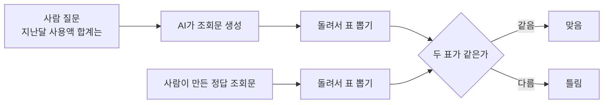
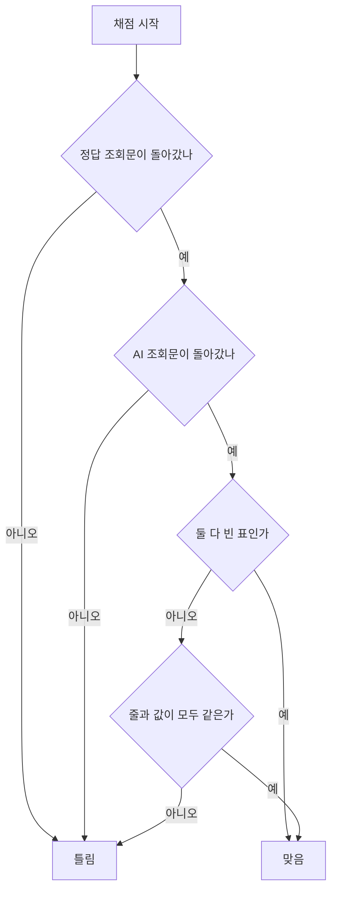
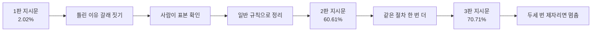

# A09 말로 물으면 SQL로 바꿔 주는 AI, 어떻게 채점하나 — 쉬운 해설

## 한 줄 요약

AI가 만든 SQL이 맞는지 어떻게 확인할까요?  
글자를 맞춰 보는 게 아니라, **실제로 돌려서 나온 표**를 정답 표와 맞대어 봅니다.

## 3분 요약

- 사람이 말로 물으면 AI가 조회 명령문으로 바꿔 주는 기능을 다룹니다.  
  그 결과가 맞는지 자동으로 채점하는 방법이 이 글의 주제입니다.
- 채점 기준은 딱 하나입니다. **돌렸을 때 같은 표가 나오는가**입니다.  
  명령문 생김새가 달라도 결과만 같으면 맞은 걸로 칩니다.
- 점수는 맞음·틀림 둘 중 하나만 나옵니다. 부분 점수가 없습니다.
- 채점하려면 정답 명령문을 사람이 미리 만들어 둬야 합니다.  
  정답도 그 자리에서 같이 돌려서 표를 뽑기 때문입니다.
- 모델을 바꾸지 않고 지시문만 세 번 고쳐서 정확도를 크게 올린 사례를 보여 줍니다.

## 왜 우리에게 중요한가

숫자를 다루는 질문은 문서 검색으로 답할 수 없습니다.  
"지난달 카드 사용액 합계"는 표에서 계산해야 나오는 값입니다.  
그래서 말을 조회 명령문으로 바꾸는 경로가 따로 필요합니다.  
문제는 이 경로가 틀렸을 때 티가 잘 안 난다는 점입니다.  
AI는 그럴듯한 명령문을 만들어 냅니다. 숫자도 멀쩡하게 하나 나옵니다.  
그 숫자가 틀렸다는 걸 알려면 사람이 표를 직접 뒤져 봐야 합니다.  
100건을 그렇게 확인하기는 어렵습니다. 이 글은 그 확인을 자동으로 돌리는 방법입니다.

## 본문 풀이

### 1. 이 글이 데려가는 길 — How to evaluate a Text to SQL Agent

이 글은 개념 설명서가 아니라 따라 하는 안내서입니다.  
네 단계를 순서대로 밟습니다.  
기준 점수 재기, 채점 기준 만들기, 채점 자동화, 그리고 고쳐서 다시 재기입니다.  
(해설자 보충) 이 순서 자체가 핵심입니다. 먼저 재고 나서 고쳐야 개선이 보입니다.

여기서 SQL이라는 말이 계속 나옵니다.  
SQL은 표 형태 데이터베이스에 질문을 던지는 전용 언어입니다.  
말을 SQL로 바꾸는 일을 Text-to-SQL이라고 부릅니다.

### 2. 문제집부터 만든다 — Prepare your dataset

채점을 하려면 문제와 정답이 있어야 합니다.  
원문은 회계 장부 데이터를 문제집으로 씁니다.  
쉬움, 보통, 어려움 세 난이도로 33문항씩 뽑아 총 99문항을 만듭니다.  
난이도를 고르게 섞은 이유가 있습니다.  
쉬운 문제만 모으면 점수가 부풀고, 어려운 문제만 모으면 개선이 안 보입니다.  
원문은 같은 문제가 중복으로 들어가지 않도록 걸러내는 과정도 함께 보여 줍니다.  
(해설자 보충) 여기 쓰인 데이터는 비영리 연구용으로만 허용됩니다.  
그래서 우리 교재에는 그대로 못 싣고, 만드는 방법만 빌려 와야 합니다.

### 3. AI에게 표 구조를 먼저 알려 준다 — Set up your text-to-SQL system

AI가 조회 명령문을 만들려면 표가 어떻게 생겼는지 알아야 합니다.  
어떤 표가 있고, 각 표에 어떤 칸이 있는지 말입니다.  
그래서 표 구조를 뽑아 지시문 안에 통째로 넣어 줍니다.  
지시문에는 표별 용도 설명도 함께 붙입니다.  
"이 표는 거래 내역, 저 표는 고객 정보"처럼 적어 주는 식입니다.  
지시문 끝에는 조회용 명령문만 만들라고 못 박아 둡니다.  
(해설자 보충) 이 부분이 중요합니다. 고치거나 지우는 명령은 애초에 만들지 않게 막는 셈입니다.

### 4. 정답을 어떻게 가르나 — Define evaluation metrics

이 글에서 가장 중요한 대목입니다.  
채점 방식은 이렇게 돌아갑니다.  
먼저 정답 명령문을 돌려 표를 하나 뽑습니다.  
다음으로 AI가 만든 명령문을 돌려 표를 하나 더 뽑습니다.  
그리고 두 표를 나란히 놓고 맞대어 봅니다. 똑같으면 맞음, 다르면 틀림입니다.

**표 비교는 어떻게 하나**

두 표를 맞대는 일은 전용 도구가 대신해 줍니다.  
비교 방식에는 몇 가지 약속이 있습니다.  
첫째, 위에서부터 같은 자리끼리 맞춰 봅니다. 그래서 줄 순서가 다르면 다른 것으로 봅니다.  
둘째, 소수점 오차는 아주 조금만 봐줍니다. 사실상 완전히 같아야 통과합니다.  
셋째, 양쪽 다 빈 표가 나오면 맞은 것으로 칩니다.  
넷째, 한쪽만 비어 있으면 틀린 것입니다.

**돌리다가 실패하면**

명령문이 아예 안 돌아가는 경우가 있습니다. 없는 칸 이름을 쓰거나 문법이 틀린 경우입니다.  
이때는 그냥 틀림으로 셉니다. 빼고 계산하지 않습니다.  
정답 명령문 쪽이 실패해도 마찬가지로 틀림입니다.

**이 채점 함수는 어디서 오나**

한 가지 짚어 둘 점이 있습니다.  
이 채점 함수는 Ragas 안에 미리 들어 있는 게 아닙니다.  
이 문서 안에서 직접 만들어 쓰는 방식입니다.  
Ragas는 그렇게 만든 함수를 여러 문항에 돌려 주는 틀만 제공합니다.

### 5. 먼저 바닥 점수를 잰다 — Run baseline evaluation

99문항을 한 번에 돌려 첫 점수를 냅니다. 이 첫 점수를 기준선이라고 부릅니다.  
원문의 첫 점수는 2.02%였습니다. 거의 다 틀렸다는 뜻입니다.  
그런데 명령문이 문법적으로 잘못된 건 아니었습니다. 다 잘 돌아갔습니다.  
업무 규칙을 몰라서 엉뚱한 표와 엉뚱한 칸을 골랐을 뿐입니다.  
(해설자 보충) 낮은 기준선은 나쁜 소식이 아닙니다. 고칠 자리가 뚜렷하다는 뜻입니다.

### 6. 왜 틀렸는지 갈래를 짓는다 — Analyze errors and failure patterns

틀린 문항을 그냥 세기만 하면 고칠 데를 못 찾습니다.  
그래서 틀린 이유에 이름을 붙여 갈래를 짓습니다.  
원문은 여덟 가지 이름을 미리 정해 둡니다.  
중복 제거를 빠뜨림, 엉뚱한 칸으로 걸러냄, 엉뚱한 표에서 값을 가져옴 같은 것들입니다.  
갈래 짓는 일은 AI에게 맡길 수 있습니다. 다만 그대로 믿지는 않습니다.  
원문은 사람이 다시 확인하는 절차를 따로 둡니다.  
많이 나온 유형부터 골라, 각 유형에서 5 ~ 10건을 직접 열어 봅니다.  
이때 정답 쪽이 실은 틀린 건 아닌지도 같이 봅니다.  
(해설자 보충) 정답 문항 자체에 오류가 섞이는 일은 흔합니다. 그래서 이 확인이 필요합니다.

### 7. 지시문을 고쳐 다시 잰다 — Improve your system

고칠 대상은 모델이 아니라 지시문입니다.  
원문은 원래 지시문을 남겨 두고 새 판을 따로 만듭니다.  
여기에 한 가지 원칙이 붙습니다. **문항별 땜질을 하지 말라**는 것입니다.  
"이 질문에는 이렇게 답해라"를 하나씩 넣으면 그 문제집에서만 점수가 오릅니다.  
새 질문에는 통하지 않습니다. 시험 문제만 외운 것과 같습니다.  
대신 표 구조에 근거한 일반 규칙을 씁니다.  
"건수를 셀 때는 거래 번호 기준으로 중복을 없애라" 같은 규칙입니다.  
이렇게 고쳐서 다시 돌리니 2.02%가 60.61%로 올랐습니다.  
같은 방식으로 한 번 더 고쳐 70.71%가 됐습니다.  
언제 멈출지도 정해 둡니다. 두세 번 연속으로 점수가 제자리면 멈춥니다.

### 8. 세 판을 나란히 놓고 본다 — Compare results

마지막으로 세 판의 점수를 한 표에 모아 비교합니다.  
1판에서 2판으로 갈 때 크게 뛰고, 2판에서 3판은 완만하게 오릅니다.  
(해설자 보충) 이 모양이 보통의 개선 곡선입니다.  
처음 몇 개 규칙이 대부분을 잡고, 그다음부터는 조금씩 올라갑니다.

## 그림으로 보기

> 그림 1. 채점 한 건이 흘러가는 순서 — **정리자 작도. 원문에 없는 그림임**

> 그림 2. 실패와 빈 결과까지 포함한 판정 갈래 — **정리자 작도. 원문에 없는 그림임**

> 그림 3. 재고 · 고치고 · 다시 재는 반복 고리 — **정리자 작도. 원문에 없는 그림임**

## 용어 풀이

| 용어 | 우리말 | 한 줄 설명 |
|------|--------|-----------|
| SQL | 표 조회 언어 | 표로 된 데이터베이스에 질문을 던지는 전용 언어 |
| Text-to-SQL | 말을 조회문으로 | 사람 말을 SQL 조회문으로 바꿔 주는 기능 |
| SELECT | 조회 | 데이터를 읽어 오기만 하는 SQL 명령. 고치거나 지우지 않음 |
| Ragas | 라가스 | AI 응답 품질을 점수로 재 주는 공개 도구 모음 |
| LLM | 대규모 언어 모델 | 사람 말을 알아듣고 글을 만들어 내는 대형 AI 모델 |
| execution accuracy | 실행 정확도 | 돌려서 나온 표가 정답 표와 같은지로 매기는 점수 |
| datacompy | 표 비교 도구 | 두 개의 표를 자동으로 맞대어 차이를 알려 주는 도구 |
| baseline | 기준선 | 고치기 전에 처음 잰 점수. 개선을 재는 출발점 |
| schema | 표 구조 | 어떤 표가 있고 각 표에 어떤 칸이 있는지에 대한 정의 |
| prompt | 지시문 | AI에게 무엇을 어떻게 하라고 적어 주는 글 |
| CSV | 쉼표 구분 표 파일 | 표 데이터를 줄과 쉼표로 적어 둔 단순 파일 형식 |
| CC BY-NC-SA | 비상업 공유 라이선스 | 상업적 사용을 금지하는 공개 자료 사용 조건 |

## 헷갈리기 쉬운 곳

- **글자가 달라도 맞을 수 있습니다.**  
  이 채점은 명령문 생김새를 보지 않습니다. 돌린 결과만 봅니다.  
  줄 순서를 바꿔 쓰든 괄호를 더 쓰든, 같은 표가 나오면 맞은 것입니다.
- **반대로 결과가 비슷해도 틀릴 수 있습니다.**  
  칸을 하나 더 붙여 오면 표 모양이 달라져 틀림 처리됩니다.  
  원문에도 답은 맞는데 칸을 아홉 개나 가져와 틀린 사례가 나옵니다.
- **정답 조회문을 만드는 일이 진짜 일입니다.**  
  채점은 자동이지만 정답은 자동이 아닙니다. 사람이 문항마다 손으로 만들어야 합니다.  
  마이데이터 금융상품 추천으로 치면, 문항 하나마다 "이 값이 정답"을 못 박는 작업입니다.
- **점수가 낮다고 모델을 바꾸는 건 이릅니다.**  
  원문 사례는 모델을 그대로 두고 지시문만 고쳐 2.02%에서 70.71%까지 갔습니다.  
  업무 규칙을 안 알려 준 게 원인이었기 때문입니다.
- **원문 숫자는 우리 목표치가 아닙니다.**  
  회계 데이터에 특정 모델 하나로 얻은 값입니다. 데이터가 바뀌면 그대로 나오지 않습니다.

## 원문 정보와 확인 범위

- URL: `https://docs.ragas.io/en/stable/howtos/applications/text2sql/`
- 발행일: 2025-12-09 (페이지 하단에 생성일·갱신일이 같은 날짜로 표기됨)
- 버전 표기: 없음. `stable` 경로라 내용이 예고 없이 바뀔 수 있음  
  따라서 인용할 때는 본 날짜(2026-08-05)를 같이 적어야 함
- 접근 수단: `curl`로 페이지를 내려받아 본문·목차·코드 예제 25개를 뽑아 읽음  
  코드가 현행 방식과 맞는지는 `context7`으로 한 번 더 맞춰 봤고, 어긋나는 곳은 없었음
- 확인 상태: FULL (본문 전체를 읽음)
- 못 본 것: 없음. 접어 둔 상세 블록까지 모두 펼쳐 읽었음  
  다만 조회문을 실제로 돌리는 부분의 속 내용은 이 페이지에 없음  
  시간 제한이나 가져올 줄 수 제한이 걸려 있는지는 예제 코드를 따로 봐야 알 수 있음
- 코드는 직접 돌려 보지 않았음. 따라서 내용 이해용으로만 읽어야 함
- 원문에 그림은 한 장도 없음. 위 그림 3개는 모두 정리자가 새로 그린 것임
- 정리본: A09_tool_ragas-text2sql.md
