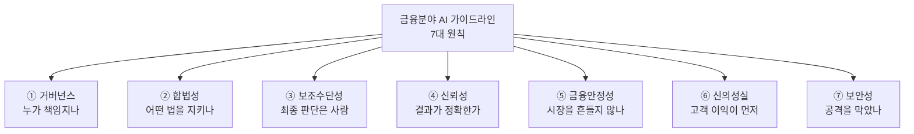
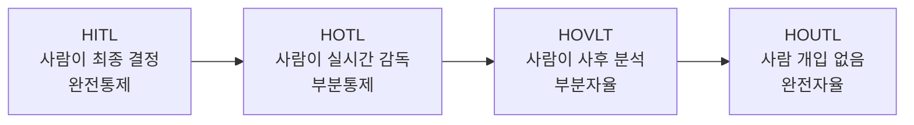
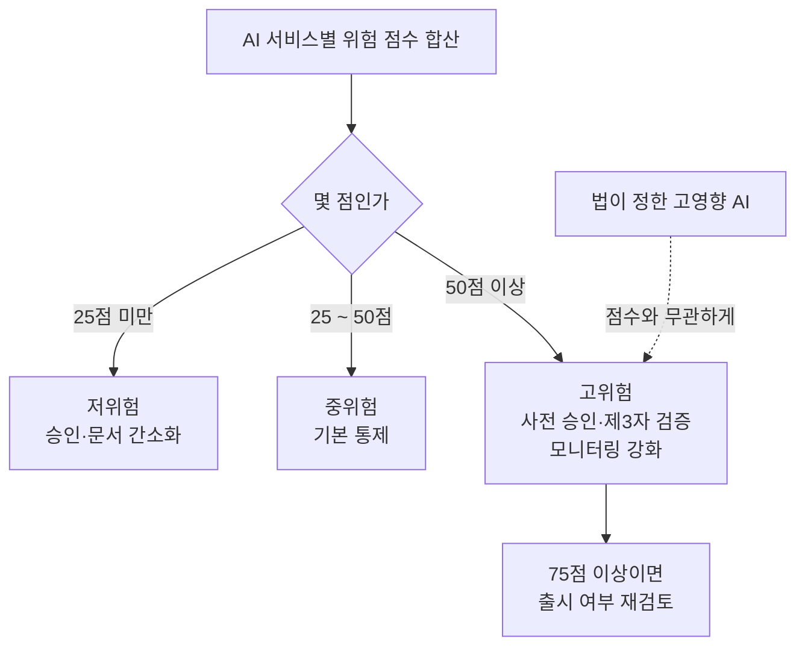

# A10 금융분야 인공지능 가이드라인 — 쉬운 해설

## 한 줄 요약

**질문**: 금융회사가 AI를 쓸 때 무엇을 지켜야 하나요?  
**답**: 금융위원회가 정한 7가지 원칙을 지켜야 합니다.  
그중 핵심은 "AI는 도우미일 뿐, 최종 결정은 사람이 한다"입니다.

## 3분 요약

- 금융위원회가 2026년 6월 18일에 발표하고, 6월 22일부터 시행한 문서입니다.  
  법이 아니라 **자율규제**입니다. 회사가 스스로 지키는 약속에 가깝습니다.
- 원칙은 7개입니다. 거버넌스 · 합법성 · 보조수단성 · 신뢰성 · 금융안정성 · 신의성실 · 보안성.  
  각 원칙 끝에는 `예 / 아니오` 체크리스트가 붙어 있습니다.
- 가장 중요한 원칙은 **보조수단성**입니다.  
  AI가 대출을 거절해도, 그 결정에 서명하는 사람은 직원이어야 합니다.
- AI 서비스마다 위험 점수를 매기고 저·중·고위험으로 나눕니다.  
  등급이 높을수록 승인 절차와 감시가 빡빡해집니다.
- 자율규제지만 예외가 있습니다.  
  인공지능기본법이 정한 사항은 법적 의무이므로 반드시 지켜야 합니다.

## 왜 우리에게 중요한가

우리 교육은 금융 케이스를 씁니다.
마이데이터 금융상품 추천, 카드사 상담이 그것입니다.
실습에는 가짜로 만든 합성 데이터를 씁니다.
그래서 "실제 규제는 우리와 상관없다"고 생각하기 쉽습니다.
하지만 설계는 다릅니다.
어디에서 사람이 개입할지, 무엇을 화면에 표시할지는 설계 단계에서 정합니다.
이 문서는 그 판단의 국내 근거가 됩니다.
합성 데이터를 쓰더라도 설계 판단은 똑같이 해봐야 합니다.

## 본문 풀이

### 1. 이 문서가 왜 나왔나 — Ⅰ. 금융분야 인공지능 가이드라인 개요

금융위원회는 예전에도 AI 관련 안내서를 세 번 냈습니다.
2021년, 2022년, 2023년입니다.
그 뒤로 두 가지가 크게 바뀌었습니다.

첫째, 생성형 AI와 AI 에이전트가 등장했습니다.
둘째, 인공지능기본법이 만들어졌습니다.
이 법은 2025년 1월에 제정되고 2026년 1월에 시행됐습니다.

이 변화를 반영해 기존 안내서를 하나로 합치고 고친 것이 이 문서입니다.
문서 스스로 "앞으로도 계속 고쳐 나가겠다"고 밝히고 있습니다.
그래서 인용할 때는 "2026년 6월판 기준"이라고 붙이는 것이 안전합니다.

적용 대상은 넓습니다.
은행, 보험사, 카드사, 증권사가 기본입니다.
핀테크 같은 비금융회사도 포함될 수 있습니다.
그 회사의 AI 결과가 금융거래에 영향을 준다면 대상이 됩니다.

### 2. 누가 책임지는지 정하기 — 1. 거버넌스 원칙

**거버넌스**는 "누가 무엇을 결정하고 책임지는가"를 정해 두는 틀입니다.

이 원칙이 요구하는 것은 세 가지입니다.
AI 관련 최고 의사결정기구를 두고, 위험관리 전담 조직을 따로 만들고, 내부 규정을 정비하는 것입니다.

핵심은 **조직 분리**입니다.
AI를 만드는 조직과 AI 위험을 감시하는 조직은 달라야 합니다.
(해설자 보충) 시험 문제를 낸 사람이 자기 답안을 채점하면 안 되는 것과 같습니다.

또 하나 중요한 것이 **위험평가 체계**입니다.
AI 서비스마다 위험 점수를 매깁니다.
점수를 합산해 저위험 · 중위험 · 고위험으로 나눕니다.
등급별로 통제 강도를 다르게 적용합니다.

저위험은 사내 번역이나 코드 생성 같은 것입니다.
승인 절차를 줄여 줍니다.
고위험은 윤리위원회 사전 승인과 외부 검증까지 받아야 합니다.

한 가지 예외가 있습니다.
법이 정한 `고영향 AI`는 점수와 상관없이 자동으로 고위험이 됩니다.
대출심사가 대표적입니다.

### 3. 어떤 법을 지켜야 하나 — 2. 합법성 원칙

AI를 쓰는 업무마다 적용되는 법이 다릅니다.
문서는 업무별로 법을 정리해 두라고 합니다.

대출심사와 신용평가는 신용정보법이 핵심입니다.
투자 자문은 자본시장법과 금융소비자보호법이 붙습니다.
이상거래 탐지는 특정금융정보법이 관련됩니다.

여기서 나오는 개념이 **동의 요건**입니다.
고객 데이터를 학습이나 추론에 쓰려면 동의 범위 안이어야 합니다.
동의 없이 모은 정보를 다른 목적에 쓰면 안 됩니다.

외부 업체에 맡긴 AI도 예외가 아닙니다.
위탁했다고 책임이 넘어가지 않습니다.
계약서에 법규 준수 의무를 적고, 직접 점검해야 합니다.

해외 고객을 상대한다면 외국 규제도 봐야 합니다.
유럽, 미국, 일본, 중국의 규제를 예로 들고 있습니다.

### 4. 최종 결정은 사람이 한다 — 3. 보조수단성 원칙

이 원칙이 우리 교육과 가장 직접 이어집니다.
원문의 표현은 이렇습니다.

> "현 단계에서 인공지능은 업무의 보조수단이므로 최종 의사결정과 그에 따른 책임은 임직원이 수행함"

즉 AI는 추천까지만 합니다.
결정과 책임은 사람 몫입니다.

문서는 사람이 개입하는 방식을 네 가지로 나눕니다.
`HITL`(Human-in-the-loop) · `HOTL`(Human-on-the-loop) · `HOVLT`(Human-over-the-loop) · `HOUTL`(Human-out-of-the-loop)입니다.
왼쪽으로 갈수록 사람이 많이 개입합니다.

**HITL**은 사람의 승인 없이는 AI가 결정을 못 내리는 방식입니다.
고위험 AI에는 이 방식을 써야 합니다.
대출심사가 예로 나옵니다.

사람이 개입할 도구도 요구합니다.
**Override**는 AI 권고를 무시하거나 뒤집는 기능입니다.
**Kill switch**는 이상할 때 AI를 즉시 멈추는 기능입니다.
이 두 가지는 고위험 AI에 **필수**입니다.
실시간 감시 대시보드는 필수가 아니라 권고입니다.

책임 분담을 적는 도구로 **RACI** 차트를 예로 듭니다.
누가 실무를 맡고 누가 최종 승인하는지 표로 정리하는 방식입니다.

마지막은 교육입니다.
목표는 **자동화 편향**을 막는 것입니다.
사람이 AI 답을 검토 없이 그대로 받아들이는 습관을 말합니다.
문서는 AI를 정답을 내주는 해결사가 아니라 판단을 거드는 조수로 보라고 합니다.

### 5. 결과를 믿을 수 있게 하기 — 4. 신뢰성 원칙

네 가지를 다룹니다.
성능 관리, 데이터 품질, 공정성, 설명가능성입니다.

**성능 관리**는 지표를 정해 두고 정기 점검하는 것입니다.
업무마다 지표가 다릅니다.
신용평가는 실제 부실률과 예측의 차이를 봅니다.
챗봇은 응답 정확도와 만족도를 봅니다.

생성형 AI에는 **환각** 문제가 있습니다.
사실이 아닌 내용을 사실처럼 만들어 내는 현상입니다.
문서는 출처 표시, 신뢰도 점수, 위험 고지 같은 완화 수단을 제시합니다.

**데이터 품질**은 정확성 · 완전성 · 일관성 · 대표성 · 적시성을 봅니다.
데이터가 어디서 왔는지 추적할 수 있어야 합니다.

**공정성**은 특정 집단에 불리하지 않은지 보는 것입니다.
성별, 연령, 지역별로 승인율을 비교합니다.
차이가 크면 원인을 찾아 고칩니다.

**설명가능성**은 "왜 그런 결정을 했나"를 설명하는 것입니다.
이 분야 기술을 **XAI**라고 부릅니다.
대표 기법으로 **SHAP**을 듭니다.
어떤 항목이 결과에 얼마나 기여했는지 수치로 보여주는 방법입니다.

설명은 어려운 말로 하면 안 됩니다.
문서는 전문 지식 없는 고객도 이해할 쉬운 말로 설명하라고 합니다.
다만 영업 기밀과 개인정보는 보호해야 하므로 수위를 조절합니다.

### 6. 시장 전체를 흔들지 않기 — 5. 금융안정성 원칙

앞의 원칙들은 한 회사, 한 고객의 문제를 다룹니다.
이 원칙은 시장 전체를 봅니다.

위험 요인 네 가지를 듭니다.
특정 업체에 대한 쏠림, 시장 동조화, 사이버 위험 확대, 모델·데이터 위험입니다.

(해설자 보충) 여러 회사가 같은 AI 모델을 쓰면 어떻게 될까요?
같은 상황에서 같은 판단을 내립니다.
모두 동시에 팔면 시장이 급락합니다.
이것이 동조화 위험입니다.

대비책으로 두 가지를 듭니다.
하나는 **백업모형**입니다.
AI가 고장 나면 예전 통계 모델로 돌아갑니다.
다른 하나는 긴급정지 기능입니다.

외부 업체 위험도 다룹니다.
클라우드나 외부 모델에 얼마나 의존하는지 목록으로 관리하라고 합니다.
사고가 나면 감독당국에 즉시 보고해야 합니다.

### 7. 고객 이익을 먼저 두기 — 6. 신의성실 원칙

두 가지를 다룹니다.
이해상충 방지와 소비자 보호입니다.

**이해상충**은 회사 이익과 고객 이익이 부딪치는 상황입니다.
상품 비교·추천이 대표 사례입니다.
자사 상품이나 수수료 높은 상품을 위로 올리면 문제가 됩니다.
문서는 알고리즘을 정기 점검하라고 합니다.

우리 교육 케이스에 바로 걸립니다.
마이데이터 금융상품 추천에서 무엇을 위에 놓을지가 이 문제입니다.

소비자 보호는 **사전 고지**가 핵심입니다.
고객에게 영향을 주는 AI를 쓴다면 미리 알려야 합니다.
계약서, 약관, 상품설명서, 화면 표시 어디든 좋습니다.

한 가지 더 있습니다.
고객이 원하면 AI가 아닌 기존 방식을 쓸 수 있어야 합니다.
챗봇만 있으면 안 되고 사람 상담원 연결 통로가 필요합니다.

### 8. AI만의 공격을 막기 — 7. 보안성 원칙

일곱 원칙 중 가장 깁니다.
점검 항목만 38개입니다.

기존 정보기술 보안으로는 막지 못하는 새 위협이 있습니다.
데이터 오염, 모델 정보 유출, **프롬프트 인젝션**, 탈옥 공격 등입니다.

프롬프트 인젝션은 이렇게 동작합니다.
공격자가 "이전 지시는 무시해"라는 문장을 몰래 끼워 넣습니다.
AI가 원래 규칙을 잊고 시키는 대로 합니다.

우리 교육의 가드레일 설계와 직접 이어지는 부분이 있습니다.
**출력 측 검사**입니다.
AI가 내보내는 내용에 주민등록번호나 카드번호가 섞이면 안 됩니다.
자동으로 찾아 가리거나 지우는 기능을 만들라고 합니다.
에러 메시지에 모델 정보가 새는 것도 막아야 합니다.

외부에서 가져온 모델과 데이터도 검증 대상입니다.
오픈소스 모델은 내려받기 전에 파일이 변조됐는지 확인합니다.
외부 **LLM** 서비스를 쓸 때는 우리 데이터가 학습에 재사용되지 않도록 계약서에 씁니다.

마지막으로 방향을 하나 제시합니다.
"AI 공격은 AI로 막는다"는 것입니다.
보안 업무에도 AI를 적극 쓰라는 권고입니다.

## 그림으로 보기

> 그림 1. 7대 원칙을 한 장으로 정리한 것 — **정리자 작도. 원문에 없는 그림임**

> 그림 2. 사람이 개입하는 네 가지 방식. 고위험 AI는 맨 왼쪽을 써야 함 — **정리자 작도. 원문에 없는 그림임**

> 그림 3. 위험 점수로 등급을 나누고 통제 강도를 달리하는 흐름 — **정리자 작도. 원문에 없는 그림임**

## 용어 풀이

| 용어 | 우리말 | 한 줄 설명 |
|------|--------|-----------|
| AI (Artificial Intelligence) | 인공지능 | 사람의 학습·추론·판단 능력을 전자적으로 구현한 것 |
| HITL (Human-in-the-loop) | 사람이 고리 안에 | 사람의 승인 없이는 AI가 최종 결정을 못 내리는 방식 |
| HOTL (Human-on-the-loop) | 사람이 고리 위에 | AI가 결정하되 사람이 실시간 감독하고 언제든 끼어드는 방식 |
| HOVLT (Human-over-the-loop) | 사람이 고리 너머에 | AI가 자율 운영하고 사람은 사후에 결과를 분석하는 방식 |
| HOUTL (Human-out-of-the-loop) | 사람이 고리 밖에 | 사람 개입 없이 AI가 전부 자율로 처리하는 방식 |
| Override | 재정의 | AI 권고를 사람이 무시하거나 뒤집을 수 있게 하는 기능 |
| Kill switch | 긴급정지 | 이상 상황에서 AI를 즉시 멈추고 격리하는 기능 |
| XAI (eXplainable AI) | 설명가능 인공지능 | AI가 왜 그렇게 판단했는지 설명해 주는 기술 |
| SHAP | 샤플리 기반 설명 기법 | 각 입력 항목이 결과에 얼마나 기여했는지 수치로 보여주는 방법 |
| RACI | 책임분담 차트 | 실무자·최종책임자·의견제시자·통보대상자를 표로 정리한 것 |
| LLM (Large Language Model) | 거대 언어 모델 | 대량의 글로 학습해 문장을 생성하는 AI 모델 |
| 프롬프트 인젝션 (Prompt Injection) | 지시문 주입 공격 | 악의적 문장을 입력에 숨겨 AI가 원래 규칙을 어기게 만드는 공격 |

## 헷갈리기 쉬운 곳

- **자율규제인데 왜 지켜야 하나요?**  
  이 문서 자체는 법이 아닙니다. 하지만 인공지능기본법이 정한 부분은 법적 의무입니다.
  둘이 겹치면 법이 먼저입니다. "자율이니 안 지켜도 된다"는 잘못된 이해입니다.
- **고영향 AI와 고위험 AI는 다릅니다.**  
  고영향은 법이 정한 분류입니다. 고위험은 회사가 자체 평가로 매긴 등급입니다.
  고영향이면 자동으로 고위험이 되지만, 반대는 성립하지 않습니다.
- **점수 기준 25 / 50 / 75는 확정 숫자가 아닙니다.**  
  문서가 든 예시 값입니다. 회사가 자기 상황에 맞게 정하라고 되어 있습니다.
  교재에 옮길 때 "정해진 기준"처럼 쓰면 안 됩니다.
- **합성 데이터 실습에는 그대로 적용되지 않습니다.**  
  이 문서는 실제 개인신용정보를 다루는 운영 환경을 전제로 합니다.
  우리 실습은 가짜 데이터를 씁니다. 운영 요건을 실습 필수 요건처럼 적으면 안 됩니다.
  설계 판단 연습의 근거로만 쓰는 것이 맞습니다.
- **`최소수집`은 이 문서에 없습니다.**  
  비슷해 보이는 최소 권한 부여 조항은 접근 권한 이야기입니다.
  개인정보를 적게 모으라는 원칙과는 다릅니다. 그 근거는 다른 법에서 찾아야 합니다.

## 원문 정보와 확인 범위

- 원문(본문): 로컬 PDF `references/books/260618[별첨2-2] 금융분야 인공지능 가이드라인.pdf` (91쪽)
- 원문(보조): 금융위원회 보도자료 https://www.fsc.go.kr/no010101/87142
- 발행일: 2026년 6월 (표지 표기). 발표 2026-06-18, 시행 2026-06-22
- 발행 주체: 금융위원회
- 접근 수단: python `pdfplumber`로 PDF 91쪽 전량 텍스트 추출. 보도자료는 `curl`로 저장 후 판독.
  `pdftotext`는 한글이 깨져 사용하지 못했고, `Read` 도구는 이 환경에서 PDF 렌더가 안 되어 쓰지 않음
- 확인 상태: FULL (본문 전 범위 판독)
- 못 본 것 1: 보도자료 첨부파일 6건 중 이 가이드라인 PDF 1건만 확보함. 나머지 5건은 미확인
- 못 본 것 2: 함께 배포된 「금융분야 AI 위험관리프레임워크」(금융감독원)와
  「금융분야 인공지능 보안 안내서」(금융보안원) 원문은 확보하지 못함
- 못 본 것 3: 원문의 조직도·흐름도 그림은 텍스트로만 읽어 시각적 배치는 확인하지 못함
- 그림 안내: 이 해설본의 그림 3개는 모두 정리자가 새로 그린 것이며 원문 그림이 아님
- 정리본: A10_reg_fsc-ai-guideline.md
