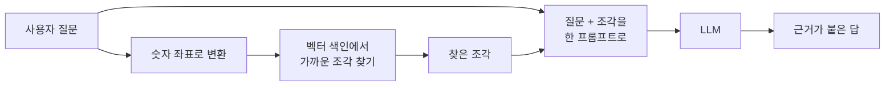
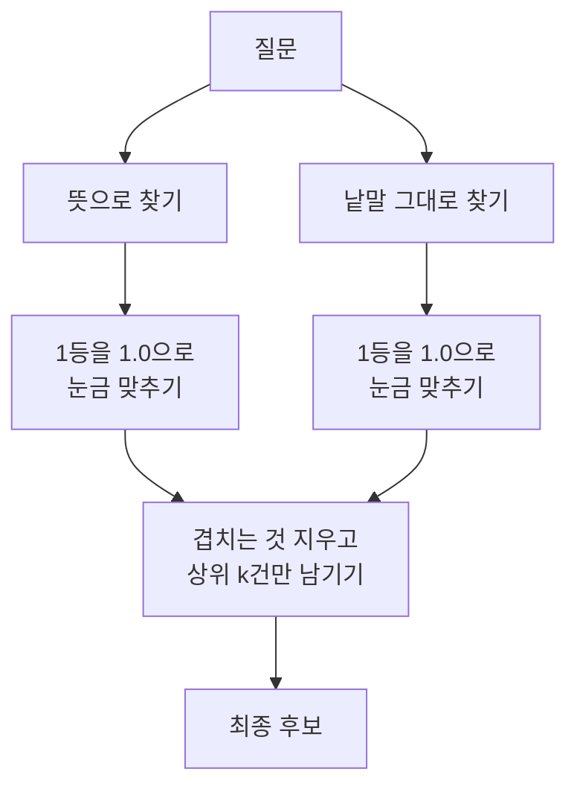
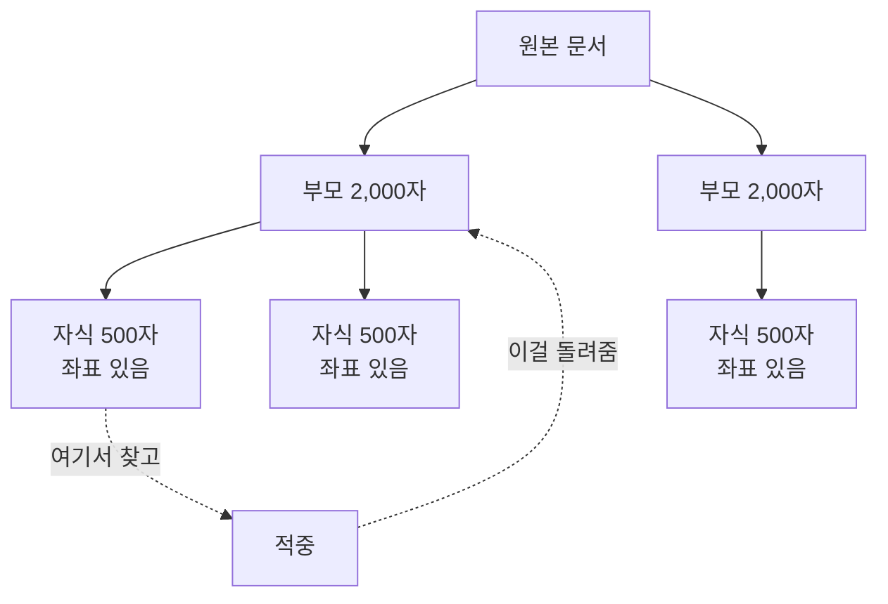
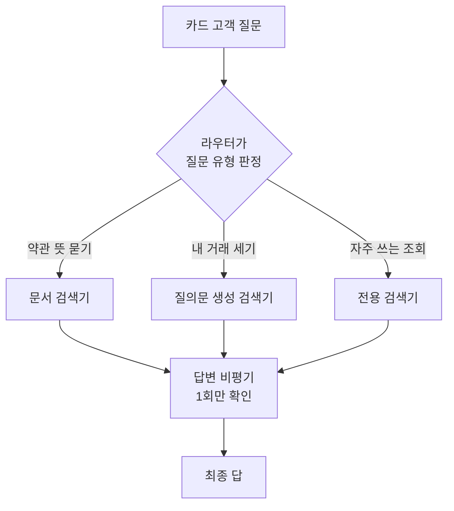

# B01 Essential GraphRAG — 쉬운 해설

## 한 줄 요약

이 책이 답하는 질문은 하나임.  
**"AI가 우리 회사 자료를 근거로 답하게 하려면 무엇을 어떻게 저장하고 찾아야 하는가."**  
답은 이렇습니다. 문서는 뜻으로 찾고, 숫자와 관계는 그래프로 찾고,  
둘을 한 저장소에 함께 두고, 마지막에 점수로 재라는 것임.

## 3분 요약

- AI는 배운 적 없는 회사 자료를 모릅니다. 그래서 답할 때 자료를 먼저 찾아서 넣어 줍니다.  
  이 방식을 **RAG**라고 부릅니다.
- 문서를 뜻으로 찾는 방법만으로는 부족합니다. 낱말 그대로 찾는 방법을 같이 씁니다.  
  둘을 합친 것이 **hybrid search**임.
- "몇 건인가", "합계가 얼마인가" 같은 질문은 뜻으로 찾을 수 없습니다.  
  이런 질문은 데이터베이스에 물어볼 질의문을 AI가 직접 써야 합니다.
- 문서에서 사람·회사·날짜 같은 알맹이를 뽑아 점과 선으로 엮으면 **knowledge graph**가 됩니다.  
  여러 문서에 흩어진 관계를 따라갈 수 있게 됩니다.
- 마지막은 평가입니다. 질문과 정답을 미리 만들어 두고 점수를 냅니다.  
  점수가 없으면 개선했는지 알 수 없습니다.

## 왜 우리에게 중요한가

우리 두 교육은 모두 "AI가 무엇을 근거로 답했는가"를 다룹니다.  
이 책은 그 근거를 만드는 과정을 처음부터 끝까지 한 줄로 보여 줍니다.  
문서를 조각내는 일부터 시작해서, 찾고, 그래프로 엮고, 점수를 매기는 데까지 갑니다.  
특히 같은 질문을 두 가지 방식으로 던져 결과를 비교하는 대목이 도움이 됩니다.  
어느 쪽이 항상 낫다고 말하지 않고, 각각이 못 하는 일을 분명히 적어 두었기 때문임.  
(해설자 보충) 다만 저자 두 명이 특정 그래프 데이터베이스 회사 소속입니다.  
그래서 "그래프가 낫다"는 대목은 그대로 믿지 말고 반대 자료와 함께 봐야 합니다.

## 본문 풀이

### 1. AI를 더 정확하게 만들기 — Improving LLM accuracy

**LLM**은 아주 많은 글을 읽고 다음 단어를 맞히도록 훈련한 프로그램임.  
사람처럼 말을 잘하지만 네 가지 약점이 있습니다.

- 배운 시점 이후의 일을 모릅니다.
- 그사이 바뀐 내용을 낡은 채로 말합니다.
- 모르는 것을 지어냅니다.
- 회사 내부 자료는 애초에 본 적이 없습니다.

처음에는 "계속 다시 가르치면 되지 않나" 하고 생각했습니다.  
그런데 다시 가르치는 데 드는 돈과 시간이 너무 큽니다.  
그래서 나온 답이 **RAG**임. 가르치는 대신 답할 때 자료를 옆에 놓아 주는 방식임.

일상 비유로 보면 이렇습니다.  
시험 볼 때 전부 외우게 하는 대신, 교과서를 펴 놓고 풀게 하는 것과 같습니다.  
외우는 양은 줄고, 대신 필요한 쪽을 빨리 찾는 능력이 중요해집니다.

책은 여기서 한 걸음 더 갑니다.  
자료를 어디에 담을지 고르라면 **knowledge graph**를 권합니다.  
이유는 성능이 좋아서가 아닙니다.  
표 같은 정형 자료와 문서 같은 비정형 자료를 한 곳에 담을 수 있어서임.

카드사 상담으로 바꿔 보겠습니다.  
"이 카드 연회비 면제 조건이 뭐죠"는 약관 문서를 찾아야 답합니다.  
"제가 지난달에 몇 번 썼죠"는 거래 표를 세어야 답합니다.  
두 질문이 한 대화에 섞여 들어옵니다. 그래서 둘을 같이 둘 곳이 필요합니다.

### 2. 뜻으로 찾기와 낱말로 찾기 — Vector similarity search and hybrid search

이 장은 RAG를 두 담당으로 나눕니다.  
자료를 찾아 오는 "찾는 담당"과, 그 자료로 답을 쓰는 "쓰는 담당"임.

찾는 담당을 만들려면 네 가지가 필요합니다.

- 원본 글 뭉치
- 글을 잘게 나누는 규칙 — 이것이 **chunking**임
- 글을 숫자 목록으로 바꾸는 모델 — 그 숫자 목록이 **embedding**임
- 비슷한 숫자 목록을 빨리 찾아 주는 **vector index**

**embedding**은 글의 뜻을 숫자 좌표로 옮긴 것임.  
뜻이 비슷하면 좌표도 가깝습니다. 그래서 "비슷한 뜻 찾기"가 계산으로 가능해집니다.

책의 예시는 아주 구체적입니다.  
논문 한 편을 500자씩 자르고, 앞뒤를 40자씩 겹쳤습니다.  
겹치는 이유는 답이 두 조각에 걸쳐 있을 때를 대비하기 위함임.  
단어가 중간에서 잘리지 않게 띄어쓰기 자리에서만 끊었습니다.

여기까지 하면 뜻으로 찾기가 됩니다.  
그런데 뜻으로만 찾으면 놓치는 게 있습니다.  
정확한 상품명이나 조항 번호처럼 글자 그대로 맞아야 하는 것임.

그래서 낱말 그대로 찾는 방법을 하나 더 붙입니다. 이것이 **full-text search**임.  
둘을 같이 돌려서 결과를 합치는 것이 **hybrid search**임.

합칠 때 문제가 하나 생깁니다. 두 방식의 점수 단위가 다릅니다.  
책은 각 방식의 1등 점수로 나눠서 눈금을 맞춥니다.  
그러면 두 쪽 다 1등이 1.0이 됩니다. 그다음 겹치는 것을 지우고 상위 몇 건만 남깁니다.

장 마지막에 저자가 스스로 한계를 적어 둡니다.  
하이브리드로도 자료가 복잡해지면 품질이 떨어진다고 합니다.  
이 문장이 다음 장들의 출발점임.

### 3. 검색을 더 잘하는 법 — Advanced vector retrieval strategies

검색이 안 될 때 흔히 모델을 바꾸려 합니다. 책은 그러지 말라고 합니다.  
먼저 질문을 고치고, 그다음 조각내는 방식을 고치라고 합니다.

**질문 고치기**  
사용자가 너무 좁게 물으면 맞는 문서를 못 찾습니다.  
그래서 질문을 한 단계 넓혀서 다시 씁니다.  
"2007년부터 2008년까지 어느 팀에 있었나"를  
"이 선수의 경력 전체가 어떻게 되나"로 바꾸는 식임.  
넓게 물으면 걸리는 문서가 늘어납니다.

마이데이터 추천으로 바꾸면 이렇습니다.  
"작년 11월에 낸 수수료가 얼마죠"보다  
"내 계좌 수수료 구조가 어떻게 되나"가 문서를 더 잘 물어 옵니다.

**조각내는 방식 고치기**  
조각이 크면 여러 얘기가 섞여 뜻이 뭉개집니다.  
조각이 작으면 정확히 찾지만 앞뒤 맥락이 잘립니다.

책의 해법은 둘을 분리하는 것임.  
찾기는 작은 조각으로 하고, 돌려주기는 큰 덩어리로 합니다.  
큰 덩어리를 부모, 작은 조각을 자식이라고 부릅니다.  
예시에서는 부모 2,000자, 자식 500자로 잡았습니다.

(해설자 보충) 도서관에 비유하면 이렇습니다.  
색인 카드로 정확한 문장을 찾고, 정작 건네주는 건 그 장 전체임.  
찾을 때의 정확도와 읽을 때의 맥락을 둘 다 챙기는 방식임.

책은 리랭킹이나 메타데이터 필터도 이름만 언급합니다.  
구현은 책 범위 밖이라고 못 박아 두었습니다.

### 4. 질문을 데이터베이스 질의문으로 바꾸기 — Generating Cypher queries from natural language questions

"스필버그가 감독한 영화 중 평점 상위 3편과 평균 점수"  
이 질문은 뜻으로 찾기로 절대 답할 수 없습니다.  
비슷한 문장을 찾는 게 아니라 세고 정렬해야 하기 때문임.

이런 질문은 데이터베이스에 직접 물어봐야 합니다.  
그래프 데이터베이스에 물어보는 말이 **Cypher**임.  
사람 질문을 Cypher로 바꾸는 일을 **text2cypher**라고 합니다.

책은 잘 되게 하는 방법을 딱 네 가지로 정리합니다.

- **예시 몇 개 붙이기** — 질문과 정답 질의문 쌍을 프롬프트에 넣어 줍니다.
- **스키마 알려주기** — 어떤 점과 선과 속성이 있는지 목록을 넣어 줍니다.
- **용어 이어주기** — "배우·감독·작가는 전부 Person이다"처럼 말을 맞춰 줍니다.
- **출력 형식 못 박기** — 설명 붙이지 말고 질의문만 내놓으라고 지시합니다.

스키마를 안 주면 AI가 이름을 지어냅니다.  
"영화의 제작 국가"를 찾을 때, 국가가 별도 점인데 속성으로 착각하는 식임.  
이럴 때 올바른 예시를 하나 넣어 주면 같은 유형이 함께 고쳐집니다.

카드사 상담으로 옮기면 용어 이어주기가 특히 중요합니다.  
현업은 "체크"라 부르고 테이블은 `DEBIT`으로 적혀 있는 일이 흔하기 때문임.

### 5. AI가 검색 방법을 스스로 고르기 — Agentic RAG

찾는 방법이 여러 개면 누군가는 골라야 합니다.  
AI에게 그 선택을 맡기는 구조를 에이전트형 RAG라고 부릅니다.

부품은 세 개임.

- **라우터** — 질문을 보고 어떤 검색기를 쓸지 고릅니다.
- **검색기들** — 실제로 자료를 찾아 오는 도구들임.
- **답변 비평기** — 답이 질문을 다 채웠는지 확인합니다.

책의 예시는 검색기 세 개를 둡니다.  
제목으로 영화 찾기, 배우로 영화 찾기, 그리고 나머지 전부를 맡는 **text2cypher**임.  
자주 쓰는 질문은 전용 검색기를 만들고, 나머지는 만능 검색기로 흘려보냅니다.

재미있는 장치가 하나 더 있습니다.  
"오스카를 가장 많이 받은 사람은 누구고, 그 사람은 살아 있나"  
이런 질문은 두 개로 쪼갭니다. 그리고 순서대로 처리합니다.  
앞 답이 나오면 그 답을 넣어 뒤 질문을 다시 씁니다.

답변 비평기는 부족한 부분을 새 질문 목록으로 돌려줍니다.  
다만 책의 구현은 이 확인을 **한 번만** 합니다.  
그래도 부족하면 그냥 사용자에게 넘깁니다.  
(해설자 보충) 무한 반복을 막는 아주 단순한 상한임.  
실제 서비스라면 상한을 몇 번으로 둘지 따로 정해야 합니다.

### 6. 문서에서 그래프 만들기 — Constructing knowledge graphs with LLMs

계약서 여러 건을 그냥 조각내서 넣으면 사고가 납니다.  
"A사와 맺은 계약의 지급 조건"을 물었는데  
B사 계약의 지급 조건 조각이 딸려 오기 때문임.  
"지급"과 "조건"이라는 낱말이 어느 계약서에나 있어서 생기는 일임.

그래서 문서에서 알맹이를 뽑아 구조로 만듭니다.  
AI에게 "이 틀에 맞춰서 채워라" 하고 빈 양식을 줍니다.  
계약 유형, 당사자, 시작일, 기간, 금액 같은 칸임.

책이 강조하는 요령이 두 가지 있습니다.

- 없을 수도 있는 칸은 **"없어도 된다"고 표시**해야 합니다.  
  안 그러면 AI가 빈칸을 채우려고 값을 지어냅니다.
- 값이 정해져 있으면 **고를 목록을 주고**, 아니면 예시만 줍니다.

뽑은 결과를 그래프 데이터베이스에 넣으면 점과 선이 생깁니다.  
계약 - 당사자 - 위치가 선으로 이어집니다.

그다음이 이 장의 핵심임. **entity resolution**임.  
같은 회사인데 이름이 조금씩 다르게 적히는 문제임.

- UTI Asset Management Company
- UTI Asset Management Company Limited
- UTI Asset Management Company Ltd

셋은 같은 회사지만 그래프에는 점 세 개로 들어갑니다.  
이걸 하나로 합치는 일임.

책의 답은 조금 냉정합니다.  
어디에나 통하는 방법은 없다고 못 박습니다.  
글자 비교, 묶음 나누기, 기계학습을 섞어 쓰되  
**업무 담당자가 "같다"의 기준을 정해야 한다**고 합니다.

우리 교육으로 옮기면 경계가 이렇게 나뉩니다.  
문서에서 알맹이를 뽑는 일은 AI가 잘합니다.  
같은 것끼리 합치는 기준은 사람이 정합니다.  
합치는 실행은 규칙 스크립트가 합니다.

마지막으로 원본 문서 조각도 그래프에 같이 붙여 둡니다.  
그래야 "이 결론의 원문이 어디냐"를 되짚을 수 있습니다.  
계약서 같은 문서는 글자 수로 자르지 말고 조항 단위로 자르라고 권합니다.

### 7. 다른 회사의 그래프 방식 — Microsoft's GraphRAG implementation

**이 장은 우리 교육의 구현 대상이 아닙니다.** 개념 비교용으로만 봅니다.

무엇이 다른가만 짧게 봅니다.  
6장은 정해진 양식에 맞춰 알맹이를 뽑았습니다.  
7장은 양식 없이 인물·장소·사건을 뽑고, 각각을 문장으로 요약합니다.

그다음이 특징적임.  
가까이 붙어 있는 것들끼리 묶음을 찾아냅니다.  
그리고 묶음마다 요약문을 미리 써 둡니다.

이렇게 해 두면 "이 이야기는 대체로 무슨 내용이냐" 같은  
아주 넓은 질문에 답할 수 있습니다.  
미리 써 둔 묶음 요약들을 모아서 다시 요약하면 되기 때문임.

대신 값이 비쌉니다.  
묶음마다 AI를 불러 요약해야 하므로 미리 만드는 비용이 큽니다.  
KT 3일 과정에서 이 장을 뺀 이유가 그것임.

### 8. 잘 되는지 점수로 재기 — RAG application evaluation

만들었으면 재야 합니다. 안 재면 개선했는지 알 수 없습니다.

재는 자리가 네 군데임.

- 도구를 맞게 골랐는가
- 찾아온 자료가 질문과 맞는가
- 그 자료로 답을 잘 썼는가
- 처음부터 끝까지 전체가 잘 돌았는가

먼저 시험 문제를 만듭니다. 책은 17문항을 씁니다.  
문항에 다섯 종류를 섞으라고 합니다.  
도구 선택을 보는 것, 이름 맞추기를 보는 것, 두 번 찾아야 하는 것,  
경계 상황, 그리고 인사말 같은 대화 처리임.

정답을 적는 방식이 영리합니다.  
정답을 글자로 적지 않고 **질의문으로 적습니다**.  
그러면 원본 데이터가 바뀌어도 정답이 자동으로 따라옵니다.

점수는 **RAGAS**라는 평가 도구로 냅니다. 지표는 세 개임.

- **맥락 재현율** — 답에 필요한 자료를 다 찾아 왔는가
- **충실도** — 답이 찾아온 자료 안에 머물렀는가. 지어내지 않았는가
- **정답 정확도** — 답이 정답과 얼마나 맞는가

책의 결과는 이렇습니다.  
지어내지 않는 점수는 아주 높았습니다.  
반면 다 찾아오는 점수와 정답 점수는 그보다 낮았습니다.  
저자의 해석은 "생성보다 검색이 발목을 잡는다"임.

관찰도 두 가지 남겼습니다.  
질의문을 새로 써야 하는 질문은 눈에 띄게 느렸습니다.  
그리고 채점을 AI가 하다 보니 점수가 들쭉날쭉한 사례가 있었습니다.

(해설자 보충) 우리 교육의 지표 이름과 완전히 같지는 않습니다.  
겹치는 것도 있고 이 책에 없는 것도 있습니다.  
교재를 쓸 때 이름을 하나로 맞춰 두어야 혼선이 없습니다.

### 부록. 실습 환경 — appendix: The Neo4j environment

그래프 데이터베이스를 띄우는 방법 세 가지를 안내합니다.  
데스크톱 앱, 도커, 그리고 클라우드임.

주의할 점이 하나 있습니다.  
클라우드 무료 등급에는 7장에 필요한 분석 라이브러리가 없습니다.  
7장을 하려면 유료 등급이 필요합니다.

실습 데이터는 영화 데이터셋을 씁니다.  
사람과 영화를 점으로 두고 출연·감독을 선으로 이은 작은 그래프임.  
(해설자 보충) 우리 교육은 금융 데이터를 쓰므로 구조가 다릅니다.  
띄우는 절차는 참고하되 데이터는 새로 만들어야 합니다.

## 그림으로 보기

> 그림 1. 문서를 뜻으로 찾아 답을 만드는 기본 흐름 — **정리자 작도. 원문 그림이 아님**

> 그림 2. 두 갈래로 찾은 뒤 눈금을 맞춰 합치는 하이브리드 검색 — **정리자 작도. 원문 그림이 아님**

> 그림 3. 작은 조각으로 찾고 큰 덩어리를 돌려주는 구조 — **정리자 작도. 원문 그림이 아님**

> 그림 4. 질문 유형에 따라 검색 경로가 갈라지는 흐름 — **정리자 작도. 원문 그림이 아님**

## 용어 풀이

| 용어 | 우리말 | 한 줄 설명 |
|------|--------|-----------|
| LLM | 대규모 언어 모델 | 아주 많은 글로 훈련해 다음 말을 이어 쓰는 AI |
| RAG | 검색 증강 생성 | 답하기 전에 자료를 찾아서 함께 넣어 주는 방식 |
| GraphRAG | 그래프 기반 RAG | 자료를 점과 선으로 엮어 두고 관계를 따라가며 찾는 방식 |
| embedding | 임베딩 | 글의 뜻을 숫자 좌표로 바꾼 것. 뜻이 비슷하면 좌표가 가까움 |
| chunking | 청킹 | 긴 글을 찾기 좋은 크기로 잘게 나누는 일 |
| vector index | 벡터 색인 | 비슷한 좌표를 빠르게 찾아 주는 자료 구조 |
| full-text search | 전문 검색 | 낱말이 글자 그대로 들어 있는지로 찾는 방식 |
| hybrid search | 하이브리드 검색 | 뜻으로 찾기와 낱말로 찾기를 같이 돌려 결과를 합치는 방식 |
| knowledge graph | 지식그래프 | 사람·회사·문서를 점으로, 관계를 선으로 이어 둔 저장 형태 |
| Cypher | 사이퍼 | 그래프 데이터베이스에 물어볼 때 쓰는 질의어 |
| text2cypher | 텍스트투사이퍼 | 사람 말 질문을 Cypher 질의문으로 바꾸는 일 |
| NL2SQL | 자연어 질의 변환 | 사람 말 질문을 관계형 데이터베이스의 질의어(SQL)로 바꾸는 일 |
| entity resolution | 개체 중복 해소 | 이름이 조금씩 다른 같은 대상을 하나로 합치는 일 |
| RAGAS | 라가스 | RAG 결과를 점수로 재는 평가 도구 |

## 헷갈리기 쉬운 곳

- **text2cypher와 NL2SQL은 다릅니다.**  
  둘 다 "사람 말을 질의문으로 바꾼다"는 점은 같습니다.  
  하지만 바꾸는 말이 다릅니다. Cypher는 그래프 데이터베이스용, SQL은 관계형 데이터베이스용임.  
  이 책의 4장은 Cypher 이야기임. 표를 다루는 NL2SQL의 근거로 그대로 쓰면 안 됩니다.  
  다만 예시 붙이기, 스키마 알려주기, 용어 이어주기, 출력 형식 못 박기  
  이 네 가지 요령은 질의어와 상관없이 공통이라 가져올 수 있습니다.
- **7장의 Microsoft GraphRAG는 우리 교육의 구현 대상이 아닙니다.**  
  KT 3일 과정은 그래프 구현을 한 가지로 고정했습니다.  
  묶음 요약을 미리 만드는 데 시간이 많이 들어서 뺐습니다.  
  개념을 비교하는 슬라이드에만 쓰고, 실습 지시문의 근거로는 쓰지 않습니다.
- **"그래프가 더 낫다"는 이 책만으로 단정할 수 없습니다.**  
  저자 두 명이 그래프 데이터베이스 회사 소속이고, 그 회사가 책을 무료로 배포합니다.  
  반대 결과를 담은 연구도 있습니다.  
  우열이 아니라 "어떤 질문에 어느 쪽이 맞는가"로 정리하는 편이 안전함.
- **하이브리드 검색이 만능은 아닙니다.**  
  저자 본인이 2장 끝에서 한계를 적어 두었습니다.  
  자료가 복잡해지면 하이브리드로도 품질이 떨어진다고 합니다.
- **찾기와 쓰기의 실패는 원인이 다릅니다.**  
  자료를 못 찾아온 것과, 자료는 맞는데 답을 잘못 쓴 것은 다른 문제임.  
  점수를 하나로 뭉뚱그리면 무엇을 고쳐야 할지 알 수 없습니다.

## 원문 정보와 확인 범위

- 원본 파일: `references/books/Essential-GraphRAG.pdf` (PDF 179쪽)
- 배포 페이지: `https://neo4j.com/essential-graphrag/` (전권 무료 배포)
- 서지: Tomaž Bratanič · Oskar Hane 저 / Manning / 2025-07 발행
- 판독 도구: `pdftotext`로 장 단위 추출 (2026-08-05). PDF 읽기 도구는 이 환경에서 동작하지 않았음
- 쪽 번호: 책에 인쇄된 쪽 번호는 PDF 쪽 번호에서 21을 뺀 값임
- 확인 상태: FULL — 본문 8개 장을 전부 읽었음
- 읽은 장: 1장 · 2장 · 3장 · 4장 · 5장 · 6장 · 7장 · 8장 · 부록
- 못 본 부분: 앞부속 21쪽(표지·목차·서문)과 뒤쪽 8쪽(참고문헌·색인)  
  둘 다 본문이 아니어서 내용 이해에는 영향이 없음
- 확인하지 않은 것: 책의 예제 코드를 실제로 돌려보지는 않았음
- 그림: 이 문서의 그림 4개는 모두 정리자가 새로 그린 것임. 책의 그림을 옮기지 않았음
- 정리본: B01_book_essential-graphrag.md
