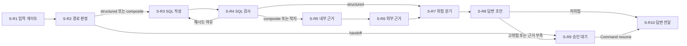

# W-1 고객 문의 동기 처리 워크플로우

## 개요

인증 문의 입력에서 시작해 문의 경로, 근거, 위험, 답변을 순서대로 처리함.  
고위험 또는 근거 부족이면 `S-R9`에서 승인 대기 후 재진입함.  
저위험 답변 또는 승인 결과 전달 뒤 종료함.



## 노드

| 워크플로우 | 단계ID | 노드 함수 이름 | 담당자 | 시간 제한 설정 | 다음 노드 |
|---|---|---|---|---|---|
| W-1 | S-R1 | `node_w1_s_r1_input_gate` | R-D1 | `s_r1_timeout_ms` | S-R2 |
| W-1 | S-R2 | `node_w1_s_r2_route_inquiry` | R-L1 | `s_r2_timeout_ms` | S-R3 또는 S-R9 |
| W-1 | S-R3 | `node_w1_s_r3_write_sql` | R-L1 | `s_r3_timeout_ms` | S-R4 |
| W-1 | S-R4 | `node_w1_s_r4_validate_query` | R-D1 | `s_r4_timeout_ms` | S-R3, S-R5, S-R7 |
| W-1 | S-R5 | `node_w1_s_r5_internal_evidence` | R-L1 | `s_r5_timeout_ms` | S-R6 |
| W-1 | S-R6 | `node_w1_s_r6_external_evidence` | R-D1 | `s_r6_timeout_ms` | S-R7 |
| W-1 | S-R7 | `node_w1_s_r7_risk_route` | R-D1 | `s_r7_timeout_ms` | S-R8 |
| W-1 | S-R8 | `node_w1_s_r8_answer_draft` | R-L1 | `s_r8_timeout_ms` | S-R9 또는 S-R10 |
| W-1 | S-R9 | `node_w1_s_r9_human_approval` | R-H1 | `s_r9_timeout_ms` | S-R10 |
| W-1 | S-R10 | `node_w1_s_r10_deliver_answer` | R-D1 | `s_r10_timeout_ms` | 종료 |

## 담당자 모듈

| 담당자 | 종류 | 모듈 파일 | 모델 | 워크플로우 | 호출 인터페이스 |
|---|---|---|---|---|---|
| R-L1 | LLM | `help_desk_workflow/roles/r_l1.py` | 사용 | W-1, W-2, W-3 | `model_invoke` |
| R-D1 | Deterministic | `help_desk_workflow/roles/r_d1.py` | 미사용 | W-1, W-2, W-3 | `operations` |
| R-H1 | Human | `help_desk_workflow/roles/r_h1.py` | 미사용 | W-1 | LangGraph `interrupt` |

## 진입 함수 의존성

`07-api-ui.md`의 조립 루트가 채워야 하는 항목임.  
조립 표의 행 수는 아래 두 표의 행 수 합과 같아야 함.

### 진입 함수 인자

| 진입 함수 | 인자 | 어느 프롬프트가 만든 것 | 언제 만드나 |
|---|---|---|---|
| `run_customer_inquiry` | `graph` | 06 `build_customer_inquiry_graph` | 요청마다 |
| `run_customer_inquiry` | `request` | 07 진입 API 요청 본문 | 요청마다 |
| `run_customer_inquiry` | `customer_ref` | 07 인증 세션 해석 | 요청마다 |
| `resume_customer_inquiry` | `graph` | 06 | 요청마다 |
| `resume_customer_inquiry` | `thread_id` | 07 승인 대기 목록에서 찾음 | 요청마다 |
| `resume_customer_inquiry` | `approval` | 07 재진입 API 요청 본문 | 요청마다 |

### 흐름 조립 의존성 `build_customer_inquiry_graph`

| 의존성 | 무엇 | 어느 프롬프트가 만든 것 | 언제 만드나 |
|---|---|---|---|
| `settings` | 설정 로더 | 01 | 기동 시 1회 |
| `deadline` | 요청 마감선 | 01 | 요청마다 |
| `operations` | R-D1 단계 5개: S-R1 · S-R4 · S-R6 · S-R7 · S-R10 | 06 계약 · 03 · 04를 부름 | 요청마다 |
| `model_invoke` | R-L1 모델 호출자 | 01 어댑터 | 기동 시 1회 |
| `approval_gate` | R-H1 승인 문 | 05 | 요청마다 |
| `max_iterations` | 반복 R-1 상한 | 01 설정에 칸이 없어 07이 값으로 넣음 | 기동 시 1회 |
| `telemetry` | 단계 기록 콜백 | 05 | 기동 시 1회 |
| `checkpointer` | 중간 저장 장치 | 01 | 기동 시 1회 |

`operations`와 `approval_gate`를 요청마다 만드는 이유는 커넥터 호출 상한 · Circuit Breaker ·
승인 표시 소모 기록이 **요청 사이에 새면 안 되기** 때문임.

## 상한과 착지

| 상한 종류 | 출처 | 착지 | 사유 필드 |
|---|---|---|---|
| 단계 시간 | ③ `타임아웃`과 01 `stage_budgets` | 안전 종료 | `_workflow.landing_reason` |
| 반복 R-1 | ③ `max_iter`와 조립 의존성 | S-R5 또는 안전 종료 | `_workflow.r1_error` |
| 흐름 전체 단계 | 사용자 확정 24 | LangGraph 중단 | LangGraph 재귀 상한 오류 |

## 재개

| 재개 단위 | 경계 | 중복 방지 키 | 부작용 |
|---|---|---|---|
| 승인 대기 1건 | S-R9 | W-1 + 고객 참조값 + 요청ID | 없음 |

## 인터페이스와 확인필요

| 구분 | 내용 |
|---|---|
| 재사용 | 05 `ApprovalGate`를 직접 사용하고 03 지식, 04 커넥터는 `operations`로 주입함 |
| 조정 | ④의 단일 계약을 지키기 위해 R-L1과 R-D1 모듈을 공통 모듈에 1벌만 둠 |
| 확인필요 1 | 01 설정에 R-1 반복 상한 필드가 없어 `max_iterations` 조립 의존성으로 주입함 |
| 변경요청 | ③ State에 API 입력, 응답, 단계 중간결과, 흐름 제어 필드 소유 규칙 추가 필요 |

## 되묻기로 정한 값

| 항목 | 확정값 | ③ 반영 권고 |
|---|---|---|
| 전체 단계 상한 | 24 | 흐름 상한 열 추가 |
| 병렬 합류 | 즉시 진행과 누락 표기 | 병렬 0건, 향후 규칙 기록 |
| 인간 개입 | 노드 앞 중단, 별도 중단 채널, State 재정의 | 재진입 경로 기록 |
| 동시 실행 | 1 | 부하 조건 기록 |
| 재시도 계층 | 커넥터만 | 단일 소유자 기록 |

## API 진입점

| 경로 | 하는 일 | 설계 출처 | 부분 전송 |
|---|---|---|---|
| `POST /v1/inquiries` | 고객 문의 실행 | ③ W-1 동기 요청 | `Accept: text/event-stream`이면 최종형 1회 |
| `POST /v1/inquiries/{request_id}/decisions` | 승인 대기 흐름 재진입 | ③ W-1 S-R9 | 아니오 |
| `GET /health/live` | 프로세스 생존 확인 | ⑧ 배포 입력 | 아니오 |
| `GET /health/ready` | 설정과 바깥 연결 준비 확인 | ⑧ 배포 입력 | 아니오 |

응답 필드는 `InquiryResult`의 `result_type`, `answer`, `handoff_ref`, `request_status`만 사용함.  
오류는 `code`, `message` 2개 필드만 반환하며 스택, 쿼리, 파일 경로, 모델 이름을 포함하지 않음.

## 포트

| 이름 | 환경변수 | 바깥 공개 | 결정 근거 |
|---|---|:---:|---|
| 고객 문의 API | `HELP_DESK_HTTP_PORT` | 예 | 사용자 승인 기본값 8080 |
| P-2 내부 API | `HELP_DESK_P2_INTERNAL_PORT` | 아니오 | 사용자 승인 기본값 8081 |
| P-3 내부 API | `HELP_DESK_P3_INTERNAL_PORT` | 아니오 | 사용자 승인 기본값 8082 |

포트 기본값은 `.env.example`에만 기록하며 Python 코드에는 숫자를 넣지 않음.

## 가상환경 만들기와 API 실행

### Windows Git Bash

```bash
uv sync --group dev
uv run uvicorn p1_sync_inquiry.api:app --host 0.0.0.0 --port "$HELP_DESK_HTTP_PORT"
```

### Windows PowerShell

```powershell
uv sync --group dev
uv run uvicorn p1_sync_inquiry.api:app --host 0.0.0.0 --port $env:HELP_DESK_HTTP_PORT
```

### Linux 또는 macOS

```bash
uv sync --group dev
uv run uvicorn p1_sync_inquiry.api:app --host 0.0.0.0 --port "$HELP_DESK_HTTP_PORT"
```

기본 `app`은 `runtime.py`의 조립 루트가 만든 실행기를 사용함.  
설정이 모두 있으면 W-1 그래프까지 연결된 앱이 되고, 필수 설정이 없으면
준비 미완료 앱으로 떨어지며 그 사유를 시작 로그에 남김.

필요한 값은 `common/.env.example`과 `tools/.env.example`에 있고,
비밀값 4개(`HELP_DESK_LLM_API_KEY`, `HELP_DESK_CHECKPOINT_URI`,
`HELP_DESK_CHECKPOINT_ENCRYPTION_KEY`, `HELP_DESK_MASKING_SALT`)는 따로 주입함.

## 조립 루트

| 모듈 | 하는 일 |
|---|---|
| `p1_sync_inquiry/runtime.py` | 설정 → 커넥터 → 도구 → 담당자 → 그래프를 엮어 실행기를 만듦 |
| `p1_sync_inquiry/operations.py` | R-D1 결정론 단계 5개(S-R1·S-R4·S-R6·S-R7·S-R10)의 실제 처리 |
| `help_desk_workflow/local_model.py` | `HELP_DESK_LLM_PROVIDER=local`일 때 쓰는 R-L1 대역 생성기 |

호출 상한과 Circuit Breaker는 ⑥ 정책에서 읽어 **요청 1건마다 새로 만듦**.
상한이 요청 사이에 새는 것을 막기 위함임.

## 조립 표

`07-api-ui.md` 5-1단계가 실제로 채운 결과임. 행 수 14개는 위 두 표의 행 수 합과 같음.

| 의존성 | 어느 프롬프트가 만든 것 | 언제 만드나 | 못 채웠으면 사유 |
|---|---|---|---|
| `graph` (`run_customer_inquiry`) | 06 | 요청마다 | 채움 |
| `graph` (`resume_customer_inquiry`) | 06 | 요청마다 | 채움 |
| `request` | 07 | 요청마다 | 채움 |
| `customer_ref` | 07 | 요청마다 | 채움: `derive_customer_ref`가 인증 세션 참조를 해싱 |
| `thread_id` | 07 | 요청마다 | 채움: 요청ID로 찾음. **프로세스 메모리에만 있어 재시작하면 잃음** |
| `approval` | 07 | 요청마다 | 채움 |
| `settings` | 01 | 기동 시 1회 | 채움 |
| `deadline` | 01 | 요청마다 | 채움 |
| `operations` | 06 계약 · 03 · 04 | 요청마다 | 채움: `operations.py`. **03 지식 경로는 안 부르고 C-A2 · C-A3 커넥터만 부름** |
| `model_invoke` | 01 | 기동 시 1회 | 채움: `HELP_DESK_LLM_PROVIDER=local`이면 대역 생성기 |
| `approval_gate` | 05 | 요청마다 | 채움 |
| `max_iterations` | 07 | 기동 시 1회 | 채움: `{"R-1": 1}` |
| `telemetry` | 05 | 기동 시 1회 | **못 채움**: `NodeTelemetryCallback`의 기록 항목이 State 키와 달라 값이 전부 비어 나옴 |
| `checkpointer` | 01 | 기동 시 1회 | 채움: 기동·종료 수명주기에 매어 둠 |

못 채운 항목 1건임. 나머지 13건은 채움.

## 응답 종류

| 상황 | `result_type` | `request_status` |
|---|---|---|
| 저위험 + 근거 충분 | `answer` | `completed` |
| S-R9 승인 대기 중 | `pending_approval` | `pending` |
| 승인 뒤 답변 전달 | `answer` | `completed` |
| 반려·중단 결정 | `handoff` | `failed` |
| 인계 경로로 접수 완료 | `handoff` | `completed` |
| 시간예산 부족으로 착지 | `safe_stop` | `failed` |

## API 되묻기 확정값

| 항목 | 확정값 | 기록 위치 |
|---|---|---|
| 부분 전송 순서 | 최종형 1회 | SSE 이벤트 `final` |
| 시간예산 초과 | 현재 안전 결과와 잘림 표시 | SSE 이벤트 `truncated` |
| OpenAPI | FastAPI 코드에서 자동 생성 | `/openapi.json` |
| 화면 프로토타입 | 사용자 승인에 따라 최소 구조 직접 설계 | `src/frontend/PROTOTYPE.md` |

## API 확인필요

| 확인필요 | 영향 |
|---|---|
| LLM 벤더와 모델 | `local` 대역으로 실행 중임. 운영 답변 품질은 벤더 확정 뒤에 확인 가능 |
| 실물 커넥터 | 5종 모두 Mock임. `HELP_DESK_CONNECTOR_MODE=real` 조립부는 아직 없음 |
| 승인 대기 목록 저장소 | 요청ID→스레드ID를 프로세스 메모리에 둠. 재시작하면 대기 건을 재개할 수 없음 |
| 단계 관측 기록 | `NodeTelemetryCallback`의 기록 항목이 State 키와 달라 아직 연결하지 않음 |
| S-R4 SQL 검사 중복 | P-2 `help_desk_dataset.source`와 같은 규칙을 `operations.py`에 다시 둠. 공통 모듈로 합칠 필요 있음 |

## API에서 안 만든 것

- 스케줄 배치를 공개 API로 여는 경로: 트리거가 스케줄 배치임
- 상담 종료 이벤트를 공개 API로 여는 경로: 트리거가 이벤트 구독임
- 관리자·통계·목록 화면: 설계서 ③에 없음
- P-2·P-3 내부 승인 API의 실행기: 배치·이벤트 트리거 조립이 먼저 필요함
