# W-2 상담 지식 개선 배치 워크플로우

## 개요

대상 업무일 배치를 시작해 상담 조회, 통계, 근거, 우선순위, FAQ 후보를 순서대로 생성함.  
`S-B9`에서 검토 결정을 기다림.  
승인 ID가 있을 때만 `S-B10` 등록을 실행함.

```mermaid
flowchart LR
  B1["S-B1 배치 시작"] --> B2["S-B2 상담 조회"] --> B3["S-B3 SQL 작성"]
  B3 --> B4["S-B4 SQL 검사"]
  B4 -->|재시도 여유| B3
  B4 -->|성공 또는 착지| B5["S-B5 주제 근거"]
  B5 --> B6["S-B6 외부 확인"] --> B7["S-B7 우선순위"] --> B8["S-B8 FAQ 작성"]
  B8 --> B9["S-B9 승인 대기"] -->|Command resume| B10["S-B10 후보 등록"]
```

## 노드

| 워크플로우 | 단계ID | 노드 함수 이름 | 담당자 | 시간 제한 설정 | 다음 노드 |
|---|---|---|---|---|---|
| W-2 | S-B1 | `node_w2_s_b1_start_batch` | R-D1 | `s_b1_timeout_ms` | S-B2 |
| W-2 | S-B2 | `node_w2_s_b2_load_consultations` | R-D1 | `s_b2_timeout_ms` | S-B3 |
| W-2 | S-B3 | `node_w2_s_b3_write_sql` | R-L1 | `s_b3_timeout_ms` | S-B4 |
| W-2 | S-B4 | `node_w2_s_b4_validate_query` | R-D1 | `s_b4_timeout_ms` | S-B3 또는 S-B5 |
| W-2 | S-B5 | `node_w2_s_b5_extract_topics` | R-L1 | `s_b5_timeout_ms` | S-B6 |
| W-2 | S-B6 | `node_w2_s_b6_verify_external` | R-D1 | `s_b6_timeout_ms` | S-B7 |
| W-2 | S-B7 | `node_w2_s_b7_rank_priority` | R-D1 | `s_b7_timeout_ms` | S-B8 |
| W-2 | S-B8 | `node_w2_s_b8_write_faq` | R-L1 | `s_b8_timeout_ms` | S-B9 |
| W-2 | S-B9 | `node_w2_s_b9_review_faq` | R-H2 | `s_b9_timeout_ms` | S-B10 |
| W-2 | S-B10 | `node_w2_s_b10_register_faq` | R-H2 | `s_b10_timeout_ms` | 종료 |

## 담당자 모듈

| 담당자 | 종류 | 모듈 파일 | 모델 | 워크플로우 | 호출 인터페이스 |
|---|---|---|---|---|---|
| R-L1 | LLM | `help_desk_workflow/roles/r_l1.py` | 사용 | W-1, W-2, W-3 | `model_invoke` |
| R-D1 | Deterministic | `help_desk_workflow/roles/r_d1.py` | 미사용 | W-1, W-2, W-3 | `operations` |
| R-H2 | Human | `help_desk_workflow/roles/r_h2.py` | 미사용 | W-2 | `interrupt`, 등록 operation |

## 진입 함수 의존성

`07-api-ui.md`의 조립 루트가 채워야 하는 항목임.  
조립 표의 행 수는 아래 두 표의 행 수 합과 같아야 함.

### 진입 함수 인자

| 진입 함수 | 인자 | 어느 프롬프트가 만든 것 | 언제 만드나 |
|---|---|---|---|
| `run_knowledge_batch` | `graph` | 06 `build_knowledge_batch_graph` | 실행마다 |
| `run_knowledge_batch` | `batch_id` · `batch_date` · `data_version` | 07 실행기 | 실행마다 |
| `resume_knowledge_batch` | `graph` · `thread_id` · `decision` | 06 · 07 · 07 | 요청마다 |

### 흐름 조립 의존성 `build_knowledge_batch_graph`

| 의존성 | 무엇 | 어느 프롬프트가 만든 것 | 언제 만드나 |
|---|---|---|---|
| `settings` | 설정 로더 | 01 | 기동 시 1회 |
| `deadline` | 실행 마감선 | 01 | 실행마다 |
| `operations` | R-D1 단계 6개: S-B1 · S-B2 · S-B4 · S-B6 · S-B7 · S-B10 | 06 계약 · 03 · 04를 부름 | 실행마다 |
| `model_invoke` | R-L1 모델 호출자 | 01 어댑터 | 기동 시 1회 |
| `approval_gate` | R-H2 승인 문 | 05 | 실행마다 |
| `max_iterations` | 반복 R-2 상한 | 01 설정에 칸이 없어 07이 값으로 넣음 | 기동 시 1회 |
| `telemetry` | 단계 기록 콜백 | 05 | 기동 시 1회 |
| `checkpointer` | 중간 저장 장치 | 01 | 기동 시 1회 |

## 조립 표

**조립 루트가 아직 없음.** 아래 11건 전부 못 채운 상태임.

| 의존성 | 어느 프롬프트가 만든 것 | 언제 만드나 | 못 채웠으면 사유 |
|---|---|---|---|
| `graph` · `batch_id` · `batch_date` · `data_version` · `thread_id` · `decision` | 06 · 07 | 실행·요청마다 | **못 채움**: 02:00 예약 실행 트리거 조립이 먼저 필요함 |
| `settings` · `deadline` · `model_invoke` · `checkpointer` | 01 | 기동 시 1회 · 실행마다 | **못 채움**: 조립 루트 없음 |
| `operations` (S-B1 · S-B2 · S-B4 · S-B6 · S-B7 · S-B10) | 06 계약 · 03 · 04 | 실행마다 | **못 채움**: R-D1 단계 6개의 실제 처리 함수 미작성 |
| `approval_gate` · `max_iterations` · `telemetry` | 05 · 07 · 05 | 실행마다 · 기동 시 1회 | **못 채움**: 조립 루트 없음 |

따라서 `POST /internal/faq-candidates/{candidate_id}/decisions`는 준비 미완료로 응답함.  
`p1_sync_inquiry/runtime.py`가 같은 구조의 참고 구현임.

## 상한과 착지

| 상한 종류 | 출처 | 착지 | 사유 필드 |
|---|---|---|---|
| 단계 시간 | ③ `타임아웃`과 01 `stage_budgets` | 안전 종료 | `_workflow.landing_reason` |
| 반복 R-2 | ③ `max_iter`와 조립 의존성 | S-B5 또는 안전 종료 | `_workflow.r2_error` |
| 흐름 전체 단계 | 사용자 확정 24 | LangGraph 중단 | LangGraph 재귀 상한 오류 |

## 재개

| 재개 단위 | 경계 | 중복 방지 키 | 부작용 |
|---|---|---|---|
| 대상 업무일 배치 1건 | S-B1부터 S-B10 성공 직후 | W-2 + 대상 업무일 + 데이터 버전 | 후보 중복 작성과 등록 가능 |

## 인터페이스와 확인필요

| 구분 | 내용 |
|---|---|
| 재사용 | 05 `ApprovalGate`를 직접 사용하고 지식 조회와 `ExternalTools`는 `operations`로 연결함 |
| 조정 | R-L1, R-D1을 공통 모듈에 1벌만 두고 3개 서비스에서 재사용함 |
| 확인필요 1 | 01 설정에 R-2 반복 상한 필드가 없어 `max_iterations` 조립 의존성으로 주입함 |
| 변경요청 | ③ State에 `data_version`, 단계 중간결과, 흐름 제어 필드 소유 규칙 추가 필요 |

## 되묻기로 정한 값

| 항목 | 확정값 | ③ 반영 권고 |
|---|---|---|
| 전체 단계 상한 | 24 | 흐름 상한 열 추가 |
| 병렬 합류 | 즉시 진행과 누락 표기 | 병렬 0건, 향후 규칙 기록 |
| 인간 개입 | 노드 앞 중단, 별도 중단 채널, State 재정의 | 재진입 경로 기록 |
| 동시 실행 | 1 | 부하 조건 기록 |
| 재시도 계층 | 커넥터만 | 단일 소유자 기록 |
