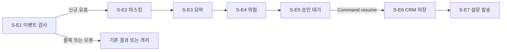

# W-3 상담 종료 이벤트 처리 워크플로우

## 개요

상담 종료 이벤트 검사에서 시작해 마스킹, 요약, 위험, 승인, CRM 저장, 설문 발송을 순서대로 처리함.  
중복 또는 오류 이벤트는 `S-E1`에서 종료함. `S-E5` 승인 뒤에만 바깥 쓰기를 실행함.



## 노드

| 워크플로우 | 단계ID | 노드 함수 이름 | 담당자 | 시간 제한 설정 | 다음 노드 |
|---|---|---|---|---|---|
| W-3 | S-E1 | `node_w3_s_e1_validate_event` | R-D1 | `s_e1_timeout_ms` | S-E2 또는 종료 |
| W-3 | S-E2 | `node_w3_s_e2_mask_transcript` | R-D1 | `s_e2_timeout_ms` | S-E3 |
| W-3 | S-E3 | `node_w3_s_e3_write_summary` | R-L1 | `s_e3_timeout_ms` | S-E4 |
| W-3 | S-E4 | `node_w3_s_e4_calculate_risk` | R-D1 | `s_e4_timeout_ms` | S-E5 |
| W-3 | S-E5 | `node_w3_s_e5_review_crm` | R-H3 | `s_e5_timeout_ms` | S-E6 |
| W-3 | S-E6 | `node_w3_s_e6_save_crm` | R-H3 | `s_e6_timeout_ms` | S-E7 |
| W-3 | S-E7 | `node_w3_s_e7_send_survey` | R-H4 | `s_e7_timeout_ms` | 종료 |

## 담당자 모듈

| 담당자 | 종류 | 모듈 파일 | 모델 | 워크플로우 | 호출 인터페이스 |
|---|---|---|---|---|---|
| R-L1 | LLM | `help_desk_workflow/roles/r_l1.py` | 사용 | W-1, W-2, W-3 | `model_invoke` |
| R-D1 | Deterministic | `help_desk_workflow/roles/r_d1.py` | 미사용 | W-1, W-2, W-3 | `operations` |
| R-H3 | Human | `help_desk_workflow/roles/r_h3.py` | 미사용 | W-3 | `interrupt`, CRM operation |
| R-H4 | Human | `help_desk_workflow/roles/r_h4.py` | 미사용 | W-3 | 설문 동의, 설문 operation |

## 진입 함수 의존성

`07-api-ui.md`의 조립 루트가 채워야 하는 항목임.  
조립 표의 행 수는 아래 두 표의 행 수 합과 같아야 함.

### 진입 함수 인자

| 진입 함수 | 인자 | 어느 프롬프트가 만든 것 | 언제 만드나 |
|---|---|---|---|
| `run_consultation_closed` | `graph` | 06 `build_consultation_closed_graph` | 이벤트마다 |
| `run_consultation_closed` | `request` | 07 구독자가 받은 이벤트 | 이벤트마다 |
| `run_consultation_closed` | `job_type` | 07 구독자 | 이벤트마다 |
| `resume_consultation_closed` | `graph` · `thread_id` · `decision` | 06 · 07 · 07 | 요청마다 |

### 흐름 조립 의존성 `build_consultation_closed_graph`

| 의존성 | 무엇 | 어느 프롬프트가 만든 것 | 언제 만드나 |
|---|---|---|---|
| `settings` | 설정 로더 | 01 | 기동 시 1회 |
| `deadline` | 이벤트 마감선 | 01 | 이벤트마다 |
| `operations` | R-D1 단계 3개와 사람 단계 2개: S-E1 · S-E2 · S-E4 · S-E6 · S-E7 | 06 계약 · 04를 부름 | 이벤트마다 |
| `model_invoke` | R-L1 모델 호출자 | 01 어댑터 | 기동 시 1회 |
| `approval_gate` | R-H3 · R-H4 승인 문 | 05 | 이벤트마다 |
| `max_iterations` | 반복 상한 | 01 설정에 칸이 없어 07이 값으로 넣음 | 기동 시 1회 |
| `telemetry` | 단계 기록 콜백 | 05 | 기동 시 1회 |
| `checkpointer` | 중간 저장 장치 | 01 | 기동 시 1회 |

## 조립 표

**조립 루트가 아직 없음.** 아래 12건 전부 못 채운 상태임.

| 의존성 | 어느 프롬프트가 만든 것 | 언제 만드나 | 못 채웠으면 사유 |
|---|---|---|---|
| `graph` · `request` · `job_type` · `thread_id` · `decision` | 06 · 07 | 이벤트·요청마다 | **못 채움**: 메시지 브로커 구독 조립이 먼저 필요함 |
| `settings` · `deadline` · `model_invoke` · `checkpointer` | 01 | 기동 시 1회 · 이벤트마다 | **못 채움**: 조립 루트 없음 |
| `operations` (S-E1 · S-E2 · S-E4 · S-E6 · S-E7) | 06 계약 · 04 | 이벤트마다 | **못 채움**: R-D1 단계 3개와 사람 단계 2개의 실제 처리 함수 미작성 |
| `approval_gate` · `max_iterations` · `telemetry` | 05 · 07 · 05 | 이벤트마다 · 기동 시 1회 | **못 채움**: 조립 루트 없음 |

S-E7 설문 발송은 **되돌릴 수 없는 쓰기**임. 조립할 때 승인 표시 없이 불리지 않는지 먼저 확인할 것.  
따라서 `POST /internal/crm-record-reviews/{review_id}/decisions`는 준비 미완료로 응답함.  
`p1_sync_inquiry/runtime.py`가 같은 구조의 참고 구현임.

## 상한과 착지

| 상한 종류 | 출처 | 착지 | 사유 필드 |
|---|---|---|---|
| 단계 시간 | ③ `타임아웃`과 01 `stage_budgets` | 안전 종료 | `_workflow.landing_reason` |
| 반복 | ③ 반복 구간 0건 | 해당 없음 | 해당 없음 |
| 흐름 전체 단계 | 사용자 확정 9 | LangGraph 중단 | LangGraph 재귀 상한 오류 |

## 재개

| 재개 단위 | 경계 | 중복 방지 키 | 부작용 |
|---|---|---|---|
| 상담 종료 이벤트 1건 | S-E1부터 S-E7 성공 직후 | W-3 + event ID + 작업 종류 | CRM 중복 저장과 설문 중복 발송 가능 |

## 인터페이스와 확인필요

| 구분 | 내용 |
|---|---|
| 재사용 | 05 `ApprovalGate`를 직접 사용하고 `ExternalTools`는 `operations` 어댑터로 연결함 |
| 조정 | CRM과 설문 재시도를 흐름에 추가하지 않고 커넥터 계층만 사용함 |
| 확인필요 | 0건 |
| 변경요청 | ③ State에 API 입력, 응답, 단계 중간결과, 흐름 제어 필드 소유 규칙 추가 필요 |

## 되묻기로 정한 값

| 항목 | 확정값 | ③ 반영 권고 |
|---|---|---|
| 전체 단계 상한 | 9 | 흐름 상한 열 추가 |
| 병렬 합류 | 즉시 진행과 누락 표기 | 병렬 0건, 향후 규칙 기록 |
| 인간 개입 | 노드 앞 중단, 별도 중단 채널, State 재정의 | 재진입 경로 기록 |
| 동시 실행 | 1 | 부하 조건 기록 |
| 재시도 계층 | 커넥터만 | 단일 소유자 기록 |

## 이벤트 구독자와 내부 승인 API

| 진입 형태 | 경로 또는 클래스 | 설계 출처 | 바깥 공개 |
|---|---|---|:---:|
| 이벤트 구독자 | `ConsultationClosedSubscriber` | ③ W-3 이벤트 | 아니오 |
| 내부 승인 API | `POST /internal/crm-record-reviews/{review_id}/decisions` | ③ P-3 API | 아니오 |
| 상태 확인 | `GET /health/live`, `GET /health/ready` | ⑧ 배포 입력 | 아니오 |

이벤트 수신은 공개 HTTP 경로를 만들지 않고 구독자 어댑터로 구현함.  
내부 API 포트는 `HELP_DESK_P3_INTERNAL_PORT`로 읽으며 `.env.example` 기본값은 8082임.

### Windows Git Bash

```bash
uv sync --group dev
uv run uvicorn p3_conversation_closed_event.api:app --port "$HELP_DESK_P3_INTERNAL_PORT"
```

### Windows PowerShell

```powershell
uv sync --group dev
uv run uvicorn p3_conversation_closed_event.api:app --port $env:HELP_DESK_P3_INTERNAL_PORT
```

### Linux 또는 macOS

```bash
uv sync --group dev
uv run uvicorn p3_conversation_closed_event.api:app --port "$HELP_DESK_P3_INTERNAL_PORT"
```
